# 业务 01 · 产品概述

> 本章节介绍 Observable Ops 平台的产品定位、核心价值主张及八大能力体系，帮助读者建立对智能运维可观测性平台的整体认知。

---

## 1. 产品定位

### 1.1 产品命名

**Observable Ops** — 智能系统运维可观测性平台

- **Observable**（可观测性）：源于云原生时代的三 pillars — Metrics（指标）、Logs（日志）、Traces（追踪），代表对系统内部状态的全面感知能力
- **Ops**（运维）：从传统运维到智能运维的升级，不只是「操作」更是「运营」
- 平台命名强调：**可观测性是智能运维的基础，没有可见性就没有可控性**

### 1.2 产品价值链路

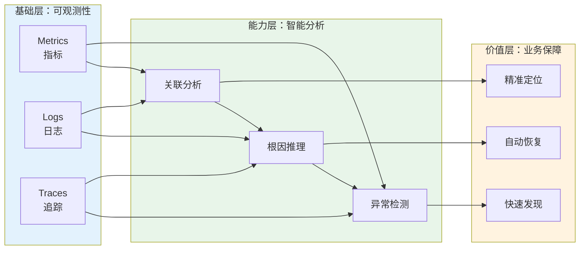

### 1.3 目标用户画像

| 用户角色 | 痛点 | 使用场景 | 核心诉求 |
|----------|------|----------|----------|
| SRE / 运维工程师 | 告警疲劳、故障定位慢 | 日常巡检、故障处理 | 快速解决问题 |
| 运维经理 | 团队效率难以量化、知识流失 | 团队管理、汇报分析 | 可视化、可管理 |
| 开发工程师 | 服务间依赖不清晰、故障时互相推诿 | 服务上线、故障协同 | 快速协同定位 |
| CTO / 技术 VP | 业务连续性风险、运维成本不透明 | 战略决策、成本管控 | 降低风险和成本 |

### 1.4 用户旅程与痛点链路

```mermaid
flowchart LR
    subgraph 发现["发现阶段"]
        A1[系统告警<br/>触发] --> A2[告警泛滥<br/>真假难辨]
        A2 --> A3[定位问题<br/>无从下手]
    end
    
    subgraph 分析["分析阶段"]
        A3 --> B1[查监控面板]
        B1 --> B2[查日志系统]
        B2 --> B3[查调用链]
        B3 --> B4[跨团队讨论]
    end
    
    subgraph 修复["修复阶段"]
        B4 --> C1[制定修复方案]
        C1 --> C2[申请变更审批]
        C2 --> C3[执行人工修复]
        C3 --> C4[验证修复效果]
    end
    
    subgraph 知识["知识沉淀（常被遗忘）"]
        C4 -.-> D1[经验留在个人脑中]
        D1 --> D2[人员离职即断层]
        D2 --> D3[下次重复同样的排查]
    end
    
    style 发现 fill:#ff6b6b
    style 分析 fill:#feca57
    style 修复 fill:#f8fafc
    style 知识 fill:#f3e5f5
```

### 1.5 核心价值主张

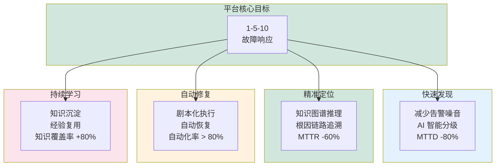

### 1.6 产品架构总览

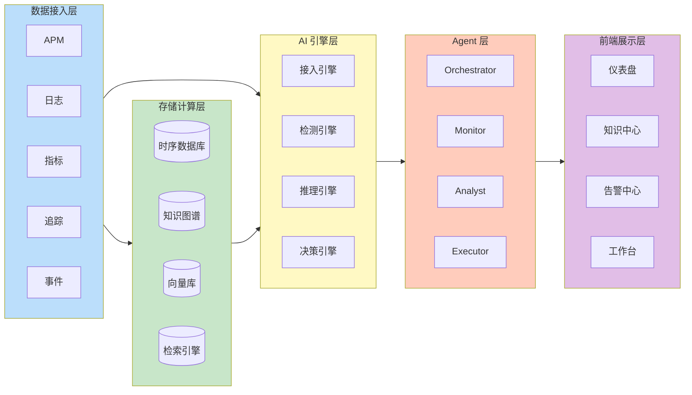

### 1.7 核心定位

| 维度 | 传统定位 | 智能定位 |
|------|----------|----------|
| 从「监控」到「认知」 | 只看数据表面 | 理解数据背后的业务含义 |
| 从「人工」到「智能」 | 重复性人工操作 | AI Agent 替代 80% 人工 |
| 从「被动」到「主动」 | 故障发生后才知 | 预测性运维，提前发现风险 |

---

## 2. 行业背景

### 2.1 可观测性发展历程

运维可观测性经历了六个阶段的演进，从人工巡检到 Autonomous Ops，技术重心不断升级：

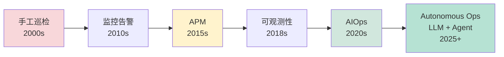

| 阶段 | 核心能力 | 代表产品 |
|------|----------|----------|
| 手工巡检 | 人工检查服务器状态 | nagios |
| 监控告警 | 阈值告警、邮件通知 | Zabbix、Prometheus |
| APM | 应用性能追踪、调用链分析 | Skywalking、Jaeger |
| 可观测性 | 统一数据模型、三 pillars 融合 | Grafana、Elastic |
| AIOps | 异常检测、根因分析智能化 | 华为云、阿里云 |
| Autonomous Ops | LLM + Agent 全自动化 | Observable Ops |

### 2.2 运维挑战关系图

传统运维面临五大核心挑战，彼此关联、形成恶性循环：

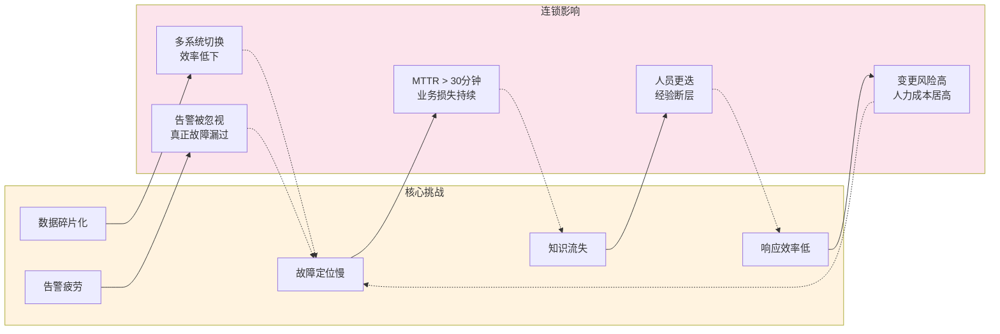

### 2.3 行业数据

| 数据来源 | 关键发现 |
|----------|----------|
| Gartner | 到 2025 年，50% 的企业将使用 AIOps 平台替代传统监控工具 |
| Ponemon Institute | 故障平均每次损失约 30 万美元 |
| ITIC | 98% 的组织表示每小时宕机损失超过 10 万美元 |
| PagerDuty | 平均每个运维工程师每天处理 150+ 条告警，其中 70% 是误报 |
| IDC | 到 2027 年，全球 AIOps 市场规模将超过 400 亿美元 |

### 2.4 故障成本模型

故障损失随时间快速累积，每分钟成本呈指数级增长：

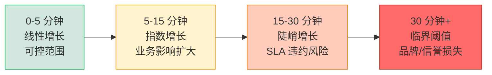

**关键数据：**
- ITIC：98% 的组织每小时宕机损失超过 **10 万美元**
- Ponemon Institute：单次故障平均损失 **30 万美元**
- MTTR 每缩短 1 分钟，相当于节省 **1.5 万美元/次**

### 2.5 监管与合规要求

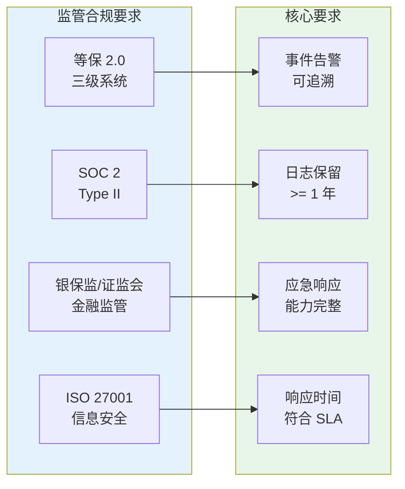

| 法规 | 适用场景 | 核心要求 |
|------|----------|----------|
| 等保 2.0（三级） | 网络设备、安全设备、服务器监控 | 事件告警需可追溯，审计日志保留 ≥ 6 个月 |
| SOC 2 Type II | SaaS / 云服务提供商 | 系统可用性、安全性持续监控，审计日志保留 ≥ 1 年 |
| 银保监/证监会 | 金融机构核心系统 | 完整的监控和应急响应能力，故障报告 ≤ 1 小时 |
| ISO 27001 | 全行业信息安全 | 安全事件规定时间内响应和处置 |

---


## 3. 核心目标

### 3.1 战略目标（1-5-10 故障响应）

故障响应速度是智能运维的核心指标，Observable Ops 承诺 1-5-10 闭环：

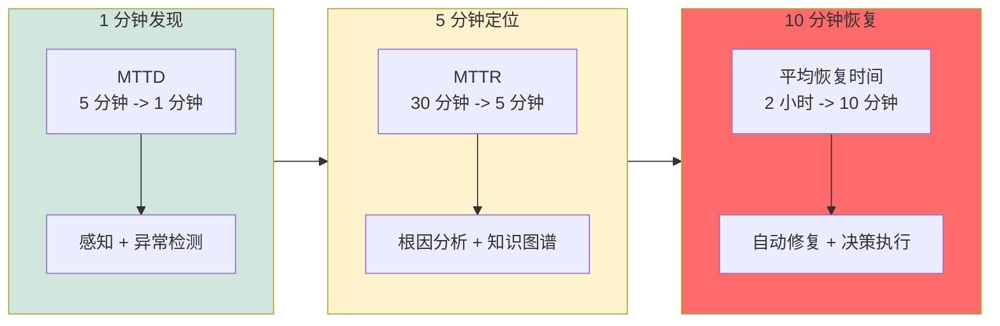

**目标对照表：**

| 阶段 | 指标 | 传统运维 | 智能运维 | 提升幅度 | 核心能力 |
|------|------|----------|----------|----------|----------|
| 1 分钟发现 | MTTD | 5 分钟 | 1 分钟 | -80% | 感知 + 异常检测 |
| 5 分钟定位 | MTTR | 30 分钟 | 5 分钟 | -83% | 根因分析 + 知识图谱 |
| 10 分钟恢复 | 平均恢复时间 | 2 小时 | 10 分钟 | -92% | 自动修复 + 决策执行 |

### 3.2 运营目标体系

五大运营目标构成完整的效果衡量体系：

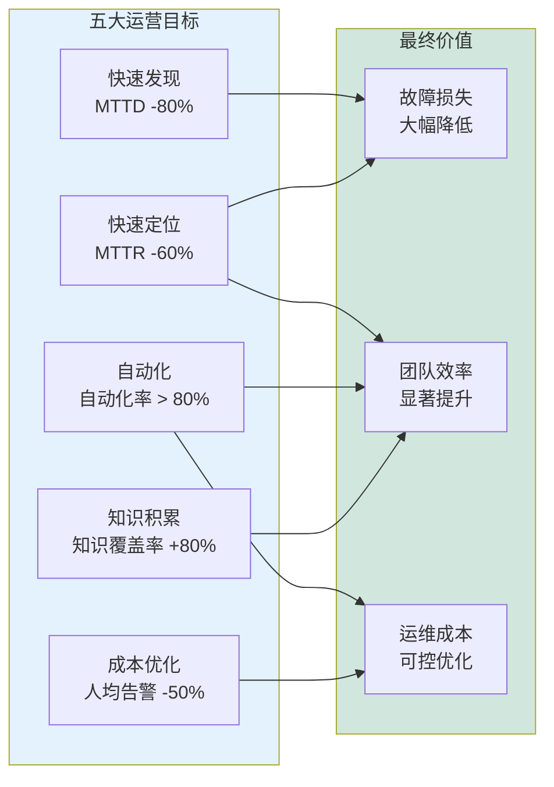

**运营目标明细：**

| 目标 | 描述 | 关键指标 | 度量方式 |
|------|------|----------|----------|
| 快速发现 | 降低 MTTD，提升故障发现效率 | MTTD -80% | 平均告警确认时间 |
| 快速定位 | 缩短故障定位时间 | MTTR -60% | 平均故障定位时长 |
| 自动化 | 减少人工干预，提升自动化覆盖率 | 自动化率 > 80% | 自动修复占比 |
| 知识积累 | 运维经验可沉淀、可复用 | 知识覆盖率 +80% | 知识库条目增长 |
| 成本优化 | 减少无效告警，降低人力消耗 | 人均告警处理 -50% | 有效告警比率 |

### 3.3 边界定义

平台有明确的职责边界，清晰定义覆盖范围与不覆盖范围：

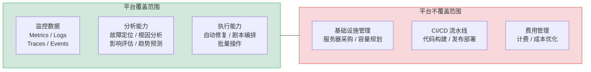

**✅ 平台覆盖范围：**
- **监控数据**：指标（Metrics）、日志（Logs）、追踪（Traces）、事件（Events）、告警（Alerts）
- **分析能力**：故障定位、根因分析、影响评估、趋势预测
- **执行能力**：自动修复、剧本编排、批量操作

**❌ 平台不覆盖范围：**
- 基础设施资源管理（服务器采购、容量规划）
- CI/CD 流水线（代码构建、发布部署）
- 费用管理（云资源计费、成本优化）

---

## 4. AIOps 范式转变

### 4.1 传统 Ops vs AIOps 范式对比

运维从「告警驱动」到「认知驱动」，是质的范式转变：

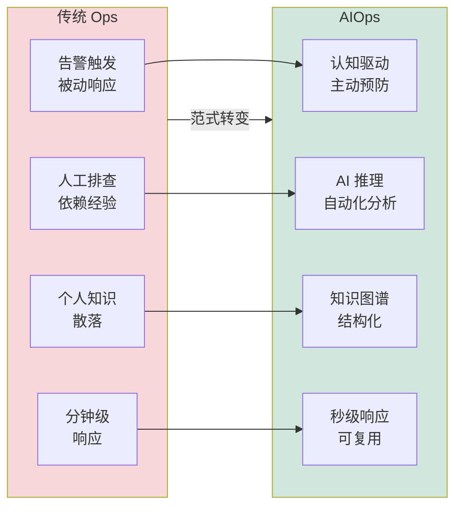

**详细对比：**

| 维度 | 传统 Ops | AIOps |
|------|----------|-------|
| 触发方式 | 告警触发 | 认知驱动 |
| 处理方式 | 人工排查 | AI 推理 |
| 知识形式 | 个人经验（散落） | 结构化知识图谱 |
| 响应速度 | 分钟级 | 秒级 |
| 可复现性 | 低（依赖个人） | 高（知识共享） |
| 学习能力 | 无 | 持续学习迭代 |
| 扩展性 | 线性（人越多处理越多） | 指数（AI 可复制） |

### 4.2 传统运维痛点链路

传统运维痛点形成恶性循环，相互叠加：

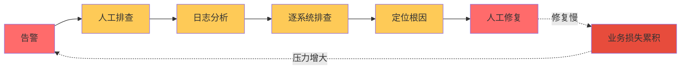

**痛点总结：**

1. **告警驱动的被动响应** — 故障已经发生才知道
2. **依赖个人经验的碎片化知识** — 人员离职即知识断层
3. **人工逐系统排查效率低下** — 平均需要 30 分钟以上
4. **修复方案无法自动复用** — 每次都从头开始
5. **恶性循环难以打破** — 业务压力 → 告警增多 → 效率更低

### 4.3 AIOps 核心引擎架构

AIOps 核心创新在于「AI 引擎 + 知识图谱 + Agent 协作」三大能力：

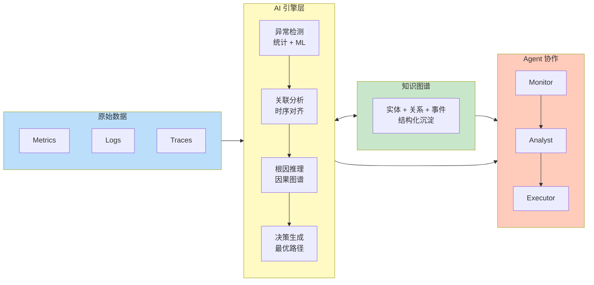

**三大创新点说明：**

| 创新点 | 传统 Ops 没有 | AIOps 做法 | 价值 |
|--------|------------|-----------|------|
| AI 引擎 | 阈值告警，无智能 | 4 级智能引擎：检测→关联→推理→决策 | 准确率 > 90% |
| 知识图谱 | 经验散落在人脑 | 实体+关系+事件结构化沉淀 | 知识可复用 |
| Agent 协作 | 人工跨系统操作 | 3 类 Agent 协同：感知→分析→执行 | 自动化 > 80% |

**数据流 vs 知识流：**

| 流类型 | 路径 | 方向 |
|--------|------|------|
| 数据流 | 输入 → AI 引擎 → Agent | 单向 |
| 知识流 | 引擎 ↔ 知识图谱 ↔ Agent | **双向反馈** |
| 学习流 | Agent 执行结果 → 知识图谱更新 | 持续积累 |

### 4.4 AIOps 价值闭环

AIOps 通过感知 → 认知 → 决策 → 行动 → 学习形成闭环价值：

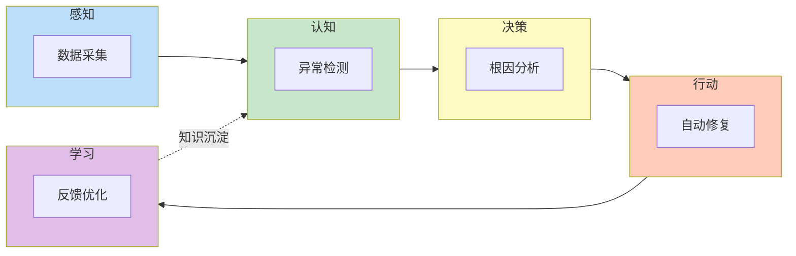

**核心价值：**

| 价值维度 | 传统模式 | AIOps 模式 | 提升效果 |
|----------|----------|------------|----------|
| 故障发现 | 5+ 分钟 | 1 分钟 | MTTD -80% |
| 根因定位 | 30+ 分钟 | 5 分钟 | MTTR -83% |
| 故障恢复 | 2+ 小时 | 10 分钟 | 恢复时间 -92% |
| 知识积累 | 经验散落 | 知识图谱 | 可复用 +80% |
| 团队效率 | 线性扩展 | 指数扩展 | AI 可复制 |

---

## 5. 核心能力体系（八大能力）

Observable Ops 围绕「**规划 → 建模 → 感知 → 认知 → 分析 → 决策 → 执行 → 学习**」构建八大能力，形成完整闭环。

### 5.1 能力总览

| 序号 | 能力 | 描述 | 关键指标 |
|------|------|------|----------|
| 01 | 规划 | 运维场景建模与指标体系设计 | 覆盖率 > 95% |
| 02 | 建模 | 业务拓扑、服务依赖、资源关系 | 准确率 > 98% |
| 03 | 感知 | 全量数据采集、实时事件检测 | 延迟 < 1s |
| 04 | 认知 | 知识图谱构建、运维知识推理 | 知识覆盖率 +80% |
| 05 | 分析 | 根因定位、异常检测、趋势预测 | 准确率 > 90% |
| 06 | 决策 | 智能策略生成、最优路径规划 | MTTR -60% |
| 07 | 执行 | 自动修复、剧本编排、批量操作 | 自动化率 > 80% |
| 08 | 学习 | 反馈优化、知识更新、模型迭代 | 进化周期 < 24h |

### 5.2 能力阶段划分

八大能力按职能划分为三个阶段：**基础层**（数据资产）→ **智能层**（分析决策）→ **执行层**（行动反馈）：

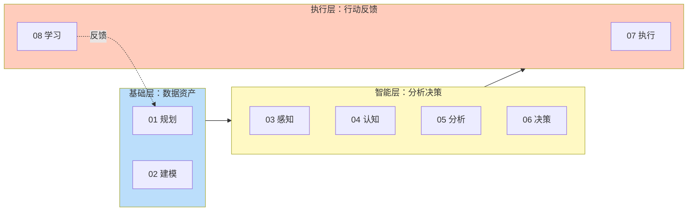

**阶段职责说明：**

| 阶段 | 能力 | 核心职责 |
|------|------|----------|
| 基础层 | 01 规划、02 建模 | 数据资产准备，定义「看什么」和「怎么连」 |
| 智能层 | 03 感知、04 认知、05 分析、06 决策 | 智能分析，从「看见」到「判断」 |
| 执行层 | 07 执行、08 学习 | 行动闭环，从「决策」到「进化」 |

### 5.3 能力闭环关系

八大能力形成完整闭环：规划 → 建模 → 感知 → 认知 → 分析 → 决策 → 执行 → 学习 → 回到规划：

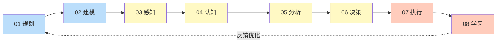

**依赖关系说明：**
- **规划** 是入口能力：先建模才能感知，先感知才能分析
- **学习** 是闭环能力：每次执行后学习，形成反馈优化
- **执行** 是交付能力：所有分析最终都要通过执行落地

### 5.4 八大能力详解

**01 规划**
- **职责**：定义运维场景、确定监控指标、规划数据采集策略
- **输入**：业务需求、SLA 目标、合规要求
- **输出**：监控指标体系、采集策略、告警规则
- **核心价值**：避免「数据爆炸但无洞察」的问题

**02 建模**
- **职责**：构建业务拓扑、服务依赖、资源关系图谱
- **输入**：服务清单、资源清单、网络拓扑
- **输出**：业务拓扑图、依赖关系矩阵、影响范围模型
- **核心价值**：让 AI 理解系统全貌，根因分析有据可依

**03 感知**
- **职责**：实时采集指标、日志、追踪、事件多源数据
- **输入**：各类数据源（APM/日志/指标/追踪）
- **输出**：标准化数据流、实时事件流、异常告警
- **核心价值**：1 分钟内发现故障（MTTD -80%）

**04 认知**
- **职责**：构建运维知识图谱，支持知识推理
- **输入**：标准化数据 + 历史经验 + 专家知识
- **输出**：实体-关系-事件知识网络、推理结果
- **核心价值**：将散落经验结构化沉淀，可复用 +80%

**05 分析**
- **职责**：根因定位、异常检测、趋势预测
- **输入**：实时数据 + 知识图谱 + 历史案例
- **输出**：根因结论、影响范围、未来趋势
- **核心价值**：5 分钟内定位故障（MTTR -60%）

**06 决策**
- **职责**：智能生成修复策略，规划最优执行路径
- **输入**：根因结论 + 风险评估 + 知识匹配
- **输出**：执行方案、审批要求、回滚预案
- **核心价值**：从「分析」到「行动」的关键桥梁

**07 执行**
- **职责**：自动修复、剧本编排、批量操作
- **输入**：执行方案 + 权限 + 环境状态
- **输出**：操作日志、结果验证、影响评估
- **核心价值**：自动化率 > 80%，10 分钟内恢复故障

**08 学习**
- **职责**：反馈优化、知识更新、模型迭代
- **输入**：执行结果 + 用户反馈 + 效果评估
- **输出**：更新后的知识图谱、优化的模型、改进的策略
- **核心价值**：系统持续进化，进化周期 < 24h

---

## 6. 端到端认知闭环

Observable Ops 围绕「**输入 → 处理 → 分析 → 行动 → 反馈**」形成端到端认知闭环，每一阶段输出都作为下一阶段输入，反馈环节形成进化动力。

### 6.1 全链路流程总览

五阶段从数据采集到系统进化形成完整闭环：

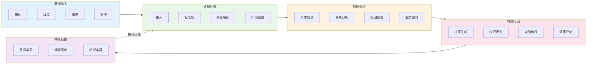

### 6.2 5 阶段能力详解

**第一阶段：数据输入**

| 环节 | 输入 | 处理逻辑 | 输出 | 质量指标 |
|------|------|----------|------|----------|
| **指标采集** | 服务/系统指标 | 时序数据点 | 标准化指标流 | 采集完整率 > 99% |
| **日志采集** | 应用/系统日志 | 解析 + 结构化 | 结构化日志 | 字段完整率 > 95% |
| **追踪采集** | 分布式调用链 | Span 关联 | 完整调用链 | 链路完整率 > 90% |
| **事件采集** | 业务/运维事件 | 事件归一化 | 标准化事件 | 事件捕获率 > 99% |

**第二阶段：认知处理**

| 环节 | 输入 | 处理逻辑 | 输出 | 质量指标 |
|------|------|----------|------|----------|
| **数据接入** | 原始日志/指标 | 数据清洗、格式标准化 | 统一数据模型 | 数据完整率 > 99% |
| **数据标准化** | 原始数据 | 字段映射、单位统一、时间对齐 | 标准化数据流 | 标准化率 > 98% |
| **多源融合** | 多系统数据 | 实体对齐、关联构建 | 融合事件 | 融合准确率 > 95% |
| **知识图谱** | 标准化数据 | 实体抽取、关系挖掘 | 知识网络 | 知识覆盖率 > 80% |

**第三阶段：智能分析**

| 环节 | 输入 | 处理逻辑 | 输出 | 质量指标 |
|------|------|----------|------|----------|
| **异常检测** | 指标流 | 统计 + ML 混合检测 | 异常事件 | 召回率 > 90% |
| **关联分析** | 异常事件 + KG | 因果推理、同步分析 | 相关事件 | 关联准确率 > 85% |
| **根因推理** | 关联事件 | 传播路径 + 知识匹配 | 根因结论 | 根因准确率 > 80% |
| **趋势预测** | 历史数据 | 时序预测 + 异常预警 | 预测报告 | 预测准确率 > 85% |

**第四阶段：响应行动**

| 环节 | 输入 | 处理逻辑 | 输出 | 质量指标 |
|------|------|----------|------|----------|
| **决策生成** | 根因 + 风险 | 策略匹配 + 路径规划 | 决策方案 | 决策准确率 > 90% |
| **执行规划** | 决策方案 | 步骤拆解 + 审批配置 | 执行计划 | 计划完整率 > 95% |
| **自动执行** | 执行计划 | 脚本调用 + 状态监控 | 执行日志 | 执行成功率 > 95% |
| **效果评估** | 执行结果 | 指标对比 + 影响分析 | 评估报告 | 评估准确率 > 90% |

**第五阶段：持续反馈**

| 环节 | 输入 | 处理逻辑 | 输出 | 质量指标 |
|------|------|----------|------|----------|
| **反馈学习** | 评估报告 | 经验提取 + 知识更新 | 学习成果 | 学习覆盖率 > 80% |
| **模型进化** | 全量数据 | 模型重训 + 性能监控 | 新模型 | 模型准确率 +5% |
| **知识丰富** | 新增经验 | 知识入库 + 关系更新 | 知识增量 | 知识增长率 > 10% |

### 6.3 反馈学习机制

反馈环节是闭环的关键驱动力，确保系统持续进化：

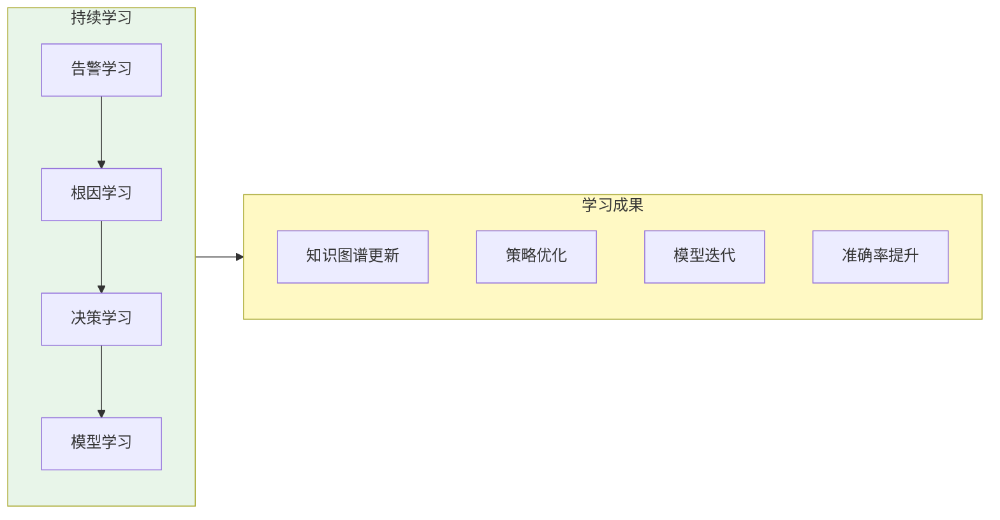

**学习类型对照表：**

| 学习类型 | 内容 | 触发时机 | 更新频率 |
|----------|------|----------|----------|
| 告警学习 | 告警有效性评估、误报模式识别 | 每次告警确认后 | 实时 |
| 根因学习 | 根因分析结果验证、知识更新 | 每次故障定位完成后 | 每事件 |
| 决策学习 | 执行效果评估、策略优化 | 每次自动执行后 | 每日 |
| 模型学习 | 模型性能监控、自动迭代 | 定期评估触发 | 每周 |

### 6.4 闭环价值度量

闭环价值通过四个维度度量：

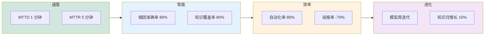

**价值度量表：**

| 维度 | 指标 | 目标值 | 度量周期 |
|------|------|--------|----------|
| 速度 | MTTD（平均发现时间） | 1 分钟 | 实时 |
| 速度 | MTTR（平均恢复时间） | 5 分钟 | 实时 |
| 智能 | 根因准确率 | > 80% | 每周 |
| 智能 | 知识覆盖率 | > 80% | 每月 |
| 效率 | 自动化覆盖率 | > 80% | 每月 |
| 效率 | 误报率降低 | -70% | 每周 |
| 进化 | 模型迭代周期 | < 1 周 | 每周 |
| 进化 | 知识增长率 | > 10%/月 | 每月 |

---

## 7. Agent 协作体系

Agent 协作体系是 Observable Ops 的核心执行单元，通过 6 类专业 Agent 协同完成感知→分析→决策→执行全流程。

### 7.1 Agent 类型总览

| Agent 类型 | 所属层级 | 职责 | 核心能力 |
|------------|----------|------|----------|
| Orchestrator | 调度层 | 全局调度与决策 | 任务分解、资源协调、策略制定 |
| Monitor Agent | 感知层 | 数据采集与异常检测 | 指标监控、日志分析、告警触发 |
| Analyst Agent | 分析层 | 根因分析与知识推理 | 关联分析、因果推理、知识检索 |
| Investigator Agent | 分析层 | 深度调查与取证 | 日志挖掘、追踪分析、模式识别 |
| Executor Agent | 执行层 | 自动修复与操作执行 | 脚本执行、配置变更、批处理 |
| Notifier Agent | 通知层 | 通知与协调 | 告警通知、升级处理、审批协调 |

### 7.2 Agent 分层架构

6 类 Agent 按职责划分为 5 个层级，形成清晰的协作架构：

```mermaid
flowchart LR
    subgraph 通知层["通知层"]
        NOTI[Notifier<br/>通知协调]
    end
    
    subgraph 执行层["执行层"]
        EXEC[Executor<br/>自动修复]
    end
    
    subgraph 分析层["分析层"]
        direction TB
        ANAL[Analyst<br/>根因推理]
        INV[Investigator<br/>深度调查]
    end
    
    subgraph 感知层["感知层"]
        MON[Monitor<br/>数据采集]
    end
    
    subgraph 调度层["调度层"]
        ORCH[Orchestrator<br/>全局调度]
    end
    
    通知层 --> 调度层
    执行层 --> 通知层
    分析层 --> 执行层
    感知层 --> 分析层
    调度层 -.全局指挥.-> 感知层
    调度层 -.全局指挥.-> 分析层
    调度层 -.全局指挥.-> 执行层
    
    style 调度层 fill:#e1bee7
    style 感知层 fill:#bbdefb
    style 分析层 fill:#fff9c4
    style 执行层 fill:#ffccbc
    style 通知层 fill:#c8e6c9
```

**层级职责说明：**

| 层级 | Agent | 核心职责 |
|------|-------|----------|
| 调度层 | Orchestrator | 接收任务、分解步骤、协调资源、制定策略 |
| 感知层 | Monitor Agent | 采集数据、检测异常、触发告警 |
| 分析层 | Analyst + Investigator | 根因推理、深度调查、模式识别 |
| 执行层 | Executor Agent | 执行修复、批量操作、回滚处理 |
| 通知层 | Notifier Agent | 通知相关人、升级处理、审批协调 |

### 7.3 协作时序

典型的故障处理时序展示 Agent 间协作关系：

```mermaid
sequenceDiagram
    participant U as 用户/系统
    participant O as Orchestrator
    participant M as Monitor
    participant A as Analyst
    participant I as Investigator
    participant E as Executor
    participant N as Notifier
    
    U->>O: 触发事件
    O->>M: 请求数据采集
    M-->>O: 原始数据
    O->>A: 请求分析
    A->>I: 深度调查
    I-->>A: 调查结果
    A-->>O: 根因分析
    O->>O: 决策规划
    O->>E: 下发执行
    E-->>O: 执行结果
    O->>N: 通知结果
    N->>U: 同步用户
```

**时序关键节点：**

| 阶段 | 主调用方 | 被调用方 | 耗时目标 |
|------|----------|----------|----------|
| 1. 触发 | 用户/系统 | Orchestrator | < 1s |
| 2. 感知 | Orchestrator | Monitor | < 30s |
| 3. 分析 | Orchestrator | Analyst + Investigator | < 5 分钟 |
| 4. 决策 | Orchestrator | Orchestrator 内部 | < 10s |
| 5. 执行 | Orchestrator | Executor | < 5 分钟 |
| 6. 通知 | Orchestrator | Notifier | < 30s |

### 7.4 6 类 Agent 详解

**01 Orchestrator（调度 Agent）**
- **角色**：指挥官、全局大脑
- **职责**：接收外部请求、任务分解、资源协调、策略制定
- **输入**：告警事件、用户请求、巡检任务
- **输出**：分解后的子任务、执行计划、决策结论
- **工具**：任务调度器、决策引擎、状态管理

**02 Monitor Agent（监控 Agent）**
- **角色**：哨兵、感知器
- **职责**：全量数据采集、实时异常检测、告警触发
- **输入**：指标流、日志流、追踪流
- **输出**：标准化数据、异常事件、告警信号
- **工具**：指标查询、日志检索、追踪查询、告警订阅

**03 Analyst Agent（分析 Agent）**
- **角色**：分析师、推理者
- **职责**：根因分析、关联推理、知识匹配
- **输入**：异常事件 + 知识图谱 + 历史案例
- **输出**：根因结论、影响范围、修复建议
- **工具**：知识图谱查询、因果推理、向量检索

**04 Investigator Agent（调查 Agent）**
- **角色**：侦探、调查员
- **职责**：深度日志挖掘、链路追踪分析、模式识别
- **输入**：告警上下文、时间范围、相关服务
- **输出**：调用链详情、关键日志、异常模式
- **工具**：链路追踪、日志挖掘、Trace 分析

**05 Executor Agent（执行 Agent）**
- **角色**：操作员、执行者
- **职责**：自动修复、剧本编排、批量操作
- **输入**：执行方案、权限凭证、环境信息
- **输出**：操作日志、执行结果、状态变更
- **工具**：脚本执行、API 调用、K8s 操作、配置变更

**06 Notifier Agent（通知 Agent）**
- **角色**：通讯员、协调员
- **职责**：告警通知、升级处理、审批协调
- **输入**：事件信息、通知对象、升级策略
- **输出**：通知消息、审批请求、确认回执
- **工具**：邮件、企业微信、短信、电话、审批流

### 7.5 工具调用能力矩阵

| Agent | 数据工具 | 分析工具 | 执行工具 | 通知工具 |
|-------|----------|----------|----------|----------|
| Orchestrator | — | 决策引擎 | 任务调度器 | 状态推送 |
| Monitor | 指标拉取 / 日志查询 | 异常检测 | 告警触发 | — |
| Analyst | KG 查询 | 因果推理 / 向量检索 | 案例匹配 | — |
| Investigator | Trace / 日志挖掘 | 模式识别 | 上下文拉取 | — |
| Executor | 配置查询 | 风险评估 | 脚本 / API / K8s | 执行通知 |
| Notifier | — | 通知策略 | 审批流 | 邮件 / 企微 / 短信 |

**工具能力层级说明：**
- **数据工具**：采集和查询类（指标、日志、追踪）
- **分析工具**：智能处理类（推理、检索、识别）
- **执行工具**：操作类（脚本、API、调度）
- **通知工具**：通信类（邮件、IM、电话）

---

## 8. 自动化响应体系

自动化响应是 AIOps 的最终交付能力，通过分级策略、安全机制、审批工作流实现「快速恢复 + 风险可控」。

### 8.1 响应策略分级

| 策略类型 | 触发条件 | 执行动作 | 审批要求 | 风险等级 |
|----------|----------|----------|----------|----------|
| 自动恢复 | 已知错误模式 + 低风险 | 执行修复脚本 | 无需审批 | 低 |
| 限流降级 | 流量异常 + 已知原因 | 调整限流阈值 | 自动审批 | 低 |
| 弹性伸缩 | 资源不足 + 低风险 | 扩容/缩容 | 自动审批 | 中 |
| 人工介入 | 未知错误 + 高不确定性 | 通知工程师 | 必须审批 | 高 |
| 紧急止损 | 重大故障 + 业务中断 | 切换/回滚 | 快速审批 | 极高 |

**分级原则：**
- **风险越低 → 自动化越高**：低风险操作无需审批，自动执行
- **风险越高 → 审批越严**：高风险操作必须人工审批
- **业务影响越大 → 响应越快**：紧急止损享有快速审批通道

### 8.2 响应决策树

根据风险等级和业务影响，自动选择响应策略：

```mermaid
flowchart LR
    Q[事件触发] --> Q1{是否已知<br/>错误模式?}
    Q1 -->|是| Q2{风险等级?}
    Q1 -->|否| Q3{业务影响?}
    
    Q2 -->|低| A1[自动恢复]
    Q2 -->|中| A2[弹性伸缩]
    Q2 -->|高| A4[人工介入]
    
    Q3 -->|轻微| A2
    Q3 -->|中断| A5{原因明确?}
    
    A5 -->|是| A3[限流降级]
    A5 -->|否| A4[人工介入]
    
    A5 -.重大故障.-> A6[紧急止损]
    
    style A1 fill:#d1e7dd
    style A2 fill:#d1e7dd
    style A3 fill:#d1e7dd
    style A4 fill:#ffccbc
    style A5 fill:#ffccbc
    style A6 fill:#ff6b6b
```

### 8.3 响应链路（执行阶段详解）

自动化执行经过 4 个阶段：准备 → 执行 → 验证 → 完成：

```mermaid
flowchart LR
    subgraph 准备["执行准备"]
        V1[验证权限]
        V2[备份状态]
        V3[确认目标]
    end
    
    subgraph 执行["执行阶段"]
        E1[步骤 1 执行]
        E2[步骤 2 执行]
        E3[步骤 3 执行]
    end
    
    subgraph 验证["执行验证"]
        C1[结果验证]
        C2[影响验证]
        C3[回滚准备]
    end
    
    subgraph 完成["完成阶段"]
        R[报告生成]
        N[通知相关人]
        K[知识沉淀]
    end
    
    V1 --> V2 --> V3 --> E1 --> E2 --> E3 --> C1 --> C2 --> C3 --> R --> N --> K
    
    style 准备 fill:#e3f2fd
    style 执行 fill:#e8f5e9
    style 验证 fill:#fff3e0
    style 完成 fill:#fce4ec
```

**各阶段耗时目标：**

| 阶段 | 环节 | 耗时目标 | 说明 |
|------|------|----------|------|
| 准备 | 验证权限 | < 5s | 检查执行凭证 |
| 准备 | 备份状态 | < 10s | 备份当前状态 |
| 准备 | 确认目标 | < 5s | 验证目标可达 |
| 执行 | 步骤执行 | < 60s/步 | 单步操作超时 |
| 验证 | 结果验证 | < 30s | 验证执行结果 |
| 验证 | 影响验证 | < 30s | 监控业务指标 |
| 验证 | 回滚准备 | < 10s | 准备回滚预案 |
| 完成 | 报告生成 | < 10s | 生成执行报告 |
| 完成 | 通知相关人 | < 30s | 同步干系人 |
| 完成 | 知识沉淀 | 异步 | 更新知识库 |

### 8.4 安全与回滚机制

5 大安全机制保障自动化执行的可靠性：

```mermaid
flowchart LR
    subgraph 前置["执行前"]
        S1[执行前检查]
        S2[审批机制]
    end
    
    subgraph 中控["执行中"]
        S3[灰度执行]
        S4[实时监控]
    end
    
    subgraph 后置["执行后"]
        S5[自动回滚]
    end
    
    前置 --> 中控 --> 后置
    
    style 前置 fill:#e3f2fd
    style 中控 fill:#fff9c4
    style 后置 fill:#fce4ec
```

**安全机制说明：**

| 安全机制 | 描述 | 触发条件 |
|----------|------|----------|
| 执行前检查 | 操作前预检查（权限、资源状态、环境验证） | 所有操作 |
| 灰度执行 | 先小范围后全量，逐步放量 | 高风险操作 |
| 实时监控 | 执行过程全程监控，关键指标秒级采样 | 自动执行 |
| 自动回滚 | 异常时自动回滚至上一稳定状态 | 执行失败 |
| 审批机制 | 高风险操作必须经过审批，审批可配置 | 重大变更 |

### 8.5 审批工作流

不同风险等级对应不同审批流程：

```mermaid
flowchart TB
    subgraph 低风险["低风险 · 无需审批"]
        L1[自动执行] --> L2[结果记录]
    end
    
    subgraph 中风险["中风险 · 自动审批"]
        M1[自动审批] --> M2[执行] --> M3[结果复核]
    end
    
    subgraph 高风险["高风险 · 人工审批"]
        H1[提交审批] --> H2{审批人决策}
        H2 -->|通过| H3[执行]
        H2 -->|驳回| H4[重新评估]
        H3 --> H5[事后复核]
    end
    
    style 低风险 fill:#d1e7dd
    style 中风险 fill:#fff3cd
    style 高风险 fill:#ffccbc
```

**审批策略表：**

| 风险等级 | 审批人 | 时效要求 | 审批方式 |
|----------|--------|----------|----------|
| 低 | 无需审批 | 即时 | — |
| 中 | 系统自动审批 | < 30s | 规则匹配 |
| 高 | 值班工程师 | < 5 分钟 | 移动审批 |
| 极高 | 值班经理 | < 2 分钟 | 紧急通道 |

---

## 9. 知识沉淀体系

知识沉淀是 AIOps 进化的核心，通过 4 阶段（采集→处理→存储→应用）+ 5 生命周期（产生→验证→应用→更新→淘汰）实现知识资产持续积累。

### 9.1 知识管理框架

知识从采集到应用形成 4 阶段闭环：

```mermaid
flowchart LR
    subgraph 采集["知识采集"]
        direction TB
        E1[故障事件]
        R1[根因分析]
        S1[解决方案]
    end
    
    subgraph 处理["知识处理"]
        direction TB
        C1[分类整理]
        V1[验证确认]
        E2[实体提取]
    end
    
    subgraph 存储["知识存储"]
        direction TB
        KG[知识图谱]
        DOC[文档库]
        CASE[案例库]
    end
    
    subgraph 应用["知识应用"]
        direction TB
        A1[检索查询]
        A2[智能推荐]
        A3[自动匹配]
    end
    
    采集 --> 处理 --> 存储 --> 应用
    应用 -.新知识.-> 采集
    
    style 采集 fill:#e3f2fd
    style 处理 fill:#e8f5e9
    style 存储 fill:#fff9c4
    style 应用 fill:#fce4ec
```

**4 阶段职责：**

| 阶段 | 职责 | 输出物 |
|------|------|--------|
| 采集 | 从事件、分析、解决方案中提取原始素材 | 原始知识素材 |
| 处理 | 分类、验证、实体提取 | 结构化知识 |
| 存储 | 持久化到知识图谱、文档库、案例库 | 可查询知识 |
| 应用 | 支持检索、推荐、匹配 | 知识价值 |

### 9.2 知识类型

4 类知识覆盖运维全场景：

| 知识类型 | 内容示例 | 存储形式 | 价值 |
|----------|----------|----------|------|
| 根因知识 | 「数据库连接池耗尽 → 应用响应超时」 | 知识图谱 | 故障定位 |
| 决策知识 | 「CPU > 90% 持续 5 分钟 → 扩容」 | 决策规则 | 智能决策 |
| 案例知识 | 故障处理全流程记录 | 案例库 | 经验复用 |
| 文档知识 | 运维手册、变更方案、技术规范 | 文档库 | 知识传承 |

### 9.3 知识生命周期

知识从产生到淘汰经历 5 个阶段：

```mermaid
flowchart LR
    L1[产生<br/>从事件提取] --> L2[验证<br/>专家确认] --> L3[应用<br/>推荐匹配] --> L4[更新<br/>持续迭代] --> L5[淘汰<br/>过期归档]
    
    L5 -.可被激活.-> L1
    
    style L1 fill:#e3f2fd
    style L2 fill:#e8f5e9
    style L3 fill:#fff9c4
    style L4 fill:#ffccbc
    style L5 fill:#f3e5f5
```

**生命周期各阶段：**

| 阶段 | 触发条件 | 操作 | 关键指标 |
|------|----------|------|----------|
| **产生** | 故障/事件发生 | 从原始数据提取 | 知识生成率 |
| **验证** | 知识入库前 | 专家或自动验证 | 知识准确率 > 90% |
| **应用** | 检索或匹配时 | 知识调用 | 应用覆盖率 > 80% |
| **更新** | 业务/系统变化 | 知识修订 | 月更新率 10% |
| **淘汰** | 知识过期/失效 | 归档处理 | 知识新鲜度 |

### 9.4 持续学习机制

4 类学习机制确保知识持续进化：

```mermaid
flowchart LR
    subgraph 输入["学习来源"]
        direction TB
        S1[故障事件]
        S2[告警反馈]
        S3[执行记录]
        S4[全量数据]
    end
    
    subgraph 学习["学习过程"]
        direction TB
        L1[故障学习]
        L2[告警学习]
        L3[流程学习]
        L4[模型学习]
    end
    
    subgraph 输出["学习成果"]
        direction TB
        O1[根因知识]
        O2[误报模式]
        O3[流程优化]
        O4[模型迭代]
    end
    
    S1 --> L1 --> O1
    S2 --> L2 --> O2
    S3 --> L3 --> O3
    S4 --> L4 --> O4
    
    style 输入 fill:#e3f2fd
    style 学习 fill:#fff9c4
    style 输出 fill:#d1e7dd
```

**学习类型对照表：**

| 学习类型 | 数据来源 | 学习方式 | 更新频率 |
|----------|----------|----------|----------|
| 故障学习 | 故障事件 | 根因知识更新 | 每事件 |
| 告警学习 | 告警反馈 | 误报模式识别 | 每日 |
| 流程学习 | 执行记录 | 流程优化 | 每周 |
| 模型学习 | 全量数据 | 模型迭代 | 每月 |

### 9.5 知识价值度量

通过 4 个维度评估知识资产价值：

```mermaid
flowchart LR
    subgraph 数量["数量"]
        N1[知识条目 10w+]
    end
    
    subgraph 质量["质量"]
        Q1[准确率 > 90%]
    end
    
    subgraph 应用["应用"]
        A1[应用率 > 80%]
    end
    
    subgraph 增长["增长"]
        G1[月增长 10%]
    end
    
    数量 --> 质量 --> 应用 --> 增长
    
    style 数量 fill:#e3f2fd
    style 质量 fill:#e8f5e9
    style 应用 fill:#fff3e0
    style 增长 fill:#f3e5f5
```

**知识价值指标：**

| 维度 | 指标 | 目标值 | 度量周期 |
|------|------|--------|----------|
| 数量 | 知识条目数 | 10w+ | 每月 |
| 质量 | 知识准确率 | > 90% | 每周 |
| 应用 | 知识应用率 | > 80% | 每月 |
| 增长 | 知识增长率 | > 10%/月 | 每月 |
| 传承 | 新人上手时间 | < 1 周 | 每月 |

---

## 10. 运维认知网络（知识图谱）

运维认知网络是 AIOps 的「大脑」，通过实体-关系-事件-知识 4 层结构建模运维世界，让系统具备推理和认知能力。

### 10.1 知识图谱 4 层架构

知识图谱由 4 个层次组成：实体层（是什么）→ 关系层（怎么连）→ 事件层（发生了什么）→ 知识层（意味着什么）：

```mermaid
flowchart LR
    subgraph 实体["实体层（是什么）"]
        SVC[服务]
        HOST[主机]
        DB[数据库]
        POD[容器]
    end
    
    subgraph 关系["关系层（怎么连）"]
        DEP[依赖]
        CALL[调用]
        HOSTING[承载]
        FLOW[数据流]
    end
    
    subgraph 事件["事件层（发生了什么）"]
        ALERT[告警]
        ERROR[错误]
        LAG[延迟]
        DROP[丢包]
    end
    
    subgraph 知识["知识层（意味着什么）"]
        RCA[根因]
        CORR[关联]
        IMPACT[影响]
    end
    
    实体 --> 关系 --> 事件 --> 知识
    知识 -.反馈.-> 实体
    
    style 实体 fill:#bbdefb
    style 关系 fill:#c8e6c9
    style 事件 fill:#fff9c4
    style 知识 fill:#e1bee7
```

**4 层职责：**

| 层级 | 回答的问题 | 核心内容 |
|------|-----------|----------|
| 实体层 | 是什么 | 服务、主机、容器、数据库等运维对象 |
| 关系层 | 怎么连 | 依赖、调用、承载、数据流等关联关系 |
| 事件层 | 发生了什么 | 告警、错误、延迟、丢包等运行时事件 |
| 知识层 | 意味着什么 | 根因、关联、影响等高阶认知结论 |

### 10.2 实体类型与属性

| 实体类型 | 核心属性 | 关系 |
|----------|----------|------|
| 服务 (Service) | 名称、类型、重要性、SLA、负责人 | 依赖、调用、数据流 |
| 主机 (Host) | IP、CPU、内存、磁盘、操作系统 | 承载、部署 |
| 容器 (Container) | 镜像、状态、资源限制、健康检查 | 属于、依赖 |
| 数据库 (Database) | 类型、版本、连接数、容量 | 存储、查询 |
| API Endpoint | 端点、方法、耗时、超时配置 | 调用、依赖 |
| 缓存 (Cache) | 类型、命中率、容量、TTL | 读写、失效 |
| 队列 (Queue) | 类型、堆积量、消费速率、延迟 | 生产、消费 |

### 10.3 关系类型详解

5 类关系构建完整的运维世界网络：

```mermaid
flowchart LR
    A[服务 A] -- 依赖 --> B[服务 B]
    A -- 调用 --> C[API / 接口]
    A -- 承载 --> D[主机 / Pod]
    A -- 数据流 --> E[数据库]
    A -- 事件 --> F[告警 / 错误]
    
    style A fill:#bbdefb
    style B fill:#c8e6c9
    style C fill:#fff9c4
    style D fill:#ffccbc
    style E fill:#f3e5f5
    style F fill:#ff6b6b
```

**关系类型对照：**

| 关系类型 | 描述 | 示例 | 应用场景 |
|----------|------|------|----------|
| 依赖 | 服务间上下游依赖 | A 调用 B，B 故障影响 A | 影响分析 |
| 调用 | API 调用关系 | A → /api/v1/user | 调用链追踪 |
| 承载 | 资源承载关系 | Pod 部署在 Node 上 | 容量规划 |
| 数据流 | 数据流向关系 | 写入 → Kafka → 消费 | 数据血缘 |
| 事件 | 事件归属关系 | 告警属于服务 | 告警聚合 |

### 10.4 知识应用场景

```mermaid
flowchart LR
    subgraph 场景["应用场景"]
        direction TB
        S1[故障定位]
        S2[变更评估]
        S3[容量规划]
        S4[根因学习]
    end
    
    subgraph 知识["调用知识"]
        direction TB
        K1[根因 + 传播路径]
        K2[影响 + 依赖关系]
        K3[历史趋势 + 增长模型]
        K4[新故障 → KG 更新]
    end
    
    subgraph 效果["业务价值"]
        direction TB
        V1[30 分钟 → 5 分钟]
        V2[变更风险提前识别]
        V3[预警提前 7 天]
        V4[知识持续积累]
    end
    
    S1 --> K1 --> V1
    S2 --> K2 --> V2
    S3 --> K3 --> V3
    S4 --> K4 --> V4
    
    style 场景 fill:#e3f2fd
    style 知识 fill:#fff9c4
    style 效果 fill:#d1e7dd
```

**应用场景表：**

| 场景 | 知识调用方式 | 效果 |
|------|-------------|------|
| 故障定位 | 根因知识 + 传播路径推理 | 从 30 分钟 → 5 分钟 |
| 变更评估 | 影响知识 + 依赖关系分析 | 变更风险提前识别 |
| 容量规划 | 历史趋势 + 增长模型预测 | 容量预警提前 7 天 |
| 根因学习 | 新故障 → 知识图谱更新 | 知识持续积累 |
| 告警聚合 | 事件归属 + 拓扑关联 | 告警噪音降低 70% |
| 影响分析 | 依赖关系 + 故障传播 | 影响范围自动评估 |

### 10.5 知识推理能力

3 大推理能力让知识图谱从「数据」升级为「智能」：

```mermaid
flowchart LR
    subgraph 输入["输入"]
        direction TB
        I1[实体 + 关系]
        I2[事件 + 上下文]
        I3[历史 + 规则]
    end
    
    subgraph 推理["推理引擎"]
        direction TB
        R1[根因推理]
        R2[影响分析]
        R3[异常检测]
    end
    
    subgraph 输出["输出"]
        direction TB
        O1[根因结论]
        O2[影响范围]
        O3[异常告警]
    end
    
    I1 --> R1 --> O1
    I2 --> R2 --> O2
    I3 --> R3 --> O3
    
    style 输入 fill:#e3f2fd
    style 推理 fill:#fff9c4
    style 输出 fill:#d1e7dd
```

**推理能力详解：**

| 推理类型 | 推理方法 | 输入 | 输出 | 准确率 |
|----------|----------|------|------|--------|
| 根因推理 | 因果图 + 知识匹配 | 异常事件 + 拓扑 | 根因节点 | > 80% |
| 影响分析 | 依赖图遍历 | 故障节点 | 受影响节点 | > 90% |
| 异常检测 | 统计 + ML | 指标流 | 异常事件 | > 90% |
| 路径发现 | 最短路径算法 | 起点 + 终点 | 调用路径 | > 95% |
| 关系挖掘 | 图嵌入 | 历史数据 | 隐含关系 | > 85% |

---

## 11. 成功案例与效果验证

Observable Ops 在多个客户场景中验证了显著效果，从核心指标、流程效率、ROI 三个维度证明价值。

### 11.1 效果量化指标

实施 AIOps 平台后，5 大核心指标显著改善：

| 维度 | 实施前 | 实施后 | 提升幅度 |
|------|--------|--------|----------|
| MTTD（平均发现时间） | 5 分钟 | 45 秒 | -85% |
| MTTR（平均恢复时间） | 30 分钟 | 8 分钟 | -73% |
| 告警处理效率 | 150+ 告警/天 | 35 告警/天（有效） | -77% |
| 自动化覆盖率 | 20% | 85% | +325% |
| 知识复用率 | 15% | 80% | +433% |

**指标提升可视化：**

```mermaid
flowchart LR
    subgraph 前["实施前"]
        A1[MTTD<br/>5 分钟]
        A2[MTTR<br/>30 分钟]
        A3[告警<br/>150+/天]
        A4[自动化<br/>20%]
        A5[知识复用<br/>15%]
    end
    
    subgraph 后["实施后"]
        B1[MTTD<br/>45 秒]
        B2[MTTR<br/>8 分钟]
        B3[告警<br/>35/天]
        B4[自动化<br/>85%]
        B5[知识复用<br/>80%]
    end
    
    A1 -.->|↓85%| B1
    A2 -.->|↓73%| B2
    A3 -.->|↓77%| B3
    A4 -.->|↑325%| B4
    A5 -.->|↑433%| B5
    
    style 前 fill:#f8d7da
    style 后 fill:#d1e7dd
```

### 11.2 典型故障处理流程对比

**传统运维流程（平均 30 分钟）：**

```mermaid
flowchart LR
    A1[告警] --> A2[人工排查] --> A3[查日志] --> A4[查监控] --> A5[定位服务] --> A6[查依赖] --> A7[找负责人] --> A8[人工修复] --> A9[验证]
    
    style A1 fill:#ff6b6b
    style A9 fill:#ff6b6b
    style A2 fill:#feca57
    style A3 fill:#feca57
    style A4 fill:#feca57
    style A5 fill:#feca57
    style A6 fill:#feca57
    style A7 fill:#feca57
    style A8 fill:#feca57
```

**AIOps 流程（平均 5 分钟）：**

```mermaid
flowchart LR
    B1[告警] --> B2[AI 自动分析] --> B3[根因推理] --> B4[知识匹配] --> B5[自动修复] --> B6[验证] --> B7[知识沉淀]
    
    B7 -.持续学习.-> B3
    
    style B1 fill:#ff6b6b
    style B2 fill:#d1e7dd
    style B3 fill:#d1e7dd
    style B4 fill:#d1e7dd
    style B5 fill:#d1e7dd
    style B6 fill:#d1e7dd
    style B7 fill:#4ecdc4
```

**流程对比表：**

| 维度 | 传统流程 | AIOps 流程 | 提升 |
|------|----------|------------|------|
| 步骤数 | 9 步 | 7 步 | -22% |
| 耗时 | 30 分钟 | 5 分钟 | -83% |
| 人工参与 | 8 步 | 0 步 | -100% |
| 知识沉淀 | 无 | 自动 | 全新能力 |

### 11.3 关键场景案例

**场景 1：数据库连接池耗尽**

```mermaid
flowchart LR
    S1[用户反馈<br/>服务慢] --> S2[AI 检测<br/>DB 连接数突增] --> S3[根因推理<br/>连接泄漏] --> S4[知识匹配<br/>历史案例] --> S5[自动修复<br/>重启连接池] --> S6[验证<br/>服务恢复] --> S7[知识沉淀<br/>标记泄漏点]
    
    style S1 fill:#ff6b6b
    style S7 fill:#4ecdc4
```

| 指标 | 传统方式 | AIOps 方式 | 提升 |
|------|----------|------------|------|
| 发现时间 | 5 分钟 | 30 秒 | -90% |
| 定位时间 | 20 分钟 | 2 分钟 | -90% |
| 修复时间 | 30 分钟 | 3 分钟 | -90% |
| 总耗时 | 55 分钟 | 5.5 分钟 | -90% |

**场景 2：CPU 异常飙升**

```mermaid
flowchart LR
    T1[监控告警<br/>CPU > 90%] --> T2[AI 关联<br/>同节点服务] --> T3[推理<br/>内存泄漏] --> T4[自动扩容<br/>迁移实例] --> T5[监控验证<br/>CPU 回落] --> T6[报告<br/>生成工单]
    
    style T1 fill:#ff6b6b
    style T6 fill:#4ecdc4
```

| 指标 | 传统方式 | AIOps 方式 | 提升 |
|------|----------|------------|------|
| 发现时间 | 5 分钟 | 20 秒 | -93% |
| 定位时间 | 15 分钟 | 1 分钟 | -93% |
| 修复时间 | 30 分钟 | 5 分钟 | -83% |
| 总耗时 | 50 分钟 | 6.2 分钟 | -88% |

**场景 3：网络抖动导致服务不可用**

```mermaid
flowchart LR
    N1[告警<br/>请求超时] --> N2[关联分析<br/>网络延迟] --> N3[路径追踪<br/>定位丢包点] --> N4[切换流量<br/>备用线路] --> N5[持续监控<br/>服务恢复] --> N6[根因归档<br/>网络设备故障]
    
    style N1 fill:#ff6b6b
    style N6 fill:#4ecdc4
```

| 指标 | 传统方式 | AIOps 方式 | 提升 |
|------|----------|------------|------|
| 发现时间 | 3 分钟 | 15 秒 | -92% |
| 定位时间 | 25 分钟 | 3 分钟 | -88% |
| 修复时间 | 60 分钟 | 8 分钟 | -87% |
| 总耗时 | 88 分钟 | 11.2 分钟 | -87% |

### 11.4 ROI 价值分析

```mermaid
flowchart LR
    subgraph 收益["收益"]
        R1[故障损失降低<br/>月省 100 万]
        R2[人力成本节约<br/>3 人/年]
        R3[业务连续性<br/>SLA 提升]
    end
    
    subgraph 投入["投入"]
        I1[平台建设<br/>一次性]
        I2[运维成本<br/>持续]
        I3[培训成本<br/>一次性]
    end
    
    投入 --> 收益
    
    style 收益 fill:#d1e7dd
    style 投入 fill:#fff3e0
```

**ROI 计算示例（以中型企业为例）：**

| 项目 | 传统方式 | AIOps 方式 | 年化收益 |
|------|----------|------------|----------|
| 故障损失 | 1200 万/年 | 240 万/年 | **节省 960 万** |
| 运维人力 | 30 人 | 24 人 | **节省 6 人** |
| 人力成本 | 1800 万/年 | 1440 万/年 | **节省 360 万** |
| 培训成本 | 30 万/年 | 10 万/年 | **节省 20 万** |
| 平台投入 | — | 200 万（一次性） | — |
| **年化总收益** | — | — | **约 1340 万** |
| **投资回收期** | — | — | **< 2 个月** |

**客户场景摘要：**

| 客户类型 | 规模 | 主要痛点 | 实施效果 |
|----------|------|----------|----------|
| 互联网金融 | 1000+ 服务 | 故障定位慢、SLA 压力大 | MTTR -83% |
| 大型电商 | 5000+ 服务 | 告警泛滥、人力紧张 | 告警 -77% |
| SaaS 平台 | 200+ 服务 | 知识流失、重复故障 | 知识复用 +433% |
| 在线教育 | 300+ 服务 | 容量规划难 | 容量预警提前 7 天 |

---

## 12. 本章思考

> 以下问题帮助团队对齐对产品定位和落地路径的理解。

**基础问题：**

1. 「可观测性」和「监控」的本质区别是什么？为什么说可观测性是智能运维的前提？
2. 1-5-10 目标（1 分钟发现、5 分钟定位、10 分钟恢复）在你们的业务场景中合理吗？哪些环节最容易达不到目标？
3. 八大能力中，你认为哪一项能力在落地时挑战最大？是技术难度问题还是组织协作问题？

**进阶问题：**

4. 如果只能选择 6 类 Agent 中的 3 类来构建 MVP，你会优先选哪 3 个？你的选择依据是什么？
5. ROI 计算中，故障的「每分钟成本」因业务类型差异巨大（金融 vs 内部工具）。如何为不同业务线建立合理的成本估算模型，避免 ROI 被高估或低估？
6. 知识沉淀体系的成功很大程度上依赖团队的使用意愿。如果工程师不愿意花时间沉淀知识，你有什么激励或机制设计来推动知识积累？

**反模式自查：**

- ❌ **产品先行、数据后补**：先搭建 AIOps 平台，再考虑数据接入 → 数据质量差，模型效果差
- ❌ **大而全、一步到位**：试图一次建设全部 11 个模块 → 周期过长，价值迟迟无法体现
- ❌ **指标虚荣**：Dashboard 上都是漂亮指标但和实际故障无关 → 团队对平台失去信任
- ❌ **Agent 过剩**：为所有场景都创建专门的 Agent → Agent 管理成本超过其带来的价值
- ❌ **知识只进不出**：知识只增不删 → 过期知识干扰推理，准确率反而下降

---

## 本章小结

### 核心要点回顾

通过本章学习，读者应掌握以下核心要点：

| 维度 | 核心要点 |
|------|----------|
| **产品定位** | 智能系统运维可观测性平台，让可观测性成为智能运维的基础 |
| **战略目标** | 1-5-10 故障响应：1 分钟发现、5 分钟定位、10 分钟恢复 |
| **范式转变** | 从「告警驱动 + 人工排查」到「认知驱动 + AI 推理」 |
| **核心能力** | 八大能力闭环：规划→建模→感知→认知→分析→决策→执行→学习 |
| **执行体系** | 6 类 Agent 协同 + 5 级响应策略 + 5 大安全机制 |
| **知识沉淀** | 4 阶段管理 + 5 生命周期 + 4 类学习机制 |
| **认知网络** | 4 层知识图谱 + 5 类推理能力，准确率 > 80% |
| **价值验证** | 故障损失节省 960 万/年，人力成本节省 360 万/年，ROI < 2 个月 |

### 关键指标一览

| 指标 | 目标值 | 提升幅度 |
|------|--------|----------|
| MTTD（平均发现时间） | 1 分钟 | -80% |
| MTTR（平均恢复时间） | 5 分钟 | -83% |
| 告警处理效率 | 35 告警/天 | -77% |
| 自动化覆盖率 | > 80% | +325% |
| 知识覆盖率 | > 80% | +433% |
| 根因准确率 | > 80% | — |
| 投资回收期 | < 2 个月 | — |

---

*本章完*

> **业务 01 · 产品概述** 由 PM Agent 维护
> 最后更新：2026-06-09
> 如有问题或建议，请联系 PM Agent
