# 业务 02 · 拓扑建模

> 智能系统运维可观测性 · 业务拓扑与依赖关系建模

---

## 1. 痛点问题

拓扑建模是智能运维的基石，但当前运维体系在拓扑感知、拓扑维护、拓扑应用三个环节都存在显著痛点。

### 1.1 拓扑盲区：看不见的依赖才是最大的风险

在大型分布式系统中，服务之间存在复杂的依赖关系。传统的监控体系只能看到单点指标（如 CPU、内存），无法呈现服务间的拓扑连接和依赖层级。这导致：

| 痛点场景 | 现状描述 | 后果 |
|----------|----------|------|
| **级联故障扩散** | 服务 A 故障，不知道有多少下游服务受影响 | 故障范围无法评估 |
| **依赖脆弱点** | 核心服务依赖某个不稳定中间件，无法识别 | 单点故障导致全瘫 |
| **变更影响面** | 发布前不知道会影响到哪些服务 | 变更风险不可控 |
| **容量黑洞** | 某个基础服务容量不足，上层服务全部受影响 | 资源规划失效 |

**级联故障传播示意：**

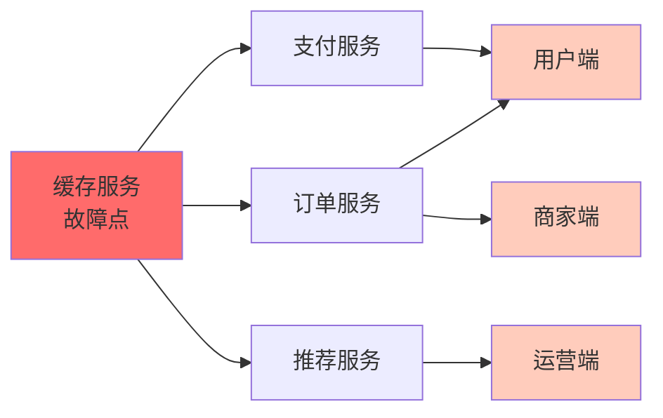

**真实案例：** 某电商平台因为一个基础缓存服务故障，导致订单服务、支付服务、推荐服务全部级联崩溃，影响范围远超预期，损失超过 200 万。

### 1.2 拓扑信息的碎片化与过时

当前运维中，拓扑信息散落在多个系统，且难以保持时效性：

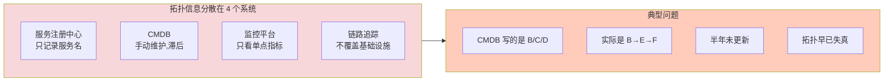

**4 大系统各自盲区：**

| 系统 | 知道什么 | 不知道什么 |
|------|----------|------------|
| 服务注册中心 | 服务名、实例地址 | 依赖关系 |
| CMDB | 配置层面依赖 | 运行时真实依赖 |
| 监控平台 | 单点指标 | 上下游关联 |
| 链路追踪 | 入口到出口调用链 | 基础设施依赖 |

### 1.3 拓扑建模的三大难题

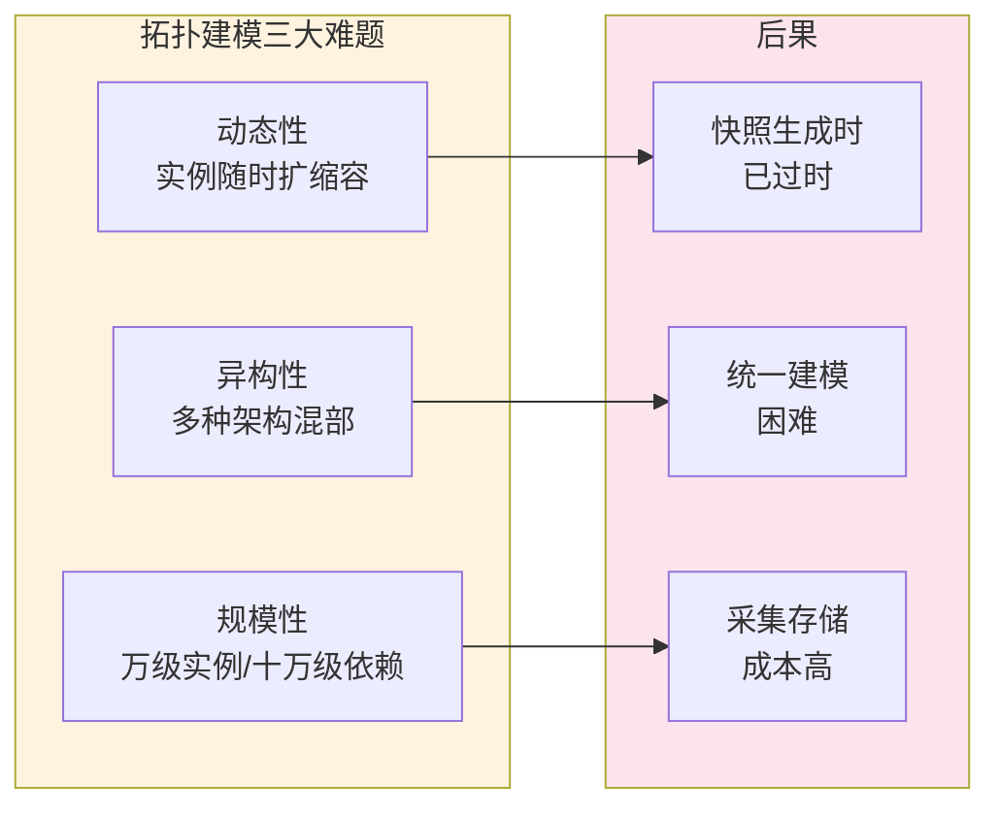

**难题详解：**

| 难题 | 描述 | 影响 |
|------|------|------|
| **动态性** | 服务实例随时扩缩容，容器漂移，IP 变化 | 拓扑快照在生成时已过时 |
| **异构性** | 传统微服务、K8s Pod、Serverless、遗留系统混部 | 统一建模困难 |
| **规模性** | 万级服务实例，十万级依赖关系 | 全量采集和存储成本高 |

### 1.4 痛点全景图

5 大痛点形成完整问题地图：

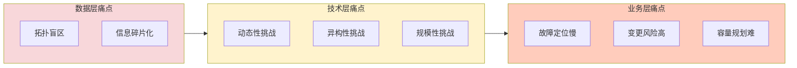

**痛点层级关系：**

| 层级 | 痛点 | 根因 | 影响 |
|------|------|------|------|
| **数据层** | 拓扑盲区 | 缺乏自动发现 | 看不见依赖 |
| **数据层** | 信息碎片化 | 多系统未打通 | 拓扑失真 |
| **技术层** | 动态性 | 容器/微服务变化快 | 快照过时 |
| **技术层** | 异构性 | 多架构混部 | 建模困难 |
| **技术层** | 规模性 | 实例/依赖量级大 | 成本高昂 |
| **业务层** | 故障定位慢 | 无依赖图辅助 | MTTR 长 |
| **业务层** | 变更风险高 | 影响面不清 | 故障频发 |
| **业务层** | 容量规划难 | 资源关系不明 | 资源浪费 |

### 1.5 根因分析

痛点的深层根因是 **4 大缺失**：

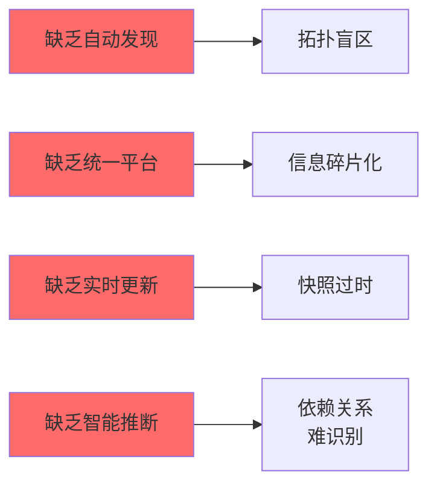

**根因 → 痛点映射：**

| 根因 | 导致痛点 | 解决方向 |
|------|----------|----------|
| 缺乏自动发现 | 拓扑盲区、依赖脆弱点 | 多源采集 + 自动构建 |
| 缺乏统一平台 | 信息碎片化、数据失真 | 统一拓扑图模型 |
| 缺乏实时更新 | 动态性挑战、快照过时 | 实时感知 + 增量更新 |
| 缺乏智能推断 | 异构性挑战、隐式依赖 | AI 关系挖掘 + 知识融合 |

---

## 2. 业务目标

拓扑建模业务目标围绕「**实时、准确、可查询**」三个关键词展开，从核心指标、分层目标、场景覆盖、价值链、达成路径五个维度定义。

### 2.1 核心目标

**构建实时、准确、可查询的运维拓扑知识图谱**

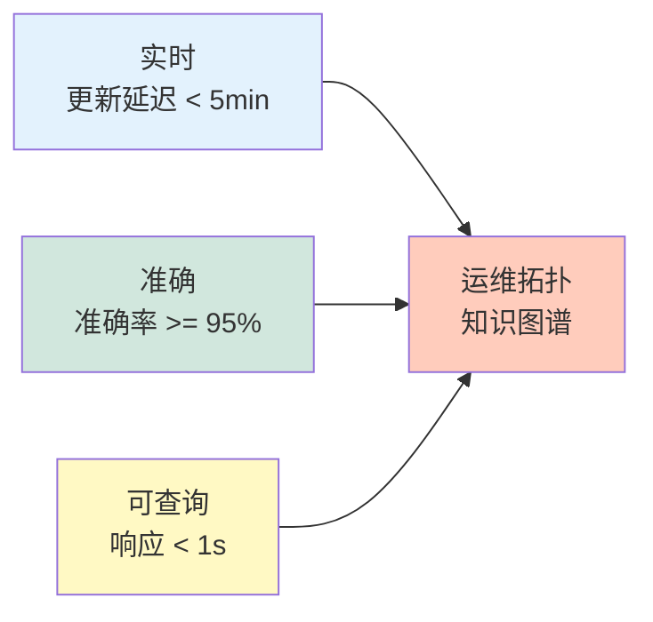

**核心指标对照：**

| 目标 | 量化指标 | 业务价值 | 度量周期 |
|------|----------|----------|----------|
| 拓扑发现率 | ≥ 98% | 覆盖绝大部分服务依赖 | 每周 |
| 拓扑准确率 | ≥ 95% | 依赖关系与实际一致 | 每周 |
| 更新延迟 | < 5 分钟 | 快速感知变更 | 实时 |
| 查询响应 | < 1 秒 | 支持实时决策 | 实时 |

### 2.2 分层目标

拓扑建模按抽象层次分为 3 层，自底向上逐层抽象：

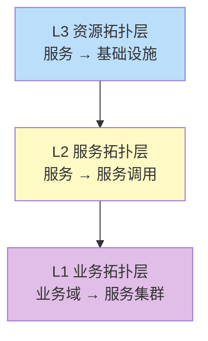

**L1：业务拓扑层**

- **目标**：建立业务域到技术实现的映射
- **内容**：
  - 业务域 → 产品线 → 服务集群
  - 用户旅程 → 关键路径 → 服务依赖
  - SLA 级别 → 核心服务 → 降级策略
- **价值**：让运维理解业务，让业务感知运维

**L2：服务拓扑层**

- **目标**：建立服务间调用关系的准确拓扑图
- **内容**：
  - 服务 → 服务 调用拓扑
  - API → Backend → Database 链路
  - Frontend → BFF → Domain Service 调用链
- **价值**：故障定位、变更评估、依赖分析

**L3：资源拓扑层**

- **目标**：建立服务与基础设施的承载关系
- **内容**：
  - 服务 → Pod/容器 → Node 主机
  - 服务 → 负载均衡器 → 网络
  - 服务 → 存储卷 → 磁盘
- **价值**：容量规划、故障定位、资源治理

### 2.3 业务场景覆盖

5 大核心场景全方位支撑运维决策：

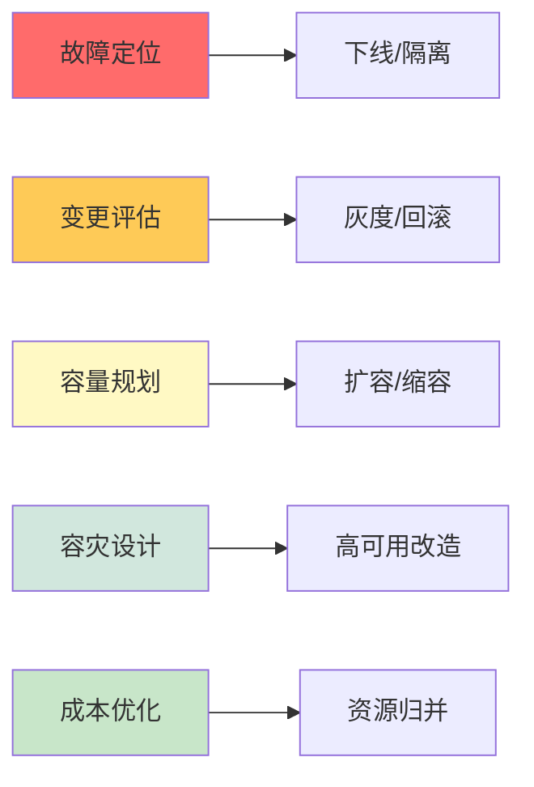

**场景与决策对照：**

| 场景 | 拓扑需求 | 决策支持 | 目标收益 |
|------|----------|----------|----------|
| **故障定位** | 快速找到根因服务及其影响范围 | 下线/隔离决策 | MTTR -60% |
| **变更评估** | 评估发布对上下游的影响 | 灰度/回滚决策 | 变更事故 -80% |
| **容量规划** | 识别容量瓶颈和依赖路径 | 扩容/缩容决策 | 资源利用率 +30% |
| **容灾设计** | 识别单点和设计冗余 | 高可用改造 | 系统可用性 99.99% |
| **成本优化** | 识别过度资源和低效依赖 | 资源归并 | 资源成本 -25% |

### 2.4 目标价值链

业务目标 → 平台能力 → 业务价值，形成完整价值传递链：

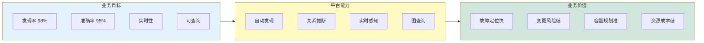

**目标-能力-价值映射：**

| 业务目标 | 平台能力 | 业务价值 |
|----------|----------|----------|
| 发现率 98% | 自动发现 | 全面覆盖，避免盲区 |
| 准确率 95% | 关系推断 | 决策有据可依 |
| 实时性 | 实时感知 | 快速响应变更 |
| 可查询 | 图查询 | 实时辅助决策 |

### 2.5 目标达成路径

按阶段逐步达成业务目标：

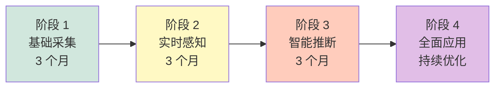

**分阶段目标：**

| 阶段 | 时间 | 目标 | 关键能力 |
|------|------|------|----------|
| **阶段 1：基础采集** | 0-3 月 | 采集率 ≥ 80% | 多源采集 |
| **阶段 2：实时感知** | 3-6 月 | 更新延迟 < 5 分钟 | 实时感知 |
| **阶段 3：智能推断** | 6-9 月 | 准确率 ≥ 95% | 关系推断 |
| **阶段 4：全面应用** | 9+ 月 | 覆盖 5 大场景 | 全面应用 |

---

## 3. 关键能力

拓扑建模提供 4 大类关键能力：**自动发现 → 实时感知 → 查询推理 → 可视化**，覆盖拓扑从「无」到「有」到「用」的全生命周期。

### 3.1 拓扑自动发现

通过 5 种数据源自动构建初始拓扑：

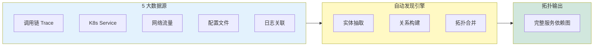

**能力清单：**

| 能力 | 描述 | 优先级 | 数据源 |
|------|------|--------|--------|
| **调用链追踪** | 通过 Trace 数据自动还原服务调用拓扑 | P0 | APM 系统 |
| **服务注册对齐** | 对齐 Kubernetes Service、Consul、etcd 注册信息 | P0 | 注册中心 |
| **网络流量分析** | 通过 Flow 日志分析网络层连接关系 | P1 | 网络设备 |
| **配置解析** | 解析 Nginx、API Gateway 配置获取路由关系 | P2 | 配置文件 |
| **日志关联** | 通过日志中的调用方标识还原依赖 | P1 | 日志系统 |

### 3.2 拓扑实时感知

拓扑不是静态的，需要实时跟踪变化：

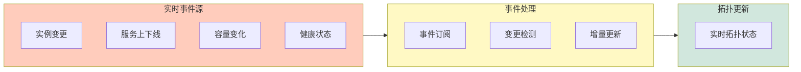

**能力清单：**

| 能力 | 描述 | 优先级 | 响应时效 |
|------|------|--------|----------|
| **实例变更监听** | 监听 K8s、容器平台实例变化 | P0 | < 1 分钟 |
| **服务上下线** | 实时感知服务注册/注销事件 | P0 | < 30 秒 |
| **容量状态同步** | 同步服务实例的负载状态 | P1 | < 5 分钟 |
| **健康状态联动** | 拓扑节点状态与告警联动 | P1 | < 30 秒 |

### 3.3 拓扑查询与推理

拓扑的最终价值在于查询和推理能力：

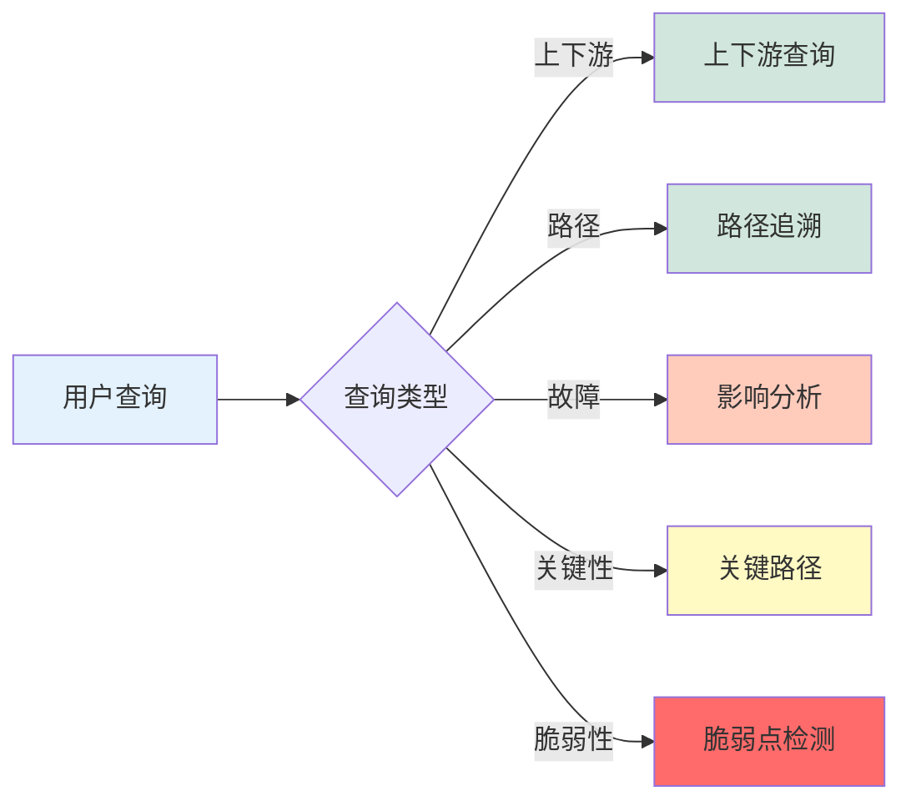

**能力清单：**

| 能力 | 描述 | 优先级 | 典型查询 |
|------|------|--------|----------|
| **上下游查询** | 给定服务，查询所有上游/下游依赖 | P0 | 服务 A 的所有依赖 |
| **路径追溯** | 查询服务 A 到服务 B 的完整调用路径 | P0 | A → B 的最短路径 |
| **影响分析** | 给定故障服务，计算受影响的所有服务 | P0 | 故障 X 影响哪些服务 |
| **关键路径识别** | 识别业务链路上的核心节点 | P1 | 订单链路核心服务 |
| **脆弱点检测** | 识别单点依赖和无冗余路径 | P1 | 单点依赖列表 |

### 3.4 拓扑可视化

让拓扑「看得见、看得清、用得好」：

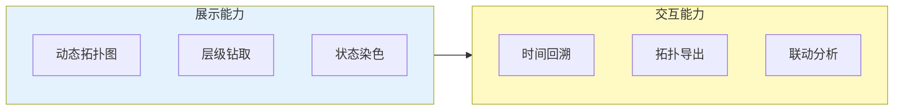

**能力清单：**

| 能力 | 描述 | 优先级 | 价值 |
|------|------|--------|------|
| **动态拓扑图** | 实时展示拓扑结构，支持缩放拖拽 | P0 | 全局视图 |
| **层级钻取** | 从业务层 → 服务层 → 资源层逐级钻取 | P0 | 上下文分析 |
| **状态染色** | 根据健康状态给拓扑节点染色 | P1 | 异常识别 |
| **时间回溯** | 查看历史时刻的拓扑快照 | P2 | 故障复盘 |
| **拓扑导出** | 导出拓扑数据为 JSON/Graphviz 格式 | P2 | 数据共享 |

### 3.5 4 大能力全景图

4 大能力覆盖拓扑全生命周期：构建（发现）→ 更新（感知）→ 使用（查询）→ 呈现（可视化）：

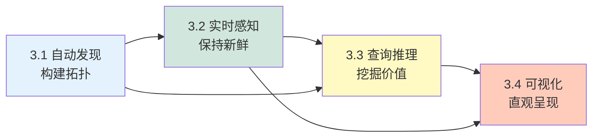

**能力生命周期对照：**

| 能力 | 拓扑阶段 | 输入 | 输出 | 关键指标 |
|------|----------|------|------|----------|
| 自动发现 | 构建 | 5 类数据源 | 初始拓扑 | 发现率 ≥ 98% |
| 实时感知 | 更新 | 事件流 | 实时拓扑 | 延迟 < 5 分钟 |
| 查询推理 | 使用 | 查询请求 | 分析结果 | 响应 < 1 秒 |
| 可视化 | 呈现 | 拓扑数据 | 视图交互 | 实时渲染 |

### 3.6 能力优先级矩阵

按 P0/P1/P2 优先级排序，P0 必做，P1 应做，P2 可选：

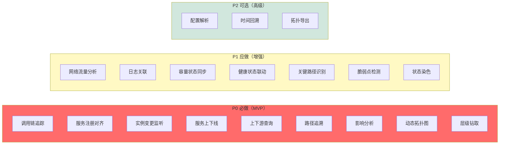

**优先级分布：**

| 优先级 | 数量 | 占比 | 实施建议 |
|--------|------|------|----------|
| P0 必做 | 9 项 | 47% | MVP 阶段完成 |
| P1 应做 | 7 项 | 37% | 增强阶段完成 |
| P2 可选 | 3 项 | 16% | 高级阶段完成 |
| **合计** | **19 项** | 100% | 持续迭代 |

---

## 4. 核心技术

拓扑建模涉及 5 大核心技术：**采集架构 → 数据模型 → 关系推断 → 查询引擎 → 知识融合**，形成完整的技术体系。

### 4.1 拓扑采集架构

4 层架构：数据源 → 采集层 → 构建层 → 存储层：

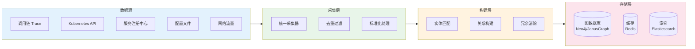

**各层职责：**

| 层级 | 职责 | 关键组件 | 性能要求 |
|------|------|----------|----------|
| 数据源 | 多源数据采集 | 5 类数据源 | 实时/分钟级 |
| 采集层 | 统一接入、清洗、标准化 | 采集器、过滤器 | 吞吐 > 10w/s |
| 构建层 | 实体匹配、关系构建、去重 | 匹配引擎、关系引擎 | 时延 < 1min |
| 存储层 | 持久化、缓存、索引 | 图数据库 + 缓存 | 查询 < 1s |

### 4.2 拓扑建模数据模型

#### 实体模型

| 实体类型 | 属性 | 示例 |
|----------|------|------|
| Service | name, version, namespace, type | order-service:v2.1.0 |
| Instance | ip, port, pod, host, status | 10.0.1.15:8080 |
| Endpoint | path, method, protocol | /api/v1/orders:POST |
| Resource | type, capacity, status | mysql-primary |
| Cluster | name, region, az | production-cn-north-1a |

#### 关系模型

| 关系类型 | 方向 | 属性 | 示例 |
|----------|------|------|------|
| CALLS | → | protocol, avgLatency, p99Latency | order-service CALLS inventory-service |
| DEPENDS_ON | → | type, criticality | order-service DEPENDS_ON mysql-order |
| HOSTS | → | role | pod-xyz HOSTS order-service |
| ROUTES_TO | → | rule | nginx ROUTES_TO order-service |
| LEADS_TO | → | path | service-a LEADS_TO service-b via /api/b |

**实体-关系 ER 视图：**

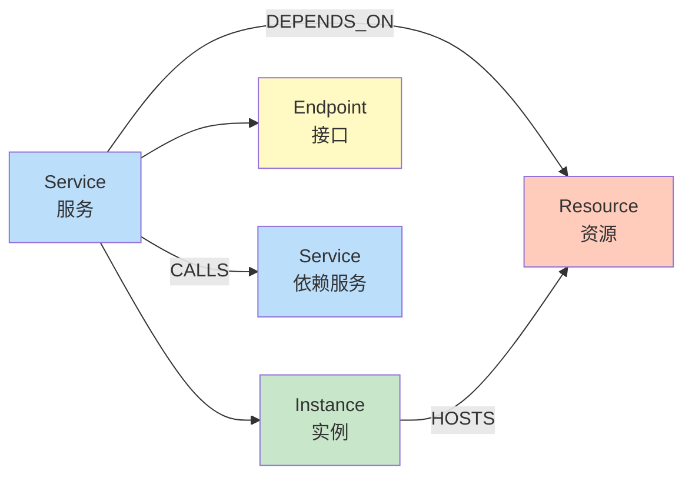

### 4.3 拓扑关系推断算法

3 大算法支撑关系自动构建：

**算法 1：基于 Trace 的关系推断**

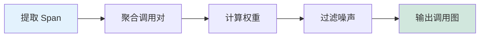

| 步骤 | 操作 | 阈值/参数 |
|------|------|----------|
| 1 | 提取每个 Span 的 consumer 和 provider | 时间窗口：5min |
| 2 | 按时间窗口聚合相同调用对 | — |
| 3 | 计算调用频次和延迟分布 | 频次阈值：10次/天 |
| 4 | 过滤低频噪声 | p99 延迟 |
| 5 | 输出带权重的调用图 | — |

**算法 2：基于服务注册的拓扑对齐**

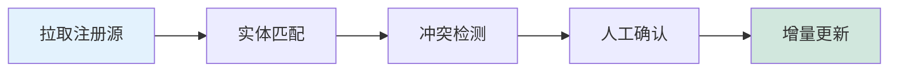

| 步骤 | 操作 | 匹配方式 |
|------|------|----------|
| 1 | 拉取 K8s Service、Consul、etcd 注册数据 | API 拉取 |
| 2 | 基于标签、名称进行实体匹配 | 模糊匹配 |
| 3 | 冲突检测：同名异义 / 同义异名 | 人工审核 |
| 4 | 人工确认后写入统一拓扑 | — |
| 5 | 监听变更事件增量更新 | Watch |

**算法 3：基于流量分析的连接推断**

```mermaid
flowchart LR
    C1[解析 Flow] --> C2[IP 映射] --> C3[聚合流量] --> C4[模式识别] --> C5[输出拓扑]
    
    style C1 fill:#e3f2fd
    style C5 fill:#d1e7dd
```

| 步骤 | 操作 | 算法 |
|------|------|------|
| 1 | 解析 Flow 日志，提取 src/dst ip, port, bytes | 流量解析 |
| 2 | IP → Service 实例映射 | IP 管理库 |
| 3 | 聚合同连接对的流量特征 | 滑动窗口 |
| 4 | 识别双向流量模式（心跳/长连接）| 模式识别 |
| 5 | 生成网络层拓扑图 | — |

### 4.4 拓扑查询引擎

3 层查询架构：查询层 → 引擎层 → 存储层：

```mermaid
flowchart LR
    subgraph 查询层["查询层"]
        GQL[GraphQL API]
        REST[REST API]
        CLI[CLI 工具]
    end
    
    subgraph 引擎["查询引擎"]
        PARSE[语法解析]
        OPTIM[查询优化]
        EXEC[图遍历执行]
    end
    
    subgraph 存储["存储层"]
        GRAPH[(图数据库)]
        CACHE[(Redis 缓存)]
        META[(元数据库)]
    end
    
    GQL --> PARSE
    REST --> PARSE
    CLI --> PARSE
    PARSE --> OPTIM
    OPTIM --> EXEC
    EXEC --> GRAPH
    EXEC --> CACHE
    CACHE -.-> META
    
    style 查询层 fill:#e3f2fd
    style 引擎 fill:#e8f5e9
    style 存储 fill:#fce4ec
```

**核心查询场景：**

| 场景 | 查询语句 | 预期结果 |
|------|----------|----------|
| 上游查询 | `MATCH (s:Service {name:"order"})<-[:CALLS*]-(up)` | 所有调用 order 的上游服务 |
| 下游查询 | `MATCH (s:Service {name:"order"})-[:CALLS*]->(down)` | order 所有下游依赖 |
| 路径查询 | `MATCH path = (a)-[:CALLS*]->(b)` | A→B 的调用路径 |
| 影响分析 | 计算从故障节点出发的可达节点集合 | 影响范围 |
| 关键路径 | 计算介数中心性最高的节点 | 瓶颈节点 |

### 4.5 拓扑与知识图谱融合

3 层融合架构：拓扑层 + 知识层 → 融合层：

```mermaid
flowchart TB
    subgraph 拓扑层["拓扑层"]
        SVC[服务节点]
        INST[实例节点]
        DEP[依赖边]
    end
    
    subgraph 知识层["知识层"]
        RCA[根因知识]
        CORR[关联知识]
        IMPACT[影响知识]
    end
    
    subgraph 融合层["融合层"]
        MERGE[图谱融合]
        REASON[知识推理]
        PREDICT[预测分析]
    end
    
    SVC --> MERGE
    INST --> MERGE
    DEP --> MERGE
    RCA --> MERGE
    CORR --> MERGE
    IMPACT --> MERGE
    
    MERGE --> REASON
    REASON --> PREDICT
    
    style 拓扑层 fill:#e3f2fd
    style 知识层 fill:#e8f5e9
    style 融合层 fill:#fff3e0
```

**融合能力：**

| 能力 | 输入 | 输出 | 业务价值 |
|------|------|------|----------|
| 故障传播推理 | 故障服务 + 拓扑 | 影响范围 | 故障定位 |
| 根因推理 | 历史告警 + 拓扑 + 知识 | 根因结论 | 根因准确率 +30% |
| 异常预测 | 脆弱点 + 历史模式 | 风险预警 | 提前预防 |

### 4.6 技术选型对比

| 组件 | 选型 | 备选 | 选型理由 |
|------|------|------|----------|
| 图数据库 | Neo4j | JanusGraph / NebulaGraph | 成熟生态、Cypher 查询 |
| 缓存 | Redis Cluster | KeyDB / DragonflyDB | 高性能、丰富数据结构 |
| 搜索引擎 | Elasticsearch | OpenSearch | 全文检索、聚合分析 |
| 流处理 | Apache Flink | Kafka Streams | 实时、Exactly-Once |
| 消息队列 | Apache Kafka | Pulsar / RocketMQ | 高吞吐、持久化 |

**图数据库选型对比：**

| 特性 | Neo4j | JanusGraph | NebulaGraph |
|------|-------|-----------|-------------|
| 查询语言 | Cypher | Gremlin | nGQL |
| 性能（亿级）| 优 | 良 | 优 |
| 分布式 | 企业版 | 原生支持 | 原生支持 |
| 运维成本 | 中 | 高 | 中 |
| 适用规模 | 100w-1亿 | 1亿+ | 1亿+ |
| 生态成熟度 | 高 | 中 | 中 |

### 4.7 性能优化策略

7 大性能优化策略应对大规模拓扑场景：

```mermaid
flowchart LR
    subgraph 存储["存储优化"]
        O1[图分区]
        O2[索引优化]
        O3[缓存分层]
    end
    
    subgraph 计算["计算优化"]
        O4[预计算]
        O5[增量更新]
        O6[并行查询]
    end
    
    subgraph 架构["架构优化"]
        O7[读写分离]
    end
    
    存储 --> 计算 --> 架构
    
    style 存储 fill:#e3f2fd
    style 计算 fill:#fff9c4
    style 架构 fill:#d1e7dd
```

**优化策略详解：**

| 优化策略 | 描述 | 性能提升 |
|----------|------|----------|
| **图分区** | 按业务域/集群水平分片 | 3-5x |
| **索引优化** | 为常用查询建立 B+Tree/Lucene 索引 | 5-10x |
| **缓存分层** | L1 本地缓存 + L2 Redis 缓存 | 10-50x |
| **预计算** | 上下游关系预计算，避免图遍历 | 20-100x |
| **增量更新** | 事件驱动增量更新，避免全量重建 | 5-10x |
| **并行查询** | 多子图并行遍历 | 3-5x |
| **读写分离** | 读副本分担查询压力 | 2-3x |

### 4.8 数据一致性与实时性保障

拓扑数据需在「一致性」和「实时性」之间取得平衡：

```mermaid
flowchart LR
    subgraph 一致性["一致性保障"]
        C1[事件溯源]
        C2[版本控制]
        C3[冲突检测]
    end
    
    subgraph 实时性["实时性保障"]
        R1[流式处理]
        R2[增量更新]
        R3[预热缓存]
    end
    
    一致性 --> 平衡[平衡策略]
    实时性 --> 平衡
    
    style 一致性 fill:#e3f2fd
    style 实时性 fill:#fff9c4
    style 平衡 fill:#d1e7dd
```

**一致性 vs 实时性权衡：**

| 维度 | 最终一致 | 近实时一致 | 强实时一致 |
|------|----------|------------|------------|
| **延迟** | 秒级 | 百毫秒 | 毫秒级 |
| **一致性** | 弱 | 中 | 强 |
| **吞吐** | 高 | 中 | 低 |
| **实现复杂度** | 低 | 中 | 高 |
| **适用场景** | 离线分析 | 大多数运维场景 | 核心交易 |

**实时性保障机制：**

| 机制 | 描述 | 延迟 |
|------|------|------|
| **事件溯源** | Event Sourcing 记录所有变更 | < 100ms |
| **变更数据捕获** | CDC 监听数据库变更 | < 500ms |
| **流式处理** | Flink 流处理拓扑变更 | < 1s |
| **WebHook 推送** | 变更主动推送给订阅方 | < 2s |
| **定时轮询** | 兜底机制，定时检查变更 | 30s-5min |

**数据冲突解决：**

| 冲突类型 | 场景 | 解决策略 |
|----------|------|----------|
| **实体冲突** | 多源报告同一服务 | 按优先级合并 + 人工确认 |
| **关系冲突** | 同一调用关系不同源 | 取最权威源 + 加权 |
| **时序冲突** | 同一服务多版本变更 | 最后写入获胜（LWW）|
| **状态冲突** | 同一实例多状态 | 状态机校验 + 异常告警 |

### 4.9 容错与高可用设计

系统需保证 7×24 小时稳定运行：

```mermaid
flowchart LR
    subgraph 采集容错["采集层容错"]
        A1[重试机制]
        A2[断路器]
        A3[本地缓冲]
    end
    
    subgraph 存储容错["存储层容错"]
        B1[多副本]
        B2[主从切换]
        B3[数据备份]
    end
    
    subgraph 服务容错["服务层容错"]
        C1[限流降级]
        C2[熔断隔离]
        C3[超时控制]
    end
    
    采集容错 --> 存储容错 --> 服务容错
    
    style 采集容错 fill:#e3f2fd
    style 存储容错 fill:#fff9c4
    style 服务容错 fill:#d1e7dd
```

**容错机制详解：**

| 容错层 | 机制 | 故障场景 | 应对方式 |
|--------|------|----------|----------|
| **采集层** | 重试机制 | 短暂网络抖动 | 指数退避重试 3 次 |
| **采集层** | 断路器 | 持续故障 | 熔断 5 分钟后半开 |
| **采集层** | 本地缓冲 | 上游不可用 | 磁盘缓冲 1 小时 |
| **存储层** | 多副本 | 节点故障 | 3 副本，1 故障不影响 |
| **存储层** | 主从切换 | 主节点故障 | Sentinel 自动切换 < 30s |
| **存储层** | 数据备份 | 数据损坏 | 每日全量 + 实时增量 |
| **服务层** | 限流降级 | 突发流量 | 令牌桶限流 + 降级返回 |
| **服务层** | 熔断隔离 | 下游故障 | 快速失败，避免雪崩 |
| **服务层** | 超时控制 | 慢调用 | 严格超时 1s，避免线程堆积 |

**高可用架构：**

```mermaid
flowchart LR
    subgraph 同城["同城双活"]
        DC1[数据中心 A]
        DC2[数据中心 B]
    end
    
    subgraph 异地["异地灾备"]
        DR1[灾备中心]
    end
    
    同城 --> 异地
    
    style 同城 fill:#e3f2fd
    style 异地 fill:#d1e7dd
```

**高可用级别：**

| 级别 | RPO | RTO | 架构 | 成本 |
|------|-----|-----|------|------|
| **L1 单机** | N/A | 小时级 | 单实例 | 低 |
| **L2 主备** | < 1h | < 5min | 主从 + 自动切换 | 中 |
| **L3 同城双活** | < 1min | < 1min | 双活 + 负载均衡 | 中高 |
| **L4 异地灾备** | < 1h | < 30min | 跨区域 + 异步复制 | 高 |
| **L5 多活** | < 10s | < 10s | 多活 + 流量调度 | 极高 |

### 4.10 安全与权限控制

通过多层防护保障系统安全：

```mermaid
flowchart TB
    subgraph 接入["接入层"]
        S1[身份认证]
        S2[访问授权]
        S3[流量加密]
    end
    
    subgraph 数据["数据层"]
        D1[敏感脱敏]
        D2[数据加密]
        D3[审计日志]
    end
    
    subgraph 运维["运维层"]
        O1[操作审计]
        O2[变更审批]
        O3[权限回收]
    end
    
    接入 --> 数据 --> 运维
    
    style 接入 fill:#e3f2fd
    style 数据 fill:#fff9c4
    style 运维 fill:#d1e7dd
```

**权限模型（RBAC）：**

| 角色 | 权限范围 | 操作 |
|------|----------|------|
| **管理员** | 全部 | 增删改查 + 配置 |
| **架构师** | 全部只读 | 查询 + 标注 |
| **SRE 工程师** | 生产环境 | 查询 + 故障操作 |
| **开发工程师** | 关联服务 | 查询 + 测试 |
| **业务方** | 业务域 | 查询 + 业务视图 |
| **只读用户** | 公开视图 | 仅查询 |

**安全防护机制：**

| 机制 | 描述 | 实现 |
|------|------|------|
| **身份认证** | OAuth 2.0 / SAML | 第三方登录 |
| **访问授权** | RBAC + ABAC | 角色 + 属性 |
| **流量加密** | HTTPS / TLS 1.3 | 全链路加密 |
| **敏感脱敏** | 字段级脱敏 | 配置化规则 |
| **数据加密** | 静态加密 + 传输加密 | AES-256 |
| **审计日志** | 全量操作日志 | ELK 存储 |
| **操作审批** | 危险操作二次确认 | 工作流引擎 |
| **权限回收** | 离职/转岗自动回收 | 定期同步 |

### 4.11 关键技术挑战与演进

5 大技术挑战与未来演进方向：

```mermaid
flowchart TB
    subgraph 当前["当前挑战"]
        C1[亿级规模]
        C2[多源异构]
        C3[实时性]
        C4[准确性]
        C5[智能化]
    end
    
    subgraph 演进["演进方向"]
        E1[分布式图]
        E2[统一语义]
        E3[流批一体]
        E4[AI 增强]
        E5[自学习]
    end
    
    当前 --> 演进
    
    style 当前 fill:#ffccbc
    style 演进 fill:#d1e7dd
```

**5 大挑战与演进路径：**

| 挑战 | 当前现状 | 演进方向 | 关键技术 |
|------|----------|----------|----------|
| **亿级规模** | 单图 10w 节点 | 分布式图数据库 | NebulaGraph / JanusGraph |
| **多源异构** | 5+ 数据源独立 | 统一语义模型 | OWL / RDF 本体 |
| **实时性** | 分钟级延迟 | 秒级延迟 | Flink + 内存图 |
| **准确性** | 95% 准确 | 99% 准确 | AI 关系推断 |
| **智能化** | 规则驱动 | 自学习驱动 | GNN / 强化学习 |

**技术成熟度评估：**

| 技术 | 成熟度 | 风险 | 建议 |
|------|--------|------|------|
| 图数据库 | 生产可用 | 低 | 直接采用 Neo4j |
| 流处理 | 生产可用 | 中 | Flink 需团队储备 |
| AI 关系推断 | 实验阶段 | 高 | 小范围试点 |
| 分布式图 | 早期 | 高 | 关注 NebulaGraph |
| 自学习拓扑 | 研究阶段 | 极高 | 学术合作 |

---

---

## 5. 用户体验

拓扑建模的用户体验围绕「**易发现、易理解、易操作**」三个原则，从交互流程、可视化设计、页面交互、告警联动、用户旅程、微交互、可访问性、UX 度量 8 个维度构建完整 UX 体系。

### 5.1 拓扑发现交互流程

3 种探查方式 → 配置 → 执行 → 预览 → 上线：

```mermaid
flowchart LR
    A[用户进入] --> B{选择方式}
    B -->|自动发现| C[选数据源]
    B -->|手动导入| D[上传配置]
    B -->|模板创建| E[选模板]
    
    C --> F[配置采样]
    F --> G[执行发现]
    G --> H[预览结果]
    H -->|满意| I[确认保存]
    H -->|不满意| J[调整参数]
    J --> F
    
    D --> K[解析导入]
    K --> I
    E --> I
    I --> L[拓扑上线]
    
    style A fill:#4caf50
    style L fill:#2196f3
    style B fill:#fff9c4
    style I fill:#ffccbc
```

**3 种探查方式对比：**

| 方式 | 适用场景 | 速度 | 准确性 | 复杂度 |
|------|----------|------|--------|--------|
| **自动发现** | 有完整 Trace/注册中心 | 分钟级 | 高 | 低 |
| **手动导入** | 遗留系统/无 Trace | 即时 | 依赖人工 | 中 |
| **模板创建** | 标准化部署 | 分钟级 | 中 | 中 |

**自动发现详细流程：**

```mermaid
flowchart LR
    A1[选择数据源] --> A2[配置采样策略<br/>时间范围/采样率] --> A3[预览采样结果] --> A4[启动发现任务] --> A5[实时进度展示] --> A6[生成拓扑预览] --> A7[差异对比] --> A8[确认上线]
    
    A8 -.差异 > 10%.-> A2
    A8 -.差异 <= 10%.-> A9[完成]
    
    style A1 fill:#e3f2fd
    style A9 fill:#d1e7dd
    style A5 fill:#fff9c4
```

### 5.2 拓扑可视化设计

**节点设计：**

| 节点类型 | 视觉表现 | 状态标识 | 交互响应 |
|----------|----------|----------|----------|
| 核心服务 | 大圆 + 强调色边框 | 健康=绿、异常=黄、故障=红 | 悬停高亮 + 详情弹出 |
| 普通服务 | 中圆 + 默认色 | 闪烁=告警中 | 点击进入详情 |
| 基础设施 | 小圆 + 虚线边框 | 负载条 | 双击查看资源 |
| 外部服务 | 虚线圆 + 外部标识 | 不可控 | 仅展示不可操作 |

**边设计：**

| 边类型 | 视觉表现 | 交互 | 动画 |
|--------|----------|------|------|
| 同步调用 | 实线 + 箭头 + 延迟标注 | 点击查看调用详情 | 流量粒子 |
| 异步消息 | 虚线 + 队列图标 | 点击查看队列积压 | 消息流动 |
| 跨域调用 | 双线 + 域标签 | 高亮显示 | — |
| 异常流量 | 红色 + 抖动动画 | 点击查看错误日志 | 抖动 |

**可视化层次设计：**

```mermaid
flowchart LR
    L1[L1 业务域<br/>颜色分组] --> L2[L2 服务群<br/>形状区分] --> L3[L3 实例<br/>大小表示] --> L4[L4 资源<br/>图标化]
    
    style L1 fill:#e1bee7
    style L2 fill:#fff9c4
    style L3 fill:#c8e6c9
    style L4 fill:#bbdefb
```

**典型布局示意：**

```mermaid
flowchart TB
    subgraph L1["L1 业务域（颜色分组）"]
        BIZ[订单域<br/>紫色]
    end
    
    subgraph L2["L2 服务群（形状区分）"]
        SVC1[订单服务<br/>圆形]
        SVC2[支付服务<br/>圆形]
    end
    
    subgraph L3["L3 实例（大小表示）"]
        INS1[实例 1<br/>大]
        INS2[实例 2<br/>中]
        INS3[实例 3<br/>小]
    end
    
    subgraph L4["L4 资源（图标化）"]
        RES1[(MySQL)]
        RES2[(Redis)]
    end
    
    BIZ --> SVC1 --> INS1
    BIZ --> SVC2
    SVC1 --> INS2
    SVC1 --> INS3
    INS1 --> RES1
    INS1 --> RES2
    
    style L1 fill:#e1bee7
    style L2 fill:#fff9c4
    style L3 fill:#c8e6c9
    style L4 fill:#bbdefb
```

### 5.3 核心页面交互

#### 全局拓扑视图

```mermaid
flowchart LR
    subgraph 视图["视图区"]
        V[动态拓扑图]
    end
    
    subgraph 顶部["顶部工具栏"]
        T1[搜索]
        T2[筛选]
        T3[导出]
        T4[视图切换]
    end
    
    subgraph 左侧["左侧面板"]
        L1[服务列表]
        L2[层级结构]
    end
    
    subgraph 右键["右键菜单"]
        R1[查看详情]
        R2[查询上下游]
        R3[模拟故障]
    end
    
    视图 --> 右键
    
    style 视图 fill:#e3f2fd
    style 顶部 fill:#fff9c4
    style 左侧 fill:#d1e7dd
    style 右键 fill:#ffccbc
```

**全局视图功能：**

| 区域 | 功能 | 快捷操作 |
|------|------|----------|
| **视图区** | 全服务拓扑，缩放平移 | 双击节点进入详情 |
| **顶部工具栏** | 搜索、筛选、导出、切换 | 鼠标悬停显示状态 |
| **左侧面板** | 服务列表、层级结构 | Ctrl+点击多选 |
| **右键菜单** | 查看详情、上下游、模拟故障 | — |

#### 服务详情面板

```mermaid
flowchart TB
    subgraph 详情["服务详情面板"]
        direction TB
        M1[基本信息<br/>名称/版本/负责人/SLA]
        M2[健康状态<br/>实时指标/告警历史]
        M3[上游依赖<br/>直接/间接]
        M4[下游依赖<br/>直接/间接]
        M5[调用链路<br/>入口→业务→数据]
        M6[运维操作<br/>重启/扩缩/熔断]
        M1 --> M2 --> M3 --> M4 --> M5 --> M6
    end
    
    style 详情 fill:#e3f2fd
```

**详情面板 6 模块：**

| 模块 | 内容 | 价值 |
|------|------|------|
| 基本信息 | 名称、版本、负责人、SLA | 服务画像 |
| 健康状态 | 实时指标、告警历史 | 状态感知 |
| 上游依赖 | 直接/间接调用方 | 风险识别 |
| 下游依赖 | 直接/间接依赖 | 影响分析 |
| 调用链路 | 入口→业务→数据 | 上下文 |
| 运维操作 | 重启/扩缩/熔断 | 操作便捷 |

#### 影响分析视图

```mermaid
flowchart LR
    T[故障服务] --> A1[上游影响]
    T --> A2[下游触发]
    T --> A3[业务影响]
    T --> A4[建议操作]
    
    A1 --> O1[隔离]
    A2 --> O2[降级]
    A3 --> O3[扩容]
    A4 --> O4[回滚]
    
    style T fill:#ff6b6b
    style A1 fill:#ffccbc
    style A2 fill:#ffccbc
    style A3 fill:#ffccbc
    style A4 fill:#fff9c4
```

**影响分析 4 维度：**

| 维度 | 内容 | 时间范围 |
|------|------|----------|
| **上游影响** | 哪些服务会受影响 | 当前/1h/24h/7d |
| **下游触发** | 是否会触发下游故障 | 同上 |
| **业务影响** | 涉及业务域、用户量 | 同上 |
| **建议操作** | 隔离/降级/扩容/回滚 | 当前 |

### 5.4 告警联动体验

```mermaid
flowchart LR
    subgraph 告警["告警事件"]
        A1[新告警触发]
        A2[根因定位]
        A3[告警聚合]
        A4[恢复确认]
    end
    
    subgraph 联动["拓扑联动行为"]
        B1[节点闪烁<br/>边高亮]
        B2[展开拓扑路径]
        B3[聚合告警组]
        B4[状态恢复<br/>拓扑更新]
    end
    
    A1 --> B1
    A2 --> B2
    A3 --> B3
    A4 --> B4
    
    style 告警 fill:#f8d7da
    style 联动 fill:#d1e7dd
```

**告警联动场景表：**

| 场景 | 拓扑联动行为 | 体验价值 |
|------|-------------|----------|
| 新告警触发 | 告警服务节点闪烁，关联边高亮 | 快速定位 |
| 根因定位 | 自动展开相关拓扑路径 | 辅助分析 |
| 告警聚合 | 相同根因的多个告警在拓扑上聚合成一个告警组 | 降噪 |
| 恢复确认 | 节点状态恢复，联动拓扑更新 | 状态同步 |

### 5.5 用户旅程图

不同用户角色的核心使用旅程：

```mermaid
flowchart LR
    subgraph 决策者["业务决策者"]
        D1[查看业务拓扑] --> D2[了解系统全貌] --> D3[决策支持]
    end
    
    subgraph 架构师["架构师"]
        A1[查看服务依赖] --> A2[分析架构问题] --> A3[架构优化]
    end
    
    subgraph SRE["SRE 工程师"]
        S1[发现告警] --> S2[定位根因] --> S3[故障恢复]
    end
    
    subgraph 业务["业务方"]
        B1[查看业务影响] --> B2[沟通协调] --> B3[业务保障]
    end
    
    style 决策者 fill:#e1bee7
    style 架构师 fill:#fff9c4
    style SRE fill:#ffccbc
    style 业务 fill:#c8e6c9
```

**4 类用户旅程：**

| 角色 | 旅程 | 关键触点 | 痛点 | 解决方案 |
|------|------|----------|------|----------|
| 业务决策者 | 查看业务拓扑 → 了解系统全貌 → 决策支持 | 业务拓扑图 | 不了解技术实现 | 业务域分组 |
| 架构师 | 查看服务依赖 → 分析架构问题 → 架构优化 | 服务拓扑图 | 难以发现架构问题 | 依赖可视化 |
| SRE 工程师 | 发现告警 → 定位根因 → 故障恢复 | 告警联动 + 详情 | 故障定位慢 | 智能定位 |
| 业务方 | 查看业务影响 → 沟通协调 → 业务保障 | 业务影响视图 | 不理解技术细节 | 业务语言 |

### 5.6 设计原则

5 大设计原则指导 UX 设计：

| 原则 | 描述 | 实践 |
|------|------|------|
| **简洁直观** | 降低认知负担，关键信息一目了然 | 颜色编码 + 图标化 |
| **即时反馈** | 用户操作后立即响应 | 实时拓扑更新 |
| **上下文关联** | 多视角融合，关联其他数据 | 告警/监控/工单联动 |
| **可探索性** | 支持钻取细节，不止步于概览 | 3 层钻取（业务→服务→资源）|
| **协作友好** | 支持分享、标注、评论 | 拓扑截图 + 链接分享 |

### 5.7 微交互设计

微交互是用户感知的「细节体验」，8 类微交互提升操作流畅度：

```mermaid
flowchart LR
    subgraph 悬停["悬停效果"]
        H1[节点高亮]
        H2[详情悬浮卡]
        H3[边流量预览]
    end
    
    subgraph 点击["点击效果"]
        C1[涟漪动画]
        C2[选中态变色]
        C3[展开动画]
    end
    
    subgraph 加载["加载效果"]
        L1[骨架屏]
        L2[进度条]
        L3[粒子效果]
    end
    
    悬停 --> 点击 --> 加载
    
    style 悬停 fill:#e3f2fd
    style 点击 fill:#fff9c4
    style 加载 fill:#d1e7dd
```

**微交互设计规范：**

| 微交互类型 | 场景 | 持续时间 | 效果 |
|------------|------|----------|------|
| **节点悬停** | 鼠标悬停节点 | 即时 | 高亮 + 显示依赖数 |
| **边悬停** | 鼠标悬停边 | 即时 | 显示延迟/P99 标注 |
| **点击涟漪** | 点击节点 | 300ms | 中心向外扩散 |
| **加载骨架** | 数据加载中 | 持续 | 占位骨架 |
| **进度条** | 拓扑发现 | 持续 | 实时进度 + 阶段 |
| **粒子流动** | 同步调用边 | 持续 | 流量方向粒子 |
| **抖动** | 异常告警 | 持续 | 红色抖动提示 |
| **弹出动画** | 详情面板 | 200ms | 淡入 + 缩放 |

### 5.8 可访问性与响应式

支持多终端、多场景的无障碍设计：

```mermaid
flowchart LR
    subgraph 终端["终端适配"]
        D1[桌面端<br/>>= 1440px]
        D2[平板端<br/>768-1439px]
        D3[移动端<br/>< 768px]
    end
    
    subgraph 无障碍["无障碍设计"]
        A1[键盘导航]
        A2[屏幕阅读器]
        A3[高对比模式]
    end
    
    终端 --> 无障碍
    
    style 终端 fill:#e3f2fd
    style 无障碍 fill:#d1e7dd
```

**多终端响应式设计：**

| 终端 | 尺寸 | 布局策略 | 功能裁剪 |
|------|------|----------|----------|
| **桌面端** | ≥ 1440px | 完整布局（左侧面板 + 主视图 + 右侧详情）| 全功能 |
| **平板端** | 768-1439px | 简化布局（顶部面板 + 主视图）| 部分功能 |
| **移动端** | < 768px | 单列布局（上下滚动）| 核心功能 |

**无障碍设计清单：**

| 项目 | 要求 | 实现方式 |
|------|------|----------|
| **键盘导航** | Tab 顺序合理 | focus-visible 样式 |
| **屏幕阅读器** | ARIA 标签 | aria-label / role |
| **高对比模式** | 色彩对比度 ≥ 4.5:1 | WCAG AA 标准 |
| **动画减弱** | 支持 prefers-reduced-motion | 媒体查询 |
| **多语言** | 国际化文案 | i18n 框架 |
| **触屏友好** | 点击区域 ≥ 44px | 移动端适配 |

### 5.9 UX 度量指标

通过 5 类指标持续度量 UX 质量：

```mermaid
flowchart LR
    M1[任务完成率] --> S[UX 综合评分]
    M2[完成时间] --> S
    M3[操作步骤数] --> S
    M4[用户满意度] --> S
    M5[错误率] --> S
    
    style S fill:#ffccbc
```

**UX 度量指标表：**

| 指标 | 定义 | 目标值 | 度量方式 |
|------|------|--------|----------|
| **任务完成率** | 成功完成任务的会话占比 | > 95% | 用户行为埋点 |
| **平均完成时间** | 完成任务平均耗时 | < 30s | 计时分析 |
| **平均操作步骤** | 完成任务平均点击数 | < 5 步 | 操作路径分析 |
| **用户满意度** | NPS 或 CSAT 评分 | > 4.0/5 | 用户调研 |
| **错误率** | 操作失败/重试比例 | < 5% | 错误日志 |

**核心场景度量基线：**

| 场景 | 完成时间 | 步骤数 | 满意度 |
|------|----------|--------|--------|
| 拓扑发现 | < 2 分钟 | 3 步 | > 4.5 |
| 故障定位 | < 1 分钟 | 2 步 | > 4.5 |
| 变更评估 | < 1 分钟 | 2 步 | > 4.0 |
| 影响分析 | < 30 秒 | 1 步 | > 4.5 |

---

## 6. 系统质量

系统质量围绕「**性能、准确、可用**」3 大维度展开，并通过 4 大质量保障机制持续改进，确保系统稳定可靠。

### 6.1 性能指标

5 大性能指标衡量系统处理能力：

```mermaid
flowchart LR
    P1[拓扑发现<br/>< 5min] --> R[性能]
    P2[查询响应<br/>< 1s] --> R
    P3[并发能力<br/>100 QPS] --> R
    P4[更新吞吐<br/>1000+/s] --> R
    P5[图规模<br/>10w 节点] --> R
    
    style P1 fill:#e3f2fd
    style P2 fill:#e3f2fd
    style P3 fill:#fff9c4
    style P4 fill:#fff9c4
    style P5 fill:#d1e7dd
    style R fill:#ffccbc
```

**性能指标详解：**

| 指标 | 要求 | 验收标准 | 测试方式 |
|------|------|----------|----------|
| **拓扑发现延迟** | 数据源到拓扑生成 < 5 分钟 | 99th < 5min | 压测 |
| **查询响应时间** | 简单查询 < 200ms，复杂查询 < 1s | P95 < 1s | 基准测试 |
| **并发查询能力** | 支持 100 并发查询 | 99th < 2s | 压力测试 |
| **更新吞吐量** | 支持 1000+ 实例变更/秒 | 延迟 < 10s | 流量回放 |
| **图规模容量** | 单图支持 10 万节点、100 万边 | 查询性能不降 | 大规模压测 |

### 6.2 准确性指标

4 大准确性指标衡量数据可信度：

```mermaid
flowchart LR
    A1[拓扑准确率<br/>>= 95%] --> Q[数据质量]
    A2[实例覆盖率<br/>>= 98%] --> Q
    A3[关系召回率<br/>>= 90%] --> Q
    A4[误报率<br/>< 5%] --> Q
    
    style A1 fill:#d1e7dd
    style A2 fill:#d1e7dd
    style A3 fill:#fff9c4
    style A4 fill:#ffccbc
    style Q fill:#e1bee7
```

**准确性指标详解：**

| 指标 | 要求 | 验收标准 | 度量方式 |
|------|------|----------|----------|
| **拓扑准确率** | 调用关系与实际一致 | ≥ 95% | 人工抽样 |
| **实例覆盖率** | 实际运行实例被采集到 | ≥ 98% | 实例数比对 |
| **关系召回率** | 真实依赖关系被发现 | ≥ 90% | Trace 比对 |
| **误报率** | 错误调用关系（噪音）比例 | < 5% | 过滤规则 |

### 6.3 可用性指标

4 大可用性指标衡量系统稳定：

```mermaid
flowchart LR
    U1[系统可用性<br/>99.9%] --> A[系统稳定]
    U2[数据完整性<br/>99.99%] --> A
    U3[故障恢复<br/>< 5min] --> A
    U4[灾备能力<br/>RPO < 1h] --> A
    
    style A fill:#d1e7dd
```

**可用性指标详解：**

| 指标 | 要求 | 验收标准 | 度量方式 |
|------|------|----------|----------|
| **系统可用性** | 全年运行不中断 | 99.9% | 监控 |
| **数据完整性** | 无数据丢失 | 99.99% | 校验 |
| **故障恢复时间** | 节点故障后自动恢复 | < 5min | 故障演练 |
| **灾备能力** | 支持跨区域容灾 | RPO < 1h | 切换演练 |

### 6.4 质量保障机制

4 大机制持续保障数据质量：

```mermaid
flowchart LR
    subgraph 自动化["自动化机制"]
        M1[交叉验证]
        M2[历史比对]
        M3[循环校验]
    end
    
    subgraph 人工化["人工机制"]
        M4[采样验证]
    end
    
    自动化 --> 质量[数据质量保障]
    人工化 --> 质量
    
    style 自动化 fill:#e3f2fd
    style 人工化 fill:#fff9c4
    style 质量 fill:#d1e7dd
```

**质量保障机制详解：**

| 机制 | 描述 | 触发条件 | 频率 |
|------|------|----------|------|
| **交叉验证** | 用 Trace 数据验证拓扑，发现差异告警 | 差异率 > 5% | 实时 |
| **历史比对** | 定期比对拓扑变更，识别异常 | 节点变化 > 20% | 每日 |
| **循环校验** | 从 Trace 还原拓扑，再从拓扑预测 Trace，对比 | 不一致 | 每周 |
| **采样验证** | 人工随机抽样验证拓扑准确性 | 每月抽样 | 每月 |

### 6.5 质量度量模型

3 维度 × 4 指标构建完整质量模型：

```mermaid
flowchart TB
    subgraph 性能["性能维度"]
        P1[发现延迟]
        P2[查询响应]
        P3[并发能力]
        P4[图规模]
    end
    
    subgraph 准确["准确维度"]
        A1[准确率]
        A2[覆盖率]
        A3[召回率]
        A4[误报率]
    end
    
    subgraph 可用["可用维度"]
        U1[系统可用性]
        U2[数据完整性]
        U3[恢复时间]
        U4[灾备能力]
    end
    
    性能 --> M[质量综合分]
    准确 --> M
    可用 --> M
    
    style 性能 fill:#e3f2fd
    style 准确 fill:#fff9c4
    style 可用 fill:#d1e7dd
    style M fill:#ffccbc
```

**质量综合分计算：**

| 维度 | 权重 | 计算方式 |
|------|------|----------|
| 性能 | 30% | 5 指标达成率加权 |
| 准确 | 40% | 4 指标达成率加权 |
| 可用 | 30% | 4 指标达成率加权 |
| **综合分** | 100% | 0-100 分制 |

**质量等级：**

| 等级 | 综合分 | 状态 |
|------|--------|------|
| A | ≥ 90 | 优秀 |
| B | 80-89 | 良好 |
| C | 70-79 | 合格 |
| D | 60-69 | 需改进 |
| E | < 60 | 不合格 |

### 6.6 持续改进机制

5 步持续改进闭环：

```mermaid
flowchart LR
    S1[度量] --> S2[分析] --> S3[改进] --> S4[验证] --> S5[沉淀]
    S5 -.反馈.-> S1
    
    style S1 fill:#e3f2fd
    style S2 fill:#fff9c4
    style S3 fill:#d1e7dd
    style S4 fill:#ffccbc
    style S5 fill:#e1bee7
```

**5 步改进流程：**

| 步骤 | 操作 | 输出 | 周期 |
|------|------|------|------|
| **度量** | 采集质量指标数据 | 质量报告 | 实时 |
| **分析** | 识别质量短板根因 | 分析报告 | 每周 |
| **改进** | 制定优化方案 | 改进计划 | 每月 |
| **验证** | 验证改进效果 | 验证报告 | 每月 |
| **沉淀** | 经验归档 | 知识库 | 季度 |

---

## 7. 特性运营

### 7.1 核心运营指标

| 指标 | 定义 | 目标值 |
|------|------|--------|
| **拓扑覆盖率** | 有拓扑的服务 / 总服务数 | > 95% |
| **依赖完整度** | 有关联关系的服务 / 有拓扑的服务 | > 90% |
| **使用率** | 过去 30 天访问过拓扑页面的用户数 / 总用户数 | > 80% |
| **查询量** | 每日拓扑查询次数 | 持续增长 |
| **决策支撑** | 拓扑数据被用于多少次决策（故障定位/变更评估） | 可追踪 |

### 7.2 运营工作流

#### 新服务接入流程

```mermaid
flowchart TD
    A[新服务注册/发布] --> B{自动发现?}
    B -->|是| C[自动采集]
    C --> D[拓扑生成]
    D --> E{验证准确?}
    E -->|是| F[上线]
    E -->|否| G[人工修正]
    G --> F
    
    B -->|否| H[手动接入]
    H --> I[配置采集]
    I --> D
```

#### 拓扑质量巡检

| 频率 | 内容 | 输出 |
|------|------|------|
| 每日 | 实例变更事件数量、拓扑更新延迟 | 巡检日报 |
| 每周 | 拓扑变化趋势、异常节点检测 | 巡检周报 |
| 每月 | 拓扑覆盖率变化、人工验证抽样 | 月度评估报告 |
| 每季度 | 架构合理性评估、依赖优化建议 | 架构评审材料 |

### 7.3 用户赋能

| 赋能场景 | 支持内容 | 效果指标 |
|----------|----------|----------|
| **新工程师上手** | 自助查询服务依赖、了解系统架构 | 上手时间 -50% |
| **变更影响评估** | 变更前查询上下游影响面 | 变更事故 -60% |
| **故障快速定位** | 故障时查询影响范围和支持路径 | MTTR -40% |
| **容量规划** | 识别依赖路径上的容量瓶颈 | 容量浪费 -30% |

### 7.4 持续优化机制

| 阶段 | 行动 | 反馈来源 |
|------|------|----------|
| 上线 1 周 | 收集拓扑准确性反馈，修复明显错误 | 用户反馈 |
| 上线 1 月 | 分析查询日志，优化高频查询性能 | 系统数据 |
| 上线 3 月 | 评估业务覆盖率，补全业务域拓扑 | 业务梳理 |
| 上线 6 月 | 整体复盘，优化采集和建模策略 | 综合评估 |

---

## 8. 本章小结

### 8.1 核心价值回顾

| 维度 | 内容 |
|------|------|
| **解决什么问题** | 服务依赖看不见、故障影响无法评估、变更风险不可控 |
| **核心能力** | 拓扑自动发现、实时感知、查询推理、可视化 |
| **技术方案** | Trace 分析 + 服务注册对齐 + 流量分析 → 图数据库存储 → GraphQL 查询 |
| **业务目标** | 拓扑覆盖率 ≥ 95%、准确率 ≥ 95%、更新延迟 < 5min |

### 8.2 在 AIOps 链路中的位置

```mermaid
flowchart LR
    A[01 拓扑建模] --> B[02 数据融合]
    B --> C[03 智能感知]
    C --> D[04 认知网络]
    D --> E[05 故障研判]
    E --> F[06 根因分析]
    F --> G[07 影响分析]
    G --> H[08 智能决策]
    H --> I[09 自动执行]
    I --> J[10 知识进化]
    
    A --> K[构建服务拓扑]
    B --> L[融合多源数据]
    C --> M[实时感知异常]
    D --> N[知识图谱推理]
    E --> O[智能故障判断]
    F --> P[定位根因]
    G --> Q[评估影响范围]
    H --> R[生成最优决策]
    I --> S[自动执行修复]
    J --> T[知识持续进化]
    
    style A fill:#4ecdc4
```

**拓扑建模是整个 AIOps 的基础设施：**

- 上层分析（故障研判、根因分析）依赖拓扑提供上下文
- 下层执行（自动修复）依赖拓扑确定影响范围
- 横向贯穿（智能决策、知识进化）依赖拓扑关系网络

### 8.3 与其他章节的接口

| 章节 | 输入 | 输出 |
|------|------|------|
| 03 数据融合 | 拓扑结构作为数据融合的关联维度 | 多源数据与拓扑节点对齐 |
| 04 智能感知 | 拓扑作为感知上下文（哪些服务关联） | 感知结果叠加到拓扑 |
| 05 认知网络 | 拓扑节点作为知识图谱的实体 | 拓扑关系作为知识边 |
| 06 故障研判 | 拓扑路径作为研判依据 | 故障传播路径叠加到拓扑 |
| 07 根因分析 | 拓扑作为根因传播图 | 根因节点高亮在拓扑上 |
| 08 影响分析 | 拓扑作为影响范围计算的基础 | 影响面在拓扑上可视化 |

### 8.4 关键成功要素

| 要素 | 说明 | 优先级 |
|------|------|--------|
| **数据源质量** | Trace、注册中心等数据源的覆盖率和准确性 | P0 |
| **算法准确性** | 拓扑推断算法的准确率和召回率 | P0 |
| **实时性** | 拓扑变更的感知和更新延迟 | P1 |
| **易用性** | 界面交互和查询语法的易用程度 | P1 |
| **与业务对齐** | 拓扑结构符合业务域划分 | P2 |

### 8.5 未来演进方向

| 方向 | 内容 | 阶段 |
|------|------|------|
| **自动化拓扑修复** | 基于历史数据自动修正拓扑错误 | V2 |
| **预测性拓扑分析** | 基于拓扑结构预测潜在故障 | V2 |
| **多云统一拓扑** | 跨云、跨集群的统一拓扑视图 | V3 |
| **拓扑即代码** | 拓扑定义与基础设施代码同步 | V3 |
| **智能化拓扑推荐** | AI 推荐最优服务拆分/合并方案 | V4 |

---

> 本章定义了智能运维可观测性平台的基础：服务拓扑模型。后续章节将在此基础上构建数据融合、智能感知、认知网络等高级能力。

_文档版本：V1.0 | 更新日期：2026-06-03_