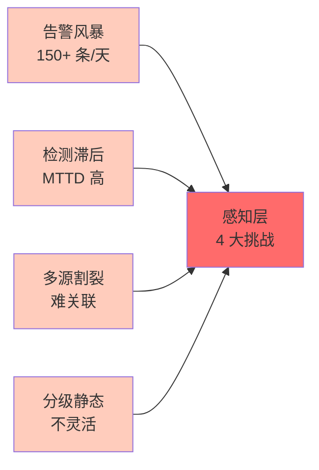
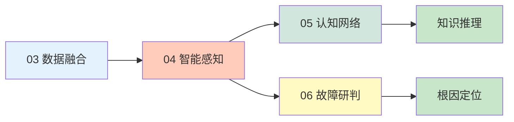
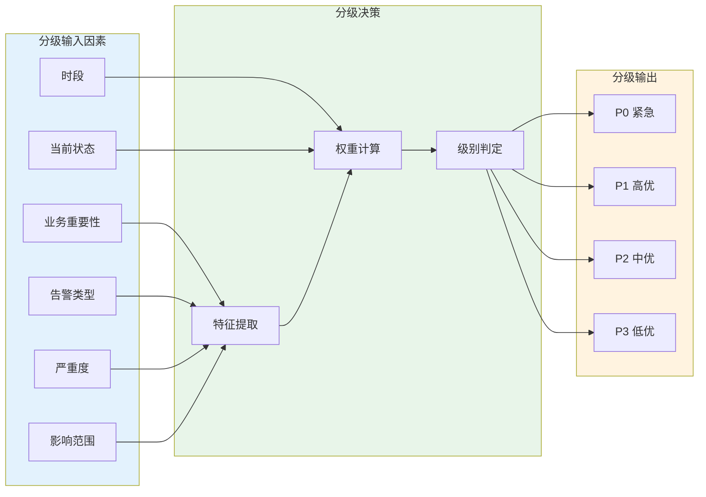
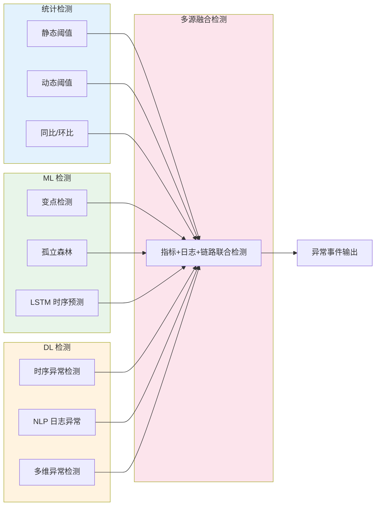
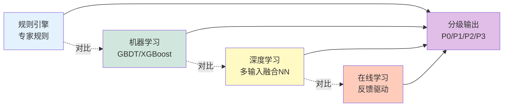
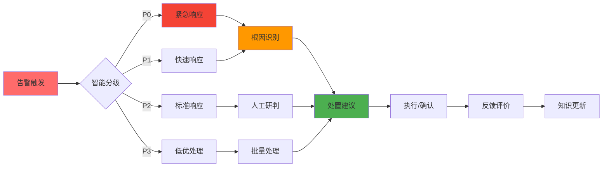
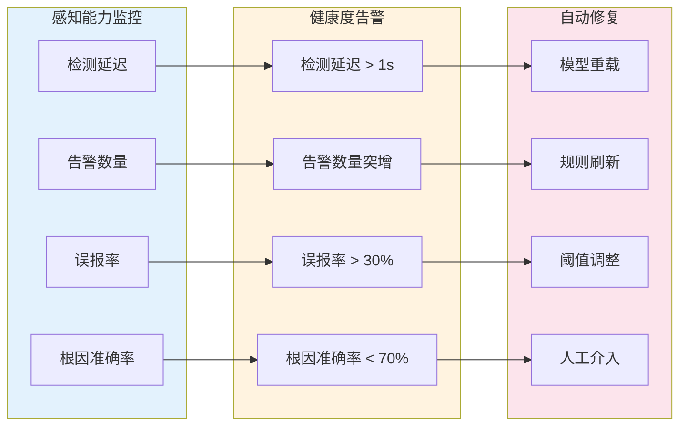
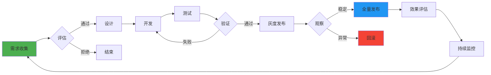
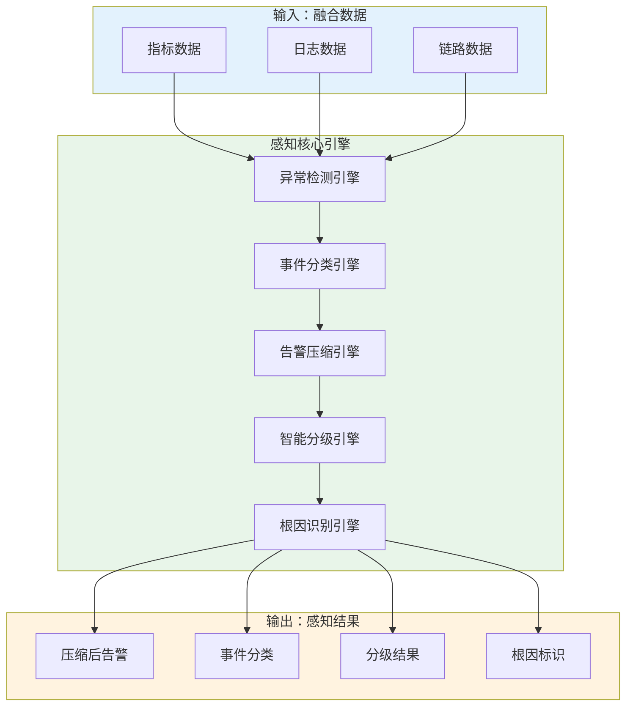

# 业务 04 · 智能感知

> 智能系统运维可观测性 · 第四章

---

## 1. 痛点问题

### 1.1 告警风暴与告警疲劳

智能感知层面临 4 大痛点：**告警风暴、检测滞后、多源割裂、分级静态化**：



在传统运维模式下，系统产生的大量告警信息给运维团队带来了沉重负担。当故障发生时，监控系统往往在短时间内产生数百甚至数千条告警，其中大量是同一故障的衍生告警或误报。这种"告警风暴"现象导致运维人员难以快速定位真正需要关注的根因告警，宝贵的排查时间被淹没在海量噪音之中。行业调研显示，平均每个运维工程师每天需处理 150+ 条告警，其中约 70% 属于误报或重复告警，严重消耗团队精力与响应效率。

### 1.2 异常检测滞后与精准度不足

传统基于阈值的告警规则存在明显的滞后性与精准度问题。一方面，静态阈值无法适应业务动态变化，季节性流量波动往往触发大量无意义的告警；另一方面，关联性异常难以通过单一指标阈值识别，多个微指标异常组合构成的复杂故障场景经常被忽视。结果是：真正影响业务的故障往往发现时已造成实质损失，而大量低价值告警则在消耗运维资源。

### 1.3 多源数据感知割裂

监控、日志、追踪、指标等可观测性数据分散在不同系统中，缺乏统一的感知层将多源数据进行关联融合。当故障发生后，运维人员需要在多个系统之间切换，手动关联来自不同数据源的异常信号，这个过程本身就耗费大量时间。即便发现了异常信号，也难以快速判断这些信号之间的因果关系与影响范围，导致故障研判效率低下。

### 1.4 告警分级静态化

传统告警分级采用静态配置策略，告警级别在告警规则定义时固定，无法根据业务上下文、时段特殊性、当前系统状态等因素进行动态调整。这导致夜间发生的非关键告警可能提升至 P0 打扰正在休息的值班人员，而某些业务高峰期悄然恶化的性能问题却因历史配置原因仍停留在 P2 低优先级，错失最佳处置窗口。

---
## 2. 业务目标
### 2.1 核心目标
**智能感知层的核心使命是：在海量多源数据中及时、准确地识别真正需要关注的异常事件，并将其以清晰、可操作的方式传递给下游研判与响应环节。**
具体而言，智能感知需要实现以下业务目标：
| 目标维度 | 量化指标 | 达成标准 |
|----------|----------|----------|
| 告警收敛率 | 告警压缩比 | ≥ 10:1（同源告警聚合前） |
| 异常发现率 | MTTD（平均发现时间） | < 1 分钟 |
| 根因识别率 | 根因告警准确率 | > 85% |
| 告警分级准确率 | 分级准确率 | > 90% |
| 误报率 | 误报占比 | < 15% |
### 2.2 与上下游的协作目标
智能感知层在 AIOps 链路中处于关键位置：

**上游协同（03 数据融合）：**
- 接收来自数据融合层的统一数据视图（指标、日志、链路融合数据）
- 确保感知算法能够获取完整、一致、高质量的输入数据
- 感知层不做数据采集，只消费融合后的标准化数据
**下游协同（05 认知网络 / 06 故障研判）：**
- 将感知结果（异常事件、根因告警、告警分级）输出至认知层
- 感知结果是认知层构建知识图谱推理的重要输入
- 故障研判依赖感知层提供的事件分类与严重度判定

## 3. 关键能力

### 3.1 实时异常检测

智能感知层基于融合后的多源数据，构建覆盖指标、日志、链路三大维度的实时异常检测能力。

| 检测类型 | 输入数据 | 检测算法 | 输出 |
|----------|----------|----------|------|
| 指标异常检测 | Prometheus 指标、时序数据 | 动态阈值 + 变点检测 | 异常指标事件 |
| 日志异常检测 | 结构化/半结构化日志 | NLP 日志解析 + 模式匹配 | 异常日志事件 |
| 链路异常检测 | Jaeger/Tempo 链路数据 | 调用链质量分析 | 链路延迟/错误事件 |
| 多源联合检测 | 指标+日志+链路关联数据 | 跨维度关联分析 | 综合异常事件 |

### 3.2 事件识别与分类

感知层对检测到的异常进行事件识别，将其归类为不同的运维事件类型，为后续处置提供语义化上下文。

**事件分类体系：**

| 事件类型 | 子类 | 典型特征 | 响应策略 |
|----------|------|----------|----------|
| 故障类 | 服务不可用、性能降级 | 错误率上升、延迟激增 | 立即研判 |
| 变更类 | 配置变更、版本发布 | 时间相关性、配置差异 | 变更验证 |
| 容量类 | 资源耗尽、容量瓶颈 | 资源趋紧趋势 | 扩容评估 |
| 安全类 | 入侵检测、异常访问 | 访问模式异常 | 安全响应 |

### 3.3 告警压缩与收敛

针对告警风暴问题，感知层提供多级告警压缩与收敛机制，将海量告警压缩为可管理数量的有效告警。

**压缩策略矩阵：**

| 压缩策略 | 触发条件 | 压缩效果 |
|----------|----------|----------|
| 同源聚合 | 同一检测源、同一时间窗口 | N:1 |
| 时间窗口压缩 | 同一告警短时间内重复触发 | 时间窗口内合并 |
| 告警抑制 | 高优先级告警触发时抑制低优先级 | 上游抑制下游 |
| 关联压缩 | 具有因果关联的告警序列 | 识别根因、压缩衍生告警 |
| 智能合并 | 相似告警（相似特征、相似服务） | 语义聚合 |

### 3.4 告警智能分级

基于业务上下文、告警特征、影响范围等因素，对告警进行动态分级（分0/P1/P2/P3）。

**分级决策因素：**



### 3.5 根因告警识别

在告警压缩的基础上，进一步区分根因告警与衍生告警，标识真正需要优先处置的根因信号。

**根因识别策略：**

| 策略类型 | 原理 | 适用场景 |
|----------|------|----------|
| 时间序列因果 | 基于告警触发时间序列推断因果 | 传播链路明确的故障 |
| 拓扑关联分析 | 基于服务依赖拓扑判断影响传播方向 | 微服务架构 |
| 特征相似度 | 根因告警与故障时间相关性最强 | 复杂关联故障 |
| 知识图谱推理 | 基于历史根因知识图谱匹配 | 已知故障模式 |

---
## 4. 核心技术
### 4.1 异常检测算法体系
智能感知层采用多层次、多维度的异常检测算法体系，覆盖不同类型的异常场景。

**核心算法说明：**
- **动态阈值（Dynamic Threshold）：** 基于历史数据自动计算自适应阈值，适应业务周期性波动，解决静态阈值误报率高的问题
- **变点检测（Change Point Detection）：** 识别时序数据中统计特性发生突变的点，用于检测服务指标的行为模式变化
- **孤立森林（Isolation Forest）：** 无监督异常检测算法，通过随机切分隔离异常点，适用于多维指标异常识别
- **LSTM 时序预测：** 基于长短时记忆网络的时序预测模型，预测值与实际值的偏差作为异常分数
- **日志语义分析：** 基于 NLP 技术解析日志文本，识别错误模式与异常语义
### 4.2 告警压缩算法
| 算法类型 | 算法原理 | 压缩效果 |
|----------|----------|----------|
| **时间窗口聚合** | 在固定时间窗口内对同源告警进行合并 | 减少 30-50% |
| **告警关联分析** | 基于拓扑和时序关联识别告警链 | 减少 60-80% |
| **相似度聚类** | 基于特征向量相似度对告警进行聚类 | 减少 40-60% |
| **因果推断** | 基于因果图模型识别根因与衍生告警 | 识别根因 |
| **基于强化学习的压缩策略** | 自适应学习最优压缩策略 | 持续优化 |
### 4.3 智能分级模型
**分级决策模型架构：**
```
输入特征 → 特征工程 → 分级模型 → P0/P1/P2/P3
```
| 特征类别 | 特征示例 | 权重说明 |
|----------|----------|----------|
| 业务特征 | 服务等级、用户量级、SLA 要求 | 高权重 |
| 告警特征 | 告警类型、错误率、延迟增量 | 中权重 |
| 时段特征 | 业务高峰/低谷、值班时段 | 中权重 |
| 状态特征 | 当前告警密度、系统负载 | 可调节 |
**分级模型类型：**

### 4.4 根因识别技术
| 技术类型 | 核心原理 | 技术选型 |
|----------|----------|----------|
| **拓扑因果** | 基于服务依赖拓扑的告警传播方向分析 | 图数据库 + 拓扑分析 |
| **时序因果** | 基于格兰杰因果或 CCM 的时序因果推断 | 时间序列分析 |
| **知识图谱推理** | 基于历史根因知识图谱进行模式匹配 | 知识图谱 + 图神经网络 |
| **跨维度关联** | 融合指标、日志、链路的跨维度根因分析 | 多模态融合 |

## 5. 用户体验

### 5.1 感知结果可视化

智能感知层将异常检测与告警结果以直观的方式呈现给运维人员，帮助快速理解当前系统健康状态。

**核心可视化视图：**

| 视图类型 | 展示内容 | 用户价值 |
|----------|----------|----------|
| 异常雷达图 | 多维度异常分布 | 快速了解异常全貌 |
| 告警时间线 | 告警时序与关联关系 | 理解告警传播链路 |
| 根因链路图 | 根因告警与衍生告警关系 | 快速定位根因 |
| 智能分级看板 | 告警分级与处置状态 | 优先级一目了然 |
| 异常热力图 | 服务/集群维度异常分布 | 宏观掌握系统状态 |

### 5.2 告警处置流程



**用户体验优化点：**

- **一键直达根因：** 点击告警可快速查看根因链路，无需手动关联
- **智能处置建议：** 基于知识图谱推荐历史最佳处置方案
- **反馈闭环：** 支持对告警进行"有效/误报/根因"标记，反馈用于模型优化
- **多端通知：** 支持 Web、Mobile、IM 等多端告警推送，可一键处理

### 5.3 感知配置与管理

| 配置项 | 说明 | 默认值 |
|--------|------|--------|
| 异常检测灵敏度 | 控制检测算法的敏感程度 | 中等 |
| 告警压缩窗口 | 告警合并的时间窗口大小 | 5 分钟 |
| 分级策略配置 | P0-P3 分级阈值配置 | 专家规则 |
| 通知渠道配置 | 告警通知渠道与接收人 | 值班表 |
| 抑制规则配置 | 告警抑制条件配置 | 全局抑制 |

**用户配置体验：**
- 提供感知能力配置向导，降低配置复杂度
- 支持模板化配置（按服务类型、按场景批量应用）
- 配置变更实时生效，无需重启服务
- 提供配置影响预览，预判配置变更效果

### 5.4 感知质量反馈

感知层内置质量反馈机制，持续收集用户对感知结果的评价，用于感知能力的持续优化。

**反馈类型：**

| 反馈类型 | 触发方式 | 用途 |
|----------|----------|------|
| 告警有效性评价 | 用户标记"误报/有效" | 优化检测模型 |
| 告警分级评价 | 用户调整告警级别 | 优化分级模型 |
| 根因识别评价 | 用户确认/修正根因 | 优化根因模型 |
| 处置建议评价 | 用户采纳/不采纳建议 | 优化推荐模型 |

---
## 6. 系统质量
### 6.1 功能质量指标
| 质量维度 | 指标名称 | 目标值 | 测量方法 |
|----------|----------|--------|----------|
| 告警覆盖 | 异常检测覆盖率 | > 99% | 故障回访检测率 |
| 检测准确性 | 异常检测准确率 | > 90% | 检测结果验证 |
| 告警收敛 | 告警压缩比 | ≥ 10:1 | 同源告警聚合率 |
| 根因识别 | 根因识别准确率 | > 85% | 根因验证统计 |
| 分级准确 | 告警分级准确率 | > 90% | 分级调整统计 |
| 响应延迟 | 感知端到端延迟 | < 30s | 告警产生到展示 |
### 6.2 非功能质量指标
| 质量维度 | 指标名称 | 目标值 | 说明 |
|----------|----------|--------|------|
| 可用性 | 系统可用性 | > 99.9% | 全年不可用时间 < 8.7h |
| 性能 | 单次检测延迟 | < 100ms | 单事件处理延迟 |
| 吞吐量 | 事件处理能力 | > 10,000 eps | 每秒处理事件数 |
| 扩展性 | 线性扩展比 | > 0.8 | 扩容效率 |
| 数据延迟 | 数据接入延迟 | < 1min | 数据产生到感知 |
### 6.3 感知能力健康度

### 6.4 质量保障机制
| 保障机制 | 说明 | 触发条件 |
|----------|------|----------|
| 模型监控 | 实时监控模型预测性能 | 持续 |
| A/B 测试 | 新模型上线前通过 A/B 测试验证效果 | 模型发布前 |
| 回滚机制 | 模型异常时自动回滚到上一稳定版本 | 模型指标下降 |
| 人工巡检 | 定期人工审核感知结果质量 | 每周 |
| 反馈驱动优化 | 基于用户反馈持续优化感知能力 | 每日 |

## 7. 特性运营

### 7.1 感知能力运营指标

| 运营指标 | 定义 | 统计周期 | 目标值 |
|----------|------|----------|--------|
| 告警总量 | 每日产生的告警数量 | 每日 | 合理范围内 |
| 人均告警量 | 运维人员平均处理告警数 | 每日 | < 50 条/天 |
| 告警有效率 | 有效告警占比 | 每周 | > 85% |
| MTTD | 平均告警发现时间 | 每月 | < 1 分钟 |
| P0 响应率 | P0 告警 5 分钟内响应率 | 每月 | > 98% |
| 感知满意度 | 用户对感知能力的满意度评分 | 每月 | > 4.0/5.0 |

### 7.2 感知能力迭代

**迭代节奏：**

| 迭代类型 | 周期 | 内容 |
|----------|------|------|
| 模型优化 | 每周 | 基于反馈调整检测阈值、更新模型参数 |
| 能力增强 | 每月 | 新增检测场景、优化检测算法 |
| 架构升级 | 每季度 | 引入新算法、升级技术架构 |
| 大版本发布 | 每半年 | 重大功能发布、架构重构 |

**迭代流程：**



### 7.3 用户教育与支持

| 教育类型 | 形式 | 频率 |
|----------|------|------|
| 新功能发布 | 产品公告 + 操作指南 | 按版本 |
| 最佳实践 | 案例分享 + 配置推荐 | 每月 |
| 感知能力培训 | 线上/线下培训 | 每季度 |
| 1:1 支持 | 专项支持 | 按需 |

### 7.4 感知能力价值评估

| 评估维度 | 指标 | 计算方式 |
|----------|------|----------|
| 成本节约 | 减少的无效告警处理时间 | 人均告警量下降 × 处理时间 × 人数 |
| 效率提升 | MTTR 下降 | 故障修复时间减少 |
| 质量提升 | 告警有效率 | 有效告警 / 告警总量 |
| 用户满意度 | 感知满意度评分 | 用户评分平均 |

---
## 8. 本章小结
### 8.1 核心要点回顾
**智能感知层是连接数据融合与认知推理的关键桥梁。** 它基于第三章融合后的统一数据视图，对多源可观测性数据进行实时异常检测、事件识别、告警压缩与智能分级，将海量、低价值的原始告警转化为少量、高质量的根因告警，传递给下游认知层进行知识推理与故障研判。
**本章核心能力总结：**
| 能力 | 说明 | 关键价值 |
|------|------|----------|
| 实时异常检测 | 指标/日志/链路多维检测 | MTTD < 1 分钟 |
| 事件识别分类 | 故障/变更/容量/安全分类 | 语义化事件 |
| 告警压缩收敛 | 多级压缩策略 | 压缩比 ≥ 10:1 |
| 智能告警分级 | P0/P1/P2/P3 动态分级 | 分级准确率 > 90% |
| 根因告警识别 | 根因 vs 衍生告警区分 | 根因准确率 > 85% |
### 8.2 技术架构总结

### 8.3 上下文关系
| 章节 | 定位 | 与智能感知的关系 |
|------|------|-------------------|
| 03 数据融合 | 提供统一数据视图 | 感知层的输入数据来源 |
| **04 智能感知** | **实时感知与事件识别** | **本章核心** |
| 05 认知网络 | 知识图谱与推理 | 感知结果用于知识推理输入 |
| 06 故障研判 | 根因定位与分析 | 感知结果用于故障研判输入 |
### 8.4 关键设计原则
1. **数据驱动：** 感知能力依赖数据融合层提供的高质量数据，数据质量直接决定感知效果
2. **逐层递进：** 感知能力按检测→分类→压缩→分级→根因识别的顺序逐层递进，每层输出为下层输入
3. **可配置可观测：** 所有感知策略均可配置，感知过程与结果可观测、可干预
4. **反馈闭环：** 感知结果持续收集用户反馈，用于感知能力的持续优化与进化
5. **性能优先：** 感知延迟直接影响故障响应效率，需保证端到端延迟 < 30s
### 8.5 未来演进方向
| 演进方向 | 目标 | 关键技术 |
|----------|------|----------|
| 预测性感知 | 从被动检测到主动预测 | 时序预测、异常预测 |
| 语义化感知 | 从信号识别到语义理解 | NLP、LLM |
| 自适应感知 | 从人工配置到自动调优 | 在线学习、强化学习 |
| 跨组织感知 | 从单系统到跨组织协同 | 联邦学习、协同感知 |
### 8.6 核心要点速记
**5 个关键认知：**
1. **告警压缩是第一价值** — 没有压缩，告警风暴会让感知层失去价值
2. **根因识别是核心能力** — 区分根因与衍生告警，直接决定运维效率
3. **分级准确率是体验基础** — 错误的级别会导致处置顺序混乱
4. **反馈闭环是进化关键** — 用户反馈是感知能力持续优化的唯一路径
5. **感知延迟决定响应速度** — 端到端延迟 < 30s 是底线
**4 个落地原则：**
| 原则 | 描述 |
|------|------|
| **先压缩，后分级** | 没有压缩的告警分级是空中楼阁 |
| **先规则，后算法** | 规则稳定可解释，算法持续优化 |
| **先准确，后召回** | 宁可漏报，不要误报 |
| **先反馈，后优化** | 没有反馈的优化是盲目优化 |
### 8.7 关键指标速查
| 指标类别 | 关键指标 | 目标值 |
|----------|----------|--------|
| **效率** | MTTD | < 1 分钟 |
| **效率** | 端到端延迟 | < 30s |
| **效率** | 单次检测延迟 | < 100ms |
| **效率** | 事件处理能力 | > 10,000 eps |
| **准确** | 异常检测准确率 | > 90% |
| **准确** | 根因识别准确率 | > 85% |
| **准确** | 分级准确率 | > 90% |
| **准确** | 误报率 | < 15% |
| **运营** | 告警压缩比 | ≥ 10:1 |
| **运营** | 告警有效率 | > 85% |
| **运营** | P0 5min 响应率 | > 98% |
| **运营** | 感知满意度 | > 4.0/5.0 |
### 8.8 学习路径建议
**3 类学习路径：**
| 目标 | 建议路径 | 时长 |
|------|----------|------|
| **快速理解** | 阅读 8.1 核心要点 + 8.2 架构 | 5 分钟 |
| **深入掌握** | 完整阅读 1-7 节 | 60 分钟 |
| **专家级** | 1-7 节 + 03/05 章节 + 实践 | 半天 |
**与其他章节的关联：**
| 关联章节 | 关联内容 |
|----------|----------|
| 03 数据融合 | 感知数据来源（融合后的统一数据）|
| 05 认知网络 | 感知结果用于知识推理 |
| 06 故障研判 | 根因告警直接输入故障研判 |
| 07 根因分析 | 根因识别技术互补 |
| 08 影响分析 | 感知告警驱动影响分析 |

