# 业务 05 · 认知网络

> 智能系统运维可观测性 · 基于知识图谱的运维认知与推理

---

## 1. 痛点问题

### 1.1 运维知识碎片化：难以形成整体认知

认知网络面临 3 大痛点：**知识碎片化、推理困难、问答障碍**：

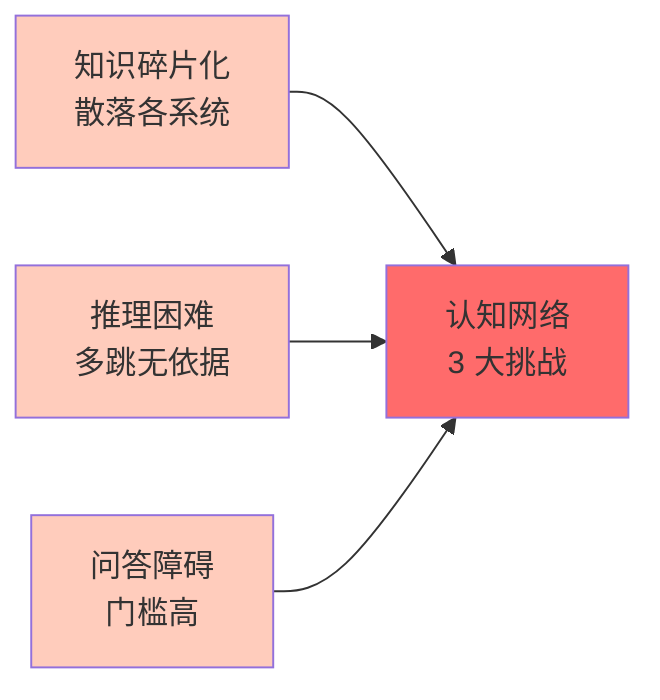

在大型分布式系统中，运维知识散落在各个系统和人脑中，存在以下典型问题：

| 痛点场景 | 现状描述 | 后果 |
|----------|----------|------|
| **知识孤岛** | 告警日志、CMDB、运维手册散落在不同系统 | 无法关联分析 |
| **经验流失** | 专家解决问题的经验停留在个人脑中 | 人员更迭导致知识断层 |
| **隐性知识** | 故障处理思路、依赖关系未显性化 | 新人难以继承 |
| **知识过时** | 文档多年未更新，与实际系统脱节 | 依据错误信息做决策 |

**典型案例：** 某金融服务公司核心系统故障，虽然有完善的监控告警，但工程师无法快速判断故障影响范围——需要联系 5 个团队、翻阅 3 份文档、耗时 2 小时才能确认影响面。根因竟是一个普通配置变更，但因缺乏依赖关系知识，变更评估未覆盖到该系统。

### 1.2 故障定位的认知瓶颈

当前故障定位面临三大认知挑战：

| 瓶颈类型 | 描述 | 影响 |
|----------|------|------|
| **关联缺失** | 告警与服务、主机、配置的关联关系不明确 | 告警上下文丢失 |
| **推理困难** | 无法基于已有知识做多跳推理 | 根因定位效率低 |
| **问答障碍** | 工程师需要用 SQL 或 API 查询，无法自然语言交互 | 门槛高、效率低 |

```
传统方式的问题：
- 工程师：「这个告警是什么意思？」→ 查文档、等回复
- 自动化：「这个告警该怎么处理？」→ 无标准答案
- 团队：「以前遇到过类似问题吗？」→ 不知道
```

### 1.3 知识与决策的鸿沟

| 维度 | 现状 | 理想状态 |
|------|------|----------|
| 告警理解 | 单条告警，独立处理 | 关联上下文物种上下文 |
| 故障定位 | 人工逐条排查 | 基于知识图谱推理 |
| 决策支持 | 依赖个人经验 | 基于历史案例推荐 |
| 知识复用 | 每次从零开始 | 知识沉淀随时调用 |

---
## 2. 业务目标
### 2.1 核心目标
**构建运维知识图谱，实现知识的表示、推理与问答，赋能智能运维决策**
| 目标 | 量化指标 | 业务价值 |
|------|----------|----------|
| 知识覆盖度 | 实体覆盖率 ≥ 95% | 覆盖绝大部分运维对象 |
| 推理准确率 | 因果推理准确率 ≥ 90% | 推理结果可信可用 |
| 问答准确率 | 自然语言问答准确率 ≥ 85% | 降低使用门槛 |
| 知识更新率 | 变更后 10 分钟内更新图谱 | 保持知识时效性 |
### 2.2 分层目标
#### L1：知识表示层
```
目标：建立运维领域的统一知识表示模型
- 实体：服务、主机、容器、告警、变更、事件
- 关系：调用、依赖、影响、导致、同义
- 属性：状态、版本、负责人、配置、时间
```
#### L2：知识构建层
```
目标：从多源数据中自动抽取运维知识
- 拓扑数据 → 服务依赖关系
- 监控数据 → 指标与告警关联
- 日志数据 → 错误模式与根因
- 文档数据 → 操作步骤与最佳实践
- 案例数据 → 历史故障与解决方案
```
#### L3：知识推理层
```
目标：基于知识图谱提供推理能力
- 关联分析：给定告警，找出所有相关实体
- 路径查询：查询服务A到服务B的完整路径
- 推理预测：基于历史模式预测故障传播
- 问答交互：自然语言查询运维知识
```
### 2.3 业务场景覆盖
| 场景 | 知识需求 | 决策支持 |
|------|----------|----------|
| **故障定位** | 告警关联的服务、主机、配置 | 缩小排查范围 |
| **影响评估** | 故障服务的影响链和下游 | 确定影响范围 |
| **根因分析** | 故障传播路径和因果关系 | 找到根因 |
| **变更评估** | 变更涉及的实体和依赖 | 评估变更风险 |
| **智能问答** | 自然语言查询运维知识 | 快速获取答案 |

## 3. 关键能力

### 3.1 运维知识表示

| 能力 | 描述 | 优先级 |
|------|------|--------|
| **实体建模** | 定义运维领域核心实体及属性 | P0 |
| **关系建模** | 定义实体间的关系类型及方向 | P0 |
| **属性标准化** | 统一实体的属性命名和格式 | P1 |
| **本体构建** | 建立运维知识本体（Ontology） | P1 |
| **多视图支持** | 支持不同业务域的子图视图 | P2 |

**核心实体类型：**

| 实体类型 | 示例 | 关键属性 |
|----------|------|----------|
| Service | order-service, inventory-service | name, version, owner, SLA |
| Host | 10.0.1.15, node-001 | ip, region, role, status |
| Alert | CPU_HIGH, MEMORY_LEAK | type, severity, timestamp |
| Change | 发布、配置变更、扩缩容 | type, time, operator |
| Incident | P1故障、性能降级 | level, start_time, root_cause |
| Document | 运维手册、架构图、API文档 | title, content, last_update |

**核心关系类型：**

| 关系类型 | 方向 | 示例 |
|----------|------|------|
| CALLS | → | order-service CALLS inventory-service |
| DEPENDS_ON | → | payment-service DEPENDS_ON mysql-payment |
| HOSTED_ON | → | order-service HOSTED_ON pod-xyz |
| CAUSED_BY | → | alert-123 CAUSED_BY change-456 |
| IMPACTS | → | incident-001 IMPACTS customer-order |
| SIMILAR_TO | ↔ | alert-A SIMILAR_TO alert-B |

### 3.2 知识图谱构建

| 能力 | 描述 | 优先级 |
|------|------|--------|
| **拓扑知识提取** | 从拓扑建模模块提取服务依赖关系 | P0 |
| **告警知识提取** | 从智能感知模块提取告警关联知识 | P0 |
| **文档知识抽取** | 从运维文档中抽取实体和关系 | P1 |
| **历史案例挖掘** | 从历史故障中抽取根因和解决方案 | P1 |
| **增量更新** | 支持知识的增量更新和版本管理 | P0 |
| **知识融合** | 合并多源知识，消解冲突 | P1 |

### 3.3 知识推理引擎

| 能力 | 描述 | 优先级 |
|------|------|--------|
| **关联查询** | 基于图谱的关联关系查询 | P0 |
| **路径分析** | 计算两点之间的所有路径 | P0 |
| **传播推理** | 基于拓扑的故障传播推理 | P0 |
| **相似推理** | 基于实体相似度的推理 | P1 |
| **时序推理** | 基于时间序列的因果推理 | P1 |
| **规则推理** | 基于专家规则的逻辑推理 | P2 |

### 3.4 智能问答

| 能力 | 描述 | 优先级 |
|------|------|--------|
| **意图识别** | 识别用户查询的意图 | P0 |
| **实体抽取** | 从自然语言中抽取运维实体 | P0 |
| **查询构建** | 将自然语言转换为图谱查询 | P0 |
| **答案生成** | 将查询结果组织为自然语言 | P1 |
| **多轮对话** | 支持多轮追问和澄清 | P2 |

### 3.5 知识更新与进化

| 能力 | 描述 | 优先级 |
|------|------|--------|
| **自动触发** | 变更事件自动触发知识更新 | P0 |
| **增量同步** | 增量更新，避免全量重建 | P0 |
| **版本管理** | 保留知识版本，支持回溯 | P1 |
| **质量校验** | 自动校验新知识的准确性 | P1 |
| **遗忘机制** | 自动清理过时知识 | P2 |

---
## 4. 核心技术
### 4.1 知识图谱架构
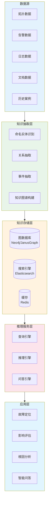
### 4.2 知识表示模型
#### 运维知识本体模型
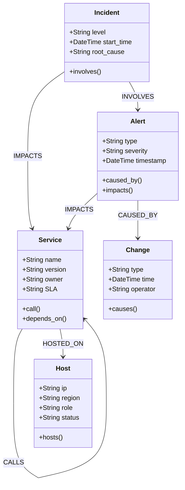
#### 知识表示示例
```
实体示例：
(:Service {name: "order-service", version: "v2.1.0", owner: "order-team"})
(:Alert {type: "CPU_HIGH", severity: "critical", timestamp: "2026-06-03T10:00:00Z"})
关系示例：
(:Service {name: "order-service"})-[:CALLS {protocol: "HTTP", path: "/api/inventory"}]->(:Service {name: "inventory-service"})
(:Alert {type: "CPU_HIGH"})-[:IMPACTS]->(:Service {name: "order-service"})
(:Change {type: "CONFIG_UPDATE"})-[:CAUSED_BY]->(:Alert {type: "MEMORY_LEAK"})
```
### 4.3 知识抽取算法
#### 基于深度学习的实体识别
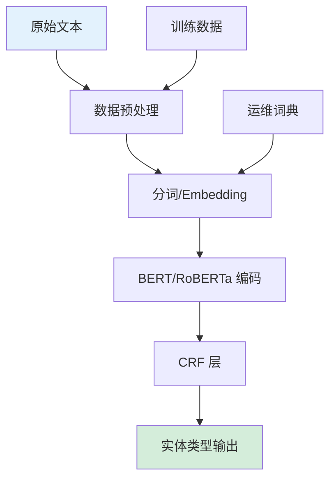
**实体识别模型：**
```
输入：「order-service 调用了 inventory-service 的库存查询接口」
输出：
- Service: order-service
- CALLS: order-service → inventory-service
- Endpoint: /api/inventory
```
#### 基于规则的关系抽取
```python
# 关系抽取规则示例
rules = {
    "CALLS": [
        r"(\w+[-]?\w*) 调用 (\w+[-]?\w*)",
        r"(\w+[-]?\w*) 访问 (\w+[-]?\w*)",
        r"(\w+[-]?\w*) 依赖 (\w+[-]?\w*)",
    ],
    "HOSTED_ON": [
        r"(\w+[-]?\w*) 部署在 (\w+[-]?\w*)",
        r"(\w+[-]?\w*) 运行于 (\w+[-]?\w*)",
    ],
    "CAUSED_BY": [
        r"(\w+) 导致 (\w+)",
        r"(\w+) 引起 (\w+)",
        r"(\w+) 触发 (\w+)",
    ]
}
```
#### 从拓扑数据构建知识图谱
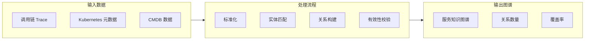
### 4.4 知识推理引擎
#### 图遍历推理
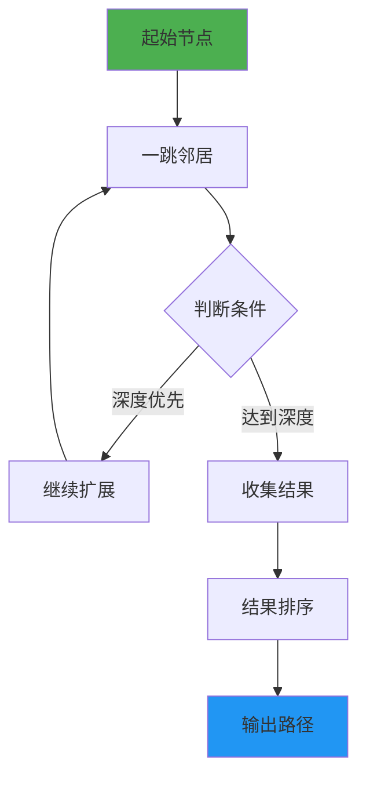
**核心查询场景：**
| 场景 | 图谱查询 | 结果 |
|------|----------|------|
| 上游查询 | `MATCH (s)-[:CALLS*]->(target) WHERE target.name="X"` | X的所有上游服务 |
| 下游查询 | `MATCH (s)<-[:CALLS*]-(target) WHERE target.name="X"` | X的所有下游服务 |
| 影响分析 | `MATCH (故障)-[:IMPACTS*]->(受影响)` | 故障影响范围 |
| 最短路径 | `MATCH p = shortestPath((a)-[:CALLS*]->(b))` | 两服务间的最短路径 |
| 共同邻居 | `MATCH (a)-[]-(c)-[]-(b) WHERE a.name="X" AND b.name="Y"` | X和Y的共同关联 |
#### 规则推理引擎
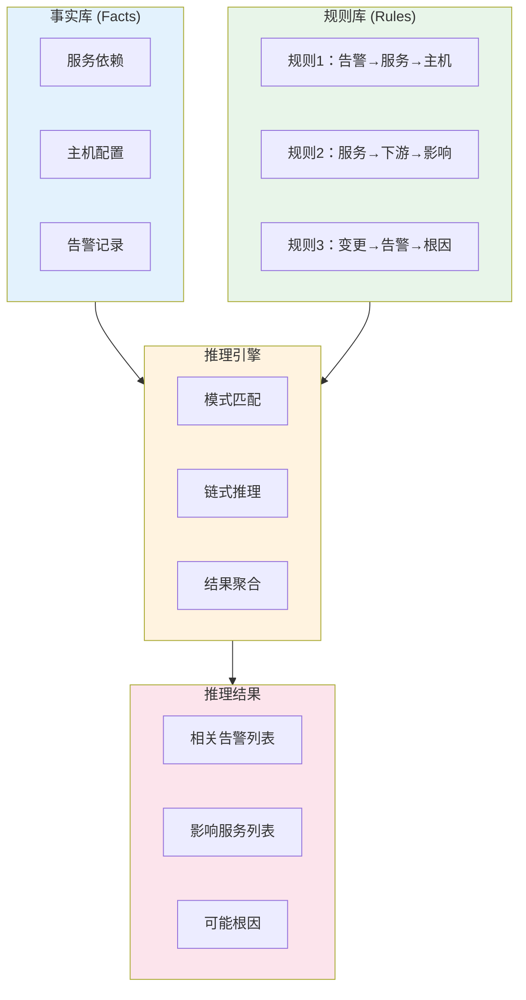
**规则示例：**
```python
# 故障传播推理规则
rules = [
    {
        "name": "service_cascade_failure",
        "condition": "Alert.type == 'SERVICE_DOWN' AND Service.status == 'degraded'",
        "action": "infer Service.downstream as IMPACTED"
    },
    {
        "name": "host_resource_exhaustion",
        "condition": "Alert.type IN ['CPU_HIGH', 'MEM_HIGH'] AND Host.utilization > 0.9",
        "action": "infer Host.services at_risk"
    },
    {
        "name": "change_triggered_alert",
        "condition": "Change.time > Alert.timestamp - 30min AND Change.services ∩ Alert.services",
        "action": "infer Alert.caused_by Change"
    }
]
```
### 4.5 智能问答系统
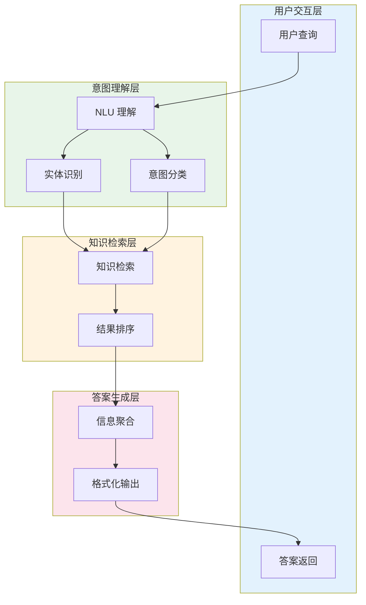
**问答能力矩阵：**
| 问题类型 | 示例问句 | 预期回答 |
|----------|----------|----------|
| **实体查询** | 「order-service 的负责人是谁？」 | 返回服务负责人信息 |
| **关系查询** | 「哪些服务依赖 mysql-order？」 | 返回依赖该服务的服务列表 |
| **影响分析** | 「如果 order-service 挂了会影响哪些服务？」 | 返回影响链和服务列表 |
| **路径查询** | 「从网关到 order-service 的调用路径是什么？」 | 返回完整调用链路 |
| **时序查询** | 「最近 24 小时有哪些告警？」 | 返回告警列表及时间 |
| **推荐查询** | 「这个告警应该怎么处理？」 | 返回历史解决方案 |
### 4.6 知识更新机制
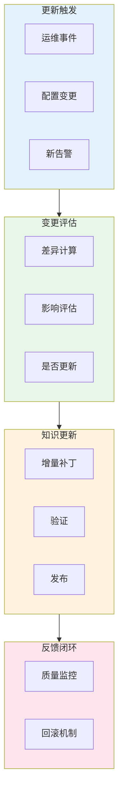

## 5. 用户体验

### 5.1 知识图谱查询交互

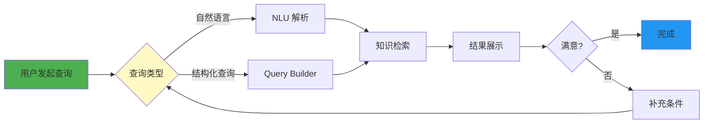

### 5.2 智能问答界面

#### 问答交互设计

| 功能模块 | 描述 | 交互方式 |
|----------|------|----------|
| **输入框** | 支持自然语言输入 | 文本输入、语音输入 |
| **快捷问题** | 预置高频问题按钮 | 点击即问 |
| **上下文记忆** | 记住当前会话上下文 | 多轮对话 |
| **结果展示** | 知识卡片+原始数据 | 点击展开详情 |
| **来源标注** | 标明答案来源和置信度 | 可信度标识 |

#### 问答示例

```
用户：这个告警影响了哪些服务？
系统：
┌─────────────────────────────────────────────────────┐
│ 🔴 告警：order-service CPU 使用率 > 90%             │
├─────────────────────────────────────────────────────┤
│ 📊 影响范围：                                       │
│    • 直接影响：2 个服务                             │
│      - payment-service（调用 order-service）         │
│      - shipping-service（调用 order-service）        │
│    • 间接影响：5 个服务                             │
│      - checkout-service → payment → order           │
│      - ...                                          │
├─────────────────────────────────────────────────────┤
│ 💡 建议操作：                                       │
│    1. 查看 order-service 详细指标                   │
│    2. 查看上下游调用链                              │
│    3. 评估是否需要扩容                              │
└─────────────────────────────────────────────────────┘
```

### 5.3 图谱可视化

#### 知识图谱浏览

```
功能：
- 以图形方式展示实体和关系
- 支持缩放、拖拽、筛选
- 点击节点查看详情
- 高亮选中路径

视觉规范：
- 服务节点：圆形，蓝色
- 主机节点：方形，绿色
- 告警节点：菱形，红色
- 调用关系：实线箭头
- 依赖关系：虚线箭头
- 因果关系：红色箭头
```

#### 故障传播可视化

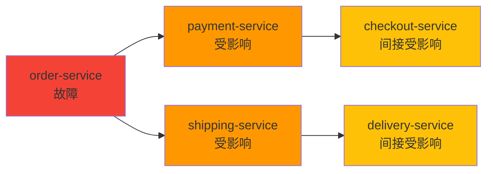

### 5.4 知识订阅与推送

| 功能 | 描述 | 场景 |
|------|------|------|
| **变更订阅** | 订阅特定服务/主机的变更 | 关注核心系统变更 |
| **告警订阅** | 订阅特定类型的告警 | 关注SLA相关告警 |
| **知识更新推送** | 推送相关知识更新 | 保持知识时效性 |
| **智能提醒** | 基于上下文智能提醒 | 故障时的建议操作 |

---
## 6. 系统质量
### 6.1 性能指标
| 指标 | 要求 | 验收标准 |
|------|------|----------|
| **图谱查询延迟** | 简单查询 < 100ms，复杂查询 < 500ms | P95 < 500ms |
| **知识更新延迟** | 变更触发到知识更新完成 < 10 分钟 | P95 < 10min |
| **问答响应时间** | 首次响应 < 2 秒 | P95 < 2s |
| **并发查询能力** | 支持 100 并发查询 | 99th < 3s |
| **图规模容量** | 单图支持 50 万节点、500 万边 | 查询性能不降 |
### 6.2 准确性指标
| 指标 | 要求 | 验收标准 |
|------|------|----------|
| **实体识别准确率** | 从文本中正确识别运维实体 | ≥ 92% |
| **关系抽取准确率** | 正确抽取实体间关系 | ≥ 88% |
| **推理准确率** | 推理结果与实际一致 | ≥ 90% |
| **问答准确率** | 回答正确且完整 | ≥ 85% |
| **知识覆盖率** | 实际运维对象被知识图谱覆盖 | ≥ 95% |
### 6.3 可用性指标
| 指标 | 要求 | 验收标准 |
|------|------|----------|
| **系统可用性** | 全年运行不中断 | 99.9% |
| **知识完整性** | 无关键知识缺失 | 99.5% |
| **更新成功率** | 知识更新操作成功 | ≥ 99% |
| **故障恢复时间** | 节点故障后自动恢复 | < 5min |
### 6.4 质量保障机制
| 机制 | 描述 | 触发条件 |
|------|------|----------|
| **交叉验证** | 用多个数据源验证知识一致性 | 发现冲突 |
| **人工审核** | 关键知识变更需人工确认 | 高风险变更 |
| **历史回溯** | 新知识与历史知识对比 | 发现异常 |
| **用户反馈** | 用户反馈纠正错误知识 | 反馈标记 |
| **定期巡检** | 定期检查知识图谱质量 | 每月 |

## 7. 特性运营

### 7.1 核心运营指标

| 指标 | 定义 | 目标值 |
|------|------|--------|
| **知识覆盖率** | 有知识的实体 / 总运维实体 | > 95% |
| **关系完整度** | 有关系的实体 / 有知识的实体 | > 90% |
| **使用率** | 过去 30 天使用认知网络的用户数 / 总用户数 | > 70% |
| **问答量** | 每日智能问答次数 | 持续增长 |
| **决策支撑** | 认知网络支撑的决策次数 | 可追踪 |

### 7.2 运营工作流

#### 知识构建流程

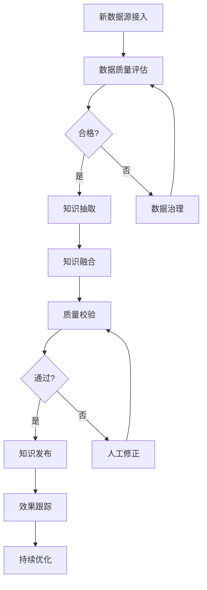

#### 知识质量巡检

| 频率 | 内容 | 输出 |
|------|------|------|
| 每日 | 新增实体/关系数量、异常检测 | 巡检日报 |
| 每周 | 知识变化趋势、冲突检测 | 巡检周报 |
| 每月 | 覆盖率变化、人工验证抽样 | 月度评估报告 |
| 每季度 | 知识体系合理性评估 | 架构评审材料 |

### 7.3 用户赋能

| 赋能场景 | 支持内容 | 效果指标 |
|----------|----------|----------|
| **快速定位** | 基于知识图谱快速找到故障相关实体 | MTTR -40% |
| **智能问答** | 自然语言查询运维知识 | 查询时间 -60% |
| **变更评估** | 评估变更对上下游的影响 | 变更事故 -50% |
| **知识传承** | 专家经验沉淀为可查询知识 | 知识流失 -80% |

### 7.4 持续优化机制

| 阶段 | 行动 | 反馈来源 |
|------|------|----------|
| 上线 1 周 | 收集问答准确率反馈，优化模型 | 用户反馈 |
| 上线 1 月 | 分析查询日志，优化高频场景 | 系统数据 |
| 上线 3 月 | 扩展知识覆盖范围，补全领域知识 | 业务梳理 |
| 上线 6 月 | 整体复盘，优化知识表示和推理策略 | 综合评估 |

---
## 8. 本章小结
### 8.1 核心价值回顾
| 维度 | 内容 |
|------|------|
| **解决什么问题** | 运维知识碎片化、推理困难、问答障碍 |
| **核心能力** | 知识表示、图谱构建、推理引擎、智能问答、知识进化 |
| **技术方案** | 深度学习抽取 + 图数据库存储 + 规则推理 + NLP 问答 |
| **业务目标** | 知识覆盖率 ≥ 95%、推理准确率 ≥ 90%、问答准确率 ≥ 85% |
### 8.2 在 AIOps 链路中的位置
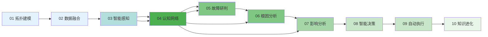
**认知网络是 AIOps 的「大脑」：**
- **上游承接**：接收智能感知的异常检测结果，补充上下文
- **下游赋能**：为故障研判和根因分析提供知识推理能力
- **横向支撑**：贯穿整个链路，提供统一的运维知识服务
### 8.3 与其他章节的接口
| 章节 | 输入 | 输出 |
|------|------|------|
| 03 数据融合 | 多源数据作为知识抽取的原材料 | 高质量训练数据 |
| 04 智能感知 | 异常检测结果作为图谱节点 | 告警上下文知识 |
| 06 故障研判 | 拓扑关系作为传播路径 | 影响范围推理结果 |
| 07 根因分析 | 知识图谱作为因果推理基础 | 可能根因集合 |
| 10 知识进化 | 新故障案例作为知识更新来源 | 持续优化的知识图谱 |
### 8.4 关键成功要素
| 要素 | 说明 | 优先级 |
|------|------|--------|
| **数据质量** | 知识抽取源数据的质量和覆盖度 | P0 |
| **表示准确** | 知识本体模型能否准确表达运维语义 | P0 |
| **推理有效** | 推理引擎能否得出正确、有用的结论 | P0 |
| **问答体验** | 自然语言问答的准确性和易用性 | P1 |
| **实时更新** | 知识图谱能否跟上系统变化 | P1 |
### 8.5 未来演进方向
| 方向 | 内容 | 阶段 |
|------|------|------|
| **多模态知识** | 支持日志、指标、配置等多模态知识表示 | V2 |
| **主动推理** | 基于时序模式的预测性推理 | V2 |
| **知识协同** | 多团队知识共享与协同编辑 | V3 |
| **行业知识库** | 预置行业运维知识模板 | V3 |
| **自适应学习** | 从运维操作反馈中自动优化知识表示 | V4 |
### 8.6 核心要点速记
**5 个关键认知：**
1. **认知网络是 AIOps 的「大脑」** — 承接数据，提供理解和推理能力
2. **知识图谱是核心资产** — 所有推理和问答都依赖图谱的质量
3. **多跳推理是核心能力** — 简单查询没有价值，复杂推理才是壁垒
4. **自然语言问答是体验门面** — 决定了用户对智能化的第一感知
5. **知识进化是长期生命力** — 没有进化机制的知识图谱会快速过时
**4 个落地原则：**
| 原则 | 描述 |
|------|------|
| **先本体，后实例** | 先设计本体模型，再填充实例数据 |
| **先构建，后推理** | 没有完整图谱，推理引擎无从发挥 |
| **先问答，后智能** | 问答是用户的刚性需求，先做扎实 |
| **先规则，后学习** | 规则稳定可解释，机器学习持续优化 |
### 8.7 关键指标速查
| 指标类别 | 关键指标 | 目标值 |
|----------|----------|--------|
| **知识** | 知识覆盖率 | ≥ 95% |
| **知识** | 知识准确率 | ≥ 90% |
| **推理** | 推理准确率 | ≥ 90% |
| **推理** | 推理响应时间 | P95 < 500ms |
| **问答** | 问答准确率 | ≥ 85% |
| **问答** | 问答满意度 | > 4.0/5.0 |
| **性能** | 图谱查询延迟 | P95 < 500ms |
| **性能** | 知识更新延迟 | < 10 分钟 |
| **可用** | 系统可用性 | 99.9% |
| **运营** | 知识条目数 | 持续增长 |
| **运营** | 月活用户 | 持续增长 |
| **运营** | 推理调用量 | 持续增长 |
### 8.8 学习路径建议
**3 类学习路径：**
| 目标 | 建议路径 | 时长 |
|------|----------|------|
| **快速理解** | 阅读 8.1 + 8.2 核心价值 | 5 分钟 |
| **深入掌握** | 完整阅读 1-7 节 | 60 分钟 |
| **专家级** | 1-7 节 + 03/04 章节 + 实践 | 半天 |
**与其他章节的关联：**
| 关联章节 | 关联内容 |
|----------|----------|
| 03 数据融合 | 知识抽取的原材料来源 |
| 04 智能感知 | 异常检测结果作为图谱节点 |
| 06 故障研判 | 拓扑关系作为传播路径 |
| 07 根因分析 | 知识图谱作为因果推理基础 |
| 10 知识进化 | 持续优化的反馈来源 |

> 本章定义了智能运维可观测性平台的认知核心：运维知识图谱。认知网络为整个平台提供「理解」和「推理」能力，是从数据到决策的关键桥梁。后续故障研判和根因分析将依赖本章构建的知识图谱进行智能推理。

_文档版本：V1.0 | 更新日期：2026-06-03_