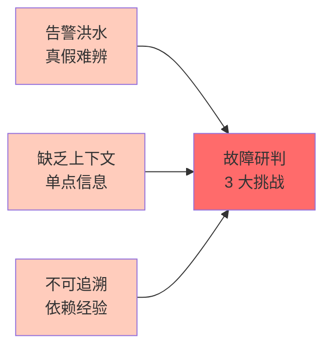
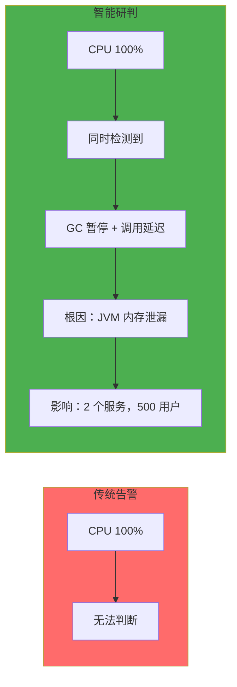
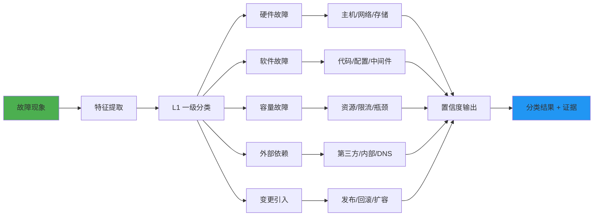
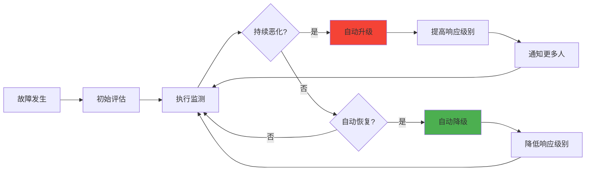
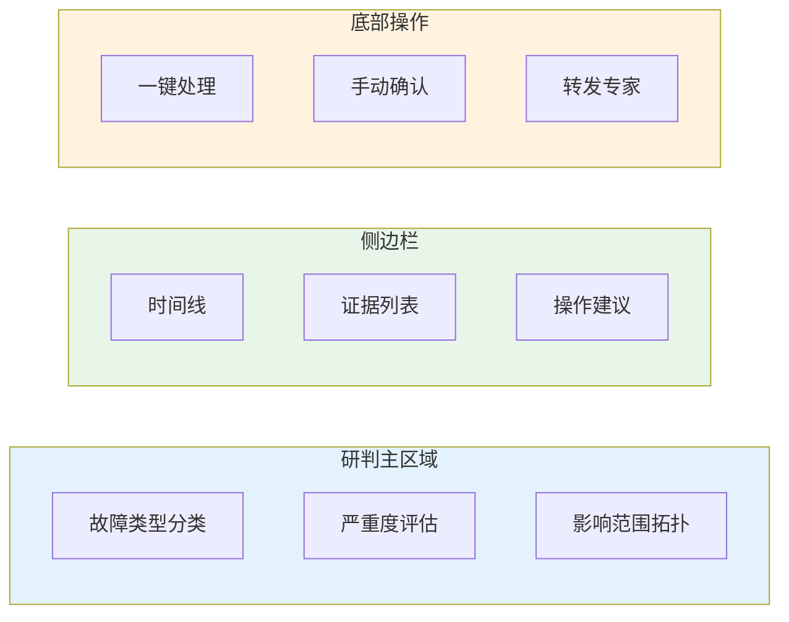
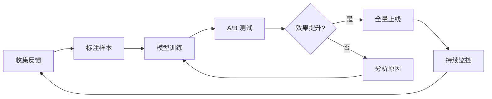
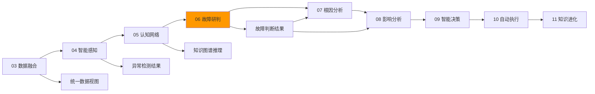

# 业务 06 · 故障研判

> 智能系统运维可观测性 · 基于感知数据与知识图谱的智能故障研判

---

## 1. 痛点问题

### 1.1 告警洪水中难以分辨真正的故障

故障研判面临 3 大痛点：**告警洪水、缺乏上下文、不可追溯**：



在大型分布式系统中，每分钟可能产生数百甚至数千条告警。运维工程师面对的挑战是：

| 痛点场景 | 现状描述 | 后果 |
|----------|----------|------|
| **告警真假难辨** | 告警触发≠故障发生，误报率高达 60%+ | 人工排查浪费大量时间 |
| **告警分类困难** | 硬件故障、软件故障、配置错误、外部依赖——症状相似但处置完全不同 | 处置方向错误 |
| **故障叠加** | 多故障同时发生，告警互相掩盖 | 根因被淹没 |
| **严重度误判** | 按告警级别而非实际影响分级，导致 P0 被当作 P2 处理 | 重大故障延迟响应 |

**行业数据：** Google SRE 统计显示，工程师在故障定位中 70% 的时间花在"判断这是什么故障"上，而非"如何修复"。

### 1.2 缺乏故障上下文，研判效率低下

传统告警只提供单点信息，缺乏关联上下文：



### 1.3 研判结果不可追溯，难以复盘

传统模式下：
- 研判过程依赖工程师个人经验，无法显式记录
- 复盘时无法还原当时的判断依据
- 不同工程师对同一故障可能给出不同结论
- 知识无法沉淀，下次同类故障仍需重新排查

---
## 2. 业务目标
### 2.1 核心目标
**构建智能故障研判系统，将故障识别时间从"小时级"降到"分钟级"**
| 目标 | 当前值 | 目标值 | 提升 |
|------|--------|--------|------|
| 故障识别时间 | 30 分钟 | 5 分钟 | 6x |
| 故障分类准确率 | 70% | 95% | +25% |
| 严重度评估准确率 | 65% | 90% | +25% |
| 研判自动化率 | 30% | 80% | +2.7x |
### 2.2 分层目标
#### L1：故障识别
```
目标：快速、准确地判断是否发生了真实故障
- 区分真故障与假告警（误报、噪音）
- 识别故障开始时间和影响范围
- 检测异常模式（平稳期 vs 异常期）
```
#### L2：故障分类
```
目标：判断故障类型，指导处置方向
- 硬件故障（主机、网络、存储）
- 软件故障（代码 bug、配置错误）
- 容量故障（资源耗尽、过载）
- 外部依赖故障（第三方服务不可用）
- 变更引入故障（发布、回滚触发）
```
#### L3：严重度评估
```
目标：评估故障实际影响，确定响应优先级
- 用户影响（影响多少用户、哪些地区）
- 业务影响（影响哪些业务域、SLA）
- 收入影响（预估损失金额）
- 持续时间（已持续多久、是否还在持续）
```
### 2.3 业务场景
| 场景 | 研判输入 | 研判输出 |
|------|----------|----------|
| **告警触发** | 多源告警 | 故障确认 + 类型分类 + 严重度 |
| **异常检测** | 指标异常、日志异常 | 异常类型 + 可能原因 + 影响评估 |
| **故障定位辅助** | 告警 + 拓扑 + 历史 | 优先排查方向 + 关联告警 |
| **变更风险评估** | 变更计划 + 拓扑 | 变更风险等级 + 可能影响 |

## 3. 关键能力

### 3.1 故障类型分类

| 能力 | 描述 | 优先级 |
|------|------|--------|
| **多标签分类** | 支持一个故障同时属于多个类型 | P0 |
| **置信度输出** | 每种分类给出置信度百分比 | P0 |
| **分类解释** | 给出分类依据的关键证据 | P1 |
| **层级分类** | 支持粗粒度→细粒度多级分类 | P1 |

#### 故障类型体系

```
一级分类（5类）
├── 硬件故障
│   ├── 主机故障（宕机、硬盘损坏、内存故障）
│   ├── 网络故障（交换机、路由器、负载均衡）
│   └── 存储故障（磁盘满、存储降级）
├── 软件故障
│   ├── 代码 bug（空指针、死循环、内存泄漏）
│   ├── 配置错误（参数错误、版本不兼容）
│   └── 中间件故障（数据库、消息队列、缓存）
├── 容量故障
│   ├── 资源耗尽（CPU、内存、磁盘、连接数）
│   ├── 限流触发（上游限流、自身限流）
│   └── 容量瓶颈（性能拐点、资源不足）
├── 外部依赖故障
│   ├── 第三方服务（支付、短信、地图）
│   ├── 内部依赖（其他团队服务）
│   └── DNS/网络故障（域名解析、网络分区）
└── 变更引入故障
    ├── 发布故障（新版本 bug、配置变更）
    ├── 回滚故障（回滚后数据不一致）
    └── 扩容故障（扩缩容后负载不均）
```

### 3.2 严重度动态评估

| 能力 | 描述 | 优先级 |
|------|------|--------|
| **多维评估** | 综合用户影响、业务影响、收入影响、时间因素 | P0 |
| **动态调整** | 严重度随故障发展动态调整 | P0 |
| **自动升级** | 持续恶化的故障自动升级响应级别 | P1 |
| **预测评估** | 基于当前趋势预测最坏情况 | P2 |

#### 严重度分级标准

| 级别 | 定义 | 响应时效 | 场景示例 |
|------|------|----------|----------|
| **P0 - 紧急** | 核心业务中断，影响大量用户 | 5 分钟 | 订单支付全量不可用 |
| **P1 - 高** | 核心业务降级，影响部分用户 | 15 分钟 | 支付成功率下降 50% |
| **P2 - 中** | 非核心业务受影响或有潜在风险 | 1 小时 | 边缘地区访问延迟上升 |
| **P3 - 低** | 存在隐患但当前影响有限 | 4 小时 | 某服务内存使用率偏高 |

### 3.3 故障影响评估

| 能力 | 描述 | 优先级 |
|------|------|--------|
| **实时影响计算** | 基于拓扑实时计算受影响范围 | P0 |
| **用户影响量化** | 计算影响用户数、影响时长 | P1 |
| **业务影响映射** | 关联业务域、SLA、收入 | P1 |
| **传播趋势预测** | 预测故障是否扩散及扩散速度 | P2 |

### 3.4 处置建议生成

| 能力 | 描述 | 优先级 |
|------|------|--------|
| **即时止损** | 当前阶段应采取的紧急措施 | P0 |
| **处置路径推荐** | 按优先级排列的处置步骤 | P0 |
| **知识库匹配** | 匹配历史类似故障的解决方案 | P1 |
| **后续行动建议** | 短期（1h）+ 中期（24h）+ 长期（1 周） | P2 |

---
## 4. 核心技术
### 4.1 故障研判系统架构

### 4.2 故障分类算法
#### 多级分类模型

#### 分类特征工程
| 特征类型 | 特征示例 | 数据来源 |
|----------|----------|----------|
| **指标特征** | CPU、内存、延迟、错误率、QPS | Prometheus |
| **日志特征** | ERROR 日志数量、异常类型堆栈 | ELK/Loki |
| **链路特征** | Span 数量、调用深度、超时次数 | Jaeger |
| **拓扑特征** | 上游下游数量、依赖复杂度 | 拓扑建模 |
| **变更特征** | 是否发布、是否配置变更 | CI/CD |
| **历史特征** | 同类故障历史次数、处置时长 | 知识库 |
### 4.3 严重度评估模型
#### 多维评估函数
```
严重度 = f(用户影响, 业务影响, 时间因素, 趋势因素)
其中：
- 用户影响 = 影响用户数 × 影响时长 × 用户重要性
- 业务影响 = 影响业务域权重 × SLA 违约程度
- 时间因素 = 已持续时间 × 时间敏感度
- 趋势因素 = 恶化速度 × 扩散概率
```
#### 动态评估机制

### 4.4 研判结果数据模型
#### YAML 结构
```yaml
fault_analysis:
  fault_id: "FAULT-2024-001234"
  timestamp: "2024-01-15T10:30:00Z"
  classification:
    l1_category: "软件故障"
    l2_category: "中间件故障"
    l3_category: "数据库连接池耗尽"
    confidence: 0.92
  severity:
    level: "P1"
    score: 75
    user_impact:
      affected_users: 15000
      user_percentage: 8%
    business_impact:
      business_domain: "电商交易"
      sla_impact: "响应时间 SLA -15%"
    revenue_impact:
      estimated_loss: 50000  # 美元/小时
  evidence:
    - type: "metric"
      description: "DB 连接数达到上限 2000"
      timestamp: "2024-01-15T10:29:45Z"
    - type: "log"
      description: "连接池获取超时错误激增"
      timestamp: "2024-01-15T10:28:30Z"
    - type: "topology"
      description: "order-service 调用 db-order 延迟上升 300%"
      timestamp: "2024-01-15T10:29:00Z"
  recommendations:
    immediate:
      - action: "扩容数据库连接池"
        reason: "当前连接数已达上限"
      - action: "触发限流保护"
        reason: "防止数据库雪崩"
    short_term:
      - action: "检查慢查询"
        reason: "可能是慢查询占用连接"
    long_term:
      - action: "优化连接池配置"
        reason: "根据峰值调整合理阈值"
```

## 5. 用户体验

### 5.1 研判结果展示页面



### 5.2 研判交互流程

| 步骤 | 用户行为 | 系统响应 |
|------|----------|----------|
| 1. 告警触发 | 系统自动开始研判 | 展示"研判中..."状态 |
| 2. 研判完成 | 用户查看研判结果 | 显示分类/严重度/影响 |
| 3. 结果确认 | 用户确认/修改研判结论 | 记录人工确认结果 |
| 4. 处置执行 | 用户采纳/忽略建议 | 执行并追踪效果 |
| 5. 复盘归档 | 故障恢复后 | 生成完整研判报告 |

### 5.3 研判结果卡片设计

```
┌─────────────────────────────────────────────────────────────┐
│  🔴 P1 - 数据库连接池耗尽                     [置信度 92%]  │
├─────────────────────────────────────────────────────────────┤
│  影响范围：order-service → 15,000 用户                      │
│  持续时间：5 分钟 | 状态：持续中                             │
├─────────────────────────────────────────────────────────────┤
│  📊 关键证据                                                │
│  ├─ DB 连接数达到上限 2000                                 │
│  ├─ 慢查询数量激增至 500/min                               │
│  └─ order-service 调用延迟上升 300%                        │
├─────────────────────────────────────────────────────────────┤
│  💡 建议操作                                                │
│  ├─ [立即] 扩容数据库连接池 +100                          │
│  ├─ [立即] 触发限流保护 50%                               │
│  └─ [短期] 检查并优化慢查询                                 │
├─────────────────────────────────────────────────────────────┤
│  [执行建议]  [忽略]  [转发专家]                             │
└─────────────────────────────────────────────────────────────┘
```

### 5.4 研判状态反馈

| 用户反馈 | 系统行为 |
|----------|----------|
| 分类正确 | 确认分类，更新知识库置信度 |
| 分类错误 | 记录纠正，更新模型训练样本 |
| 严重度偏高 | 降低严重度，记录调整原因 |
| 严重度偏低 | 提升严重度，记录调整原因 |
| 建议有效 | 标记为有效方案，供后续复用 |
| 建议无效 | 标记为无效方案，优化推荐算法 |

---
## 6. 系统质量
### 6.1 性能指标
| 指标 | 要求 | 验收标准 |
|------|------|----------|
| **研判延迟** | 从收到告警到输出研判结果 < 30s | P99 < 30s |
| **并发处理** | 支持 100 并发研判任务 | 99th < 60s |
| **模型推理延迟** | 单次推理 < 2s | P99 < 2s |
| **结果缓存** | 热点研判结果缓存 | 命中率 > 80% |
### 6.2 准确性指标
| 指标 | 要求 | 验收标准 |
|------|------|----------|
| **故障分类准确率** | 研判结果与实际故障类型一致 | ≥ 92% |
| **严重度评估准确率** | 严重度与实际影响匹配 | ≥ 90% |
| **误报率** | 将假故障识别为真的比例 | < 5% |
| **漏报率** | 真实故障被遗漏的比例 | < 2% |
| **建议有效性** | 用户采纳的建议有效比例 | > 80% |
### 6.3 可用性指标
| 指标 | 要求 | 验收标准 |
|------|------|----------|
| **系统可用性** | 全年运行不中断 | 99.9% |
| **研判完成率** | 成功输出研判结果的比例 | > 99% |
| **结果可追溯率** | 有完整证据链的研判比例 | > 95% |
### 6.4 质量保障机制
| 机制 | 描述 | 触发条件 |
|------|------|----------|
| **人机复核** | 人工标注样本，持续评估模型效果 | 每日 |
| **A/B 测试** | 新模型与旧模型并行，效果对比 | 上线前 |
| **持续学习** | 基于用户反馈更新模型 | 每事件 |
| **阈值调优** | 基于实际效果调整分类阈值 | 每周 |

## 7. 特性运营

### 7.1 核心运营指标

| 指标 | 定义 | 目标值 |
|------|------|--------|
| **研判覆盖率** | 被研判的告警 / 总告警数 | > 95% |
| **分类准确率** | 研判分类正确的样本 / 总样本 | ≥ 92% |
| **严重度准确率** | 严重度评估正确的样本 / 总样本 | ≥ 90% |
| **建议采纳率** | 被用户采纳的建议 / 总建议数 | > 60% |
| **建议有效率** | 采纳后有效的建议 / 采纳的建议 | > 80% |
| **研判耗时 P99** | P99 研判延迟 | < 30s |

### 7.2 运营工作流

#### 模型迭代流程



#### 阈值调优流程

| 频率 | 内容 | 输出 |
|------|------|------|
| 每日 | 分类准确率监控、异常检测 | 日报 |
| 每周 | 阈值效果评估、调整建议 | 周报 |
| 每月 | 模型效果复盘、迭代计划 | 月报 |
| 每季度 | 模型大版本迭代、全面评估 | 季度报告 |

### 7.3 用户赋能

| 赋能场景 | 支持内容 | 效果指标 |
|----------|----------|----------|
| **值班工程师** | 快速判断故障类型和严重度 | MTTR -40% |
| **技术支持** | 获取详细证据链和处置建议 | 一次解决率 +30% |
| **运维经理** | 查看故障统计和趋势分析 | 管理效率 +50% |
| **SRE 复盘** | 获取完整研判时间线和证据 | 复盘效率 +60% |

### 7.4 持续优化机制

| 阶段 | 行动 | 反馈来源 |
|------|------|----------|
| 上线 1 周 | 收集准确率反馈，修复明显错误 | 用户反馈 |
| 上线 1 月 | 分析误判案例，优化分类模型 | 标注数据 |
| 上线 3 月 | 评估业务覆盖率，补全分类体系 | 业务梳理 |
| 上线 6 月 | 模型大版本迭代，引入新特征 | 综合评估 |

---
## 8. 本章小结
### 8.1 核心价值回顾
| 维度 | 内容 |
|------|------|
| **解决什么问题** | 告警噪声高、分类难、严重度不准、缺乏上下文 |
| **核心能力** | 故障类型分类、严重度动态评估、影响评估、处置建议 |
| **技术方案** | 多级分类模型 + 多维严重度评估 + 证据链关联 |
| **业务目标** | 故障识别时间 6x 提升（30min→5min），准确率 +25% |
### 8.2 在 AIOps 链路中的位置

**故障研判是感知到分析的桥梁：**
- 输入：04 感知异常 + 05 知识图谱
- 输出：07 根因分析的输入 + 08 影响分析的上下文
### 8.3 与其他章节的接口
| 章节 | 输入 | 输出 |
|------|------|------|
| 04 智能感知 | 告警事件、异常检测结果 | 异常类型、置信度 |
| 05 认知网络 | 知识图谱、历史案例 | 分类特征、推理结果 |
| 07 根因分析 | 故障类型、证据链 | 根因分析上下文 |
| 08 影响分析 | 故障分类、严重度 | 影响分析输入 |
| 10 自动执行 | 处置建议 | 执行剧本选择 |
### 8.4 关键成功要素
| 要素 | 说明 | 优先级 |
|------|------|--------|
| **分类模型准确率** | 多级分类模型的准确率和召回率 | P0 |
| **证据链完整性** | 研判依据的完整性和可追溯性 | P1 |
| **严重度动态调整** | 严重度随故障发展的实时调整 | P1 |
| **建议有效性** | 处置建议的采纳率和有效率 | P2 |
| **与业务对齐** | 严重度分级与业务 SLA 对齐 | P2 |
### 8.5 未来演进方向
| 方向 | 内容 | 阶段 |
|------|------|------|
| **预测性研判** | 在故障发生前预测可能性 | V2 |
| **多故障关联分析** | 识别多个故障的关联性 | V2 |
| **自动化研判闭环** | 研判→执行→验证全自动 | V3 |
| **跨团队研判协同** | 支持多团队协作研判 | V3 |
| **智能化故障预测** | 基于早期信号预测故障 | V4 |
### 8.6 核心要点速记
**5 个关键认知：**
1. **故障研判是感知到分析的桥梁** — 没有准确研判，下游根因和影响分析无从谈起
2. **证据链是研判的核心** — 没有证据的研判结论无法被信任
3. **严重度比类型更关键** — 错误的严重度会直接导致响应顺序混乱
4. **多级分类是用户体验** — 粗粒度→细粒度的层级分类降低理解成本
5. **可追溯性是长期价值** — 每次研判都是知识积累，长期复用价值巨大
**4 个落地原则：**
| 原则 | 描述 |
|------|------|
| **先分类，后严重度** | 没有正确分类，严重度评估无从准确 |
| **先证据，后结论** | 研判结论必须有可追溯的证据链 |
| **先静态，后动态** | 静态规则稳定可解释，动态模型持续优化 |
| **先准确，后召回** | 宁可漏报，不要误判 |
### 8.7 关键指标速查
| 指标类别 | 关键指标 | 目标值 |
|----------|----------|--------|
| **效率** | 故障识别时间 | < 5 分钟 |
| **效率** | 分类响应时间 | < 1s |
| **效率** | 严重度评估时间 | < 1s |
| **效率** | 端到端研判时间 | < 30s |
| **准确** | 故障分类准确率 | > 95% |
| **准确** | 严重度评估准确率 | > 90% |
| **准确** | 误判率 | < 5% |
| **运营** | 研判自动化率 | > 80% |
| **运营** | 处置建议采纳率 | > 70% |
| **运营** | 用户满意度 | > 4.0/5.0 |
| **可用** | 系统可用性 | 99.9% |
| **可用** | 响应延迟 P95 | < 1s |
### 8.8 学习路径建议
**3 类学习路径：**
| 目标 | 建议路径 | 时长 |
|------|----------|------|
| **快速理解** | 阅读 8.1 + 8.2 核心价值 | 5 分钟 |
| **深入掌握** | 完整阅读 1-7 节 | 60 分钟 |
| **专家级** | 1-7 节 + 04/05 章节 + 实践 | 半天 |
**与其他章节的关联：**
| 关联章节 | 关联内容 |
|----------|----------|
| 04 智能感知 | 告警事件作为研判输入 |
| 05 认知网络 | 知识图谱作为推理基础 |
| 07 根因分析 | 故障类型 + 证据链作为输入 |
| 08 影响分析 | 故障分类 + 严重度作为输入 |
| 10 自动执行 | 处置建议作为执行剧本选择 |

> 本章定义了智能故障研判的核心能力：从告警到故障判断、从分类到严重度评估、从证据链到处置建议。后续章节将在此基础上做根因分析和影响分析。

_文档版本：V1.0 | 更新日期：2026-06-03_