# 业务 07 · 根因分析

> 智能系统运维可观测性 · 第七章
>
> 核心问题：故障发生了，哪里才是真正的罪魁祸首？

---

## 1. 痛点问题

根因分析面临 5 大困境：**传播不透明、时序模糊、下钻低效、经验不可复用、验证困难**：

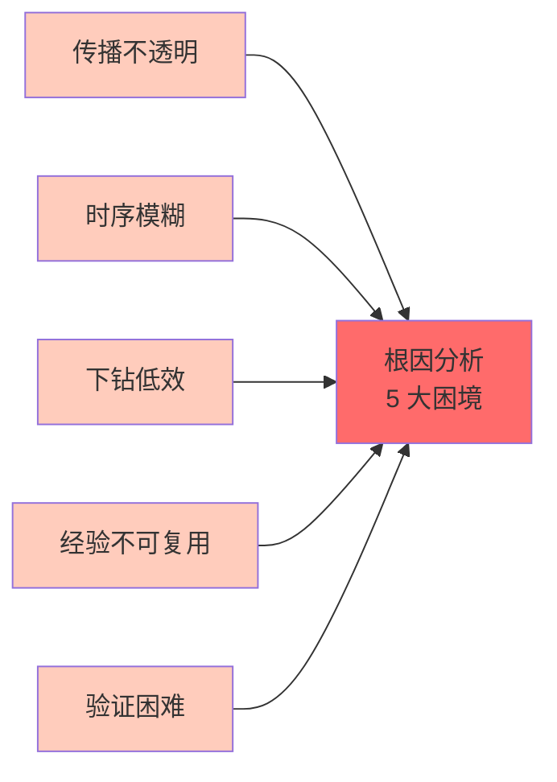

**传统根因分析的困境：**

| 困境类型 | 具体表现 |
|----------|----------|
| **传播路径不透明** | 告警只显示故障现象，根因藏在多层依赖关系的深处，工程师只能靠"经验猜" |
| **时序关系模糊** | 多个异常同时出现，难以判断哪个是因、哪个是果，误判导致修复方向错误 |
| **下钻效率低** | 工程师在数十个系统之间来回切换，从入口服务一路追到基础设施层，耗时 30 分钟起步 |
| **经验不可复用** | 每次故障依赖个人经验，人员离职后知识断层，同类故障反复发生 |
| **根因验证困难** | 假设提出后缺少验证手段，无法确认修复是否真正触及根因 |

**行业数据：**
- CNCF 调研：73% 的运维工程师认为根因定位是整个故障处理流程中最耗时的环节
- DORA 报告：团队平均需要 45 分钟才能找到根因，而超过 20 分钟后的 MTTR 每增加 1 分钟，业务损失显著增加
- 人工排查时，工程师平均需要查看 6-8 个不同的监控/日志系统才能定位根因

**根因分析的本质挑战：**

```
故障现场 = 真实根因 + 大量表象 + 噪声干扰

工程师的困境：
- 表象：服务 A 报错、B 超时、C 重启 → 看起来都是根因
- 真相：只修 A 不够，只修 B 也不行，必须找到触发整个链条的起点
```

---
## 2. 业务目标
**目标一：精准定位，平均定位时间 ≤ 5 分钟**
- 输入：故障研判结论（已确认故障存在及影响范围）
- 输出：明确指出根因节点/根因事件，包含定位置信度
- 指标：根因定位准确率 > 85%，平均定位时间从 45 分钟降至 5 分钟以内
**目标二：可解释的推理过程**
- 每一步推理都附带证据：依赖了哪些数据、走了什么逻辑、排除/确认了哪些候选
- 支持工程师回溯审查，不是黑箱输出，而是可解释的推理链条
- 关键决策点标注置信度，区分高置信（可直接行动）和低置信（需人工确认）
**目标三：根因验证闭环**
- 系统不仅给出根因，还提供验证方案：通过执行探测/验证脚本，确认假设是否成立
- 验证通过后给出修复建议；验证失败则自动回退到候选根因列表，继续推理
**目标四：知识复用与进化**
- 每次成功定位的根因知识自动沉淀到知识图谱
- 下次遇到相似模式时，系统主动推荐历史解决方案，缩短定位时间
- 模型基于反馈数据持续迭代，定位准确率随时间不断提升

## 3. 关键能力

### 3.1 因果图构建

基于拓扑关系和调用链数据，自动构建故障传播图：

| 能力 | 说明 |
|------|------|
| **拓扑感知** | 从服务拓扑模型中获取服务间的依赖关系（上/下游、承载、调用） |
| **调用链追溯** | 从分布式追踪数据中还原请求在微服务间的完整路径 |
| **传播路径建模** | 将「A 服务故障 → 导致 B 服务超时 → 触发 C 服务告警」的链条建模为因果图结构 |
| **动态更新** | 故障期间实时更新因果图，标注每个节点的异常状态和可疑度 |

**因果图结构示例：**

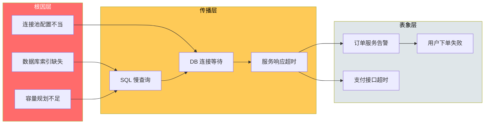

### 3.2 时间序列因果推理

通过分析时序数据中的因果关系，推断故障传播方向：

| 推理方法 | 适用场景 | 核心原理 |
|----------|----------|----------|
| **Granger 因果检验** | 两个指标指标之间是否存在领先/滞后关系 | 用 X 的历史预测 Y，误差显著降低则 X → Y |
| **Transfer Entropy** | 非线性、非高斯的复杂系统因果推断 | 衡量信息从 X 传递到 Y 的量 |
| **Cross-Correlation** | 周期性指标间的时序关联分析 | 计算不同滞后期的相关系数，找出最大相关时的时延 |
| **Change-Point Detection** | 突变点识别，定位故障发生的精确时刻 | CUSUM、贝叶斯变点检测等定位异常转折点 |

**时间序列因果推理流程：**

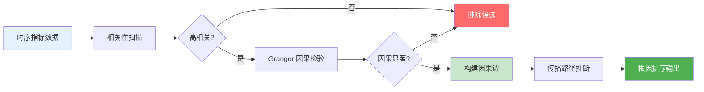

### 3.3 关联规则挖掘

从历史故障库中挖掘常见的根因模式，实现快速匹配：

| 模式类型 | 描述 | 示例 |
|----------|------|------|
| **共现模式** | 多个事件在历史上多次同时出现 | 「DB 慢查询 + 外部 API 超时」常由「索引缺失」引起 |
| **序列模式** | 事件按特定顺序发生形成故障链 | 「变更上线 → 内存上涨 → OOM」 |
| **聚类模式** | 相似故障具有相似的根因特征 | 夜间批处理导致数据库连接池耗尽 |
| **根因标签** | 根因类型归纳：资源类、代码类、变更类、架构类 | 代码类：死循环、内存泄漏；变更类：配置错误、回滚失败 |

**关联规则挖掘流程：**

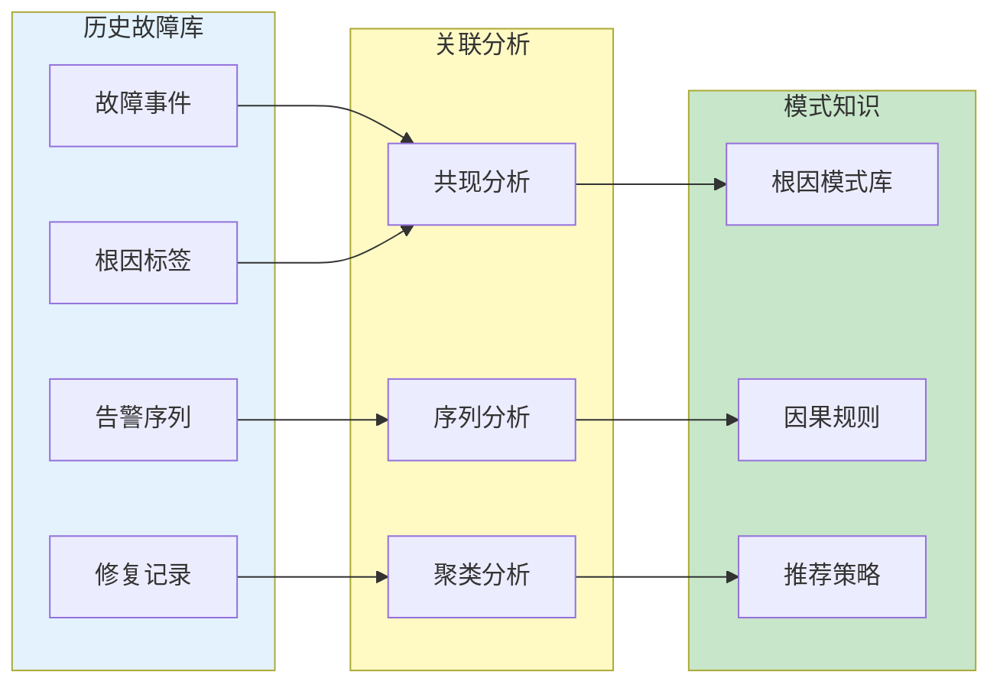

### 3.4 多维下钻分析

从故障表象出发，逐层深入直到定位根因：

| 维度 | 下钻路径 | 分析内容 |
|------|----------|----------|
| **服务维度** | 入口服务 → 中间服务 → 下游依赖 | 每层检查调用成功率、延迟分布、错误类型 |
| **时间维度** | 告警时间 → 异常起点 → 变更时间 | 识别是渐进式故障还是突发式故障，是否与变更相关 |
| **资源维度** | 应用层 → 中间件层 → 基础设施层 | CPU/内存/磁盘/网络逐层排查资源瓶颈 |
| **指标维度** | 告警指标 → 相关指标 → 原始指标 | 从聚合指标下钻到原始明细数据 |

**下钻分析示例：从「用户下单失败」到「数据库索引缺失」**

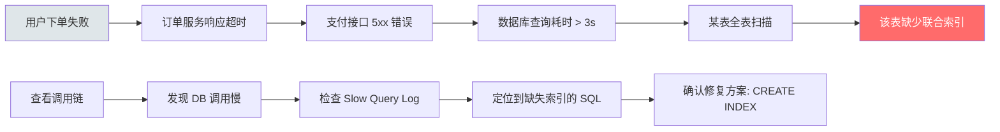

### 3.5 根因验证

对推理得到的根因假设进行验证，确保修复方向正确：

| 验证方法 | 适用场景 | 验证内容 |
|----------|----------|----------|
| **探测验证** | 网络/服务可达性问题 | 发送探测请求，确认服务响应状态 |
| **日志验证** | 代码异常、逻辑错误 | 在可疑路径上注入日志，确认执行路径 |
| **指标验证** | 资源瓶颈类问题 | 监控资源使用率变化，确认根因与指标的因果关系 |
| **回滚验证** | 变更引入的故障 | 执行变更回滚，观察故障是否恢复 |

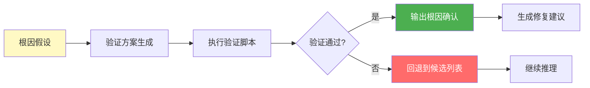

---
## 4. 核心技术
### 4.1 因果图推理引擎
**技术选型：基于知识图谱 + 概率图模型的混合推理**
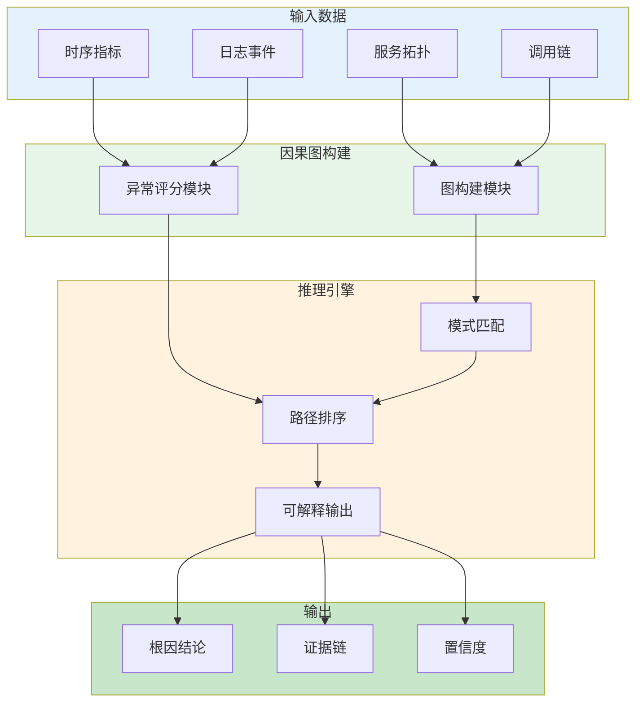
| 组件 | 技术方案 | 说明 |
|------|----------|------|
| 图存储 | Neo4j / 知识图谱 | 存储服务拓扑、调用关系、故障传播路径 |
| 推理算法 | 贝叶斯网络 + 图遍历 | 结合条件概率推断根因概率 |
| 路径排序 | PageRank 变种 + 异常权重 | 按「可疑度 + 影响力」综合排序 |
| 可解释性 | 证据链生成 | 每个根因输出完整的推理路径和证据列表 |
### 4.2 时间序列因果分析
**技术选型：基于 Spark 的分布式时序因果计算**
| 技术模块 | 选型 | 说明 |
|----------|------|------|
| 时序存储 | VictoriaMetrics / ClickHouse | 高性能时序查询，支持历史回溯 |
| 因果检验 | 自研 Granger + Transfer Entropy | 在 Spark 上分布式计算时序因果 |
| 变点检测 | ruptures 库 | 检测指标突变时刻，缩小分析窗口 |
| 可视化 | Grafana + 自定义 Panel | 时序对齐可视化，展示因果关系时间线 |
### 4.3 关联规则引擎
**技术选型：FP-Growth 频繁项集 + 序列模式挖掘**
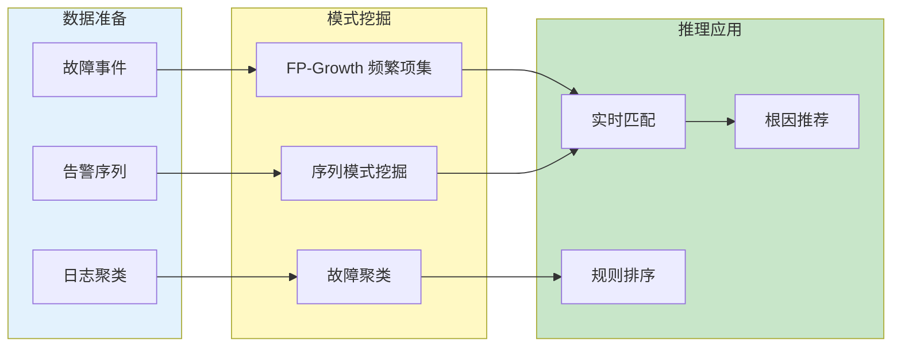
| 能力 | 技术实现 | 效果指标 |
|------|----------|----------|
| 共现规则挖掘 | FP-Growth，支持最小支持度/置信度配置 | Top-5 推荐准确率 > 80% |
| 序列模式挖掘 | PrefixSpan，发现「A→B→C」故障链 | 覆盖 70%+ 的历史故障模式 |
| 故障聚类 | DBSCAN / HDBSCAN，自动发现聚类 | 聚类内相似度 > 85% |
### 4.4 多维下钻引擎
**技术选型：Elasticsearch 聚合 + ClickHouse 预计算**
| 下钻维度 | 数据源 | 查询优化 |
|----------|--------|----------|
| 服务下钻 | 调用链数据 (Jaeger) | 按 service_name + status_code 聚合 |
| 时间下钻 | 时序指标库 | 按 time_bucket 分桶，支持任意时间粒度 |
| 资源下钻 | 基础设施监控 | 多指标关联下钻，钻取 CPU → 内存 → 磁盘 |
| 日志下钻 | Elasticsearch | 关键词高亮 + 分词过滤，支持正则匹配 |
### 4.5 根因验证框架
**技术选型：轻量级执行引擎 + 安全沙箱**
| 模块 | 技术方案 | 安全措施 |
|------|----------|----------|
| 验证脚本执行 | Docker 沙箱 + 超时控制 | 执行时间上限 30s，内存限制 256MB |
| 探测执行 | HTTP/TCP/UDP 探测 | 只读操作，不产生副作用 |
| 验证结果评估 | 规则引擎 + ML 模型 | 多维度评估验证结果可靠性 |
| 自动回退 | 候选队列管理 | 验证失败自动切换到下一个候选根因 |

## 5. 用户体验

### 5.1 根因分析工作台

**入口：故障研判详情页 →「进入根因分析」按钮**

```mermaid
flowchart LR
    subgraph 主界面["根因分析工作台"]
        A[故障概要卡片]
        B[根因结论展示区]
        C[因果图可视化]
        D[证据面板]
        E[操作按钮区]
    end
    
    A --> 显示故障时间、影响范围、严重度
    B --> 显示根因类型、根因节点、置信度
    C --> 显示传播路径，节点可点击下钻
    D --> 显示证据列表（指标/日志/变更）
    E --> 按钮：验证根因、生成修复、分享结论、人工接管
    
    style 主界面 fill:#f5f5f5
    style B fill:#fff3cd
    style C fill:#e8f5e9
```

### 5.2 因果图可视化

**核心交互：可视化因果图，工程师可自由探索**

| 功能 | 说明 | 交互方式 |
|------|------|----------|
| **节点颜色** | 按异常程度着色：红=根因嫌疑高、黄=传播节点、灰=正常 | 一目了然 |
| **节点大小** | 按影响范围调整，影响越大节点越大 | 识别关键节点 |
| **点击下钻** | 点击任意节点，展开该节点的详细指标和日志 | 深入分析 |
| **路径高亮** | 选择两个节点，系统高亮它们之间的传播路径 | 追踪因果链 |
| **时间回放** | 拖动时间轴，回放故障传播的时间线 | 理解演变过程 |

**因果图交互示例：**

```
根因分析工作台
├── 故障概要：订单服务不可用，影响 1200 用户
├── 根因结论：数据库连接池耗尽（置信度 92%）
│
├── 因果图（可交互）
│   ├── 🔴 DB连接池满（根因嫌疑 92%）
│   ├── 🟡 订单服务响应超时
│   ├── 🟡 支付接口 5xx
│   └── ⚪ 用户下单请求失败
│
├── 证据面板
│   ├── 📊 指标证据：DB活动连接数 500/500，8:23 起持续满负荷
│   ├── 📝 日志证据：SlowQuery 日志在 8:20 激增，70% > 3s
│   └── 🔧 变更证据：8:15 部署新版本，SQL 执行计划变更
│
└── 操作按钮
    ├── [验证根因] - 执行 DB 连接数探测
    ├── [生成修复] - 跳转智能决策模块
    └── [分享结论] - 复制根因报告到剪贴板
```

### 5.3 下钻分析流程

**引导式下钻：系统引导工程师逐层深入**

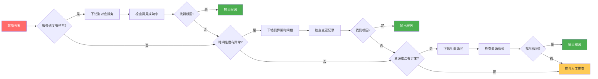

### 5.4 根因报告输出

**一键生成结构化根因报告，支持分享和归档**

| 报告模块 | 内容 | 格式 |
|----------|------|------|
| 故障概要 | 时间、地点、影响范围、持续时长 | Markdown |
| 根因结论 | 根因类型、根因节点、置信度 | 标准模板 |
| 传播路径 | 从根因到表象的完整传播链 | Mermaid 图 |
| 证据详情 | 所有支撑证据（指标/日志/变更/追踪） | 可折叠列表 |
| 修复建议 | 基于根因的修复方案推荐 | 来自智能决策模块 |
| 后续行动 | 需要人工跟进的事项清单 | Checkbox 列表 |

---
## 6. 系统质量
### 6.1 性能指标
| 指标 | 目标值 | 说明 |
|------|--------|------|
| 根因分析延迟 | < 30 秒（从触发到输出结论） | 含数据加载 + 推理计算 |
| 并发分析能力 | 支持 10+ 故障同时分析 | 推理引擎水平扩展 |
| 下钻响应时间 | < 2 秒/层级 | 用户体验保障 |
| 因果图渲染 | < 1 秒（50 节点以内） | Web 端性能 |
| 验证执行时间 | < 60 秒（含探测 + 评估） | 含网络延迟 |
### 6.2 准确性指标
| 评估维度 | 目标值 | 测量方式 |
|----------|--------|----------|
| 根因定位准确率 | > 85% | 人工标注结果对比 |
| Top-3 候选命中率 | > 95% | 正确根因在候选列表前 3 位 |
| 假阳性率 | < 10% | 将非根因排在首位的比例 |
| 根因类型识别准确率 | > 90% | 四类根因（资源/代码/变更/架构）分类准确 |
| 推理可解释性覆盖率 | > 95% | 每个根因结论附带证据链 |
### 6.3 可靠性设计
| 设计要点 | 说明 |
|----------|------|
| **降级策略** | 当知识图谱数据不完整时，自动降级为「关联规则 + 时序分析」模式，保证有输出 |
| **熔断机制** | 某数据源超时时不阻塞整体分析，标记「数据缺失」并继续推理 |
| **人工兜底** | 当置信度过低（< 60%）时，主动提示工程师接管，避免误导 |
| **结果回溯** | 所有根因结论可回溯当时的原始数据版本，支持复盘分析 |
### 6.4 可扩展性设计
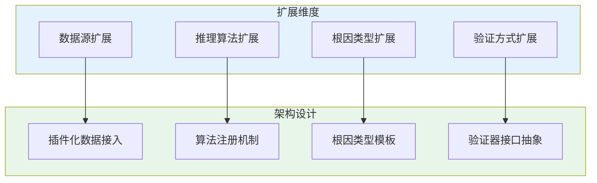
| 扩展点 | 扩展方式 | 示例 |
|----------|----------|------|
| 数据源接入 | 插件化 Adapter | 新增 Redis 监控数据源，只需实现 MetricsAdapter 接口 |
| 推理算法 | 算法注册中心 | 新增「基于日志语义的根因推理」，注册到算法中心即可用 |
| 根因类型 | 类型模板引擎 | 新增「安全类根因」，继承根因类型模板，配置证据模板即可 |
| 验证方式 | 验证器插件 | 新增「混沌实验验证」，实现 VerifyPlugin 接口即可 |

## 7. 特性运营

### 7.1 根因知识沉淀

**每次根因分析完成后，自动将结论沉淀到知识图谱**

| 沉淀内容 | 来源 | 目标位置 |
|----------|------|----------|
| 根因实体 | 根因分析结论 | 知识图谱「根因」节点 |
| 传播路径 | 因果图推理结果 | 知识图谱「因果边」 |
| 证据关联 | 分析过程中的证据 | 根因节点的属性 |
| 修复方案 | 智能决策模块输出 | 知识图谱「解决方案」关系 |
| 效果反馈 | 执行结果回传 | 根因节点的置信度更新 |

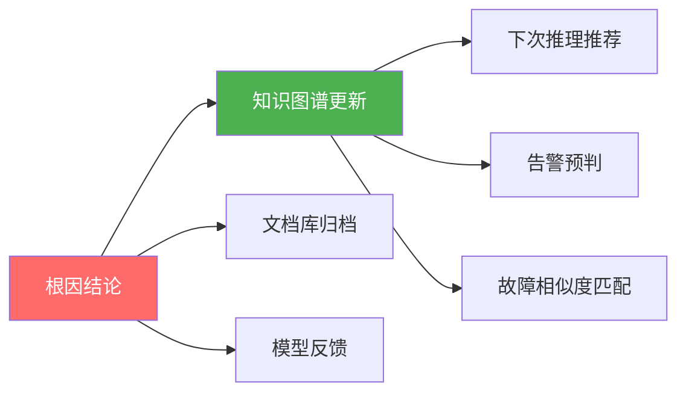

### 7.2 模型迭代与优化

| 迭代类型 | 触发条件 | 更新内容 | 周期 |
|----------|----------|----------|------|
| 在线学习 | 根因分析置信度 < 70% | 更新因果图权重 | 实时 |
| 周级迭代 | 根因类型识别错误 | 优化分类模型特征 | 每周 |
| 月级迭代 | 整体准确率下降 > 5% | 全量重训练模型 | 每月 |

### 7.3 运营指标监控

| 运营指标 | 定义 | 目标 | 监控频率 |
|----------|------|------|----------|
| 根因分析覆盖率 | 有根因输出的故障数 / 总故障数 | > 95% | 每日 |
| 平均定位时间 | 从触发到根因输出的时间均值 | < 5 分钟 | 每日 |
| 根因准确率 | 人工确认正确的根因数 / 输出的根因数 | > 85% | 每周 |
| 知识复用率 | 复用历史知识的根因分析数 / 总分析数 | > 60% | 每周 |
| 用户满意度 | 工程师对根因结论的评分 (1-5) | > 4.0 | 每月 |

### 7.4 用户反馈闭环

**建立「分析结论 → 用户反馈 → 模型优化」的闭环**

| 反馈类型 | 收集方式 | 处理方式 |
|----------|----------|----------|
| 根因纠正 | 用户标记「根因错误」 | 触发模型负样本学习，更新因果图权重 |
| 证据补充 | 用户补充遗漏的证据 | 更新知识图谱，丰富证据链 |
| 推理质疑 | 用户对推理路径提出疑问 | 生成复盘任务，分析推理漏洞 |
| 效率评分 | 用户对分析速度打分 | 优化推理引擎性能瓶颈 |

---
## 8. 本章小结
**本章核心：让根因定位从「经验猜测」变为「证据驱动的推理过程」**
### 核心能力回顾
| 能力 | 技术手段 | 业务价值 |
|------|----------|----------|
| 因果图构建 | 拓扑 + 调用链 → 故障传播图 | 可视化呈现故障传播路径，不再盲猜 |
| 时序因果推理 | Granger / Transfer Entropy | 量化指标间的因果关系，解决「谁是因谁是果」的问题 |
| 关联规则挖掘 | FP-Growth + 序列挖掘 | 从历史故障中发现规律，快速匹配同类根因 |
| 多维下钻分析 | ES + ClickHouse 下钻引擎 | 从表象层层深入到根因，结构化、系统化排查 |
| 根因验证 | 探测/日志/回滚验证 | 验证假设的正确性，避免修复方向错误 |
### 与上下游的关系
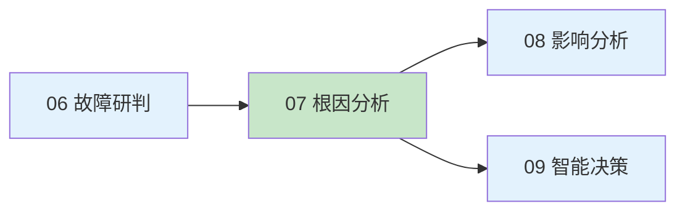
| 上游（输入） | 本章 | 下游（输出） |
|-------------|------|-------------|
| 故障分类结论 | 根因定位 | 根因结论 → 影响分析：预测故障蔓延范围 |
| 影响范围评估 | 因果推理 | 根因结论 → 智能决策：生成针对性修复方案 |
| 事件时间线 | 证据链构建 | 根因结论 → 知识图谱：沉淀为可复用知识 |
### 关键设计原则
1. **证据驱动，而非直觉驱动**：每个根因结论必须附带可查证的证据链，工程师可审查、可质疑
2. **可解释优先于准确率**：即使牺牲一点准确率，也要保证推理过程可解释，让工程师建立信任
3. **人机协同而非黑箱替代**：系统给出候选和建议，工程师做最终判断，置信度低的场景自动提示接管
4. **知识闭环而非一次性分析**：每次分析结果都沉淀为知识，下次遇到相似场景可快速匹配
### 下章预告
### 8.6 核心要点速记
**5 个关键认知：**
1. **根因分析是故障处置的关键路径** — 错定位根因会导致修复方向错误，浪费大量时间
2. **证据驱动而非直觉驱动** — 每个根因结论必须附带可查证的证据链
3. **可解释性优先于准确率** — 黑箱模型即使准确率高也无法被信任
4. **人机协同而非黑箱替代** — 系统给候选，工程师做最终判断
5. **知识闭环而非一次性分析** — 每次分析结果都沉淀为下次可复用的知识
**4 个落地原则：**
| 原则 | 描述 |
|------|------|
| **先因果，后关联** | 因果推理是核心，关联规则是辅助 |
| **先时序，后空间** | 时序关系是判断因与果的基础 |
| **先验证，后结论** | 没有验证的根因结论没有可信度 |
| **先沉淀，后优化** | 每次分析都是知识积累的机会 |
### 8.7 关键指标速查
| 指标类别 | 关键指标 | 目标值 |
|----------|----------|--------|
| **效率** | 平均定位时间 | ≤ 5 分钟 |
| **效率** | 端到端分析时间 | < 30s |
| **效率** | 下钻响应时间 | < 1s |
| **准确** | 根因定位准确率 | ≥ 90% |
| **准确** | 根因召回率 | ≥ 85% |
| **准确** | 证据链完整度 | 100% |
| **可解释** | 推理可解释性 | 高 |
| **运营** | 验证采纳率 | > 70% |
| **运营** | 知识沉淀数 | 持续增长 |
| **运营** | 同类故障匹配率 | > 80% |
| **可用** | 系统可用性 | 99.9% |
| **运营** | 用户满意度 | > 4.0/5.0 |
### 8.8 学习路径建议
**3 类学习路径：**
| 目标 | 建议路径 | 时长 |
|------|----------|------|
| **快速理解** | 阅读 8.1 + 8.2 核心要点 | 5 分钟 |
| **深入掌握** | 完整阅读 1-7 节 | 60 分钟 |
| **专家级** | 1-7 节 + 04/05/06 章节 + 实践 | 半天 |
**与其他章节的关联：**
| 关联章节 | 关联内容 |
|----------|----------|
| 04 智能感知 | 异常事件作为根因分析输入 |
| 05 认知网络 | 知识图谱作为因果推理基础 |
| 06 故障研判 | 故障类型 + 严重度作为输入 |
| 08 影响分析 | 根因结论作为影响预测起点 |
| 09 智能决策 | 根因结论作为决策依据 |
| 10 自动执行 | 修复方案作为执行目标 |

根因定位完成后，故障的「影响范围」尚未清晰——这个根因会牵连哪些下游服务？会在多长时间内蔓延？影响多少用户？下一章「08 影响分析」将基于根因结论，预测故障的传播方向和影响规模，为决策提供时间窗口判断。