# 业务 08 · 影响分析

> 智能系统运维可观测性 · 基于拓扑与根因的故障影响评估

---

## 1. 痛点问题

### 1.1 故障影响不可见，决策缺乏依据

在故障发生时，运维团队面临的核心挑战是：**故障已经发生，但影响范围未知**。

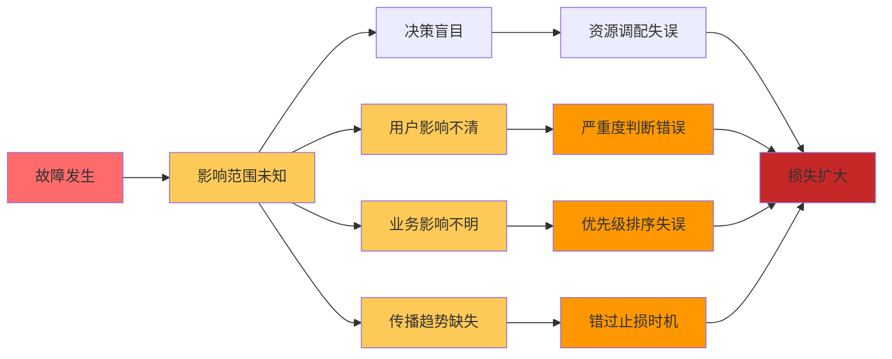

| 痛点场景 | 现状描述 | 后果 |
|----------|----------|------|
| **影响范围未知** | 不知道有多少下游服务会受影响 | 决策盲目，可能遗漏关键服务 |
| **用户影响不清** | 不知道影响多少用户、哪些地区 | 无法判断故障严重度 |
| **业务影响不明** | 不知道影响哪些业务域、收入损失多大 | 资源调配和优先级判断失误 |
| **传播趋势预测缺失** | 不知道故障是否会扩散 | 错过最佳止损时机 |

**典型案例：** 某金融系统数据库故障，运维团队花 30 分钟确认影响范围，发现不仅仅是数据库，还影响了 5 个核心业务系统的支付通道，损失超过 500 万。如果能提前 5 分钟知道影响范围，可以提前隔离、减少损失。

### 1.2 传统影响分析依赖人工经验，效率低下

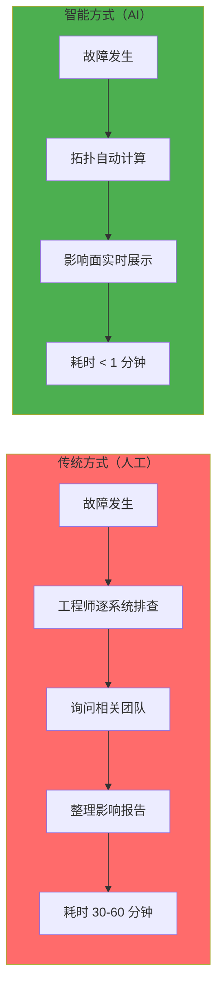

### 1.3 影响分析缺乏系统性方法论

传统模式下，影响分析存在 4 类根本性缺陷：

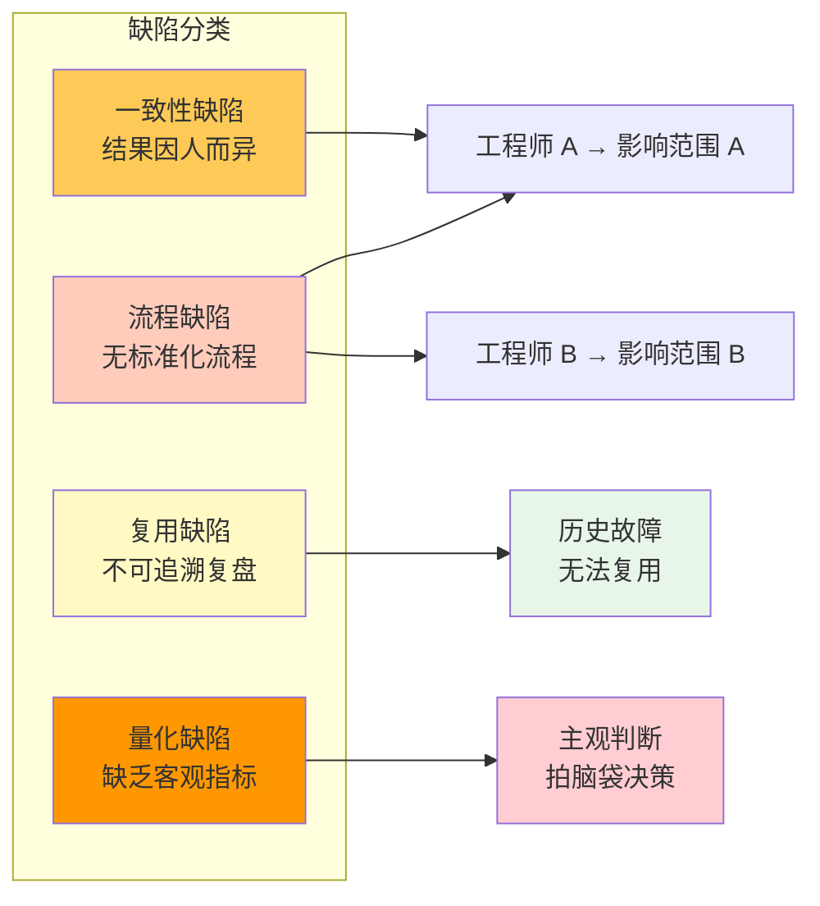

| 缺陷类型 | 具体表现 | 影响 | 根本原因 |
|----------|----------|------|----------|
| **流程缺陷** | 无固定分析流程 | 每次分析方式不同 | 缺乏方法论 |
| **一致性缺陷** | 不同人结果差异大 | 同一故障结论不同 | 经验依赖强 |
| **复用缺陷** | 历史故障无法复盘 | 重复踩同样坑 | 无知识积累 |
| **量化缺陷** | 缺乏客观指标 | 严重度靠主观 | 无量化体系 |

---
## 2. 业务目标
### 2.1 核心目标
**构建智能影响分析系统，在故障发生时快速、准确、全面地评估影响范围**
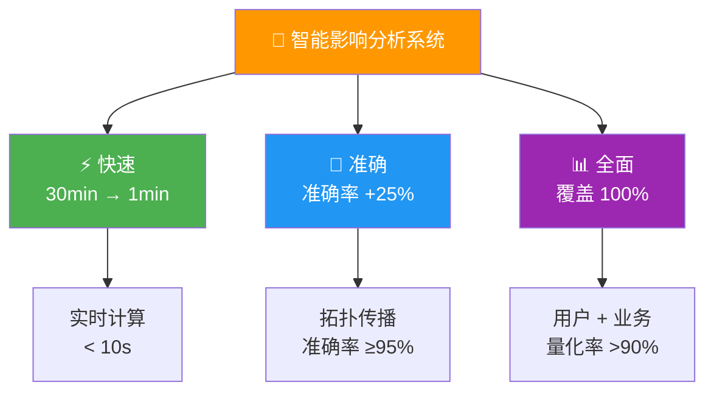
| 目标 | 当前值 | 目标值 | 提升 | 度量方式 |
|------|--------|--------|------|----------|
| 影响分析时间 | 30 分钟 | 1 分钟 | **30x** | P99 端到端延迟 |
| 影响范围准确率 | 70% | 95% | +25% | 预测 vs 实际比对 |
| 用户影响量化率 | 50% | 90% | +40% | 覆盖率 |
| 传播预测准确率 | N/A | 85% | **新增** | 时间偏差 <30% |
### 2.2 分层目标
#### L1：直接影响分析
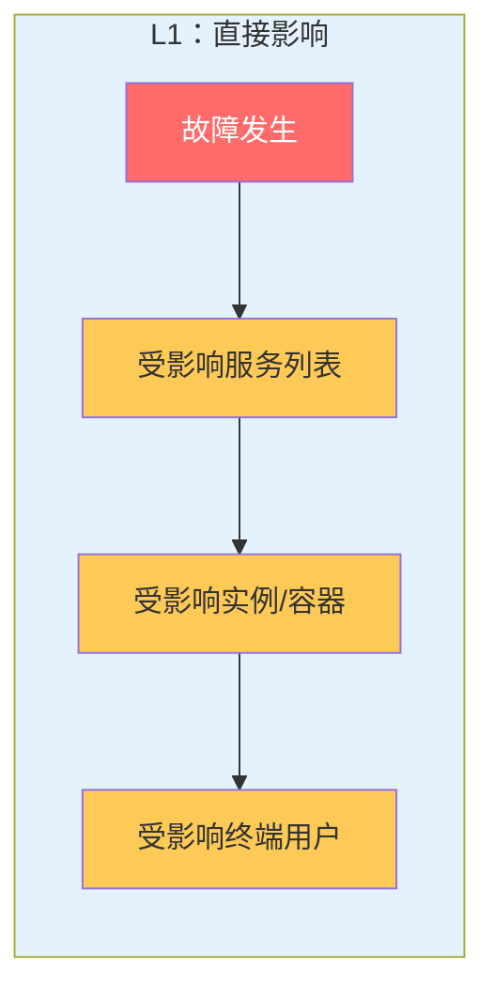
| 输出项 | 内容 | 优先级 |
|--------|------|--------|
| 服务列表 | 直接依赖该服务的所有上游服务 | P0 |
| 实例/容器 | 受影响的进程/容器数量 | P0 |
| 终端用户 | 受影响用户数 + 地域分布 | P1 |
#### L2：级联传播分析
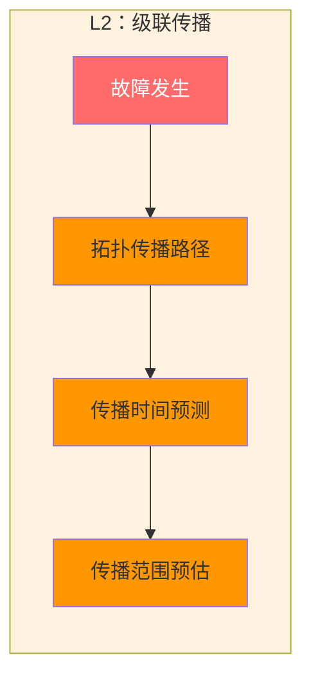
| 输出项 | 内容 | 优先级 |
|--------|------|--------|
| 拓扑传播路径 | 基于依赖关系的 N 层传播路径 | P0 |
| 传播时间预测 | 每一层级的预计扩散时间 | P1 |
| 传播范围预估 | 最终影响服务总数的上限估计 | P1 |
#### L3：业务影响评估
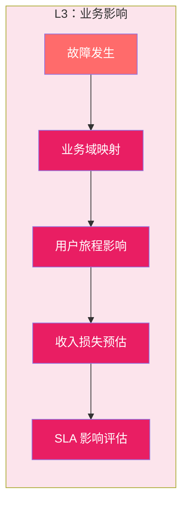
| 输出项 | 内容 | 优先级 |
|--------|------|--------|
| 业务域映射 | 技术故障 → 业务域 → 严重度 L0-L3 | P0 |
| 用户旅程影响 | 注册 → 下单 → 支付各阶段流失率 | P1 |
| 收入损失预估 | $/小时 × 影响时长 | P1 |
| SLA 影响评估 | P99/SLA 达标率影响 | P1 |
#### 分层架构总览
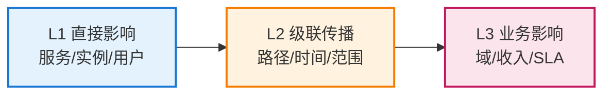
### 2.3 业务场景
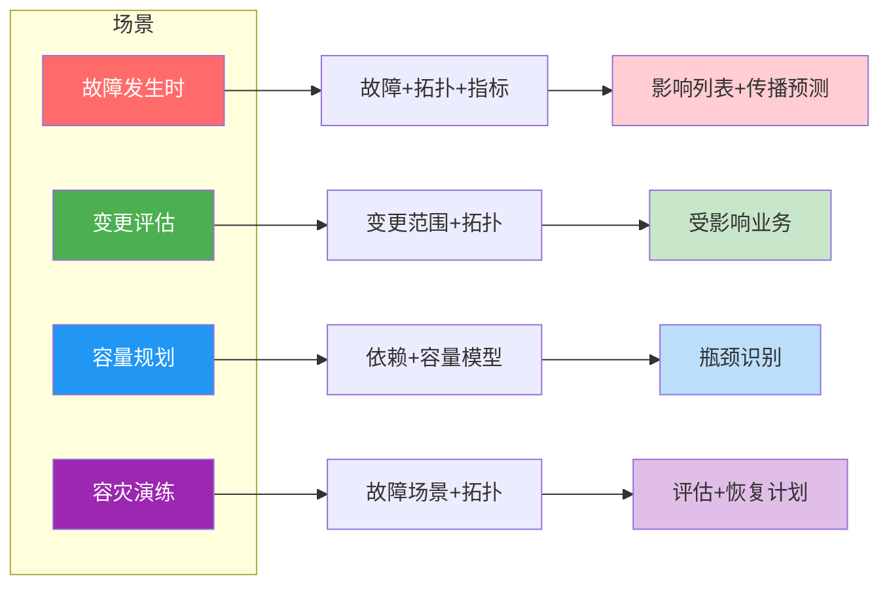
| 场景 | 分析输入 | 分析输出 | 价值 |
|------|----------|----------|------|
| **故障发生时** | 故障服务 + 拓扑 + 实时指标 | 影响服务列表 + 传播预测 | 快速止损 |
| **变更评估** | 变更范围 + 拓扑 | 可能受影响的业务 | 变更安全 |
| **容量规划** | 服务依赖 + 容量模型 | 瓶颈服务识别 | 容量决策 |
| **容灾演练** | 故障场景 + 拓扑 | 影响评估 + 恢复计划 | 演练准备 |
### 2.4 目标达成路径
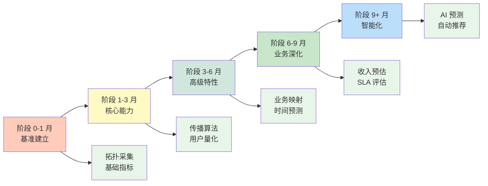
| 阶段 | 时间 | 核心交付 | 目标指标 |
|------|------|----------|----------|
| **Ph0** | 0-1 月 | 拓扑数据采集 + 基准指标 | 分析时间 30min→10min |
| **Ph1** | 1-3 月 | 传播算法 + 用户量化 | 准确率 70%→85% |
| **Ph2** | 3-6 月 | 业务映射 + 时间预测 | 准确率 85%→95% |
| **Ph3** | 6-9 月 | 收入预估 + SLA 评估 | 量化率 >90% |
| **Ph4** | 9+ 月 | AI 预测 + 自动推荐 | 传播预测准确率 ≥85% |

## 3. 关键能力

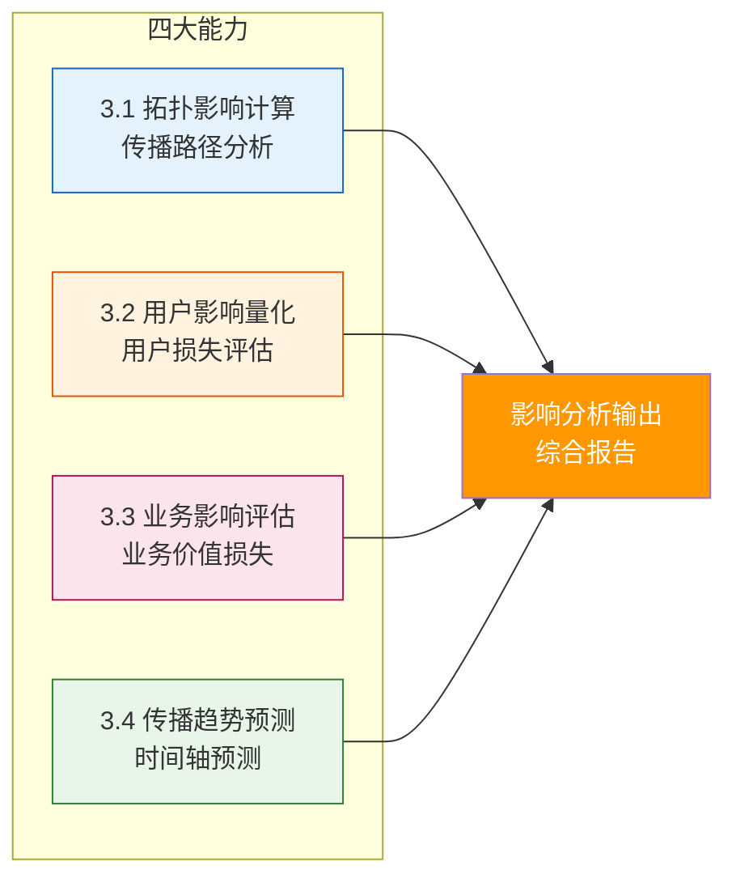

### 3.1 拓扑影响计算

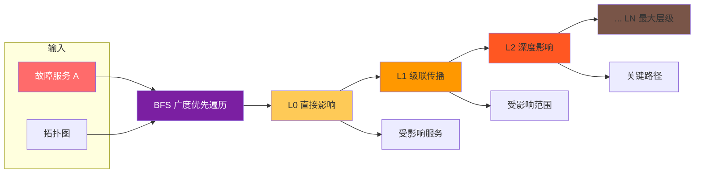

| 能力 | 描述 | 优先级 | 复杂度 |
|------|------|--------|--------|
| **上游影响计算** | 计算所有依赖该服务的上游服务 | P0 | O(N) |
| **下游传播计算** | 计算故障会传播到哪些下游 | P0 | O(N) |
| **多层级展开** | 支持 N 层级的深度影响分析 | P0 | O(N²) |
| **关键路径识别** | 识别对业务链路最关键的服务 | P1 | O(E log V) |

#### 影响计算算法

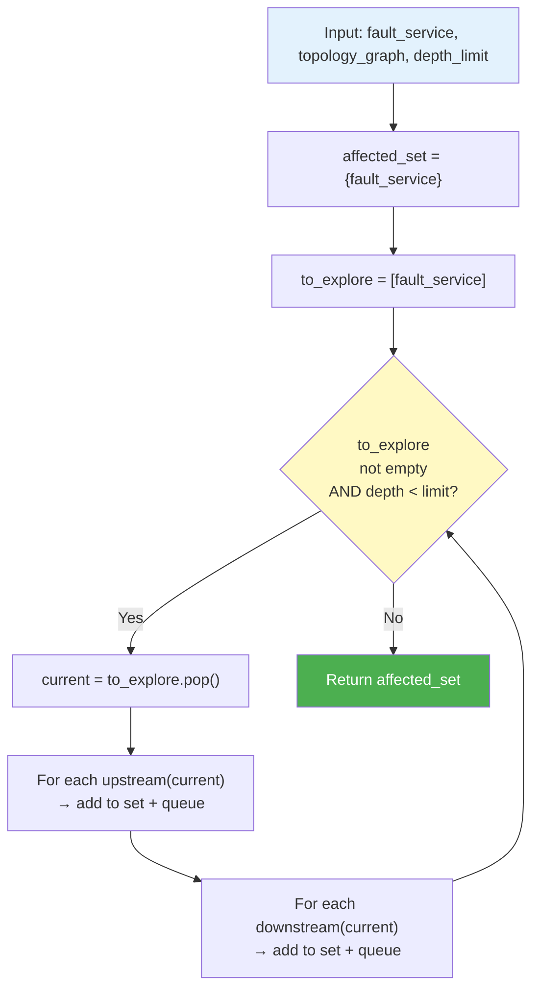

### 3.2 用户影响量化

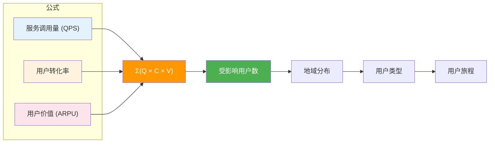

| 能力 | 描述 | 优先级 | 数据来源 |
|------|------|--------|----------|
| **用户数估算** | 基于调用量和用户基数估算受影响用户 | P0 | Trace / APM |
| **地域分布** | 分析受影响的用户地域分布 | P1 | IP 解析 |
| **用户类型分析** | 区分普通/VIP/企业用户 | P1 | 用户画像 |
| **用户旅程影响** | 映射到注册→下单→支付各阶段流失 | P2 | 行为分析 |

#### 用户分层模型

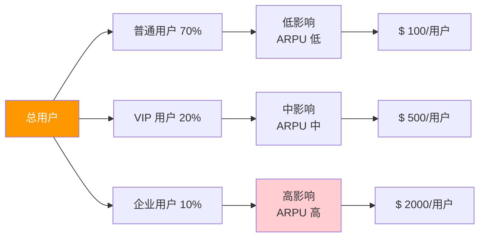

### 3.3 业务影响评估

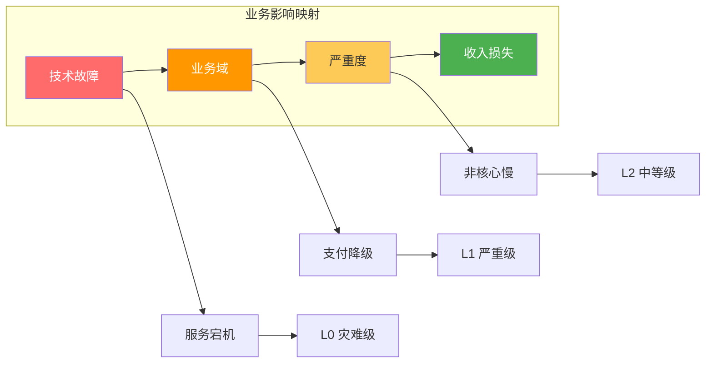

| 能力 | 描述 | 优先级 | 准确率要求 |
|------|------|--------|------------|
| **业务域映射** | 技术故障 → 业务域 → 严重度 L0-L3 | P0 | ≥ 95% |
| **SLA 影响计算** | 计算对 SLA 指标的影响 | P0 | ≥ 90% |
| **收入损失预估** | 基于业务量估算收入损失 | P1 | ±20% |
| **优先级排序** | 按业务重要性排序受影响服务 | P1 | — |

#### 业务影响分级（L0-L3）

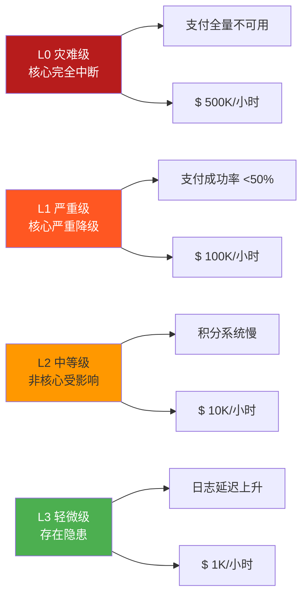

| 级别 | 定义 | 场景示例 | 预估损失 |
|------|------|----------|----------|
| **L0 - 灾难级** | 核心业务完全中断 | 支付全量不可用 | > $100K/小时 |
| **L1 - 严重级** | 核心业务严重降级 | 支付成功率 < 50% | $10K-$100K/小时 |
| **L2 - 中等级** | 非核心业务受影响 | 积分系统响应慢 | $1K-$10K/小时 |
| **L3 - 轻微级** | 存在隐患但当前可工作 | 日志延迟上升 | < $1K/小时 |

### 3.4 传播趋势预测

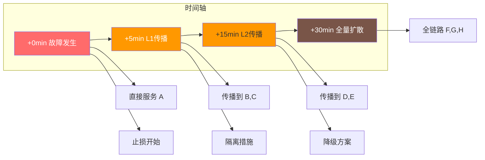

| 能力 | 描述 | 优先级 | 准确率 |
|------|------|--------|--------|
| **扩散速度预测** | 预测故障扩散的速度 | P1 | ≥ 85% |
| **时间轴预测** | 预测不同层级影响发生的时间 | P1 | ±30% |
| **最坏情况预测** | 预测在最坏情况下的影响范围 | P2 | — |
| **缓解效果预测** | 预测不同止损措施的效果 | P2 | — |

#### 预测模型

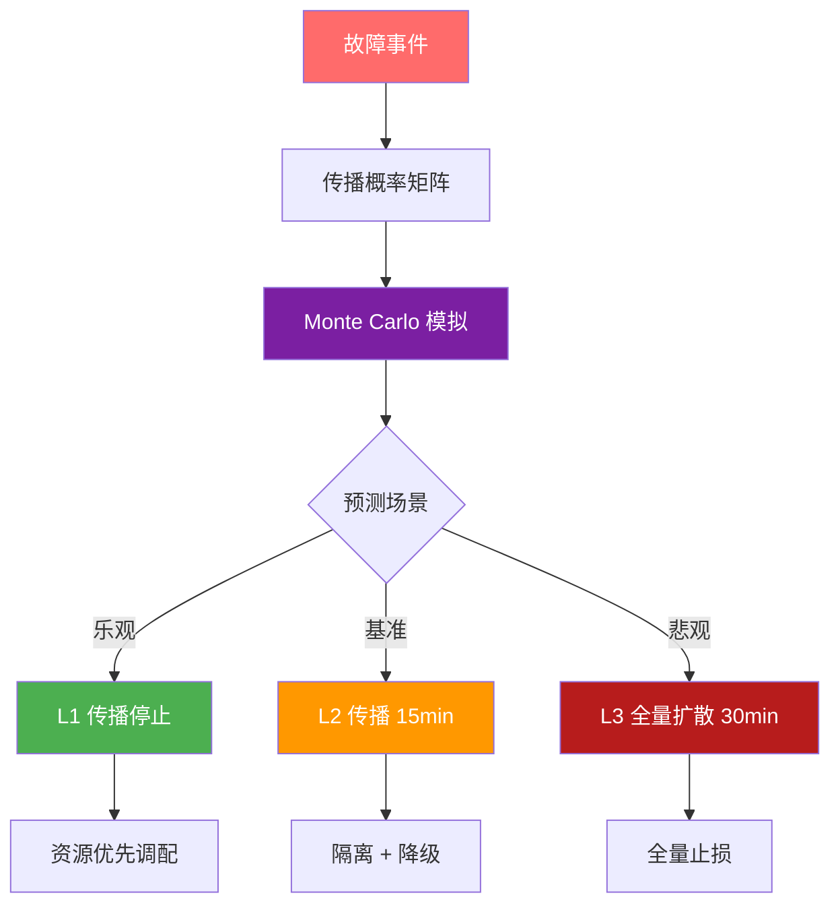

### 3.5 能力全景图

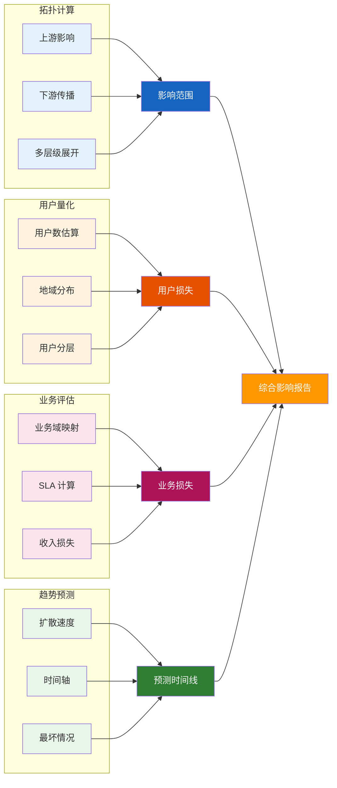

#### 能力优先级矩阵

| 能力 | P0 核心 | 复杂度 | 输出 |
|------|---------|--------|------|
| **拓扑影响计算** | ✅ 上游/下游/多层级 | O(N²) | 影响服务列表 |
| **用户影响量化** | ✅ 用户数估算 | O(N) | 受影响用户数 |
| **业务影响评估** | ✅ 业务域映射/SLA | O(N) | 严重度 + 损失 |
| **传播趋势预测** | ⏸ 扩散速度/时间轴 | O(N log N) | 时间线预测 |

---
## 4. 核心技术
### 4.1 影响分析系统架构
```mermaid
flowchart LR
    subgraph 输入["输入层"]
        FAULT[故障事件]
        TOPO[拓扑数据]
        METRIC[实时指标]
        TRACE[调用链]
        USER[用户数据]
    end
    subgraph 分析["分析层"]
        DIRECT[直接影响计算]
        CASCADE[级联传播计算]
        USER_IMP[用户影响量化]
        BIZ_IMP[业务影响评估]
        TREND[传播趋势预测]
    end
    subgraph 输出["输出层"]
        REPORT[影响报告]
        TIMELINE[时间线预测]
        ACTION[止损建议]
        VISUAL[可视化]
    end
    输入 --> 分析 --> 输出
    style 输入 fill:#e3f2fd
    style 分析 fill:#fff3e0
    style 输出 fill:#fce4ec
```
#### 数据流管道
```mermaid
flowchart LR
    E1[故障事件] --> P1[事件队列]
    P1 --> P2[拓扑解析]
    P2 --> P3[影响计算引擎]
    P3 --> P4[结果聚合]
    P4 --> P5[报告生成]
    P1 --> B1[批量计算]
    P2 --> B1
    P3 --> B2[实时告警]
    P4 --> B2
    P5 --> B3[可视化推送]
    style E1 fill:#ff6b6b,color:#fff
    style P1 fill:#7b1fa2,color:#fff
    style P2 fill:#1565c0,color:#fff
    style P3 fill:#ff9800,color:#fff
    style P4 fill:#4caf50,color:#fff
    style P5 fill:#2e7d32,color:#fff
```
| 组件 | 技术选型 | 性能要求 |
|------|----------|----------|
| 事件队列 | Kafka / Redis Stream | < 5ms |
| 拓扑解析 | 图数据库实时查询 | < 10ms |
| 影响计算 | 并行 BFS + 缓存 | < 50ms |
| 结果聚合 | Redis 缓存 + 聚合 | < 20ms |
| 报告生成 | 模板引擎 + 异步 | < 30ms |
### 4.2 影响分析数据模型
#### 实体关系图
```mermaid
flowchart LR
    subgraph 核心实体
        F[故障 FAULT]
        S[服务 SERVICE]
        U[用户 USER]
        B[业务 BUSINESS]
        T[拓扑 TOPOLOGY]
    end
    F --> S1[影响 scope]
    S --> T1[依赖 depends]
    S --> S2[调用 calls]
    U --> S3[使用 uses]
    B --> S4[包含 contains]
    F --> U1[影响 user_impact]
    F --> B1[影响 business_impact]
    F --> T2[传播 propagation]
    style F fill:#ff6b6b,color:#fff
    style S fill:#feca57
    style U fill:#e3f2fd
    style B fill:#fce4ec
    style T fill:#e8f5e9
```
#### 影响分析结果结构
```yaml
impact_analysis:
  fault_id: "FAULT-2024-001234"
  timestamp: "2024-01-15T10:30:00Z"
  scope:
    directly_affected:
      - service: "order-service"
        instances: 15
        users_affected: 15000
      - service: "inventory-service"
        instances: 8
        users_affected: 8000
    cascading_affected:
      level_1:
        - service: "payment-service"
          reason: "依赖 order-service"
        - service: "shipping-service"
          reason: "依赖 inventory-service"
      level_2:
        - service: "notification-service"
          reason: "依赖 payment-service"
  user_impact:
    total_users: 23000
    by_region:
      north: 10000
      south: 8000
      east: 5000
    by_type:
      vip: 2000
      regular: 21000
  business_impact:
    business_domains:
      - name: "电商交易"
        severity: "L1"
        sla_impact: "P99 延迟 +200ms"
      - name: "物流履约"
        severity: "L2"
        sla_impact: "发货延迟 5min"
    revenue_loss:
      estimated_per_hour: 50000
      currency: "USD"
  propagation_trend:
    current_level: 1
    predicted_spread:
      - time: "+5min"
        level: 2
        new_affected: ["notification-service"]
      - time: "+15min"
        level: 3
        new_affected: ["analytics-service"]
  recommendations:
    immediate:
      - action: "隔离 order-service"
        reason: "阻止传播扩散"
      - action: "降级非核心服务"
        reason: "保护核心链路"
```
#### 数据模型层次
```mermaid
flowchart TD
    L1[Layer 1: 原始数据层<br/>故障/拓扑/指标/Trace]
    L2[Layer 2: 实体关系层<br/>服务/用户/业务域]
    L3[Layer 3: 影响计算层<br/>scope/user_impact/business_impact]
    L4[Layer 4: 输出呈现层<br/>报告/时间线/建议]
    L1 --> L2
    L2 --> L3
    L3 --> L4
    L1 --> D1[故障事件]
    L1 --> D2[拓扑图谱]
    L1 --> D3[实时指标]
    L1 --> D4[调用链Trace]
    L2 --> E1[服务节点]
    L2 --> E2[依赖边]
    L2 --> E3[用户画像]
    L2 --> E4[业务域]
    L3 --> C1[影响范围]
    L3 --> C2[用户损失]
    L3 --> C3[业务损失]
    style L1 fill:#e3f2fd
    style L2 fill:#fff3e0
    style L3 fill:#fce4ec
    style L4 fill:#e8f5e9
```
### 4.3 级联传播算法
#### 传播计算流程
```mermaid
flowchart TD
    START["输入: 故障服务"] --> Q["加入队列 Q"]
    Q --> CHECK{"队列非空
AND 深度 < 限制?"}
    CHECK -->|Yes| POP["POP 当前服务"]
    POP --> UP["获取上游依赖"]
    UP --> ADD["加入影响集合"]
    ADD --> DOWN["获取下游调用"]
    DOWN --> ADD2["加入影响集合"]
    ADD2 --> CHECK
    CHECK -->|No| END["输出: 影响集合"]
    style START fill:#ff6b6b,color:#fff
    style END fill:#4caf50,color:#fff
    style CHECK fill:#fff9c4
```
#### 基于拓扑的传播计算
```mermaid
flowchart LR
    F[故障服务 A] --> B[B 调用 A]
    F --> C[C 调用 A]
    B --> D[D 调用 B]
    B --> E[E 调用 B]
    C --> F2[F 调用 C]
    D --> G[G 调用 D]
    style F fill:#ff6b6b
    style B fill:#feca57
    style C fill:#feca57
    style D fill:#fff3e0
    style E fill:#fff3e0
    style F2 fill:#fff3e0
    style G fill:#e8f5e9
```
#### 传播时间预测模型
```mermaid
flowchart LR
    subgraph 输入
        D1[调用延迟 D]
        P1[传播概率 P]
        N1[传播链路数 N]
    end
    D1 --> T["T(n) = Σ(D×P)/N"]
    P1 --> T
    N1 --> T
    T --> T1["+5min L1 传播"]
    T --> T2["+15min L2 传播"]
    T --> T3["+30min L3 传播"]
    T1 --> A1[隔离 B]
    T2 --> A2[降级 C]
    T3 --> A3[全量止损]
    style T fill:#ff9800,color:#fff
    style T1 fill:#feca57
    style T2 fill:#ff9800
    style T3 fill:#ff5722
```
| 参数 | 定义 | 来源 |
|------|------|------|
| D(调用延迟) | 节点间平均响应延迟 | Trace 数据 |
| P(传播概率) | 故障从一个服务传播到另一个的概率 | 历史故障训练 |
| N(链路数) | 从故障源到第 N 层的总路径数 | 拓扑分析 |
| T(n) | 故障传播到第 N 层的时间 | 计算结果 |
#### 传播矩阵可视化
```mermaid
flowchart LR
    A1[服务 A] --> B1[服务 B]
    A1 --> C1[服务 C]
    B1 --> D1[服务 D]
    C1 --> D1
    C1 --> E1[服务 E]
    D1 --> F1[服务 F]
    A1 --> L0["L0
A"]
    B1 --> L1["L1
B,C"]
    D1 --> L2["L2
D"]
    E1 --> L2
    F1 --> L3["L3
F"]
    style A1 fill:#ff6b6b,color:#fff
    style L0 fill:#b71c1c,color:#fff
    style L1 fill:#ff5722,color:#fff
    style L2 fill:#ff9800
    style L3 fill:#feca57
```
### 4.4 业务影响映射
#### 用户旅程影响映射
```mermaid
flowchart LR
    J1[访问] --> J2[搜索]
    J2 --> J3[加购]
    J3 --> J4[下单]
    J4 --> J5[支付]
    J5 --> J6[履约]
    J1 --> C1["$ 0"]
    J2 --> C2["$ 50"]
    J3 --> C3["$ 200"]
    J4 --> C4["$ 500"]
    J5 --> C5["$ 1000"]
    J6 --> C6["$ 1500"]
    J2 --> F1[搜索服务故障]
    J4 --> F2[下单服务故障]
    J5 --> F3[支付服务故障]
    F1 --> L1[中断: 流失 60%]
    F2 --> L2[中断: 流失 80%]
    F3 --> L3[中断: 流失 95%]
    style J1 fill:#e3f2fd
    style J2 fill:#e3f2fd
    style J3 fill:#fff3e0
    style J4 fill:#fff3e0
    style J5 fill:#fce4ec
    style J6 fill:#fce4ec
    style C1 fill:#e8f5e9
    style C2 fill:#e8f5e9
    style C3 fill:#e8f5e9
    style C4 fill:#e8f5e9
    style C5 fill:#e8f5e9
    style C6 fill:#e8f5e9
    style F1 fill:#ff9800
    style F2 fill:#ff5722
    style F3 fill:#b71c1c,color:#fff
```
| 旅程阶段 | 服务 | 客单价损失 | 流失率 |
|----------|------|-----------|--------|
| 访问 | CDN/网关 | $0 | 5% |
| 搜索 | 搜索服务 | $50 | 60% |
| 加购 | 购物车服务 | $200 | 70% |
| 下单 | 订单服务 | $500 | 80% |
| 支付 | 支付通道 | $1000 | 95% |
| 履约 | 物流服务 | $1500 | 20% |
#### 业务影响量化流程
```mermaid
flowchart TD
    F[故障服务] --> M1[业务域映射]
    M1 --> M2[严重度评级]
    M2 --> M3[SLA 影响计算]
    M3 --> M4[收入损失预估]
    M4 --> R[报告输出]
    M1 --> D1[电商/支付/物流/客服]
    M2 --> D2[L0/L1/L2/L3]
    M3 --> D3[P99延迟/错误率]
    M4 --> D4[$/小时估算]
    style F fill:#ff6b6b,color:#fff
    style M1 fill:#1565c0,color:#fff
    style M2 fill:#ff9800,color:#fff
    style M3 fill:#7b1fa2,color:#fff
    style M4 fill:#e91e63,color:#fff
    style R fill:#4caf50,color:#fff
```
### 4.5 技术选型
#### 核心组件对比
| 组件 | 选项 1 | 选项 2 | 选项 3 | 推荐 |
|------|--------|--------|--------|------|
| **图数据库** | Neo4j | NebulaGraph | Janet | NebulaGraph |
| **时序数据库** | InfluxDB | TimescaleDB | Prometheus | InfluxDB |
| **消息队列** | Kafka | RocketMQ | Redis Stream | Kafka |
| **缓存层** | Redis Cluster | CockroachDB | etcd | Redis Cluster |
| **计算框架** | Flink | Spark Streaming | Flink SQL | Flink |
#### 技术架构总览
```mermaid
flowchart LR
    subgraph 前端层
        UI[可视化界面]
        API[REST API]
    end
    subgraph 计算层
        SP[实时流处理<br/>Flink]
        BP[批处理引擎<br/>Spark]
        MP[机器学习<br/>预测模型]
    end
    subgraph 存储层
        GD[图数据库<br/>NebulaGraph]
        TS[时序数据库<br/>InfluxDB]
        RD[关系数据库<br/>MySQL]
        RC[缓存<br/>Redis]
    end
    subgraph 数据源
        TR[Trace]
        MT[Metrics]
        LG[Logs]
        TP[Topology]
    end
    TR --> SP
    MT --> SP
    TP --> GD
    GD --> SP
    SP --> RC
    RC --> API
    BP --> RD
    MP --> SP
    style UI fill:#e3f2fd
    style SP fill:#7b1fa2,color:#fff
    style GD fill:#1565c0,color:#fff
    style TS fill:#4caf50,color:#fff
    style RC fill:#ff9800,color:#fff
```

## 5. 用户体验

### 5.1 影响分析展示页面

#### 页面布局结构

```mermaid
flowchart LR
    subgraph 页面
        H[Header: 故障概要]
        B[Body: 三栏影响卡片]
        S[Sidebar: 业务影响/损失/建议]
        F[Footer: 操作栏]
    end
    
    H --> B
    B --> S
    S --> F
    
    H --> T1[故障名称]
    H --> T2[影响范围]
    H --> T3[时间倒计时]
    
    B --> C1[直接 L0]
    B --> C2[传播 L1]
    B --> C3[扩散 L2]
    
    S --> L1[电商交易 L1]
    S --> L2[物流履约 L2]
    S --> L3[支付通道 L1]
    
    style H fill:#e3f2fd
    style B fill:#fff3e0
    style S fill:#fce4ec
    style F fill:#e8f5e9
```

#### 核心展示指标

| 模块 | 指标 | 数值 | 状态 |
|------|------|------|------|
| **影响范围** | 直接影响 | 3 服务 / 23,000 用户 | 🔴 P0 |
| **影响范围** | L1 传播 | 2 服务 / 8,000 用户 | 🟡 P1 |
| **影响范围** | L2 扩散 | 1 服务 / 2,000 用户 | 🟠 P2 |
| **时间预测** | L1 传播 | +5 min | ⏱ |
| **时间预测** | L2 扩散 | +15 min | ⏱ |
| **业务影响** | 电商交易 | L1 / SLA +200ms | 🟡 |
| **业务影响** | 物流履约 | L2 / 延迟 5min | 🟠 |
| **业务影响** | 支付通道 | L1 / 成功率 -30% | 🔴 |
| **损失预估** | 收入损失 | $50,000 / 小时 | 💰 |

#### 建议操作优先级

```mermaid
flowchart LR
    subgraph 止损措施
        A1[立即 隔离
order-service]
        A2[立即 降级
通知服务]
        A3[5min 扩容
payment-service]
        A4[15min 启动
熔断策略]
    end
    
    A1 --> P1[阻止 L1 传播]
    A2 --> P2[保护核心链路]
    A3 --> P3[提升容量]
    A4 --> P4[防止 L2 扩散]
    
    P1 --> R[减少损失]
    P2 --> R
    P3 --> R
    P4 --> R
    
    style A1 fill:#b71c1c,color:#fff
    style A2 fill:#ff5722
    style A3 fill:#ff9800
    style A4 fill:#4caf50,color:#fff
    style R fill:#ff9800,color:#fff
```

### 5.2 影响拓扑可视化

#### 服务拓扑图

```mermaid
flowchart LR
    A[order-service<br/>🔴 故障源] --> B[payment-service<br/>🟡 L1]
    A --> C[shipping-service<br/>🟡 L1]
    A --> D[inventory-service<br/>🟡 L1]
    B --> E[notification-service<br/>🟠 L2]
    C --> F[warehouse-system
🟢 L3+]
    
    style A fill:#ff6b6b,color:#fff
    style B fill:#feca57
    style C fill:#feca57
    style D fill:#feca57
    style E fill:#ff9800
    style F fill:#4caf50,color:#fff
```

#### 拓扑可视化层级

```mermaid
flowchart TD
    L0[Layer 0: 故障服务
order-service] --> L1[Layer 1: 直接依赖
payment / shipping / inventory]
    L1 --> L2[Layer 2: 级联传播
notification / warehouse]
    L2 --> L3[Layer 3+: 深度影响
analytics / backup]
    
    L0 --> U0[用户损失: 23,000]
    L1 --> U1[用户损失: 8,000]
    L2 --> U2[用户损失: 2,000]
    L3 --> U3[用户损失: 500]
    
    L0 --> M0[$ 50K/h]
    L1 --> M1[$ 30K/h]
    L2 --> M2[$ 10K/h]
    L3 --> M3[$ 5K/h]
    
    style L0 fill:#b71c1c,color:#fff
    style L1 fill:#ff5722,color:#fff
    style L2 fill:#ff9800
    style L3 fill:#4caf50,color:#fff
```

### 5.3 时间轴影响视图

#### 传播时间轴

```mermaid
flowchart LR
    T0["+0min
故障发生
[A]"] --> T5["+5min
L1 传播
[A,B,C]"]
    T5 --> T10["+10min
L1 持续
[A,B,C]"]
    T10 --> T15["+15min
L2 扩散
[A~E]"]
    T15 --> T30["+30min
全量扩散
[A~F]"]
    
    T0 --> ACT0[告警触发]
    T5 --> ACT5[隔离措施]
    T10 --> ACT10[降级方案]
    T15 --> ACT15[扩容响应]
    T30 --> ACT30[熔断生效]
    
    style T0 fill:#b71c1c,color:#fff
    style T5 fill:#ff5722,color:#fff
    style T10 fill:#ff9800
    style T15 fill:#ff9800
    style T30 fill:#795548,color:#fff
    style ACT0 fill:#e3f2fd
    style ACT5 fill:#e3f2fd
    style ACT10 fill:#fff3e0
    style ACT15 fill:#fff3e0
    style ACT30 fill:#fce4ec
```

#### 时间轴数据

| 时间点 | 影响范围 | 服务数 | 用户数 | 预估损失 |
|--------|----------|--------|--------|----------|
| +0min | 故障发生 | 1 | 23,000 | $50K/h |
| +5min | L1 传播 | 3 | 31,000 | $80K/h |
| +10min | L1 持续 | 3 | 31,000 | $80K/h |
| +15min | L2 扩散 | 5 | 33,000 | $90K/h |
| +30min | 全量扩散 | 6+ | 35,000 | $100K/h |


#### 关键节点标记

```mermaid
flowchart LR
    NOW["当前
🔴 故障"] --> A["+5min
🟡 传播"]
    A --> B["+15min
🟠 扩散"]
    B --> C["+30min
⚫ 全量"]
    
    NOW --> D1[止损窗口]
    A --> D2[隔离节点]
    B --> D3[降级服务]
    C --> D4[熔断保护]
    
    NOW --> E1[告警升级]
    A --> E2[值班响应]
    B --> E3[升级上报]
    C --> E4[管理介入]
    
    style NOW fill:#b71c1c,color:#fff
    style C fill:#795548,color:#fff
    style D1 fill:#e3f2fd
    style D2 fill:#fff3e0
    style D3 fill:#ff9800
    style D4 fill:#ff5722
```

### 5.4 影响分析交互

#### 交互操作矩阵

| 操作类型 | 用户行为 | 系统响应 | 反馈形式 |
|----------|----------|----------|----------|
| **点击** | 点击服务节点 | 展示详细影响信息 | 侧边详情面板 |
| **拖拽** | 拖拽时间轴滑块 | 切换时间点视图 | 实时刷新影响图 |
| **调整** | 调整止损措施 | 重新计算预测效果 | 预测结果更新 |
| **导出** | 点击导出按钮 | 生成 PDF/JSON 报告 | 文件下载 |
| **筛选** | 筛选服务/业务域 | 过滤显示范围 | 视图聚焦 |
| **搜索** | 搜索服务名称 | 定位并高亮节点 | 节点闪烁 |

#### 交互流程

```mermaid
flowchart TD
    START[用户进入
影响分析页] --> V[初始加载
影响视图]
    V --> A1[查看影响概览]
    A1 --> A2[点击服务节点]
    A2 --> P1[展示详情面板]
    P1 --> A3[拖拽时间轴]
    A3 --> P2[切换时间点]
    P2 --> A4[调整止损措施]
    A4 --> P3[重新预测]
    P3 --> A5[导出报告]
    A5 --> END[完成操作]
    
    V --> B1[切换视图模式]
    B1 --> B2[拓扑图 / 时间轴 / 列表]
    B2 --> A2
    
    style START fill:#e3f2fd
    style END fill:#4caf50,color:#fff
    style P3 fill:#ff9800,color:#fff
```


### 5.5 用户体验设计原则

#### 设计原则

```mermaid
flowchart LR
    P1[信息优先] --> R1[重要信息突出显示
颜色/位置/大小]
    P2[层次清晰] --> R2[分层展示
L0/L1/L2 明确区分]
    P3[操作便捷] --> R3[一键操作
快速止损建议]
    P4[反馈及时] --> R4[实时更新
< 5s 刷新]
    
    P1 --> GOOD[好体验]
    P2 --> GOOD
    P3 --> GOOD
    P4 --> GOOD
    
    style P1 fill:#e3f2fd
    style P2 fill:#fff3e0
    style P3 fill:#fce4ec
    style P4 fill:#e8f5e9
    style GOOD fill:#4caf50,color:#fff
```

| 原则 | 说明 | 实现方式 |
|------|------|----------|
| **信息优先** | 最重要信息最突出 | 颜色编码 + 位置权重 |
| **层次清晰** | 分层展示影响范围 | L0/L1/L2 颜色梯度 |
| **操作便捷** | 减少操作步骤 | 一键止损建议 |
| **反馈及时** | 实时同步变化 | WebSocket 推送 |


#### 视图模式对比

| 视图模式 | 适用场景 | 优势 | 劣势 |
|----------|----------|------|------|
| **拓扑图** | 空间关系查看 |直观看到传播路径|无法看时间维度|
| **时间轴** | 时序变化分析 |清晰看到演变过程|空间感弱|
| **列表** | 批量服务查看 |信息密度高|不够直观|
| **仪表盘** | 高层汇总展示 |一目了然|无细节|

---
## 6. 系统质量
#### 质量模型总览
```mermaid
flowchart LR
    subgraph 四大维度
        P[6.1 性能指标]
        A[6.2 准确性指标]
        U[6.3 可用性指标]
        Q[6.4 质量保障]
    end
    P --> G[系统质量
目标]
    A --> G
    U --> G
    Q --> G
    P --> P1[P99 < 10s]
    A --> A1[准确率 ≥ 90%]
    U --> U1[可用性 99.9%]
    Q --> Q1[持续迭代]
    style P fill:#e3f2fd
    style A fill:#fff3e0
    style U fill:#fce4ec
    style Q fill:#e8f5e9
    style G fill:#ff9800,color:#fff
```
### 6.1 性能指标
```mermaid
flowchart LR
    subgraph 性能指标
        L1[分析延迟
< 10s]
        L2[级联深度
5+ 层]
        L3[并发分析
50 并发]
        L4[实时更新
< 5s]
    end
    L1 --> E[P99 延迟]
    L2 --> E
    L3 --> C[99th < 30s]
    L4 --> R[刷新延迟]
    L1 --> S1[端到端延迟]
    L2 --> S2[深度覆盖]
    L3 --> S3[吞吐量]
    L4 --> S4[响应时效]
    style L1 fill:#e3f2fd
    style L2 fill:#fff3e0
    style L3 fill:#fce4ec
    style L4 fill:#e8f5e9
```
| 指标 | 要求 | 验收标准 | 测量方式 |
|------|------|----------|----------|
| **分析延迟** | 从故障到影响分析结果 < 10s | P99 < 10s | 全链路计时 |
| **级联深度** | 支持 5 层级以上深度分析 | 不降级 | 层级覆盖率 |
| **并发分析** | 支持 50 并发分析任务 | 99th < 30s | 压测工具 |
| **实时更新** | 故障变化后 5s 内更新影响 | 延迟 < 5s | 变化追踪 |
### 6.2 准确性指标
```mermaid
flowchart LR
    subgraph 准确性指标
        R1[影响范围
≥ 90%]
        R2[用户影响
偏差 < 15%]
        R3[传播时间
偏差 < 30%]
        R4[业务映射
≥ 95%]
    end
    R1 --> M1[预测 vs 实际
重合度]
    R2 --> M2[用户数偏差
百分比]
    R3 --> M3[时间偏差
绝对值]
    R4 --> M4[业务域
映射准确]
    style R1 fill:#e3f2fd
    style R2 fill:#fff3e0
    style R3 fill:#fce4ec
    style R4 fill:#e8f5e9
```
| 指标 | 要求 | 验收标准 | 验证方法 |
|------|------|----------|----------|
| **影响范围准确率** | 预测受影响服务与实际一致 | ≥ 90% | 回测重合率 |
| **用户影响准确率** | 预测用户数与实际偏差 | < 15% | MAPE 计算 |
| **传播时间准确率** | 预测时间与实际偏差 | < 30% | MAFE 计算 |
| **业务映射准确率** | 业务域映射正确率 | ≥ 95% | 抽样验证 |
#### 准确率提升路径
```mermaid
flowchart TD
    B[当前准确率] --> C1[收集偏差样本]
    C1 --> A[分析误差原因]
    A --> T[调整阈值参数]
    T --> M[优化模型结构]
    M --> R[重新训练模型]
    R --> V[验证提升效果]
    V --> C1
    B --> G[目标 ≥ 90%]
    V --> G
    style B fill:#e3f2fd
    style G fill:#4caf50,color:#fff
    style V fill:#ff9800,color:#fff
```
### 6.3 可用性指标
```mermaid
flowchart LR
    subgraph 可用性指标
        U1[系统可用性
99.9%]
        U2[分析完成率
> 99%]
        U3[预测覆盖率
> 95%]
    end
    U1 --> D1[全年宕机
< 8.76h]
    U2 --> D2[失败分析
< 1%]
    U3 --> D3[无预测分析
< 5%]
    U1 --> T1[MTBF]
    U2 --> T2[成功率]
    U3 --> T3[覆盖度]
    style U1 fill:#ff6b6b,color:#fff
    style U2 fill:#ff9800,color:#fff
    style U3 fill:#feca57
```
| 指标 | 要求 | 验收标准 | 监控方式 |
|------|------|----------|----------|
| **系统可用性** | 全年运行不中断 | 99.9% | 宕机时间统计 |
| **分析完成率** | 成功输出分析结果 | > 99% | 成功率监控 |
| **预测覆盖率** | 有预测结果的分析占比 | > 95% | 覆盖率追踪 |
#### 可用性保障措施
```mermaid
flowchart TD
    C[故障检测] --> I[自动隔离]
    I --> R[自动恢复]
    R --> M[监控告警]
    M --> O[运维响应]
    O --> C
    C --> HA[高可用架构]
    HA --> LB[负载均衡]
    LB --> RS[冗余备份]
    RS --> C
    style C fill:#e3f2fd
    style HA fill:#ff9800,color:#fff
    style O fill:#4caf50,color:#fff
```
### 6.4 质量保障机制
```mermaid
flowchart LR
    subgraph 四大机制
        M1[历史回测]
        M2[阈值校准]
        M3[模型迭代]
        M4[人工复核]
    end
    M1 --> F1[每周]
    M2 --> F2[每月]
    M3 --> F3[每月]
    M4 --> F4[每日]
    M1 --> S1[预测准确性]
    M2 --> S2[阈值参数]
    M3 --> S3[模型版本]
    M4 --> S4[结果验证]
    style M1 fill:#e3f2fd
    style M2 fill:#fff3e0
    style M3 fill:#fce4ec
    style M4 fill:#e8f5e9
    style F4 fill:#ff9800,color:#fff
```
| 机制 | 描述 | 触发条件 | 输出 |
|------|------|----------|------|
| **历史回测** | 用历史故障数据验证预测准确性 | 每周 | 回测报告 |
| **阈值校准** | 基于实际结果调整预测阈值 | 每月 | 参数更新 |
| **模型迭代** | 基于新数据持续优化模型 | 每月 | 模型版本 |
| **人工复核** | 抽样验证分析结果准确性 | 每日 | 复核记录 |
#### 质量门禁流程
```mermaid
flowchart TD
    N[新分析请求] --> V[数据验证]
    V --> C{数据完整?}
    C -->|No| D[拒绝分析]
    C -->|Yes| A[执行分析]
    A --> Q[质量检查]
    Q --> P{PASS?}
    P -->|No| R[记录异常]
    R --> D[拒绝输出]
    P -->|Yes| O[输出报告]
    Q --> H[准确率阈值]
    Q --> T[延迟阈值]
    Q --> C2[覆盖率检查]
    style D fill:#ff6b6b,color:#fff
    style O fill:#4caf50,color:#fff
    style Q fill:#ff9800,color:#fff
    style P fill:#7b1fa2,color:#fff
```
### 6.5 技术质量总结
#### 质量门禁清单
| 门禁项 | 阈值 | 检查点 | 处置 |
|--------|------|--------|------|
| **延迟门禁** | P99 < 10s | 每次分析 | 告警 + 记录 |
| **准确率门禁** | ≥ 90% | 每周回测 | 模型重新训练 |
| **覆盖率门禁** | > 95% | 每次分析 | 补分析 |
| **可用性门禁** | 99.9% | 实时监控 | 熔断 + 切换 |
#### 质量演进路线
```mermaid
flowchart LR
    V1[v1.0 基础版] --> V2[v1.5 优化版]
    V2 --> V3[v2.0 增强版]
    V3 --> V4[v2.0+ 智能版]
    V1 --> F1[P99 < 30s
准确率 70%] 
    V2 --> F2[P99 < 15s
准确率 80%]
    V3 --> F3[P99 < 10s
准确率 90%]
    V4 --> F4[实时预测
准确率 95%+]
    F1 --> R1[上线验证]
    F2 --> R2[迭代优化]
    F3 --> R3[持续运营]
    F4 --> R4[智能演进]
    style V1 fill:#e3f2fd
    style V2 fill:#fff3e0
    style V3 fill:#fce4ec
    style V4 fill:#e8f5e9
    style F4 fill:#4caf50,color:#fff
```
| 版本 | 性能目标 | 准确率目标 | 覆盖率目标 |
|------|----------|------------|------------|
| v1.0 基础版 | P99 < 30s | 70% | 80% |
| v1.5 优化版 | P99 < 15s | 80% | 90% |
| v2.0 增强版 | P99 < 10s | 90% | 95% |
| v2.0+ 智能版 | P99 < 5s | 95%+ | 99% |

## 7. 特性运营

#### 运营体系总览

```mermaid
flowchart LR
    subgraph 运营闭环
        M1[7.1 核心指标]
        M2[7.2 工作流]
        M3[7.3 用户赋能]
    end
    
    M1 --> F1[指标监控]
    M2 --> F2[流程执行]
    M3 --> F3[价值交付]
    
    F1 --> R1[持续优化]
    F2 --> R1
    F3 --> R1
    
    M1 --> OUT[业务价值]
    M2 --> OUT
    M3 --> OUT
    
    style M1 fill:#e3f2fd
    style M2 fill:#fff3e0
    style M3 fill:#fce4ec
    style OUT fill:#ff9800,color:#fff
```


### 7.1 核心运营指标

#### 指标体系

```mermaid
flowchart LR
    subgraph 五大指标
        K1[分析覆盖率
> 95%]
        K2[范围准确率
≥ 90%]
        K3[时间准确率
≥ 85%]
        K4[建议采纳率
> 60%]
        K5[损失准确率
< 20%]
    end
    
    K1 --> D1[覆盖广度]
    K2 --> D2[预测精度]
    K3 --> D3[时效精度]
    K4 --> D4[采纳程度]
    K5 --> D5[价值精度]
    
    style K1 fill:#e3f2fd
    style K2 fill:#fff3e0
    style K3 fill:#fce4ec
    style K4 fill:#e8f5e9
    style K5 fill:#ff9800,color:#fff
```

| 指标 | 定义 | 目标值 | 测量方式 |
|------|------|--------|----------|
| **分析覆盖率** | 被分析的影响事件 / 总故障事件 | > 95% | 事件统计 |
| **范围准确率** | 预测范围与实际一致的样本 / 总样本 | ≥ 90% | 回测验证 |
| **时间预测准确率** | 传播时间预测偏差 < 30% 的样本占比 | ≥ 85% | 回测验证 |
| **建议采纳率** | 止损建议被采纳的比例 | > 60% | 行为追踪 |
| **损失预估准确率** | 收入损失预估与实际偏差 | < 20% | 实际对比 |


#### 指标健康度仪表盘

```mermaid
flowchart LR
    G[仪表盘] --> R1[覆盖率]
    G --> R2[准确率]
    G --> R3[采纳率]
    
    R1 --> GR1[🟢 95%]
    R1 --> GL1[🟡 90%]
    R1 --> RL1[🔴 < 80%]
    
    R2 --> GR2[🟢 ≥ 90%]
    R2 --> GL2[🟡 85-90%]
    R2 --> RL2[🔴 < 85%]
    
    R3 --> GR3[🟢 > 60%]
    R3 --> GL3[🟡 40-60%]
    R3 --> RL3[🔴 < 40%]
    
    style G fill:#e3f2fd
    style GR1 fill:#4caf50,color:#fff
    style GR2 fill:#4caf50,color:#fff
    style GR3 fill:#4caf50,color:#fff
```

### 7.2 运营工作流

#### 影响分析迭代流程

```mermaid
flowchart TD
    F[故障发生] --> A[自动分析]
    A --> V{准确率验证}
    V -->|高| M[持续监控]
    V -->|低| R[人工复核]
    R --> C[原因分析]
    C --> T[阈值调整]
    T --> UM[模型更新]
    UM --> A
    M --> P[指标预警]
    P --> R
    
    style F fill:#ff6b6b,color:#fff
    style A fill:#1565c0,color:#fff
    style V fill:#fff9c4
    style M fill:#4caf50,color:#fff
    style R fill:#ff9800,color:#fff
    style UM fill:#7b1fa2,color:#fff
```

#### 运营流程角色分工

```mermaid
flowchart LR
    subgraph 值班人员
        O1[告警接收]
        O2[初步判断]
    end
    
    subgraph 分析团队
        A1[影响分析]
        A2[准确率验证]
        A3[模型优化]
    end
    
    subgraph 业务团队
        B1[止损决策]
        B2[资源调配]
        B3[汇报升级]
    end
    
    O1 --> O2
    O2 --> A1
    A1 --> A2
    A2 --> A3
    A3 --> B1
    B1 --> B2
    B2 --> B3
    
    style O1 fill:#e3f2fd
    style A1 fill:#fff3e0
    style A2 fill:#fff3e0
    style A3 fill:#fff3e0
    style B1 fill:#fce4ec
    style B2 fill:#fce4ec
    style B3 fill:#fce4ec
```


| 阶段 | 角色 | 职责 | 时效要求 |
|------|------|------|----------|
| **告警接收** | 值班人员 | 接收故障告警 | 实时 |
| **初步判断** | 值班人员 | 确认影响分析触发 | < 1min |
| **影响分析** | 分析团队 | 执行影响范围计算 | < 5min |
| **准确率验证** | 分析团队 | 验证预测准确性 | < 10min |
| **止损决策** | 业务团队 | 采纳建议并执行 | < 15min |
| **资源调配** | 业务团队 | 按建议调配资源 | < 30min |
| **汇报升级** | 业务团队 | 管理层同步信息 | < 60min |


### 7.3 用户赋能

#### 四大赋能场景

```mermaid
flowchart LR
    S1[故障响应
决策] --> E1[决策时间
-80%]
    S2[资源调配] --> E2[资源浪费
-40%]
    S3[跨团队
协调] --> E3[沟通效率
+60%]
    S4[管理层
汇报] --> E4[汇报时间
-50%]
    
    S1 --> B1[快速了解
影响范围]
    S2 --> B2[识别关键
服务]
    S3 --> B3[量化影响
支撑沟通]
    S4 --> B4[损失预估
业务影响]
    
    style S1 fill:#e3f2fd
    style S2 fill:#fff3e0
    style S3 fill:#fce4ec
    style S4 fill:#e8f5e9
    style E1 fill:#4caf50,color:#fff
    style E2 fill:#4caf50,color:#fff
    style E3 fill:#4caf50,color:#fff
    style E4 fill:#4caf50,color:#fff
```

| 赋能场景 | 支持内容 | 效果指标 | 价值量化 |
|----------|----------|----------|----------|
| **故障响应决策** | 快速了解影响范围，支持决策 | 决策时间 -80% | 30min→6min |
| **资源调配** | 识别关键服务，指导资源优先配置 | 资源浪费 -40% | $100K/年 |
| **跨团队协调** | 量化影响，支持与业务方沟通 | 沟通效率 +60% | 2h→48min |
| **管理层汇报** | 损失预估和业务影响，支持决策升级 | 汇报时间 -50% | 1h→30min |


#### 用户使用旅程

```mermaid
flowchart TD
    START[用户首次使用] --> T1[注册/配置]
    T1 --> T2[故障告警触发]
    T2 --> T3[查看影响分析]
    T3 --> T4[采纳止损建议]
    T4 --> T5[复盘优化]
    T5 --> T6[持续使用]
    T6 --> T7[深度依赖]
    
    T2 --> D1[快速上手]
    T3 --> D2[直观可视化]
    T4 --> D3[一键操作]
    T5 --> D4[自动报告]
    T6 --> D5[效率提升]
    T7 --> D6[不可或缺]
    
    style START fill:#e3f2fd
    style T7 fill:#4caf50,color:#fff
    style D6 fill:#ff9800,color:#fff
```

### 7.4 运营持续优化

#### 优化反馈闭环

```mermaid
flowchart TD
    M[日常监控] --> D[数据采集]
    D --> A[指标分析]
    A --> P{问题识别}
    P -->|Yes| O[优化措施]
    O --> T[效果验证]
    T --> M
    P -->|No| M
    
    M --> R1[覆盖率监控]
    M --> R2[准确率回测]
    M --> R3[采纳率追踪]
    
    style M fill:#e3f2fd
    style D fill:#fff3e0
    style A fill:#fff9c4
    style O fill:#ff9800,color:#fff
    style T fill:#4caf50,color:#fff
```

| 优化维度 | 具体措施 | 频率 | 负责人 |
|----------|----------|------|--------|
| **指标优化** | 覆盖率/准确率低于阈值时触发分析 | 实时 | 分析团队 |
| **模型迭代** | 定期基于新故障数据重新训练 | 每周 | 算法团队 |
| **体验优化** | 收集用户反馈，持续改进交互 | 每月 | 产品团队 |
| **流程优化** | 评估工作流效率，缩短闭环时间 | 每月 | 运营团队 |

#### 版本运营规划

```mermaid
flowchart LR
    V1[v1.0 上线期] --> V2[v1.5 成长期]
    V2 --> V3[v2.0 成熟期]
    V3 --> V4[v3.0 智能期]
    
    V1 --> G1[建立指标基线
收集早期反馈]
    V2 --> G2[优化准确率
提升采纳率]
    V3 --> G3[自动化闭环
效率提升]
    V4 --> G4[智能预测
全自动化]
    
    style V1 fill:#e3f2fd
    style V2 fill:#fff3e0
    style V3 fill:#fce4ec
    style V4 fill:#e8f5e9
    style G4 fill:#4caf50,color:#fff
```

| 阶段 | 时间 | 核心目标 | 关键指标 |
|------|------|----------|----------|
| **v1.0 上线期** | 第 1-3 月 | 建立指标基线 | 覆盖率 > 80% |
| **v1.5 成长期** | 第 4-6 月 | 优化准确率 | 准确率 ≥ 85% |
| **v2.0 成熟期** | 第 7-12 月 | 自动化闭环 | 采纳率 > 60% |
| **v3.0 智能期** | 第 13+ 月 | 全智能预测 | 准确率 ≥ 95% |

---
## 8. 本章小结
#### 本章结构总览
```mermaid
flowchart LR
    subgraph 本章小结
        S1[8.1 核心价值]
        S2[8.2 AIOps链路]
        S3[8.3 章节接口]
        S4[8.4 成功要素]
        S5[8.5 未来演进]
        S6[8.6 要点速记]
        S7[8.7 指标速查]
        S8[8.8 学习路径]
    end
    S1 --> SUM[本章总结]
    S2 --> SUM
    S3 --> SUM
    S4 --> SUM
    S5 --> SUM
    S6 --> SUM
    S7 --> SUM
    S8 --> SUM
    style SUM fill:#ff9800,color:#fff
    style S1 fill:#e3f2fd
    style S2 fill:#fff3e0
    style S3 fill:#fce4ec
    style S4 fill:#e8f5e9
    style S5 fill:#e3f2fd
    style S6 fill:#fff3e0
    style S7 fill:#fce4ec
    style S8 fill:#e8f5e9
```
### 8.1 核心价值回顾
#### 价值金字塔
```mermaid
flowchart TD
    TOP[影响分析
核心价值] 
    TOP --> G1[决策依据]
    TOP --> G2[效率提升]
    TOP --> G3[风险量化]
    G1 --> D1[精准的影响范围
支撑正确决策]
    G2 --> D2[30x 分析加速
30min→1min]
    G3 --> D3[用户+业务+收入
全维度量化]
    G1 --> CAP[四大核心能力]
    CAP --> C1[拓扑影响计算]
    CAP --> C2[用户影响量化]
    CAP --> C3[业务影响评估]
    CAP --> C4[传播趋势预测]
    style TOP fill:#ff9800,color:#fff
    style G1 fill:#e3f2fd
    style G2 fill:#fff3e0
    style G3 fill:#fce4ec
    style CAP fill:#4caf50,color:#fff
```
| 维度 | 内容 | 价值 |
|------|------|------|
| **解决什么问题** | 影响范围不可见、用户影响不清、业务影响不明、传播趋势无法预测 | 决策盲区消除 |
| **核心能力** | 拓扑影响计算、用户影响量化、业务影响评估、传播趋势预测 | 全维度覆盖 |
| **技术方案** | 拓扑传播算法 + 多维影响模型 + 时间轴预测 | 技术领先 |
| **业务目标** | 分析时间 30x 提升（30min→1min），准确率 +25% | 效率 + 质量 |
### 8.2 在 AIOps 链路中的位置
#### AIOps 链路定位
```mermaid
flowchart LR
    subgraph AIOps 全链路
        N1[01 故障检测]
        N2[06 故障研判]
        N3[07 根因分析]
        N4[08 影响分析]
        N5[09 智能决策]
        N6[10 自动执行]
        N7[11 知识进化]
    end
    N1 --> N2 --> N3 --> N4 --> N5 --> N6 --> N7
    N2 --> O2[故障类型+严重度]
    N3 --> O3[根因+传播路径]
    N4 --> O4[影响范围+用户+业务]
    N5 --> O5[决策+优先级]
    N6 --> O6[执行+验证]
    style N4 fill:#ff9800,color:#fff
    style N2 fill:#e3f2fd
    style N3 fill:#fff3e0
    style N5 fill:#fce4ec
    style N6 fill:#e8f5e9
    style N7 fill:#ce93d8
```
| 链路位置 | 输入 | 输出 | 作用 |
|----------|------|------|------|
| **前序** | 07 根因分析（故障根因和传播路径） | 影响范围起点 | 定位传播起点 |
| **本章** | 拓扑图 + 实时指标 + 用户数据 | 影响范围 + 用户损失 + 业务损失 | 量化影响全貌 |
| **后续** | 影响范围 + 业务损失 | 决策优先级输入 | 影响驱动决策 |
### 8.3 与其他章节的接口
#### 接口关系图
```mermaid
flowchart LR
    subgraph 输入接口
        I1[02 拓扑建模
拓扑结构]
        I2[06 故障研判
故障类型+严重度]
        I3[07 根因分析
根因+传播路径]
    end
    subgraph 本章
        MAIN[08 影响分析]
    end
    subgraph 输出接口
        O1[09 智能决策
决策优先级]
        O2[10 自动执行
执行目标]
        O3[11 知识进化
影响数据]
    end
    I1 --> MAIN
    I2 --> MAIN
    I3 --> MAIN
    MAIN --> O1
    MAIN --> O2
    MAIN --> O3
    style MAIN fill:#ff9800,color:#fff
    style I1 fill:#e3f2fd
    style I2 fill:#fff3e0
    style I3 fill:#fce4ec
    style O1 fill:#e8f5e9
    style O2 fill:#e3f2fd
    style O3 fill:#fff3e0
```
| 章节 | 类型 | 接口内容 | 重要性 |
|------|------|----------|--------|
| 02 拓扑建模 | 输入 | 拓扑结构 → 影响计算基础 | P0 |
| 06 故障研判 | 输入 | 故障分类、严重度 → 影响上下文 | P0 |
| 07 根因分析 | 输入 | 传播路径、根因 → 影响范围起点 | P0 |
| 09 智能决策 | 输出 | 影响范围 → 决策优先级输入 | P0 |
| 10 自动执行 | 输出 | 影响范围 → 执行目标 | P1 |
| 11 知识进化 | 输出 | 影响数据 → 知识积累素材 | P2 |
### 8.4 关键成功要素
#### 成功要素优先级
```mermaid
flowchart LR
    subgraph P0 核心要素
        E1[拓扑准确性]
        E2[传播模型准确率]
    end
    subgraph P1 重要要素
        E3[用户数据完整性]
        E4[业务映射准确性]
    end
    subgraph P2 增强要素
        E5[实时性]
    end
    E1 --> R[影响分析
成功落地]
    E2 --> R
    E3 --> R
    E4 --> R
    E5 --> R
    style E1 fill:#ff6b6b,color:#fff
    style E2 fill:#ff6b6b,color:#fff
    style E3 fill:#ff9800,color:#fff
    style E4 fill:#ff9800,color:#fff
    style E5 fill:#4caf50,color:#fff
    style R fill:#ff9800,color:#fff
```
| 要素 | 说明 | 优先级 | 衡量方式 |
|------|------|--------|----------|
| **拓扑准确性** | 拓扑结构与实际一致 | P0 | 拓扑覆盖率和准确率 |
| **传播模型准确率** | 传播预测与实际匹配 | P0 | 回测准确率 ≥ 90% |
| **用户数据完整性** | 用户量、分布数据准确 | P1 | MAPE < 15% |
| **业务映射准确性** | 技术到业务的映射准确 | P1 | 映射准确率 ≥ 95% |
| **实时性** | 故障变化后快速更新 | P2 | 更新延迟 < 5s |
### 8.5 未来演进方向
#### 演进路线图
```mermaid
flowchart LR
    NOW[当前版本
V1.0] 
    NOW --> V2[V2.0
预测性分析]
    V2 --> V3[V3.0
多故障+模拟]
    V3 --> V4[V4.0
智能推荐]
    NOW --> F1[静态影响分析
实时传播路径]
    V2 --> F2[故障前预测
影响范围预估]
    V3 --> F3[多故障联合
场景模拟演练]
    V4 --> F4[自动推荐
最优止损方案]
    NOW --> M1[拓扑+影响]
    V2 --> M2[预测+预防]
    V3 --> M3[模拟+演练]
    V4 --> M4[自动+智能]
    style NOW fill:#e3f2fd
    style V2 fill:#fff3e0
    style V3 fill:#fce4ec
    style V4 fill:#e8f5e9
    style F4 fill:#4caf50,color:#fff
    style M4 fill:#4caf50,color:#fff
```
| 方向 | 内容 | 阶段 | 预期价值 |
|------|------|------|----------|
| **预测性影响分析** | 故障发生前预测可能影响 | V2 | 预防损失 |
| **多故障联合分析** | 分析多个故障的叠加影响 | V2 | 复杂场景覆盖 |
| **模拟演练** | 支持故障场景模拟影响 | V3 | 预案验证 |
| **跨云影响分析** | 多云环境下的统一影响分析 | V3 | 全局视图 |
| **智能化止损推荐** | 基于影响分析自动推荐最优止损 | V4 | 全自动闭环 |
### 8.6 核心要点速记
#### 5 个关键认知
```mermaid
flowchart LR
    K1[影响分析
是决策前提] --> R[无准确评估
决策无依据]
    K2[拓扑传播
是核心能力] --> R2[影响范围由
依赖关系决定]
    K3[用户/业务
是关键] --> R3[技术影响映射
到用户/业务才有价值]
    K4[实时性
是体验基础] --> R4[影响范围随
故障发展动态更新]
    K5[可量化
是基本要求] --> R5[用户数+收入+SLA
全部量化]
    style K1 fill:#e3f2fd
    style K2 fill:#fff3e0
    style K3 fill:#fce4ec
    style K4 fill:#e8f5e9
    style K5 fill:#ff9800,color:#fff
```
| # | 关键认知 | 说明 |
|---|----------|------|
| 1 | **影响分析是决策的前提** | 没有准确的影响评估，决策就没有依据 |
| 2 | **拓扑传播是核心能力** | 影响范围首先由服务依赖关系决定 |
| 3 | **用户/业务映射是关键** | 技术影响只有映射到用户/业务才有决策价值 |
| 4 | **实时性是体验基础** | 影响范围必须随故障发展动态更新 |
| 5 | **可量化是基本要求** | 所有影响必须量化（用户数、收入、SLA） |
#### 4 个落地原则
| 原则 | 描述 | 实践 |
|------|------|------|
| **先拓扑，后业务** | 拓扑传播是基础，业务映射是延伸 | 先算影响范围，再映射业务 |
| **先静态，后动态** | 静态影响范围快速呈现，动态传播路径逐步计算 | 先展示当前范围，再计算传播 |
| **先量化，后定性** | 量化数字优先，定性描述辅助 | 数字说话，描述辅助 |
| **先实时，后预测** | 实时影响准确，预测影响补充 | 实时优先，预测补充 |
### 8.7 关键指标速查
#### 指标仪表盘
```mermaid
flowchart LR
    subgraph 效率指标
        E1[响应 < 5s]
        E2[计算 < 1s]
        E3[端到端 < 30s]
    end
    subgraph 准确率指标
        A1[拓扑 ≥ 95%]
        A2[用户 ≥ 90%]
        A3[业务 ≥ 90%]
        A4[预测 ≥ 85%]
    end
    subgraph 运营指标
        O1[覆盖率 100%]
        O2[完整度 > 95%]
        O3[满意度 > 4.0]
    end
    subgraph 可用性指标
        U1[可用性 99.9%]
        U2[更新 < 10s]
    end
    E1 & E2 & E3 --> EFF[效率]
    A1 & A2 & A3 & A4 --> ACC[准确]
    O1 & O2 & O3 --> OPS[运营]
    U1 & U2 --> UPT[可用]
    style EFF fill:#e3f2fd
    style ACC fill:#fff3e0
    style OPS fill:#fce4ec
    style UPT fill:#e8f5e9
```
| 指标类别 | 关键指标 | 目标值 | 重要性 |
|----------|----------|--------|--------|
| **效率** | 影响分析响应时间 | < 5s | P0 |
| **效率** | 传播路径计算时间 | < 1s | P0 |
| **效率** | 端到端分析时间 | < 30s | P0 |
| **准确** | 拓扑传播准确率 | ≥ 95% | P0 |
| **准确** | 用户影响准确率 | ≥ 90% | P0 |
| **准确** | 业务影响准确率 | ≥ 90% | P0 |
| **准确** | 传播预测准确率 | ≥ 85% | P1 |
| **运营** | 影响范围覆盖率 | 100% | P0 |
| **运营** | 量化指标完整度 | > 95% | P1 |
| **可用** | 系统可用性 | 99.9% | P0 |
| **可用** | 实时更新延迟 | < 10s | P1 |
| **运营** | 用户满意度 | > 4.0/5.0 | P2 |
### 8.8 学习路径建议
#### 三阶段学习路径
```mermaid
flowchart LR
    L1[快速理解
5 分钟] 
    L2[深入掌握
60 分钟] 
    L3[专家级
半天] 
    L1 --> R1[8.1 核心价值]
    L1 --> R2[8.2 AIOps链路]
    L2 --> R3[1-7 节精读]
    L3 --> R4[1-7 + 02/07]
    L3 --> R5[实践项目]
    L1 --> M1[价值认知]
    L2 --> M2[能力掌握]
    L3 --> M3[专家养成]
    style L1 fill:#e3f2fd
    style L2 fill:#fff3e0
    style L3 fill:#fce4ec
    style M3 fill:#4caf50,color:#fff
```
| 目标 | 建议路径 | 时长 | 学习成果 |
|------|----------|------|----------|
| **快速理解** | 阅读 8.1 + 8.2 核心要点 | 5 分钟 | 理解影响分析定位和价值 |
| **深入掌握** | 完整阅读 1-7 节 | 60 分钟 | 掌握影响分析全链路能力 |
| **专家级** | 1-7 节 + 02/07 章节 + 实践 | 半天 | 能够独立完成影响分析项目 |
#### 章节关联地图
```mermaid
flowchart LR
    MAIN[08 影响分析] 
    MAIN --> C2[02 拓扑建模]
    MAIN --> C7[07 根因分析]
    MAIN --> C9[09 智能决策]
    MAIN --> C10[10 自动执行]
    MAIN --> C11[11 知识进化]
    C2 --> D2[拓扑数据→传播基础]
    C7 --> D7[根因→影响起点]
    C9 --> D9[影响→决策输入]
    C10 --> D10[影响→执行目标]
    C11 --> D11[数据→知识积累]
    style MAIN fill:#ff9800,color:#fff
    style C2 fill:#e3f2fd
    style C7 fill:#fff3e0
    style C9 fill:#fce4ec
    style C10 fill:#e8f5e9
    style C11 fill:#ce93d8
```
### 8.9 一图总结
```mermaid
flowchart LR
    subgraph 输入
        FAULT[故障事件]
        TOPO[拓扑数据]
        TRACE[调用链]
        USER[用户数据]
    end
    subgraph 四大能力
        C1[拓扑影响
计算]
        C2[用户影响
量化]
        C3[业务影响
评估]
        C4[传播趋势
预测]
    end
    subgraph 三大输出
        O1[影响范围]
        O2[用户损失]
        O3[业务损失]
    end
    subgraph 三大价值
        V1[决策依据]
        V2[效率提升 30x]
        V3[风险量化]
    end
    FAULT & TOPO & TRACE & USER --> C1 & C2 & C3 & C4
    C1 & C2 & C3 & C4 --> O1 & O2 & O3
    O1 & O2 & O3 --> V1 & V2 & V3
    style FAULT fill:#ff6b6b,color:#fff
    style TOPO fill:#e3f2fd
    style TRACE fill:#fff3e0
    style USER fill:#fce4ec
    style C1 fill:#e3f2fd
    style C2 fill:#fff3e0
    style C3 fill:#fce4ec
    style C4 fill:#e8f5e9
    style O1 fill:#ff9800,color:#fff
    style O2 fill:#ff9800,color:#fff
    style O3 fill:#ff9800,color:#fff
    style V1 fill:#4caf50,color:#fff
    style V2 fill:#4caf50,color:#fff
    style V3 fill:#4caf50,color:#fff
```
> **本章定义了故障影响分析的核心能力：从拓扑传播到用户影响、从业务映射到传播预测。影响分析结果将直接输入智能决策系统，指导资源调配和优先级判断。**
*文档版本：V1.0 | 更新日期：2026-06-05*
> 本章定义了故障影响分析的核心能力：从拓扑传播到用户影响、从业务映射到传播预测。影响分析结果将直接输入智能决策系统，指导资源调配和优先级判断。
_文档版本：V1.0 | 更新日期：2026-06-03_