# 业务 09 · 智能决策

> 智能系统运维可观测性 · 基于 AI 的运维决策生成与优化

---

## 1. 痛点问题

#### 痛点问题总览

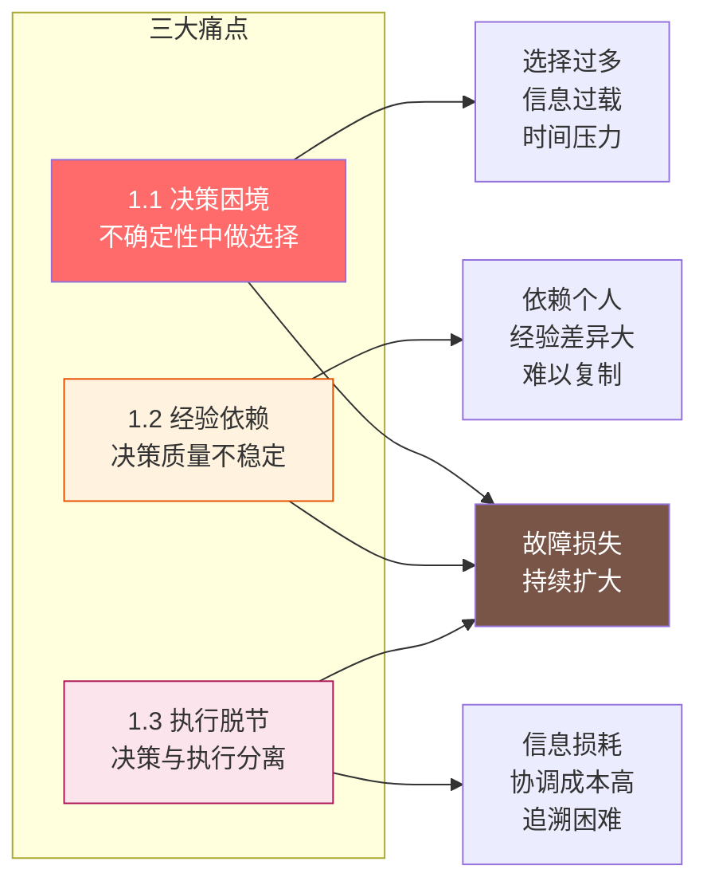

### 1.1 决策困境：在不确定性中做选择

#### 决策困境链条

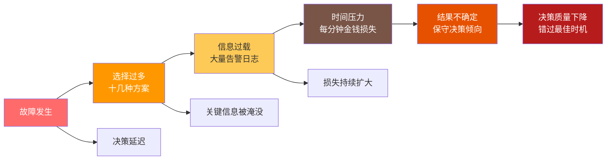

| 痛点场景 | 现状描述 | 后果 | 损失估算 |
|----------|----------|------|----------|
| **选择过多** | 可能的修复方案有十几种，不知选哪个 | 决策延迟，错过最佳时机 | +10min 延迟 |
| **信息过载** | 大量告警、证据、日志涌入，难以处理 | 关键信息被淹没 | +5min 定位 |
| **时间压力** | 故障持续损失，每分钟都是金钱 | 决策质量下降 | $50K/min |
| **结果不确定** | 无法预估每个决策的后果 | 倾向于保守决策 | 多次尝试无效 |


#### 典型案例时间轴

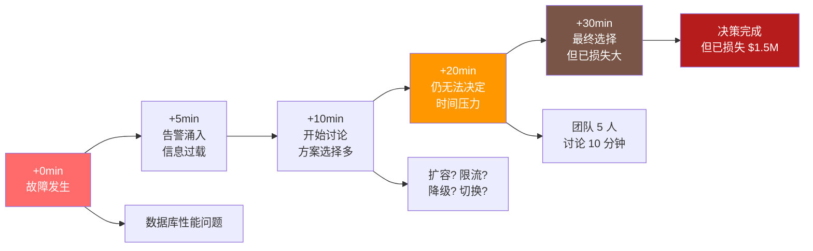

**典型案例：** 某电商系统在大促期间数据库出现性能问题，团队面临：扩容数据库？限流？降级非核心功能？切换备份？每个决策都有风险，最终团队花 20 分钟讨论仍无法决定，损失持续扩大。

### 1.2 决策质量依赖个人经验

#### 经验驱动 vs AI 驱动对比


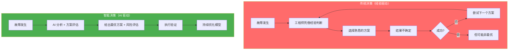

| 对比维度 | 传统决策（经验驱动） | 智能决策（AI 驱动） | 差距 |
|----------|----------------------|----------------------|------|
| **决策速度** | 5-20 分钟 | 1 分钟以内 | 5-20x |
| **方案覆盖** | 依赖个人经验，2-3 个 | 全量方案库，5-10 个 | 3-5x |
| **准确性** | 依赖工程师水平，60-80% | AI 评估，90%+ | +20-30% |
| **可复制性** | 个人经验，难以复制 | 模型复用，100% 复制 | ∞ |
| **学习曲线** | 需要多年实践积累 | 即学即用 | 极大 |

#### 经验依赖的三层问题

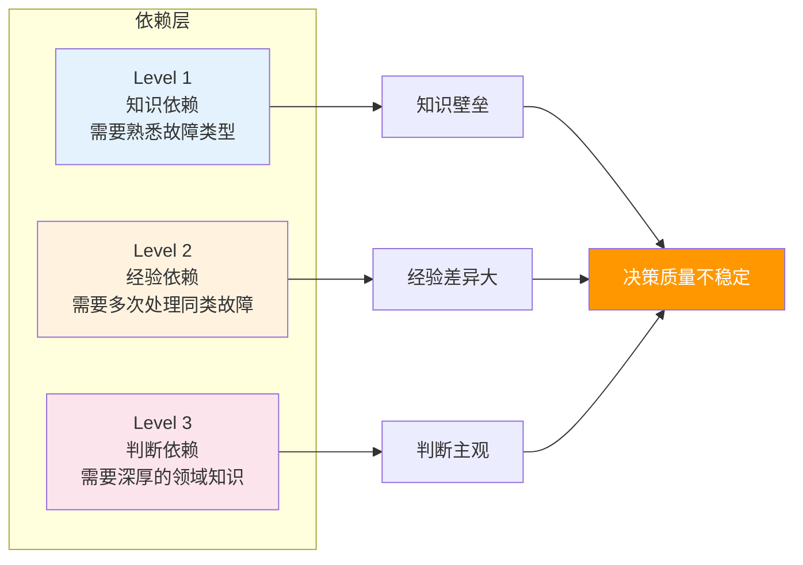

### 1.3 决策与执行脱节

#### 决策执行脱节链条

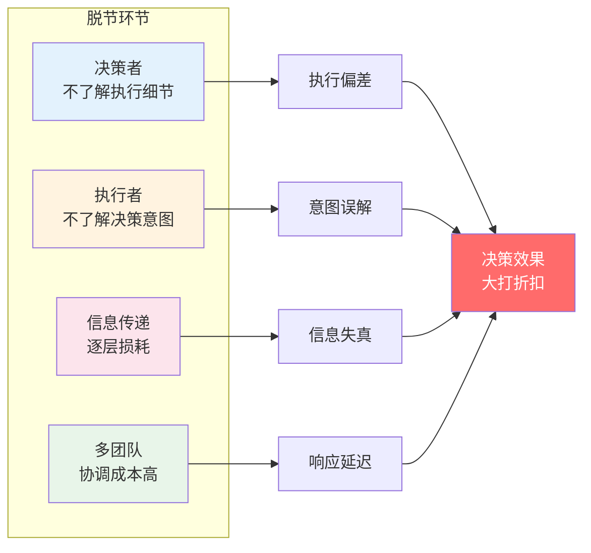

#### 四大脱节问题

| 脱节类型 | 现状描述 | 后果 | 影响程度 |
|----------|----------|------|----------|
| **信息传递损耗** | 决策由人做，执行由人做，人和人之间信息传递有损耗 | 关键信息丢失，执行偏离决策 | 高 |
| **执行细节缺失** | 决策者不了解执行细节，执行者不了解决策意图 | 执行不到位，效果打折 | 高 |
| **经验无法追溯** | 决策无法追溯，经验难以复用 | 同类问题重复踩坑 | 中 |
| **多团队不一致** | 多团队决策不一致，协调成本高 | 响应慢，资源浪费 | 中 |

#### 决策执行闭环缺失

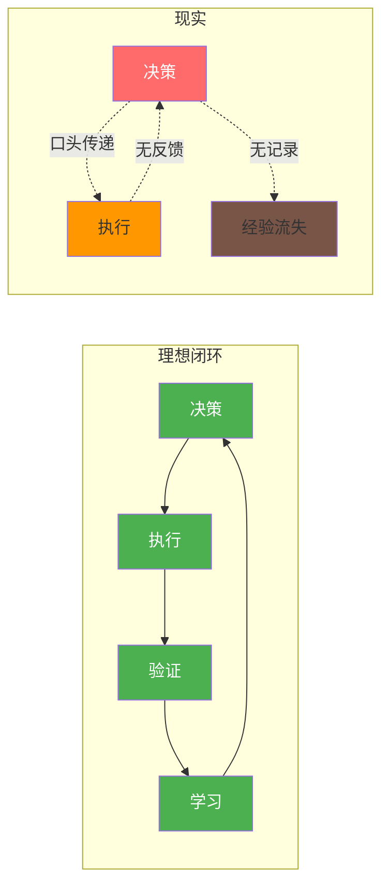

---
## 2. 业务目标
#### 业务目标总览
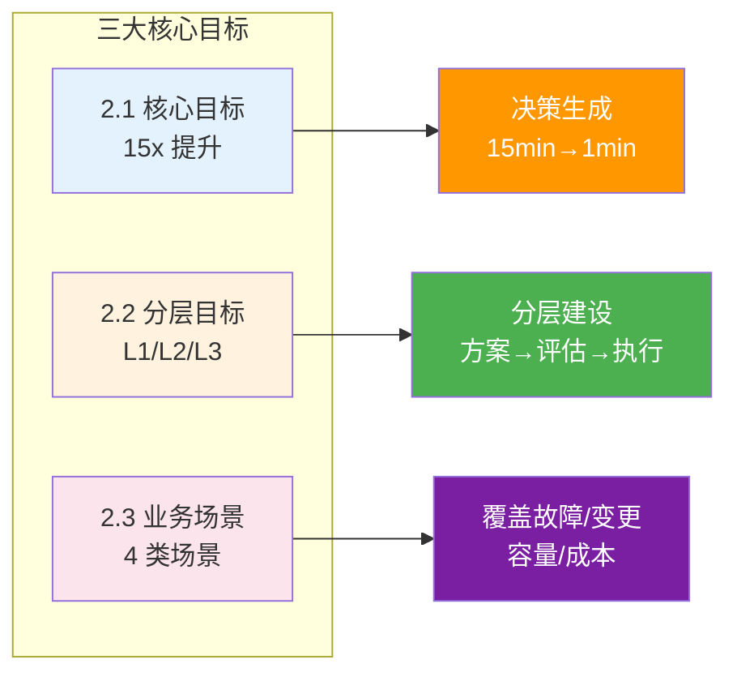
### 2.1 核心目标
#### 目标达成路径
```mermaid
flowchart LR
    NOW[当前状态] --> TARGET[目标状态]
    NOW --> T1[决策 15min]
    NOW --> T2[准确率 60%]
    NOW --> T3[自动化 20%]
    NOW --> T4[可追溯 40%]
    TARGET --> G1[决策 1min]
    TARGET --> G2[准确率 90%]
    TARGET --> G3[自动化 70%]
    TARGET --> G4[可追溯 95%]
    T1 -.15x.-> G1
    T2 -.+30%.-> G2
    T3 -.3.5x.-> G3
    T4 -.+55%.-> G4
    style NOW fill:#ff6b6b,color:#fff
    style TARGET fill:#4caf50,color:#fff
```
**构建智能决策系统，在故障发生时自动生成最优修复方案，并支持自动化执行**
| 目标 | 当前值 | 目标值 | 提升 | 度量方式 |
|------|--------|--------|------|----------|
| **决策生成时间** | 15 分钟 | 1 分钟 | 15x | 端到端计时 |
| **方案准确率** | 60% | 90% | +30% | 回测准确率 |
| **决策自动化率** | 20% | 70% | +3.5x | 自动执行占比 |
| **决策可追溯率** | 40% | 95% | +55% | 决策记录完备率 |
### 2.2 分层目标
#### L1：方案生成
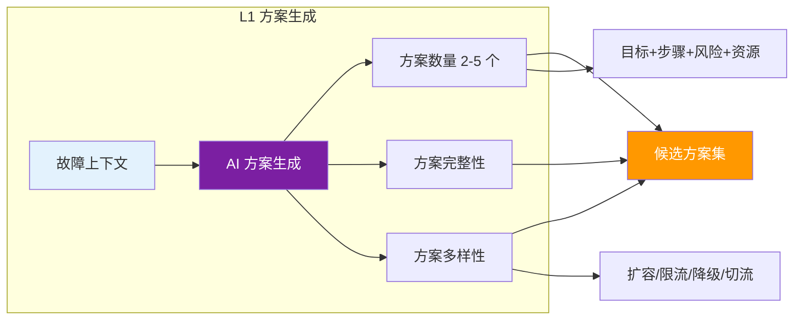
| 要求维度 | 具体要求 | 验收标准 |
|----------|----------|----------|
| **方案数量** | 每个故障生成 2-5 个候选方案 | ≥ 2 个 |
| **方案完整性** | 包含目标、步骤、风险、资源需求 | 4 项均包含 |
| **方案多样性** | 覆盖不同策略（扩容、限流、降级、切流） | ≥ 3 种策略 |
#### L2：方案评估
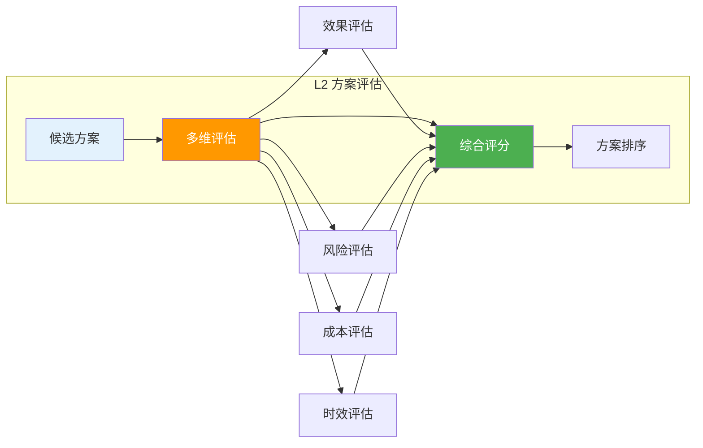
| 评估维度 | 定义 | 权重 |
|----------|------|------|
| **效果评估** | 预期修复效果（故障恢复程度） | 40% |
| **风险评估** | 执行风险和潜在副作用 | 25% |
| **成本评估** | 资源消耗、时间成本 | 20% |
| **时效评估** | 生效时间、持续时间 | 15% |
#### L3：决策执行
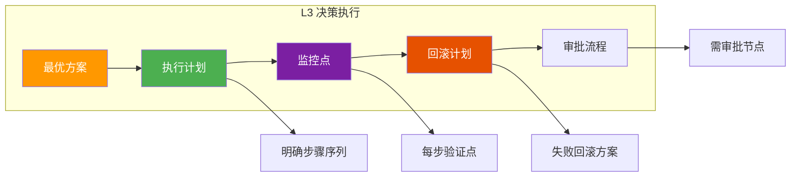
| 执行要素 | 要求 | 说明 |
|----------|------|------|
| **执行计划** | 明确的步骤序列 | 每个步骤可操作、可验证 |
| **监控点** | 每个步骤的验证点 | 确保执行到位 |
| **回滚计划** | 失败时的回滚方案 | 保障故障可恢复 |
| **审批流程** | 需要人工审批的节点 | 高风险操作需审批 |
### 2.3 业务场景
#### 四大业务场景
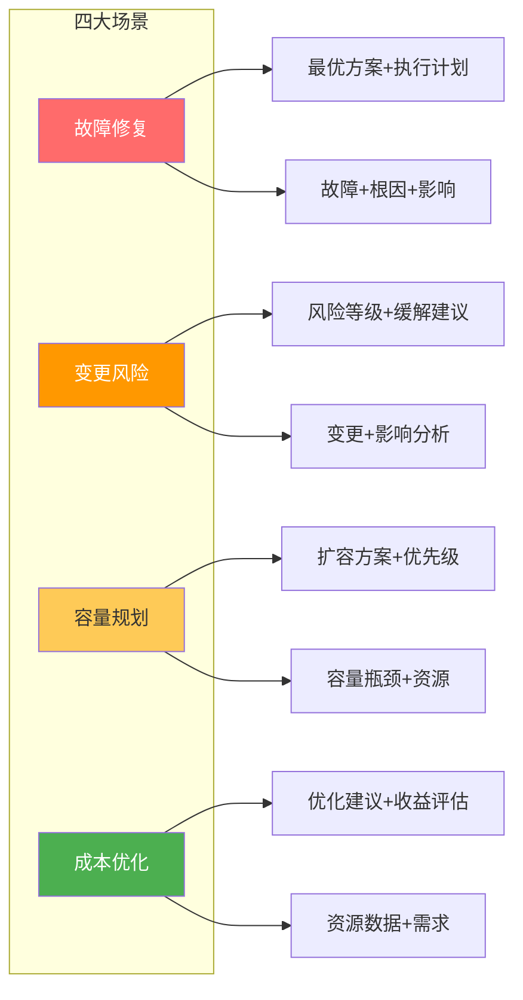
| 场景 | 输入 | 输出 | 优先级 |
|------|------|------|--------|
| **故障修复** | 故障信息 + 根因 + 影响分析 | 最优修复方案 + 执行计划 | P0 |
| **变更风险** | 变更计划 + 影响分析 | 风险等级 + 缓解建议 | P0 |
| **容量规划** | 容量瓶颈 + 资源状态 | 扩容方案 + 优先级 | P1 |
| **成本优化** | 资源使用数据 + 业务需求 | 优化建议 + 收益评估 | P2 |
#### 场景决策流程
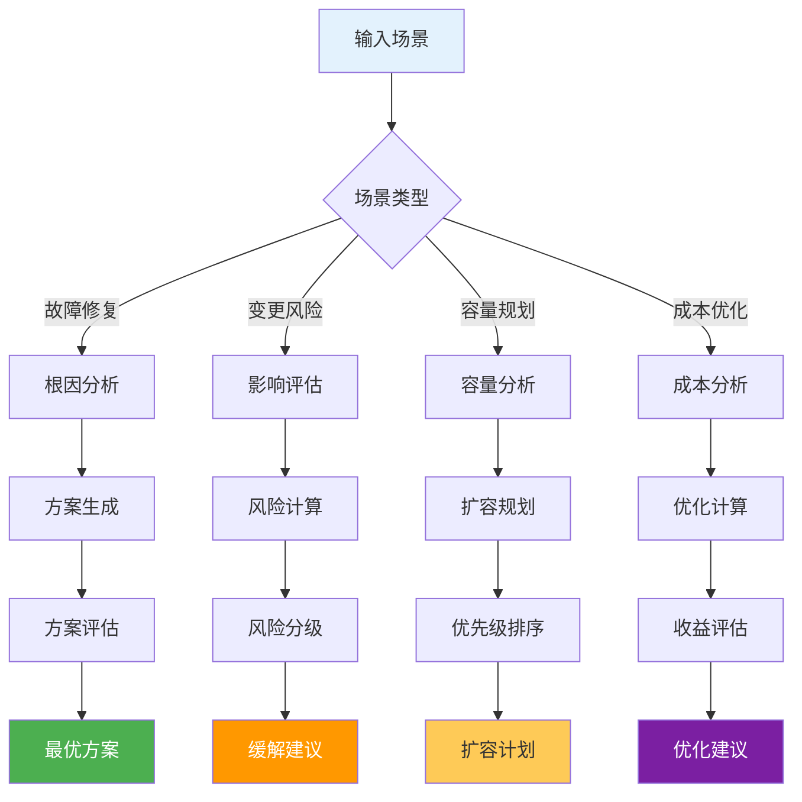

## 3. 关键能力

#### 关键能力总览

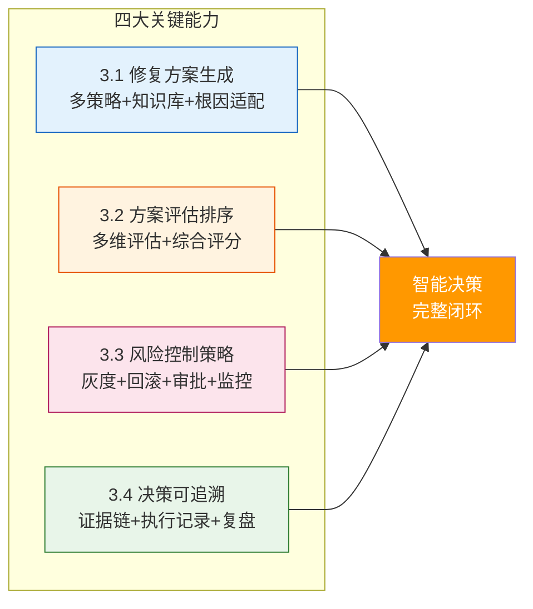

### 3.1 修复方案生成

#### 方案生成流程

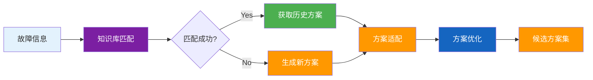

| 能力 | 描述 | 优先级 | 输出 |
|------|------|--------|------|
| **多策略生成** | 生成不同策略的方案（扩容/限流/降级/切流/回滚） | P0 | 2-5 个候选方案 |
| **知识库匹配** | 从知识库匹配历史类似问题的解决方案 | P0 | 匹配方案 |
| **根因适配** | 针对具体根因生成定制化方案 | P0 | 根因适配方案 |
| **方案优化** | 基于约束条件优化方案参数 | P1 | 最优参数方案 |

#### 修复策略体系

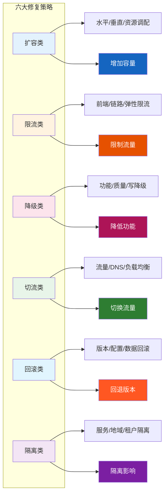

| 策略类型 | 子类型 | 适用场景 |
|----------|--------|----------|
| **扩容类** | 水平扩容、垂直扩容、资源调配 | 容量不足 |
| **限流类** | 前端限流、链路限流、弹性限流 | 流量过载 |
| **降级类** | 功能降级、质量降级、写降级 | 服务降级 |
| **切流类** | 流量切换、DNS切换、负载均衡调整 | 流量转移 |
| **回滚类** | 版本回滚、配置回滚、数据回滚 | 配置错误 |
| **隔离类** | 服务隔离、地域隔离、租户隔离 | 故障隔离 |


### 3.2 方案评估与排序

#### 多维评估体系

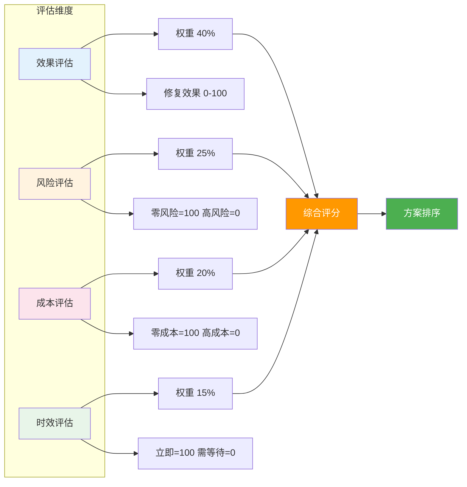

| 能力 | 描述 | 优先级 | 评估输出 |
|------|------|--------|----------|
| **多维评估** | 效果、风险、成本、时效多维度评估 | P0 | 四维得分 |
| **综合评分** | 综合计算方案得分并排序 | P0 | 排序列表 |
| **风险预测** | 预测每个方案可能的副作用 | P1 | 风险标签 |
| **对比分析** | 多方案对比，差异可视化 | P1 | 对比图表 |

#### 方案评估模型

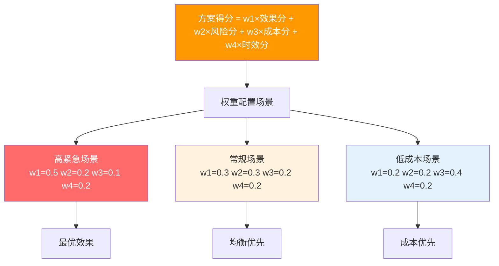

| 权重配置 | w1(效果) | w2(风险) | w3(成本) | w4(时效) | 适用场景 |
|----------|----------|----------|----------|----------|----------|
| **高紧急场景** | 0.5 | 0.2 | 0.1 | 0.2 | 故障紧急，优先恢复 |
| **常规场景** | 0.3 | 0.3 | 0.2 | 0.2 | 日常决策，均衡优先 |
| **低成本场景** | 0.2 | 0.2 | 0.4 | 0.2 | 资源受限，成本优先 |

### 3.3 风险控制策略

#### 风险控制四步流程

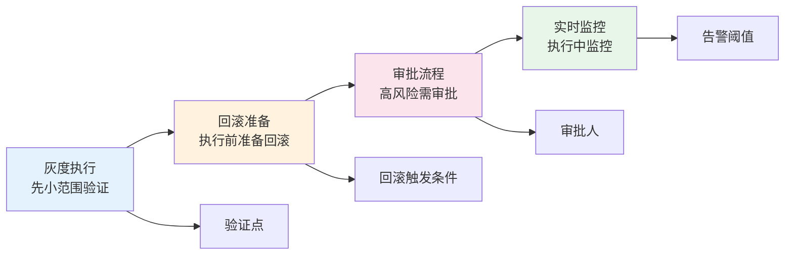

| 能力 | 描述 | 优先级 | 关键指标 |
|------|------|--------|----------|
| **灰度执行** | 先小范围验证，再全量执行 | P0 | 验证比例 5%→10%→100% |
| **回滚准备** | 执行前准备好回滚方案 | P0 | 回滚时间 < 5min |
| **审批流程** | 高风险操作需要人工审批 | P0 | 审批时效 < 10min |
| **实时监控** | 执行过程中实时监控关键指标 | P1 | 指标延迟 < 10s |

#### 风险等级与审批要求

```mermaid
flowchart LR
    subgraph 风险等级
        L1[低风险]
        L2[中风险]
        L3[高风险]
        L4[极高风险]
    end
    
    L1 --> A1[自动执行]
    L2 --> A2[值班工程师]
    L3 --> A3[运维经理]
    L4 --> A4[技术负责人]
    
    L1 --> E1[扩容实例/重启服务]
    L2 --> E2[限流配置/降级功能]
    L3 --> E3[流量切换/版本回滚]
    L4 --> E4[数据回滚/切换主库]
    
    style L1 fill:#4caf50,color:#fff
    style L2 fill:#ff9800,color:#fff
    style L3 fill:#ff5722,color:#fff
    style L4 fill:#b71c1c,color:#fff
    style A1 fill:#4caf50,color:#fff
    style A2 fill:#fff3e0
    style A3 fill:#ff9800,color:#fff
    style A4 fill:#ff6b6b,color:#fff
```

| 风险等级 | 定义 | 操作示例 | 审批要求 | 响应时效 |
|----------|------|----------|----------|----------|
| **低** | 影响可控，可快速恢复 | 扩容实例、重启服务 | 自动执行 | 即时 |
| **中** | 有一定风险，需监控 | 限流配置、降级功能 | 值班工程师审批 | < 10min |
| **高** | 风险较高，需评估 | 流量切换、版本回滚 | 运维经理审批 | < 30min |
| **极高** | 可能影响核心业务 | 数据回滚、切换主库 | 技术负责人审批 | < 60min |


### 3.4 决策解释与可追溯

#### 可追溯链路

```mermaid
flowchart LR
    subgraph 决策全链路
        INPUT[输入证据
根因+影响+知识库]
        EVAL[决策评估
方案+评分+风险]
        DECISION[最终决策
最优方案]
        EXEC[执行记录
步骤+结果]
        REVIEW[复盘优化
知识沉淀]
    end
    
    INPUT --> EVAL --> DECISION --> EXEC --> REVIEW
    
    INPUT --> TRACE1[证据链记录]
    EVAL --> TRACE2[评估过程记录]
    DECISION --> TRACE3[决策依据记录]
    EXEC --> TRACE4[执行过程记录]
    
    style INPUT fill:#e3f2fd
    style EVAL fill:#fff3e0
    style DECISION fill:#ff9800,color:#fff
    style EXEC fill:#fce4ec
    style REVIEW fill:#e8f5e9
```

| 能力 | 描述 | 优先级 | 输出物 |
|------|------|--------|--------|
| **决策依据** | 展示决策依据的完整证据链 | P0 | 证据链报告 |
| **方案对比** | 可视化对比不同方案的优劣 | P1 | 对比雷达图 |
| **执行记录** | 记录完整执行过程和结果 | P0 | 执行日志 |
| **复盘支持** | 支持事后复盘和知识沉淀 | P1 | 复盘报告 |

#### 决策可追溯四要素

```mermaid
flowchart LR
    T1[证据链
Evidence Chain] 
    T2[过程链
Process Chain] 
    T3[结果链
Result Chain] 
    T4[知识链
Knowledge Chain] 
    
    T1 --> Q1[根因依据]
    T2 --> Q2[评估过程]
    T3 --> Q3[执行结果]
    T4 --> Q4[经验教训]
    
    Q1 --> STORE[知识库
积累]
    Q2 --> STORE
    Q3 --> STORE
    Q4 --> STORE
    
    style T1 fill:#e3f2fd
    style T2 fill:#fff3e0
    style T3 fill:#fce4ec
    style T4 fill:#e8f5e9
    style STORE fill:#ff9800,color:#fff
```

---
## 4. 核心技术
#### 核心技术总览
```mermaid
flowchart LR
    subgraph 四大核心技术
        T1[4.1 系统架构
输入→决策→输出]
        T2[4.2 生成算法
知识图谱+策略扩展]
        T3[4.3 数据模型
实体+关系+流程]
        T4[4.4 状态机
决策生命周期]
    end
    T1 --> DATA[数据流]
    T2 --> DATA
    T3 --> DATA
    T4 --> DATA
    DATA --> ENG[决策引擎
核心能力]
    style T1 fill:#e3f2fd
    style T2 fill:#fff3e0
    style T3 fill:#fce4ec
    style T4 fill:#e8f5e9
    style ENG fill:#ff9800,color:#fff
```
### 4.1 智能决策系统架构
#### 系统架构全图
```mermaid
flowchart LR
    subgraph 输入层
        RCA[根因分析
结果]
        IMPACT[影响分析
结果]
        KB[知识库
历史案例]
        MONITOR[实时监控
指标]
    end
    subgraph 决策引擎层
        GEN[方案生成
多策略+知识匹配]
        EVAL[方案评估
多维评分]
        RANK[方案排序
综合得分]
        RISK[风险控制
灰度+审批]
    end
    subgraph 输出层
        PLAN[执行计划
步骤+参数]
        MONITOR_PT[监控点
验证+告警]
        ROLLBACK[回滚方案
触发条件]
        APPROVAL[审批请求
级别+人]
    end
    输入层 --> 决策引擎层 --> 输出层
    RCA --> GEN
    IMPACT --> EVAL
    KB --> GEN
    MONITOR --> RISK
    style 输入层 fill:#e3f2fd
    style 决策引擎层 fill:#fff3e0,stroke:#e65100
    style 输出层 fill:#fce4ec
```
| 层级 | 组件 | 说明 | 性能要求 |
|------|------|------|----------|
| **输入层** | 根因分析 | 获取故障根因和置信度 | < 1s |
| **输入层** | 影响分析 | 获取用户和业务影响范围 | < 1s |
| **输入层** | 知识库 | 历史案例和方案匹配 | < 2s |
| **输入层** | 实时监控 | 当前指标和异常检测 | < 500ms |
| **决策引擎** | 方案生成 | 生成 2-5 个候选方案 | < 5s |
| **决策引擎** | 方案评估 | 多维评估和综合评分 | < 3s |
| **决策引擎** | 方案排序 | 按得分排序，输出推荐 | < 1s |
| **决策引擎** | 风险控制 | 风险分级和审批流程 | < 1s |
| **输出层** | 执行计划 | 步骤、参数、验证点 | 即时 |
| **输出层** | 监控点 | 执行过程监控和告警 | 实时 |
| **输出层** | 回滚方案 | 失败回滚触发条件 | 即时 |
| **输出层** | 审批请求 | 审批人和时效要求 | < 10min |
#### 核心引擎内部架构
```mermaid
flowchart LR
    subgraph 决策引擎
        INPUT[故障上下文] --> PARSE[解析模块]
        PARSE --> KG[知识图谱
查询]
        KG --> MATCH[相似匹配]
        MATCH --> GEN[方案生成
6大策略]
        GEN --> SCORE[多维评分]
        SCORE --> FILTER[风险过滤]
        FILTER --> OUTPUT[最优方案]
    end
    PARSE --> HINT[上下文特征]
    KG --> CONTEXT[领域知识]
    MATCH --> SIM[相似度]
    GEN --> DIVERSITY[多样性]
    SCORE --> WEIGHT[权重配置]
    FILTER --> LEVEL[风险等级]
    style INPUT fill:#e3f2fd
    style KG fill:#7b1fa2,color:#fff
    style GEN fill:#ff9800,color:#fff
    style SCORE fill:#4caf50,color:#fff
    style OUTPUT fill:#1565c0,color:#fff
```
### 4.2 决策生成算法
#### 知识图谱方案生成流程
```mermaid
flowchart LR
    FAULT[故障信息] --> RCA[根因提取]
    RCA --> KG[知识图谱
查询]
    KG --> MATCH{匹配成功?}
    MATCH -->|Yes| HIST[历史方案
检索]
    MATCH -->|No| NEW[新方案生成]
    HIST --> ADAPT[方案适配
根因匹配]
    NEW --> ADAPT
    ADAPT --> OPT[方案优化
约束求解]
    OPT --> CAND[候选方案集]
    OPT --> PARAM[参数调优]
    OPT --> RISK_E[风险评估]
    OPT --> COST_E[成本估算]
    style KG fill:#7b1fa2,color:#fff
    style HIST fill:#4caf50,color:#fff
    style NEW fill:#ff9800,color:#fff
    style OPT fill:#1565c0,color:#fff
    style CAND fill:#ff9800,color:#fff
```
#### 算法流程：生成→评估→排序
```mermaid
flowchart TD
    START[故障上下文] --> G1[Step 1: 根因匹配
知识库检索]
    G1 --> G2[Step 2: 策略扩展
6大策略生成]
    G2 --> G3[Step 3: 方案优化
约束条件求解]
    G3 --> G4[Step 4: 多维评估
效果/风险/成本/时效]
    G4 --> G5[Step 5: 综合评分]
    G5 --> G6[Step 6: 排序输出]
    G6 --> OUTPUT[最优方案列表]
    G1 --> OUT1[相似案例]
    G2 --> OUT2[2-5个候选]
    G3 --> OUT3[优化后方案]
    G4 --> OUT4[四维得分]
    G5 --> OUT5[综合排名]
    G6 --> OUT6[推荐方案]
    style START fill:#e3f2fd
    style G1 fill:#7b1fa2,color:#fff
    style G2 fill:#ff9800,color:#fff
    style G3 fill:#1565c0,color:#fff
    style G4 fill:#4caf50,color:#fff
    style G5 fill:#ff5722,color:#fff
    style OUTPUT fill:#b71c1c,color:#fff
```
| 算法阶段 | 输入 | 处理 | 输出 | 时延 |
|----------|------|------|------|------|
| **根因匹配** | 故障上下文 | 知识图谱相似度检索 | 历史方案列表 | < 2s |
| **策略扩展** | 根因类型 | 6大策略遍历生成 | 候选方案列表 | < 3s |
| **方案优化** | 候选方案 | 约束条件求解 | 最优参数方案 | < 2s |
| **多维评估** | 优化后方案 | 四维评分模型 | 四维得分 | < 2s |
| **综合评分** | 四维得分 | 加权求和 | 综合得分 | < 1s |
| **排序输出** | 综合得分 | 降序排列 | 推荐方案列表 | < 1s |
#### 方案生成伪代码
```python
def generate_solutions(fault_context, knowledge_graph):
    solutions = []
    # 1. 根因匹配：从知识库获取类似根因的历史方案
    similar_faults = knowledge_graph.find_similar_rca(fault_context.rca)
    for fault in similar_faults:
        solutions.append(fault.resolved_solution)
    # 2. 策略扩展：生成不同策略的方案
    strategies = ['scale', 'limit', 'degrade', 'switch', 'rollback', 'isolate']
    for strategy in strategies:
        solution = generate_by_strategy(fault_context, strategy)
        solutions.append(solution)
    # 3. 方案优化：基于约束条件优化
    for solution in solutions:
        solution = optimize_solution(solution, constraints)
    # 4. 评估排序
    evaluated = [evaluate(s) for s in solutions]
    ranked = sorted(evaluated, key=lambda x: x.score, reverse=True)
    return ranked
```
### 4.3 决策数据模型
#### 数据模型总览
```mermaid
flowchart LR
    subgraph 决策数据实体
        E1[DECISION
决策]
        E2[FAULT
故障]
        E3[SOLUTION
方案]
        E4[EVALUATION
评估]
        E5[EXECUTION
执行]
    end
    E1 -->|fault_id| E2
    E1 -->|solution_id| E3
    E3 -->|evaluation_id| E4
    E3 -->|execution_id| E5
    E1 -->|context| CTX[CONTEXT
上下文]
    E1 -->|recommendation| REC[RECOMMENDATION
推荐]
    E2 --> RCA[根因]
    E2 --> IMPACT[影响]
    style E1 fill:#ff9800,color:#fff
    style E2 fill:#e3f2fd
    style E3 fill:#fff3e0
    style E4 fill:#fce4ec
    style E5 fill:#e8f5e9
```
#### 决策数据模型（YAML）
```yaml
decision:
  decision_id: "DEC-2024-001234"
  timestamp: "2024-01-15T10:35:00Z"
  context:
    fault_id: "FAULT-2024-001234"
    root_cause: "数据库连接池耗尽"
    impact_level: "P1"
    affected_users: 15000
  solutions:
    - rank: 1
      strategy: "扩容"
      title: "扩容数据库连接池"
      score: 85
      details:
        target: "db-order"
        action: "增加连接池上限"
        parameters:
          current: 2000
          target: 3000
        steps:
          - "确认当前连接数使用率 95%"
          - "修改 max_connections 参数"
          - "验证连接数上升"
      evaluation:
        effectiveness: 90
        risk: 70
        cost: 40
        timing: 95
      risk_control:
        risk_level: "low"
        rollback_plan: "恢复 max_connections=2000"
        monitoring_points:
          - "连接数使用率 < 80%"
          - "QPS 正常"
        approval_required: false
    - rank: 2
      strategy: "限流"
      title: "触发接口限流保护"
      score: 75
      details:
        target: "order-service"
        action: "限制 /api/orders 频率"
        parameters:
          current_limit: 10000
          new_limit: 5000
      evaluation:
        effectiveness: 80
        risk: 85
        cost: 90
        timing: 98
      risk_control:
        risk_level: "low"
        rollback_plan: "恢复 limit=10000"
        approval_required: false
  recommendation:
    primary: "DEC-SOLUTION-1"
    reason: "直接解决根因，效果最好"
    alternatives: ["DEC-SOLUTION-2"]
```
### 4.4 决策状态机
#### 决策生命周期状态机
```mermaid
flowchart LR
    subgraph 决策生命周期
        GEN[决策生成] --> PENDING[待审批]
        PENDING -->|自动执行
低风险| EXECUTING[执行中]
        PENDING -->|需审批
中/高风险| APPROVAL[审批中]
        APPROVAL -->|批准| EXECUTING
        APPROVAL -->|拒绝| REJECTED[已拒绝]
        EXECUTING --> VERIFYING[验证中]
        VERIFYING -->|成功| SUCCESS[执行成功]
        VERIFYING -->|失败| ROLLBACK[回滚中]
        ROLLBACK --> RECOVERED[已回滚]
        RECOVERED --> GEN
        REJECTED --> GEN
    end
    style GEN fill:#e3f2fd
    style PENDING fill:#fff3e0
    style EXECUTING fill:#7b1fa2,color:#fff
    style APPROVAL fill:#ff9800,color:#fff
    style VERIFYING fill:#1565c0,color:#fff
    style SUCCESS fill:#4caf50,color:#fff
    style REJECTED fill:#f44336,color:#fff
    style ROLLBACK fill:#ff5722,color:#fff
    style RECOVERED fill:#795548,color:#fff
```
| 状态 | 说明 | 允许转换 | 超时处理 |
|------|------|----------|----------|
| **决策生成** | 初始状态，AI 生成方案 | → 待审批 | - |
| **待审批** | 等待用户审批或自动执行 | → 执行中 / 审批中 | 超时自动执行（低风险）|
| **审批中** | 等待审批人确认 | → 执行中 / 已拒绝 | 审批超时升级 |
| **执行中** | 方案正在执行 | → 验证中 | 执行超时触发回滚 |
| **验证中** | 执行完成，验证效果 | → 成功 / 回滚中 | 验证超时进入回滚 |
| **执行成功** | 方案生效，故障恢复 | 终止状态 | - |
| **已拒绝** | 方案被拒绝 | → 决策生成（重新生成）| - |
| **回滚中** | 方案失败，执行回滚 | → 已回滚 | - |
| **已回滚** | 回滚完成，等待重新决策 | → 决策生成 | - |
#### 状态转换触发条件
```mermaid
flowchart LR
    S1[待审批] -->|自动执行规则| S2[执行中]
    S1 -->|审批通过| S2
    S1 -->|审批拒绝| S5[已拒绝]
    S2 -->|执行完成| S3[验证中]
    S2 -->|执行失败| S4[回滚中]
    S3 -->|验证通过| S6[成功]
    S3 -->|验证失败| S4
    S4 -->|回滚完成| S7[已回滚]
    S7 --> S1
    S5 --> S1
    S1 -->|超时| S2
    style S6 fill:#4caf50,color:#fff
    style S5 fill:#f44336,color:#fff
    style S4 fill:#ff5722,color:#fff
```

## 5. 用户体验

#### 用户体验总览

```mermaid
flowchart LR
    subgraph 四大体验模块
        E1[5.1 决策展示
页面布局+信息层次]
        E2[5.2 方案对比
多维度对比视图]
        E3[5.3 执行追踪
实时状态+进度]
        E4[5.4 决策反馈
用户评价+学习]
    end
    
    E1 --> U1[快速理解
决策上下文]
    E2 --> U2[明智选择
方案优劣势]
    E3 --> U3[掌控执行
每步可追溯]
    E4 --> U4[持续优化
模型迭代]
    
    style E1 fill:#e3f2fd
    style E2 fill:#fff3e0
    style E3 fill:#fce4ec
    style E4 fill:#e8f5e9
    style U1 fill:#1565c0,color:#fff
    style U2 fill:#e65100,color:#fff
    style U3 fill:#ad1457,color:#fff
    style U4 fill:#2e7d32,color:#fff
```

### 5.1 决策展示页面

#### 页面布局结构

```mermaid
flowchart LR
    subgraph 页面布局
        H[Header
智能决策标题+故障标签]
        B1[故障信息区
根因+置信度+影响]
        B2[方案列表区
推荐方案卡片]
        B3[操作区
执行/审批/忽略]
    end
    
    H --> B1 --> B2 --> B3
    
    B2 --> C1[方案1 得分85]
    B2 --> C2[方案2 得分75]
    
    style H fill:#e3f2fd
    style B1 fill:#fff3e0
    style B2 fill:#fce4ec
    style B3 fill:#e8f5e9
    style C1 fill:#4caf50,color:#fff
    style C2 fill:#ff9800,color:#fff
```


| 区域 | 内容 | 优先级 | 更新频率 |
|------|------|--------|----------|
| **Header** | 智能决策标题 + 故障标签 | P0 | 静态 |
| **故障信息区** | 根因 + 置信度 + 影响用户数 + 等级 | P0 | 实时 |
| **方案列表区** | 推荐方案1-3 + 四维评分 + 操作按钮 | P0 | 实时 |
| **风险提示区** | 执行后需监控的指标和阈值 | P1 | 实时 |
| **操作区** | 自动执行 / 人工审批 / 忽略建议 | P0 | 用户触发 |


#### 决策展示核心要素

```mermaid
flowchart LR
    subgraph 决策展示要素
        F1[故障上下文]
        F2[推荐方案列表]
        F3[四维评分]
        F4[执行操作]
    end
    
    F1 --> INFO[根因: 数据库连接池耗尽]
    F1 --> CONF[置信度: 92%]
    F1 --> IMPACT[影响: 15000用户 P1级]
    
    F2 --> SOL1[方案1: 扩容数据库连接池]
    F2 --> SOL2[方案2: 触发限流保护]
    F2 --> S1[(85分)]
    F2 --> S2[(75分)]
    
    F3 --> SCORE[效果/风险/成本/时效]
    
    F4 --> ACT[执行/查看详情/对比其他]
    
    style INFO fill:#ff9800,color:#fff
    style CONF fill:#e65100,color:#fff
    style IMPACT fill:#ad1457,color:#fff
    style SOL1 fill:#4caf50,color:#fff
    style SOL2 fill:#795548,color:#fff
    style S1 fill:#4caf50,color:#fff
    style S2 fill:#795548,color:#fff
    style SCORE fill:#1565c0,color:#fff
    style ACT fill:#7b1fa2,color:#fff
```

```
┌─────────────────────────────────────────────────────────────┐
│  📋 智能决策                          [故障: order-service] │
├─────────────────────────────────────────────────────────────┤
│                                                             │
│  根因：数据库连接池耗尽（置信度 92%）                        │
│  影响：15,000 用户，P1 级                                   │
├─────────────────────────────────────────────────────────────┤
│                                                             │
│  推荐方案 1：扩容数据库连接池              [得分 85]       │
│  ├─ 效果：90  │ 风险：70  │ 成本：40  │ 时效：95           │
│  ├─ 操作：max_connections 2000 → 3000                       │
│  ├─ 预期：连接数恢复正常，服务延迟下降 80%                    │
│  └─ [执行] [查看详情] [对比其他]                            │
│                                                             │
│  推荐方案 2：触发限流保护              [得分 75]            │
│  ├─ 效果：80  │ 风险：85  │ 成本：90  │ 时效：98           │
│  ├─ 操作：限制 /api/orders 5000 QPS                        │
│  └─ [执行] [查看详情]                                      │
│                                                             │
├─────────────────────────────────────────────────────────────┤
│  ⚠️ 风险提示：执行后需监控连接数使用率                        │
├─────────────────────────────────────────────────────────────┤
│  [自动执行]  [人工审批后执行]  [忽略建议]                    │
└─────────────────────────────────────────────────────────────┘
```

#### 页面交互流程

```mermaid
flowchart LR
    subgraph 页面交互
        HEADER[Header: 智能决策 + 故障标签]
        INFO[故障信息区
根因 + 置信度 + 影响]
        SOL1[方案1: 扩容连接池
得分85 - 推荐]
        SOL2[方案2: 限流保护
得分75]
        RISK[风险提示区]
        ACTIONS[操作区
自动执行/审批/忽略]
    end
    
    HEADER --> INFO
    INFO --> SOL1
    INFO --> SOL2
    SOL1 --> RISK
    SOL2 --> RISK
    RISK --> ACTIONS
    
    SOL1 -->|执行| E1[执行方案]
    SOL1 -->|详情| D1[查看详情]
    SOL1 -->|对比| C1[方案对比]
    
    ACTIONS -->|自动执行| AUTO[自动执行]
    ACTIONS -->|人工审批| APPROVE[审批流程]
    ACTIONS -->|忽略| IGNORE[忽略建议]
    
    style HEADER fill:#e3f2fd
    style INFO fill:#fff3e0
    style SOL1 fill:#4caf50,color:#fff
    style SOL2 fill:#795548,color:#fff
    style RISK fill:#ff9800,color:#fff
    style ACTIONS fill:#7b1fa2,color:#fff
```

| 页面区域 | 内容说明 | 优先级 | 交互方式 |
|----------|----------|--------|----------|
| **Header** | 智能决策标题 + 故障标签 | P0 | 静态展示 |
| **故障信息区** | 根因 + 置信度 + 影响用户 + 等级 | P0 | 可点击展开详情 |
| **方案列表区** | 推荐方案1-3 + 四维评分 + 操作按钮 | P0 | 可执行/查看/对比 |
| **风险提示区** | 执行后需监控的指标和阈值 | P1 | 告警高亮 |
| **操作区** | 自动执行 / 人工审批 / 忽略建议 | P0 | 按钮操作 |

### 5.2 方案对比视图

#### 多维度对比模型

```mermaid
flowchart LR
    subgraph 四维对比
        D1[效果维度]
        D2[风险维度]
        D3[成本维度]
        D4[时效维度]
    end
    
    D1 --> V1[恢复程度]
    D2 --> V2[执行风险]
    D3 --> V3[资源消耗]
    D4 --> V4[生效速度]
    
    V1 --> S1[90分/80分]
    V2 --> S2[70分/85分]
    V3 --> S3[40分/90分]
    V4 --> S4[95分/98分]
    
    style D1 fill:#e3f2fd
    style D2 fill:#fff3e0
    style D3 fill:#fce4ec
    style D4 fill:#e8f5e9
    style S1 fill:#4caf50,color:#fff
    style S2 fill:#ff9800,color:#fff
```


| 对比维度 | 方案1（推荐） | 方案2 | 差异分析 |
|----------|---------------|-------|----------|
| **策略** | 扩容 | 限流 | 根本解决 vs 快速止血 |
| **综合得分** | 85  | 75 | +10 分优势 |
| **效果分** | 90 | 80 | 方案1效果更好 |
| **风险分** | 70 | 85 | 方案2风险更低 |
| **成本分** | 40 | 90 | 方案2成本更低 |
| **时效分** | 95 | 98 | 方案2生效更快 |
| **恢复时间** | 5-10 分钟 | 1-2 分钟 | 方案2更快 |
| **持续效果** | 长期 | 短期 | 方案1更持久 |
| **需要审批** | 否 | 否 | 两者均可自动执行 |


#### 方案对比雷达图

```mermaid
flowchart TD
    subgraph 方案1 vs 方案2 雷达对比
        R1[效果: 90/100]
        R2[风险: 70/100]
        R3[成本: 40/100]
        R4[时效: 95/100]
    end
    
    R1 --> REC[方案1 推荐
直接解决根因]
    R2 --> DIFF[核心差异
扩容治本/限流治标]
    
    style REC fill:#4caf50,color:#fff
    style DIFF fill:#ff9800,color:#fff
```

```
┌─────────────────────────────────────────────────────────────┐
│  方案对比                                                    │
├─────────────────────┬─────────────────────┬─────────────────┤
│                     │ 方案 1 (推荐)       │ 方案 2          │
├─────────────────────┼─────────────────────┼─────────────────┤
│ 策略                │ 扩容                │ 限流            │
│ 得分                │ 85               │ 75              │
├─────────────────────┼─────────────────────┼─────────────────┤
│ 效果                │ ████████████ 90   │ ████████░░ 80   │
│ 风险                │ ███████░░░ 70     │ █████████░ 85   │
│ 成本                │ ████░░░░░░ 40     │ █████████░ 90   │
│ 时效                │ ██████████░ 95     │ ██████████ 98   │
├─────────────────────┼─────────────────────┼─────────────────┤
│ 恢复时间            │ 5-10 分钟           │ 1-2 分钟        │
│ 持续效果            │ 长期                │ 短期            │
│ 需要审批            │ 否                  │ 否              │
├─────────────────────┴─────────────────────┴─────────────────┤
│ 差异：方案 1 直接解决根因，方案 2 快速止血但非根本解决        │
└─────────────────────────────────────────────────────────────┘
```

#### 方案对比可视化

```mermaid
flowchart LR
    subgraph 方案对比总览
        S1A[策略: 扩容]
        S1B[得分: 85]
        S1C[效果: 90]
        S1D[风险: 70]
        S1E[成本: 40]
        S1F[时效: 95]
    end
    
    subgraph 方案2对比
        S2A[策略: 限流]
        S2B[得分: 75]
        S2C[效果: 80]
        S2D[风险: 85]
        S2E[成本: 90]
        S2F[时效: 98]
    end
    
    S1A -.-> S2A
    S1B -.-> S2B
    S1C -.-> S2C
    S1D -.-> S2D
    S1E -.-> S2E
    S1F -.-> S2F
    
    style S1A fill:#4caf50,color:#fff
    style S1B fill:#4caf50,color:#fff
    style S1C fill:#4caf50,color:#fff
    style S1D fill:#ff9800,color:#fff
    style S1E fill:#f44336,color:#fff
    style S1F fill:#4caf50,color:#fff
    
    style S2A fill:#795548,color:#fff
    style S2B fill:#795548,color:#fff
    style S2C fill:#795548,color:#fff
    style S2D fill:#4caf50,color:#fff
    style S2E fill:#4caf50,color:#fff
    style S2F fill:#4caf50,color:#fff
```

#### 核心差异分析

```mermaid
flowchart TD
    START[方案对比] --> T{维度}
    T -->|效果| E1[方案1: 90] --> E2[方案1更优 +10]
    T -->|风险| R1[方案1: 70 vs 方案2: 85] --> R2[方案2更低 +15]
    T -->|成本| C1[方案1: 40 vs 方案2: 90] --> C2[方案2更优 +50]
    T -->|时效| T1[方案1: 95 vs 方案2: 98] --> T2[方案2更快 +3]
    
    E2 --> REC[推荐方案1]
    R2 --> REC
    C2 -->|但| NOTE[成本高但效果好]
    NOTE --> REC
    
    style E2 fill:#4caf50,color:#fff
    style R2 fill:#795548,color:#fff
    style C2 fill:#795548,color:#fff
    style T2 fill:#795548,color:#fff
    style REC fill:#1565c0,color:#fff
```


| 对比维度 | 方案1（推荐） | 方案2 | 差异分析 | 推荐 |
|----------|---------------|-------|----------|------|
| **策略** | 扩容 | 限流 | 根本解决 vs 快速止血 | 方案1 |
| **综合得分** | 85 | 75 | +10 分优势 | 方案1 |
| **效果分** | 90 | 80 | +10 更好 | 方案1 |
| **风险分** | 70 | 85 | -15 更高风险 | 方案2 |
| **成本分** | 40 | 90 | -50 成本高 | 方案2 |
| **时效分** | 95 | 98 | -3 稍慢 | 方案2 |
| **恢复时间** | 5-10 分钟 | 1-2 分钟 | +8分钟 更慢 | 方案2 |
| **持续效果** | 长期 | 短期 | 更持久 | 方案1 |
| **需要审批** | 否 | 否 | 均可自动执行 | 持平 |


#### 选择建议

```mermaid
flowchart LR
    START{故障场景} --> T{紧急程度?}
    T -->|紧急 P0| URG[优先选方案2
快速止血 1-2分钟]
    T -->|非紧急 P1/P2| NOR[优先选方案1
根本解决 5-10分钟]
    
    URG --> RISK[但需监控风险]
    NOR --> COST[但需承担成本]
    
    RISK --> BEST[综合推荐: 方案1
治本优先]
    COST --> BEST
    
    style START fill:#e3f2fd
    style URG fill:#ff9800,color:#fff
    style NOR fill:#4caf50,color:#fff
    style BEST fill:#1565c0,color:#fff
```

### 5.3 决策执行追踪

#### 执行状态流转

```mermaid
flowchart LR
    subgraph 执行状态
        S1[执行中]
        S2[验证中]
        S3[成功]
        S4[回滚中]
        S5[失败]
    end
    
    S1 -->|完成| S2
    S1 -->|失败| S4
    S2 -->|验证通过| S3
    S2 -->|验证失败| S4
    S4 -->|完成| S1
    S4 -->|失败| S5
    
    S1 -.->|监控+中止| A1[用户操作]
    S2 -.->|确认+回滚| A2[用户操作]
    S3 -.->|关闭| A3[用户操作]
    S4 -.->|取消| A4[用户操作]
    S5 -.->|查看详情| A5[用户操作]
    
    style A1 fill:#9e9e9e,color:#fff
    style A2 fill:#9e9e9e,color:#fff
    style A3 fill:#9e9e9e,color:#fff
    style A4 fill:#9e9e9e,color:#fff
    style A5 fill:#9e9e9e,color:#fff
    
    style S1 fill:#7b1fa2,color:#fff
    style S2 fill:#1565c0,color:#fff
    style S3 fill:#4caf50,color:#fff
    style S4 fill:#ff9800,color:#fff
    style S5 fill:#f44336,color:#fff
```

| 状态 | 显示方式 | 用户操作 | 系统响应 |
|------|----------|----------|----------|
| **执行中** | 进度条 + 当前步骤 | 监控 + 中止 | 实时指标更新 |
| **验证中** | 指标变化图表 | 确认 / 回滚 | 效果对比分析 |
| **成功** | 绿色标记 + 效果对比 | 关闭 | 更新知识库 |
| **回滚中** | 进度条 + 回滚步骤 | 取消 | 执行回滚操作 |
| **失败** | 红色标记 + 原因 | 查看详情 | 记录失败原因 |


#### 执行追踪时间轴

```mermaid
flowchart LR
    T1[开始执行] --> T2[Step 1: 修改参数]
    T2 --> T3[Step 2: 验证生效]
    T3 --> T4[Step 3: 监控指标]
    T4 --> T5[验证通过
恢复成功]
    
    T2 -->|失败| R1[回滚中]
    R1 --> R2[恢复原参数]
    R2 --> R3[回滚完成]
    R3 --> T1
    
    style T1 fill:#e3f2fd
    style T2 fill:#7b1fa2,color:#fff
    style T3 fill:#1565c0,color:#fff
    style T4 fill:#ff9800,color:#fff
    style T5 fill:#4caf50,color:#fff
    style R1 fill:#ff5722,color:#fff
    style R2 fill:#795548,color:#fff
```

### 5.4 决策反馈

#### 反馈闭环流程

```mermaid
flowchart LR
    subgraph 反馈类型
        F1[执行成功]
        F2[执行失败]
        F3[方案替换]
        F4[评分修正]
    end
    
    F1 --> A1[标记成功案例]
    F1 --> K1[更新知识库]
    
    F2 --> A2[标记失败案例]
    F2 --> A3[分析失败原因]
    
    F3 --> A4[记录实际方案]
    F3 --> M1[更新推荐模型]
    
    F4 --> A5[记录用户评分]
    F4 --> W1[优化评估权重]
    
    A1 & A2 & A3 & A4 & A5 --> LOOP[模型持续优化]
    K1 & M1 & W1 --> LOOP
    
    style F1 fill:#e8f5e9
    style F2 fill:#fce4ec
    style F3 fill:#fff3e0
    style F4 fill:#e3f2fd
    style LOOP fill:#ff9800,color:#fff
```


| 用户反馈 | 系统行为 | 反馈价值 |
|----------|----------|----------|
| **执行成功** | 标记为成功案例，更新知识库 | 正向学习数据 |
| **执行失败** | 标记为失败案例，分析原因 | 失败模式识别 |
| **方案替换** | 记录实际采用的方案，更新推荐模型 | 偏好学习 |
| **评分修正** | 记录用户对方案的评分，优化评估权重 | 权重调优 |


#### 反馈数据流转

```mermaid
flowchart LR
    USER[用户反馈] --> COLLECT[数据收集]
    COLLECT --> ANALYZE[分析处理]
    ANALYZE --> UPDATE[模型更新]
    UPDATE --> IMPROVE[效果提升]
    IMPROVE --> USER
    
    COLLECT --> K1[成功案例]
    COLLECT --> K2[失败案例]
    COLLECT --> K3[评分数据]
    COLLECT --> K4[替换记录]
    
    ANALYZE --> W1[权重调整]
    ANALYZE --> W2[策略优化]
    ANALYZE --> W3[阈值调优]
    
    style USER fill:#e3f2fd
    style UPDATE fill:#4caf50,color:#fff
    style IMPROVE fill:#ff9800,color:#fff
```

---
## 6. 系统质量
### 6.0 质量架构总览
```mermaid
flowchart LR
    subgraph 质量三大支柱
        P[性能\n低延迟 高吞吐]
        A[准确性\n推荐准 风险控]
        V[可用性\n稳定 运行 不中断]
    end
    P --> Q1[性能指标]
    A --> Q2[准确性指标]
    V --> Q3[可用性指标]
    Q1 --> QA[质量保障机制]
    Q2 --> QA
    Q3 --> QA
    QA --> PM[持续改进\n学习调优 A/B测试]
    style P fill:#e3f2fd
    style A fill:#e8f5e9
    style V fill:#fff3e0
    style Q1 fill:#1565c0,color:#fff
    style Q2 fill:#4caf50,color:#fff
    style Q3 fill:#ff9800,color:#fff
    style QA fill:#7b1fa2,color:#fff
    style PM fill:#ad1457,color:#fff
```
### 6.1 性能指标
```mermaid
flowchart LR
    subgraph 性能指标体系
        L1[决策生成延迟]
        L2[并发决策能力]
        L3[方案评估延迟]
        L4[方案生成数量]
    end
    L1 -->|P99 < 60s| REQ1[业务要求]
    L2 -->|20并发| REQ2[业务要求]
    L3 -->|P99 < 2s| REQ3[业务要求]
    L4 -->|3-5个方案| REQ4[业务要求]
    REQ1 --> TEST1[测试验收]
    REQ2 --> TEST2[测试验收]
    REQ3 --> TEST3[测试验收]
    REQ4 --> TEST4[测试验收]
    style L1 fill:#e3f2fd
    style L2 fill:#e3f2fd
    style L3 fill:#e3f2fd
    style L4 fill:#e3f2fd
    style REQ1 fill:#4caf50,color:#fff
    style REQ2 fill:#4caf50,color:#fff
    style REQ3 fill:#4caf50,color:#fff
    style REQ4 fill:#4caf50,color:#fff
```
| 指标 | 要求 | 验收标准 | 测量方式 | 优先级 |
|------|------|----------|----------|--------|
| **决策生成延迟** | 从故障确认到输出方案 < 60s | P99 < 60s | 端到端耗时统计 | P0 |
| **并发决策能力** | 支持 20 并发决策任务 | 99th < 120s | 压力测试 | P0 |
| **方案评估延迟** | 单方案评估 < 2s | P99 < 2s | API响应监控 | P1 |
| **方案生成数量** | 每个故障生成 3-5 个候选方案 | 覆盖率 > 95% | 日志统计 | P1 |
### 6.2 准确性指标
```mermaid
flowchart LR
    subgraph 准确性指标
        R1[推荐准确率]
        R2[方案有效率]
        R3[风险预测准确率]
        R4[决策可追溯率]
    end
    R1 --> M1[推荐最优方案被采纳并有效]
    R2 --> M2[执行的方案能解决问题]
    R3 --> M3[预测风险与实际一致]
    R4 --> M4[有完整决策依据]
    M1 --> G1[目标 > 80%]
    M2 --> G2[目标 > 85%]
    M3 --> G3[目标 > 90%]
    M4 --> G4[目标 > 95%]
    style R1 fill:#e8f5e9
    style R2 fill:#e8f5e9
    style R3 fill:#e8f5e9
    style R4 fill:#e8f5e9
    style G1 fill:#4caf50,color:#fff
    style G2 fill:#4caf50,color:#fff
    style G3 fill:#4caf50,color:#fff
    style G4 fill:#4caf50,color:#fff
```
| 指标 | 要求 | 验收标准 | 数据来源 | 目标值 |
|------|------|----------|----------|--------|
| **推荐准确率** | 推荐最优方案被采纳并有效的比例 | > 80% | 执行结果反馈 | 80% |
| **方案有效率** | 用户执行的方案能解决问题的比例 | > 85% | 故障恢复确认 | 85% |
| **风险预测准确率** | 预测风险与实际一致的比例 | > 90% | 执行后复盘 | 90% |
| **决策可追溯率** | 有完整决策依据的决策占比 | > 95% | 审计日志 | 95% |
### 6.3 可用性指标
```mermaid
flowchart LR
    subgraph 可用性指标
        A1[系统可用性]
        A2[决策完成率]
        A3[执行成功率]
    end
    A1 -->|全年运行不中断| G1[99.9%]
    A2 -->|成功输出决策| G2[> 99%]
    A3 -->|执行中成功| G3[> 95%]
    A1 -.->|监控| M1[SLA监控]
    A2 -.->|监控| M2[决策日志]
    A3 -.->|监控| M3[执行记录]
    style A1 fill:#fff3e0
    style A2 fill:#fff3e0
    style A3 fill:#fff3e0
    style G1 fill:#ff9800,color:#fff
    style G2 fill:#4caf50,color:#fff
    style G3 fill:#4caf50,color:#fff
```
| 指标 | 要求 | 验收标准 | 监控方式 | 告警阈值 |
|------|------|----------|----------|----------|
| **系统可用性** | 全年运行不中断 | 99.9% | SLA 监控 | < 99.5% |
| **决策完成率** | 成功输出决策结果的比例 | > 99% | 决策日志 | < 98% |
| **执行成功率** | 执行完成的决策中成功的比例 | > 95% | 执行记录 | < 93% |
### 6.4 质量保障机制
```mermaid
flowchart LR
    subgraph 质量保障四大机制
        M1[方案评审]
        M2[A/B测试]
        M3[持续学习]
        M4[阈值调优]
    end
    M1 -->|P0/P1故障| T1[专家介入]
    M2 -->|上线前| T2[效果对比]
    M3 -->|每决策| T3[模型更新]
    M4 -->|每周| T4[权重调整]
    T1 --> OUT[质量提升]
    T2 --> OUT
    T3 --> OUT
    T4 --> OUT
    style M1 fill:#e3f2fd
    style M2 fill:#e8f5e9
    style M3 fill:#fff3e0
    style M4 fill:#fce4ec
    style T1 fill:#1565c0,color:#fff
    style T2 fill:#4caf50,color:#fff
    style T3 fill:#ff9800,color:#fff
    style T4 fill:#7b1fa2,color:#fff
    style OUT fill:#ad1457,color:#fff
```
| 机制 | 描述 | 触发条件 | 执行频率 | 负责人 |
|------|------|----------|----------|--------|
| **方案评审** | 专家评审高风险决策的方案 | P0/P1 故障 | 按需 | 架构师 |
| **A/B 测试** | 新旧模型并行，评估效果差异 | 上线前 | 每版本 | 算法团队 |
| **持续学习** | 基于执行结果更新模型 | 每决策 | 每日 | 数据团队 |
| **阈值调优** | 基于反馈调整评估权重 | 每周 | 每周 | 产品团队 |

## 7. 特性运营

### 7.0 运营体系总览

```mermaid
flowchart LR
    subgraph 运营四大模块
        O1[7.1 核心运营指标
量化跟踪]
        O2[7.2 运营工作流
质量改进]
        O3[7.3 用户赋能
效率提升]
        O4[7.4 持续优化
迭代演进]
    end
    
    O1 --> M1[决策生成率]
    O2 --> M2[推荐采纳率]
    O3 --> M3[自动执行率]
    O4 --> M4[决策满意度]
    
    M1 & M2 & M3 & M4 --> GOAL[业务目标达成]
    
    style O1 fill:#e3f2fd
    style O2 fill:#fff3e0
    style O3 fill:#e8f5e9
    style O4 fill:#fce4ec
    style M1 fill:#1565c0,color:#fff
    style M2 fill:#4caf50,color:#fff
    style M3 fill:#ff9800,color:#fff
    style M4 fill:#7b1fa2,color:#fff
```

### 7.1 核心运营指标

```mermaid
flowchart LR
    subgraph 五大运营指标
        K1[决策生成率]
        K2[推荐采纳率]
        K3[推荐有效率]
        K4[自动执行率]
        K5[决策满意度]
    end
    
    K1 -->|95%| G1[目标]
    K2 -->|70%| G2[目标]
    K3 -->|85%| G3[目标]
    K4 -->|50%| G4[目标]
    K5 -->|4.0/5| G5[目标]
    
    K1 --> D1[故障/总故障]
    K2 --> D2[采纳/推荐]
    K3 --> D3[有效/采纳]
    K4 --> D4[自动/总决策]
    K5 --> D5[评分/5分]
    
    style K1 fill:#e3f2fd
    style K2 fill:#e3f2fd
    style K3 fill:#e3f2fd
    style K4 fill:#e3f2fd
    style K5 fill:#e3f2fd
    style G1 fill:#1565c0,color:#fff
    style G2 fill:#1565c0,color:#fff
    style G3 fill:#1565c0,color:#fff
    style G4 fill:#1565c0,color:#fff
    style G5 fill:#1565c0,color:#fff
```

| 指标 | 定义 | 目标值 | 计算公式 | 监控频率 |
|------|------|--------|----------|----------|
| **决策生成率** | 被生成决策的故障 / 总故障数 | > 95% | 生成数/总故障数 | 实时 |
| **推荐采纳率** | 推荐方案被采纳的占比 | > 70% | 采纳数/推荐数 | 每日 |
| **推荐有效率** | 采纳方案中有效的占比 | > 85% | 有效数/采纳数 | 每日 |
| **自动执行率** | 自动执行的决策 / 总决策数 | > 50% | 自动数/总决策数 | 每日 |
| **决策满意度** | 用户对决策结果的满意度评分 | > 4.0/5 | 评分总和/评分次数 | 每周 |

### 7.2 运营工作流

#### 决策质量改进流程

```mermaid
flowchart LR
    A[执行结果] --> B{成功?}
    B -->|是| C[更新知识库]
    B -->|否| D[分析失败原因]
    D --> E{方案问题?}
    E -->|是| F[优化方案生成]
    E -->|否| G[优化执行能力]
    F --> H[更新模型]
    G --> I[优化工具链]
    H --> J[重新评估]
    I --> J
    J --> A
```

#### 运营闭环流程

```mermaid
flowchart LR
    subgraph 运营PDCA循环
        P[Plan 计划]
        D[Do 执行]
        C[Check 检查]
        A[Act 改进]
    end
    
    P --> D --> C --> A
    A --> P
    
    subgraph 运营行动
        P1[指标监控]
        D1[方案生成]
        C1[效果评估]
        A1[模型调优]
    end
    
    P1 --> P
    D1 --> D
    C1 --> C
    A1 --> A
    
    style P fill:#e3f2fd
    style D fill:#e8f5e9
    style C fill:#fff3e0
    style A fill:#fce4ec
```

### 7.3 用户赋能

```mermaid
flowchart LR
    subgraph 用户赋能四大场景
        U1[值班工程师]
        U2[技术支持]
        U3[运维经理]
        U4[SRE复盘]
    end
    
    U1 -->|决策时间-80%| E1[效率提升]
    U2 -->|一次解决率+25%| E2[质量提升]
    U3 -->|管理效率+50%| E3[管理提升]
    U4 -->|复盘效率+60%| E4[复盘提升]
    
    E1 --> VAL[业务价值]
    E2 --> VAL
    E3 --> VAL
    E4 --> VAL
    
    style U1 fill:#e3f2fd
    style U2 fill:#fff3e0
    style U3 fill:#e8f5e9
    style U4 fill:#fce4ec
    style E1 fill:#1565c0,color:#fff
    style E2 fill:#4caf50,color:#fff
    style E3 fill:#ff9800,color:#fff
    style E4 fill:#7b1fa2,color:#fff
```

| 赋能场景 | 支持内容 | 效果指标 | 优先级 |
|----------|----------|----------|--------|
| **值班工程师** | 快速获取最优方案，减少决策时间 | 决策时间 -80% | P0 |
| **技术支持** | 详细方案对比和风险评估 | 一次解决率 +25% | P0 |
| **运维经理** | 审批决策和效果追踪 | 管理效率 +50% | P1 |
| **SRE 复盘** | 完整决策过程追溯 | 复盘效率 +60% | P1 |

### 7.4 持续优化机制

```mermaid
flowchart LR
    subgraph 上线后优化阶段
        W1[上线 1 周]
        W2[上线 1 月]
        W3[上线 3 月]
        W4[上线 6 月]
    end
    
    W1 -->|用户反馈| A1[收集采纳率]
    W2 -->|标注数据| A2[分析失败案例]
    W3 -->|业务梳理| A3[评估知识库]
    W4 -->|综合评估| A4[模型迭代]
    
    A1 -->|反馈| U1[用户赋能]
    A2 -->|优化| M1[模型更新]
    A3 -->|补全| K1[知识库补全]
    A4 -->|新算法| V2[版本升级]
    
    style W1 fill:#e3f2fd
    style W2 fill:#e8f5e9
    style W3 fill:#fff3e0
    style W4 fill:#fce4ec
    style A1 fill:#1565c0,color:#fff
    style A2 fill:#4caf50,color:#fff
    style A3 fill:#ff9800,color:#fff
    style A4 fill:#7b1fa2,color:#fff
```

| 阶段 | 行动 | 反馈来源 | 优化目标 |
|------|------|----------|----------|
| 上线 1 周 | 收集方案采纳和有效率反馈 | 用户反馈 | 快速验证 |
| 上线 1 月 | 分析决策失败案例，优化模型 | 标注数据 | 准确率提升 |
| 上线 3 月 | 评估知识库覆盖度，补全常见场景 | 业务梳理 | 覆盖率提升 |
| 上线 6 月 | 模型大版本迭代，引入新算法 | 综合评估 | 能力跃升 |

---
## 8. 本章小结
### 8.0 总结架构总览
```mermaid
flowchart LR
    subgraph 本章核心模块
        S1[8.1 核心价值回顾]
        S2[8.2 AIOps链路位置]
        S3[8.3 章节接口]
        S4[8.4 成功要素]
        S5[8.5 演进方向]
        S6[8.6-8.8 要点/指标/路径]
    end
    S1 --> BRIDGE[智能决策是
分析到执行的桥梁]
    S2 --> BRIDGE
    S3 --> BRIDGE
    S4 --> SUCCESS[业务目标达成]
    S5 --> EVOLUTION[未来演进]
    S6 --> SUCCESS
    style S1 fill:#e3f2fd
    style S2 fill:#fff3e0
    style S3 fill:#e8f5e9
    style S4 fill:#fce4ec
    style S5 fill:#e1f5fe
    style S6 fill:#f3e5f5
    style BRIDGE fill:#ff9800,color:#fff
```
### 8.1 核心价值回顾
```mermaid
flowchart LR
    subgraph 核心价值三角
        P[Problem
解决什么问题]
        C[Capability
核心能力]
        G[Goal
业务目标]
    end
    P --> C --> G
    P -->|痛点| P1[决策选择困难]
    P -->|痛点| P2[信息过载]
    P -->|痛点| P3[时间压力]
    P -->|痛点| P4[结果不确定]
    C -->|能力| C1[方案生成]
    C -->|能力| C2[评估排序]
    C -->|能力| C3[风险控制]
    C -->|能力| C4[可追溯]
    G -->|目标| G1[决策时间 15x]
    G -->|目标| G2[准确率+30%]
    style P fill:#ff6b6b,color:#fff
    style C fill:#4caf50,color:#fff
    style G fill:#1565c0,color:#fff
```
| 维度 | 内容 | 关键词 |
|------|------|--------|
| **解决什么问题** | 决策选择困难、信息过载、时间压力、结果不确定 | 4 大痛点 |
| **核心能力** | 修复方案生成、方案评估排序、风险控制、决策可追溯 | 4 大能力 |
| **技术方案** | 知识图谱匹配 + 多策略生成 + 多维评估 + 风险控制 | 4 大技术 |
| **业务目标** | 决策时间 15x 提升（15min→1min），准确率 +30% | 量化目标 |
### 8.2 在 AIOps 链路中的位置
```mermaid
flowchart LR
    A[07 根因分析] --> B[08 影响分析]
    B --> C[09 智能决策]
    C --> D[10 自动执行]
    B --> E[影响范围 + 损失]
    C --> F[最优方案 + 执行计划]
    D --> G[执行结果]
    F --> H[决策输入]
    style C fill:#ff9800
```
**智能决策是分析到执行的桥梁：**
- 输入：07 根因分析 + 08 影响分析
- 输出：10 自动执行（执行计划和回滚方案）
### 8.3 与其他章节的接口
```mermaid
flowchart LR
    subgraph 本章接口
        IN[输入接口]
        OUT[输出接口]
    end
    IN --> C[09 智能决策]
    C --> OUT
    subgraph 输入来源
        I1[07 根因分析
根因+传播路径]
        I2[08 影响分析
影响范围+业务损失]
        I3[05 认知网络
知识库+历史方案]
    end
    subgraph 输出去向
        O1[10 自动执行
执行计划+回滚方案]
    end
    I1 & I2 & I3 --> IN
    OUT --> O1
    style C fill:#ff9800,color:#fff
    style IN fill:#e3f2fd
    style OUT fill:#e8f5e9
```
| 章节 | 输入 | 输出 |
|------|------|------|
| 07 根因分析 | 根因 + 传播路径 | 决策的针对目标 |
| 08 影响分析 | 影响范围 + 业务损失 | 决策优先级 |
| 05 认知网络 | 知识库 + 历史方案 | 方案生成依据 |
| 10 自动执行 | 执行计划 + 回滚方案 | 执行输入 |
### 8.4 关键成功要素
```mermaid
flowchart LR
    subgraph 五大成功要素
        K1[知识库覆盖]
        K2[评估准确率]
        K3[风险预测]
        K4[决策延迟]
        K5[可追溯性]
    end
    K1 --> P0[P0 核心]
    K2 --> P0
    K3 --> P1[P1 重要]
    K4 --> P1
    K5 --> P2[P2 基础]
    style K1 fill:#ff6b6b,color:#fff
    style K2 fill:#ff6b6b,color:#fff
    style K3 fill:#ff9800,color:#fff
    style K4 fill:#ff9800,color:#fff
    style K5 fill:#795548,color:#fff
    style P0 fill:#f44336,color:#fff
    style P1 fill:#ff9800,color:#fff
    style P2 fill:#795548,color:#fff
```
| 要素 | 说明 | 优先级 | 衡量标准 |
|------|------|--------|----------|
| **知识库覆盖** | 历史故障解决方案的覆盖度 | P0 | 覆盖率 ≥ 90% |
| **评估模型准确率** | 方案评估与实际效果匹配 | P0 | 准确率 ≥ 85% |
| **风险预测能力** | 风险预测与实际一致 | P1 | 准确率 ≥ 90% |
| **决策延迟** | 决策生成的速度 | P1 | P99 < 60s |
| **可追溯性** | 决策依据的完整记录 | P2 | 可追溯率 ≥ 95% |
### 8.5 未来演进方向
```mermaid
flowchart LR
    subgraph 演进阶段
        V1[V1 当前版本]
        V2[V2 增强版本]
        V3[V3 智能版本]
        V4[V4 战略版本]
    end
    V1 -->|预测性决策| V2
    V2 -->|自主学习| V3
    V3 -->|跨系统协同| V4
    V1 -->|多目标优化| V2
    V2 -->|自主学习| V3
    V3 -->|战略决策| V4
    style V1 fill:#e3f2fd
    style V2 fill:#fff3e0
    style V3 fill:#e8f5e9
    style V4 fill:#fce4ec
```
| 方向 | 内容 | 阶段 | 依赖 |
|------|------|------|------|
| **预测性决策** | 在故障发生前生成应对预案 | V2 | 预测模型 |
| **多目标优化** | 同时优化效果、风险、成本多目标 | V2 | 优化算法 |
| **自主学习决策** | 从执行结果中自动学习优化 | V3 | 在线学习 |
| **跨系统协同决策** | 协调多个系统的决策 | V3 | 协调机制 |
| **智能化战略决策** | 支持容量规划、成本优化等战略决策 | V4 | 战略模型 |
### 8.6 核心要点速记
**5 个关键认知：**
```mermaid
flowchart LR
    K1[智能决策是
自动执行的入口] 
    K2[方案推荐是
用户入口]
    K3[风险评估是
质量基础]
    K4[可解释性是
用户信任]
    K5[人机协同是
落地关键]
    K1 --> VAL[业务价值]
    K2 --> VAL
    K3 --> VAL
    K4 --> VAL
    K5 --> VAL
    style K1 fill:#e3f2fd
    style K2 fill:#fff3e0
    style K3 fill:#fce4ec
    style K4 fill:#e8f5e9
    style K5 fill:#f3e5f5
    style VAL fill:#ff9800,color:#fff
```
1. **智能决策是自动执行的入口** — 没有决策，自动执行无从下手
2. **方案推荐是用户入口** — 大部分用户期望系统直接给出建议方案
3. **风险评估是质量基础** — 没有风险评估的方案推荐是不负责任的
4. **可解释性是用户信任** — 黑箱决策无法被运维人员接受
5. **人机协同是落地关键** — 复杂决策需要人工审批，不能完全自动化
**4 个落地原则：**
| 原则 | 描述 | 优先级 |
|------|------|--------|
| **先推荐，后决策** | 系统推荐候选，工程师做最终决策 | P0 |
| **先规则，后模型** | 规则稳定可解释，模型持续优化 | P0 |
| **先评估，后推荐** | 没有评估的推荐是盲目推荐 | P1 |
| **先单点，后多目标** | 单目标优化稳定后再做多目标权衡 | P1 |
### 8.7 关键指标速查
```mermaid
flowchart LR
    subgraph 四大指标类别
        E[效率指标]
        A[准确性指标]
        O[运营指标]
        V[可用性指标]
    end
    E --> E1[决策时间 < 30s]
    A --> A1[推荐准确率 ≥ 90%]
    O --> O1[自动执行率 > 60%]
    V --> V1[系统可用性 99.9%]
    style E fill:#e3f2fd
    style A fill:#e8f5e9
    style O fill:#fff3e0
    style V fill:#fce4ec
    style E1 fill:#1565c0,color:#fff
    style A1 fill:#4caf50,color:#fff
    style O1 fill:#ff9800,color:#fff
    style V1 fill:#7b1fa2,color:#fff
```
| 指标类别 | 关键指标 | 目标值 | 监控频率 |
|----------|----------|--------|----------|
| **效率** | 方案生成时间 | < 5s | 实时 |
| **效率** | 评估计算时间 | < 2s | 实时 |
| **效率** | 端到端决策时间 | < 30s | 实时 |
| **准确** | 方案推荐准确率 | ≥ 90% | 每日 |
| **准确** | 风险评估准确率 | ≥ 85% | 每日 |
| **准确** | 决策采纳率 | > 75% | 每日 |
| **运营** | 自动化决策率 | > 60% | 每日 |
| **运营** | 知识库覆盖率 | ≥ 90% | 每周 |
| **运营** | 方案多样性 | 3+ 候选 | 每日 |
| **可用** | 系统可用性 | 99.9% | 实时 |
| **可用** | 响应延迟 P95 | < 5s | 实时 |
| **运营** | 用户满意度 | > 4.0/5.0 | 每周 |
### 8.8 学习路径建议
**3 类学习路径：**
| 目标 | 建议路径 | 时长 | 输出 |
|------|----------|------|------|
| **快速理解** | 阅读 8.1 + 8.2 核心要点 | 5 分钟 | 整体认知 |
| **深入掌握** | 完整阅读 1-7 节 | 60 分钟 | 深度理解 |
| **专家级** | 1-7 节 + 06/07/08 章节 + 实践 | 半天 | 实践能力 |
**与其他章节的关联：**
| 关联章节 | 关联内容 | 接口类型 |
|----------|----------|----------|
| 06 故障研判 | 故障类型作为决策上下文 | 输入 |
| 07 根因分析 | 根因结论作为决策目标 | 输入 |
| 08 影响分析 | 影响范围作为决策权重 | 输入 |
| 10 自动执行 | 决策方案作为执行剧本 | 输出 |
| 11 知识进化 | 决策结果作为学习素材 | 反馈 |

> 本章定义了智能决策的核心能力：从故障上下文到最优方案、从方案评估到执行计划。智能决策将直接驱动自动执行系统，实现故障修复的闭环。

_文档版本：V1.0 | 更新日期：2026-06-05_
