# 业务 10 · 自动执行

> 智能系统运维可观测性 · 从智能决策到自动执行的闭环落地

---

## 📑 目录

本章共 8 节，系统化阐述自动执行的产品定位、能力、技术、体验、质量和运营：

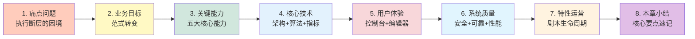
```mermaid
flowchart LR
    S1[1. 痛点问题<br/>执行断层的困境] --> S2[2. 业务目标<br/>范式转变]
    S2 --> S3[3. 关键能力<br/>五大核心能力]
    S3 --> S4[4. 核心技术<br/>架构+算法+指标]
    S4 --> S5[5. 用户体验<br/>控制台+编辑器]
    S5 --> S6[6. 系统质量<br/>安全+可靠+性能]
    S6 --> S7[7. 特性运营<br/>剧本生命周期]
    S7 --> S8[8. 本章小结<br/>核心要点速记]
    
    style S1 fill:#ffccbc
    style S2 fill:#fff9c4
    style S3 fill:#d1e7dd
    style S4 fill:#e3f2fd
    style S5 fill:#f8d7da
    style S6 fill:#e1f5fe
    style S7 fill:#fff3e0
    style S8 fill:#e1bee7
```

**8 节内容速览：**

| 节 | 主题 | 核心要点 |
|---|------|----------|
| 1. 痛点问题 | 执行断层 | 人工瓶颈、工具局限、知识断层 |
| 2. 业务目标 | 范式转变 | MTTR 80%↓、准确率 >95%、三种执行模式 |
| 3. 关键能力 | 五大能力 | 剧本编排、执行引擎、工具链、监控、回滚 |
| 4. 核心技术 | 技术实现 | DAG调度、状态机、快照机制、关键指标 |
| 5. 用户体验 | 用户界面 | 控制台、编辑器、监控、分级执行 |
| 6. 系统质量 | 质量保障 | 安全审批、可靠性、性能、质量门禁 |
| 7. 特性运营 | 运营体系 | 剧本生命周期、知识沉淀、指标体系 |
| 8. 本章小结 | 核心速记 | 要点速记、指标速查、学习路径 |

**阅读路径：**

| 读者 | 路径 | 时长 |
|------|------|------|
| **业务决策者** | 1 → 2 → 8 | 10 分钟 |
| **架构师** | 1 → 2 → 3 → 4 → 8 | 30 分钟 |
| **SRE 工程师** | 1 → 3 → 5 → 6 → 8 | 30 分钟 |
| **算法工程师** | 1 → 3 → 4 → 6 → 8 | 30 分钟 |

---

## 1. 痛点问题

### 1.0 痛点总览

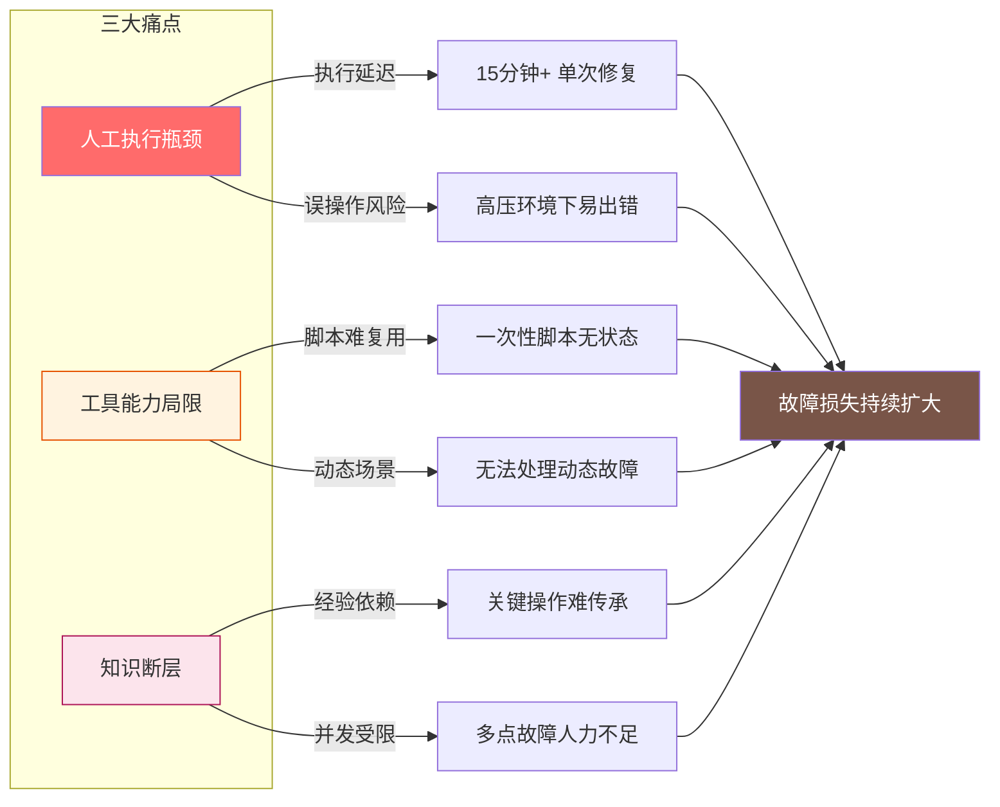
```mermaid
flowchart LR
    subgraph 三大痛点
        P1[人工执行瓶颈]
        P2[工具能力局限]
        P3[知识断层]
    end
    
    P1 -->|执行延迟| L1[15分钟+ 单次修复]
    P1 -->|误操作风险| L2[高压环境下易出错]
    P2 -->|脚本难复用| L3[一次性脚本无状态]
    P2 -->|动态场景| L4[无法处理动态故障]
    P3 -->|经验依赖| L5[关键操作难传承]
    P3 -->|并发受限| L6[多点故障人力不足]
    
    L1 & L2 & L3 & L4 & L5 & L6 --> LOSS[故障损失持续扩大]
    
    style P1 fill:#ff6b6b,color:#fff
    style P2 fill:#fff3e0,stroke:#e65100
    style P3 fill:#fce4ec,stroke:#ad1457
    style LOSS fill:#795548,color:#fff
```

### 1.1 故障响应的人工瓶颈

故障定位只是第一步，真正的挑战在于**修复执行**。传统运维模式中，从决策到操作之间存在巨大的人工断层：

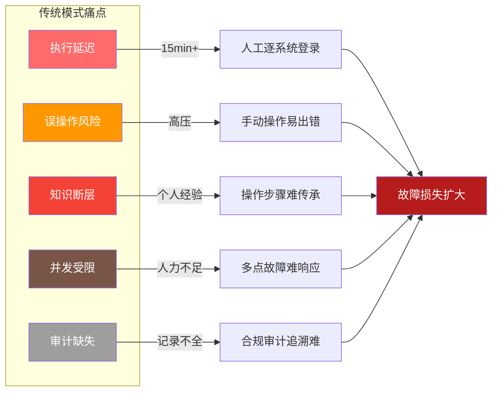
```mermaid
flowchart LR
    subgraph 传统模式痛点
        B1[执行延迟]
        B2[误操作风险]
        B3[知识断层]
        B4[并发受限]
        B5[审计缺失]
    end
    
    B1 -->|15min+| C1[人工逐系统登录]
    B2 -->|高压| C2[手动操作易出错]
    B3 -->|个人经验| C3[操作步骤难传承]
    B4 -->|人力不足| C4[多点故障难响应]
    B5 -->|记录不全| C5[合规审计追溯难]
    
    C1 --> COST[故障损失扩大]
    C2 --> COST
    C3 --> COST
    C4 --> COST
    C5 --> COST
    
    style B1 fill:#ff6b6b,color:#fff
    style B2 fill:#ff9800,color:#fff
    style B3 fill:#f44336,color:#fff
    style B4 fill:#795548,color:#fff
    style B5 fill:#9e9e9e,color:#fff
    style COST fill:#b71c1c,color:#fff
```

| 瓶颈类型 | 具体表现 | 影响程度 |
|----------|----------|----------|
| **执行延迟** | 人工逐系统登录、逐命令执行，单次修复平均耗时 15 分钟 | P0 |
| **误操作风险** | 高压环境下手动操作容易出错，回滚成本高 | P0 |
| **知识断层** | 操作依赖个人经验，关键操作步骤难以完整传承 | P1 |
| **并发受限** | 多点故障时人力无法同时响应，处理优先级混乱 | P1 |
| **审计缺失** | 操作记录不完整，合规审计难以追溯 | P2 |

### 1.2 现有自动化工具的局限

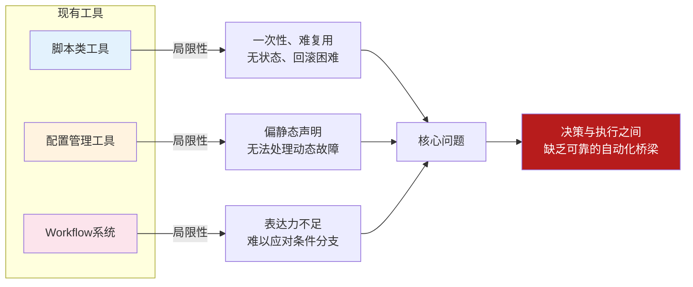
```mermaid
flowchart LR
    subgraph 现有工具
        T1[脚本类工具]
        T2[配置管理工具]
        T3[Workflow系统]
    end
    
    T1 -->|局限性| L1[一次性、难复用<br/>无状态、回滚困难]
    T2 -->|局限性| L2[偏静态声明<br/>无法处理动态故障]
    T3 -->|局限性| L3[表达力不足<br/>难以应对条件分支]
    
    L1 --> CORE[核心问题]
    L2 --> CORE
    L3 --> CORE
    
    CORE --> BRIDGE[决策与执行之间<br/>缺乏可靠的自动化桥梁]
    
    style T1 fill:#e3f2fd
    style T2 fill:#fff3e0
    style T3 fill:#fce4ec
    style BRIDGE fill:#b71c1c,color:#fff
```

| 工具类型 | 优点 | 局限 |
|----------|------|------|
| **脚本类工具** | 简单直接 | 一次性、难复用、无状态、回滚困难 |
| **配置管理工具** | 声明式管理 | 偏静态声明，无法处理动态故障场景 |
| **Workflow 系统** | 可编排 | 表达力不足，难以应对条件分支和异常跳转 |

---

## 2. 业务目标

### 2.0 业务目标总览

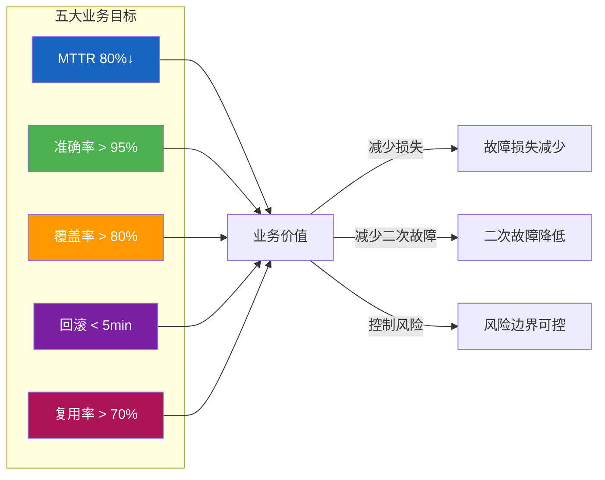
```mermaid
flowchart LR
    subgraph 五大业务目标
        G1[MTTR 80%↓]
        G2[准确率 > 95%]
        G3[覆盖率 > 80%]
        G4[回滚 < 5min]
        G5[复用率 > 70%]
    end
    
    G1 --> VAL[业务价值]
    G2 --> VAL
    G3 --> VAL
    G4 --> VAL
    G5 --> VAL
    
    VAL -->|减少损失| V1[故障损失减少]
    VAL -->|减少二次故障| V2[二次故障降低]
    VAL -->|控制风险| V3[风险边界可控]
    
    style G1 fill:#1565c0,color:#fff
    style G2 fill:#4caf50,color:#fff
    style G3 fill:#ff9800,color:#fff
    style G4 fill:#7b1fa2,color:#fff
    style G5 fill:#ad1457,color:#fff
```

### 2.1 从「人工修复」到「自动执行」的范式转变

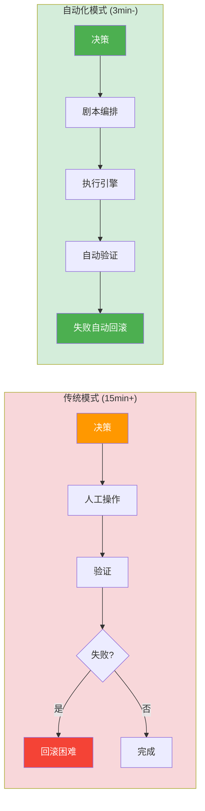
```mermaid
flowchart LR
    subgraph 传统模式["传统模式 (15min+)"]
        D1[决策] --> M1[人工操作]
        M1 --> V1[验证]
        V1 --> F1{失败?}
        F1 -->|是| R1[回滚困难]
        F1 -->|否| C1[完成]
    end
    
    subgraph 自动化模式["自动化模式 (3min-)"]
        D2[决策] --> P2[剧本编排]
        P2 --> E2[执行引擎]
        E2 --> V2[自动验证]
        V2 --> R2[失败自动回滚]
    end
    
    style 传统模式 fill:#f8d7da
    style 自动化模式 fill:#d4edda
    style D1 fill:#ff9800,color:#fff
    style D2 fill:#4caf50,color:#fff
    style R1 fill:#f44336,color:#fff
    style R2 fill:#4caf50,color:#fff
```

### 2.2 核心业务目标

| 目标 | 量化指标 | 当前基线 | 提升幅度 | 业务价值 |
|------|----------|----------|----------|----------|
| **缩短执行时间** | MTTR 从 15min → 3min | 15min | 80%↓ | 减少故障损失 |
| **提升执行准确率** | 准确率 > 95% | 70% | +25% | 减少二次故障 |
| **保障执行安全** | 回滚时间 < 5min | 30min | 83%↓ | 控制风险边界 |
| **扩大自动化覆盖** | 覆盖率 > 80% | 40% | +40% | 降低人力依赖 |
| **沉淀执行知识** | 剧本复用率 > 70% | 20% | +50% | 知识可传承 |

### 2.3 执行模式的分类

根据风险等级和业务场景，提供三种执行模式：

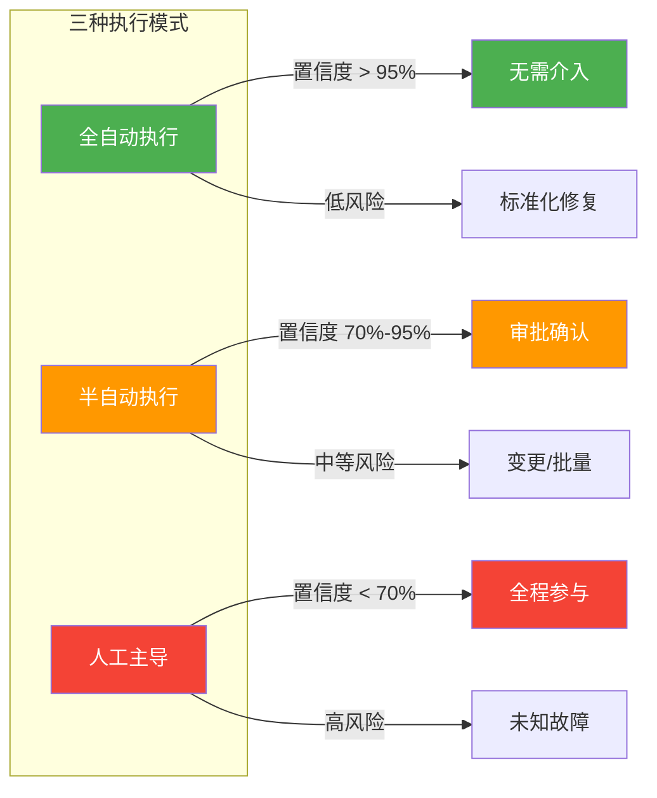
```mermaid
flowchart LR
    subgraph 三种执行模式
        M1[全自动执行]
        M2[半自动执行]
        M3[人工主导]
    end
    
    M1 -->|置信度 > 95%| C1[无需介入]
    M2 -->|置信度 70%-95%| C2[审批确认]
    M3 -->|置信度 < 70%| C3[全程参与]
    
    M1 -->|低风险| S1[标准化修复]
    M2 -->|中等风险| S2[变更/批量]
    M3 -->|高风险| S3[未知故障]
    
    style M1 fill:#4caf50,color:#fff
    style M2 fill:#ff9800,color:#fff
    style M3 fill:#f44336,color:#fff
    style C1 fill:#4caf50,color:#fff
    style C2 fill:#ff9800,color:#fff
    style C3 fill:#f44336,color:#fff
```

| 模式 | 触发条件 | 人工介入 | 适用场景 | 占比目标 |
|------|----------|----------|----------|----------|
| **全自动执行** | 置信度 > 95%，低风险 | 无需介入 | 标准化修复、可预测故障 | 60% |
| **半自动执行** | 置信度 70%-95% | 审批确认 | 中等风险变更、批量操作 | 30% |
| **人工主导** | 置信度 < 70% | 全程参与 | 高风险操作、未知故障 | 10% |

---

## 3. 关键能力

### 3.0 能力总览

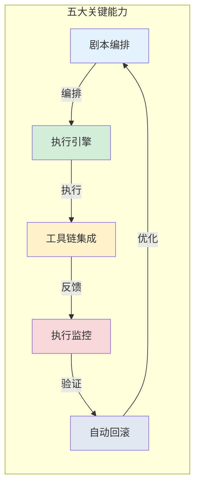
```mermaid
flowchart LR
    subgraph 五大关键能力
        C1[剧本编排]
        C2[执行引擎]
        C3[工具链集成]
        C4[执行监控]
        C5[自动回滚]
    end
    
    C1 -->|编排| C2
    C2 -->|执行| C3
    C3 -->|反馈| C4
    C4 -->|验证| C5
    C5 -->|优化| C1
    
    style C1 fill:#e3f2fd
    style C2 fill:#d4edda
    style C3 fill:#fff3cd
    style C4 fill:#f8d7da
    style C5 fill:#e2e8f0
```

### 3.1 能力矩阵概览

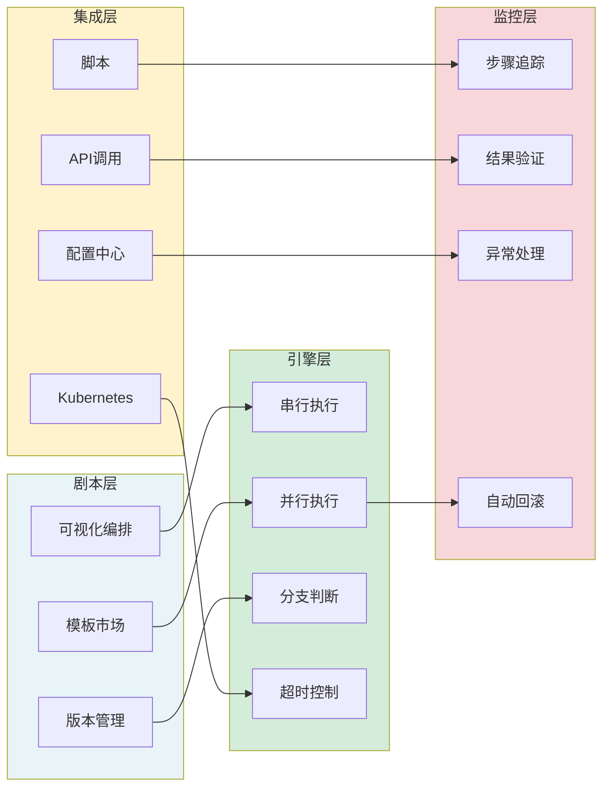
```mermaid
flowchart LR
    subgraph 剧本层["剧本层"]
        V[可视化编排]
        T[模板市场]
        VG[版本管理]
    end
    
    subgraph 引擎层["引擎层"]
        SER[串行执行]
        PAR[并行执行]
        BR[分支判断]
        TM[超时控制]
    end
    
    subgraph 集成层["集成层"]
        K8S[Kubernetes]
        SCR[脚本]
        API[API调用]
        CFG[配置中心]
    end
    
    subgraph 监控层["监控层"]
        ST[步骤追踪]
        RV[结果验证]
        AH[异常处理]
        RB[自动回滚]
    end
    
    V --> SER
    T --> PAR
    VG --> BR
    K8S --> TM
    SCR --> ST
    API --> RV
    CFG --> AH
    PAR --> RB
    
    style 剧本层 fill:#e8f4f8
    style 引擎层 fill:#d4edda
    style 集成层 fill:#fff3cd
    style 监控层 fill:#f8d7da
```

### 3.2 能力详解

#### 3.2.1 响应剧本编排

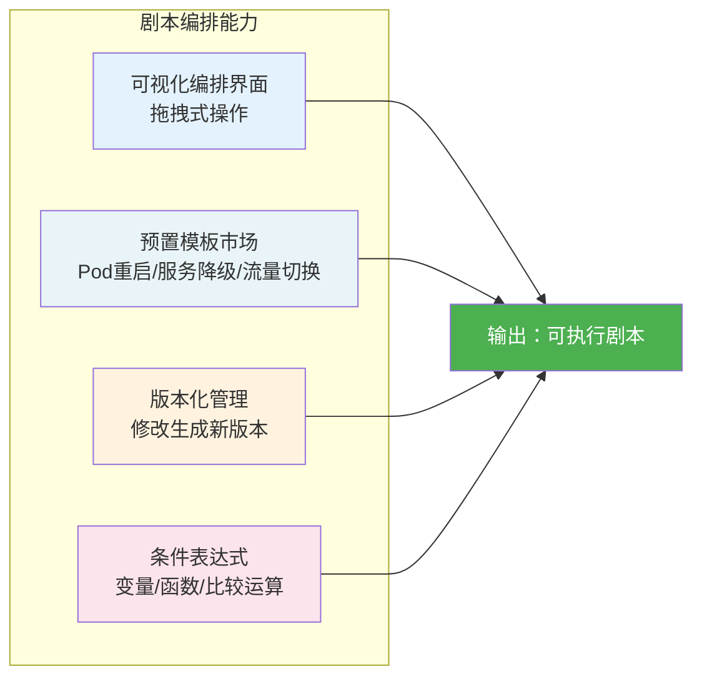
```mermaid
flowchart LR
    subgraph 剧本编排能力
        A1[可视化编排界面<br/>拖拽式操作]
        A2[预置模板市场<br/>Pod重启/服务降级/流量切换]
        A3[版本化管理<br/>修改生成新版本]
        A4[条件表达式<br/>变量/函数/比较运算]
    end
    
    A1 --> OUT[输出：可执行剧本]
    A2 --> OUT
    A3 --> OUT
    A4 --> OUT
    
    style A1 fill:#e3f2fd
    style A2 fill:#e8f4f8
    style A3 fill:#fff3e0
    style A4 fill:#fce4ec
    style OUT fill:#4caf50,color:#fff
```

| 功能 | 描述 | 优先级 |
|------|------|--------|
| **可视化编排界面** | 拖拽式操作，支持流程图展示 | P0 |
| **预置模板市场** | 提供常用场景的剧本模板 | P0 |
| **版本化管理** | 每次修改生成新版本，支持回溯和对比 | P1 |
| **条件表达式** | 支持变量引用、函数调用、比较运算 | P1 |

#### 3.2.2 执行引擎

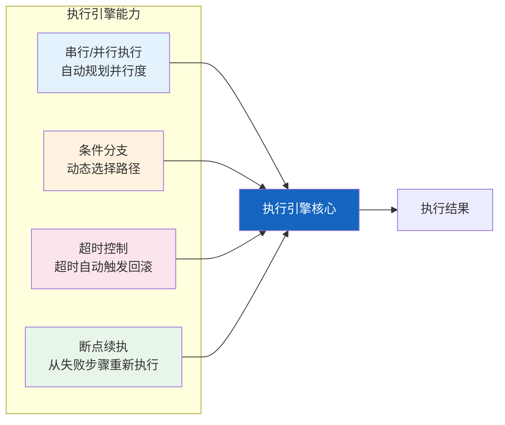
```mermaid
flowchart LR
    subgraph 执行引擎能力
        E1[串行/并行执行<br/>自动规划并行度]
        E2[条件分支<br/>动态选择路径]
        E3[超时控制<br/>超时自动触发回滚]
        E4[断点续执<br/>从失败步骤重新执行]
    end
    
    E1 --> ENG[执行引擎核心]
    E2 --> ENG
    E3 --> ENG
    E4 --> ENG
    
    ENG --> RESULT[执行结果]
    
    style E1 fill:#e3f2fd
    style E2 fill:#fff3e0
    style E3 fill:#fce4ec
    style E4 fill:#e8f5e9
    style ENG fill:#1565c0,color:#fff
```

| 能力 | 描述 | 关键指标 |
|------|------|----------|
| **串行/并行执行** | 根据依赖关系自动规划任务并行度 | 并行度 100+ |
| **条件分支** | 根据中间结果动态选择后续路径 | 支持 if/else |
| **超时控制** | 每个步骤可设置超时时间，超时自动触发回滚 | 超时 < 5min |
| **断点续执** | 支持从失败步骤重新执行，无需从头开始 | 节省70%+ 时间 |

#### 3.2.3 工具链集成

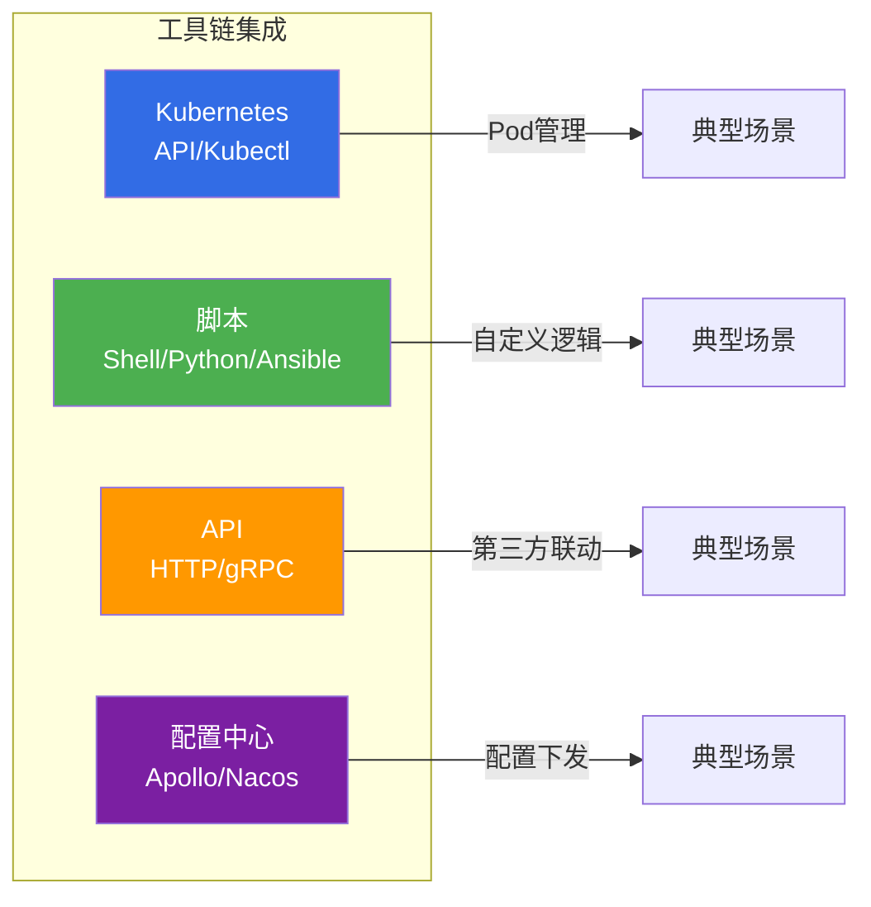
```mermaid
flowchart LR
    subgraph 工具链集成
        T1[Kubernetes<br/>API/Kubectl]
        T2[脚本<br/>Shell/Python/Ansible]
        T3[API<br/>HTTP/gRPC]
        T4[配置中心<br/>Apollo/Nacos]
    end
    
    T1 -->|Pod管理| S1[典型场景]
    T2 -->|自定义逻辑| S2[典型场景]
    T3 -->|第三方联动| S3[典型场景]
    T4 -->|配置下发| S4[典型场景]
    
    style T1 fill:#326ce5,color:#fff
    style T2 fill:#4caf50,color:#fff
    style T3 fill:#ff9800,color:#fff
    style T4 fill:#7b1fa2,color:#fff
```

| 工具类型 | 支持方式 | 典型场景 | 优先级 |
|----------|----------|----------|--------|
| **Kubernetes** | API / Kubectl | Pod 管理、Ingress 修改 | P0 |
| **脚本** | Shell / Python / Ansible | 自定义修复逻辑 | P0 |
| **API** | HTTP / gRPC | 第三方系统联动 | P1 |
| **配置中心** | Apollo / Nacos | 配置下发与验证 | P1 |

#### 3.2.4 执行监控与验证

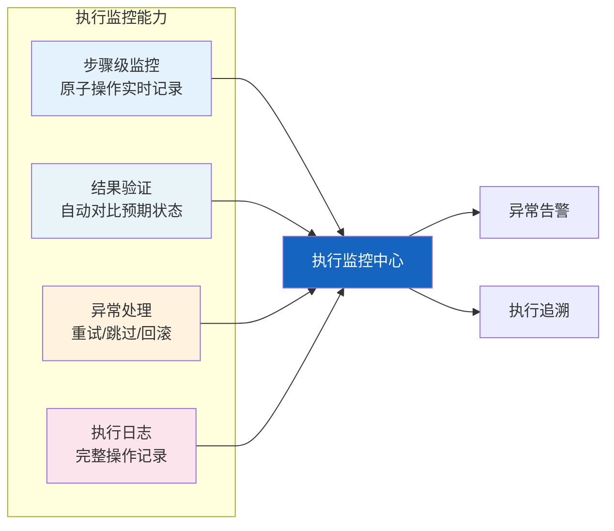
```mermaid
flowchart LR
    subgraph 执行监控能力
        M1[步骤级监控<br/>原子操作实时记录]
        M2[结果验证<br/>自动对比预期状态]
        M3[异常处理<br/>重试/跳过/回滚]
        M4[执行日志<br/>完整操作记录]
    end
    
    M1 --> MON[执行监控中心]
    M2 --> MON
    M3 --> MON
    M4 --> MON
    
    MON --> ALERT[异常告警]
    MON --> TRACE[执行追溯]
    
    style M1 fill:#e3f2fd
    style M2 fill:#e8f4f8
    style M3 fill:#fff3e0
    style M4 fill:#fce4ec
    style MON fill:#1565c0,color:#fff
```

| 能力 | 描述 | 输出物 |
|------|------|--------|
| **步骤级监控** | 每个原子操作实时记录状态 | 步骤状态日志 |
| **结果验证** | 执行后自动对比预期状态，支持自定义断言 | 验证报告 |
| **异常处理** | 捕获异常、分类处理（重试/跳过/回滚） | 异常分类 |
| **执行日志** | 完整记录操作前后状态，支持审计追溯 | 审计日志 |

#### 3.2.5 自动回滚

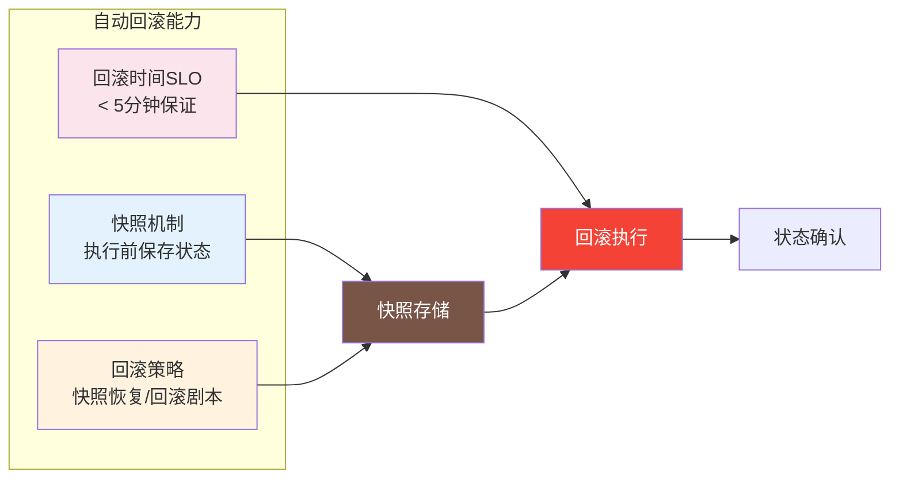
```mermaid
flowchart LR
    subgraph 自动回滚能力
        R1[快照机制<br/>执行前保存状态]
        R2[回滚策略<br/>快照恢复/回滚剧本]
        R3[回滚时间SLO<br/>< 5分钟保证]
    end
    
    R1 --> SNAP[快照存储]
    R2 --> SNAP
    R3 --> RB[回滚执行]
    
    SNAP --> RB
    RB --> VERIFY[状态确认]
    
    style R1 fill:#e3f2fd
    style R2 fill:#fff3e0
    style R3 fill:#fce4ec
    style SNAP fill:#795548,color:#fff
    style RB fill:#f44336,color:#fff
```

| 能力 | 描述 | 关键指标 |
|------|------|----------|
| **快照机制** | 执行前自动保存当前状态 | 快照大小< 100MB |
| **回滚策略** | 失败后自动根据快照恢复，或执行预定义回滚剧本 | 回滚成功率 > 99% |
| **回滚时间 SLO** | 确保任何情况下回滚时间 < 5 分钟 | SLO 达成率 > 99.9% |

---

## 4. 核心技术

### 4.0 核心技术总览

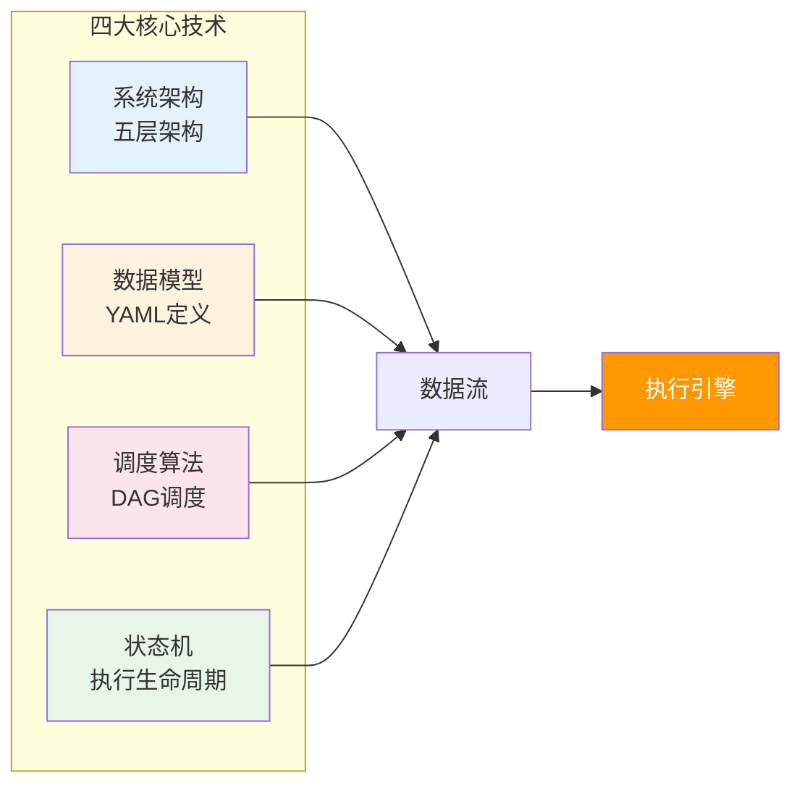
```mermaid
flowchart LR
    subgraph 四大核心技术
        T1[系统架构<br/>五层架构]
        T2[数据模型<br/>YAML定义]
        T3[调度算法<br/>DAG调度]
        T4[状态机<br/>执行生命周期]
    end
    
    T1 --> DATA[数据流]
    T2 --> DATA
    T3 --> DATA
    T4 --> DATA
    
    DATA --> ENG[执行引擎]
    
    style T1 fill:#e3f2fd
    style T2 fill:#fff3e0
    style T3 fill:#fce4ec
    style T4 fill:#e8f5e9
    style ENG fill:#ff9800,color:#fff
```

### 4.1 系统架构

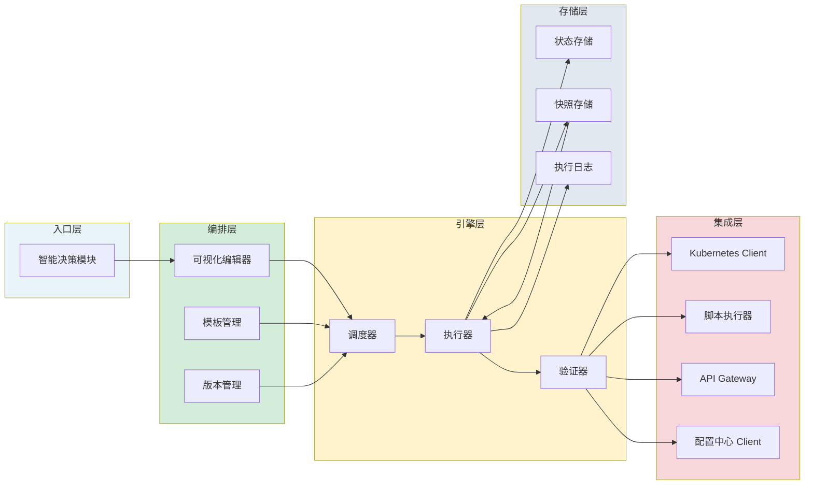
```mermaid
flowchart LR
    subgraph 入口["入口层"]
        ID[智能决策模块]
    end
    
    subgraph 编排层["编排层"]
        VE[可视化编辑器]
        TM[模板管理]
        VG[版本管理]
    end
    
    subgraph 引擎层["引擎层"]
        SCH[调度器]
        EXE[执行器]
        VAL[验证器]
    end
    
    subgraph 集成层["集成层"]
        K8S[Kubernetes Client]
        SCR[脚本执行器]
        API[API Gateway]
        CFG[配置中心 Client]
    end
    
    subgraph 存储层["存储层"]
        ST[状态存储]
        SNAP[快照存储]
        LOG[执行日志]
    end
    
    ID --> VE
    VE --> SCH
    TM --> SCH
    VG --> SCH
    SCH --> EXE
    EXE --> VAL
    VAL --> K8S
    VAL --> SCR
    VAL --> API
    VAL --> CFG
    EXE --> ST
    EXE --> SNAP
    EXE --> LOG
    SNAP --> EXE
    
    style 入口 fill:#e8f4f8
    style 编排层 fill:#d4edda
    style 引擎层 fill:#fff3cd
    style 集成层 fill:#f8d7da
    style 存储层 fill:#e2e8f0
```

### 4.2 核心技术实现

#### 4.2.1 剧本数据模型

```mermaid
flowchart LR
    subgraph 剧本数据模型
        M1[id:唯一标识]
        M2[version: 版本号]
        M3[name: 剧本名称]
        M4[trigger: 触发条件]
        M5[steps: 步骤列表]
        M6[variables: 变量定义]
        M7[outputs: 输出映射]
    end
    
    M5 -->|步骤类型| S1[atomic | branch | parallel]
    M5 -->|工具类型| S2[k8s | script | api | config]
    M5 -->|失败策略| S3[rollback | skip | retry]
    
    style M1 fill:#e3f2fd
    style M2 fill:#e3f2fd
    style M3 fill:#e3f2fd
    style M4 fill:#fff3e0
    style M5 fill:#d4edda
    style M6 fill:#fce4ec
    style M7 fill:#fce4ec
```

```yaml
Playbook:
  id: string              # 唯一标识
  version: string         # 版本号
  name: string            # 剧本名称
  description: string     # 描述
  trigger: Trigger        # 触发条件
  steps:
    - id: string          # 步骤ID
      type: StepType      # atomic | branch | parallel
      tool: ToolType      # k8s | script | api | config
      config: object      # 工具配置
      on_failure: string  # 失败策略: rollback | skip | retry
      timeout: number     # 超时时间(秒)
      verify: object      # 验证规则
  variables: object      # 变量定义
  outputs: object        # 输出映射
```

#### 4.2.2 执行引擎核心算法

**任务调度算法：**

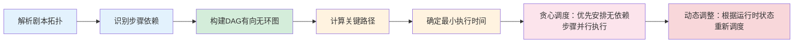
```mermaid
flowchart LR
    A[解析剧本拓扑] --> B[识别步骤依赖]
    B --> C[构建DAG有向无环图]
    C --> D[计算关键路径]
    D --> E[确定最小执行时间]
    E --> F[贪心调度：优先安排无依赖步骤并行执行]
    F --> G[动态调整：根据运行时状态重新调度]
    
    style A fill:#e3f2fd
    style B fill:#e3f2fd
    style C fill:#d4edda
    style D fill:#fff3e0
    style E fill:#fff3e0
    style F fill:#fce4ec
    style G fill:#f8d7da
```

**回滚算法：**


```mermaid
flowchart LR
    A[执行前：拍摄系统状态快照] --> B[失败检测：步骤返回非零或验证不通过]
    B --> C{回滚策略}
    C -->|快照恢复| D[从最近快照恢复系统状态]
    C -->|回滚剧本| E[按反向顺序执行回滚步骤]
    D --> F[状态确认：验证回滚结果]
    E --> F
    
    style A fill:#e3f2fd
    style B fill:#fff3e0
    style C fill:#fce4ec
    style D fill:#f8d7da
    style E fill:#f8d7da
    style F fill:#4caf50,color:#fff
```

#### 4.2.3 执行状态机

```mermaid
flowchart LR
    subgraph 执行状态机
        S1[Pending<br/>待执行]
        S2[Running<br/>执行中]
        S3[Validating<br/>验证中]
        S4[Completed<br/>执行成功]
        S5[RollingBack<br/>回滚中]
        S6[RolledBack<br/>已回滚]
        S7[Failed<br/>失败]
    end
    
    S1 -->|开始执行| S2
    S2 -->|步骤完成| S3
    S3 -->|验证通过| S2
    S3 -->|验证失败| S5
    S2 -->|所有步骤完成| S4
    S5 -->|回滚完成| S6
    S5 -->|回滚失败| S7
    S4 -->|[终止]
    S6 -->|[终止]
    S7 -->|[终止]
    
    style S1 fill:#fff3e0
    style S2 fill:#1565c0,color:#fff
    style S3 fill:#ff9800,color:#fff
    style S4 fill:#4caf50,color:#fff
    style S5 fill:#ff5722,color:#fff
    style S6 fill:#795548,color:#fff
    style S7 fill:#f44336,color:#fff
```

### 4.3 关键技术指标

| 指标 | 目标值 | 当前基线 | 说明 |
|------|--------|----------|------|
| **剧本启动时间** | < 2s | 5s | 从决策到开始执行 |
| **步骤执行延迟** | < 500ms | 1s | 单个原子操作响应 |
| **并行任务数** | 100+ | 50 | 支持大规模并发修复 |
| **快照大小限制** | 100MB | 200MB | 单次快照最大存储 |
| **回滚成功率** | > 99% | 95% | 自动回滚成功比例 |

---

## 5. 用户体验

### 5.0 用户体验总览

```mermaid
flowchart LR
    subgraph 四大体验模块
        U1[5.1 执行控制台<br/>概览+步骤+日志]
        U2[5.2 用户交互流程<br/>全自动/半自动/人工]
        U3[5.3 剧本编辑器<br/>可视化编排]
        U4[5.4 执行监控界面<br/>实时状态]
    end
    
    U1 --> R1[快速理解]
    U2 --> R2[明晰操作]
    U3 --> R3[便捷编排]
    U4 --> R4[掌控执行]
    
    style U1 fill:#e3f2fd
    style U2 fill:#fff3e0
    style U3 fill:#e8f5e9
    style U4 fill:#fce4ec
    style R1 fill:#1565c0,color:#fff
    style R2 fill:#4caf50,color:#fff
    style R3 fill:#ff9800,color:#fff
    style R4 fill:#7b1fa2,color:#fff
```

### 5.1 执行控制台

```mermaid
flowchart LR
    subgraph 控制台["执行控制台"]
        H[执行概览] --> S[步骤列表]
        S --> L[日志查看]
        L --> V[验证结果]
        V --> A[操作按钮]
    end
    
    subgraph 操作区["实时操作"]
        PS[暂停]
        RS[恢复]
        AB[中止]
        RB[回滚]
    end
    
    H --> PS
    S --> RS
    L --> AB
    V --> RB
    
    style 控制台 fill:#e8f4f8
    style 操作区 fill:#d4edda
    style H fill:#e3f2fd
    style S fill:#e3f2fd
    style L fill:#e3f2fd
    style V fill:#e3f2fd
    style A fill:#e3f2fd
```

| 区域 | 内容 | 交互方式 |
|------|------|----------|
| **执行概览** | 当前执行状态、进度条、预估时间 | 静态展示 |
| **步骤列表** | 所有步骤及状态（成功/进行中/失败/跳过） | 可点击查看详情 |
| **日志查看** | 实时日志流、支持 ANSI 彩色日志 | 滚动/搜索 |
| **验证结果** | 每步验证结果、断言状态 | 静态展示 |
| **操作按钮** | 暂停/恢复/中止/回滚 | 按钮操作 |

### 5.2 用户交互流程

#### 场景一：全自动执行（低风险）

```mermaid
flowchart LR
    A[决策系统生成方案] --> B[用户确认执行]
    B --> C[剧本自动执行]
    C --> D[执行完成通知]
    D --> E[结果验证]
    E --> F[知识库更新]
    
    style A fill:#fff3e0
    style B fill:#e3f2fd
    style C fill:#4caf50,color:#fff
    style D fill:#1565c0,color:#fff
    style E fill:#ff9800,color:#fff
    style F fill:#7b1fa2,color:#fff
```

用户仅需点击「确认执行」，剩余流程全自动完成，执行完成后推送通知。

#### 场景二：半自动执行（中等风险）

```mermaid
flowchart LR
    A[决策系统生成方案] --> B[用户预览剧本]
    B --> C[用户审批通过]
    C --> D[分步执行-每步需确认]
    D --> E[执行监控]
    E --> F{异常?}
    F -->|无| G[完成]
    F -->|有| H[人工介入/自动回滚]
    
    style A fill:#fff3e0
    style B fill:#e3f2fd
    style C fill:#4caf50,color:#fff
    style D fill:#1565c0,color:#fff
    style E fill:#ff9800,color:#fff
    style F fill:#fce4ec
    style G fill:#4caf50,color:#fff
    style H fill:#f44336,color:#fff
```

用户需逐步骤确认，遇到异常会暂停等待人工决策。

#### 场景三：人工主导（高风险）

```mermaid
flowchart LR
    A[决策系统建议方案] --> B[用户详细审阅]
    B --> C[用户手动操作]
    C --> D[操作记录自动归档]
    
    style A fill:#fff3e0
    style B fill:#e3f2fd
    style C fill:#ff9800,color:#fff
    style D fill:#795548,color:#fff
```

系统提供操作指引但不自动执行，用户完成后手动标记完成。

### 5.3 剧本可视化编辑器

```mermaid
flowchart LR
    subgraph 编辑器功能
        E1[拖拽编排<br/>拖拽步骤块构建流程图]
        E2[节点配置<br/>点击节点配置工具参数]
        E3[条件设置<br/>为分支节点设置条件表达式]
        E4[预览运行<br/>模拟执行查看执行路径]
        E5[版本对比<br/>对比两个版本的差异]
    end
    
    E1 --> EDIT[剧本编辑器]
    E2 --> EDIT
    E3 --> EDIT
    E4 --> EDIT
    E5 --> EDIT
    
    EDIT --> OUT[输出：可执行剧本]
    
    style E1 fill:#e3f2fd
    style E2 fill:#fff3e0
    style E3 fill:#fce4ec
    style E4 fill:#e8f5e9
    style E5 fill:#f3e5f5
    style EDIT fill:#1565c0,color:#fff
```

| 功能 | 描述 | 优先级 |
|------|------|--------|
| **拖拽编排** | 拖拽步骤块构建流程图 | P0 |
| **节点配置** | 点击节点配置工具参数 | P0 |
| **条件设置** | 为分支节点设置条件表达式 | P1 |
| **预览运行** | 模拟执行查看执行路径 | P1 |
| **版本对比** | 对比两个版本的差异 | P2 |

### 5.4 执行监控界面

```mermaid
flowchart LR
    subgraph 监控界面要素
        M1[实时进度条<br/>当前步骤+整体进度]
        M2[步骤状态灯<br/>成功/进行中/失败/跳过]
        M3[日志实时流<br/>ANSI彩色日志滚动]
        M4[变量追踪<br/>当前步骤变量值]
        M5[一键回滚<br/>失败时显示回滚按钮]
    end
    
    M1 --> MON[执行监控中心]
    M2 --> MON
    M3 --> MON
    M4 --> MON
    M5 --> MON
    
    MON --> ALERT[异常告警]
    MON --> TRACE[执行追溯]
    
    style M1 fill:#4caf50,color:#fff
    style M2 fill:#1565c0,color:#fff
    style M3 fill:#ff9800,color:#fff
    style M4 fill:#7b1fa2,color:#fff
    style M5 fill:#f44336,color:#fff
```

| 界面要素 | 描述 | 状态颜色 |
|----------|------|----------|
| **实时进度条** | 展示当前步骤和整体进度 | - |
| **步骤状态灯** | 成功（绿）/ 进行中（黄）/ 失败（红）/ 跳过（灰） | 状态指示 |
| **日志实时流** | 支持 ANSI 彩色日志实时滚动 | - |
| **变量追踪** | 显示当前步骤中的变量值 | - |
| **一键回滚** | 失败时显示回滚按钮 |紧急操作 |

---

## 6. 系统质量

### 6.0 系统质量总览

```mermaid
flowchart LR
    subgraph 三大质量支柱
        Q1[安全性<br/>操作安全+权限+审计]
        Q2[可靠性<br/>高可用+幂等+回滚]
        Q3[性能<br/>并行+连接复用+增量]
    end
    
    Q1 --> Q[质量门禁]
    Q2 --> Q
    Q3 --> Q
    
    Q --> QUALITY[质量保障体系]
    
    style Q1 fill:#f8d7da
    style Q2 fill:#d4edda
    style Q3 fill:#e3f2fd
    style Q fill:#ff9800,color:#fff
    style QUALITY fill:#b71c1c,color:#fff
```

### 6.1 安全性设计

```mermaid
flowchart LR
    subgraph 五大安全维度
        S1[操作安全<br/>二次确认+审批]
        S2[权限控制<br/>RBAC+最小权限]
        S3[审计追踪<br/>完整日志+录像]
        S4[数据安全<br/>传输加密+脱敏]
        S5[隔离性<br/>测试/生产隔离]
    end
    
    S1 --> SEC[安全体系]
    S2 --> SEC
    S3 --> SEC
    S4 --> SEC
    S5 --> SEC
    
    style S1 fill:#f8d7da
    style S2 fill:#fce4ec
    style S3 fill:#fff3e0
    style S4 fill:#e8f5e9
    style S5 fill:#e3f2fd
    style SEC fill:#b71c1c,color:#fff
```

| 安全维度 | 保障措施 | 优先级 |
|----------|----------|--------|
| **操作安全** | 操作前二次确认、高风险操作需上级审批 | P0 |
| **权限控制** | RBAC 角色权限、操作最小权限原则 | P0 |
| **审计追踪** | 完整操作日志、敏感操作录像 | P0 |
| **数据安全** | 传输加密、敏感数据脱敏 | P1 |
| **隔离性** | 测试环境与生产环境隔离执行 | P1 |

### 6.2 可靠性设计

```mermaid
flowchart LR
    subgraph 五大可靠性保障
        R1[执行引擎高可用<br/>主备切换+故障剔除]
        R2[状态持久化<br/>进度持久化+重启恢复]
        R3[超时保护<br/>独立超时控制+防挂死]
        R4[幂等设计<br/>重复执行无副作用]
        R5[回滚保障<br/>失败自动回滚+<5min]
    end
    
    R1 --> REL[可靠性保障]
    R2 --> REL
    R3 --> REL
    R4 --> REL
    R5 --> REL
    
    style R1 fill:#e3f2fd
    style R2 fill:#e8f4f8
    style R3 fill:#fff3e0
    style R4 fill:#fce4ec
    style R5 fill:#f8d7da
    style REL fill:#4caf50,color:#fff
```

| 保障类型 | 实现方式 | 目标值 |
|----------|----------|--------|
| **执行引擎高可用** | 主备切换，故障节点自动剔除 | 可用性 99.9% |
| **状态持久化** | 执行进度持久化，重启可恢复 | 进度零丢失 |
| **超时保护** | 每个步骤独立超时控制，防止挂死 | 超时率 < 0.1% |
| **幂等设计** | 重复执行不产生副作用 | 幂等率 100% |
| **回滚保障** | 失败自动回滚，回滚时间 < 5min | 回滚成功率 > 99% |

### 6.3 性能设计

```mermaid
flowchart LR
    subgraph 四大性能优化
        P1[并行执行<br/>解析依赖关系+最大化并行度]
        P2[连接复用<br/>工具连接池复用+减少建连开销]
        P3[增量执行<br/>跳过未变更步骤]
        P4[流式日志<br/>边执行边输出+避免内存堆积]
    end
    
    P1 --> PERF[性能优化]
    P2 --> PERF
    P3 --> PERF
    P4 --> PERF
    
    PERF --> LATENCY[延迟降低]
    PERF --> THROUGHPUT[吞吐量提升]
    
    style P1 fill:#e3f2fd
    style P2 fill:#e8f4f8
    style P3 fill:#fff3e0
    style P4 fill:#fce4ec
    style LATENCY fill:#1565c0,color:#fff
    style THROUGHPUT fill:#4caf50,color:#fff
```

| 优化点 | 实现方式 | 提升幅度 |
|--------|----------|----------|
| **并行执行** | 解析依赖关系，最大化并行度 | 并行度 +100% |
| **连接复用** | 工具连接池复用，减少建连开销 | 延迟 -50% |
| **增量执行** | 支持跳过未变更步骤 | 时间 -30% |
| **流式日志** | 日志边执行边输出，避免内存堆积 | 内存 -70% |

### 6.4 质量门禁

```mermaid
flowchart LR
    subgraph 四大质量门禁
        G1[前置检查<br/>环境状态+工具可用性]
        G2[步骤验证<br/>返回值+输出格式]
        G3[后置验证<br/>最终状态对比]
        G4[超时检查<br/>执行时间超限]
    end
    
    G1 -->|失败| A1[阻止执行]
    G2 -->|失败| A2[触发回滚]
    G3 -->|失败| A3[触发回滚]
    G4 -->|失败| A4[强制中止+回滚]
    
    style G1 fill:#e3f2fd
    style G2 fill:#fff3e0
    style G3 fill:#fce4ec
    style G4 fill:#f8d7da
    style A1 fill:#f44336,color:#fff
    style A2 fill:#ff5722,color:#fff
    style A3 fill:#ff5722,color:#fff
    style A4 fill:#b71c1c,color:#fff
```

| 门禁类型 | 检查项 | 失败处理 |
|----------|--------|----------|
| **前置检查** | 环境状态、依赖工具可用性 | 阻止执行 |
| **步骤验证** | 步骤返回值、输出格式 | 触发回滚 |
| **后置验证** | 最终状态与预期对比 | 触发回滚 |
| **超时检查** | 步骤执行时间超限 | 强制中止+回滚 |

---

## 7. 特性运营

### 7.0 特性运营总览

```mermaid
flowchart LR
    subgraph 四大运营模块
        O1[7.1 剧本运营体系<br/>创作+治理+运营+优化]
        O2[7.2 关键运营指标<br/>覆盖率+复用率+成功率]
        O3[7.3 剧本生命周期<br/>创作+审核+上线+运营+淘汰]
        O4[7.4 知识沉淀<br/>案例归档+最佳实践]
    end
    
    O1 --> VAL[业务价值]
    O2 --> VAL
    O3 --> VAL
    O4 --> VAL
    
    style O1 fill:#e3f2fd
    style O2 fill:#fff3e0
    style O3 fill:#e8f5e9
    style O4 fill:#fce4ec
    style VAL fill:#4caf50,color:#fff
```

### 7.1 剧本运营体系

```mermaid
flowchart LR
    subgraph 创作["剧本创作"]
        TMP[模板市场]
        NEW[新建剧本]
        FORK[从案例fork]
    end
    
    subgraph 治理["剧本治理"]
        AUDIT[审核]
        VER[版本管理]
        TAG[标签分类]
    end
    
    subgraph 运营["使用运营"]
        USE[使用统计]
        POP[热门推荐]
        ALP[低效预警]
    end
    
    subgraph 优化["持续优化"]
        FB[反馈收集]
        IMP[迭代改进]
        REJ[淘汰重构]
    end
    
    TMP --> AUDIT
    NEW --> AUDIT
    FORK --> AUDIT
    AUDIT --> VER
    VER --> USE
    USE --> POP
    USE --> ALP
    ALP --> REJ
    FB --> IMP
    IMP --> VER
    
    style 创作 fill:#e8f4f8
    style 治理 fill:#d4edda
    style 运营 fill:#fff3cd
    style 优化 fill:#f8d7da
```

### 7.2 关键运营指标

```mermaid
flowchart LR
    subgraph 五大运营指标
        K1[剧本覆盖率]
        K2[剧本复用率]
        K3[执行成功率]
        K4[平均执行时长]
        K5[回滚触发率]
    end
    
    K1 -->|目标 > 80%| G1
    K2 -->|目标 > 70%| G2
    K3 -->|目标 > 95%| G3
    K4 -->|目标 < 3min| G4
    K5 -->|目标 < 5%| G5
    
    style K1 fill:#e3f2fd
    style K2 fill:#e3f2fd
    style K3 fill:#e3f2fd
    style K4 fill:#e3f2fd
    style K5 fill:#e3f2fd
    style G1 fill:#1565c0,color:#fff
    style G2 fill:#1565c0,color:#fff
    style G3 fill:#1565c0,color:#fff
    style G4 fill:#1565c0,color:#fff
    style G5 fill:#1565c0,color:#fff
```

| 指标 | 计算方式 | 目标值 | 监控频率 |
|------|----------|--------|----------|
| **剧本覆盖率** | 覆盖场景数 / 总场景数 | > 80% | 每周 |
| **剧本复用率** | 被复用次数 / 剧本总数 | > 70% | 每日 |
| **执行成功率** | 成功执行数 / 总执行数 | > 95% | 每日 |
| **平均执行时长** | 累计执行时长 / 执行次数 | < 3min | 每日 |
| **回滚触发率** | 回滚次数 / 失败次数 | < 5% | 每日 |

### 7.3 剧本生命周期管理

```mermaid
flowchart LR
    subgraph 剧本生命周期
        L1[创作]
        L2[审核]
        L3[上线]
        L4[运营]
        L5[淘汰]
    end
    
    L1 -->|模板选择+流程设计+参数配置| L2
    L2 -->|安全性审查+风险评估+审批| L3
    L3 -->|版本发布+灰度测试+全量启用| L4
    L4 -->|使用监控+效果评估+迭代优化| L5
    L5 -->|使用率低于阈值| L1
    
    L1 -->|责任人| R1[运维工程师]
    L2 -->|责任人| R2[运维负责人]
    L3 -->|责任人| R3[运维工程师]
    L4 -->|责任人| R4[运维工程师]
    L5 -->|责任人| R5[系统自动]
    
    style L1 fill:#e3f2fd
    style L2 fill:#fff3e0
    style L3 fill:#d4edda
    style L4 fill:#ff9800,color:#fff
    style L5 fill:#f44336,color:#fff
```

| 阶段 | 活动 | 责任人 | 输出物 |
|------|------|--------|--------|
| **创作** | 模板选择、流程设计、参数配置 | 运维工程师 | 剧本草稿 |
| **审核** | 安全性审查、风险评估、审批 | 运维负责人 | 审核报告 |
| **上线** | 版本发布、灰度测试、全量启用 | 运维工程师 | 上线记录 |
| **运营** | 使用监控、效果评估、迭代优化 | 运维工程师 | 运营报告 |
| **淘汰** | 使用率低于阈值、触发下线 | 系统自动 | 下线报告 |

### 7.4 知识沉淀机制

```mermaid
flowchart LR
    subgraph 知识沉淀四大机制
        K1[执行案例归档<br/>自动生成案例报告]
        K2[成功剧本推广<br/>高频成功进入模板市场]
        K3[失败经验提炼<br/>失败案例分析生成改进建议]
        K4[最佳实践提取<br/>高评分剧本提取最佳实践]
    end
    
    K1 --> KB[知识库]
    K2 --> KB
    K3 --> KB
    K4 --> KB
    
    KB -->|反馈| LOOP[持续优化循环]
    
    style K1 fill:#e3f2fd
    style K2 fill:#d4edda
    style K3 fill:#fff3e0
    style K4 fill:#fce4ec
    style KB fill:#1565c0,color:#fff
    style LOOP fill:#4caf50,color:#fff
```

| 机制 | 描述 | 优先级 |
|------|------|--------|
| **执行案例归档** | 每次执行完成后自动生成案例报告 | P0 |
| **成功剧本推广** | 高频成功的剧本进入模板市场 | P1 |
| **失败经验提炼** | 失败案例分析生成改进建议 | P0 |
| **最佳实践提取** | 从高评分剧本中提取最佳实践 | P1 |

---

## 8. 本章小结

### 8.0 本章总结架构

```mermaid
flowchart LR
    subgraph 本章核心模块
        S1[8.1 核心价值]
        S2[8.2 章节关系]
        S3[8.3 能力总结]
        S4[8.4 核心要点]
        S5[8.5 指标速查]
        S6[8.6 学习路径]
    end
    
    S1 --> VAL[自动执行是<br/>AIOps落地的最后一公里]
    S2 --> VAL
    S3 --> VAL
    S4 --> SUCCESS[业务目标达成]
    S5 --> SUCCESS
    S6 --> SUCCESS
    
    style S1 fill:#e3f2fd
    style S2 fill:#fff3e0
    style S3 fill:#e8f5e9
    style S4 fill:#fce4ec
    style S5 fill:#f3e5f5
    style S6 fill:#e1f5fe
    style VAL fill:#ff9800,color:#fff
```

### 8.1 核心价值回顾

```mermaid
flowchart LR
    subgraph 核心价值
        P[Problem<br/>痛点问题]
        C[Capability<br/>关键能力]
        G[Goal<br/>业务目标]
    end
    
    P --> C --> G
    P -->|人工瓶颈| P1[执行延迟+误操作]
    P -->|工具局限| P2[脚本难复用]
    P -->|知识断层| P3[经验难传承]
    
    C -->|五大能力| C1[剧本编排+执行引擎<br/>工具链+监控+回滚]
    
    G -->|目标| G1[MTTR 80%↓]
    G -->|目标| G2[准确率 > 95%]
    
    style P fill:#ff6b6b,color:#fff
    style C fill:#4caf50,color:#fff
    style G fill:#1565c0,color:#fff
```

| 维度 | 内容 | 关键词 |
|------|------|--------|
| **解决什么问题** | 人工执行瓶颈、工具能力局限、知识断层 | 3 大痛点 |
| **核心能力** | 剧本编排、执行引擎、工具链集成、执行监控、自动回滚 | 5 大能力 |
| **技术方案** | DAG 调度算法、状态机设计、快照机制 | 3 大技术 |
| **业务目标** | MTTR 80%↓、准确率 > 95%、覆盖率 > 80% | 量化目标 |

### 8.2 与前后章节的关系

```mermaid
flowchart LR
    subgraph 本章接口
        IN[输入接口]
        OUT[输出接口]
    end
    
    IN --> C[10 自动执行]
    C --> OUT
    
    subgraph 输入来源
        I1[09 智能决策<br/>修复方案+执行策略]
        I2[02 拓扑建模<br/>拓扑结构]
        I3[08 影响分析<br/>影响范围]
    end
    
    subgraph 输出去向
        O1[11 知识进化<br/>执行结果反馈]
    end
    
    I1 & I2 & I3 --> IN
    OUT --> O1
    
    style C fill:#ff9800,color:#fff
    style IN fill:#e3f2fd
    style OUT fill:#e8f5e9
```

| 章节 | 关系 | 说明 |
|------|------|------|
| 09 智能决策 | **输入** | 提供修复方案和执行策略，本章负责落地执行 |
| 11 知识进化 | **输出** | 执行结果反馈到知识库，优化决策质量 |
| 02 拓扑建模 | **支撑** | 拓扑结构确定执行范围和目标 |
| 08 影响分析 | **参考** | 影响评估决定执行模式和风险等级 |

### 8.3 关键能力总结

| 能力 | 描述 | 关键价值 |
|------|------|----------|
| **剧本编排** | 可视化编排预定义修复流程 | 降低操作复杂度 |
| **执行引擎** | 串行/并行、断点续执、超时控制 | 提升执行效率 |
| **工具链集成** | Kubernetes、脚本、API、配置中心 | 覆盖所有操作场景 |
| **执行监控** | 步骤追踪、结果验证、异常处理 | 确保执行可控 |
| **自动回滚** | 快照恢复、失败自动回滚 | 控制风险边界 |

### 8.4 核心要点速记

**5 个关键认知：**

```mermaid
flowchart LR
    K1[自动执行是<br/>AIOps的最后一公里] 
    K2[安全优先于效率]
    K3[可回滚是底线]
    K4[可观测是基础]
    K5[审批机制是信任]
    
    K1 --> VAL[业务价值]
    K2 --> VAL
    K3 --> VAL
    K4 --> VAL
    K5 --> VAL
    
    style K1 fill:#e3f2fd
    style K2 fill:#fff3e0
    style K3 fill:#fce4ec
    style K4 fill:#e8f5e9
    style K5 fill:#f3e5f5
    style VAL fill:#ff9800,color:#fff
```

1. **自动执行是 AIOps 的最后一公里** — 没有执行，前面的所有智能化都是空谈
2. **安全优先于效率** — 执行系统一旦失误，影响范围远大于人工
3. **可回滚是底线** — 任何执行操作都必须可回滚
4. **可观测是基础** — 执行过程必须完全可监控、可追踪
5. **审批机制是信任** — 关键操作必须人工审批，不能完全自动化

**4 个落地原则：**

| 原则 | 描述 | 优先级 |
|------|------|--------|
| **先剧本，后执行** | 预编排剧本比临时执行更安全 | P0 |
| **先审批，后执行** | 关键操作必须人工审批 | P0 |
| **先快照，后变更** | 任何变更前必须先打快照 | P1 |
| **先验证，后完成** | 执行完成后必须验证结果 | P1 |

### 8.5 关键指标速查

```mermaid
flowchart LR
    subgraph 四大指标类别
        E[效率指标]
        A[准确性指标]
        S[安全性指标]
        O[运营指标]
    end
    
    E --> E1[MTTR 80%↓]
    A --> A1[准确率 > 95%]
    S --> S1[回滚成功率 > 99%]
    O --> O1[剧本覆盖率 > 80%]
    
    style E fill:#e3f2fd
    style A fill:#e8f5e9
    style S fill:#fce4ec
    style O fill:#fff3e0
    style E1 fill:#1565c0,color:#fff
    style A1 fill:#4caf50,color:#fff
    style S1 fill:#f44336,color:#fff
    style O1 fill:#ff9800,color:#fff
```

| 指标类别 | 关键指标 | 目标值 | 监控频率 |
|----------|----------|--------|----------|
| **效率** | MTTR 降低 | 80% | 实时 |
| **效率** | 执行响应时间 | < 5s | 实时 |
| **效率** | 端到端执行时间 | < 10 分钟 | 实时 |
| **准确** | 执行准确率 | > 95% | 每日 |
| **准确** | 自动执行成功率 | > 90% | 每日 |
| **安全** | 误操作率 | < 1% | 实时 |
| **安全** | 回滚成功率 | > 99% | 实时 |
| **运营** | 剧本覆盖率 | > 80% | 每周 |
| **运营** | 自动化执行率 | > 60% | 每日 |
| **可用** | 系统可用性 | 99.99% | 实时 |
| **可用** | 执行引擎可用性 | 99.9% | 实时 |
| **运营** | 用户满意度 | > 4.0/5.0 | 每周 |

### 8.6 学习路径建议

| 目标 | 建议路径 | 时长 | 输出 |
|------|----------|------|------|
| **快速理解** | 阅读 8.1 + 8.2 核心要点 | 5 分钟 | 整体认知 |
| **深入掌握** | 完整阅读 1-7 节 | 60 分钟 | 深度理解 |
| **专家级** | 1-7 节 + 09 章节 + 实践 | 半天 | 实践能力 |

**与其他章节的关联：**

| 关联章节 | 关联内容 | 接口类型 |
|----------|----------|----------|
| 09 智能决策 | 决策方案作为执行剧本 | 输入 |
| 11 知识进化 | 执行结果作为学习素材 | 输出 |
| 02 拓扑建模 | 拓扑结构作为执行目标 | 支撑 |
| 08 影响分析 | 影响范围作为执行参考 | 参考 |

### 核心价值

> **自动执行是 AIOps 落地的最后一公里**
>
> 智能决策解决「做什么」的问题，自动执行解决「怎么做」的问题。
>
> 通过剧本编排、执行引擎、工具链集成、执行监控、自动回滚五大核心能力，
> 实现从「人工修复」到「自动执行」的范式转变，
> 最终达成 1 分钟发现 → 5 分钟定位 → 10 分钟恢复的运维目标。

---

## 相关文档

| 文档 | 说明 |
|------|------|
| [09 智能决策](./09-intelligent-decision.md) | 提供修复方案和执行策略 |
| [11 知识进化](./11-knowledge-evolution.md) | 执行结果反馈优化决策 |
| [02 拓扑建模](./02-topology-modeling.md) | 提供执行范围和目标 |

---

_文档版本：V1.0 | 更新日期：2026-06-05_
