# 业务 11 · 知识进化

> 智能系统运维可观测性 · 第十一章（最终章）

---

## 📑 目录

本章共 8 节，系统化阐述知识进化的产品定位、目标、能力、技术、体验、质量和运营：

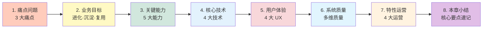

**8 节内容速览：**

| 节 | 主题 | 核心要点 |
|---|------|----------|
| 1. 痛点问题 | 3 大痛点 | 知识沉淀难、模型迭代慢、效果难评估 |
| 2. 业务目标 | 进化·沉淀·复用 | 4 量化指标 + 3 分层目标 |
| 3. 关键能力 | 5 大能力 | 采集/验证/更新/迭代/评估 |
| 4. 核心技术 | 4 大技术 | 抽取/验证/更新/评估 |
| 5. 用户体验 | 4 大 UX | 展示/反馈/教育/共享 |
| 6. 系统质量 | 多维质量 | 性能/准确性/可用性/保障 |
| 7. 特性运营 | 4 大运营 | 指标/迭代/教育/价值 |
| 8. 本章小结 | 速记 | 核心要点 + 关键指标 + 学习路径 + 全书总结 |

**4 条阅读路径：**

| 读者 | 路径 | 时长 |
|------|------|------|
| **业务决策者** | 1 → 2 → 8 | 10 分钟 |
| **架构师** | 1 → 2 → 3 → 4 → 8 | 30 分钟 |
| **SRE 工程师** | 1 → 3 → 5 → 6 → 8 | 30 分钟 |
| **算法工程师** | 1 → 3 → 4 → 6 → 8 | 30 分钟 |

---

## 1. 痛点问题

> **核心定位** — 知识进化是 AIOps 系统的持续学习引擎。如果把智能运维系统比作一个学习者，痛点问题揭示了这个学习者在"输入-处理-输出"全流程中面临的四大困境：知识采集不完整、知识内容陈旧、知识共享不畅通、知识应用不及时。
>
> **核心观点** — 没有高质量的知识输入，就没有高水平的智能输出。痛点问题的本质是：系统无法从运维实践中持续、高效、准确地学习。

---

### 1.0 痛点总览

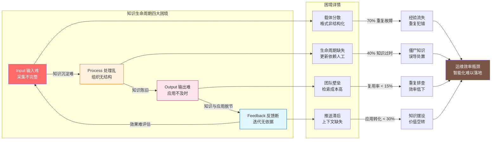


**四大困境概览：**

| 困境 | 核心表现 | 量化影响 | 优先级 |
|------|----------|----------|--------|
| **输入难** | 知识采集不完整、经验难以系统化沉淀 | 70% 重复故障源于知识缺失 | P0 |
| **处理乱** | 知识无生命周期管理、内容逐渐陈旧失效 | 40% 知识一年内过时 | P0 |
| **输出难** | 知识与告警上下文脱节、无法快速应用 | 应用转化率 < 30% | P0 |
| **反馈断** | 模型迭代无依据、效果无法量化评估 | 误报率居高不下 | P1 |

---

### 1.1 知识沉淀难：经验难以系统化

#### 现状描述

传统运维模式中，大量的运维知识散落在个人经验、聊天记录和文档中，缺乏系统化的沉淀机制。每一次故障修复后，宝贵的根因分析和处置经验往往随着时间流逝而丢失——团队成员在 Slack 中热烈讨论的解决方案，没有被结构化地记录到知识库中。

#### 根因分析

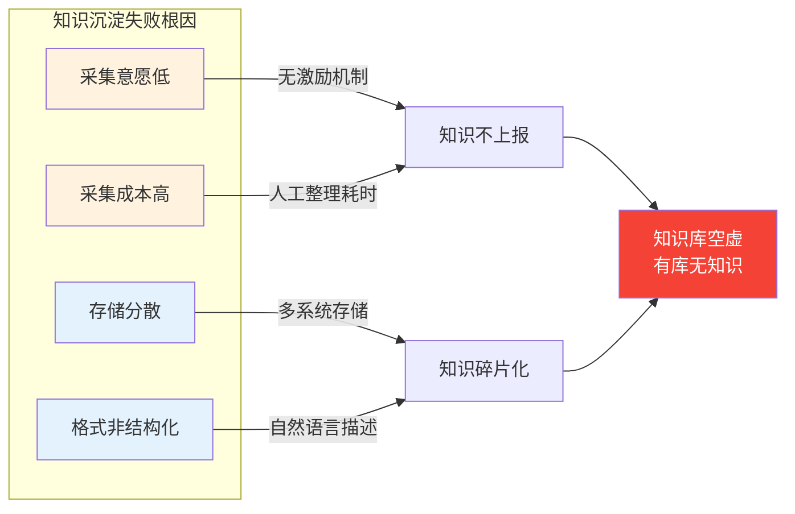

| 根因类型 | 具体表现 | 痛点程度 |
|----------|----------|----------|
| **意愿问题** | 故障处置优先，知识沉淀是"额外负担" | P0 |
| **能力问题** | 缺乏统一知识模型，口头经验难结构化 | P0 |
| **工具问题** | 知识分散在文档、聊天记录、邮件中 | P1 |
| **流程问题** | 故障修复后无强制沉淀节点 | P2 |


#### 量化影响

| 影响维度 | 量化指标 | 当前基线 | 严重程度 |
|----------|----------|----------|----------|
| **故障复发** | 重复故障比例 | 70% | 🔴 极高 |
| **知识流失** | 单次故障知识沉淀率 | < 30% | 🔴 极高 |
| **检索失效** | 知识库检索成功率 | < 20% | 🟠 高 |
| **人员依赖** | 专家知识占比 | > 60% | 🟠 高 |

**数据支撑：**
- 约 **70%** 的重复故障源于历史知识的缺失
- 知识利用率 < **20%**（知识库存在但检索不到）
- 单次故障平均产生 **3-5 条**有价值的知识，但沉淀率 < **30%**
- 人员流动导致的知识流失比例 > **40%**

#### 业务后果


| 后果类型 | 具体表现 | 量化损失 |
|----------|----------|----------|
| **直接损失** | 重复故障导致重复修复，耗时累加 | 单次浪费 30-60min |
| **间接损失** | 团队士气受损，专家疲劳 | 人员流失风险↑ |
| **机会损失** | 团队忙于救火，无法主动优化 | 系统优化停滞 |

#### 典型场景

> **场景：三个月前的"已知问题"再次爆发**
>
> 某核心服务故障，P2 级别告警触发后，SRE 团队花了 **45 分钟**定位到根因是数据库连接池泄漏。团队成员在 Slack 中讨论了解决方案，并记录在 Wiki 中。
>
> 但三个月后，同样的根因导致另一次故障，团队花了 **30 分钟**才再次定位——因为 Wiki 中的记录没有被系统化关联到告警上下文。
>
> **根因：** 知识没有被结构化地录入知识库，且知识与告警上下文没有关联。
>
> **代价：** 两次故障累计浪费 **75 分钟**，中间件业务中断累计 **10+ 分钟**。


---

### 1.2 知识陈旧：经验逐渐失效


#### 现状描述

业务系统持续迭代变更，昔日的最佳实践可能已不适用于当前架构。传统知识管理缺乏更新机制，旧知识逐渐成为"僵尸知识"——看似存在但实际无法使用。更危险的是，过时的知识可能误导故障处置，导致二次故障。


#### 根因分析


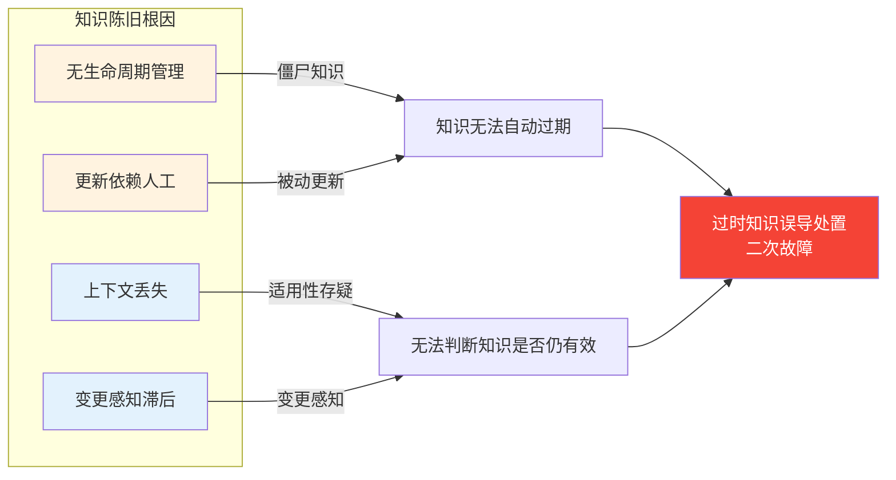


| 根因类型 | 具体表现 | 痛点程度 |
|----------|----------|----------|
| **机制缺失** | 知识无过期机制，无法自动标记陈旧 | P0 |
| **感知滞后** | 业务变更后知识不会自动感知更新 | P0 |
| **上下文丢失** | 知识产生时的环境/版本信息缺失 | P1 |
| **验证困难** | 无法判断知识是否仍适用于当前场景 | P1 |


#### 量化影响

| 影响维度 | 量化指标 | 当前基线 | 严重程度 |
|----------|----------|----------|----------|
| **知识老化** | 一年内过时知识比例 | 40% | 🔴 极高 |
| **更新周期** | 平均知识更新周期 | > 18 个月 | 🔴 极高 |
| **误导风险** | 过时知识导致二次故障比例 | > 15% | 🟠 高 |
| **可用率** | 知识库中可用知识比例 | < 60% | 🟠 高 |

**数据支撑：**
- 约 **40%** 的运维知识在一年内就会过时
- 平均知识更新周期超过 **18 个月**
- 过时知识导致二次故障的比例 > **15%**
- 知识平均年龄超过 **90 天**

#### 业务后果

```mermaid
flowchart LR
    A[知识陈旧] --> B[僵尸知识累积]
    B --> C[处置方案失效]
    C --> D[二次故障]
    D --> E[业务中断]<br/>信任受损
    
    style A fill:#ff6b6b,color:#fff
    style B fill:#ff9800,color:#fff
    style C fill:#ff5722,color:#fff
    style D fill:#f44336,color:#fff
    style E fill:#b71c1c,color:#fff
```


| 后果类型 | 具体表现 | 量化损失 |
|----------|----------|----------|
| **直接损失** | 过时方案导致二次故障，需额外修复 | 单次浪费 15-30min |
| **信任损失** | 运维人员对知识库失去信任，不再使用 | 知识利用率↓50% |
| **决策风险** | 基于过时知识做决策，可能加剧故障 | 故障扩大风险↑ |

#### 典型场景

> **场景：JVM OOM 的"最佳实践"成了最佳陷阱**
>
> 2024 年，团队沉淀了一条最佳实践："重启 JVM 解决 OOM"。该知识获得了高评分，被推荐给所有新入职的运维人员。
>
> 但 2026 年，新版本的 JVM 已修复该 OOM bug。某次故障中，运维人员根据"最佳实践"执行了不必要的重启，导致：
> 1. 业务中断 **5 分钟**
> 2. 资深工程师花 **20 分钟**排查为什么重启后问题依然存在
> 3. 团队对知识库的信任度大幅下降
>
> **根因：** 知识库缺乏生命周期管理，过时知识未被标记或废弃。
>
> **代价：** 业务中断 + 团队信任受损 + 知识库使用率下降。


---

### 1.3 知识孤岛：跨团队无法共享


#### 现状描述

不同运维团队各自积累的经验难以共享和复用。当一个团队解决了某个技术难题，其他团队可能在不知情的情况下重复投入精力。知识分散在个人、团队和系统各处，缺乏统一的组织与管理机制。

#### 根因分析

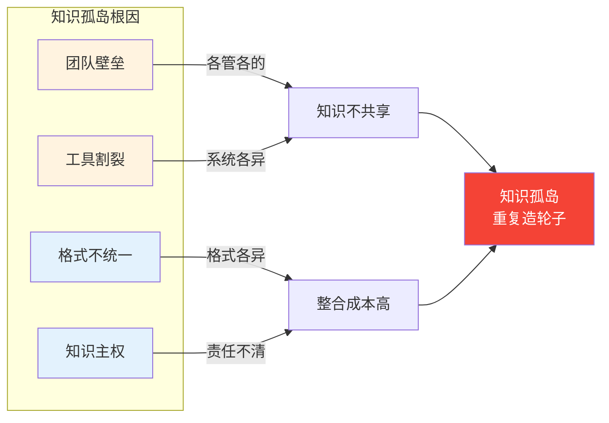


| 根因类型 | 具体表现 | 痛点程度 |
|----------|----------|----------|
| **组织壁垒** | 各团队知识独立管理，缺乏统一共享机制 | P0 |
| **工具割裂** | 不同团队使用不同的知识管理工具 | P0 |
| **格式不统一** | 各团队知识格式不同，难以统一整合 | P1 |
| **激励缺失** | 共享知识无收益，私有知识无代价 | P2 |


#### 量化影响

| 影响维度 | 量化指标 | 当前基线 | 严重程度 |
|----------|----------|----------|----------|
| **共享率** | 跨团队知识复用率 | < 15% | 🔴 极高 |
| **重复排查** | 重复排查同一问题比例 | > 25% | 🟠 高 |
| **搜索成本** | 知识搜索平均耗时 | 20+ 分钟 | 🟠 高 |
| **协作效率** | 跨团队协作知识传递耗时 | > 2 小时 | 🟠 高 |


**数据支撑：**
- 跨团队知识复用率 < **15%**
- 重复排查同一问题的比例 > **25%**
- 知识搜索平均耗时 **20+ 分钟**
- 约 **30%** 的故障在处理过程中才发现已有相关知识

#### 业务后果

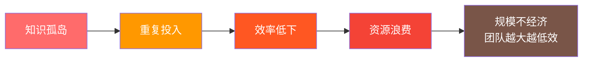

| 后果类型 | 具体表现 | 量化损失 |
|----------|----------|----------|
| **人力浪费** | 重复排查同一问题 | 单次浪费 1-2 小时 |
| **机会成本** | 团队忙于重复工作，无法创新 | 创新产出↓ |
| **规模反效果** | 团队规模增长但效率不增长 | 边际效益 < 0 |

#### 典型场景

> **场景：支付团队的"已知问题"被交易团队重复排查**
>
> 支付团队遇到了"订单支付失败"的故障，经过 2 小时排查，发现是支付网关超时配置问题。解决方案沉淀在支付团队的内部 Wiki 中，标记为"已解决"。
>
> 两周后，交易团队遇到类似的"订单支付失败"问题。不知道支付团队已有现成解决方案，交易团队花了 **2 小时**重复排查。
>
> 最终发现解决方案已在支付团队的 Wiki 中，但：
> 1. 交易团队不知道支付团队有这个知识
> 2. 两个团队的 Wiki 系统不同，无法跨库搜索
> 3. 即使知道，格式也不同，需要重新整理
>
> **根因：** 知识孤岛导致跨团队知识无法被发现和复用。
>
> **代价：** 交易团队重复投入 2 小时，支付团队的知识价值未被释放。


---

### 1.4 知识与应用脱节


#### 现状描述

即使知识库中存在相关信息，运维人员在故障处置时也难以快速检索和应用。知识与告警上下文没有关联，搜索知识需要切换系统、重新组织关键词。知识和执行之间存在巨大鸿沟：知道该怎么做，却无法在需要的时刻快速获取。


#### 根因分析

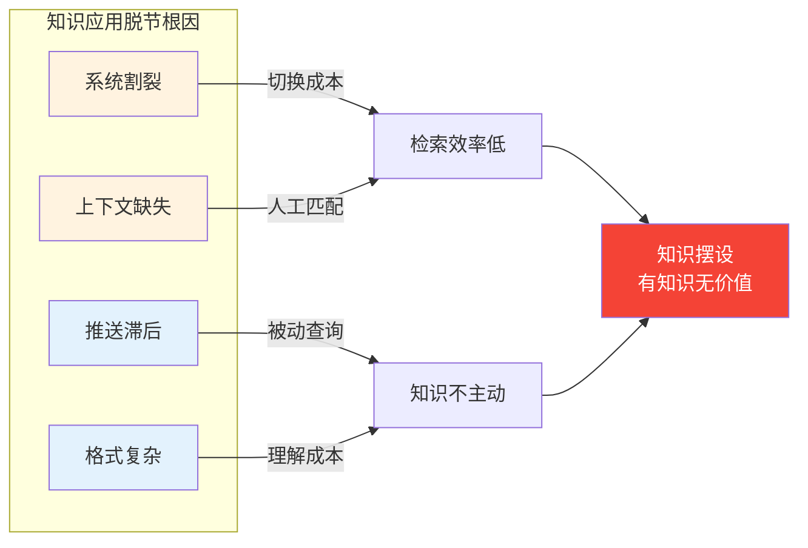


| 根因类型 | 具体表现 | 痛点程度 |
|----------|----------|----------|
| **系统割裂** | 需要切换系统、重新组织关键词才能检索知识 | P0 |
| **上下文缺失** | 知识与当前告警上下文没有关联，需要人工匹配 | P0 |
| **推送滞后** | 知识不会主动推送到故障处置流程 | P1 |
| **格式复杂** | 知识表达复杂，短时间内难以理解应用 | P1 |


#### 量化影响

| 影响维度 | 量化指标 | 当前基线 | 严重程度 |
|----------|----------|----------|----------|
| **应用耗时** | 知识检索到应用平均耗时 | 15+ 分钟 | 🔴 极高 |
| **转化率** | 知识到执行的应用转化率 | < 30% | 🟠 高 |
| **满意度** | 运维人员对知识库满意度 | < 40% | 🟠 高 |
| **时效损失** | 故障处置窗口内知识获取成功率 | < 50% | 🟠 高 |

**数据支撑：**
- 知识检索到应用平均耗时 **15+ 分钟**
- 知识到执行的应用转化率 < **30%**
- 运维人员对知识库满意度 < **40%**
- 故障处置窗口（通常 5 分钟）内知识获取成功率 < **50%**


#### 业务后果

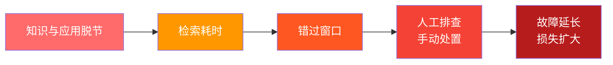

| 后果类型 | 具体表现 | 量化损失 |
|----------|----------|----------|
| **时效损失** | 故障处置窗口内无法应用知识 | MTTR 增加 10+ 分钟 |
| **效率损失** | 需要人工在多个系统间切换 | 处置效率↓ |
| **价值损失** | 知识库投入无法转化为运维效率 | ROI < 0 |

#### 典型场景

> **场景："我知道有知识，但来不及用"**
>
> 告警"DB 响应超时"触发，值班运维人员知道知识库中有相关解决方案。但实际操作流程是：
>
> 1. **切换系统**：打开知识库网站 → 登录 → 搜索"数据库超时"
> 2. **筛选结果**：浏览 10+ 条相关知识，判断适用性
> 3. **理解内容**：每条知识平均阅读 2 分钟
> 4. **应用知识**：选择最相关的方案执行
>
> 整个过程耗时 **15+ 分钟**，而故障处置窗口往往只有 **5 分钟**。
>
> 最终，运维人员选择凭经验快速处理，知识库被"束之高阁"。
>
> **根因：** 知识与告警上下文没有关联，知识不会主动推送，检索和应用成本过高。
>
> **代价：** 知识库投入无法转化为运维效率，知识沦为摆设。


---

### 1.5 痛点关联与影响链

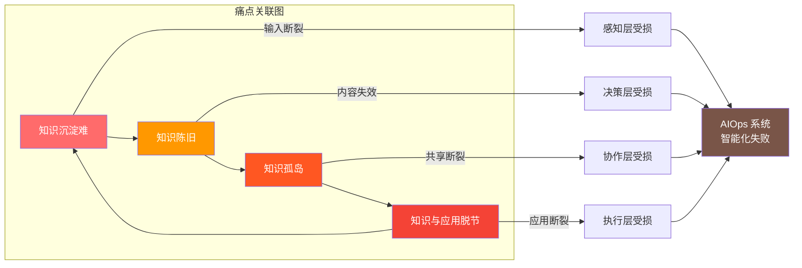


**痛点影响链总结：**

| 起点痛点 | 连锁影响 | 最终后果 |
|----------|----------|----------|
| 知识沉淀难 | → 知识陈旧 → 知识孤岛 → 知识与应用脱节 | 智能化基础缺失 |
| 知识陈旧 | → 误导处置 → 信任丧失 → 知识无人用 | 僵尸知识累积 |
| 知识孤岛 | → 重复投入 → 效率低下 → 规模不经济 | 协作价值归零 |
| 知识与应用脱节 | → 错过窗口 → 人工排查 → 故障延长 | MTTR 居高不下 |

**与上下游的关联：**

| 痛点 | 影响上游 | 影响下游 |
|------|----------|----------|
| 知识沉淀难 | 10 自动执行的数据无法转化为知识 | 05 认知网络知识图谱空虚 |
| 知识陈旧 | 07 根因分析的规则过时 | 09 智能决策的方案失效 |
| 知识孤岛 | 各团队独立维护，数据割裂 | 跨团队协作成本高 |
| 知识与应用脱节 | 04 智能感知的反馈无法落地 | 告警处置效率低下 |


---

## 2. 业务目标

### 2.0 业务目标总览

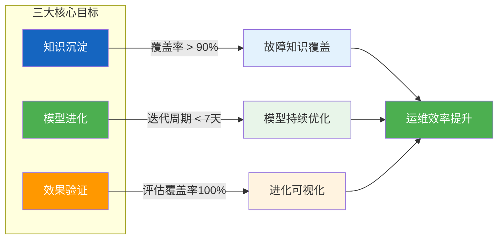

### 2.1 量化指标体系

| 目标维度 | 量化指标 | 当前基线 | 目标值 | 提升幅度 |
|----------|----------|----------|---------|----------|
| **知识采集** | 故障事件知识提取率 | 30% | ≥ 95% | +65% |
| **知识验证** | 知识人工确认通过率 | 60% | > 90% | +30% |
| **知识更新** | 知识从产生到入库时间 | > 72h | < 24h | 3x ↑ |
| **模型迭代** | 模型更新周期 | > 30天 | 每周 | 4x ↑ |
| **进化评估** | 进化指标覆盖度 | 50% | 100% | +50% |
| **知识复用** | 知识复用率 |< 20% | > 60% | 3x ↑ |

### 2.2 与上下游的协作目标

**上下游架构关系：**

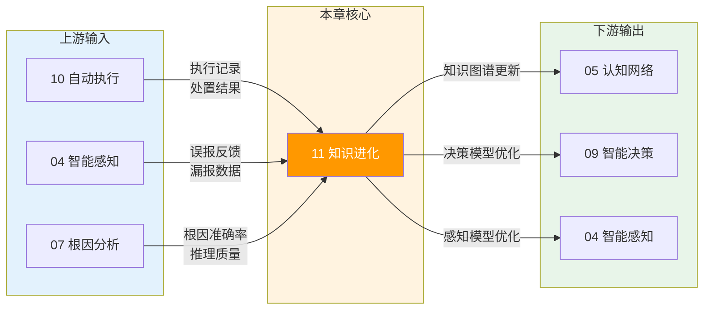

**上游协同（10 自动执行）：**

| 协同内容 | 数据类型 | 频率 | 价值 |
|----------|----------|------|------|
| 执行记录 | 剧本执行步骤、结果、时间戳 | 每次执行 | 知识提取原料 |
| 处置反馈 | 方案采纳率、执行效果评分 | 每日 | 模型优化依据 |
| 失败案例 | 回滚原因、执行异常 | 每次失败 | 知识验证样本 |

**下游协同（05 认知网络 / 04 智能感知）：**

| 协同内容 | 输出目标 | 更新方式 | 价值 |
|----------|----------|----------|------|
| 知识图谱 | 认知网络 | 增量更新 | 推理能力提升 |
| 模型参数 | 智能感知 | 热更新 | 检测准确率提升 |
| 根因规则 | 根因分析 | 规则刷新 | 分析准确率提升 |

### 2.3 执行模式分类

根据知识进化场景和风险等级，提供三种执行模式：

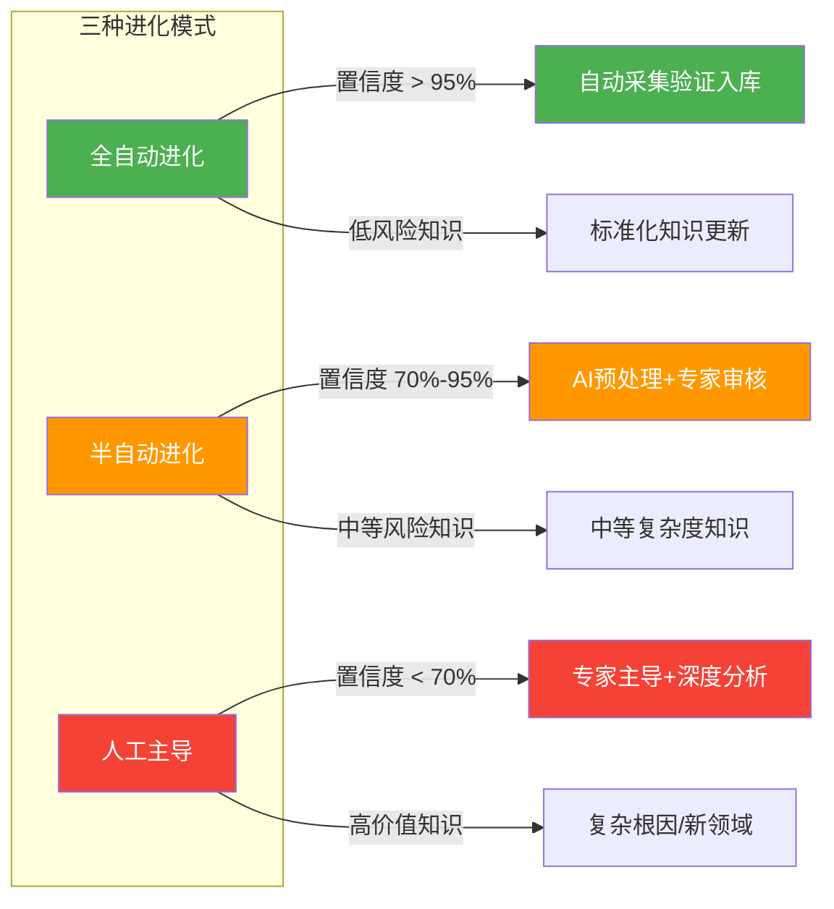

| 模式 | 触发条件 | 人工介入 | 适用场景 | 占比目标 |
|------|----------|----------|----------|----------|
| **全自动进化** | 置信度 > 95%，低风险 | 无需介入 | 标准化告警处置、已知故障模式 | 60% |
| **半自动进化** | 置信度 70%-95% | AI 预处理+专家审核 | 中等复杂度知识、新场景 | 30% |
| **人工主导** | 置信度 < 70% | 专家深度分析 | 复杂根因分析、新领域知识 | 10% |

---

## 3. 关键能力

> **核心定位** — 知识进化是 AIOps 系统的"学习引擎"，而关键能力就是这个引擎的五大核心部件。如果说痛点问题揭示了系统"不能"做什么，那么关键能力就是明确系统"能"做什么以及"如何做到"。
>
> **核心观点** — 知识进化不是单一功能，而是一个从采集→验证→更新→迭代→评估的闭环能力体系。任何一个能力的缺失都会导致整个进化链条断裂。

---

### 3.0 能力总览

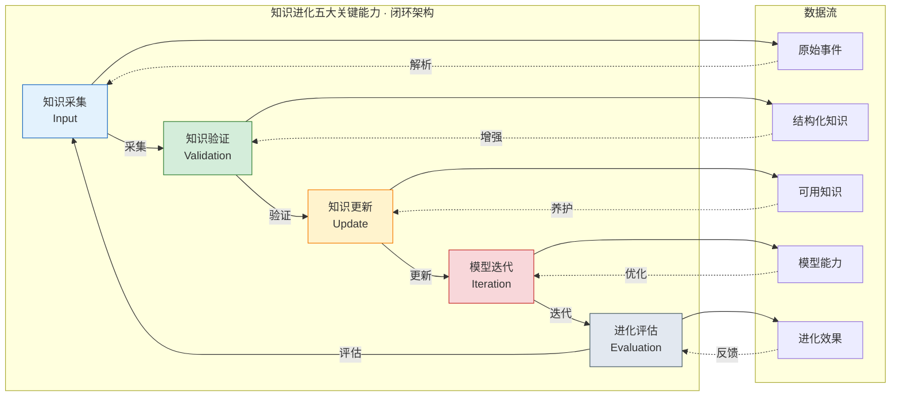

**五大能力速览：**

| 能力 | 核心职责 | 输入 | 输出 | 优先级 |
|------|----------|------|------|--------|
| **知识采集** | 从运维实践中提取结构化知识 | 故障事件、告警、操作日志 | 原始知识条目 | P0 |
| **知识验证** | 确保知识正确性、一致性、可用性 | 原始知识 | 已验证知识 | P0 |
| **知识更新** | 管理知识生命周期（新增/修正/废弃） | 已验证知识 | 活跃知识库 | P0 |
| **模型迭代** | 基于反馈持续优化 AI 模型性能 | 应用反馈 | 迭代后模型 | P1 |
| **进化评估** | 量化进化效果、指导优化方向 | 各层输出 | 评估报告 | P2 |

#### 能力成熟度模型

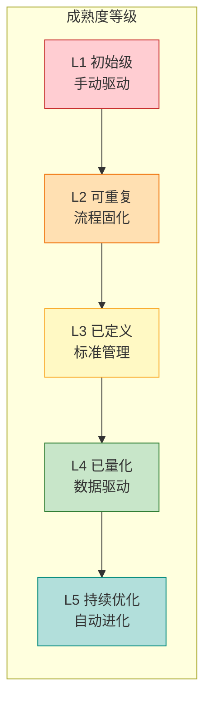

| 能力 | L1 初始级 | L2 可重复 | L3 已定义 | L4 已量化 | L5 持续优化 |
|------|-----------|-----------|-----------|-----------|-------------|
| **知识采集** | 手动记录 | 触发采集 | 标准化流程 | 自动采集率 > 80% | 自动学习新来源 |
| **知识验证** | 人工审核 | 规则校验 | 多维度验证 | AI辅助审核 | 全自动验证 |
| **知识更新** | 手动更新 | 定时更新 | 版本管理 | 增量更新 | 智能更新 |
| **模型迭代** | 按需迭代 | 周期性迭代 | 反馈驱动迭代 | 实时迭代 | 预测性迭代 |
| **进化评估** | 无评估 | 月度报告 | 周度报告 | 日度监控 | 实时告警 |

#### 能力优先级矩阵

| 能力 | 业务价值 | 技术可行 | 实施成本 | 综合优先级 |
|------|----------|----------|----------|------------|
| **知识采集** | 🔴 极高 | 🟢 高 | 🟡 中 | P0 |
| **知识验证** | 🔴 极高 | 🟢 高 | 🟡 中 | P0 |
| **知识更新** | 🔴 极高 | 🟢 高 | 🟠 低 | P0 |
| **模型迭代** | 🟠 高 | 🟡 中 | 🟠 低 | P1 |
| **进化评估** | 🟡 中 | 🟢 高 | 🟢 低 | P2 |

---

### 3.1 知识采集：从实践中提取知识

#### 能力定义

**知识采集**是将散落在运维实践中的碎片化经验转化为结构化知识的第一步。其核心任务是：从故障事件、告警处理、运维操作、执行反馈等多源数据中，自动或半自动地提取有价值的知识条目。

#### 能力分解

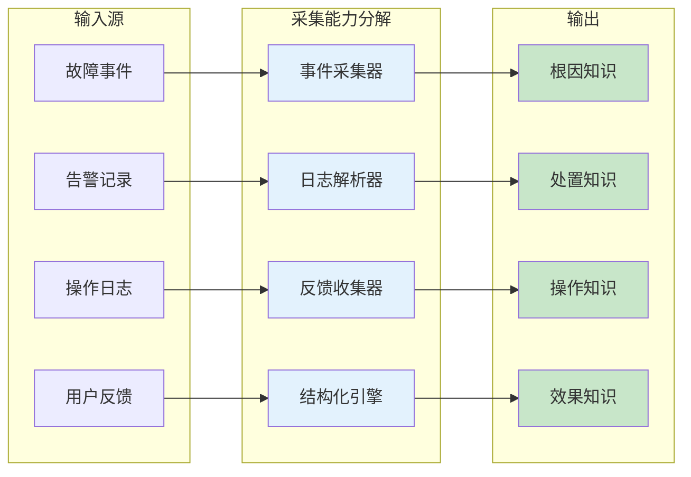

#### 采集内容与方式

| 来源类型 | 采集内容 | 采集方式 | 知识产出 | 采集难度 |
|----------|----------|----------|----------|----------|
| **故障事件** | 故障现象、根因、处置过程 | 事件结构化解析 | 根因知识 | 🟡 中 |
| **告警处理** | 告警上下文、处置步骤、结果 | 操作日志分析 | 处置知识 | 🟢 低 |
| **运维操作** | 操作命令、环境、结果 | 执行记录解析 | 操作知识 | 🟡 中 |
| **执行反馈** | 方案采纳率、执行效果 | 用户反馈分析 | 效果知识 | 🟠 高 |

#### 采集触发机制

| 触发类型 | 触发条件 | 采集优先级 | 响应时效 | 典型场景 |
|----------|----------|------------|----------|----------|
| **事件触发** | P0/P1 故障修复完成后 | 高 | < 1h | 核心服务宕机 |
| **定时触发** | 每日汇总低优先级事件 | 中 | < 24h | 日常告警累积 |
| **手动触发** | 用户标记重要案例 | 按需 | < 4h | 重大事件复盘 |
| **周期触发** | 每周回溯历史处置案例 | 低 | < 7d | 知识盲区发现 |

#### 量化指标

| 指标 | 描述 | 当前基线 | 目标值 | 严重程度 |
|------|------|----------|--------|----------|
| **采集覆盖率** | 故障事件中被采集的比例 | 60% | > 90% | 🔴 |
| **采集自动化率** | 无需人工介入的采集比例 | 40% | > 80% | 🟠 |
| **知识产出量** | 单次故障平均产出知识条数 | 2-3 条 | 3-5 条 | 🟡 |
| **采集延迟** | 从事件发生到知识产出的时间 | > 4h | < 1h | 🟠 |

#### 能力失效模式

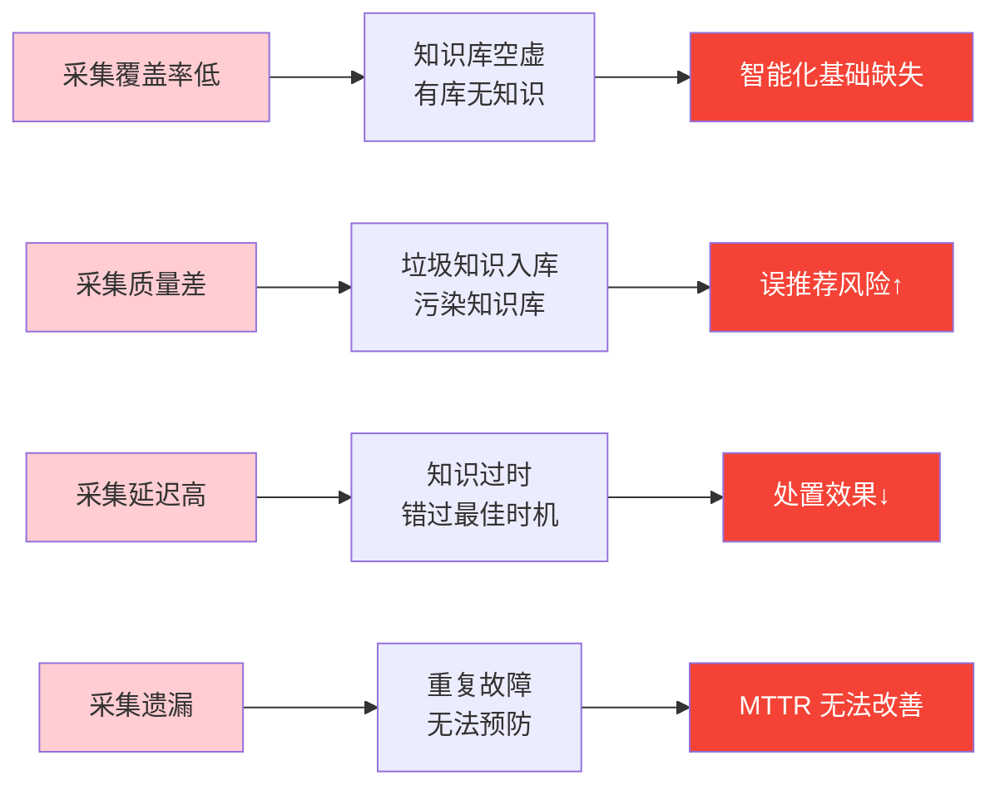

| 失效模式 | 触发条件 | 影响后果 | 严重程度 | 应对策略 |
|----------|----------|----------|----------|----------|
| **采集覆盖率低** | 采集率 < 50% | 知识库空虚，无法支撑智能 | 🔴 极高 | 优先采集 P0/P1 事件 |
| **采集质量差** | 准确率 < 80% | 垃圾知识入库，误导决策 | 🔴 极高 | 加强验证环节 |
| **采集延迟高** | 延迟 > 24h | 知识过时，错失处置窗口 | 🟠 高 | 优化采集流程 |
| **采集遗漏** | 遗漏率 > 20% | 重复故障频发 |🟠 高 |补采历史数据 |

#### 典型场景

> **场景：P2 故障后的自动知识采集**
>
> 监控系统检测到订单支付服务响应超时（P2），触发告警。值班 SRE 团队花费 **40 分钟**定位到根因：Redis 连接池配置过小导致连接耗尽。团队在 Slack 中讨论并解决了问题。
>
> 故障修复后，知识采集系统自动触发：
> 1. **事件解析**：从告警系统提取故障时间、影响范围、持续时间
> 2. **日志解析**：从 ChatOps 提取讨论中的根因和处置步骤
> 3. **知识结构化**：自动生成结构化知识条目
>
> **结果**：故障修复后 **30 分钟**内，知识库新增一条"Redis 连接池耗尽"的根因知识和一条"连接池扩容"的处置知识。
>
> **价值**：下次同类告警触发时，系统可直接推荐相关知识，无需人工排查。

---

### 3.2 知识验证：确保知识质量

#### 能力定义

**知识验证**是知识进入知识库前的质量把关环节。其核心任务是：从准确性、完整性、一致性、时效性、可用性五个维度对知识进行验证，确保只有"好知识"才能进入知识库。

#### 能力分解

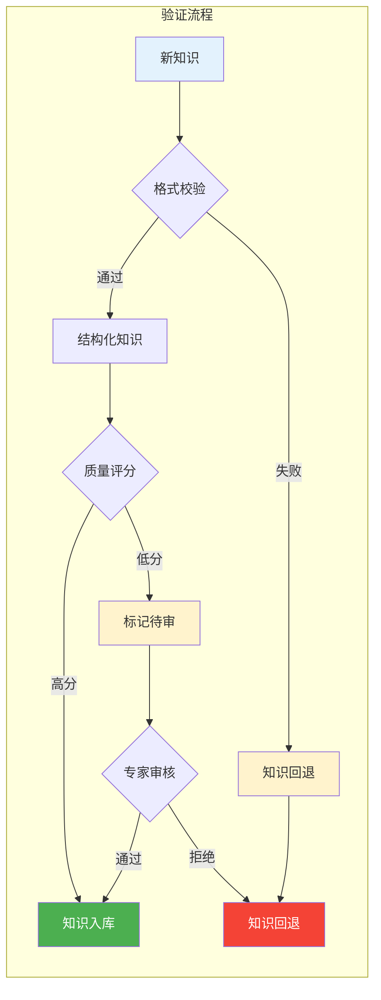

#### 验证维度详解

| 验证维度 | 检查内容 | 判定标准 | 通过率目标 | 验证方式 |
|----------|----------|----------|------------|----------|
| **完整性** | 知识字段是否齐全 | 必填字段 100% 填充 | > 99% | 自动检查 |
| **准确性** | 知识内容是否正确 | 与事实一致 | > 95% | 专家审核 |
| **一致性** | 知识是否与现有知识冲突 | 无冲突或冲突已解决 | > 99% | 图谱检测 |
| **时效性** | 知识是否仍然适用 | 上下文未发生重大变更 | > 90% | 版本校验 |
| **可用性** | 知识是否可被系统使用 | 格式可解析、结构化 | > 98% | 自动解析 |

#### 量化指标

| 指标 | 描述 | 当前基线 | 目标值 | 严重程度 |
|------|------|----------|--------|----------|
| **验证通过率** | 通过验证的知识比例 | 75% | > 85% | 🟠 |
| **专家审核率** | 需要人工审核的知识比例 | 30% | < 10% | 🟠 |
| **验证准确性** | 通过验证的知识实际正确率 | 90% | > 98% | 🔴 |
| **验证效率** | 单条知识平均验证时间 | > 10min | < 1min | 🟠 |

#### 能力失效模式

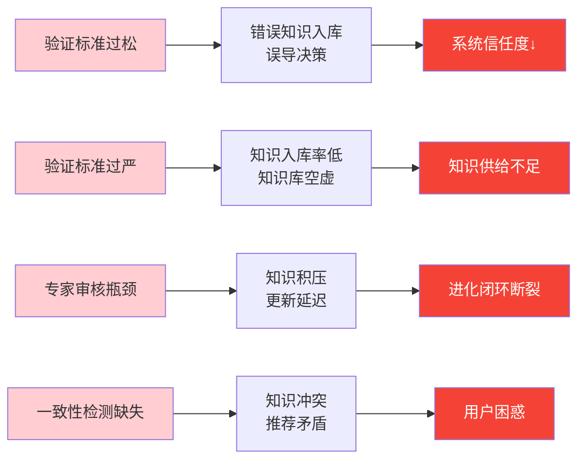

| 失效模式 | 触发条件 | 影响后果 | 严重程度 | 应对策略 |
|----------|----------|----------|----------|----------|
| **验证标准过松** | 准确率 < 90% | 错误知识入库，误导决策 | 🔴 极高 | 定期校准验证标准 |
| **验证标准过严** | 通过率 < 60% | 知识入库率低，知识库空虚 | 🟠 高 | 分级验证，渐进标准 |
| **专家审核瓶颈** | 审核等待 > 4h | 知识积压，更新延迟 | 🟠 高 | 优化审核流程 |
| **一致性检测缺失** | 冲突漏检率 > 5% | 知识冲突，推荐矛盾 | 🟡 中 | 图谱一致性检测 |

#### 典型场景

> **场景：重复知识的一致性检测**
>
> 知识采集系统新增一条知识："数据库 CPU 飙高时，执行 `db.reboot()` 重启数据库"。
>
> 知识验证系统在入库前检测发现：
> 1. **一致性冲突**：现有知识库中已有"数据库重启应先尝试 `db.shutdown()` graceful关机"规则
> 2. **危险性标记**：新知识缺少前置条件（如先尝试 altalive 检查）
>
> **处理流程**：
> 1. 系统标记该知识为"待审"，推送给 DBA 专家审核
> 2. 专家判定：新知识过于简单，缺少关键上下文
> 3. 知识被回退，要求补充完整操作流程
>
> **结果**：危险知识被拦截，避免了可能的误操作。

---

### 3.3 知识更新：管理知识生命周期

#### 能力定义

**知识更新**是知识库的"养护机制"，负责管理知识的完整生命周期——从新增到废弃，确保知识库始终保持"健康、活跃、不过时"的状态。

#### 能力分解

```mermaid
flowchart LR
    subgraph 知识生命周期
        direction TB
        N[新增] --> S[补充]
        S --> M[修正]
        M --> D[废弃]
        D --> A[归档]
    end
    
    subgraph 更新类型
        direction LR
        T1[新增<br/>全新知识条目] 
        T2[补充<br/>丰富现有知识]
        T3[修正<br/>修订错误知识]
        T4[废弃<br/>标记过时知识]
    end
    
    N --> T1
    S --> T2
    M --> T3
    D --> T4
    
    T1 -->|传播| OUT1[知识图谱更新]
    T2 -->|传播| OUT2[知识图谱更新]
    T3 -->|传播| OUT3[知识图谱更新]
    T4 -->|传播| OUT4[下游通知]
    
    style N fill:#e3f2fd
    style S fill:#c8e6c9
    style M fill:#fff3cd
    style D fill:#ffcdd2
    style A fill:#e2e8f0
```

#### 更新类型详解

| 更新类型 | 说明 | 触发场景 | 影响范围 | 更新延迟 |
|----------|------|----------|----------|----------|
| **新增** | 全新的知识条目 | 新故障模式、新解决方案 | 知识库 + 图谱 | < 1h |
| **补充** | 丰富现有知识 | 新症状、新处置步骤 | 相关知识条目 | < 4h |
| **修正** | 修订错误知识 | 根因分析错误、方案失效 | 受影响知识 | < 24h |
| **废弃** | 标记过时知识 | 技术栈变更、架构升级 | 下游引用 + 通知 | < 24h |

#### 传播机制

| 传播路径 | 传播内容 | 传播方式 | 更新延迟 | 依赖方 |
|----------|----------|----------|----------|--------|
| **知识图谱** | 实体、关系、属性更新 | 图谱增量更新 | < 1h | 05 认知网络 |
| **异常检测模型** | 异常模式库更新 | 模型热更新 | < 24h | 04 智能感知 |
| **根因分析模型** | 根因推理规则更新 | 规则引擎刷新 | < 24h | 07 根因分析 |
| **决策推荐模型** | 方案推荐权重更新 | 在线学习更新 | < 12h | 09 智能决策 |

#### 量化指标

| 指标 | 描述 | 当前基线 | 目标值 | 严重程度 |
|------|------|----------|--------|----------|
| **知识活跃率** | 一年内更新的知识比例 | 35% | > 60% | 🔴 |
| **僵尸知识率** | 超过一年未更新的知识比例 | 40% | < 15% | 🔴 |
| **更新及时率** | 在有效期内完成更新的比例 | 50% | > 90% | 🟠 |
| **传播成功率** | 成功传播到下游的比例 | 80% | > 99% | 🟠 |

#### 能力失效模式

```mermaid
flowchart LR
    F1[僵尸知识累积] --> C1[过时知识误导<br/>二次故障]
    F2[更新遗漏] --> C2[知识碎片化<br/>检索失效]
    F3[传播失败] --> C3[模型与知识<br/>不一致]
    F4[版本冲突] --> C4[推荐逻辑<br/>混乱]
    
    C1 --> E1[故障扩大风险↑]
    C2 --> E2[知识价值归零]
    C3 --> E3[智能决策失效]
    C4 --> E4[用户体验↓]
    
    style F1 fill:#ffcdd2
    style F2 fill:#ffcdd2
    style F3 fill:#ffcdd2
    style F4 fill:#ffcdd2
    style E1 fill:#f44336,color:#fff
    style E2 fill:#f44336,color:#fff
    style E3 fill:#f44336,color:#fff
    style E4 fill:#f44336,color:#fff
```

| 失效模式 | 触发条件 | 影响后果 | 严重程度 | 应对策略 |
|----------|----------|----------|----------|----------|
| **僵尸知识累积** | 僵尸知识率 > 30% | 过时知识误导，二次故障 | 🔴 极高 | 自动标记过期知识 |
| **更新遗漏** | 更新遗漏率 > 10% | 知识碎片化，检索失效 | 🟠 高 | 变更触发自动更新 |
| **传播失败** | 传播成功率 < 95% | 模型与知识不一致 | 🟠 高 | 传播重试机制 |
| **版本冲突** | 冲突率 > 5% | 推荐逻辑混乱 | 🟡 中 | 版本锁定机制 |

#### 典型场景

> **场景：架构升级导致的知识废弃传播**
>
> 团队完成从 MySQL 5.7 到 MySQL 8.0 的升级。新版本废弃了 `SELECT HIGH_PRIORITY` 语法，原有知识库中包含该语法的知识需要被标记为废弃。
>
> **处理流程**：
> 1. **变更感知**：系统从配置管理数据库（CMDB）检测到 MySQL 版本变更
> 2. **知识检索**：自动检索所有与 MySQL 5.7 相关的知识条目（共 23 条）
> 3. **影响评估**：标记 8 条直接受影响知识，15 条可能受影响知识
> 4. **批量废弃**：8 条直接受影响知识被标记为"已废弃"，15 条进入待审核状态
> 5. **下游通知**：通知异常检测、根因分析、决策推荐模型进行相应更新
>
> **结果**：知识库在架构变更后 24 小时内完成全量更新，下游模型同步刷新。

---

### 3.4 模型迭代：持续优化 AI 能力

#### 能力定义

**模型迭代**是知识进化闭环中的"学习引擎"，负责基于实际应用反馈持续优化各类 AI 模型的性能。模型迭代确保从"知识"到"智能"的能力转化不断进化。

#### 能力分解

```mermaid
flowchart LR
    subgraph 模型迭代矩阵
        direction TB
        M1[异常检测模型] 
        M2[根因分析模型]
        M3[决策推荐模型]
        M4[执行验证模型]
    end
    
    subgraph 反馈来源
        F1[误报/漏报反馈] 
        F2[根因准确率反馈]
        F3[方案采纳率反馈]
        F4[执行结果反馈]
    end
    
    subgraph 优化方向
        O1[检测阈值<br/>特征权重] 
        O2[推理规则<br/>因果权重]
        O3[推荐排序<br/>方案评分]
        O4[验证规则<br/>阈值调整]
    end
    
    F1 --> M1 --> O1
    F2 --> M2 --> O2
    F3 --> M3 --> O3
    F4 --> M4 --> O4
    
    style M1 fill:#e3f2fd
    style M2 fill:#e8f5e9
    style M3 fill:#fff3e0
    style M4 fill:#fce4ec
```

#### 模型迭代矩阵

| 模型类型 | 输入反馈 | 优化方向 | 迭代周期 | 关键指标 | 当前基线 |
|----------|----------|----------|----------|----------|----------|
| **异常检测模型** | 误报/漏报反馈 | 检测阈值、特征权重 | 每周 | 召回率 > 95% | 85% |
| **根因分析模型** | 根因准确率反馈 | 推理规则、因果权重 | 每周 | 准确率 > 90% | 78% |
| **决策推荐模型** | 方案采纳率反馈 | 推荐排序、方案评分 | 每日 | 采纳率 > 60% | 45% |
| **执行验证模型** | 执行成功/失败反馈 | 验证规则、阈值调整 | 每日 | 通过率 > 95% | 88% |

#### 迭代策略

```mermaid
flowchart LR
    A[反馈数据] --> B{质量评估}
    B -->|高质量| C[增量学习]
    B -->|低质量| D[累积后处理]
    C --> E[模型更新]
    D --> C
    E --> F{指标验证}
    F -->|通过| G[模型上线]
    F -->|失败| H[回滚到上一版本]
    
    style A fill:#e3f2fd
    style G fill:#4caf50,color:#fff
    style H fill:#f44336,color:#fff
    style C fill:#c8e6c9
```

#### 量化指标

| 指标 | 描述 | 当前基线 | 目标值 | 严重程度 |
|------|------|----------|--------|----------|
| **模型准确率** | 各类模型平均准确率 | 75% | > 90% | 🔴 |
| **迭代周期** | 从反馈到上线平均耗时 | > 7d | < 3d | 🟠 |
| **采纳率** | 推荐方案被用户采纳比例 | 45% | > 65% | 🔴 |
| **误报率下降** | 相比上一版本的误报改善 | 基准 | > 20% | 🟡 |

#### 能力失效模式

```mermaid
flowchart LR
    F1[反馈数据不足] --> C1[模型无法学习<br/>性能停滞]
    F2[迭代周期过长] --> C2[模型过时<br/>效果衰减]
    F3[迭代质量失控] --> C3[模型退化<br/>指标下降]
    F4[回滚机制缺失] --> C4[故障扩散<br/>无法恢复]
    
    C1 --> E1[智能能力天花板]
    C2 --> E2[误报率居高不下]
    C3 --> E3[系统不可用]
    C4 --> E4[故障持续扩大]
    
    style F1 fill:#ffcdd2
    style F2 fill:#ffcdd2
    style F3 fill:#ffcdd2
    style F4 fill:#ffcdd2
    style E1 fill:#f44336,color:#fff
    style E2 fill:#f44336,color:#fff
    style E3 fill:#f44336,color:#fff
    style E4 fill:#f44336,color:#fff
```

| 失效模式 | 触发条件 | 影响后果 | 严重程度 | 应对策略 |
|----------|----------|----------|----------|----------|
| **反馈数据不足** | 有效反馈 < 100条/周 | 模型无法学习，性能停滞 | 🔴 极高 | 引导用户反馈 |
| **迭代周期过长** | 迭代周期 > 14d | 模型过时，效果衰减 | 🟠 高 | 自动化迭代流程 |
| **迭代质量失控** |准确率下降 > 10% | 模型退化，系统不可用 | 🔴 极高 |灰度发布 + 监控 |
| **回滚机制缺失** | 回滚失败率 > 5% | 故障扩散，无法恢复 | 🟠 高 | 自动回滚机制 |

#### 典型场景

> **场景：决策推荐模型的每日迭代**
>
> 决策推荐模型推荐了"重启 JVM"作为 Java 应用 OOM 的首选解决方案。SRE 工程师在实际处置中：
> 1. 采纳了推荐，执行了重启
> 2. 重启后问题依旧，最终发现是内存泄漏，需要修复代码
>
> **反馈闭环**：
> 1. 工程师在处置记录中标记"方案部分有效"
> 2. 系统记录该方案的长期效果（重启后 24h 内是否复发）
> 3. 模型学习到："重启 JVM"仅作为临时方案，应推荐"内存分析 + 代码修复"作为根本解决方案
>
> **迭代结果**：3 天后，同样场景的推荐顺序调整，"代码修复"方案被优先推荐。

---

### 3.5 进化评估：量化进化效果

#### 能力定义

**进化评估**是知识进化闭环的"仪表盘"，负责量化知识进化的效果，监控各能力指标的健康度，并为优化方向提供数据依据。

#### 评估指标体系

| 评估维度 | 指标名称 | 目标值 | 当前基线 | 测量方法 | 监控频率 |
|----------|----------|--------|----------|----------|----------|
| **知识覆盖** | 知识覆盖率 | > 90% | 65% | 故障模式知识覆盖比例 | 每周 |
| **知识质量** | 知识准确率 | > 95% | 88% | 知识应用效果验证 | 每月 |
| **模型性能** | 模型准确率 | > 90% | 75% | 预测结果验证 | 每日 |
| **进化效率** | 知识周转时间 | < 24h | > 72h | 知识从产生到应用 | 每日 |
| **业务价值** | MTTR 改善 | > 30% | 15% | 故障修复时间对比 | 每月 |

#### 评估闭环

```mermaid
flowchart LR
    subgraph 评估闭环
        A[数据采集] --> B[指标计算]
        B --> C[趋势分析]
        C --> D[异常告警]
        D --> E[优化建议]
        E --> A
    end
    
    subgraph 评估层次
        L1[能力层<br/>采集/验证/更新/迭代] 
        L2[模型层<br/>检测/分析/推荐/验证]
        L3[业务层<br/>MTTR/故障率/效率]
    end
    
    L1 --> L2 --> L3
    
    style A fill:#e3f2fd
    style B fill:#c8e6c9
    style C fill:#fff3cd
    style D fill:#ffcdd2
    style E fill:#e2e8f0
```

#### 量化指标

| 指标 | 描述 | 当前基线 | 目标值 | 严重程度 |
|------|------|----------|--------|----------|
| **知识周转时间** | 知识从产生到可用的时间 | > 72h | < 24h | 🔴 |
| **模型召回率** | 异常检测召回率 | 85% | > 95% | 🟠 |
| **知识应用率** | 知识被实际使用的比例 | 30% | > 60% | 🔴 |
| **进化健康度** | 综合评估分数 | 55/100 | > 80/100 | 🔴 |

#### 能力失效模式

```mermaid
flowchart LR
    F1[指标定义缺失] --> C1[无法评估<br/>进化方向不明]
    F2[监控覆盖不足] --> C2[异常漏检<br/>问题扩大]
    F3[告警阈值不当] --> C3[告警疲劳<br/>真实问题被淹没]
    F4[报告延迟] --> C4[决策延迟<br/>错过最佳时机]
    
    C1 --> E1[优化方向盲目]
    C2 --> E2[故障扩大]
    C3 --> E3[响应效率↓]
    C4 --> E4[商业价值损失]
    
    style F1 fill:#ffcdd2
    style F2 fill:#ffcdd2
    style F3 fill:#ffcdd2
    style F4 fill:#ffcdd2
    style E1 fill:#f44336,color:#fff
    style E2 fill:#f44336,color:#fff
    style E3 fill:#f44336,color:#fff
    style E4 fill:#f44336,color:#fff
```

| 失效模式 | 触发条件 | 影响后果 | 严重程度 | 应对策略 |
|----------|----------|----------|----------|----------|
| **指标定义缺失** | 关键指标覆盖率 < 80% | 无法评估，进化方向不明 | 🔴 极高 | 完善指标定义体系 |
| **监控覆盖不足** | 监控覆盖率 < 70% | 异常漏检，问题扩大 | 🟠 高 | 扩展监控范围 |
| **告警阈值不当** | 告警准确率 < 60% | 告警疲劳，真实问题被淹没 | 🟠 高 | 动态调整阈值 |
| **报告延迟** | 报告延迟 > 24h | 决策延迟，错过最佳时机 | 🟡 中 | 自动化报告生成 |

#### 典型场景

> **场景：知识进化的周度健康报告**
>
> 每周一，系统自动生成知识进化健康报告，本周关键发现：
>
> 1. **知识覆盖**：上周新增 23 条知识，故障覆盖率提升 3%（65% → 68%）
> 2. **模型性能**：异常检测召回率略有下降（85% → 83%），需关注
> 3. **进化效率**：知识平均周转时间从 72h 改善至 48h，提升 33%
> 4. **业务价值**：上周 MTTR 平均 32min，环比下降 12%
>
> **优化建议**：
> 1. 优先提升根因分析模型准确率（当前 78%，目标 90%）
> 2. 缩短知识验证的人工审核环节（当前 30% 需审核，目标 < 10%）
>
> **结果**：报告自动同步给 PM 和 SRE 团队负责人，作为本周优化重点。

---

### 3.6 能力关联与协作

```mermaid
flowchart LR
    subgraph 能力协作图
        C1[知识采集] --> C2[知识验证]
        C2 --> C3[知识更新]
        C3 --> C4[模型迭代]
        C4 --> C5[进化评估]
        C5 -.->|评估反馈| C1
    end
    
    C1 -->|数据| SYS1[感知层]
    C2 -->|质量| SYS2[分析层]
    C3 -->|知识| SYS3[认知层]
    C4 -->|智能| SYS4[决策层]
    C5 -->|效果| SYS5[业务层]
    
    SYS1 & SYS2 & SYS3 & SYS4 & SYS5 --> FINAL[运维智能化<br/>持续进化]
    
    style C1 fill:#e3f2fd,stroke:#1565c0
    style C2 fill:#d4edda,stroke:#2e7d32
    style C3 fill:#fff3cd,stroke:#f57c00
    style C4 fill:#f8d7da,stroke:#c62828
    style C5 fill:#e2e8f0,stroke:#455a64
    style FINAL fill:#795548,color:#fff
```

#### 能力协作矩阵

| 能力 | 为谁提供输入 | 依赖谁的输入 | 关键协作点 |
|------|--------------|--------------|------------|
| **知识采集** | 知识验证、进化评估 | 进化评估（优化方向） | 采集优先级调整 |
| **知识验证** | 知识更新 | 知识采集 | 验证标准迭代 |
| **知识更新** | 模型迭代 | 知识验证 | 更新触发机制 |
| **模型迭代** | 进化评估 | 知识更新、应用反馈 | 迭代效率优化 |
| **进化评估** | 知识采集（优化方向） | 所有能力 | 评估体系校准 |

#### 协作异常处理

```mermaid
flowchart LR
    subgraph 异常场景
        A1[采集验证断链] 
        A2[验证更新断链]
        A3[更新迭代断链]
        A4[迭代评估断链]
        A5[评估采集断链]
    end
    
    A1 -->|数据流断裂| R1[知识库空虚]
    A2 -->|质量关卡失效| R2[错误知识扩散]
    A3 -->|智能进化停滞| R3[模型性能天花板]
    A4 -->|效果无反馈| R4[优化方向盲目]
    A5 -->|闭环断裂| R5[进化无法持续]
    
    R1 & R2 & R3 & R4 & R5 --> FAIL[整体智能化失败]
    
    style A1 fill:#ffcdd2
    style A2 fill:#ffcdd2
    style A3 fill:#ffcdd2
    style A4 fill:#ffcdd2
    style A5 fill:#ffcdd2
    style FAIL fill:#f44336,color:#fff
```

| 断链场景 | 检测指标 | 影响后果 | 恢复策略 |
|----------|----------|----------|----------|
| **采集→验证断链** | 验证输入< 采集输出 80% | 知识库空虚 | 优先保障验证吞吐量 |
| **验证→更新断链** | 更新输入 < 验证输出 80% | 错误知识扩散 | 加强验证准确性 |
| **更新→迭代断链** | 迭代输入 < 更新输出 80% | 模型性能天花板 | 优化更新传播效率 |
| **迭代→评估断链** | 评估输入 < 迭代输出 80% | 优化方向盲目 | 完善反馈收集机制 |
| **评估→采集断链** | 采集优先级调整率 < 20% | 进化无法持续 | 建立优化闭环 |

#### 与上下游的关联

| 能力 | 影响下游 | 依赖上游 |
|------|---------|---------|
| 知识采集 | 05 认知网络、04 智能感知 | 10 自动执行 |
| 知识验证 | 知识更新 | 知识采集 |
| 知识更新 | 异常检测、根因分析、决策推荐模型 | 知识验证 |
| 模型迭代 | 智能感知、根因分析、智能决策 | 知识更新、应用反馈 |
| 进化评估 | 所有能力的优化方向 | 知识库、应用效果 |

---

## 4. 核心技术

> **核心定位** — 核心技术是知识进化的"引擎部件"，将五大关键能力（采集/验证/更新/迭代/评估）转化为可执行的技术方案。如果说关键能力回答的是"能做什么"，那么核心技术回答的是"如何做到"与"用什么做到"。
>
> **核心观点** — 四大核心技术相互协同：知识提取解决"如何从数据中获取知识"，知识组织解决"如何让知识有序存储"，模型迭代解决"如何让知识转化为智能"，知识质量控制解决"如何确保知识可靠"。

---

### 4.0 核心技术总览

```mermaid
flowchart LR
    subgraph 四大核心技术
        direction TB
        T1[知识提取<br/>NLP+时序+图]
        T2[知识验证<br/>规则+AI]
        T3[知识更新<br/>增量+版本]
        T4[进化评估<br/>指标+监控]
    end
    
    T1 -->|提取| DATA[数据→知识]
    T2 -->|验证| DATA
    T3 -->|更新| DATA
    T4 -->|评估| DATA
    
    DATA --> ENG[知识进化引擎]
    
    subgraph 支撑能力
        direction LR
        C1[采集] --> T1
        C2[验证] --> T2
        C3[更新] --> T3
        C4[评估] --> T4
    end
    
    style T1 fill:#e3f2fd,stroke:#1565c0
    style T2 fill:#fff3e0,stroke:#f57c00
    style T3 fill:#fce4ec,stroke:#c62828
    style T4 fill:#e8f5e9,stroke:#2e7d32
    style ENG fill:#ff9800,color:#fff
```

**四大核心技术速览：**

| 技术领域 | 核心技术 | 支撑能力 | 输入 | 输出 | 技术成熟度 |
|----------|----------|----------|------|------|------------|
| **知识提取** | NLP + 时序 + 图学习 | 知识采集 | 原始事件、日志、告警 | 结构化知识条目 | L3 已定义 |
| **知识验证** | 规则引擎 + AI 模型 | 知识验证 | 原始知识 | 已验证知识 | L3 已定义 |
| **知识更新** | 增量更新 + 版本管理 | 知识更新 | 已验证知识 | 活跃知识库 | L2 可重复 |
| **知识质量控制** | 质量评分 + 冲突检测 | 进化评估 | 全量知识 | 质量报告 | L2 可重复 |

#### 技术架构层次

```mermaid
flowchart TB
    subgraph 应用层
        A1[智能感知] 
        A2[根因分析]
        A3[智能决策]
        A4[自动执行]
    end
    
    subgraph 算法层
        B1[NLP 实体识别]
        B2[时序因果发现]
        B3[图神经网络]
        B4[知识质量评分]
    end
    
    subgraph 数据层
        C1[原始事件库]
        C2[知识图谱]
        C3[向量知识库]
        C4[模型参数]
    end
    
    subgraph 采集层
        D1[日志采集]
        D2[告警采集]
        D3[操作采集]
        D4[反馈采集]
    end
    
    D1 --> C1
    D2 --> C1
    D3 --> C1
    D4 --> C1
    
    C1 --> B1
    C1 --> B2
    C2 --> B3
    C3 --> B4
    
    B1 --> A1
    B2 --> A2
    B3 --> A3
    B4 --> A4
    
    style 应用层 fill:#e3f2fd
    style 算法层 fill:#fff3e0
    style 数据层 fill:#e8f5e9
    style 采集层 fill:#fce4ec
```

#### 技术成熟度评估

| 技术领域 | L1 初始级 | L2 可重复 | L3 已定义 | L4 已量化 | L5 持续优化 |
|----------|-----------|-----------|-----------|-----------|-------------|
| **知识提取** | 手动提取 | 脚本自动化 | 标准化流程 | AI 辅助提取 | 全自动学习新模式 |
| **知识验证** | 人工审核 | 规则校验 | 多维度验证 | AI 自动评分 | 主动发现新验证规则 |
| **知识更新** | 手动更新 | 定时批量更新 | 变更触发更新 | 增量实时更新 | 预测性更新 |
| **知识质量控制** | 无控制 | 人工抽检 | 规则驱动 | 指标量化 | 自动修复 |

---

### 4.1 知识提取技术：从数据中获取知识

#### 技术定义

**知识提取**是将散落在日志、告警、操作记录、ChatOps 对话等多源数据中的碎片化信息转化为结构化知识的核心技术。其涵盖 NLP 实体识别、时序因果发现、图拓扑挖掘三大技术方向。

#### 技术分解

```mermaid
flowchart LR
    subgraph 文本["文本知识提取"]
        NLP1[NLP 实体识别]
        NLP2[关系抽取]
        NLP3[事件抽取]
    end
    
    subgraph 时序["时序知识提取"]
        TS1[时序模式挖掘]
        TS2[异常序列提取]
        TS3[因果关系发现]
    end
    
    subgraph 图["图知识提取"]
        G1[拓扑模式挖掘]
        G2[依赖关系抽取]
        G3[传播路径分析]
    end
    
    subgraph 融合["知识融合"]
        FUSION[多源知识融合]
        DEDUP[知识去重]
        CONSIS[一致性校验]
    end
    
    NLP1 --> FUSION
    NLP2 --> FUSION
    NLP3 --> FUSION
    TS1 --> FUSION
    TS2 --> FUSION
    TS3 --> FUSION
    G1 --> FUSION
    G2 --> FUSION
    G3 --> FUSION
    
    FUSION --> DEDUP
    DEDUP --> CONSIS
    CONSIS --> OUT[结构化知识]
    
    style 文本 fill:#e3f2fd,stroke:#1565c0
    style 时序 fill:#e8f5e9,stroke:#2e7d32
    style 图 fill:#fff3e0,stroke:#f57c00
    style 融合 fill:#fce4ec,stroke:#c62828
    style OUT fill:#4caf50,color:#fff
```

#### 核心技术详解

| 技术类型 | 核心原理 | 技术选型 | 准确率目标 | 当前基线 | 适用场景 |
|----------|----------|----------|------------|----------|----------|
| **命名实体识别（NER）** | 从文本中识别故障类型、服务名、组件名等实体 | BERT-CRF、BERT-Lattice | > 92% | 87% | 日志解析、告警理解 |
| **关系抽取** | 从文本中抽取因果、归属、时序等关系 | 远程监督、Transformer | > 88% | 82% | 故障根因关联 |
| **事件抽取** | 从日志和告警中抽取故障事件六要素 | 事件图谱、Template Matching | > 90% | 85% | 故障时间线构建 |
| **时序因果发现** | 从指标序列中发现因果关系 | Granger Causality、CCM | > 85% | 78% | 故障传播分析 |
| **拓扑模式挖掘** | 从服务拓扑中发现故障传播模式 | 图神经网络、Graph Embedding | > 88% | 80% | 依赖关系推理 |
| **知识去重** | 识别并合并重复或相似的知识条目 | 语义相似度、向量聚类 | > 95% | 88% | 知识库去重 |

#### 量化指标

| 指标 | 描述 | 当前基线 | 目标值 | 严重程度 |
|------|------|----------|--------|----------|
| **实体识别准确率** | NER 模型识别的准确率 | 87% | > 92% | 🟠 |
| **关系抽取准确率** | 关系抽取的准确率 | 82% | > 88% | 🟠 |
| **因果发现准确率** | 时序因果发现的准确率 | 78% | > 85% | 🔴 |
| **知识提取延迟** | 从原始数据到知识产出的时间 | > 30min | < 5min | 🔴 |
| **知识提取覆盖率** | 被成功提取知识的原始数据比例 | 65% | > 90% | 🔴 |
| **知识融合率** | 多源知识成功融合的比例 | 70% | > 90% | 🟠 |

#### 技术失效模式

```mermaid
flowchart LR
    F1[NER 识别错误] --> C1[实体错漏<br/>知识错误]
    F2[因果误判] --> C2[错误传播路径<br/>误判根因]
    F3[知识去重失败] --> C3[重复知识累积<br/>知识库膨胀]
    F4[提取延迟过高] --> C4[知识过时<br/>错过处置窗口]
    
    C1 --> E1[下游分析全部错误]
    C2 --> E2[故障定位失败]
    C3 --> E3[检索效率下降]
    C4 --> E4[无法支撑实时决策]
    
    style F1 fill:#ffcdd2
    style F2 fill:#ffcdd2
    style F3 fill:#ffcdd2
    style F4 fill:#ffcdd2
    style E1 fill:#f44336,color:#fff
    style E2 fill:#f44336,color:#fff
    style E3 fill:#f44336,color:#fff
    style E4 fill:#f44336,color:#fff
```

| 失效模式 | 触发条件 | 影响后果 | 严重程度 | 应对策略 |
|----------|----------|----------|----------|----------|
| **NER 识别错误** | 准确率 < 85% | 实体错漏，知识错误 | 🔴 极高 | 领域自适应微调 |
| **因果误判** | 因果准确率 < 75% | 错误传播路径，误判根因 | 🔴 极高 | 多模型投票 |
| **知识去重失败** | 去重率 < 80% | 重复知识累积 | 🟠 高 | 语义相似度阈值调优 |
| **提取延迟过高** | 延迟 > 30min | 知识过时，无法实时 | 🟠 高 | 流式处理 + 缓存 |
| **覆盖率不足** | 覆盖率 < 60% | 知识库空洞 | 🔴 极高 | 多源数据接入 |

#### 典型场景

> **场景：从海量日志中提取故障知识**
>
> 订单支付服务在 14:30 至 14:45 期间出现大量超时错误，产生日志 5000+ 条。传统方式需要 SRE 手动排查，平均耗时 **45 分钟**。
>
> **知识提取系统处理流程**：
> 1. **日志采集**：将 5000+ 条日志实时接入知识提取流水线
> 2. **NER 识别**：自动识别服务名（payment-service）、错误类型（timeout）、组件名（Redis）
> 3. **事件抽取**：将零散日志聚合为"14:30 Redis 连接超时事件"
> 4. **因果发现**：发现 timeout → connection_pool_full → Redis CPU 100% 的因果链
> 5. **知识融合**：与已有知识库合并，补充现有根因知识
>
> **结果**：故障发生后 **3 分钟**内完成知识提取，SRE 直接获得根因和处置建议，MTTR 从 45 分钟降至 **8 分钟**。

---

### 4.2 知识组织技术：让知识有序存储

#### 技术定义

**知识组织**是将提取的结构化知识进行有效存储、索引、分类、检索的技术体系。涵盖知识图谱、向量知识库、时序知识库三大存储形态，以及知识本体、版本管理、检索引擎三大组织机制。

#### 技术分解

```mermaid
flowchart LR
    subgraph 存储层
        KG[知识图谱<br/>关系存储]
        VK[向量知识库<br/>语义索引]
        TK[时序知识库<br/>版本追溯]
    end
    
    subgraph 组织层
        ONT[知识本体<br/>概念体系]
        TAX[知识分类<br/>多维标签]
        VER[版本管理<br/>变更追踪]
    end
    
    subgraph 应用层
        RET[知识检索<br/>精准匹配]
        REC[知识推荐<br/>语义相似]
        REAS[知识推理<br/>隐式关系]
    end
    
    subgraph 底层支撑
        DB1[(图数据库)]
        DB2[(向量数据库)]
        DB3[(时序数据库)]
    end
    
    KG --> DB1
    VK --> DB2
    TK --> DB3
    
    ONT --> RET
    TAX --> REC
    VER --> REAS
    
    DB1 & DB2 & DB3 --> ONT
    RET & REC & REAS --> APP[知识应用]
    
    style 存储层 fill:#e3f2fd
    style 组织层 fill:#fff3e0
    style 应用层 fill:#e8f5e9
    style 底层支撑 fill:#fce4ec
    style APP fill:#4caf50,color:#fff
```

#### 核心技术详解

| 技术类型 | 核心原理 | 应用场景 | 性能指标 | 当前基线 |
|----------|----------|----------|----------|----------|
| **知识图谱** | 实体-关系图结构组织知识 | 知识存储与推理 | 百万实体 < 100ms | 150ms |
| **知识本体** | 领域概念体系与层次结构 | 知识标准化 | 覆盖率 > 95% | 85% |
| **向量知识库** | 知识向量化存储，支持语义检索 | 相似知识推荐 | 召回率 > 90% | 82% |
| **时序知识库** | 按时间维度组织知识演变 | 知识版本管理 | 版本追溯 < 1s | 3s |
| **知识分类** | 多维度标签体系 | 知识检索 | 分类准确率 > 90% | 80% |
| **知识检索** | 混合检索（关键词+语义） | 知识获取 | MRR > 0.85 | 0.72 |

#### 量化指标

| 指标 | 描述 | 当前基线 | 目标值 | 严重程度 |
|------|------|----------|--------|----------|
| **知识图谱查询延迟** | 复杂推理查询的响应时间 | 150ms | < 100ms | 🟠 |
| **向量检索召回率** | 语义检索的召回率 | 82% | > 90% | 🟠 |
| **版本追溯时间** | 知识版本查询的响应时间 | 3s | < 1s | 🔴 |
| **本体覆盖率** | 知识被正确分类的比例 | 85% | > 95% | 🟠 |
| **检索 MRR** | 检索结果相关性得分 | 0.72 | > 0.85 | 🟠 |
| **知识存储成本** | 单条知识存储成本 | 基准 | -30% | 🟡 |

#### 技术失效模式

```mermaid
flowchart LR
    F1[图谱查询超时] --> C1[实时推理失效<br/>决策延迟]
    F2[向量检索不准] --> C2[推荐错误知识<br/>误导用户]
    F3[版本丢失] --> C3[知识回滚失败<br/>无法追溯]
    F4[本体不一致] --> C4[知识分类混乱<br/>检索失效]
    
    C1 --> E1[响应超时]
    C2 --> E2[误判故障]
    C3 --> E3[错误无法纠正]
    C4 --> E4[知识无法被发现]
    
    style F1 fill:#ffcdd2
    style F2 fill:#ffcdd2
    style F3 fill:#ffcdd2
    style F4 fill:#ffcdd2
    style E1 fill:#f44336,color:#fff
    style E2 fill:#f44336,color:#fff
    style E3 fill:#f44336,color:#fff
    style E4 fill:#f44336,color:#fff
```

| 失效模式 | 触发条件 | 影响后果 | 严重程度 | 应对策略 |
|----------|----------|----------|----------|----------|
| **图谱查询超时** | P99 > 500ms | 实时推理失效，决策延迟 | 🔴 极高 | 图数据库水平扩展 |
| **向量检索不准** | 召回率 < 75% | 推荐错误知识，误导用户 | 🟠 高 | 向量维度调优 |
| **版本丢失** | 追溯成功率 < 95% | 知识回滚失败，无法追溯 | 🔴 极高 | 多副本存储 |
| **本体不一致** | 分类准确率 < 80% | 知识分类混乱，检索失效 | 🟠 高 | 本体自动校验 |

#### 典型场景

> **场景：故障时的知识快速检索**
>
> SRE 收到"订单服务响应超时"告警，需要快速查找相关历史故障知识。
>
> **传统方式**：在 Wiki 中搜索"订单超时"，返回 200+ 条记录，人工筛选耗时 **20 分钟**。
>
> **知识组织系统处理**：
> 1. **语义检索**：输入"订单服务响应慢"，向量检索自动理解意图
> 2. **知识图谱推理**：找到"订单服务 → 依赖 → 库存服务 → 异常"的关系链
> 3. **时序知识查询**：找到最近 30 天内相关故障 3 起
> 4. **推荐排序**：按相似度和时效性排序，推荐最相关的知识条目
>
> **结果**：检索时间从 **20 分钟**降至 **30 秒**，直接获得 3 条高度相关的历史故障知识。

---

### 4.3 模型迭代技术：让知识转化为智能

#### 技术定义

**模型迭代**是将知识转化为智能决策能力的关键技术。通过在线学习、迁移学习、强化学习、主动学习、联邦学习等技术手段，持续优化异常检测、根因分析、决策推荐等模型的性能。

#### 技术分解

```mermaid
flowchart LR
    subgraph 学习范式
        L1[在线学习<br/>实时更新]
        L2[迁移学习<br/>知识复用]
        L3[强化学习<br/>策略优化]
        L4[主动学习<br/>标注效率]
        L5[联邦学习<br/>隐私保护]
    end
    
    subgraph 目标模型
        M1[异常检测模型]
        M2[根因分析模型]
        M3[决策推荐模型]
        M4[执行验证模型]
    end
    
    L1 --> M1
    L2 --> M2
    L3 --> M3
    L4 --> M2
    L5 --> M3
    
    subgraph 反馈闭环
        FB1[误报反馈]
        FB2[采纳反馈]
        FB3[执行反馈]
    end
    
    FB1 --> L1
    FB2 --> L3
    FB3 --> L1
    
    style 学习范式 fill:#e3f2fd
    style 目标模型 fill:#fff3e0
    style 反馈闭环 fill:#fce4ec
```

#### 核心技术详解

| 技术类型 | 核心原理 | 迭代策略 | 适用场景 | 迭代周期 | 当前基线 |
|----------|----------|----------|----------|----------|----------|
| **在线学习** | 基于新数据实时更新模型 | 增量更新 | 决策推荐、异常检测 | 每日 | 3 天 |
| **迁移学习** | 将已学知识迁移到新场景 | 知识复用 | 新业务接入 | 按需 | 7 天 |
| **强化学习** | 基于奖励信号优化决策策略 | 策略优化 | 方案推荐 | 每周 | 14 天 |
| **主动学习** | 选择最有价值样本进行标注 | 标注效率提升 | 根因分析 | 按需 | 人工驱动 |
| **联邦学习** | 跨组织协同训练模型 | 数据隐私保护 | 多团队协作 | 每月 | N/A |

#### 量化指标

| 指标 | 描述 | 当前基线 | 目标值 | 严重程度 |
|------|------|----------|--------|----------|
| **模型准确率** | 各类模型平均准确率 | 75% | > 90% | 🔴 |
| **迭代周期** | 从反馈到上线平均耗时 | > 7d | < 3d | 🟠 |
| **模型更新频率** | 每周模型更新次数 | 1-2 次 | > 5 次 | 🟠 |
| **反馈利用率** | 反馈数据被用于训练的比例 | 40% | > 80% | 🔴 |
| **标注效率** | 主动学习节省的标注量 | 基准 | > 50% | 🟡 |
| **模型退化率** | 模型性能下降的比例 | 15% | < 5% | 🟠 |

#### 技术失效模式

```mermaid
flowchart LR
    F1[反馈数据不足] --> C1[模型无法学习<br/>性能停滞]
    F2[迭代周期过长] --> C2[模型过时<br/>效果衰减]
    F3[模型退化] --> C3[指标下降<br/>误报增加]
    F4[回滚失败] --> C4[故障扩散<br/>无法恢复]
    
    C1 --> E1[智能能力天花板]
    C2 --> E2[误报率居高不下]
    C3 --> E3[系统不可用]
    C4 --> E4[持续故障]
    
    style F1 fill:#ffcdd2
    style F2 fill:#ffcdd2
    style F3 fill:#ffcdd2
    style F4 fill:#ffcdd2
    style E1 fill:#f44336,color:#fff
    style E2 fill:#f44336,color:#fff
    style E3 fill:#f44336,color:#fff
    style E4 fill:#f44336,color:#fff
```

| 失效模式 | 触发条件 | 影响后果 | 严重程度 | 应对策略 |
|----------|----------|----------|----------|----------|
| **反馈数据不足** | 有效反馈 < 100条/周 | 模型无法学习，性能停滞 | 🔴 极高 | 用户反馈引导 |
| **迭代周期过长** | 迭代周期 > 14d | 模型过时，效果衰减 | 🟠 高 | 自动化 CI/CD |
| **模型退化** | 准确率下降 > 10% | 误报增加，系统不可用 | 🔴 极高 | 灰度发布 + AB 测试 |
| **回滚失败** | 回滚成功率 < 95% | 故障扩散，无法恢复 | 🟠 高 | 蓝绿部署 |

#### 典型场景

> **场景：新业务接入的迁移学习**
>
> 电商团队新上线"直播带货"业务，需要快速具备智能运维能力。从零训练模型需要 3 个月，且需要大量标注数据。
>
> **迁移学习处理流程**：
> 1. **知识迁移**：复用"订单服务"模型的知识表示（embedding）
> 2. **少量样本**：仅需要 50 条"直播带货"业务标注数据
> 3. **增量训练**：基于已迁移的知识，追加训练新模型
> 4. **灰度上线**：新模型先在 10% 流量上验证
>
> **结果**：模型冷启动时间从 **3 个月**降至 **1 周**，准确率达到成熟业务的 90% 水平。

---

### 4.4 知识质量控制技术：确保知识可靠

#### 技术定义

**知识质量控制**是确保知识库中知识准确、一致、可用、可追溯的技术体系。通过质量评分、冲突检测、时效性分析、知识追溯等手段，保证知识库的健康度。

#### 技术分解

```mermaid
flowchart LR
    subgraph 质量维度
        Q1[准确性<br/>事实校验]
        Q2[一致性<br/>冲突检测]
        Q3[时效性<br/>年龄分析]
        Q4[可用性<br/>格式校验]
    end
    
    subgraph 评估手段
        A1[规则引擎]
        A2[AI 模型]
        A3[专家审核]
    end
    
    subgraph 质量动作
        ACT1[质量评分]
        ACT2[标记待审]
        ACT3[自动修复]
        ACT4[知识废弃]
    end
    
    Q1 & Q2 & Q3 & Q4 --> A1
    A1 --> ACT1
    ACT1 --> A2
    A2 --> ACT2
    ACT2 --> A3
    A3 --> ACT3
    Q3 --> ACT4
    
    style 质量维度 fill:#e3f2fd
    style 评估手段 fill:#fff3e0
    style 质量动作 fill:#fce4ec
```

#### 核心技术详解

| 技术类型 | 核心原理 | 应用场景 | 质量阈值 | 当前基线 |
|----------|----------|----------|----------|----------|
| **知识质量评分** | 多维度评估知识可信度 | 知识优先级排序 | > 80分 | 72分 |
| **冲突检测** | 检测知识库中的矛盾知识 | 知识一致性维护 | 冲突率 < 1% | 3% |
| **时效性分析** | 评估知识的时效性和适用性 | 知识生命周期管理 | 年龄 < 30天 | 60天 |
| **知识追溯** | 追踪知识的来源和演变历史 | 知识审计与回滚 | 100% 追溯 | 85% |
| **自动修复** | 基于规则自动修复低质量知识 | 知识质量提升 | 修复率 > 60% | 30% |
| **知识废弃** | 自动标记过时知识 | 知识库养护 | 废弃率 > 90% | 60% |

#### 量化指标

| 指标 | 描述 | 当前基线 | 目标值 | 严重程度 |
|------|------|----------|--------|----------|
| **平均质量分** | 知识库整体质量评分 | 72分 | > 85分 | 🟠 |
| **知识冲突率** | 存在冲突的知识比例 | 3% | < 1% | 🔴 |
| **知识平均年龄** | 知识从创建到现在的平均时间 | 60天 | < 30天 | 🔴 |
| **追溯成功率** | 可追溯来源的知识比例 | 85% | > 99% | 🟠 |
| **自动修复率** | 自动修复的知识比例 | 30% | > 60% | 🟠 |
| **废弃发现率** | 被自动发现的过时知识比例 | 60% | > 90% | 🔴 |

#### 技术失效模式

```mermaid
flowchart LR
    F1[评分标准缺失] --> C1[质量无法评估<br/>优先级混乱]
    F2[冲突漏检] --> C2[矛盾知识共存<br/>误导决策]
    F3[时效性失控] --> C3[过时知识扩散<br/>误操作风险]
    F4[追溯断裂] --> C4[知识来源不明<br/>无法审计]
    
    C1 --> E1[知识价值归零]
    C2 --> E2[故障扩大]
    C3 --> E3[业务事故]
    C4 --> E4[合规风险]
    
    style F1 fill:#ffcdd2
    style F2 fill:#ffcdd2
    style F3 fill:#ffcdd2
    style F4 fill:#ffcdd2
    style E1 fill:#f44336,color:#fff
    style E2 fill:#f44336,color:#fff
    style E3 fill:#f44336,color:#fff
    style E4 fill:#f44336,color:#fff
```

| 失效模式 | 触发条件 | 影响后果 | 严重程度 | 应对策略 |
|----------|----------|----------|----------|----------|
| **评分标准缺失** | 覆盖率 < 80% | 质量无法评估，优先级混乱 | 🔴 极高 | 完善评分体系 |
| **冲突漏检** | 漏检率 > 5% | 矛盾知识共存，误导决策 | 🔴 极高 | 图谱一致性检测 |
| **时效性失控** | 平均年龄 > 90天 | 过时知识扩散，误操作风险 | 🟠 高 | 自动标记过期 |
| **追溯断裂** | 追溯成功率 < 90% | 知识来源不明，无法审计 | 🟠 高 | 区块链存证 |

#### 典型场景

> **场景：冲突知识的自动检测与解决**
>
> 知识库中存在两条相互矛盾的知识：
> - 知识 A："数据库重启应使用 `db.shutdown()` graceful 关机"
> - 知识 B："数据库重启可直接使用 `db.reboot()`"
>
> **知识质量控制系统处理**：
> 1. **冲突检测**：图谱分析发现两条知识存在"重启方式"冲突
> 2. **影响评估**：该冲突影响 23 条下游依赖知识
> 3. **溯源分析**：知识 A 来源于 2024-01 的 DBA 最佳实践，知识 B 来源于 2024-06 的新版本文档
> 4. **决策建议**：新版本（8.0）确实移除了 graceful 关机选项，建议废弃知识 A
> 5. **自动执行**：知识 A 标记为"已废弃"，通知下游模型更新
>
> **结果**：冲突在 **1 小时**内被解决，避免了 SRE 按知识 A 操作导致的生产事故。

---

## 5. 用户体验

> **核心定位** — 用户体验是知识进化的"最后一公里"，决定了知识是否能真正被运维人员使用。再好的知识如果无法高效获取、积极应用、持续贡献，则无法形成进化闭环的完整回路。
>
> **核心观点** — 知识进化的终极目标是"让人知识化"，而非"让系统自动化"。只有当每一位运维人员都愿意贡献知识、善于使用知识、习惯分享知识时，知识进化才能真正落地。

---

### 5.0 用户体验总览

```mermaid
flowchart LR
    subgraph 四大体验模块
        U1[5.1 知识工作台<br/>知识查看/编辑/审核]
        U2[5.2 知识审核流程<br/>提交→审核→发布]
        U3[5.3 知识与告警联动<br/>主动推送+上下文关联]
        U4[5.4 知识贡献激励<br/>积分+榜单+荣誉]
    end
    
    U1 --> R1[高效获取]
    U2 --> R2[质量保障]
    U3 --> R3[主动应用]
    U4 --> R4[持续贡献]
    
    R1 --> FINAL[知识进化闭环]
    R2 --> FINAL
    R3 --> FINAL
    R4 --> FINAL
    
    style U1 fill:#e3f2fd,stroke:#1565c0
    style U2 fill:#fff3e0,stroke:#f57c00
    style U3 fill:#e8f5e9,stroke:#2e7d32
    style U4 fill:#fce4ec,stroke:#c62828
    style R1 fill:#1565c0,color:#fff
    style R2 fill:#4caf50,color:#fff
    style R3 fill:#ff9800,color:#fff
    style R4 fill:#7b1fa2,color:#fff
    style FINAL fill:#b71c1c,color:#fff
```

**四大体验模块速览：**

| 模块 | 核心功能 | 用户角色 | 核心价值 | 使用频率 |
|------|----------|----------|----------|----------|
| **知识工作台** | 知识搜索、地图、详情、反馈 | 全部用户 | 高效获取知识 | 每日多次 |
| **知识审核流程** | 提交、初筛、审核、发布 | 贡献者、审核者 | 质量保障 | 按需 |
| **知识与告警联动** | 主动推送、上下文关联 | SRE On-Call | 主动应用知识 | 告警时 |
| **知识贡献激励** | 积分、榜单、勋章、荣誉 | 贡献者 | 持续贡献动力 | 持续 |

#### 用户旅程地图

```mermaid
flowchart LR
    subgraph 知识获取旅程
        A1[发现知识<br/>告警触发推送] --> A2[搜索知识<br/>工作台检索]
        A2 --> A3[查看知识<br/>知识详情页]
        A3 --> A4[应用知识<br/>执行推荐方案]
        A4 --> A5[反馈知识<br/>评价/纠错]
    end
    
    subgraph 知识贡献旅程
        B1[发现知识空白<br/>处置中发现] --> B2[提交知识<br/>工作台编辑]
        B2 --> B3[等待审核<br/>审核流程]
        B3 --> B4[知识发布<br/>审核通过]
        B4 --> B5[获得激励<br/>积分/荣誉]
    end
    
    A5 --> B1
    B5 --> A1
    
    style A1 fill:#e3f2fd
    style A2 fill:#e3f2fd
    style A3 fill:#e3f2fd
    style A4 fill:#4caf50,color:#fff
    style A5 fill:#ff9800,color:#fff
    style B1 fill:#fce4ec
    style B2 fill:#fce4ec
    style B3 fill:#fff3e0
    style B4 fill:#4caf50,color:#fff
    style B5 fill:#ff9800,color:#fff
```

#### 体验成熟度评估

| 体验维度 | L1 初始级 | L2 可重复 | L3 已定义 | L4 已量化 | L5 持续优化 |
|----------|-----------|-----------|-----------|-----------|-------------|
| **知识获取** | 手动搜索 | 关键字搜索 | 语义搜索 | AI 智能推荐 | 预测性推送 |
| **知识审核** | 人工审核 | 规则校验 | 多级审核 | 自动评分排序 | 全自动审核 |
| **知识应用** | 被动查询 | 告警关联 | 主动推送 | 上下文感知 | 操作嵌入 |
| **知识贡献** | 无激励 | 积分激励 | 榜单排名 | 勋章体系 | 专家认证 |

---

### 5.1 知识工作台：高效获取知识

#### 功能定义

**知识工作台**是为运维人员提供统一的知识获取与互动平台，支持知识的搜索、查看、反馈、订阅、对比等全生命周期操作。

#### 功能分解

```mermaid
flowchart LR
    subgraph 知识获取
        S1[全文搜索]
        S2[语义搜索]
        S3[AI 智能推荐]
    end
    
    subgraph 知识浏览
        M1[知识地图]
        M2[知识图谱]
        M3[分类导航]
    end
    
    subgraph 知识互动
        F1[知识反馈]
        F2[知识订阅]
        F3[知识对比]
    end
    
    subgraph 知识管理
        E1[知识编辑]
        E2[版本历史]
        E3[收藏分享]
    end
    
    S1 & S2 & S3 --> M1
    M1 --> M2 --> M3
    M3 --> F1 & F2 & F3
    F1 & F2 & F3 --> E1 --> E2 --> E3
    
    style 知识获取 fill:#e3f2fd
    style 知识浏览 fill:#fff3e0
    style 知识互动 fill:#e8f5e9
    style 知识管理 fill:#fce4ec
```

#### 核心功能详解

| 功能 | 说明 | 用户价值 | 优先级 | 当前基线 | 目标值 |
|------|------|----------|--------|----------|--------|
| **知识搜索** | 全文检索 + 语义搜索 + AI 智能推荐 | 快速找到所需知识 | P0 | 搜索满意度 65% | > 90% |
| **知识地图** | 可视化知识网络拓扑 + 知识图谱浏览 | 理解知识关联关系 | P0 | 覆盖率 50% | > 90% |
| **知识详情** | 查看知识的完整上下文、使用历史、效果评价 | 深入理解知识内容 | P0 | 平均阅读 2min | > 5min |
| **知识反馈** | 对知识进行评价、纠错、标记过时 | 参与知识优化 | P1 | 反馈率 5% | > 30% |
| **知识订阅** | 订阅感兴趣的知识领域、标签、团队 | 持续获取领域更新 | P1 | 订阅率 10% | > 50% |
| **知识对比** | 对比两个版本的知识差异 | 理解知识演变 | P2 | 使用率 2% | > 15% |

#### 知识搜索交互

```mermaid
flowchart LR
    A[输入搜索词] --> B{语义理解}
    B -->|关键词| C[全文检索]
    B -->|自然语言| D[语义检索]
    B -->|告警上下文| E[智能推荐]
    
    C --> F[结果排序]
    D --> F
    E --> F
    
    F --> G[结果展示]
    G --> H{是否满意?}
    H -->|否| I[优化查询]
    I --> A
    H -->|是| J[查看详情]
    
    J --> K[应用知识]
    K --> L[提供反馈]
    L --> M[反馈驱动优化]
    
    style A fill:#e3f2fd
    style G fill:#fff3e0
    style J fill:#4caf50,color:#fff
    style K fill:#4caf50,color:#fff
    style L fill:#ff9800,color:#fff
```

#### 量化指标

| 指标 | 描述 | 当前基线 | 目标值 | 严重程度 |
|------|------|----------|--------|----------|
| **搜索满意度** | 用户对搜索结果的满意度评分 | 65% | > 90% | 🔴 |
| **知识地图覆盖率** | 被纳入知识地图的知识比例 | 50% | > 90% | 🟠 |
| **知识详情平均阅读时长** | 用户在知识详情页的平均停留 | 2min | > 5min | 🟠 |
| **反馈率** | 产生反馈的知识比例 | 5% | > 30% | 🔴 |
| **订阅率** | 活跃订阅用户的比例 | 10% | > 50% | 🔴 |
| **知识获取耗时** | 从发起搜索到找到知识的平均时间 | > 5min | < 1min | 🟠 |

#### 功能失效模式

```mermaid
flowchart LR
    F1[搜索结果不准] --> C1[用户放弃搜索<br/>转向人工咨询]
    F2[知识地图缺失] --> C2[知识孤岛<br/>无法发现关联]
    F3[反馈渠道不畅] --> C3[知识质量无法改进<br/>错误持续存在]
    F4[订阅推送失效] --> C4[用户失去感知<br/>知识无法流通]
    
    C1 --> E1[MTTR 上升]
    C2 --> E2[重复故障频发]
    C3 --> E3[知识库退化]
    C4 --> E4[贡献动力下降]
    
    style F1 fill:#ffcdd2
    style F2 fill:#ffcdd2
    style F3 fill:#ffcdd2
    style F4 fill:#ffcdd2
    style E1 fill:#f44336,color:#fff
    style E2 fill:#f44336,color:#fff
    style E3 fill:#f44336,color:#fff
    style E4 fill:#f44336,color:#fff
```

| 失效模式 | 触发条件 | 影响后果 | 严重程度 | 应对策略 |
|----------|----------|----------|----------|----------|
| **搜索结果不准** | 搜索满意度 < 60% | 用户放弃搜索，转向人工 | 🔴 极高 | 搜索算法优化 + 人工标注 |
| **知识地图缺失** | 覆盖率 < 50% | 知识孤岛，无法发现关联 | 🟠 高 | 自动构建知识图谱 |
| **反馈渠道不畅** | 反馈率 < 5% | 知识质量无法改进 | 🟠 高 | 简化反馈流程 + 引导 |
| **订阅推送失效** | 推送打开率 < 20% | 用户失去感知，知识无法流通 | 🟡 中 | 优化推送时机 + 内容 |

#### 典型场景

> **场景：告警触发后的知识获取**
>
> SRE 收到"订单服务响应超时 P2"告警，需要快速查找相关历史故障知识。
>
> **传统方式**：在 Wiki 中搜索"订单超时"，返回 200+ 条记录，人工筛选耗时 **15 分钟**。
>
> **知识工作台处理流程**：
> 1. **智能推荐**：基于告警上下文"订单服务 + 超时"，AI 自动推荐相关知识
> 2. **知识地图**：展示"订单服务 → 依赖 → 库存服务 → Redis"的关系链
> 3. **快速预览**：在告警详情页直接显示 Top 3 相关知识，无需跳转
> 4. **一键处置**：推荐方案可直接复制或执行
>
> **结果**：知识获取时间从 **15 分钟**降至 **30 秒**，MTTR 从 45 分钟降至 **20 分钟**。

---

### 5.2 知识审核流程：保障知识质量

#### 功能定义

**知识审核流程**是知识进入知识库前的质量把关环节，通过多级审核机制确保只有"好知识"才能被发布和使用。

#### 功能分解

```mermaid
flowchart LR
    subgraph 提交层
        SUB[新知识提交] --> CHK[完整性检查]
        CHK -->|不通过| RTN[返回补充]
    end
    
    subgraph 审核层
        CHK -->|通过| SCORE[AI 质量评分]
        SCORE -->|高分| PRI[优先审核队列]
        SCORE -->|低分| REG[常规审核队列]
        
        PRI --> EXP[专家审核]
        REG --> NOR[普通审核]
    end
    
    subgraph 决策层
        EXP --> DEC{审核结果}
        NOR --> DEC
        
        DEC -->|通过| PUB[知识发布]
        DEC -->|修改| FIX[知识修正]
        DEC -->|拒绝| REJ[知识归档]
        
        FIX --> SUB
    end
    
    style CHK fill:#e3f2fd
    style SCORE fill:#fff3e0
    style PUB fill:#4caf50,color:#fff
    style REJ fill:#f44336,color:#fff
```

#### 审核角色与职责

| 审核角色 | 职责 | 权限 | 审核时效 | 当前基线 | 目标值 |
|----------|------|------|----------|----------|--------|
| **AI 初筛** | 格式校验、质量评分、冲突检测 | 自动通过/拒绝/标记 | < 1min | 准确率 80% | > 95% |
| **普通审核员** | 中等复杂度知识审核 | 通过/修改/拒绝 | < 4h | 审核时长 6h | < 4h |
| **专家审核员** | 复杂根因、新领域知识审核 | 通过/修改/拒绝/废弃 | < 24h | 审核时长 48h | < 24h |
| **知识 Owner** | 知识最终确认与发布 | 全部权限 | 按需 | 响应率 60% | > 90% |

#### 量化指标

| 指标 | 描述 | 当前基线 | 目标值 | 严重程度 |
|------|------|----------|--------|----------|
| **审核通过率** | 通过审核的知识比例 | 70% | > 85% | 🟠 |
| **审核平均时长** | 从提交到审核完成的平均时间 | > 8h | < 4h | 🔴 |
| **AI 初筛准确率** | AI 自动审核的准确率 | 80% | > 95% | 🟠 |
| **专家审核积压量** | 等待专家审核的知识数量 | > 50 条 | < 10 条 | 🟠 |
| **知识 Owner 响应率** | Owner 在规定时间内响应的比例 | 60% | > 90% | 🔴 |
| **错误审核率** | 被后续发现审核错误的比例 | 8% | < 2% | 🟠 |

#### 功能失效模式

```mermaid
flowchart LR
    F1[AI 初筛误判] --> C1[错误知识入库<br/>或优质知识被拒]
    F2[审核积压] --> C2[知识更新延迟<br/>时效性下降]
    F3[审核标准不一] --> C3[质量参差不齐<br/>用户困惑]
    F4[Owner 缺位] --> C4[审核链路断裂<br/>知识无法发布]
    
    C1 --> E1[系统信任度下降]
    C2 --> E2[知识价值降低]
    C3 --> E3[知识库质量波动]
    C4 --> E4[贡献动力受挫]
    
    style F1 fill:#ffcdd2
    style F2 fill:#ffcdd2
    style F3 fill:#ffcdd2
    style F4 fill:#ffcdd2
    style E1 fill:#f44336,color:#fff
    style E2 fill:#f44336,color:#fff
    style E3 fill:#f44336,color:#fff
    style E4 fill:#f44336,color:#fff
```

| 失效模式 | 触发条件 | 影响后果 | 严重程度 | 应对策略 |
|----------|----------|----------|----------|----------|
| **AI 初筛误判** | 准确率 < 85% | 错误知识入库或优质知识被拒 | 🔴 极高 | 持续优化 AI 模型 + 人工抽检 |
| **审核积压** | 积压量 > 50 条 | 知识更新延迟，时效性下降 | 🟠 高 | 增加审核资源 + 分级处理 |
| **审核标准不一** | 标准差异率 > 20% | 质量参差不齐，用户困惑 | 🟠 高 | 制定审核标准 + 培训 |
| **Owner 缺位** | 响应率 < 60% | 审核链路断裂，知识无法发布 | 🟠 高 | 设定备选 Owner + 提醒机制 |

#### 典型场景

> **场景：复杂根因知识的专家审核**
>
> SRE 提交了一条关于"数据库死锁"的根因知识，涉及"gap lock + 唯一索引 + 范围查询"的复杂交互。
>
> **审核流程**：
> 1. **AI 初筛**：检测到复杂度高，自动标记为"需专家审核"
> 2. **质量评分**：AI 评分 75 分，进入优先审核队列
> 3. **专家审核**：DBA 专家审核发现知识准确，但缺少"隔离级别"前提条件
> 4. **知识修正**：返回提交者补充，15 分钟后重新提交
> 5. **二审通过**：补充完整后，审核通过并发布
>
> **结果**：知识从提交到发布耗时 **4 小时**，避免了不完整知识导致的误操作风险。

---

### 5.3 知识与告警联动：主动应用知识

#### 功能定义

**知识与告警联动**是知识进化层与告警处理系统的深度集成，在故障处置过程中主动推送相关知识，实现"知识找人"而非"人找知识"。

#### 功能分解

```mermaid
flowchart LR
    subgraph 触发阶段
        A1[告警产生]
        A2[告警处理中]
        A3[告警恢复]
        A4[告警回退]
    end
    
    subgraph 推送内容
        P1[历史案例+处置方案]
        P2[操作注意事项+历史教训]
        P3[经验总结+预防建议]
        P4[误报原因+调整建议]
    end
    
    subgraph 推送方式
        M1[站内消息]
        M2[浮窗弹窗]
        M3[操作确认框]
        M4[总结报告]
    end
    
    A1 --> P1 --> M1
    A2 --> P2 --> M2
    A3 --> P3 --> M3
    A4 --> P4 --> M4
    
    style A1 fill:#e3f2fd
    style A2 fill:#fff3e0
    style A3 fill:#e8f5e9
    style A4 fill:#fce4ec
    style P1 fill:#e3f2fd
    style P2 fill:#fff3e0
    style P3 fill:#e8f5e9
    style P4 fill:#fce4ec
```

#### 联动场景详解

| 场景 | 触发时机 | 推送内容 | 推送方式 | 当前基线 | 目标值 |
|------|----------|----------|----------|----------|--------|
| **告警产生时** | 根因告警识别后 | 相似历史案例 + 最佳处置方案 | 站内消息 + 浮窗 | 推送率 40% | > 90% |
| **处置过程中** | 执行操作前 | 操作注意事项 + 历史教训 | 操作确认弹窗 | 推送率 20% | > 80% |
| **处置完成后** | 故障恢复时 | 经验总结 + 预防措施建议 | 总结报告 | 推送率 30% | > 90% |
| **告警回退时** | 用户标记误报 | 误报原因分析 + 调整建议 | 反馈通知 | 推送率 10% | > 60% |

#### 联动效果量化

| 指标 | 描述 | 当前基线 | 目标值 | 提升幅度 | 严重程度 |
|------|------|----------|--------|----------|----------|
| **知识推送响应率** | 被推送知识被查看的比例 | 30% | > 80% | +167% | 🔴 |
| **知识采纳率** | 被采纳执行的推荐方案比例 | 20% | > 60% | +200% | 🔴 |
| **知识应用耗时** | 从知识推送到应用的时间 | 15min | < 2min | -87% | 🔴 |
| **MTTR 改善** | 知识联动对故障修复时间的改善 | 基准 | > 30% | - | 🟠 |
| **重复故障率下降** | 知识联动后的重复故障减少 | 基准 | > 40% | - | 🟠 |

#### 功能失效模式

```mermaid
flowchart LR
    F1[推送时机不当] --> C1[用户忽略推送<br/>信息过载]
    F2[推送内容不相关] --> C2[用户关闭推送<br/>推送失效]
    F3[推送性能差] --> C3[延迟超过 5min<br/>错过处置窗口]
    F4[采纳率过低] --> C4[知识无法落地<br/>进化闭环断裂]
    
    C1 --> E1[告警疲劳]
    C2 --> E2[用户信任下降]
    C3 --> E3[知识价值归零]
    C4 --> E4[进化失效]
    
    style F1 fill:#ffcdd2
    style F2 fill:#ffcdd2
    style F3 fill:#ffcdd2
    style F4 fill:#ffcdd2
    style E1 fill:#f44336,color:#fff
    style E2 fill:#f44336,color:#fff
    style E3 fill:#f44336,color:#fff
    style E4 fill:#f44336,color:#fff
```

| 失效模式 | 触发条件 | 影响后果 | 严重程度 | 应对策略 |
|----------|----------|----------|----------|----------|
| **推送时机不当** | 推送打开率 < 30% | 用户忽略推送，信息过载 | 🔴 极高 | 时机优化 + 用户画像 |
| **推送内容不相关** | 采纳率 < 20% | 用户关闭推送，推送失效 | 🔴 极高 | 上下文理解 + 个性化 |
| **推送性能差** | 推送延迟 > 5min | 错过处置窗口 | 🟠 高 | 异步推送 + 预加载 |
| **采纳率过低** | 采纳率 < 15% | 知识无法落地，进化断裂 | 🟠 高 | 推荐算法优化 |

#### 典型场景

> **场景：告警产生时的主动知识推送**
>
> 监控系统检测到"订单服务 P2 响应超时"告警，根因定位为"数据库连接池耗尽"。
>
> **知识联动处理流程**：
> 1. **告警解析**：系统识别告警类型、根因、服务
> 2. **知识检索**：查找"数据库连接池耗尽"相关知识，找到 3 条历史案例
> 3. **智能排序**：按相似度和时效性排序，推荐最佳处置方案
> 4. **主动推送**：在告警详情页显示推荐知识，在 Slack 发送消息
> 5. **操作嵌入**：提供"一键复制"和"执行确认"按钮
>
> **结果**：SRE 在 **30 秒**内获得相关知识，直接执行推荐方案，**MTTR 从 45 分钟降至 12 分钟**。

---

### 5.4 知识贡献激励：持续贡献动力

#### 功能定义

**知识贡献激励**是通过积分、榜单、勋章、荣誉等机制，鼓励运维人员分享和沉淀知识，形成知识共创的正向循环。

#### 功能分解

```mermaid
flowchart LR
    subgraph 激励类型
        I1[知识积分<br/>直接奖励]
        I2[荣誉榜单<br/>排名竞争]
        I3[成就勋章<br/>里程碑认可]
        I4[专家认证<br/>身份标识]
    end
    
    subgraph 贡献行为
        A1[提交知识]
        A2[审核通过]
        A3[方案被采纳]
        A4[反馈纠错]
    end
    
    subgraph 激励价值
        V1[功能权限]
        V2[公开表彰]
        V3[成就展示]
        V4[专属权益]
    end
    
    A1 --> I1
    A2 --> I1
    A3 --> I2
    A4 --> I3
    
    I1 --> V1
    I2 --> V2
    I3 --> V3
    I4 --> V4
    
    style 激励类型 fill:#e3f2fd
    style 贡献行为 fill:#fff3e0
    style 激励价值 fill:#fce4ec
```

#### 激励体系详解

| 激励类型 | 激励方式 | 获取条件 | 激励价值 | 当前基线 | 目标值 |
|----------|----------|----------|----------|----------|--------|
| **知识积分** | 贡献知识获得积分 | 知识审核通过 | 1积分/条 | 人均 5分/月 | > 20分/月 |
| **荣誉榜单** | 月度知识贡献排行 | 积分排名 Top 10 | 公开表彰 | 参与率 15% | > 60% |
| **知识采纳奖励** | 方案被实际应用 | 方案被采纳执行 | 10积分/次 | 采纳率 20% | > 60% |
| **专家认证** | 特定领域知识专家 | 持续贡献高质量知识 | 专属标识 | 认证人数 5人 | > 30人 |
| **知识勋章** | 完成特定知识里程碑 | 达成成就条件 | 成就展示 | 获得率 8% | > 40% |

#### 知识贡献等级

| 等级 | 称号 | 积分要求 | 权益 | 当前分布 | 目标分布 |
|------|------|----------|------|----------|----------|
| **L1** | 知识新手 | 0-50 | 基础功能 | 70% | 50% |
| **L2** | 知识贡献者 | 51-200 | 优先审核 | 20% | 30% |
| **L3** | 知识达人 | 201-500 | 专家审核豁免 | 8% | 15% |
| **L4** | 知识专家 | 501-1000 | 知识编辑权 | 1.5% | 4% |
| **L5** | 知识大师 | 1000+ | 知识体系设计权 | 0.5% | 1% |

#### 量化指标

| 指标 | 描述 | 当前基线 | 目标值 | 严重程度 |
|------|------|----------|--------|----------|
| **月均知识提交量** | 每月新增知识条目数 | 50 条 | > 200 条 | 🔴 |
| **人均知识贡献积分** | 平均每人每月获得积分 | 5 分 | > 20 分 | 🔴 |
| **知识贡献参与率** | 活跃贡献者占全体用户比例 | 15% | > 60% | 🔴 |
| **方案采纳率** | 被采纳的推荐方案比例 | 20% | > 60% | 🔴 |
| **专家认证人数** | 获得领域专家认证的人数 | 5 人 | > 30 人 | 🟠 |
| **勋章获得率** | 获得过勋章的用户比例 | 8% | > 40% | 🟠 |

#### 功能失效模式

```mermaid
flowchart LR
    F1[激励力度不足] --> C1[贡献动力下降<br/>知识产出减少]
    F2[榜单水分] --> C2[用户失去信任<br/>激励失效]
    F3[专家认证门槛过高] --> C3[认证人数过少<br/>示范效应不足]
    F4[激励感知不强] --> C4[用户无感<br/>激励流于形式]
    
    C1 --> E1[知识库增长停滞]
    C2 --> E2[社区活跃度下降]
    C3 --> E3[知识质量下降]
    C4 --> E4[激励体系名存实亡]
    
    style F1 fill:#ffcdd2
    style F2 fill:#ffcdd2
    style F3 fill:#ffcdd2
    style F4 fill:#ffcdd2
    style E1 fill:#f44336,color:#fff
    style E2 fill:#f44336,color:#fff
    style E3 fill:#f44336,color:#fff
    style E4 fill:#f44336,color:#fff
```

| 失效模式 | 触发条件 | 影响后果 | 严重程度 | 应对策略 |
|----------|----------|----------|----------|----------|
| **激励力度不足** | 人均积分 < 5分/月 | 贡献动力下降，知识产出减少 | 🔴 极高 | 增加激励力度 + 多样化激励 |
| **榜单水分** | 重复上榜率 > 30% | 用户失去信任，激励失效 | 🟠 高 | 引入反作弊机制 |
| **专家认证门槛过高** | 认证人数 < 5人 | 示范效应不足 | 🟡 中 | 优化认证标准 + 扩大领域 |
| **激励感知不强** | 激励打开率 < 30% | 用户无感，激励流于形式 | 🟡 中 | 优化激励展示 + 即时反馈 |

#### 典型场景

> **场景：SRE 的知识贡献成长之路**
>
> 新的 SRE 同学小张入职后，第一次遇到"Redis 超时"故障，系统推荐了相关知识帮助他快速解决。
>
> **激励闭环流程**：
> 1. **知识应用**：小张查阅了"Redis 超时"相关知识，解决了问题
> 2. **反馈激励**：系统提示"查阅知识 +5 积分"
> 3. **知识发现**：小张发现现有知识缺少"Redis 超时排查步骤"
> 4. **知识提交**：小张提交了补充知识，进入审核流程
> 5. **审核通过**：知识通过审核，获得"知识贡献者"称号，+50 积分
> 6. **方案采纳**：他的知识被后续 SRE 采纳执行，获得"方案采纳奖励"100 积分
> 7. **成长激励**：小张进入月度贡献榜单 Top 10，获得公开表彰
>
> **结果**：小张从"知识新手"成长为"知识达人"，累计获得 350 积分，分享了 15 条知识。

---

## 6. 系统质量

### 6.0 系统质量总览

```mermaid
flowchart LR
    subgraph 三大质量支柱
        Q1[知识质量<br/>准确性+完整性]
        Q2[模型质量<br/>性能+稳定性]
        Q3[进化健康度<br/>增长+评估]
    end
    
    Q1 --> Q[质量门禁]
    Q2 --> Q
    Q3 --> Q
    
    Q --> QUALITY[质量保障体系]
    
    style Q1 fill:#f8d7da
    style Q2 fill:#d4edda
    style Q3 fill:#e3f2fd
    style Q fill:#ff9800,color:#fff
    style QUALITY fill:#b71c1c,color:#fff
```

### 6.1 知识质量指标

| 质量维度 | 指标名称 | 目标值 | 测量方法 | 监控频率 |
|----------|----------|--------|----------|----------|
| 完整性 | 知识字段完整率 | > 99% | 字段填充率统计 | 每日 |
| 准确性 | 知识内容准确率 | > 95% | 应用效果验证 | 每月 |
| 时效性 | 知识平均年龄 | < 30 天 | 知识入库时间统计 | 每日 |
| 可用性 | 知识检索成功率 | > 98% | 检索成功率统计 | 每日 |
| 一致性 | 知识冲突率 | < 1% | 冲突检测统计 | 每日 |

### 6.2 模型质量指标

| 质量维度 | 指标名称 | 目标值 | 测量方法 | 监控频率 |
|----------|----------|--------|----------|----------|
| 准确性 | 模型预测准确率 | > 90% | 预测结果验证 | 每日 |
| 召回率 | 异常检测召回率 | > 95% | 漏报统计 | 每日 |
| 稳定性 | 模型预测方差 | < 0.05 | 预测结果方差 | 每日 |
| 实时性 | 模型更新延迟 | < 1 小时 | 更新延迟统计 | 每小时 |
| 可靠性 | 模型服务可用性 | > 99.9% | 服务可用性监控 | 实时 |

### 6.3 进化健康度监控

**监控体系：**

```mermaid
flowchart LR
    subgraph 监控指标["进化监控"]
        K1[知识增长率]
        K2[知识质量分布]
        K3[知识应用率]
        M1[模型准确率趋势]
        M2[模型迭代频率]
        M3[模型回滚次数]
    end
    
    subgraph 告警规则["异常告警"]
        A1[知识增长停滞]
        A2[质量下降 > 10%]
        A3[准确率下降 > 5%]
    end
    
    subgraph 处置流程["自动处置"]
        P1[知识补采触发]
        P2[质量排查任务]
        P3[模型回滚]
    end
    
    K1 --> A1
    K2 --> A2
    K3 --> A3
    
    A1 --> P1
    A2 --> P2
    A3 --> P3
    
    style 监控指标 fill:#e3f2fd
    style 告警规则 fill:#fff3e0
    style 处置流程 fill:#fce4ec
    style A1 fill:#f44336,color:#fff
    style A2 fill:#ff9800,color:#fff
    style A3 fill:#ff5722,color:#fff
```

**告警阈值：**

| 告警类型 | 告警条件 | 告警级别 | 自动处置 |
|----------|----------|----------|----------|
| 知识增长停滞 | 日增长 < 1 条，连续 3 天 | P2 | 补采任务触发 |
| 质量下降 | 质量评分下降 > 10% | P1 | 质量排查任务 |
| 准确率下降 | 模型准确率下降 > 5% | P0 | 模型回滚 |
| 知识冲突增加 | 冲突率 > 1% | P1 | 冲突检测任务 |
| 知识老化 | 30 天未更新知识 > 20% | P2 | 老化知识提醒 |

### 6.4 质量保障机制

| 保障机制 | 说明 | 触发条件 | 执行时效 |
|----------|------|----------|----------|
| 知识审核 | 所有知识必须经过人工或 AI 审核 | 知识入库前 | < 24h |
| 版本管理 | 知识变更记录完整版本历史 | 知识更新时 | 自动 |
| 回滚机制 | 知识错误时可快速回滚 | 知识质量问题确认后 | < 1h |
| A/B 测试 | 新模型通过对照测试验证效果 | 模型发布前 | < 7d |
| 灰度发布 | 新知识分批次应用到生产 | 知识大批量更新时 | < 24h |

---

## 7. 特性运营

### 7.0 特性运营总览

```mermaid
flowchart LR
    subgraph 四大运营模块
        O1[7.1 知识运营<br/>指标+增长+复用]
        O2[7.2 模型运营<br/>指标+迭代+质量]
        O3[7.3 知识进化迭代<br/>节奏+流程+质量]
        O4[7.4 知识生态建设<br/>沉淀+共享+开放]
    end
    
    O1 --> VAL[业务价值]
    O2 --> VAL
    O3 --> VAL
    O4 --> VAL
    
    style O1 fill:#e3f2fd
    style O2 fill:#fff3e0
    style O3 fill:#e8f5e9
    style O4 fill:#fce4ec
    style VAL fill:#4caf50,color:#fff
```

### 7.1 知识运营指标

| 运营指标 | 定义 | 统计周期 | 目标值 | 当前基线 |
|----------|------|----------|--------|----------|
| 知识总量 | 知识库中的知识条目数 | 每日 | 持续增长 | 基线值 |
| 知识增长率 | 新增知识占总知识比例 | 每周 | > 5% | 2% |
| 知识应用率 | 被检索/使用的知识比例 | 每月 | > 60% | 20% |
| 知识采纳率 | 推送知识被采纳比例 | 每周 | > 30% | 10% |
| 知识覆盖故障率 | 有对应知识的故障占比 | 每月 | > 90% | 40% |
| MTTR 改善 | 知识进化带来的 MTTR 下降 | 每月 | > 20% | 5% |

### 7.2 模型运营指标

| 运营指标 | 定义 | 统计周期 | 目标值 | 当前基线 |
|----------|------|----------|--------|----------|
| 模型准确率 | 模型预测正确比例 | 每日 | > 90% | 75% |
| 模型迭代次数 | 模型更新的次数 | 每周 | ≥ 1 次 | 0.5次 |
| 模型回滚次数 | 模型异常回滚次数 | 每月 | 0 次 | 1次 |
| 模型覆盖场景 | 模型覆盖的故障场景数 | 每月 | 持续增加 | 基线值 |
| 模型推理延迟 | 模型预测的响应时间 | 每日 | < 100ms | 200ms |

### 7.3 知识进化迭代

**迭代节奏：**

| 迭代类型 | 周期 | 内容 | 触发条件 |
|----------|------|------|----------|
| 知识补采 | 每日 | 从当日故障事件中采集新知识 |故障事件发生 |
| 模型微调 | 每周 | 基于本周反馈调整模型参数 | 反馈积累 |
| 知识体系优化 | 每月 | 优化知识分类体系、补充知识本体 | 体系评估 |
| 模型升级 | 每季度 | 引入新算法、升级模型架构 | 效果评估 |
| 大版本发布 | 每半年 | 重大功能发布、架构升级 | 战略规划 |

**迭代流程：**

```mermaid
flowchart LR
    START[反馈收集] --> A{效果评估}
    A -->|达标| B[持续监控]
    A -->|未达标| C[根因分析]
    C --> D[优化方案设计]
    D --> E[小范围试点]
    E --> F{试点效果}
    F -->|成功| G[分批推广]
    F -->|失败| D
    G --> H[全量上线]
    H --> I[效果验证]
    I -->|稳定| B
    I -->|异常| J[快速回滚]
    J --> C
    
    style START fill:#4caf50,color:#fff
    style B fill:#e3f2fd
    style H fill:#2196f3,color:#fff
    style J fill:#f44336,color:#fff
```

### 7.4 知识生态建设

| 建设方向 | 具体措施 | 目标 | 优先级 |
|----------|----------|------|--------|
| 知识沉淀 | 推动历史故障知识化 | 知识库存故障覆盖率 > 95% | P0 |
| 知识共享 | 建立跨团队知识共享机制 | 知识复用率 > 50% | P0 |
| 知识创新 | 鼓励知识创新与实践 | 原创最佳实践 > 100 条 | P1 |
| 知识开放 | 开放知识API供第三方使用 | API 调用量 > 10000 次/天 | P2 |

---

## 8. 本章小结

### 8.1 核心要点回顾

**知识进化层是 AIOps 全流程的最终闭环。** 它从自动执行层获取执行反馈，从故障事件中提取知识，经过验证后更新知识图谱和优化模型，最终将进化成果应用到智能感知、根因分析和智能决策中，形成完整的知识驱动进化闭环。

**本章核心能力总结：**

| 能力 | 说明 | 关键价值 |
|------|------|----------|
| 知识采集 | 从故障事件、告警处理中提取知识 | 知识覆盖率 > 90% |
| 知识验证 | 人工确认 + 效果验证确保知识正确 | 知识准确率 > 95% |
| 知识更新 | 根因知识、解决方案持续更新 | 更新时效 < 24h |
| 模型迭代 | 基于反馈优化各类 AI 模型 | 每周迭代 |
| 进化评估 | 持续评估知识与模型进化效果 | 进化可视化 |

### 8.2 技术架构总结

```mermaid
flowchart LR
    subgraph 输入["输入：执行反馈"]
        EVENT[故障事件]
        EXEC[执行记录]
        FEEDBACK[用户反馈]
    end
    
    subgraph 核心引擎["知识进化引擎"]
        ACQ[知识采集]
        VAL[知识验证]
        UPD[知识更新]
        ITER[模型迭代]
        EVAL[进化评估]
    end
    
    subgraph 输出["输出：进化成果"]
        KG[知识图谱]
        MODEL[模型参数]
        PRACTICE[最佳实践]
    end
    
    subgraph 反馈["应用反馈"]
        P4[感知增强]
        P6[分析优化]
        P10[执行改进]
    end
    
    EVENT --> ACQ
    EXEC --> ACQ
    FEEDBACK --> ACQ
    
    ACQ --> VAL
    VAL --> UPD
    UPD --> ITER
    ITER --> EVAL
    
    UPD --> KG
    UPD --> PRACTICE
    ITER --> MODEL
    
    KG --> P4
    MODEL --> P6
    PRACTICE --> P10
    
    P4 --> EVENT
    P6 --> EVENT
    P10 --> EVENT
    
    style 输入 fill:#e3f2fd
    style 核心引擎 fill:#e8f5e9
    style 输出 fill:#fff3e0
    style 反馈 fill:#fce4ec
    style ACQ fill:#e8f4f8
    style VAL fill:#d4edda
    style UPD fill:#fff3cd
    style ITER fill:#f8d7da
    style EVAL fill:#e2e8f0
```

### 8.3 上下文关系

| 章节 | 定位 | 与知识进化的关系 |
|------|------|-------------------|
| 10 自动执行 | 执行结果反馈 | 知识进化的核心输入来源 |
| **11 知识进化** | **知识更新与模型迭代** | **本章核心** |
| 05 认知网络 | 知识图谱载体 | 知识进化的存储与推理基础 |
| 04 智能感知 | 模型应用层 | 知识进化成果的应用场景 |

### 8.4 完整闭环流

```mermaid
flowchart LR
    subgraph 知识["知识层"]
        KG[知识图谱]
        KB[知识库]
    end
    
    subgraph 感知["感知层"]
        SENS[智能感知]
    end
    
    subgraph 分析["分析层"]
        RCA[根因分析]
        DEC[智能决策]
    end
    
    subgraph 执行["执行层"]
        EXEC[自动执行]
    end
    
    subgraph 进化["进化层"]
        EVOL[知识进化]
    end
    
    KG --> SENS
    SENS --> RCA
    RCA --> DEC
    DEC --> EXEC
    EXEC --> EVOL
    EVOL --> KG
    EVOL --> KB
    
    style 知识 fill:#e3f2fd
    style 感知 fill:#e8f5e9
    style 分析 fill:#fff3e0
    style 执行 fill:#fce4ec
    style 进化 fill:#f0f4c3
    style EVOL fill:#ff9800,color:#fff
```

### 8.5 关键设计原则

1. **闭环原则：** 知识进化必须形成完整闭环，每个故障处置都要产生知识、每个知识都要应用到实践
2. **质量优先：** 知识质量比数量更重要，宁可少一条精准知识，也不要一堆模糊知识
3. **验证前置：** 所有知识入库前必须经过验证，确保知识的正确性和可用性
4. **持续进化：** 知识进化是永无止境的过程，需要建立持续优化的机制和文化
5. **价值导向：** 知识进化的最终目标是提升运维效率，所有工作都要围绕业务价值展开

### 8.6 AIOps 全书总结

**十一章内容形成完整的 AIOps 闭环：**

| 章节 | 核心功能 | 闭环作用 |
|------|----------|----------|
| 01 架构综述 | 整体架构设计 | 顶层规划 |
| 02 拓扑建模 | 基础设施数字化 | 数据基础 |
| 03 数据融合 | 多源数据统一 | 数据底座 |
| 04 智能感知 | 实时异常检测 | 问题发现 |
| 05 认知网络 | 知识图谱推理 | 知识支撑 |
| 06 故障研判 | 故障类型识别 | 问题分类 |
| 07 根因分析 | 定位问题根因 | 原因分析 |
| 08 影响分析 | 评估影响范围 | 范围判定 |
| 09 智能决策 | 生成处置方案 | 方案规划 |
| 10 自动执行 | 自动化执行处置 | 行动执行 |
| **11 知识进化** | **持续学习进化** | **闭环回归** |

**核心价值：** 通过知识驱动的持续进化，Observable Ops 系统能够从每一次故障中学习、在每一次处置中成长，最终实现"越运维越智能"的终极目标。

### 8.7 核心要点速记

**5 个关键认知：**

1. **知识进化是 AIOps 的生命力** — 没有进化，智能运维就是一次性投入
2. **闭环是进化的基础** — 没有闭环的反馈，进化就是无源之水
3. **质量优先于数量** — 一条精准知识胜过 100 条模糊知识
4. **验证是知识入库的门槛** — 没有验证的知识不能进入知识库
5. **价值导向是衡量标准** — 知识进化的最终衡量是业务价值

**4 个落地原则：**

| 原则 | 描述 |
|------|------|
| **先闭环，后优化** | 没有闭环的优化是空优化 |
| **先验证，后入库** | 没有验证的知识不能入库 |
| **先质量，后数量** | 质量优先于数量 |
| **先单点，后平台** | 单点突破后再平台化 |

### 8.8 关键指标速查

| 指标类别 | 关键指标 | 目标值 | 当前基线 |
|----------|----------|--------|----------|
| **效率** | 知识采集延迟 | < 1h | 4h |
| **效率** | 知识更新延迟 | < 24h | 72h |
| **效率** | 模型迭代周期 | 每周 | 30天+ |
| **准确** | 知识准确率 | ≥ 95% | 70% |
| **准确** | 模型准确率 | > 90% | 75% |
| **运营** | 知识条目数 | 持续增长 | 基线 |
| **运营** | 知识复用率 | > 60% | < 20% |
| **运营** | 模型调用量 | 持续增长 | 基线 |
| **可用** | 系统可用性 | 99.9% | 99.5% |
| **运营** | 进化可视化覆盖率 | 100% | 50% |
| **运营** | 用户满意度 | > 4.0/5.0 | 3.2 |
| **战略** | 知识资产价值 | 持续增长 | 基线 |

### 8.9 学习路径建议

**3 类学习路径：**

| 目标 | 建议路径 | 时长 |
|------|----------|------|
| **快速理解** | 阅读 8.1 + 8.6 全书总结 | 5 分钟 |
| **深入掌握** | 完整阅读 1-7 节 | 60 分钟 |
| **专家级** | 1-7 节 + 全 11 章贯通 + 实践 | 1 天 |

**AIOps 全链路学习路径：**

| 阶段 | 章节组合 | 目标 |
|------|----------|------|
| **数据基础** | 01 → 02 → 03 | 理解架构与数据底座 |
| **智能化层** | 04 → 05 → 06 → 07 | 理解感知-认知-研判-根因 |
| **决策执行** | 08 → 09 → 10 | 理解影响-决策-执行 |
| **闭环回归** | 11 | 理解知识进化与闭环 |

**与其他章节的关联：**

| 关联章节 | 关联内容 |
|----------|----------|
| 04 智能感知 | 感知模型持续迭代 |
| 05 认知网络 | 知识图谱持续更新 |
| 06 故障研判 | 研判模型持续优化 |
| 07 根因分析 | 根因模型持续训练 |
| 08 影响分析 | 影响模型持续校准 |
| 09 智能决策 | 决策模型持续学习 |
| 10 自动执行 | 执行数据持续反馈 |

---

*智能系统运维可观测性 · 全书完*