# 模块 01 · 总体架构

> 智能系统运维可观测性 · 功能逻辑层总体架构

---

## 0 目录

### 章节导航

| 序号 | 章节 | 核心内容 | 篇幅 |
|------|------|----------|------|
| 1 | [架构设计原则](#1-架构设计原则) | 4 大哲学（简单/演进/可观测/AI 增强）· 5 大原则（分层解耦/模块自治/数据共享/能力编排/可观测内置）· 4 大关键取舍 · 4 层架构模型 · 6 类模块协作 | 6 节 |
| 2 | [功能架构总览](#2-功能架构总览) | 端到端 5 阶段数据流（采集→融合→分析→执行→反馈）· 11 模块职责边界 | 2 节 |
| 3 | [技术架构设计](#3-技术架构设计) | React18+FastAPI+TSDB+Neo4j 技术栈 · 5 项选型原则 · K8s 9 组件部署架构 | 3 节 |
| 4 | [模块详细设计](#4-模块详细设计) | 4 层数据流架构 · L1-L5 能力成熟度 · 2024-2025 技术路线图 | 3 节 |
| 5 | [接口设计规范](#5-接口设计规范) | REST/gRPC/WS/Kafka 4 类协议 · 服务调用时序 · 9 项 SLO 指标 | 3 节 |
| 6 | [量化指标体系](#6-量化指标体系) | 性能/准确/可用 9 项指标 · L1-L5 成熟度对照 · 容量规划 5 阈值 | 3 节 |
| 7 | [典型业务场景](#7-典型业务场景) | DB 突发告警 · 慢查询链路超时 · 变更批量异常 3 大端到端剧本 | 3 节 |
| 8 | [模块间依赖关系](#8-模块间依赖关系) | 11 模块依赖矩阵 · 数据依赖关系图 | 2 节 |
| 9 | [安全架构](#9-安全架构) | 4 层安全模型（认证/授权/数据/审计）· 3 种多租户隔离方案 | 2 节 |
| 10 | [本章小结](#10-本章小结) | 5 关键认知 · 4 架构目标 · 4 成功要素 · 4 演进方向 | 4 节 |

### 文档结构图

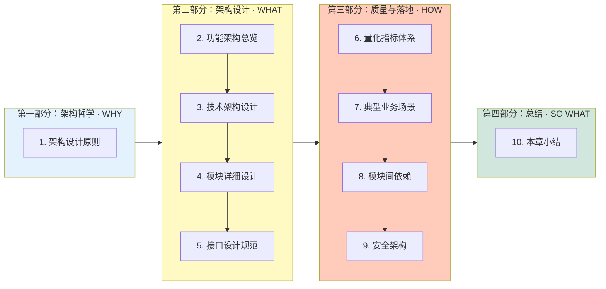

### 阅读路径建议

| 阅读方式 | 推荐顺序 | 适用场景 |
|----------|----------|----------|
| **快速浏览** | 1 → 2 → 10 | 5 分钟向他人讲清架构全貌（10 分钟）|
| **技术深入** | 1 → 3 → 4 → 5 | 学习技术架构 + 模块设计（60 分钟）|
| **架构评审** | 1 → 5 → 6 → 8 | 完成选型决策 + 依赖检查（45 分钟）|
| **完整阅读** | 1 → 2 → 3 → 4 → 5 → 6 → 7 → 8 → 9 → 10 | 系统掌握 + 可培训他人（120 分钟）|

---

## 1. 架构设计原则

> 架构不是一蹴而就的设计图，而是支撑系统长期演进的「**约束 + 自由**」的平衡艺术。Observable Ops 的架构设计原则，既要解决当下 AIOps 系统的复杂性问题，又要为未来 5 年的演进留足空间。本章阐述平台架构的设计哲学、核心原则、关键取舍、分层模型与模块协作关系。

### 📖 本节导读

<div class="section-callout">

> **6 节 · 约 20 分钟** · 从「**哲学 → 原则 → 对比 → 取舍 → 分层 → 协作**」递进

**学完后你将能：**

1. 用 **4 哲学 + 5 原则** 解释 Observable Ops 架构的「**为什么**」
2. 在 4 大关键取舍上做出**符合本平台价值观**的判断
3. 区分 4 层架构的**职责边界**与**层间契约**
4. 评审他人方案是否违反**协作约束**（反向依赖、跨层穿透、数据层穿透）

**与其他章节的连接：**

| 本节输出 | 后续章节应用 |
|----------|--------------|
| 4 哲学 + 5 原则 | → 第 3 章「技术架构设计」的选型依据 |
| 4 关键取舍 | → 第 5 章「接口设计」、第 6 章「指标体系」的取舍基准 |
| 4 层分层 | → 第 4 章「模块详细设计」的层级落地 |
| 11 模块协作 | → 第 8 章「依赖关系」的完整图谱 |

</div>

---

### 1.1 设计哲学：4 大底层认知

Observable Ops 的架构设计建立在 4 大底层认知之上，这些认知决定了我们为何选择这样的原则、为何采用这样的分层、为何坚持这样的协作方式：

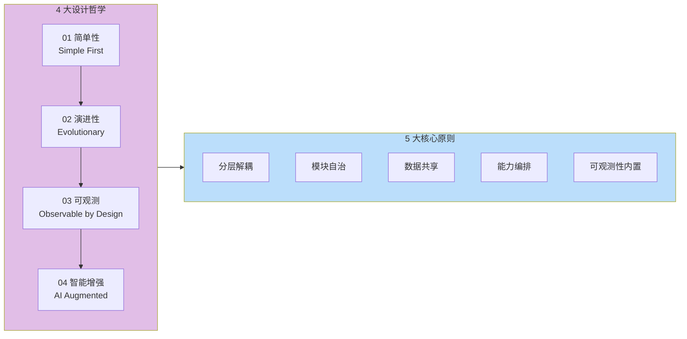

**4 大哲学详解：**

| 哲学 | 核心认知 | 解决的根本问题 | 在架构中的体现 |
|------|----------|----------------|----------------|
| **01 简单性 (Simple First)** | 复杂是万恶之源，每增加一层抽象都要有充分理由 | AIOps 系统天然复杂（数据多、模型多、Agent 多）容易失控 | 优先选择简单的方案、避免过度设计 |
| **02 演进性 (Evolutionary)** | 架构不是设计出来的，是演进出来的 | 业务和技术都在快速变化，架构必须支持演进 | 模块化、标准化接口、独立部署能力 |
| **03 可观测 (Observable by Design)** | 系统的可观测性必须从第一天就内置 | 平台自身也是复杂系统，事后补做可观测成本极高 | 全链路追踪、统一指标、Self-Monitoring |
| **04 智能增强 (AI Augmented)** | AI 是平台的「核心肌理」而非「外挂插件」 | AI Ops 不是传统监控 + AI 补丁，而是 AI Native 设计 | AI 推理路径纳入核心架构、模型可热更新 |

---

### 1.2 5 大核心原则

Observable Ops 围绕 4 大哲学落地为 **5 大核心架构原则**，每个原则都有明确的「**解决什么问题 + 实施策略 + 衡量指标**」：

| 原则 | 核心内涵 | 解决什么问题 | 实施策略 | 衡量指标 |
|------|----------|--------------|----------|----------|
| **分层解耦** | 数据层、能力层、应用层分离 | AIOps 系统天然分层混乱、AI 推理与业务逻辑纠缠不清 | 严格分层契约、层间通过标准 API 通信 | 层间依赖违规 < 1%、层独立发布周期 |
| **模块自治** | 每个模块独立构建、测试、部署 | 大泥球架构、变更影响面不可控 | 模块拥有独立代码库、独立 CI/CD、独立版本 | 模块独立发布频率、变更失败率 < 5% |
| **数据共享** | 统一数据模型、共享数据服务 | 多模块重复定义实体、数据孤岛 | 统一 Schema Registry、共享数据服务总线 | 数据重复率 < 5%、一致性 100% |
| **能力编排** | 模块间通过标准接口协作 | AI 能力组合僵化、无法灵活支撑新场景 | 能力插件化、动态路由、声明式编排 | 新场景上线时间 < 1 周、能力复用率 > 80% |
| **可观测性内置** | 整个平台自身可观测 | 平台自身成为「黑盒」、故障难定位 | 全链路 Trace、统一 Metric 体系、Self-Monitoring | 平台自身 MTTD < 1min、平台可观测覆盖率 100% |

**5 原则关系图：**

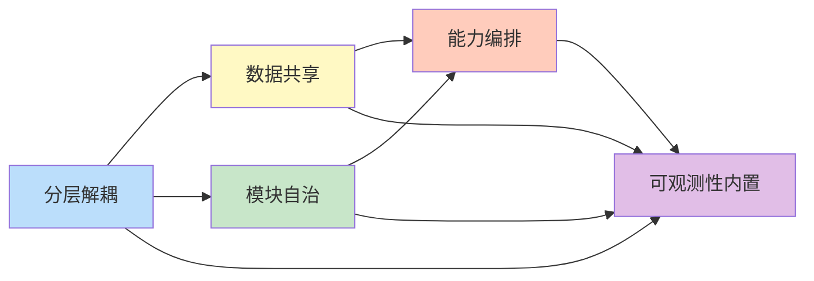

**原则协同说明：**

- **分层解耦** 是基础：先有清晰的分层，才有其他原则的落地空间
- **模块自治** + **数据共享** 是一对互补：自治避免耦合，共享避免冗余
- **能力编排** 是上层应用：前 3 个原则都为灵活编排服务
- **可观测性内置** 是横切关注点：贯穿前 4 个原则的每个细节

---

### 1.3 原则应用对比：传统监控架构 vs AIOps 智能架构

Observable Ops 的 5 大原则并非凭空设计，而是针对传统监控架构的痛点对症下药：

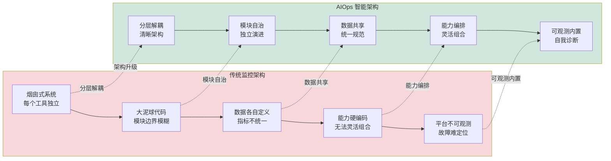

**维度对比表：**

| 维度 | 传统监控架构 | AIOps 智能架构 | 提升效果 |
|------|--------------|----------------|----------|
| **系统形态** | 烟囱式工具堆叠（Zabbix + ELK + Jaeger + 自研脚本） | 一体化平台（采集 + 存储 + AI + 应用） | 维护成本 -60% |
| **模块边界** | 边界模糊、代码大泥球 | 清晰分层、模块自治 | 变更影响可控 |
| **数据规范** | 各系统数据格式各异、字段对不齐 | 统一数据模型、共享数据服务 | 一致性 100% |
| **能力组合** | 能力硬编码、新场景需改底层代码 | 能力插件化、声明式编排 | 新场景上线 < 1 周 |
| **平台可观测** | 平台自身不可观测、故障难定位 | 自身可观测、自我诊断 | 平台 MTTR -50% |
| **演进方式** | 推倒重来（每 3-5 年大重构） | 渐进演进（模块独立升级） | 演进成本 -70% |

**智能架构的 3 大核心创新：**

| 创新点 | 传统架构没有 | AIOps 做法 | 价值 |
|--------|--------------|-----------|------|
| **统一数据底座** | 各系统数据孤岛 | 共享时序/日志/图谱存储 + 统一 Schema | 一次采集、多处使用 |
| **AI 原生设计** | AI 作为外挂插件 | 推理路径纳入核心架构、模型可热更新 | AI 能力不被业务架构拖累 |
| **可观测自指** | 平台是「黑盒」 | 平台观测自身、Self-Monitoring | 平台自身也可被运维 |

---

### 1.4 架构设计的 4 个关键取舍

优秀的架构不是「什么都要」，而是「在矛盾中做对选择」。Observable Ops 在 4 大核心取舍上做出明确选择：

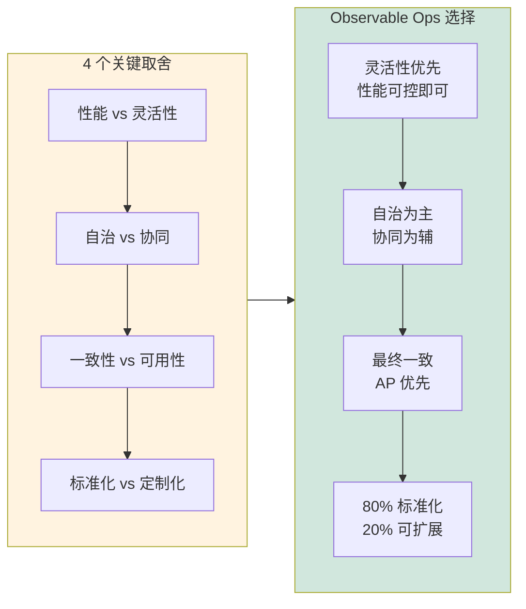

**取舍 1：性能 vs 灵活性**

| 维度 | 选择 | 原因 |
|------|------|------|
| ✅ 选择 | **灵活性优先** | AIOps 业务场景多变，灵活编排比极致性能更重要 |
| ❌ 放弃 | 极致性能 | 通过架构优化和缓存，让「灵活性」下的性能也可控 |
| **策略** | 标准化接口 + 异步处理 + 智能缓存 | 关键路径性能优化、次要路径容忍稍高延迟 |

**取舍 2：自治 vs 协同**

| 维度 | 选择 | 原因 |
|------|------|------|
| ✅ 选择 | **模块自治为主，协作为辅** | 自治让模块独立演进，协同让系统保持整体性 |
| ❌ 放弃 | 完全自治（数据/接口完全无约束） | 需要统一的数据规范和接口契约 |
| **策略** | 强契约（Schema、API）+ 弱实现（具体实现模块自主） | 模块对外契约统一、对内实现自由 |

**取舍 3：一致性 vs 可用性**

| 维度 | 选择 | 原因 |
|------|------|------|
| ✅ 选择 | **最终一致，AP 优先** | 监控场景对「不丢数据」比「实时一致」更敏感 |
| ❌ 放弃 | 强一致（CP） | 分布式监控系统中强一致成本过高、可用性受损 |
| **策略** | Eventual Consistency + 幂等设计 + 数据补偿 | 保证数据最终一致，关键操作幂等可重试 |

**取舍 4：标准化 vs 定制化**

| 维度 | 选择 | 原因 |
|------|------|------|
| ✅ 选择 | **80% 标准化，20% 可扩展** | 标准化降低复杂度，定制化满足差异化需求 |
| ❌ 放弃 | 100% 标准化（无法满足特殊场景） | 客户场景千差万别，需要有限扩展点 |
| **策略** | 核心能力标准化 + 业务能力插件化 | 通过插件机制允许 20% 的定制化扩展 |

---

### 1.5 架构分层模型

基于「分层解耦」原则，Observable Ops 采用 **4 层架构**：采集层 → 数据层 → 能力层 → 应用层。每一层职责清晰、层间通过标准接口协作：

```mermaid
flowchart TB
    subgraph 应用层["应用层 Application Layer"]
        direction LR
        APP1[监控大屏<br/>Dashboard]
        APP2[告警中心<br/>Alerting]
        APP3[事件管理<br/>Incident]
        APP4[工作台<br/>Workspace]
    end
    
    subgraph 能力层["能力层 Capability Layer"]
        direction LR
        CAP1[智能感知<br/>Sensing]
        CAP2[认知网络<br/>Cognition]
        CAP3[故障研判<br/>Diagnosis]
        CAP4[根因分析<br/>RCA]
        CAP5[影响分析<br/>Impact]
        CAP6[智能决策<br/>Decision]
        CAP7[自动执行<br/>Execution]
        CAP8[知识进化<br/>Learning]
    end
    
    subgraph 数据层["数据层 Data Layer"]
        direction LR
        DATA1[数据融合<br/>Fusion]
        DATA2[数据模型<br/>Model]
        DATA3[知识图谱<br/>Knowledge]
        DATA4[时序存储<br/>TSDB]
        DATA5[日志存储<br/>LogStore]
        DATA6[追踪存储<br/>TraceStore]
    end
    
    subgraph 采集层["采集层 Collection Layer"]
        direction LR
        COL1[指标采集<br/>Metrics]
        COL2[日志采集<br/>Logs]
        COL3[链路追踪<br/>Traces]
        COL4[事件采集<br/>Events]
        COL5[拓扑采集<br/>Topology]
    end
    
    应用层 --> 能力层
    能力层 --> 数据层
    数据层 --> 采集层
    
    style 应用层 fill:#e3f2fd
    style 能力层 fill:#d1e7dd
    style 数据层 fill:#fff9c4
    style 采集层 fill:#ffccbc
```

**4 层职责详解：**

| 层级 | 核心职责 | 关键能力 | 输入 | 输出 |
|------|----------|----------|------|------|
| **采集层** | 全量数据采集、协议适配 | 指标/日志/追踪/事件/拓扑 5 类采集器 | 各数据源原始数据 | 标准化数据流 |
| **数据层** | 数据存储、融合、模型 | 统一数据模型、6 类存储引擎 | 标准化数据 | 融合数据 + 知识图谱 |
| **能力层** | AI 推理、智能分析 | 8 大核心能力（感知→认知→决策→执行→学习） | 融合数据 | 故障结论、决策方案、执行结果 |
| **应用层** | 用户交互、价值呈现 | 4 类应用（Dashboard/告警/事件/工作台） | 能力输出 | 用户可用的功能 |

**层间数据流：**

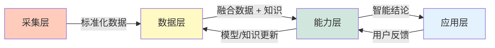

**层间契约原则：**

| 原则 | 说明 |
|------|------|
| **下层不知道上层** | 数据层不感知能力层和应用层，能力层不感知应用层 |
| **上层不绕过下层** | 应用层不直接访问数据层，必须经过能力层 |
| **层间接口稳定** | 层间契约一旦发布，向后兼容、版本化管理 |
| **层内自治** | 每层内部实现可自由替换（如更换时序数据库） |

---

### 1.6 模块协作关系

基于「模块自治 + 能力编排」原则，11 个模块通过标准接口协作，形成清晰的依赖关系：

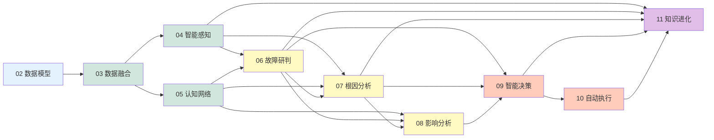

**模块协作矩阵：**

| 模块 | 输入依赖 | 输出提供 | 协作模块 | 协作模式 |
|------|----------|----------|----------|----------|
| 01 总体架构 | — | 架构规范 | 所有模块 | 规范提供方 |
| 02 数据模型 | — | 数据规范 | 所有模块 | 规范提供方 |
| 03 数据融合 | 02 数据模型 | 融合数据 | 04/05/06/07/08 | 数据生产者 |
| 04 智能感知 | 03 融合数据 | 异常事件 | 06/09/11 | 事件生产者 |
| 05 认知网络 | 03 融合数据 | 知识图谱 | 06/07/08/11 | 知识服务方 |
| 06 故障研判 | 03/04/05 | 故障结论 | 07/08/09 | 分析协调方 |
| 07 根因分析 | 03/04/05/06 | 根因路径 | 08/09/11 | 推理服务方 |
| 08 影响分析 | 03/05/06/07 | 影响范围 | 09/10 | 评估服务方 |
| 09 智能决策 | 04/06/07/08 | 决策方案 | 10/11 | 决策服务方 |
| 10 自动执行 | 09 决策 | 执行结果 | 08/11 | 执行服务方 |
| 11 知识进化 | 04/06/07/09/10 | 知识更新 | 所有模块 | 反馈闭环方 |

**3 大协作模式：**

| 模式 | 描述 | 适用场景 | 示例 |
|------|------|----------|------|
| **同步调用** | 模块间通过 API 同步请求-响应 | 强一致性场景 | 故障研判 → 根因分析 |
| **异步事件** | 模块间通过事件总线异步通信 | 解耦场景、高吞吐 | 智能感知 → 故障研判 |
| **共享数据** | 模块间通过数据层共享数据 | 数据复用场景 | 知识图谱被多个模块使用 |

**协作约束：**

- **禁止反向依赖**：下游模块不得直接调用上游模块（如 04 不得调用 07）
- **禁止跨层调用**：能力层模块不得直接调用应用层（应用层调用能力层）
- **禁止数据层穿透**：能力层必须通过数据层访问数据，不得直接操作存储

### 本节小结

> **5 个核心速记 · 1 个评审 checklist · 1 个记忆口诀**

**5 个核心速记：**

| # | 维度 | 速记 |
|---|------|------|
| 1 | 哲学 | 4 大哲学：**简单** / **演进** / **可观测** / **AI 增强** |
| 2 | 原则 | 5 大原则：分层解耦 / 模块自治 / 数据共享 / 能力编排 / 可观测性内置 |
| 3 | 取舍 | 4 大取舍：灵活性优先 / 自治为主 / AP 优先 / 80-20 |
| 4 | 分层 | 4 层架构：采集层 / 数据层 / 能力层 / 应用层 |
| 5 | 协作 | 3 大模式：同步调用 / 异步事件 / 共享数据 |

**架构评审 checklist：**

- [ ] 是否体现 4 大哲学中的**至少 3 个**？
- [ ] 是否触犯 5 原则中的「**层间契约稳定**」？
- [ ] 4 大取舍上是否给出**明确选择 + 实施策略**？
- [ ] 4 层职责是否**清晰、无跨层穿透**？
- [ ] 模块协作是否**避免反向依赖 + 数据层穿透**？

**记忆口诀：**

> **4 哲 · 5 原 · 4 取 · 4 层 · 3 协**
> *(四个哲学 · 五个原则 · 四个取舍 · 四层架构 · 三种协作)*

---

## 2. 功能架构总览

### 2.1 端到端数据流

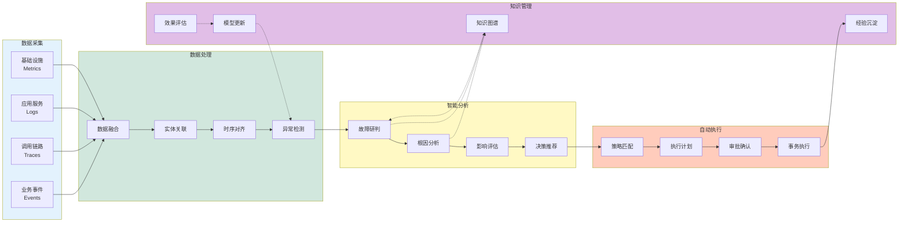

### 2.2 模块职责边界

| 模块 | 职责 | 边界定义 |
|------|------|----------|
| **01 总体架构** | 顶层设计、模块划分、接口规范 | 定义模块间交互契约，不涉及具体实现 |
| **02 数据模型** | 实体定义、关系建模、指标规范 | 统一数据元数据，不存储实际数据 |
| **03 数据融合** | 多源汇聚、格式标准化、实体挂载 | 数据汇聚到融合态，不做异常检测 |
| **04 智能感知** | 异常检测、模式识别、告警收敛 | 检测异常并输出事件，不做根因分析 |
| **05 认知网络** | 知识抽取、关系推理、图存储 | 构建知识图谱，不做故障研判 |
| **06 故障研判** | 故障判定、类型分类、上下文组织 | 判断故障存在，不做根因定位 |
| **07 根因分析** | 因果推理、传播路径、DAG 构建 | 定位根本原因，不做影响评估 |
| **08 影响分析** | 服务拓扑、影响评估、降级方案 | 评估业务影响，不做决策生成 |
| **09 智能决策** | 方案生成、策略匹配、执行计划 | 生成决策建议，不做实际执行 |
| **10 自动执行** | 策略执行、脚本运行、事务保障 | 执行决策动作，不做知识沉淀 |
| **11 知识进化** | 知识沉淀、经验复用、模型迭代 | 持续优化知识，不做独立分析 |

---

## 3. 技术架构设计

### 3.1 技术栈总览

```mermaid
flowchart LR
    subgraph 前端["前端展现"]
        FE1[React18]
        FE2[Ant Design5]
        FE3[ECharts 5]
        FE4[Mermaid]
    end
    
    subgraph 后端["后端服务"]
        BE1[Python 3.11]
        BE2[FastAPI]
        BE3[Celery]
        BE4[Redis]
    end
    
    subgraph 数据["数据存储"]
        DB1[PostgreSQL]
        DB2[TimescaleDB]
        DB3[Elasticsearch]
        DB4[Neo4j]
        DB5[ClickHouse]
    end
    
    subgraph智能["智能引擎"]
        AI1[PyTorch]
        AI2[scikit-learn]
        AI3[SpaCy]
        AI4[LangChain]
    end
    
    subgraph 采集["采集层"]
        CL1[Telegraf]
        CL2[Fluentd]
        CL3[Jaeger Agent]
        CL4[vector]
    end
    
    前端 --> 后端 --> 数据
    后端 --> 智能
   采集 --> 数据
    
    style 前端 fill:#e3f2fd
    style 后端 fill:#d1e7dd
    style 数据 fill:#fff9c4
    style 智能 fill:#ffccbc
    style 采集 fill:#e1bee7
```

### 3.2 技术选型原则

| 层级 | 选型原则 | 技术选型 | 替代方案 |
|------|----------|----------|----------|
| **前端** | 成熟生态、组件丰富 | React + Ant Design | Vue + Element |
| **后端** | 高性能、异步非阻塞 | FastAPI + asyncio | Spring Boot |
| **任务队列** | 可靠持久、分布式 | Celery + Redis | RabbitMQ |
| **时序存储** | 高压缩、时序优化 | TimescaleDB | InfluxDB |
| **图数据库** | 原生图、事务支持 | Neo4j | NebulaGraph |
| **日志存储** | 全文检索、聚合分析 | Elasticsearch | OpenSearch |
| **OLAP** | 列式存储、SQL 支持 | ClickHouse | Druid |
| **异常检测** | 可解释、增量学习 | PyTorch + LSTM | sklearn |

### 3.3 部署架构

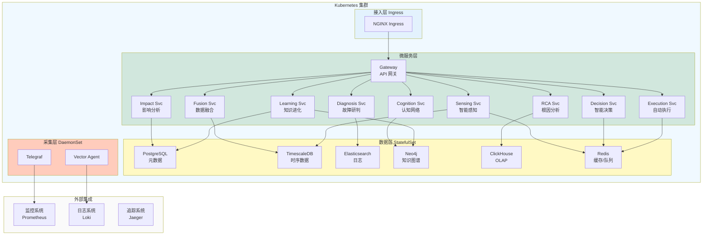

---

## 4. 模块详细设计

### 4.1 数据流架构

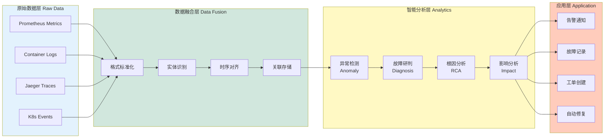

### 4.2 能力成熟度模型

|能力等级 | 特征 | 技术成熟度 | 业务效果 |
|----------|------|------------|----------|
| **L1 初始级** | 手工操作、烟囱式系统 | 20% | 被动响应 |
| **L2 基础级** | 单一监控、告警规则 | 40% | 快速发现 |
| **L3 规范级** | 数据融合、关联分析 | 60% | 精准定位 |
| **L4 优化级** | 智能检测、自动决策 | 80% | 自动处置 |
| **L5 卓越级** | 自我学习、持续进化 | 95% | 预测预防 |

### 4.3 技术成熟度评估

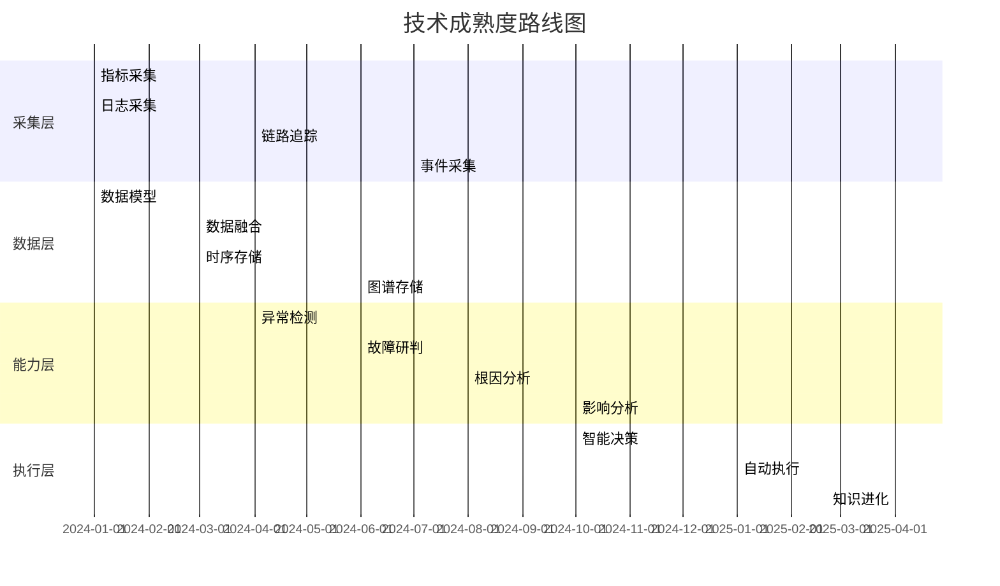

---

## 5. 接口设计规范

### 5.1 API规范总览

| 接口类型 | 协议 | 认证方式 | 用途 |
|----------|------|----------|------|
| **REST API** | HTTP/JSON | JWT Token | 前后端交互、第三方集成 |
| **gRPC** | HTTP/2 | mTLS | 微服务间通信 |
| **WebSocket** | WS | JWT Token | 实时推送、长连接 |
| **Event Bus** | Kafka | SASL/ACL | 跨服务事件传递 |

### 5.2 服务间调用关系

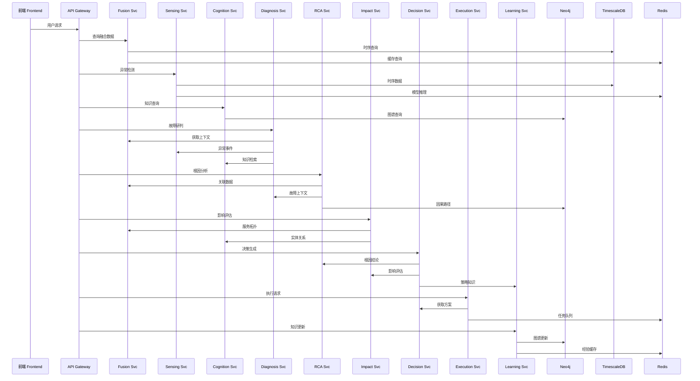

### 5.3 接口质量指标

| 指标 | SLO目标 | 告警阈值 |
|------|----------|----------|
| **可用性** | 99.95% | < 99.9% |
| **延迟 P99** | < 200ms | > 500ms |
| **延迟 P95** | < 100ms | > 200ms |
| **错误率** | < 0.1% | > 0.5% |
| **吞吐量** | > 1000 QPS | < 500 QPS |

---

## 6. 量化指标体系

### 6.1 核心质量指标

| 指标类别 | 指标名称 | 当前基线 | 目标值 | 测量方法 |
|----------|----------|----------|--------|----------|
| **性能** | 数据采集延迟 | P99 < 5s | P99 < 1s | 日志时间戳差值 |
| **性能** | 异常检测延迟 | P99 < 10s | P99 < 2s | 事件产生到检测 |
| **性能** | 根因分析延迟 | P99 < 60s | P99 < 30s | 故障发生到根因输出 |
| **性能** | API响应时间 | P99 < 200ms | P99 < 100ms | APM追踪 |
| **准确** | 异常检测准确率 | 85% | > 92% | 人工标注验证 |
| **准确** | 根因定位准确率 | 80% | > 90% | 人工标注验证 |
| **准确** | 影响评估准确率 | 85% | > 95% | 与实际影响对比 |
| **可用** | 系统可用性 | 99.5% | 99.95% | 正常运行时间 |
| **可用** | 数据完整性 | 99% | 99.99% | 缺失数据比率 |

### 6.2 能力成熟度指标

| 维度 | L1 初始级 | L2 基础级 | L3 规范级 | L4 优化级 | L5 卓越级 |
|------|----------|----------|----------|----------|----------|----------|
| **接入率** | < 30% | 30-50% | 50-70% | 70-90% | > 90% |
| **自动化率** | < 10% | 10-30% | 30-50% | 50-70% | > 70% |
| **MTTD** | > 30min | 10-30min | 5-10min | 1-5min | < 1min |
| **MTTR** | > 4h | 2-4h | 1-2h | 30min-1h | < 30min |
| **误报率** | > 50% | 30-50% | 10-30% | 5-10% | < 5% |

### 6.3 容量规划指标

| 指标 | 规格 | 阈值 | 扩容策略 |
|------|------|------|----------|
| **日增量数据** | 100GB | 80GB | 自动扩容 |
| **实时查询 QPS** | 1000 | 800 | 水平扩展 |
| **历史查询 QPS** | 100 | 80 | 读写分离 |
| **并发会话数** | 500 | 400 | 连接池优化 |
| **知识图谱规模** | 1000 万实体 | 800 万 | 分片集群 |

---

## 7. 典型业务场景

### 7.1 场景一：突发流量导致的数据库告警

**场景描述：**
双十一零点秒杀活动，数据库 CPU 突然飙升至 90%，触发告警。

**处理流程：**

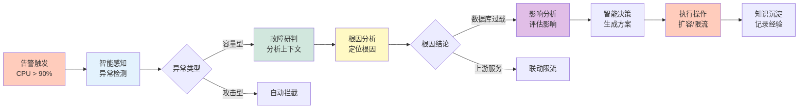

**关键指标：**

| 阶段 | 指标 | 目标 |
|------|------|------|
| 发现 | MTTD | < 1 min |
| 定位 | MTTR | < 15 min |
| 恢复 | MTTF | < 30 min |
| 总结 | 知识沉淀 | 自动化 |

### 7.2 场景二：慢查询导致的链路超时

**场景描述：**
用户反馈接口响应慢，APM 显示多个服务 span 时间增加。

**处理流程：**

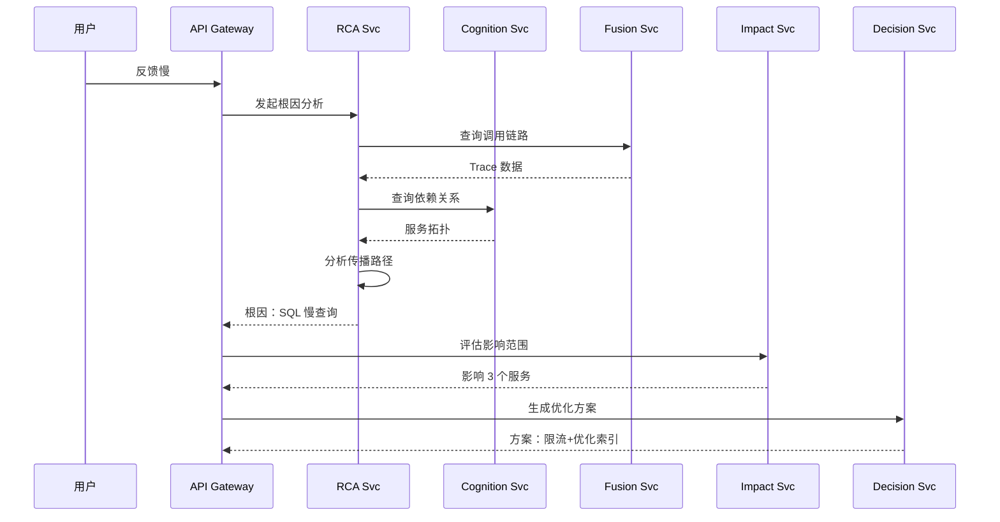

**关键指标：**

| 指标 | 传统模式 | 智能模式 | 提升 |
|------|----------|----------|------|
| 问题定位 | 45 min | 5 min | 9x |
| 影响评估 | 20 min | 2 min | 10x |
| 方案生成 | 30 min | 1 min | 30x |
| 总处理时间 | 95 min | 8 min | 12x |

### 7.3 场景三：变更导致的批量服务异常

**场景描述：**
版本发布后，10 个微服务出现不同程度的异常，告警泛滥。

**处理流程：**

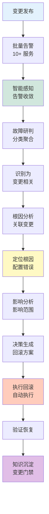

**关键能力：**

| 能力 | 说明 | 效果 |
|------|------|------|
| 告警收敛 | 10+ 告警收敛为 1 个事件 | 告警减少 90% |
| 变更关联 | 自动关联变更记录 | 定位时间减少 80% |
| 批量根因 | 一次分析覆盖所有异常 | 分析时间减少 70% |
| 自动回滚 | 检测到异常自动回滚 | 恢复时间减少 90% |

---

## 8. 模块间依赖关系

### 8.1 依赖矩阵

| 模块 | 依赖模块 | 依赖类型 | 接口方式 |
|------|----------|----------|----------|
| 03 数据融合 | 02 数据模型 | 规范依赖 | Schema 定义 |
| 04 智能感知 | 03 数据融合 | 数据依赖 | 时序查询 |
| 05 认知网络 | 03 数据融合 | 数据依赖 | 实体查询 |
| 06 故障研判 | 03/04/05 | 数据依赖 | 上下文获取 |
| 07 根因分析 | 03/04/05/06 | 数据依赖 | 故障上下文 |
| 08 影响分析 | 03/05/06/07 | 数据依赖 | 拓扑+故障 |
| 09 智能决策 | 04/06/07/08 | 数据依赖 | 多维评估 |
| 10 自动执行 | 09 决策 | 方案依赖 | 执行指令 |
| 11 知识进化 |04/06/07/09/10 | 反馈依赖 | 效果评估 |

### 8.2 数据依赖图


---

## 9. 安全架构

### 9.1 安全模型

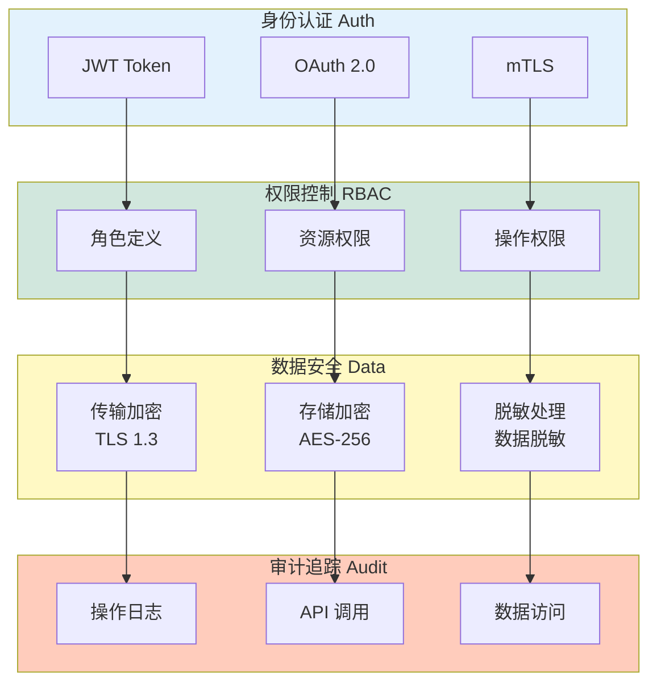

### 9.2 多租户隔离

| 隔离级别 | 实现方式 | 适用场景 | 性能开销 |
|----------|----------|----------|----------|
| **Schema 级** | PostgreSQL Schema | 逻辑隔离 | 低 |
| **数据库级** | 独立数据库实例 | 强隔离 | 中 |
| **集群级** | K8s Namespace | 完全隔离 | 高 |

---

## 10. 本章小结

### 10.1 核心要点速记

**5 个关键认知：**

1. **分层解耦** — 数据层、能力层、应用层分离，独立演进
2. **模块自治** — 每个模块独立构建、测试、部署，降低耦合
3. **数据共享** — 统一数据模型、共享数据服务，消除数据孤岛
4. **能力编排** — 模块间通过标准接口协作，灵活组合
5. **可观测性内置** — 整个平台自身可观测，自我诊断

**4 个架构目标：**

| 目标 | 描述 | 量化指标 |
|------|------|----------|
| **高性能** | 端到端延迟 P99 < 30s | 根因分析 |
| **高可用** | 系统可用性 99.95% | 任意时刻 |
| **可扩展** | 水平扩展支持10x 增长 | 容量规划 |
| **可观测** | 自身指标全覆盖 | 自我诊断 |

### 10.2 与其他模块的接口

| 模块 | 输入 | 输出 |
|------|------|------|
| 02 数据模型 | 业务需求 | 数据规范 |
| 03 数据融合 | 数据规范 | 融合数据 |
| 04-11 |架构规范 | 模块协作 |

### 10.3 关键成功要素

| 要素 | 说明 | 优先级 |
|------|------|--------|
| **统一数据模型** | 所有模块使用统一的数据规范 | P0 |
| **标准接口契约** | 模块间交互使用标准 API | P0 |
| **独立部署能力** | 模块可独立构建和部署 | P1 |
| **可观测性内置** | 自身指标可监控、可追踪 | P1 |

### 10.4 未来演进方向

| 方向 | 内容 | 阶段 |
|------|------|------|
| **服务网格** | 基于 Istio 的服务治理 | V2 |
| **多云适配** | 跨云统一架构 | V3 |
| **边缘计算** | 边缘节点轻量化 | V3 |
| **Serverless** | 函数即服务执行 | V4 |

---

> 本章定义了 Observable Ops 平台的总体架构规范。后续章节将详细阐述各模块的设计与实现。

_文档版本：V1.0 | 更新日期：2026-06-06_