# 模块 02 · 拓扑建模

> 智能系统运维可观测性 · 拓扑建模模块功能逻辑设计

---

## 1. 功能概述

> 拓扑建模模块是 Observable Ops 平台的「数字底盘」——将物理世界的基础设施和逻辑世界的依赖关系抽象为统一知识图谱，为所有上层智能分析模块提供拓扑数据服务。

### 1.1 模块定位

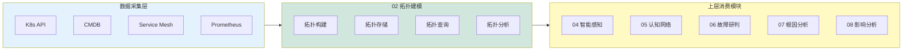

| 定位维度 | 描述 |
| -------- | ---- |
| **平台定位** | 数据基础设施模块，为所有上层智能分析模块提供拓扑数据服务 |
| **能力定位** | 拓扑数据的构建、存储、查询和分析能力 |
| **数据定位** | 实体（节点）+ 关系（边）+ 属性统一模型 |
| **技术定位** | 图数据库（Neo4j）+ 时序数据库（TimescaleDB）+ 消息队列（Kafka） |

### 1.2 职责边界

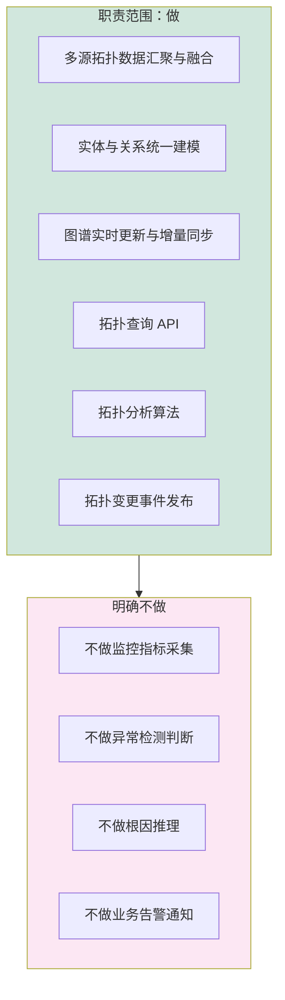

| 类型 | 具体职责 |
| ---- | -------- |
| **做** | 多源拓扑数据汇聚融合（K8s、CMDB、Prometheus、Service Mesh）· 实体与关系统一建模 · 图谱实时更新与增量同步 · 拓扑查询 API（路径、邻居、子图、聚合）· 拓扑分析算法（连通分量、中心性、PageRank、社区发现）· 拓扑变更事件发布 |
| **不做** | 原始指标采集（采集层负责）· 异常检测逻辑（智能感知负责）· 根因推理（根因分析负责）· 业务告警通知（应用层负责） |

### 1.3 模块协作关系

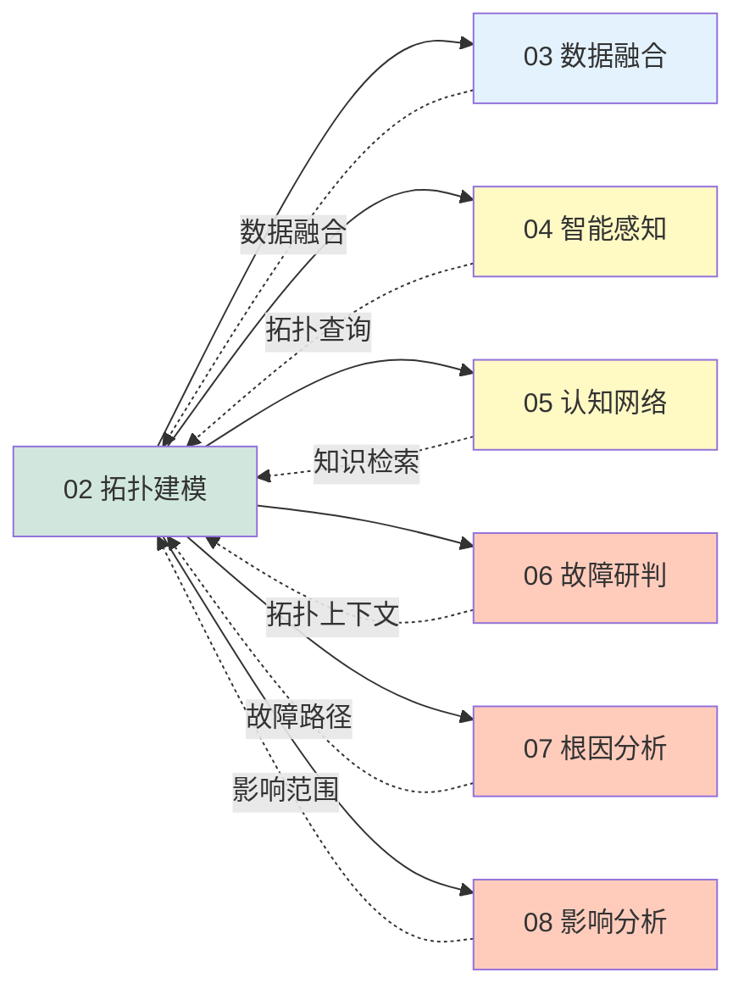

| 上游模块 | 数据流向 | 接口方式 |
| -------- | -------- | -------- |
| 03 数据融合 | 汇聚后的标准化实体/关系数据 | Kafka Topic 推送 |
| 04 智能感知 | 查询拓扑上下文用于异常检测 | gRPC 查询 |
| 05 认知网络 | 构建知识图谱的拓扑层 | gRPC 订阅 |
| 06 故障研判 | 获取故障相关的拓扑信息 | gRPC 查询 |
| 07 根因分析 | 故障传播路径分析 | gRPC 查询 |
| 08 影响分析 | 影响范围评估 | gRPC 查询 |

---

## 2. 功能架构

### 2.1 数据模型架构

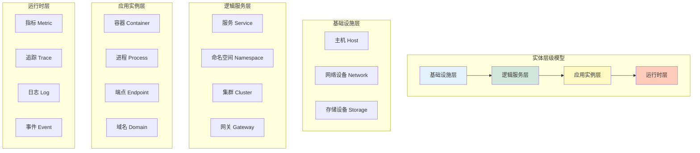

#### 实体模型

| 实体类型 | 英文名 | 关键属性 | 数据来源 |
| -------- | ------ | -------- | -------- |
| **主机** | Host | hostname, ip, os, cpu_count, mem_gb, cloud_region | CMDB / 云平台 API |
| **网络设备** | NetworkDevice | device_type, vendor, model | CMDB / SNMP |
| **服务** | Service | service_name, namespace, protocol, port | K8s API / 服务发现 |
| **集群** | Cluster | cluster_id, cluster_name, version, cloud_provider | K8s API |
| **命名空间** | Namespace | ns_name, cluster, labels | K8s API |
| **容器** | Container | container_id, image, pod_name, node_name, status | K8s API / cAdvisor |
| **网关** | Gateway | gateway_name, upstream_services, rate_limit | Service Mesh |
| **端点** | Endpoint | path, method, status_code, latency_p99 | APM / 日志解析 |

#### 关系模型

| 关系 | 英文名 | 起点 | 终点 | 属性 |
| ---- | ------ | ---- | ---- | ---- |
| **包含** | contains | Cluster / Namespace / Service | Namespace / Service / Container | labels, since |
| **部署在** | runs_on | Container / Pod | Host / Node | node_name, zone |
| **调用** | calls | Service / Container | Service / Endpoint | protocol, port, qps, latency_avg |
| **访问** | accesses | Gateway / Ingress | Service | path, method, rate_limit |
| **监控** | monitors | Prometheus / Telegraf | Host / Service / Container | scrape_interval, metrics |
| **同步** | syncs | CMDB | Host / NetworkDevice | last_sync, source |

#### 属性模型

| 属性类型 | 说明 | 存储方式 |
| ------- | ---- | -------- |
| **静态属性** | 不经常变化（hostname, os, region） | Neo4j 节点属性 |
| **动态属性** | 实时变化（status, cpu_usage, qps） | TimescaleDB 时序数据 |
| **关系属性** | 边的属性（调用 qps, 延迟） | Neo4j 边属性 |
| **元数据属性** | 标签、注解、描述 | Neo4j 节点属性（JSON） |

### 2.2 分层架构

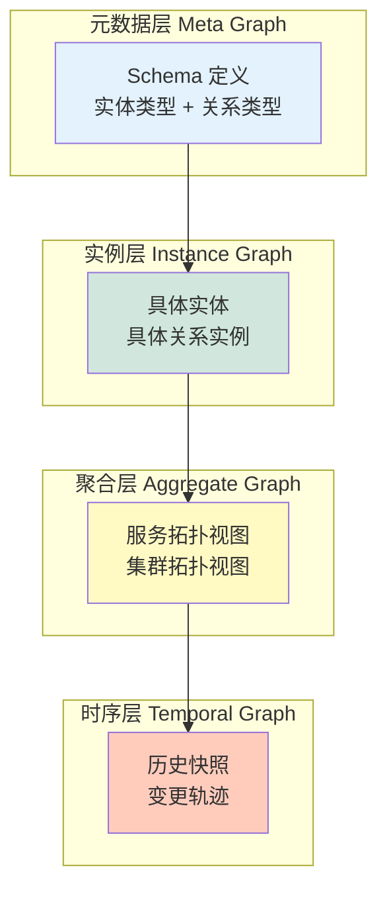

| 层次 | 描述 | 查询场景 |
| ---- | ---- | -------- |
| **元数据层** | Schema 级别的实体类型和关系类型定义 | 类型查询、Schema 验证 |
| **实例层** | 具体实体和关系实例 | 节点查询、路径查询、邻居查询 |
| **聚合层** | 按服务/集群聚合的视图 | 服务拓扑、集群拓扑、聚合指标 |
| **时序层** | 拓扑变更的历史快照 | 变更轨迹、回滚分析、故障复盘 |

### 2.3 协作模式

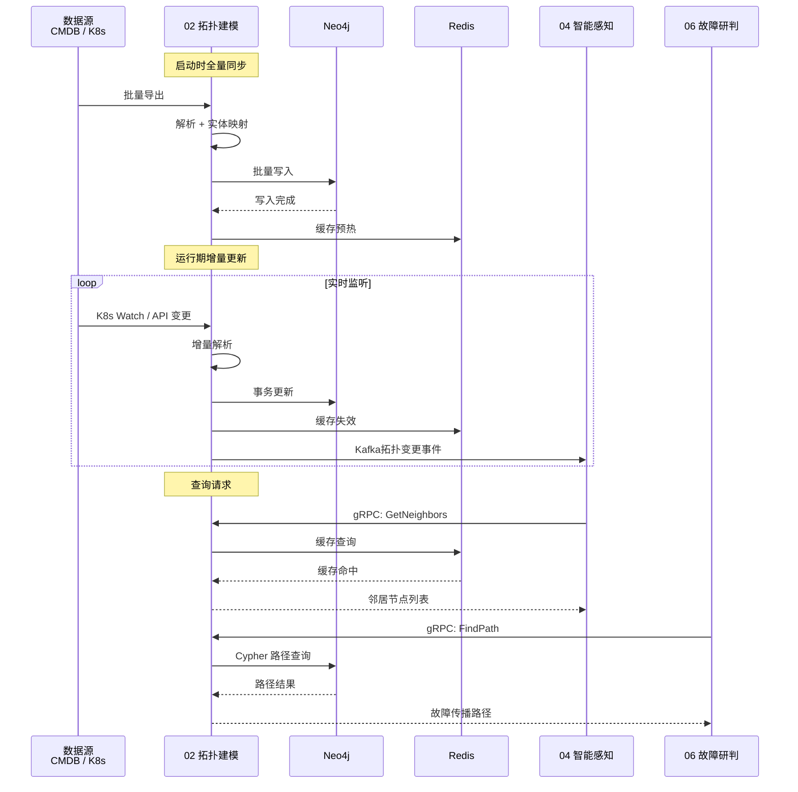

---

## 3. 核心功能

### 3.1 拓扑构建

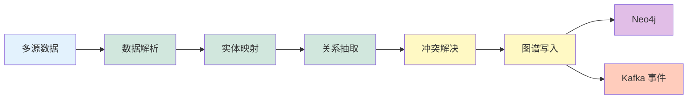

| 子功能 | 输入 | 处理逻辑 | 输出 |
| ------ | ---- | -------- | ---- |
| **主动发现** | K8s API / CMDB API / 服务发现 | 周期性拉取 + Diff 对比 | 增量拓扑变更 |
| **被动接收** | Kafka Topic（服务变更、实例变更） | 实时消费 + 解析 + 写入 | 实时拓扑更新 |
| **实体映射** | 原始数据（多种格式） | 格式标准化 + ID 映射 + 去重 | 标准化实体 |
| **关系抽取** | 标准化实体 + 数据源上下文 | 关系类型识别 + 方向判断 + 属性提取 | 标准化关系 |
| **冲突解决** | 多源同一实体 | 优先级策略（CMDB > K8s > Prometheus） | 合并后实体 |
| **图谱写入** | 合并后实体 + 关系 | Neo4j Transaction + 批量写入 | 图数据库记录 |

#### 冲突解决策略详解

多源数据不可避免出现冲突，按以下优先级链处理：

| 冲突场景 | 默认策略 | 可配置选项 |
| -------- | -------- | ---------- |
| **同一实体属性冲突** | CMDB > K8s > Prometheus > Service Mesh | 按数据源调整优先级 |
| **实体删除冲突** | 一个源删除 + 另一源存在 → 标记疑似删除，人工确认 | 自动删除 / 标记 |
| **关系方向冲突** | 服务调用关系以 Service Mesh 为准 | 可指定权威数据源 |
| **类型不一致冲突** | 同一 ID 在不同源类型不同 → 报错 + 人工介入 | 忽略 / 取新 |

### 3.2 拓扑更新

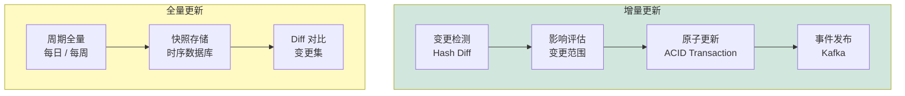

| 更新策略 | 触发条件 | 更新范围 | 延迟 |
| -------- | -------- | -------- | ---- |
| **实时增量** | Kafka 事件 / K8s Webhook | 变更节点 + 直接关联边 | < 1s |
| **定时增量** | 每 5 分钟轮询 | 上次轮询至今的变更 | < 5min |
| **全量同步** | 每日 02:00 / 手动触发 | 全部实体 + 关系 | < 30min |
| **故障触发** | 检测到数据源异常恢复 | 故障时段变更 | < 5min |

### 3.3 拓扑查询

| 查询类型 | Cypher 示例 | 场景 |
| ------- | ---------- | ---- |
| **节点查询** | `MATCH (n:Service {name: $name}) RETURN n` | 按名称/类型查找节点 |
| **路径查询** | `MATCH path = (a)-[:calls*1..3]-(b) WHERE a.name=$x RETURN path` | 查找两点间所有路径 |
| **邻居查询** | `MATCH (n)-[r]-(m) WHERE n.name=$name RETURN m` | 查找直接关联节点 |
| **子图查询** | `MATCH p = ()-[*1..2]-() WHERE all(n IN nodes(p) WHERE n.cluster=$cluster) RETURN p` | 按条件截取子图 |
| **聚合查询** | `MATCH (n:Service) RETURN n.namespace, count(n) AS cnt` | 按属性聚合统计 |
| **时序查询** | `MATCH (n)-[r]->(m) WHERE r.updated_at > $since RETURN r` | 查询变更历史 |

#### 实战查询场景

| 场景 | 查询意图 | 结果示例 |
| ---- | -------- | -------- |
| **SQL 慢查询分析** | 查找 `order-svc` 依赖的所有数据库实例 | `order-svc → calls → order-db:5432` + `order-svc → calls → user-db:3306` |
| **发布影响评估** | 查找 `api-gateway` 新版本部署后会影响的上下游 | 上游依赖（3 个服务）· 下游被调用（8 个服务）· 间接影响（15 个端点） |
| **故障隔离范围** | 查找 `payment-svc` 不可达时可能影响的所有路径 | 连通分量分析 → 3 个服务 + 2 个数据库将不可达 |
| **链路追踪辅助** | 查找从 `frontend` 到 `recommend` 的所有调用链 | 4 条路径：最长 5 跳，最短 2 跳 |
| **配置变更验证** | 新上线 `redis-cluster-2` 后，检查哪些服务已连接到新节点 | 已迁移: `session-svc` / `cache-svc` · 未迁移: `rate-limiter`（告警） |

### 3.4 拓扑分析

| 分析算法 | 输入 | 输出 | 应用场景 |
| ------- | ---- | ---- | -------- |
| **连通分量** | 全量拓扑 | 连通分量列表 | 故障隔离范围判断 |
| **强连通分量 SCC** | 有向拓扑 | SCC 列表 | 服务循环依赖检测 |
| **PageRank** | 有向拓扑 | 节点排名分数 | 核心服务识别 |
| **介数中心性** | 拓扑图 | 节点介数分数 | 关键链路识别 |
| **社区发现 Louvain** | 无向拓扑 | 社区划分 | 服务分组分析 |
| **故障传播路径** | 故障节点 | 传播路径 DAG | 影响分析、根因推理 |

---

## 4. 技术实现

### 4.1 数据采集

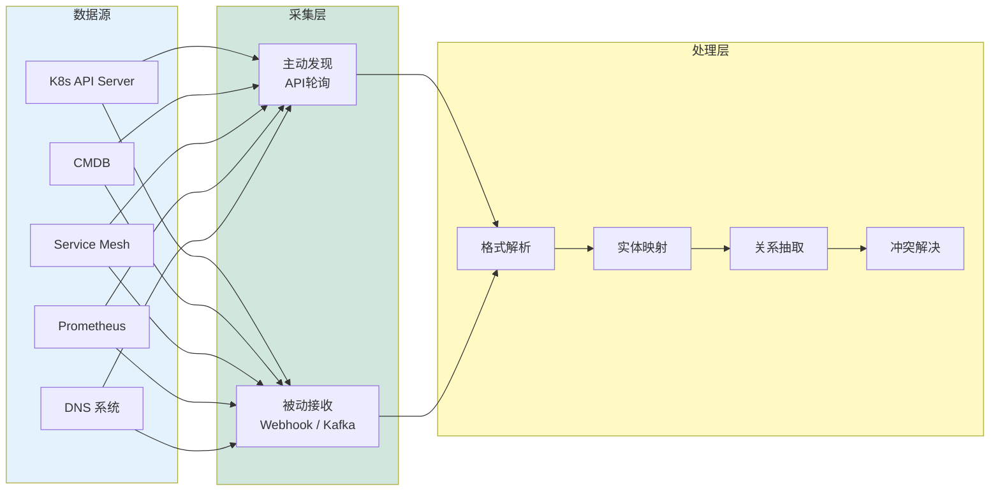

| 数据源 | 采集方式 | 频率 | 数据内容 |
| ------ | ------- | ---- | -------- |
| **K8s API Server** | Watch + List | 实时 + 5min 轮询 | Node / Pod / Service / Endpoint / Ingress |
| **CMDB** | REST API 轮询 | 5min 轮询 | 主机 / 网络设备 / 存储设备 |
| **Service Mesh** | Envoy ADS / CDS | 实时 | 服务发现 / 流量拓扑 / 路由规则 |
| **Prometheus** | PromQL + Targets | 15s 轮询 | 指标采集目标 / 告警规则 |
| **DNS 系统** | DNS Zone Transfer | 1h 轮询 | 域名解析 / CNAME / A 记录 |

### 4.2 存储架构

| 存储引擎 | 存储内容 | 数据模型 | 容量规划 |
| ------- | -------- | ------- | ------- |
| **Neo4j** | 实体 + 关系 + 属性 | 属性图（Property Graph） | 100 万节点 / 1000 万边 |
| **TimescaleDB** | 拓扑变更时序 | 时序表（node_changes / edge_changes） | 保留 90 天 |
| **Kafka** | 变更事件流 | 6 个 Topic（按事件类型分区） | 保留 7 天 |
| **Redis** | 查询缓存 + 变更缓冲 | String / Hash / Sorted Set | 10GB |

### 4.3 缓存策略

| 缓存类型 | 内容 | TTL | 更新策略 |
| ------- | --- | --- | -------- |
| **节点缓存** | 高频查询节点 | 5 分钟 | LRU + 变更事件失效 |
| **路径缓存** | 热点路径查询结果 | 1 分钟 | LRU + 边变更失效 |
| **聚合缓存** | 服务统计 / 集群统计 | 5 分钟 | 定时刷新 |
| **时序缓冲** | 变更事件批量写入缓冲 | 实时 flush | 时间/数量双阈值触发 |

### 4.4 错误处理与边界场景

| 异常场景 | 检测方式 | 处理策略 | 恢复动作 |
| -------- | -------- | -------- | -------- |
| **数据源不可达** | 健康检查超时 | 使用缓存数据 + 标记数据源离线 | 重试 3 次 → 指数退避 → 告警 |
| **数据格式异常** | Schema 校验失败 | 跳过异常记录 + 写入死信队列 | 人工检视死信队列 |
| **实体 ID 冲突** | 唯一约束冲突 | 按优先级链合并 | 记录冲突日志 |
| **Neo4j 写入失败** | 事务异常 | 回滚 + 重试队列 | 落盘到本地队列，恢复后回放 |
| **Kafka 消费积压** | 消费延迟 > 阈值 | 降级为批处理模式 | 积压消除后恢复实时 |
| **全量同步中断** | 同步任务超时 | 标记断点 + 下次从断点续传 | 重试 + 通知运维 |

### 4.5 图分析引擎

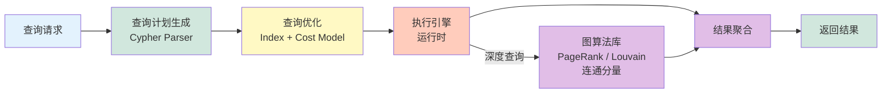

| 组件 | 技术选型 | 说明 |
| --- | ------- | ---- |
| **查询语言** | Cypher | Neo4j 原生查询语言 |
| **查询优化器** | Cost-based Optimizer | 基于统计信息选择最优执行计划 |
| **图算法库** | Neo4j Graph Data Science (GDS) | PageRank、Louvain、连通分量等 |
| **索引** | Composite Index + Range Index | 支持多字段组合查询 |

---

## 5. 接口设计

### 5.1 REST API

| 方法 | 路径 | 说明 | 响应 |
| ---- | ---- | ---- | ---- |
| **GET** | `/api/v1/topology/nodes` | 查询节点列表 | NodeList |
| **GET** | `/api/v1/topology/nodes/{id}` | 查询单个节点 | Node |
| **GET** | `/api/v1/topology/edges` | 查询边列表 | EdgeList |
| **POST** | `/api/v1/topology/query/path` | 路径查询 | Path[] |
| **POST** | `/api/v1/topology/query/neighbors` | 邻居查询 | Node[] |
| **POST** | `/api/v1/topology/query/subgraph` | 子图查询 | Graph |
| **POST** | `/api/v1/topology/analyze` | 拓扑分析 | AnalyzeResult |
| **GET** | `/api/v1/topology/stats` | 拓扑统计 | TopologyStats |
| **POST** | `/api/v1/topology/sync/trigger` | 手动触发同步 | SyncJob |

### 5.2 gRPC 接口

| 服务 | 方法 | 说明 | 场景 |
| ---- | ---- | ---- | ---- |
| **TopologyService** | GetNode | 获取单个节点 | 故障研判上下文 |
| **TopologyService** | FindPath | 路径查询 | 根因分析传播路径 |
| **TopologyService** | GetNeighbors | 邻居查询 | 影响分析 |
| **TopologyService** | GetSubGraph | 子图查询 | 服务拓扑大图 |
| **TopologyService** | AnalyzeGraph | 拓扑分析 | PageRank / 社区发现 |
| **TopologyService** | SyncTopology | 触发全量同步 | 管理面操作 |

### 5.3 Kafka 事件流

| Topic | 事件类型 | Payload | 消费者 |
| ----- | ------- | ------- | ------ |
| `topology.node.created` | 节点创建 | NodeCreatedEvent | 认知网络、智能感知 |
| `topology.node.updated` | 节点更新 | NodeUpdatedEvent | 认知网络、智能感知 |
| `topology.node.deleted` | 节点删除 | NodeDeletedEvent | 认知网络、智能感知 |
| `topology.edge.created` | 边创建 | EdgeCreatedEvent | 认知网络、根因分析 |
| `topology.edge.updated` | 边更新 | EdgeUpdatedEvent | 认知网络、根因分析 |
| `topology.sync.completed` | 同步完成 | SyncCompletedEvent | 监控告警 |

### 5.4 接口质量指标

| 指标 | SLO 目标 | 告警阈值 |
| ---- | ------- | -------- |
| **可用性** | 99.95% | < 99.9% |
| **节点查询延迟 P99** | < 50ms | > 100ms |
| **路径查询延迟 P99** | < 200ms | > 500ms |
| **子图查询延迟 P99** | < 1s | > 2s |
| **实时更新延迟** | < 1s | > 5s |
| **图分析延迟 P99** | < 5s | > 10s |
| **吞吐量** | > 5000 QPS | < 2000 QPS |

---

## 6. 量化指标

### 6.1 性能指标

| 指标名称 | 当前基线 | 目标值 | 测量方法 |
| -------- | -------- | ------ | -------- |
| **节点查询延迟 P99** | < 80ms | < 50ms | APM 追踪 |
| **路径查询延迟 P99** | < 300ms | < 200ms | APM 追踪 |
| **子图查询延迟 P99** | < 2s | < 1s | APM 追踪 |
| **实时更新延迟** | < 3s | < 1s | 变更时间戳差值 |
| **图分析延迟 P99** | < 10s | < 5s | 日志时间戳 |
| **全量同步时间** | < 45min | < 30min | 同步任务日志 |
| **API 吞吐量** | > 3000 QPS | > 5000 QPS | Prometheus metrics |

### 6.2 准确指标

| 指标名称 | 当前基线 | 目标值 | 测量方法 |
| -------- | -------- | ------ | -------- |
| **实体覆盖率** | 90% | > 98% | 与 CMDB 对比 |
| **关系准确率** | 92% | > 97% | 人工抽检验证 |
| **数据一致性** | 95% | 99.5% | 多源交叉验证 |
| **重复实体率** | < 3% | < 0.5% | ID 去重分析 |
| **孤立节点率** | < 5% | < 2% | 图分析算法 |

### 6.3 可用指标

| 指标名称 | 当前基线 | 目标值 | 测量方法 |
| -------- | -------- | ------ | -------- |
| **系统可用性** | 99.5% | 99.95% | 正常运行时间统计 |
| **数据完整性** | 99% | 99.99% | 缺失数据比率监控 |
| **事件丢失率** | < 0.1% | < 0.01% | Kafka 消费位点校验 |
| **Neo4j 可用性** | 99.9% | 99.99% | 健康检查 |
| **同步成功率** | 95% | > 99% | 同步任务结果统计 |

---

## 7. 部署架构

### 7.1 K8s 部署架构

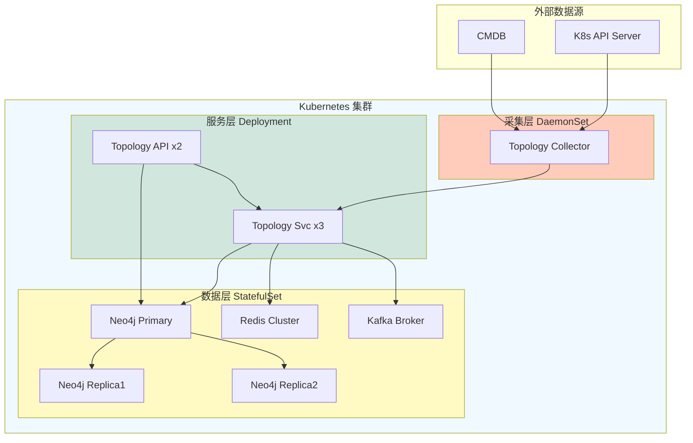

### 7.2 资源配置

| 组件 | 副本数 | CPU | Memory | Storage |
| ---- | ------ | --- | ------ | ------- |
| **Topology Service** | 3 | 2 核 | 4Gi | — |
| **Topology API** | 2 | 1 核 | 2Gi | — |
| **Topology Collector** | DaemonSet | 0.5 核 | 512Mi | — |
| **Neo4j** | 3（1 主 2 从） | 4 核 | 16Gi | 500Gi SSD |
| **Redis Cluster** | 3 | 2 核 | 8Gi | 10Gi |
| **Kafka Broker** | 3 | 2 核 | 4Gi | 100Gi SSD |

### 7.3 高可用设计

| 高可用策略 | 实现方式 | 故障切换时间 |
| --------- | -------- | ----------- |
| **Neo4j 高可用** | 因果集群（Causal Cluster）1 主 2 从 | < 30s |
| **Redis 高可用** | Cluster 模式 + 自动故障转移 | < 10s |
| **Kafka 高可用** | 3 副本 + ISR | < 30s |
| **服务高可用** | K8s HPA + 就绪探针 + 存活探针 | < 60s |
| **数据备份** | Neo4j 定时快照 + 异地备份 | 每日 03:00 |

---

## 8. 本章小结

### 8.1 核心要点速记

**5 个关键认知：**

1. **拓扑是平台的数字底盘** — 为所有上层智能分析模块提供拓扑数据服务
2. **实体 + 关系 + 属性统一模型** — 覆盖物理层、逻辑层、实例层、运行时层全层级
3. **图数据库 + 时序数据库 + Kafka** — 三种存储引擎各司其职（图谱/变更/事件）
4. **实时增量 + 定时全量双轨更新** — 保证数据新鲜度和完整性
5. **变更事件驱动上游模块** — 通过 Kafka 事件总线实现模块间松耦合

**4 个架构目标：**

| 目标 | 描述 | 量化指标 |
| ---- | ---- | -------- |
| **高性能查询** | P99 节点查询 < 50ms | 路径查询 < 200ms |
| **高覆盖率** | 实体覆盖率 > 98% | 关系准确率 > 97% |
| **强一致性** | 数据一致性 99.5% | 事件丢失率 < 0.01% |
| **高可用** | 系统可用性 99.95% | 故障切换 < 60s |

### 8.2 接口矩阵

| 接口类型 | 数量 | 关键接口 |
| -------- | ---- | -------- |
| **REST API** | 9 个 | 节点查询、路径查询、子图查询、拓扑分析 |
| **gRPC** | 6 个 | GetNode、FindPath、GetNeighbors、AnalyzeGraph |
| **Kafka Topic** | 6 个 | 节点创建/更新/删除、边创建/更新、同步完成 |

### 8.3 关键成功要素

| 要素 | 说明 | 优先级 |
| ---- | ---- | ------ |
| **多源数据汇聚** | CMDB、K8s、Service Mesh、Prometheus 多源融合 | P0 |
| **实体 ID 统一** | 跨数据源的实体 ID 映射与去重 | P0 |
| **实时更新延迟** | 拓扑变更到上层感知 < 1s | P1 |
| **查询性能** | P99 节点查询 < 50ms、路径查询 < 200ms | P1 |
| **高可用架构** | Neo4j 因果集群 + Redis Cluster + Kafka 多副本 | P1 |
| **图分析算法** | PageRank、中心性、社区发现、故障传播 | P2 |

### 8.4 本章思考

> 以下问题供设计评审和团队讨论时使用，旨在检验对拓扑建模模块的理解深度。

**基础问题：**

1. 拓扑建模模块为什么选择「属性图」模型而非「资源-关系」ER 模型？两种模型在运维场景中的本质差异是什么？
2. 如果 CMDB 和 K8s 对同一台主机的 IP 地址返回不同值，应按什么策略处理？什么场景下应该自动合并，什么场景下必须人工介入？
3. 全量同步中断超过 1 小时后恢复，如何确保中间发生的增量变更不丢失、不重复？

**进阶问题：**

4. 在大规模集群（10 万+ 节点）下，实时路径查询（`MATCH path = (a)-[:calls*1..5]-(b)`）的性能瓶颈在哪里？如何通过图分区或索引优化？
5. 如果 Service Mesh 数据出现环路依赖（Service A → B → C → A），拓扑建模模块应如何处理？是自动断路还是报错给上层？
6. 「故障传播路径分析」与「影响范围分析」的本质区别是什么？在图查询层面分别对应什么算法？

**反模式自查：**

- ❌ **全量查询**：每次故障都查全图 — 正确做法是使用子图查询 + 缓存
- ❌ **贫瘠属性**：只存 ID 不存属性 — 每次都需要回查数据源
- ❌ **滞后同步**：仅靠定时全量同步 — 关键变更的分钟级延迟可能导致误告警
- ❌ **无主数据源**：每个数据源都视为权威 — 必须建立数据源优先级链

---

> 本章定义了 Observable Ops 平台拓扑建模模块的详细设计规范。模块 02 作为数据基础设施，为模块 04-11 提供拓扑数据服务，是整个平台的核心数据底盘。

*文档版本：V1.1 | 更新日期：2026-06-08*
