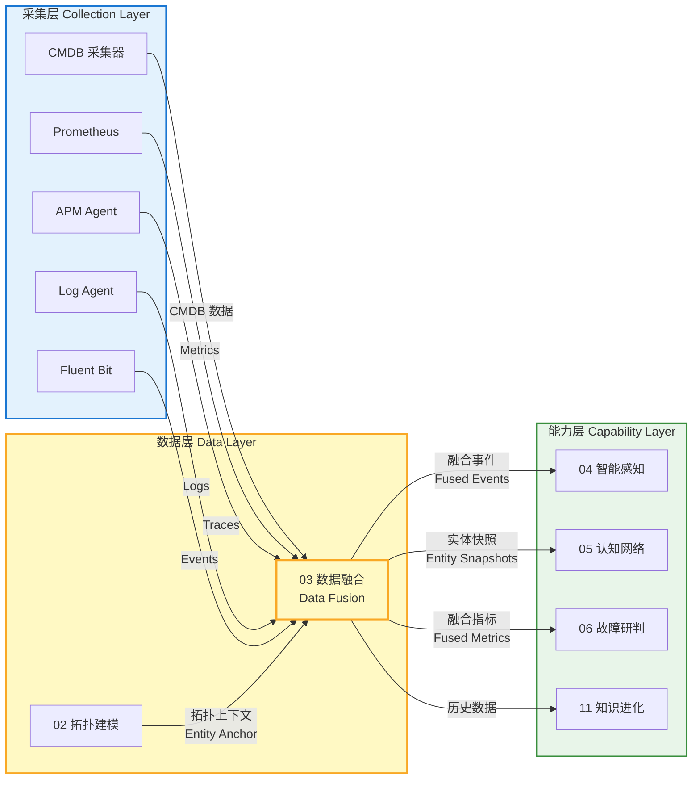
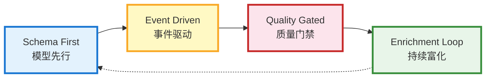
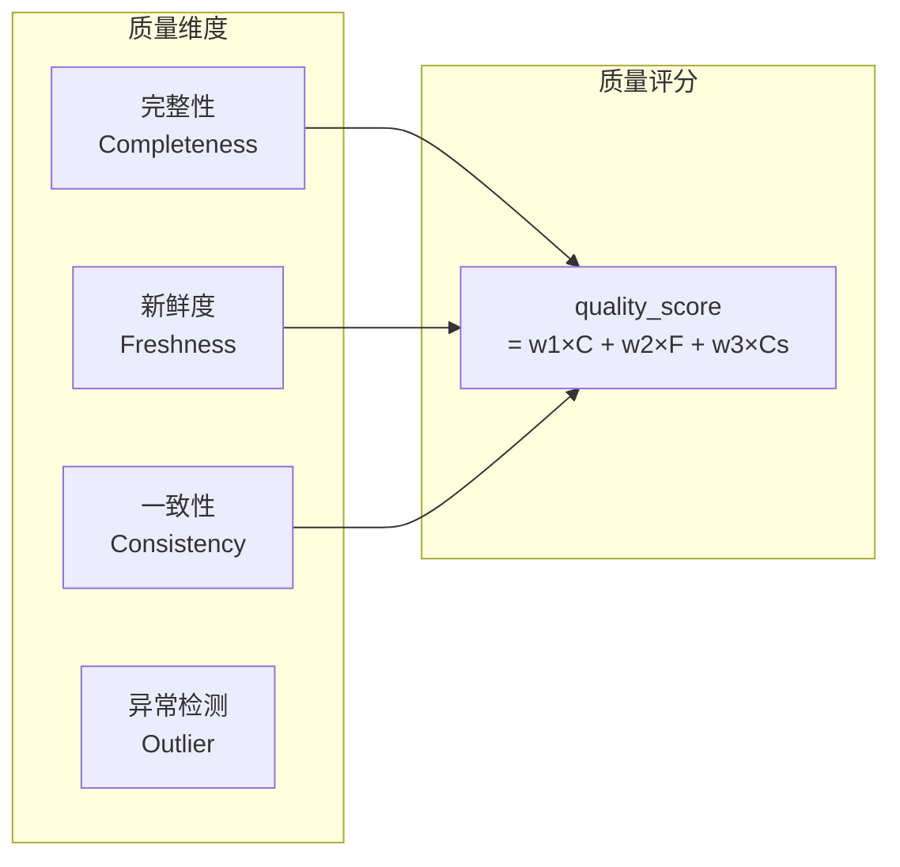
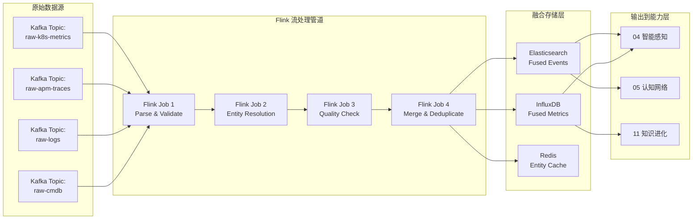
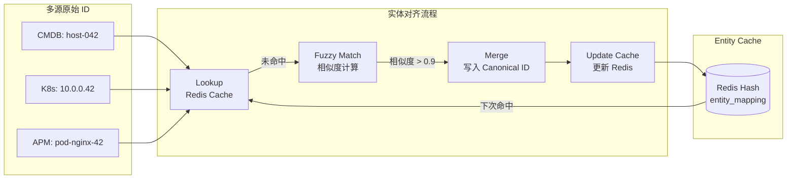
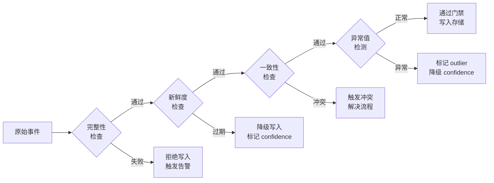
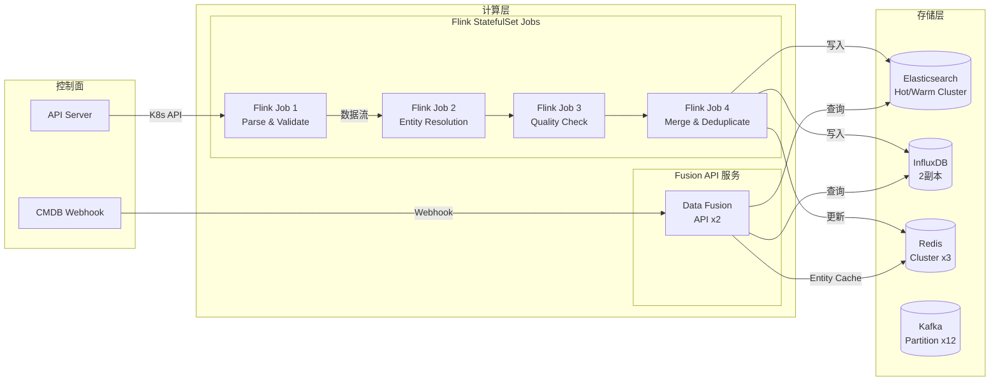

# 模块 03 · 数据融合

> 数据融合是 Observable Ops 的「数据中枢」——将来自采集层的原始指标、日志、追踪、事件进行统一建模、质量治理与融合输出，为智能感知、认知网络、故障研判等能力模块提供高质量、一致性的数据底座。

---

## 1. 模块定位与职责

### 1.1 在 4 层架构中的位置

数据融合属于**数据层**核心模块，位于采集层与能力层之间：接收采集层的原始数据，输出经过融合的高质量数据给能力层各模块使用。



### 1.2 核心职责

| 职责 | 描述 | 输出 |
|------|------|------|
| **统一数据建模** | 将指标、日志、追踪、事件四类异构数据统一为同一 Schema，支持跨类型关联查询 | 统一事件模型 |
| **多源数据接入** | 接入 CMDB / K8s / APM / Log Agent / 自定义 Exporter 等多数据源 | 标准化原始数据 |
| **数据质量治理** | 完整性检查、新鲜度检查、一致性检查、异常值检测 | 质量报告 + 清洗数据 |
| **实体对齐** | 跨数据源的同一实体（服务/主机/数据库）进行 ID 映射与消歧 | Canonical ID 映射表 |
| **冲突解决** | 多数据源对同一实体给出矛盾数据时，按优先级自动裁定 | 融合后单一数据 |
| **时序数据存储** | 高性能时序存储（Elasticsearch + InfluxDB），支持高速写入与查询 | 时序索引 |

### 1.3 核心设计原则



- **模型先行（Schema First）**：所有数据必须符合统一 Schema，禁止裸数据进入融合管道
- **事件驱动（Event Driven）**：数据流动通过 Kafka 事件驱动，避免同步批处理延迟
- **质量门禁（Quality Gated）**：数据质量不达标时拒绝写入，并触发告警
- **持续富化（Enrichment Loop）**：融合数据持续与拓扑上下文关联，持续提升数据价值

### 1.4 子模块划分

| 子模块 | 职责 | 技术选型 |
|--------|------|----------|
| Adapters 数据源适配器 | 多协议多格式数据接入（Prometheus / OTLP / HTTP / Kafka） | Flink CDC / Python Connector |
| Stream 流处理引擎 | Kafka → Flink 实时流处理，数据清洗与转换 | Apache Flink |
| Validator 数据质量验证 | 完整性/新鲜度/一致性/异常值检测 | Flink SQL / Python |
| Resolver 实体对齐器 | 跨数据源实体 ID 映射，Canonical ID 生成 | Python / Redis Hash |
| Store 时序存储引擎 | Elasticsearch 存储融合事件，InfluxDB 存储指标 | Elasticsearch / InfluxDB |
| Enricher 上下文富化器 | 融合数据与拓扑上下文关联，补充实体标签 | Flink / Python |

---

## 2. 数据模型设计

### 2.1 统一事件模型（Unified Event Schema）

数据融合的核心是统一事件模型，将指标（Metric）、日志（Log）、追踪（Trace）、告警（Alert）四种数据类型统一为同一个事件 Schema，通过 `event_type` 字段区分类型。

#### 2.1.1 统一事件字段定义

| 字段名 | 类型 | 说明 | 示例 |
|--------|------|------|------|
| `event_id` | String (UUID) | 全局唯一事件 ID | `evt-20260607-001234` |
| `event_type` | Enum | 事件类型：metric / log / trace / alert / heartbeat | `metric` |
| `timestamp` | Timestamp (ms) | 事件发生时间 | `1750000000000` |
| `canonical_entity_id` | String | 融合后统一实体 ID（来自拓扑建模） | `svc-payment-prod` |
| `source_entity_id` | String | 原始数据源中的实体 ID | `pod-nginx-42` |
| `metric_name` | String | 指标名（仅 metric 类型） | `cpu_usage_percent` |
| `value` | Float / String | 指标值或日志内容 | `85.6` |
| `source` | String | 数据来源系统 | `prometheus`, `jaeger`, `elk` |
| `confidence` | Float [0-1] | 数据可信度（ML 融合结果） | `0.95` |
| `labels` | Map&lt;String, String&gt; | 标签集合（来自拓扑的 labels + 动态标签） | `{"cluster":"prod", "region":"us-east"}` |
| `raw_payload` | JSON String | 原始数据快照（用于审计） | `{"original_field": "..."}` |
| `quality_score` | Float [0-1] | 质量评分（完整性/新鲜度/一致性综合） | `0.88` |

### 2.2 时序存储模型

#### 2.2.1 指标时序模型（InfluxDB）

| Field | 说明 | Tag（索引） | 备注 |
|-------|------|-------------|------|
| `time` | 时间戳（UTC） | —— | 主键 |
| `value` | 指标浮点值 | —— | Floats |
| `entity_id` | Canonical 实体 ID | 索引 | 查询维度 |
| `metric_name` | 指标名称 | 索引 | 查询维度 |
| `source` | 数据来源 | 索引 | Prometheus / K8s / APM |
| `cluster` | 集群名 | 索引 | 多集群场景 |

### 2.3 实体对齐模型

#### 2.3.1 Canonical ID 映射表

实体对齐的核心是维护一个 `canonical_id ↔ source_id` 的多值映射表。每个 source 可以贡献一个或多个 source_id，最终映射到同一个 Canonical ID。

| 字段 | 类型 | 说明 |
|------|------|------|
| `canonical_id` | String | 融合后的统一实体 ID（由拓扑建模生成） |
| `canonical_name` | String | 展示用标准名称 |
| `entity_type` | Enum | 实体类型：Service / Host / Database / Middleware |
| `source_mappings` | Map&lt;String, String[]&gt; | 各数据源的 ID 列表（如 `{"cmdb": ["host-042"], "k8s": ["10.0.0.42"], "apm": ["pod-42"]}`） |
| `confidence` | Float [0-1] | 对齐置信度（多源一致则高） |
| `last_updated` | Timestamp | 最后更新时间 |

#### 2.3.2 对齐规则优先级

| 规则 | 优先级 | 说明 |
|------|--------|------|
| **IP + Port 精确匹配** | P0 | IP + Port 完全一致时直接对齐 |
| **CMDB ID 精确匹配** | P0 | CMDB 实体 ID 匹配 |
| **服务名 + 集群名匹配** | P1 | Service Name + Cluster 组合唯一匹配 |
| **标签模糊匹配** | P2 | 共享标签 > 0.8 时推测为同一实体 |
| **时序相似度匹配** | P3 | 指标时序曲线相关性 > 0.9 时推测为同一实体 |

### 2.4 数据质量评分模型

每个融合事件附带 `quality_score`，综合反映数据的完整性、新鲜度和一致性。



- **完整性（Completeness）**：必填字段非空比例，低于 80% 则 quality_score 降级
- **新鲜度（Freshness）**：数据时间戳 vs 当前时间差，超过 30s  freshness=0
- **一致性（Consistency）**：多数据源对同一实体同一指标的值差异，差异 > 20% 则 consistency 降级

---

## 3. 核心功能分解

### 3.1 数据源适配器（Data Source Adapters）

#### 3.1.1 适配器类型与规格

| 适配器 | 协议 | 数据格式 | 采集频率 | 吞吐能力 |
|--------|------|----------|----------|----------|
| **CMDB Metrics Adapter** | REST API / Webhook | JSON | 每 5 分钟 | 5000 指标/批 |
| **K8s Metrics Adapter** | K8s API / Metrics Server | JSON | 每 15 秒 | 50000 指标/批 |
| **APM Traces Adapter** | OTLP / Kafka | Protobuf / JSON | 实时采样 1% | 10000 span/s |
| **Log Agent Adapter** | Fluent Bit / Filebeat | JSON Lines | 实时 | 20000 logs/s |
| **Custom Exporter Adapter** | Prometheus Scrape / HTTP Push | Prometheus format / JSON | 按需 | 10000 指标/批 |

### 3.2 流处理架构（Stream Processing）

#### 3.2.1 处理流程



#### 3.2.2 Flink 处理阶段

| 阶段 | Job 名称 | 处理逻辑 | 状态后端 |
|------|----------|----------|----------|
| S1 | Parse & Validate | JSON/Protobuf 解析，Schema 校验，必填字段检查 | RocksDB |
| S2 | Entity Resolution | 查询 Redis Entity Cache，映射 source_id → canonical_id | RocksDB |
| S3 | Quality Check | 完整性/新鲜度/一致性评分，异常值检测 | RocksDB |
| S4 | Merge & Deduplicate | 多源同指标合并，重复数据去重，冲突解决 | RocksDB |

### 3.3 数据质量验证（Data Quality Validation）

#### 3.3.1 四类质量检查

| 检查类型 | 检查内容 | 阈值 | 不达标处理 |
|----------|----------|------|------------|
| **完整性检查** | 必填字段（event_id, timestamp, entity_id, metric_name, value）非空 | 缺失率 < 5% | 拒绝写入，触发告警 |
| **新鲜度检查** | 数据时间戳与当前时间差 | 延迟 < 30s | 降级 confidence 评分，写入但标记 |
| **一致性检查** | 多数据源对同一实体的同一指标值差异 | 差异 < 20% | 触发冲突解决流程 |
| **异常值检测** | 指标值超出历史均值 ± 3σ | 无 | 标记 outlier=true，降低 confidence |

### 3.4 合并与冲突解决（Merge & Conflict Resolution）

#### 3.4.1 多源冲突解决规则

| 数据类型 | 解决策略 | 规则说明 |
|----------|----------|----------|
| **库存类数据** | CMDB 优先 | 实体属性（IP、名称、类型）以 CMDB 为准，其他数据源参考 |
| **指标类数据** | Latest Wins | 同一实体同一指标，以最新时间戳的值写入 |
| **事件类数据** | Evidence Weighted | 多数据源报告同一事件时，confidence 高的数据权重更大 |
| **追踪类数据** | APM 唯一 | 调用链拓扑以 APM 数据为准（最完整），不与其他数据源合并 |
| **日志类数据** | Append Only | 日志只追加，不去重也不冲突，所有日志均保留 |

---

## 4. API 设计规范

### 4.1 REST API

| 方法 | 路径 | 描述 | 请求体 | 响应 |
|------|------|------|--------|------|
| POST | `/api/v1/fusion/events` | 批量写入融合事件 | `Event[]` | `WriteResult` |
| GET | `/api/v1/fusion/timeseries` | 查询融合时序数据 | `?entity_id=&metric=&from=&to=` | `TimeSeries[]` |
| GET | `/api/v1/fusion/entities/{id}` | 查询实体融合详情（含所有 source） | —— | `FusedEntity` |
| GET | `/api/v1/fusion/quality/{event_id}` | 查询事件质量评分详情 | —— | `QualityReport` |
| GET | `/api/v1/fusion/sources` | 查询所有数据源状态 | —— | `SourceStatus[]` |
| PUT | `/api/v1/fusion/entities/{id}/mapping` | 手工更新实体 ID 映射 | `SourceMapping` | `MappingResult` |

### 4.2 Kafka Topics

| Topic | 数据类型 | 生产者 | 消费者 | Partition Key |
|-------|----------|--------|--------|---------------|
| `raw-metrics` | 原始指标数据 | Prometheus / K8s | Flink S1 | `entity_id` |
| `raw-logs` | 原始日志数据 | Log Agent / Fluent Bit | Flink S1 | `hostname` |
| `raw-traces` | 原始调用链追踪 | APM Agent / OTLP | Flink S1 | `trace_id` |
| `raw-events` | 原始告警/变更事件 | CMDB / Monitor | Flink S1 | `entity_id` |
| `fused.events` | 融合后事件（输出） | Flink S4 | 04 智能感知 / 05 认知网络 | `canonical_entity_id` |
| `fused.metrics` | 融合后指标（输出） | Flink S4 | 04 智能感知 / 11 知识进化 | `canonical_entity_id` |
| `fusion.quality.alert` | 质量告警事件 | Flink S3 | 告警系统 | `source` |

### 4.3 gRPC 高频摄入接口

| 服务 | 方法 | 适用场景 | 性能要求 |
|------|------|----------|----------|
| `FusionIngest` | `IngestMetrics(MetricsRequest)` | 高频指标摄入（Prometheus Remote Write） | 100,000 指标/s |
| `FusionIngest` | `IngestTraces(TraceRequest)` | 高频追踪摄入（OTLP 替代） | 50,000 span/s |

---

## 5. 数据流架构

### 5.1 整体数据流

```mermaid
flowchart LR
    subgraph Sources["数据源"]
        CMDB[CMDB]
        K8S[Kubernetes]
        APM[APM Trace]
        LOG[Log Agent]
        EXP[Custom Exporter]
    end

    subgraph Adapters["适配器层"]
        AD1[CMDB Adapter]
        AD2[K8s Adapter]
        AD3[APM Adapter]
        AD4[Log Adapter]
        AD5[Exporter Adapter]
    end

    subgraph Kafka_In["Kafka 输入层"]
        K1[raw-metrics]
        K2[raw-logs]
        K3[raw-traces]
        K4[raw-events]
    end

    subgraph Flink["Flink 流处理"]
        F1[Parse & Validate]
        F2[Entity Resolution]
        F3[Quality Check]
        F4[Merge & Deduplicate]
    end

    subgraph Stores["融合存储"]
        ES[Elasticsearch<br/>Fused Events]
        INF[InfluxDB<br/>Fused Metrics]
        RD[Redis<br/>Entity Cache]
    end

    subgraph Downstream["下游能力模块"]
        A4[04 智能感知]
        A5[05 认知网络]
        A6[06 故障研判]
        A11[11 知识进化]
    end

    Sources --> Adapters
    Adapters --> Kafka_In
    Kafka_In --> Flink
    Flink --> Stores
    Stores --> Downstream
```



### 5.2 实体对齐流程



### 5.3 质量门禁流程



---

## 6. 模块协作关系

### 6.1 依赖矩阵

| 模块 | 依赖数据融合的什么 | 依赖类型 | 接口方式 |
|------|-------------------|----------|----------|
| **02 拓扑建模** | 提供 Entity Anchor（拓扑实体 ID 和 labels），作为数据融合的上下文锚点 | 数据依赖 | Neo4j 查询 / Kafka 事件 |
| **04 智能感知** | 消费融合后的 `fused.events` Kafka 流，进行实时异常检测 | 数据依赖 | Kafka 订阅 fused.events |
| **05 认知网络** | 接收融合后的实体快照（Entity Snapshot），构建知识图谱节点 | 数据依赖 | Kafka 订阅 fused.events |
| **06 故障研判** | 查询融合时序数据（Elasticsearch / InfluxDB）作为诊断上下文 | 数据依赖 | REST 查询 / Kafka |
| **11 知识进化** | 接收历史融合数据快照，用于知识库积累和模式学习 | 数据依赖 | Kafka 订阅 fused.metrics |
| **07 根因分析** | 查询融合时序数据和事件关联，进行传播路径分析 | 数据依赖 | REST / gRPC |
| **Dashboard** | 查询融合后的时序数据进行可视化展示 | 数据依赖 | REST 查询 |

### 6.2 输入接口契约

#### 6.2.1 融合事件输出格式

```
{
  "event_id": "evt-20260607-001234",
  "event_type": "metric",
  "timestamp": 1750000000000,
  "canonical_entity_id": "svc-payment-prod",
  "source_entity_ids": {
    "cmdb": "host-042",
    "k8s": "10.0.0.42",
    "apm": "pod-nginx-42"
  },
  "metric_name": "cpu_usage_percent",
  "value": 85.6,
  "source": "k8s",
  "confidence": 0.95,
  "labels": {
    "cluster": "prod",
    "region": "us-east-1",
    "owner_team": "payment-team"
  },
  "quality_score": 0.88,
  "outlier": false,
  "raw_payload": "{\"original_value\": 85.6}"
}
```

### 6.3 实战场景：常见数据融合问题

| 场景 | 问题描述 | 处理方式 |
|------|----------|----------|
| **指标重复上报** | Prometheus 和 K8s Metrics Server 都在上报 `payment-svc` 的 CPU 使用率，数值略有不同 | Flink S4 按 Latest Wins 策略取最新值，标记 source 为 `k8s+prometheus` |
| **实体 ID 漂移** | Pod 重启后 K8s 分配了新的 Pod IP，CMDB 还没有更新 | Fuzzy Match 根据 service_name + cluster 做标签匹配触发对齐，更新 Canonical ID 映射 |
| **日志时间戳倾斜** | Log Agent 所在节点时钟偏移，日志时间戳比实际晚 2 分钟 | Freshness 检查标记该批次为过期数据，降级 confidence 到 0.6，通知运维修复时钟 |
| **Schema 变更不兼容** | 上游 APM 升级后新增了 `span.kind` 必填字段，旧版 Flink Job 无法解析 | Schema 校验拒绝不合规数据 → 触发告警 → Flink Job 热加载新 Schema |
| **数据源故障恢复** | CMDB 宕机 30 分钟后恢复，积压了大量变更事件需要追写入 | Kafka 消费积压检测 → Flink 自动降级为批处理模式（batch size 增大，checkpoint 间隔缩小）→ 积压消化后恢复实时 |

---

## 7. 量化指标体系

### 7.1 数据质量指标

| 指标 | 描述 | 基线（当前） | 目标 | 测量方式 |
|------|------|-------------|------|----------|
| **数据完整性** | 必填字段非空比例 | 88% | > 98% | Flink S3 完整性检查 |
| **数据新鲜度** | 数据从产生到写入的平均延迟 | 45s | < 30s | timestamp vs write_time 差值 |
| **数据准确率** | 融合数据与真实值偏差在可接受范围内的比例 | 85% | > 95% | 人工抽检 + 设备比对 |
| **冲突解决率** | 多数据源冲突被正确（按规则）解决的比例 | 72% | > 90% | 冲突日志抽样审计 |
| **实体对齐率** | 成功对齐到 Canonical ID 的原始 ID 比例 | 80% | > 95% | Redis mapping 命中率 |

### 7.2 处理性能指标

| 指标 | 描述 | SLO 目标 | 告警阈值 |
|------|------|----------|----------|
| **处理延迟 P99** | 数据从 Kafka 摄入到写入存储的端到端延迟 | < 5s | > 10s |
| **写入吞吐量** | 融合事件写入 Elasticsearch 的速率 | > 50,000/s | < 30,000/s |
| **指标摄入吞吐** | Prometheus 指标摄入速率 | > 100,000/s | < 80,000/s |
| **Flink Job 故障率** | Flink 流处理作业异常重启比例 | < 0.1% | > 0.5% |

### 7.3 容量规划指标

| 资源 | 当前使用 | 规格上限 | 扩容触发阈值 |
|------|----------|----------|--------------|
| **Elasticsearch 存储** | 100GB / 500GB | 500GB | 80% |
| **InfluxDB 存储** | 200GB / 800GB | 800GB | 80% |
| **Redis Entity Cache** | 4GB / 16GB | 16GB | 70% |
| **Kafka 吞吐量** | 30,000 msg/s | 100,000 msg/s | 70% |

---

## 8. 部署架构

### 8.1 K8s 部署拓扑



### 8.2 资源配置

| 组件 | 副本数 | CPU | 内存 | 存储 | 备注 |
|------|--------|-----|------|------|------|
| **Flink Job 1-4** | 各 2（TaskManager） | 8 核 / TM | 16 GB / TM | —— | StatefulSet，TM Pool 共享 |
| **Fusion API** | 2（主备） | 4 核 | 8 GB | —— | StatefulSet，PDB 允许 1 故障 |
| **Elasticsearch Hot** | 3 节点 | 8 核 | 32 GB | 200 GB SSD | Hot 节点处理写入 |
| **Elasticsearch Warm** | 2 节点 | 8 核 | 32 GB | 500 GB HDD | Warm 节点存储历史 |
| **InfluxDB** | 1 主 + 1 从 | 8 核 | 32 GB | 800 GB SSD | 时序指标存储 |
| **Redis Cluster** | 3 节点 | 4 核 | 16 GB | —— | Entity Cache + 映射表 |
| **Kafka** | 3 Broker | 8 核 | 32 GB | 1 TB SSD | 12 Partition，副因子 3 |

### 8.3 高可用设计

- **Flink Checkpoint**：流处理状态每 30s Checkpoint 到 HDFS，S3 故障恢复
- **Kafka 消费隔离**：每个 Flink Job 独立 Consumer Group，单 Job 故障不影响其他
- **Elasticsearch 多副本**：Hot 节点 3 副本，任意 1 节点故障不丢失数据
- **Redis Entity Cache**：Cluster 模式，3 节点任意 1 节点故障 Cache 部分失效可接受
- **InfluxDB 连续查询**：Downsample 数据保留策略（1s → 1min → 1h）

---

## 9. 本章小结

### 9.1 核心要点

| 维度 | 核心要点 | 量化目标 |
|------|----------|----------|
| **定位** | 数据层核心模块，采集层与能力层之间的数据中枢 | —— |
| **模型** | 统一事件 Schema，融合 metric/log/trace/alert 四类数据 | 完整性 > 98% |
| **能力** | Schema First / 事件驱动 / 质量门禁 / 持续富化四大原则 | 新鲜度 < 30s |
| **接口** | REST + gRPC + Kafka，覆盖同步/异步/高频摄入场景 | 处理延迟 P99 < 5s |
| **质量** | 完整性/新鲜度/一致性/异常值四维质量评分 | 准确率 > 95% |

### 9.2 关键成功要素

| 要素 | 优先级 | 实施策略 |
|------|--------|----------|
| **Schema 验证入 CI** | P0 | 所有入库数据强制 Schema 校验，Flink Job 启动时拒绝不合规数据 |
| **多源合并策略落地** | P1 | CMDB 优先解决库存冲突，Latest Wins 处理指标，覆盖率目标 90% |
| **ML 富化能力建设** | P2 | 构建实体对齐 ML 模型，替代规则匹配，持续提升对齐率 |

### 9.3 模块边界

| 边界 | 说明 |
|------|------|
| **vs 02 拓扑建模** | 拓扑建模负责「结构」（实体-关系），数据融合负责「内容」（指标/日志/追踪融合），数据融合消费拓扑上下文作为 Entity Anchor |
| **vs 04 智能感知** | 数据融合输出「融合后的干净数据」，智能感知消费融合数据做异常检测，两者边界是「数据质量」vs「检测逻辑」 |
| **vs 11 知识进化** | 数据融合负责「实时数据融合」，知识进化负责「历史数据积累」，知识进化消费数据融合的输出作为知识原料 |

### 9.4 本章思考

> 以下问题供设计评审和团队讨论时使用。

**基础问题：**

1. 统一事件 Schema 中 `quality_score` 和 `confidence` 两个字段的区别是什么？为什么需要同时保留？
2. 如果 Prometheus 和 APM 对同一服务的同一指标的同一时刻返回了不同值（80% vs 85%），冲突解决应该优先哪个数据源？判断依据是什么？
3. 实体对齐中「标签模糊匹配」阈值为 0.8，这个阈值如何确定？过高或过低会带来什么问题？

**进阶问题：**

4. Flink 流处理采用 4 个独立 Job 串联而非 1 个 Job 内含 4 个 Operator，这种设计考虑了什么权衡？（提示：故障隔离 / 扩缩容粒度 / 状态后端）
5. 质量门禁拒绝写入的数据直接在 Kafka 丢弃是否合理？如果这些数据事后发现其实是因为 Schema 定义有误，你如何设计「数据救回」机制？
6. 数据融合模块如何避免成为「单点瓶颈」？在 100 万指标/秒的极端场景下，哪个组件会最先达到性能拐点？

**反模式自查：**

- ❌ **万能 Schema**：一个 Schema 试图覆盖所有场景 → 导致字段过多、大部分为空、查询性能差
- ❌ **对齐即信任**：实体对齐后不再验证 → source 漂移导致 Canonical ID 映射过期但不自知
- ❌ **门禁即丢弃**：质量不合格的数据直接丢弃 → 可能丢失关键故障信号，应降级写入并标记
- ❌ **无降级预案**：Flink 或 Kafka 故障时整个数据管道停摆 → 应设计本地缓冲 + 故障恢复重放机制

---

> 本章定义了模块 03 数据融合的详细功能设计规范。后续章节将阐述智能感知（04）、认知网络（05）、故障研判（06）等能力模块的设计细节。

*文档版本：V1.1 | 更新日期：2026-06-08*
