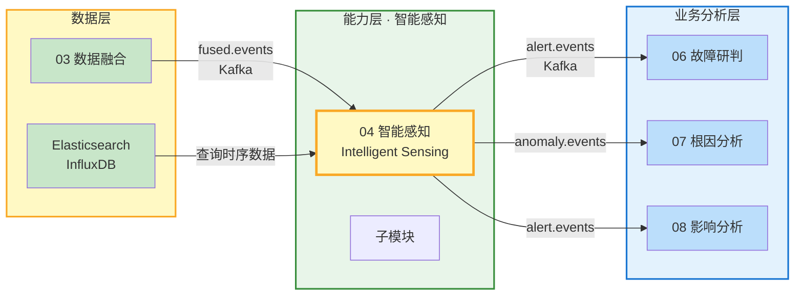
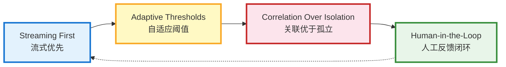
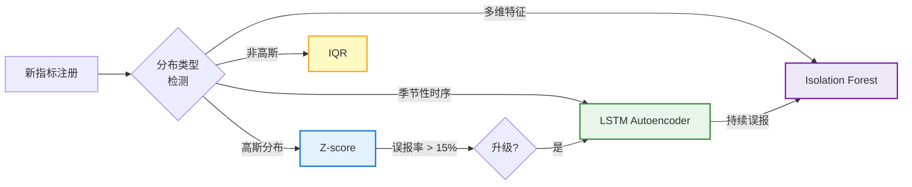
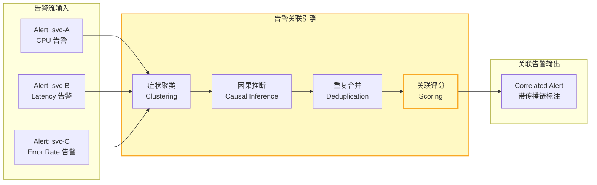
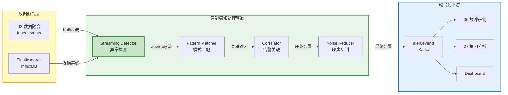
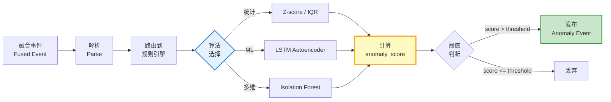
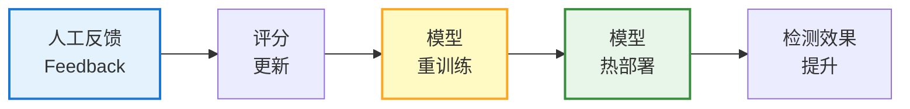
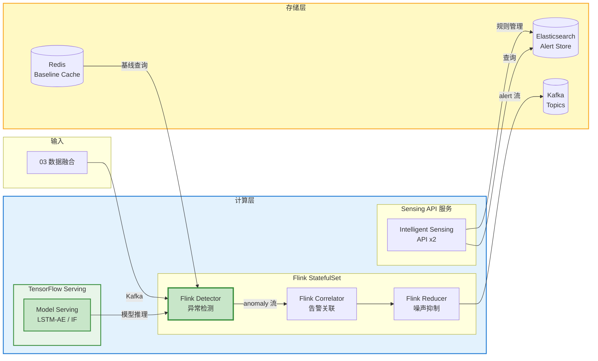

# 模块 04 · 智能感知

> 智能感知是 Observable Ops 的「异常雷达」——通过多维度实时分析，识别系统运行中的异常模式、告警噪声和关联故障，将海量原始监控数据转化为可操作的高质量告警事件，输出给故障研判模块。

---

## 📑 目录

### 章节导航

- 1. 模块定位与职责
- 2. 感知数据模型
- 3. 核心功能分解
- 4. API 设计规范
- 5. 数据流架构
- 6. 模块协作关系
- 7. 量化指标体系
- 8. 部署架构
- 9. 本章小结

---

## 1. 模块定位与职责

### 1.1 在 4 层架构中的位置

智能感知属于**能力层**核心模块，位于数据层与业务分析层之间：接收数据融合后的高质量融合事件，进行实时异常检测与告警压缩，输出研判友好的告警事件给故障研判模块。



### 1.2 核心职责

| 职责 | 描述 | 输出 |
|------|------|------|
| **实时异常检测** | 对融合指标进行流式异常检测，识别指标偏离正常基线的行为 | Anomaly Event |
| **模式学习** | 从历史数据中学习正常基线，处理周期性/季节性特征，检测概念漂移 | Baseline Model |
| **告警压缩与关联** | 将同类告警聚合，识别传播链上的告警关系，过滤重复告警 | Correlated Alert |
| **噪声抑制** | 过滤非可操作告警（如计划内维护、已知无害波动），减少告警风暴 | Filtered Alert |
| **告警路由** | 根据告警类型和严重程度，自动路由到对应值班团队或自动恢复流程 | Routed Alert |

### 1.3 核心设计原则



- **流式优先（Streaming First）**：所有检测逻辑基于流处理实现，最小化检测延迟
- **自适应阈值（Adaptive Thresholds）**：告别静态阈值，基线随历史数据动态调整
- **关联优于孤立（Correlation Over Isolation）**：单点异常不如多点关联异常重要，关联检测减少误报
- **人工反馈闭环（Human-in-the-Loop）**：告警收敛结果可被人工修正，修正结果反哺模型迭代

### 1.4 子模块划分

| 子模块 | 职责 | 技术选型 |
|--------|------|----------|
| **Detector** 异常检测引擎 | 流式异常检测（统计 + ML），输出 anomaly_score | Flink / TensorFlow Serving |
| **Pattern Learner** 模式学习器 | 基线构建、季节性检测、概念漂移检测 | Python / Prophet / LSTM |
| **Correlator** 告警关联器 | 症状聚类、因果关联、指标组合关联 | Flink / Redis Graph |
| **Noise Reducer** 噪声抑制器 | 重复抑制、非可操作过滤、告警路由 | Flink / Python |
| **Rule Engine** 规则引擎 | 规则管理与执行，支持条件-告警映射 | Drools / Python |
| **Feedback Loop** 反馈闭环 | 人工反馈采集、模型在线学习 | Python / Redis |

---

## 2. 感知数据模型

### 2.1 异常评分模型（Anomaly Score Schema）

每个检测点输出的异常评分对象，是告警生成的直接输入。

| 字段 | 类型 | 说明 | 示例 |
|------|------|------|------|
| `anomaly_id` | String (UUID) | 异常事件唯一 ID | `ano-20260607-001` |
| `node_id` | String | 发生异常的实体 ID（Canonical ID） | `svc-payment-prod` |
| `timestamp` | Timestamp (ms) | 异常检测时间 | `1750000000000` |
| `metric_name` | String | 异常指标名 | `cpu_usage_percent` |
| `score` | Float [0-1] | 异常评分（越高越异常） | `0.92` |
| `severity` | Enum | 严重程度：CRITICAL / HIGH / MEDIUM / LOW / INFO | `HIGH` |
| `baseline` | Float | 基线值（正常期望值） | `65.0` |
| `deviation` | Float | 偏离值（当前值 - 基线值） | `+20.6` |
| `algorithm` | String | 检测算法名称 | `Z-score`, `LSTM-AE` |
| `window_size` | Integer | 检测窗口大小（分钟） | `5` |
| `confidence` | Float [0-1] | 检测置信度 | `0.88` |

### 2.2 告警模板模型（Alert Template Schema）

| 字段 | 类型 | 说明 |
|------|------|------|
| `name` | String | 告警名称（唯一标识） |
| `description` | String | 告警描述（人类可读） |
| `condition` | String | 触发条件表达式 |
| `threshold_expr` | String | 阈值表达式，如 `score > 0.8 AND duration > 2min` |
| `severity_mapping` | Map | 条件满足时的严重程度映射 |
| `labels` | Map&lt;String, String&gt; | 告警附加标签 |
| `cooldown_minutes` | Integer | 告警冷却时间（分钟），防止同一告警重复触发 |

### 2.3 检测规则模型（Detection Rule Model）

| 字段 | 类型 | 说明 |
|------|------|------|
| `rule_id` | String | 规则唯一 ID |
| `name` | String | 规则名称 |
| `metric_set` | String[] | 规则涉及的指标集合 |
| `entity_filter` | Map | 实体过滤条件（如 `{"labels.cluster": "prod"}`） |
| `algorithm` | Enum | 检测算法：Z-score / IQR / LSTM-AE / Isolation-Forest / Propagation |
| `params` | JSON | 算法参数字典 |
| `active` | Boolean | 规则是否启用 |
| `owner_team` | String | 负责团队 |

---

## 3. 核心功能分解

### 3.1 异常检测算法（Anomaly Detection Algorithms）

#### 3.1.1 算法类型与适用场景

| 算法类别 | 算法名称 | 适用指标类型 | 优点 | 延迟 |
|----------|----------|--------------|------|------|
| **统计方法** | Z-score | 高斯分布指标（CPU/内存） | 实时、可解释性强 | < 1s |
| **统计方法** | IQR（四分位距） | 非高斯分布指标 | 鲁棒、对极端值不敏感 | < 1s |
| **ML 方法** | LSTM Autoencoder | 多指标联合检测，季节性指标 | 捕获时序依赖，误报率低 | < 5s |
| **ML 方法** | Isolation Forest | 多维特征空间异常点检测 | 无需标注，适合高维数据 | < 2s |
| **拓扑感知** | Propagation Based | 传播类故障（网络/服务级联） | 结合拓扑结构，定位传播源 | < 3s |

#### 3.1.2 算法选择策略



### 3.2 模式学习（Pattern Learning）

#### 3.2.1 基线构建

| 阶段 | 窗口大小 | 方法 | 更新频率 |
|------|----------|------|----------|
| **冷启动基线** | 7 天历史数据 | Moving Average + 标准差 | 一次性构建 |
| **滚动基线** | 7 天滚动窗口 | 指数加权移动平均（EWMA） | 每日更新 |
| **实时基线** | 1 小时滑动窗口 | 在线学习更新 | 每小时微调 |

#### 3.2.2 季节性处理

| 季节性类型 | 周期 | 检测方法 | 处理策略 |
|------------|------|----------|----------|
| **小时级季节性** | 1 小时 | 傅里叶变换 / Prophet | 每小时的独立基线 |
| **日级季节性** | 24 小时 | Prophet / SARIMA | 按小时聚合同比 |
| **周级季节性** | 7 天 | Prophet | 工作日/周末独立基线 |

#### 3.2.3 概念漂移检测

当系统正常行为模式发生永久性变化时（如上线新版本、架构调整），检测模型需要适应这种变化：

- **DDM（Drift Detection Method）**：监控错误率，错误率上升超过阈值时触发模型重训
- **ADWIN**：自适应滑动窗口，窗口内数据分布变化时触发告警
- **人工触发**：重大变更（发布/配置变更）后人工触发的模型重训练

### 3.3 告警关联（Alert Correlation）

#### 3.3.1 关联类型

| 关联类型 | 方法 | 输入 | 输出 |
|----------|------|------|------|
| **相似告警聚合** | 标签相似度 + 时间窗口 | 同一实体 / 相似标签的多个告警 | 压缩为 1 个告警（保留最高 severity） |
| **因果传播关联** | 拓扑路径 + 时序因果（Granger Causality） | 传播链上 A→B→C 的告警序列 | 识别根因告警（A）和派生告警（B/C） |
| **多指标组合关联** | 主成分分析 + 关联规则挖掘 | 多个指标同时异常 | 识别共同根因（如 CPU+Memory+Disk 同时高） |

#### 3.3.2 关联流程



### 3.4 噪声抑制（Noise Reduction）

#### 3.4.1 噪声类型与处理策略

| 噪声类型 | 识别方法 | 处理策略 |
|----------|----------|----------|
| **重复告警** | 相同 entity_id + metric_name + 5min 时间窗口 | 合并为 1 条，保留最高 severity |
| **计划内维护** | 维护窗口时间匹配 + 变更记录关联 | 静默（不发送，也不计入告警量） |
| **已知无害波动** | 历史标记为"误报"的同类告警 | 自动降级 severity 或静默 |
| **探针/测试数据** | entity_id 包含 test / probe / canary 标签 | 降级为 INFO 级别，不进入研判 |

#### 3.4.2 告警路由规则

| 条件 | 路由目标 | 路由方式 |
|------|----------|----------|
| severity = CRITICAL 且 entity_type = Service | 值班 On-Call（PagerDuty） | 立即触发 |
| severity = HIGH 且 has_auto_recovery = true | 自动恢复流程（09 自动执行） | 自动创建执行任务 |
| severity ≤ MEDIUM 且持续 > 30min | 工单系统（JIRA / 飞书） | 自动创建工单 |
| entity_type = Database 且 severity ≥ HIGH | DBA 值班 | 立即触发 |

---

## 4. API 设计规范

### 4.1 REST API

| 方法 | 路径 | 描述 | 请求体 | 响应 |
|------|------|------|--------|------|
| GET | `/api/v1/sensing/alerts` | 查询告警列表（支持过滤/分页） | `?severity=&entity=&from=&to=&status=` | `Alert[]` |
| GET | `/api/v1/sensing/alerts/{id}` | 查询单个告警详情（含关联信息） | —— | `AlertDetail` |
| GET | `/api/v1/sensing/anomalies` | 查询异常事件列表 | `?entity=&from=&to=` | `Anomaly[]` |
| GET | `/api/v1/sensing/rules` | 查询检测规则列表 | —— | `Rule[]` |
| POST | `/api/v1/sensing/rules` | 创建检测规则 | `Rule` | `Rule（已创建）` |
| PUT | `/api/v1/sensing/rules/{id}` | 更新检测规则 | `Partial Rule` | `Rule（已更新）` |
| PUT | `/api/v1/sensing/alerts/{id}/feedback` | 提交告警反馈（误报/正确/升级） | `Feedback` | `200 OK` |

### 4.2 Kafka Topics

| Topic | 数据类型 | 生产者 | 消费者 |
|-------|----------|--------|--------|
| `sensing.anomaly.detected` | 检测到的异常事件 | Flink Detector | 告警关联器 / 06 故障研判 |
| `sensing.alert.correlated` | 关联压缩后的告警 | Flink Correlator | 告警路由 / 06 故障研判 |
| `sensing.alert.filtered` | 过滤后的最终告警 | Flink Noise Reducer | 值班系统 / 飞书 / PagerDuty |
| `sensing.feedback.received` | 人工反馈事件 | API 层 | Feedback Loop / 11 知识进化 |

### 4.3 Webhook（外部告警摄入）

| 场景 | Webhook URL | 格式 | 说明 |
|------|-------------|------|------|
| 外部监控告警摄入 | `/api/v1/sensing/webhook/alert` | JSON | 接收 Prometheus / Grafana 等外部告警 |
| 变更事件触发 | `/api/v1/sensing/webhook/change` | JSON | 接收变更事件，自动调整基线 |

---

## 5. 数据流架构

### 5.1 整体数据流



### 5.2 检测流程



### 5.3 反馈闭环流程



---

## 6. 模块协作关系

### 6.1 依赖矩阵

| 模块 | 依赖智能感知的什么 | 依赖类型 | 接口方式 |
|------|-------------------|----------|----------|
| **03 数据融合** | 消费融合后的 fused.events 流作为检测输入 | 数据依赖 | Kafka 订阅 fused.events |
| **06 故障研判** | 消费智能感知输出的 alert.events，进行故障分类与研判 | 数据依赖 | Kafka 订阅 alert.events |
| **07 根因分析** | 消费 anomaly.events，结合拓扑进行传播路径分析 | 数据依赖 | Kafka 订阅 anomaly.detected |
| **08 影响分析** | 查询告警列表，了解当前告警态势 | 数据依赖 | REST 查询 |
| **09 智能决策** | 查询告警上下文，辅助决策判断 | 数据依赖 | REST 查询 |
| **11 知识进化** | 消费 feedback 事件，更新知识库和模型配置 | 数据依赖 | Kafka 订阅 feedback.received |

### 6.2 输出接口契约

#### 6.2.1 关联告警输出格式

```
{
  "alert_id": "alert-20260607-001",
  "alert_name": "Payment Service CPU 超限",
  "severity": "HIGH",
  "status": "firing",
  "entity_id": "svc-payment-prod",
  "fired_at": 1750000000000,
  "correlated_anomalies": [
    {
      "anomaly_id": "ano-001",
      "metric_name": "cpu_usage_percent",
      "score": 0.92,
      "baseline": 65.0,
      "deviation": "+20.6"
    }
  ],
  "correlated_alerts": ["alert-002", "alert-003"],
  "propagation_chain": ["svc-payment → svc-order → db-001"],
  "suggested_action": "检查 Payment 服务 CPU 飙升原因",
  "auto_recovery_available": true,
  "feedback_count": 0
}
```

---

## 7. 量化指标体系

### 7.1 检测效果指标

| 指标 | 描述 | 基线（当前） | 目标 | 测量方式 |
|------|------|-------------|------|----------|
| **检测准确率** | 实际异常被正确检出的比例 | 75% | > 85% | 人工标注验证集评估 |
| **误报率（FPR）** | 正常被误判为异常的比例 | 25% | < 15% | 反馈闭环数据统计 |
| **MTTD（平均检测时间）** | 异常发生到检测出的平均时间 | 3min | < 1min | anomaly.timestamp vs 实际异常时间 |
| **告警压缩率** | 通过去重/关联减少的告警比例 | 40% | > 60% | 原始告警量 vs 最终告警量 |
| **模型迭代周期** | 模型从训练到部署的周期 | 30 天 | < 7 天 | CI/CD 流水线统计 |

### 7.2 服务质量指标

| 指标 | 描述 | SLO 目标 | 告警阈值 |
|------|------|----------|----------|
| **检测延迟 P99** | 从融合事件到异常输出的端到端延迟 | < 5s | > 15s |
| **告警生成 QPS** | 告警生成速率 | > 1000/s | < 500/s |
| **规则管理可用率** | 规则 CRUD API 可用性 | 99.9% | < 99% |

---

## 8. 部署架构

### 8.1 K8s 部署拓扑



### 8.2 资源配置

| 组件 | 副本数 | CPU | 内存 | 存储 | 备注 |
|------|--------|-----|------|------|------|
| **Flink Detector** | 2（TaskManager） | 8 核 / TM | 16 GB / TM | —— | 流式异常检测 |
| **Flink Correlator** | 2（TaskManager） | 4 核 / TM | 8 GB / TM | —— | 告警关联压缩 |
| **Flink Reducer** | 2（TaskManager） | 4 核 / TM | 8 GB / TM | —— | 噪声抑制过滤 |
| **Sensing API** | 2（主备） | 4 核 | 8 GB | —— | StatefulSet，PDB |
| **TensorFlow Serving** | 2（GPU 节点） | 8 核 + 1 GPU | 32 GB | —— | ML 模型推理 |
| **Redis Baseline Cache** | 3 节点 | 4 核 | 16 GB | —— | 基线缓存 |
| **Elasticsearch Alert Store** | 3 节点 | 8 核 | 16 GB | 500 GB SSD | 告警持久化存储 |

### 8.3 高可用设计

- **Flink Checkpoint**：流处理状态每 60s Checkpoint 到 HDFS，故障自动恢复
- **TensorFlow Serving**：2 副本 + Load Balancer，单 GPU 节点故障自动切换
- **Redis 基线缓存**：Cluster 模式，缓存失效不影响检测（降级为 Flink 内置状态）
- **告警幂等**：Kafka 消费使用 alert_id 作为 idempotency key，防止重复处理

---

## 9. 本章小结

### 9.1 核心要点

| 维度 | 核心要点 | 量化目标 |
|------|----------|----------|
| **定位** | 能力层核心模块，异常检测与告警压缩的实时处理中枢 | —— |
| **能力** | 异常检测 / 模式学习 / 告警关联 / 噪声抑制 4 大能力 | 检测准确率 > 85% |
| **算法** | 统计（Z-score/IQR）+ ML（LSTM-AE / IF）+ 拓扑感知，覆盖全场景 | 误报率 < 15% |
| **效果** | 告警压缩 > 60%，MTTD < 1min，减少人工研判负担 | 压缩率 > 60% |
| **闭环** | 人工反馈 → 模型迭代，Human-in-the-Loop 持续优化 | 迭代周期 < 7 天 |

**记忆口诀：**

> **流式检测实时算，Z-score 加 LSTM；告警关联找根因，拓扑传播是标尺；噪声过滤去冗余，压缩六成是目标；人工反馈入模型，感知越来越精准。**

---

> 本章定义了模块 04 智能感知的详细功能设计规范。后续章节将阐述故障研判（06）、认知网络（05）等模块的设计细节。

*文档版本：V1.0 | 更新日期：2026-06-07*