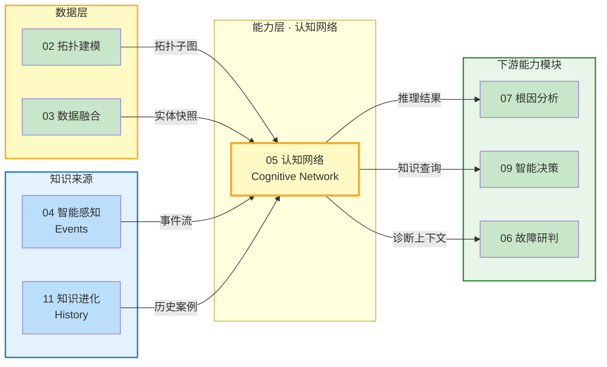
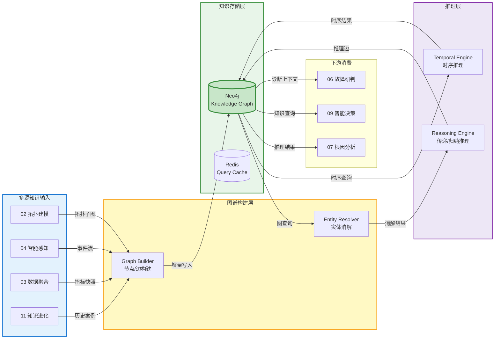
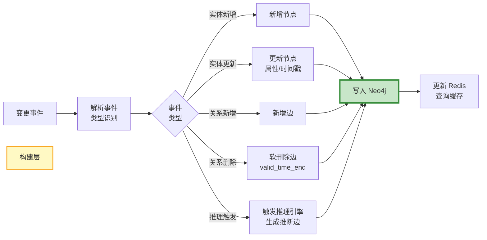
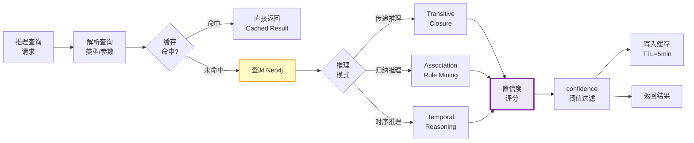
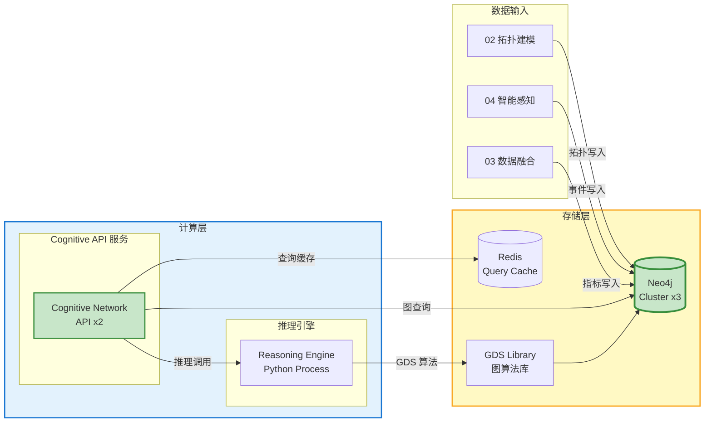

# 模块 05 · 认知网络

> 认知网络是 Observable Ops 的「知识大脑」——通过构建和推理运维知识图谱，将分散的拓扑结构、实时事件、历史案例转化为可查询、可推理的结构化知识网络，为根因分析、智能决策提供深层语义理解能力。

---

##📑 目录

### 章节导航

- 1. 模块定位与职责
- 2. 认知图谱模型
- 3. 核心功能分解
- 4. API 设计规范
- 5. 数据流架构
- 6. 模块协作关系
- 7. 量化指标体系
- 8. 部署架构
- 9. 本章小结

---

## 1. 模块定位与职责

### 1.1 在 4 层架构中的位置

认知网络属于**能力层**核心模块，负责构建和维护运维知识图谱，并提供图推理和查询能力：接收来自拓扑建模、智能感知和知识进化的多源异构数据，输出推理结果和知识查询服务给根因分析、智能决策模块。



### 1.2 核心职责

| 职责 | 描述 | 输出 |
|------|------|------|
| **知识图谱构建** | 将拓扑结构、事件数据、历史案例统一构建为知识图谱 | 知识图谱（Neo4j） |
| **实体消解** | 跨数据源的实体模糊匹配、属性链接、共现分析，实现实体消歧 | Canonical 实体 |
| **关系推理** | 通过传递推理、归纳推理、时序因果推理，发现隐含关系 | Inferred Edges |
| **时序推理** | 时间窗口查询、有效性区间追踪、变更追踪 | Temporal Query |
| **知识查询** | 提供低延迟图查询、推理查询、路径查询 | Query Result |

### 1.3 核心设计原则


- **图原生（Graph Native）**：所有数据以图结构存储和查询，避免关系型数据库的 JOIN 开销
- **不确定性感知（Uncertainty Aware）**：每条边都有 confidence 评分，推理结果明确标注置信度
- **时序优先（Temporal First）**：时间维度是图谱的一等公民，支持时间窗口查询和变更追踪
- **增量更新（Incremental Update）**：图谱实时增量更新，无需全量重建

### 1.4 子模块划分

| 子模块 | 职责 | 技术选型 |
|--------|------|---------|
| **Builder** 图谱构建器 | 接收多源数据，构建节点和边，支持增量写入 | Python / Neo4j Cypher |
| **Resolver** 实体消解器 | 模糊匹配、属性链接、共现分析，实现实体消歧 | Python / Redis Graph |
| **Reasoner** 推理引擎 | 传递/归纳/时序推理，发现隐含关系 | Neo4j GDS / Python |
| **Query** 查询服务 | 图查询 API、Cypher 查询、路径发现 | Flask / Neo4j |
| **Temporal** 时序管理器 | 时间窗口、有效性区间、变更追踪 | Neo4j / Python |
| **Visualizer** 可视化导出 | D3.js JSON 导出，子图可视化 | Python / D3.js |

---

## 2. 认知图谱模型

### 2.1 知识图谱 Schema

#### 2.1.1 节点类型体系

| 节点类型 | Label | 描述 | 核心属性 |
|----------|-------|------|----------|
| **概念节点** | `Concept` | 抽象概念（服务类型、故障类型、指标类型） | name, description, category |
| **实体节点** | `Entity` | 具体 IT 实体（服务、主机、数据库） | id, name, type, labels, properties |
| **事件节点** | `Event` | 运维事件（告警、变更、故障） | event_id, type, timestamp, severity |
| **指标节点** | `Metric` | 指标快照（时间序列聚合点） | metric_name, entity_id, value, timestamp |
| **案例节点** | `Case` | 历史故障案例（来自知识进化） | case_id, title, root_cause, resolution |

#### 2.1.2 边类型体系

| 边类型 | Edge Type | 描述 | 方向 | 属性 |
|--------|-----------|------|------|------|
| **属性边** | `HAS_ATTRIBUTE` | 实体拥有某属性 | Entity → Attribute | value, confidence |
| **因果边** | `CAUSED_BY` | 事件 A 导致事件 B | Event → Event | confidence, lag_ms |
| **相似边** | `SIMILAR_TO` | 两实体/事件高度相似 | Bidirectional | similarity_score |
| **时序边** | `FOLLOWS` | 事件 A 在事件 B 之后发生 | Event → Event | time_gap_ms, confidence |
| **关联边** | `CORRELATES_WITH` | 两指标/实体存在关联 | Bidirectional | correlation_score, type |
| **实例化边** | `INSTANCE_OF` | 实体是概念的实例 | Entity → Concept | —— |
| **组成边** | `PART_OF` | 实体是另一实体的组成部分 | Entity → Entity | —— |

### 2.2 时间维度模型

#### 2.2.1 双时间戳模型

| 时间类型 | 字段 | 说明 |
|----------|------|------|
| **有效时间** | `valid_time_start / valid_time_end` | 实体/关系在业务上的有效时间区间（如服务 A 在 2026-01-01 到 2026-03-01 属于某集群） |
| **事务时间** | `tx_time` | 实体/关系被写入图谱的时间（用于审计和回溯） |

### 2.3 置信度评分模型

认知网络的每条边和推理结果都有 `confidence` 评分：

| 置信度区间 | 含义 | 下游处理 |
|------------|------|----------|
| **0.9 - 1.0** | 确定性知识（直接观测） | 直接使用，无需验证 |
| **0.7 - 0.9** | 高置信度推断 | 可使用，建议人工复核 |
| **0.5 - 0.7** | 中等置信度推断 | 作为参考，需其他证据支持 |
| **0.0 - 0.5** | 低置信度假设 | 仅展示，不参与计算 |

### 2.4 知识三元组模型

```
{
  "triple_id": "triple-001",
  "subject": {
    "type": "Entity",
    "id": "svc-payment-prod",
    "name": "Payment Service"
  },
  "predicate": "CAUSED_BY",
  "object": {
    "type": "Entity",
    "id": "db-mysql-primary",
    "name": "MySQL Primary"
  },
  "confidence": 0.85,
  "source": "topology-aware-inference",
  "evidence": [
    {"type": "metric_correlation", "score": 0.92},
    {"type": "call_chain", "score": 0.78}
  ],
  "valid_time": {
    "start": "2026-01-01T00:00:00Z",
    "end": null
  },
  "tx_time": "2026-06-07T08:00:00Z"
}
```

---

## 3. 核心功能分解

### 3.1 图谱构建（Graph Construction）

#### 3.1.1 数据来源与构建方式

| 数据来源 | 数据类型 | 节点生成 | 边生成 | 频率 |
|----------|----------|----------|--------|------|
| **02 拓扑建模** | 拓扑子图 | Service / Host / Database 节点 | CALLS / ACCESSES / DEPLOYED_ON 边 | 实时（变更事件） |
| **04 智能感知** | 告警事件 | Alert 事件节点 | SIMILAR_TO（告警聚类）/ CAUSED_BY（传播推断） | 实时（告警流） |
| **03 数据融合** | 指标快照 | Metric 节点 | CORRELATES_WITH（指标关联） | 每 5 分钟 |
| **11 知识进化** | 历史案例 | Case 案例节点 | SIMILAR_TO（案例相似）/ RESOLVED_BY（解决方案） | 每日批量 |

### 3.2 实体消解（Entity Resolution）

#### 3.2.1 消解策略

| 策略 | 方法 | 适用场景 | 置信度 |
|------|------|----------|--------|
| **模糊匹配** | 名称相似度（Jaro-Winkler > 0.85） | 同一服务在不同数据源中命名略有差异 | 0.8 - 0.95 |
| **属性链接** | 共享 IP / Port / Cluster 等属性 | 主机/网络设备实体消歧 | 0.85 - 0.98 |
| **共现分析** | 在相同调用链/告警中同时出现 | 服务实体跨数据源对齐 | 0.75 - 0.9 |
| **时序对齐** | 指标时序曲线相关性 > 0.9 | 同一服务的监控指标匹配 | 0.8 - 0.92 |

### 3.3 关系推理（Relation Inference）

#### 3.3.1 推理类型

| 推理类型 | 方法 | 输入 | 输出 |
|----------|------|------|------|
| **传递推理** | A→B, B→C → A→C | 已有的因果链 | 推断的跨跳因果关系 |
| **归纳推理** | 频繁项挖掘 / 关联规则 | 历史事件共现模式 | 新发现的关联规则（如 A 类故障常伴随 B 指标异常） |
| **时序因果推理** | Granger Causality / 时序相关 | 时序指标数据 | 指标间的因果指向关系 |

### 3.4 时序推理（Temporal Reasoning）

#### 3.4.1 时序查询能力

- **有效性区间查询**：查询某实体在指定时间点的所有有效关系
- **时间窗口查询**：查询 [T1, T2] 时间窗口内的所有事件和关系变化
- **变更追踪**：查询某实体的所有历史版本（tx_time 回溯）
- **快照比对**：对比两个时间点的图谱子图差异

#### 3.4.2 时间旅行查询示例

```
// 查询 Payment Service 在 2026-06-01 的完整上下文
MATCH (n {id: 'svc-payment-prod'})-[r]-(m)
WHERE r.valid_time_start <= datetime('2026-06-01')
  AND (r.valid_time_end IS NULL OR r.valid_time_end >= datetime('2026-06-01'))
RETURN n, r, m
```

---

## 4. API 设计规范

### 4.1 REST API

| 方法 | 路径 | 描述 | 响应 |
|------|------|------|------|
| **GET** | `/api/v1/cognitive/graph` | 查询图谱子图（支持节点过滤） | `Graph` |
| **GET** | `/api/v1/cognitive/graph/node/{id}` | 查询单个节点的完整上下文 | `NodeContext` |
| **POST** | `/api/v1/cognitive/query` | 执行 Cypher 查询或结构化查询 | `QueryResult` |
| **POST** | `/api/v1/cognitive/reasoning` | 执行推理查询（如路径发现、因果推理） | `ReasoningResult` |
| **GET** | `/api/v1/cognitive/inference/{node_id}` | 查询某实体的所有推断关系 | `InferenceResult[]` |
| **GET** | `/api/v1/cognitive/similar/{node_id}` | 查询与某实体相似的其他实体 | `SimilarEntity[]` |
| **GET** | `/api/v1/cognitive/visualize/{node_id}` | 导出 D3.js 可视化 JSON | `D3JSGraph` |

### 4.2 查询语言

#### 4.2.1 支持的查询类型

| 查询类型 | 语法 | 示例 |
|----------|------|------|
| **Cypher 原生** | Cypher | `MATCH (a)-[r:CAUSED_BY]->(b) WHERE a.severity='HIGH' RETURN a, b` |
| **结构化查询** | JSON DSL | `{"type":"path", "from":"svc-A", "to":"svc-B", "max_hops":3}` |
| **时序查询** | 时间表达式 | `{"type":"temporal", "node":"svc-A", "at":"2026-06-01"}` |
| **推理查询** | 推理类型 | `{"type":"inference", "node":"svc-A", "mode":"causal_chain"}` |

---

## 5. 数据流架构

### 5.1 整体数据流



### 5.2 增量更新流程



### 5.3 推理查询流程



---

## 6. 模块协作关系

### 6.1 依赖矩阵

| 模块 | 依赖认知网络的什么 | 依赖类型 | 接口方式 |
|------|--------------------|----------|----------|
| **02 拓扑建模** | 提供拓扑子图作为图谱初始结构 | **数据依赖** | Neo4j 直接查询 / Kafka 事件 |
| **03 数据融合** | 提供融合后的实体快照和指标快照 | **数据依赖** | Kafka 事件订阅 |
| **04 智能感知** | 提供告警事件流作为图谱事件节点来源 | **数据依赖** | Kafka 事件订阅 |
| **07 根因分析** | 查询图谱进行传播路径推理和因果分析 | **数据依赖** | REST / gRPC 查询 |
| **09 智能决策** | 查询图谱知识，辅助决策上下文 | **数据依赖** | REST 查询 |
| **06 故障研判** | 查询图谱获取诊断上下文 | **数据依赖** | REST 查询 |
| **11 知识进化** | 消费历史案例写入图谱，接收图谱统计信息 | **数据依赖** | Kafka 双向通道 |

### 6.2 输出接口契约

#### 6.2.1 推理结果输出格式

```
{
  "inference_id": "inf-20260607-001",
  "type": "CAUSED_BY",
  "subject": {
    "id": "svc-payment-prod",
    "name": "Payment Service",
    "type": "Entity"
  },
  "object": {
    "id": "db-mysql-primary",
    "name": "MySQL Primary",
    "type": "Entity"
  },
  "confidence": 0.82,
  "reasoning_method": "transitive_inference",
  "evidence": [
    {"type": "direct_call", "from": "svc-payment", "to": "db-mysql", "confidence": 0.95},
    {"type": "metric_correlation", "score": 0.78}
  ],
  "valid_time": {
    "start": "2026-01-01T00:00:00Z",
    "end": null
  }
}
```

---

## 7. 量化指标体系

### 7.1 图谱质量指标

| 指标 | 描述 | 基线（当前） | 目标 | 测量方式 |
|------|------|--------------|------|----------|
| **图谱覆盖率** | 图谱节点占已知实体的比例 | **70%** | **> 90%** | Neo4j 节点数 vs CMDB 实体数 |
| **推理准确率** | 推断边的准确性（人工抽检） | **68%** | **> 80%** | 知识进化反馈验证 |
| **实体消解率** | 成功消解的跨源实体对比例 | **75%** | **> 90%** | Redis 消解命中率 |
| **知识三元组增长率** | 每日新增的知识三元组数量 | **1000/天** | **> 5000/天** | Neo4j 写入统计 |

### 7.2 服务质量指标

| 指标 | 描述 | SLO 目标 | 告警阈值 |
|------|------|----------|----------|
| **查询延迟 P99** | 图查询和推理查询的 P99 延迟 | **< 200ms** | **> 500ms** |
| **图谱写入吞吐量** | 节点/边写入速率 | **> 5000/s** | **< 2000/s** |
| **Neo4j 可用率** | 图数据库月度可用率 | **99.95%** | **< 99.5%** |

### 7.3 容量规划指标

| 资源 | 当前使用 | 规格上限 | 扩容触发阈值 |
|------|----------|----------|--------------|
| **Neo4j 存储** | 100GB / 500GB | **500GB** | **80%** |
| **图谱节点数** | 50,000 | **1,000,000** | **> 800,000** |
| **图谱边数** | 200,000 | **5,000,000** | **> 4,000,000** |
| **Redis 查询缓存** | 2GB / 8GB | **8GB** | **70%** |

---

## 8. 部署架构

### 8.1 K8s 部署拓扑



### 8.2 资源配置

| 组件 | 副本数 | CPU | 内存 | 存储 | 备注 |
|------|--------|-----|------|------|------|
| **Cognitive API** | 2（主备） | 4 核 | 8 GB | —— | StatefulSet，PDB |
| **Reasoning Engine** | 2 | 8 核 | 16 GB | —— | GDS 图算法计算 |
| **Neo4j Cluster** | 3 节点 | 8 核 | 32 GB | 500 GB SSD | 图数据存储 + GDS |
| **Redis Query Cache** | 3 节点 | 4 核 | 8 GB | —— | 查询结果缓存 |

### 8.3 高可用设计

- **Neo4j 因果集群**：3 节点因果集群，写入通过主节点，读取可路由到任意节点
- **Redis 查询缓存**：Cluster 模式，TTL 5 分钟，缓存穿透时降级查询 Neo4j
- **推理引擎无状态**：推理引擎无状态，K8s 自动重启
- **图谱增量写入**：变更事件驱动增量写入，无需全量重建

---

## 9. 本章小结

### 9.1 核心要点

| 维度 | 核心要点 | 量化目标 |
|------|----------|----------|
| **定位** | 能力层核心模块，运维知识图谱的构建与推理引擎 | —— |
| **模型** | 图原生存储，Concept / Entity / Event / Metric 四类节点，6 种边类型 | 覆盖率 > 90% |
| **能力** | 图谱构建 / 实体消解 / 关系推理 / 时序推理 / 知识查询 5 大能力 | 推理准确率 > 80% |
| **接口** | REST + Cypher DSL + D3.js 可视化导出，支持时序查询 | 查询延迟 P99 < 200ms |
| **特点** | 不确定性感知（confidence 评分）、双时间戳模型（valid_time + tx_time） | —— |

**记忆口诀：**

> **图原生存储 Neo4j，节点四类边六型；拓扑事件融合来，知识图谱日日新；传递归纳时序推，置信评分量可信；时序双戳真变迁，增量更新无全量；查询缓存 P99 二百，推理准确八成目标。**

---

> 本章定义了模块 05 认知网络的详细功能设计规范。后续章节将阐述根因分析（07）、智能决策（09）等模块的设计细节。

*文档版本：V1.0 | 更新日期：2026-06-07*