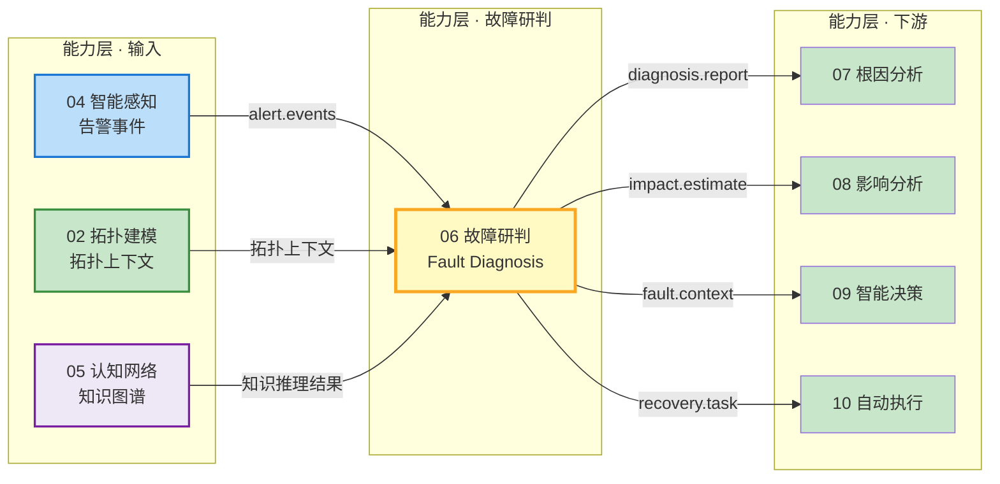
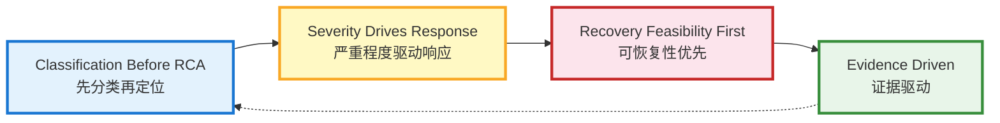
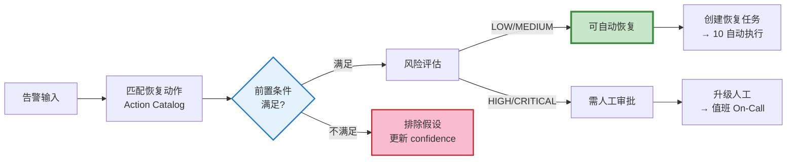
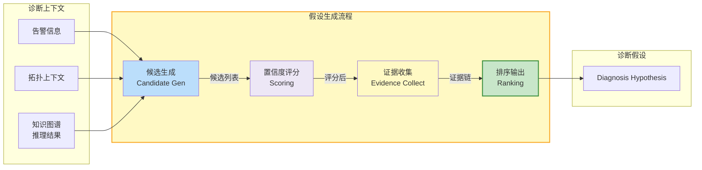
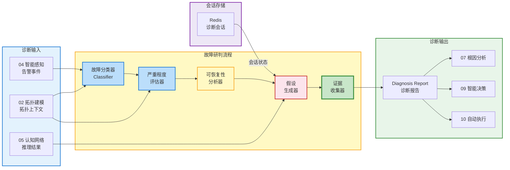
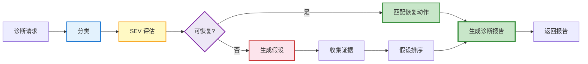
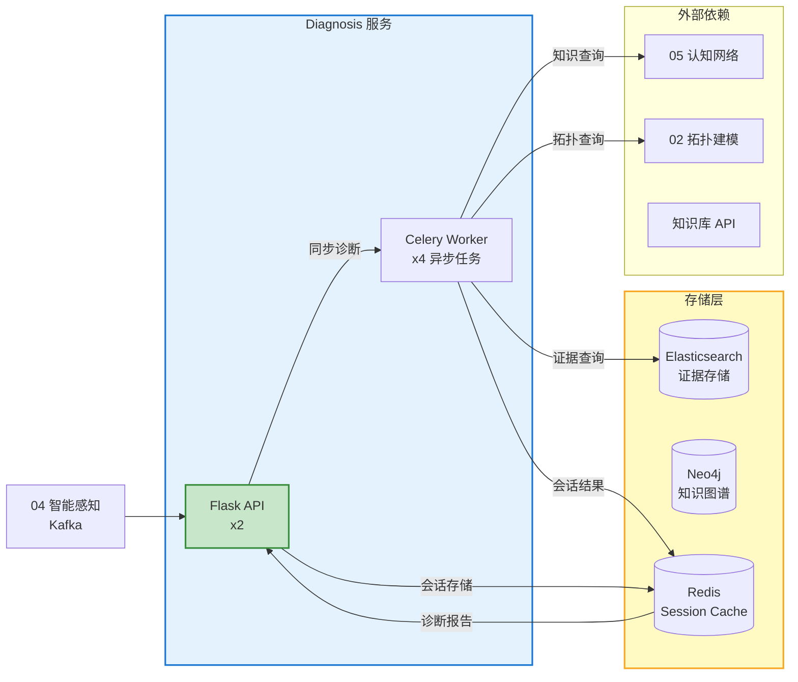

# 模块 06 · 故障研判

> 故障研判是 Observable Ops 的「故障分诊台」——接收智能感知输出的告警，结合拓扑上下文和知识图谱，对故障进行分类定级、评估严重程度、判断可恢复性，并生成故障假设，为后续根因分析提供结构化输入。

---

## 📑 目录

### 章节导航

- 1. 模块定位与职责
- 2. 故障研判模型
- 3. 核心功能分解
- 4. API 设计规范
- 5. 数据流架构
- 6. 模块协作关系
- 7. 量化指标体系
- 8. 部署架构
- 9. 本章小结

---

## 1. 模块定位与职责

### 1.1 在 4 层架构中的位置

故障研判属于**能力层**核心模块，介于智能感知（告警生成）与根因分析（定位根因）之间：对告警进行结构化研判，输出故障假设给根因分析，同时输出给影响分析和智能决策模块。



### 1.2 核心职责

| 职责 | 描述 | 输出 |
|------|------|------|
| **故障分类** | 根据告警症状将故障归类为性能类/错误类/可用性类/安全类/配置类/未知类 | Fault Type |
| **严重程度评估** | 基于影响范围（用户/业务/恢复难度）评估故障 SEV 等级 | Severity Level |
| **可恢复性分析** | 判断故障是否可自动化恢复，匹配合适的恢复动作 | Recovery Feasibility |
| **故障假设生成** | 基于知识和拓扑生成多个候选故障假设，并评估置信度 | Hypothesis[] |
| **证据收集** | 从拓扑和指标中收集支持/排除假设的证据 | Evidence[] |

### 1.3 核心设计原则



- **先分类再定位（Classification Before RCA）**：先确定故障类型，再针对性调用根因分析逻辑
- **严重程度驱动响应（Scality Drives Response）**：SEV1 立即触发应急响应，SEV3 允许人工确认后处理
- **可恢复性优先（Recovery Feasibility First）**：优先判断是否能自动恢复，能恢先恢
- **证据驱动（Evidence Driven）**：每个假设必须有证据支撑，证据不足时标注不确定度

### 1.4 子模块划分

| 子模块 | 职责 | 技术选型 |
|--------|------|---------|
| **Classifier** 故障分类器 | 规则 + ML 分类模型，判断故障类型 | Python / Flask / TensorFlow |
| **Severity Assessor** 严重程度评估器 | 影响评分 + 紧迫度评分，综合 SEV 判定 | Python / Redis |
| **Recovery Checker** 可恢复性分析器 | 匹配恢复动作，检查前置条件，评估风险 | Python / Redis Hash |
| **Hypothesis Generator** 假设生成器 | 基于知识库生成候选假设，证据收集与评分 | Python / Neo4j 查询 |
| **Evidence Collector** 证据收集器 | 从拓扑/指标/日志中收集证据，支持/排除假设 | Python / Elasticsearch |
| **Session Manager** 研判会话管理 | 管理诊断会话状态，异步复杂诊断 | Redis / Flask |

---

## 2. 故障研判模型

### 2.1 故障类型体系（Fault Type Taxonomy）

| 故障类型 | 描述 | 典型指标特征 | 常见根因 |
|----------|------|-------------|---------|
| **性能类** | 响应时间变长、资源使用率过高 | latency ↑, cpu/mem ↑, throughput ↓ | 负载过高、GC 停顿、连接池耗尽 |
| **错误类** | 请求错误率升高、服务异常退出 | error_rate ↑, 5xx ↑, crash ↑ | 代码 bug、依赖不可用、配置错误 |
| **可用性类** | 服务不可访问、健康检查失败 | availability ↓, health_fail ↑ | 进程挂掉、网络分区、依赖死锁 |
| **安全类** | 安全告警、异常访问、权限被拒 | auth_fail ↑, security_event ↑ | 攻击、误配置、凭证泄露 |
| **配置类** | 配置变更导致的异常 | config_change, rollout ↑ | 配置错误、版本不兼容 |
| **未知类** | 无法归类的异常 | —— | 需要人工介入 |

### 2.2 严重程度模型（Severity Model）

| 等级 | 名称 | 定义 | 影响范围 | 响应时间 | 处理方式 |
|------|------|------|---------|---------|---------|
| **SEV1** | 最高级 | 核心业务完全不可用，影响 > 50% 用户 | 全量用户 | 立即（< 5min） | 全自动或一键应急 |
| **SEV2** | 高级 | 核心业务部分受损，影响 20%-50% 用户 | 大部分用户 | 15min | 自动 + 值班确认 |
| **SEV3** | 中级 | 非核心功能受损，影响 5%-20% 用户 | 部分用户 | 1h | 工单处理 |
| **SEV4** | 低级 | 轻微异常，影响 < 5% 用户，无业务影响 | 少量用户 | 24h | 计划内处理 |

### 2.3 恢复动作模型（Recovery Action Schema）

| 字段 | 类型 | 说明 |
|------|------|------|
| `action_type` | Enum | 动作类型：restart / scale / switch / rollback / drain / clear_cache / notify |
| `target` | String | 动作目标（如 service_id, pod_name） |
| `params` | JSON | 动作参数字典（如 `{"replicas": 3}`） |
| `estimated_duration` | Integer (秒) | 预计执行时长 |
| `risk_level` | Enum | 风险等级：LOW / MEDIUM / HIGH / CRITICAL |
| `rollback_plan` | JSON | 回滚计划（如执行失败如何回退） |
| `preconditions` | String[] | 前置条件列表（如「当前副本数 > 1」） |
| `success_rate` | Float [0-1] | 历史成功率 |

### 2.4 故障假设模型（Fault Hypothesis Model）

| 字段 | 类型 | 说明 |
|------|------|------|
| `hypothesis_id` | String | 假设唯一 ID |
| `description` | String | 假设描述（人类可读） |
| `confidence` | Float [0-1] | 置信度（综合证据评分） |
| `supporting_evidence` | Evidence[] | 支持该假设的证据列表 |
| `ruled_out_evidence` | Evidence[] | 排除该假设的证据列表 |
| `source` | Enum | 假设来源：knowledge_base / pattern_match / ml_inference / manual |
| `rank` | Integer | 优先级排序（1 为最可能） |

---

## 3. 核心功能分解

### 3.1 故障分类（Fault Classification）

#### 3.1.1 分类方法

| 分类方法 | 输入 | 输出 | 适用场景 |
|----------|------|------|---------|
| **规则分类器** | 告警 condition → type mapping | fault_type | 已知故障模式（占 70%） |
| **ML 分类器** | 症状向量（metrics + alerts） | fault_type + confidence | 复杂/未知故障模式（占 30%） |

#### 3.1.2 规则分类映射表

| 条件 | 故障类型 | 置信度 |
|------|---------|--------|
| `error_rate > 5% AND latency > 1000ms` | **错误类** | 0.95 |
| `cpu_usage > 90% AND latency > 500ms` | **性能类** | 0.90 |
| `health_check_fail == true AND availability < 50%` | **可用性类** | 0.92 |
| `auth_fail_rate > 10% AND security_event == true` | **安全类** | 0.88 |
| `config_version_change == true AND start_time within 10min` | **配置类** | 0.85 |

### 3.2 严重程度评估（Severity Assessment）

#### 3.2.1 评估维度

| 维度 | 权重 | 评分方法 |
|------|------|---------|
| **影响用户数** | 40% | 根据告警涉及的 entity 关联到用户数估算 |
| **业务损失** | 30% | 根据 service 的业务优先级（tier）和收入影响估算 |
| **恢复难度** | 20% | 历史平均恢复时间越长评分越高 |
| **紧迫度** | 10% | 故障持续时间越长紧迫度越高 |

### 3.3 可恢复性分析（Recovery Feasibility Analysis）

#### 3.3.1 分析流程



#### 3.3.2 恢复动作目录

| 故障类型 | 恢复动作 | 风险等级 | 历史成功率 |
|---------|---------|---------|-----------|
| 性能类 - CPU 高 | Horizontal Pod Autoscaler 扩容 | **LOW** | 92% |
| 性能类 - 内存高 | Pod 重启（释放内存） | **MEDIUM** | 85% |
| 可用性类 - 进程崩溃 | Pod 重调度 | **LOW** | 95% |
| 配置类 - 版本问题 | Rollback 到上一版本 | **MEDIUM** | 80% |
| 错误类 - 依赖超时 | 等待自动恢复（熔断恢复） | **LOW** | 90% |

### 3.4 假设生成（Hypothesis Generation）

#### 3.4.1 生成流程



#### 3.4.2 假设来源

| 来源 | 方法 | 适用场景 |
|------|------|---------|
| **知识库检索** | 从知识图谱检索相似历史案例，提取根因 | 已知故障模式 |
| **模式匹配** | 当前症状 vs 预定义故障模式库匹配 | 典型故障 |
| **ML 推理** | LSTM/Transformer 模型基于时序症状推理 | 复杂/新型故障 |
| **拓扑传播** | 基于拓扑路径向上游传播，识别传播源 | 级联故障 |

---

## 4. API 设计规范

### 4.1 REST API

| 方法 | 路径 | 描述 | 同步性 | 响应 |
|------|------|------|-------|------|
| **POST** | `/api/v1/diagnosis/analyze` | 发起故障诊断分析 | 同步（P99 < 10s） | `DiagnosisReport` |
| **POST** | `/api/v1/diagnosis/analyze/async` | 发起异步复杂诊断 | 异步（返回 session_id） | `SessionID` |
| **GET** | `/api/v1/diagnosis/sessions/{session_id}` | 查询异步诊断进度 | —— | `SessionStatus` |
| **GET** | `/api/v1/diagnosis/hypotheses/{diagnosis_id}` | 查询诊断假设列表 | —— | `Hypothesis[]` |
| **GET** | `/api/v1/diagnosis/actions/{diagnosis_id}` | 查询可用的恢复动作 | —— | `RecoveryAction[]` |
| **GET** | `/api/v1/diagnosis/report/{diagnosis_id}` | 获取完整诊断报告 | —— | `FullReport` |

### 4.2 性能要求

| 场景 | SLO 目标 | 说明 |
|------|---------|------|
| 简单诊断（同步） | **P99 < 10s** | 单故障假设生成 + 证据收集 |
| 复杂诊断（异步） | **P99 < 2min** | 多假设生成 + 深度证据收集 |
| 诊断服务可用率 | **99.9%** | 月度可用率 |

---

## 5. 数据流架构

### 5.1 整体数据流



### 5.2 同步诊断流程



### 5.3 异步诊断流程


---

## 6. 模块协作关系

### 6.1 依赖矩阵

| 模块 | 依赖故障研判的什么 | 依赖类型 | 接口方式 |
|------|------------------|---------|---------|
| **04 智能感知** | 接收告警事件流作为诊断输入 | **数据依赖** | Kafka 订阅 alert.events |
| **02 拓扑建模** | 查询拓扑上下文，了解影响范围和传播路径 | **数据依赖** | REST / gRPC 查询 |
| **05 认知网络** | 查询知识图谱进行推理，获取相似案例 | **数据依赖** | REST 查询 |
| **07 根因分析** | 接收故障研判报告，进一步定位根因 | **数据依赖** | Kafka 事件 / REST |
| **08 影响分析** | 接收故障上下文，评估影响范围 | **数据依赖** | Kafka 事件 |
| **09 智能决策** | 接收故障上下文，辅助决策 | **数据依赖** | Kafka 事件 |
| **10 自动执行** | 接收可恢复性分析和恢复动作，执行自动化恢复 | **数据依赖** | Kafka 事件 |

### 6.2 输出接口契约

#### 6.2.1 诊断报告格式

```
{
  "diagnosis_id": "diag-20260607-001",
  "alert_id": "alert-20260607-001",
  "created_at": 1750000000000,
  "completed_at": 1750000100000,
  "fault_type": "performance",
  "severity": "SEV2",
  "summary": "Payment Service CPU 使用率过高导致延迟上升",
  "hypotheses": [
    {
      "hypothesis_id": "hyp-001",
      "description": "上游流量突增导致 CPU 过载",
      "confidence": 0.82,
      "rank": 1,
      "source": "knowledge_base",
      "supporting_evidence": [...],
      "ruled_out_evidence": []
    }
  ],
  "recovery_feasibility": {
    "automatable": true,
    "recommended_action": {
      "action_type": "scale",
      "target": "svc-payment-prod",
      "params": {"replicas": 5},
      "risk_level": "LOW",
      "estimated_duration": 60
    }
  },
  "impact_estimate": {
    "affected_users": "20%-50%",
    "estimated_revenue_loss_per_hour": "$10,000"
  }
}
```

---

## 7. 量化指标体系

### 7.1 诊断效果指标

| 指标 | 描述 | 基线（当前） | 目标 | 测量方式 |
|------|------|------------|------|---------|
| **分类准确率** | 故障类型分类正确的比例 | **80%** | **> 90%** | 人工标注验证集 |
| **SEV 评估准确率** | 严重程度判定正确的比例 | **75%** | **> 85%** | 事后复盘对比 |
| **诊断耗时（SEV1）** | SEV1 故障从告警到完成研判的时间 | **5min** | **< 2min** | diagnostic session 计时 |
| **假设准确率** | Top-1 假设命中的比例 | **60%** | **> 75%** | 根因分析结果反馈 |
| **可恢复匹配率** | 可自动化恢复的故障中，成功匹配合适动作的比例 | **55%** | **> 70%** | 自动执行反馈统计 |

### 7.2 服务质量指标

| 指标 | 描述 | SLO 目标 | 告警阈值 |
|------|------|---------|---------|
| **同步诊断 P99 延迟** | 简单诊断端到端延迟 | **< 10s** | **> 30s** |
| **异步诊断 P99 延迟** | 复杂诊断端到端延迟 | **< 2min** | **> 5min** |
| **诊断服务可用率** | 月度可用率 | **99.9%** | **< 99%** |
| **并发诊断能力** | 同时处理的诊断会话数 | **> 100** | **< 50** |

---

## 8. 部署架构

### 8.1 K8s 部署拓扑



### 8.2 资源配置

| 组件 | 副本数 | CPU | 内存 | 存储 | 备注 |
|------|-------|-----|------|------|------|
| **Diagnosis Flask API** | 2（主备） | 4 核 | 8 GB | —— | StatefulSet，PDB |
| **Celery Worker** | 4 | 4 核 | 8 GB | —— | 异步诊断任务处理 |
| **Redis Session Cache** | 3 节点 | 4 核 | 16 GB | —— | 诊断会话状态 |
| **Elasticsearch Evidence Store** | 3 节点 | 4 核 | 8 GB | 200 GB SSD | 证据数据存储 |

### 8.3 高可用设计

- **Redis 会话持久化**：诊断会话状态定期快照到磁盘，Redis 故障可恢复
- **Celery 任务重试**：异步诊断任务失败自动重试，最多 3 次
- **API 无状态**：Flask API 无状态，K8s 自动重启，外部依赖故障有降级逻辑
- **超时降级**：外部调用（拓扑/知识图谱）超过 5s 自动降级，返回不完整报告

---

## 9. 本章小结

### 9.1 核心要点

| 维度 | 核心要点 | 量化目标 |
|------|---------|---------|
| **定位** | 能力层核心模块，告警到根因之间的「分诊台」 | —— |
| **流程** | 分类 → 定级 → 可恢复性 → 假设生成 → 证据收集，5 步结构化研判 | SEV1 < 2min |
| **输出** | 故障类型 + 严重程度 + 假设列表 + 证据链 + 推荐恢复动作 | 分类准确率 > 90% |
| **性能** | 同步诊断 P99 < 10s，异步诊断 P99 < 2min | SEV1 < 2min |
| **设计原则** | 先分类再定位 / 严重程度驱动响应 / 可恢复性优先 / 证据驱动 | —— |

**记忆口诀：**

> **故障研判五步走，分类定级走在前；SEV 驱动响应急，可恢复性优先判；假设生成靠知识，证据链来作支撑；同步十秒异步两分，研判报告给下游。**

---

> 本章定义了模块 06 故障研判的详细功能设计规范。后续章节将阐述根因分析（07）、智能决策（09）等模块的设计细节。

*文档版本：V1.0 | 更新日期：2026-06-07*