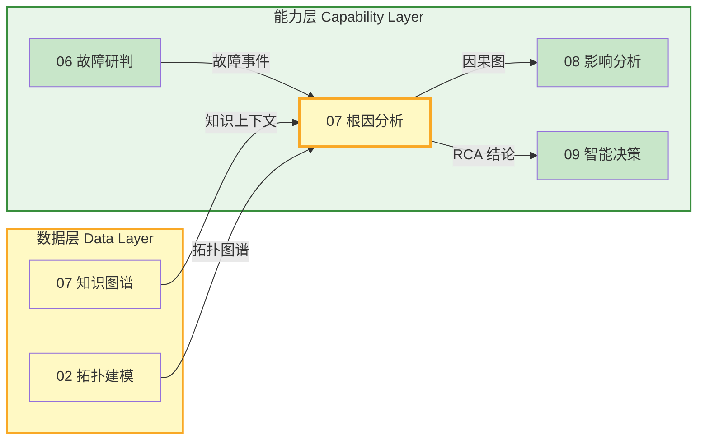
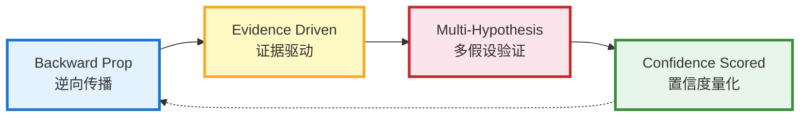
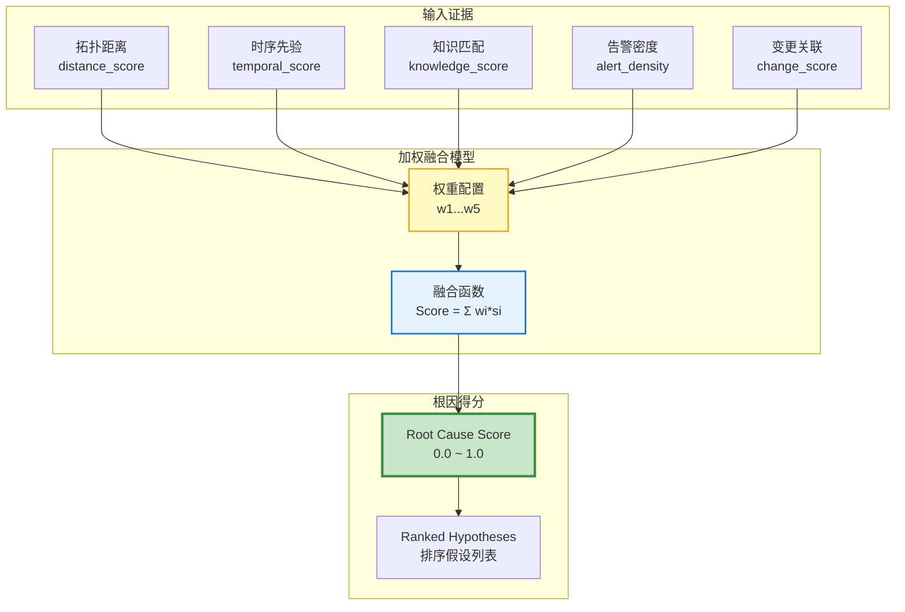
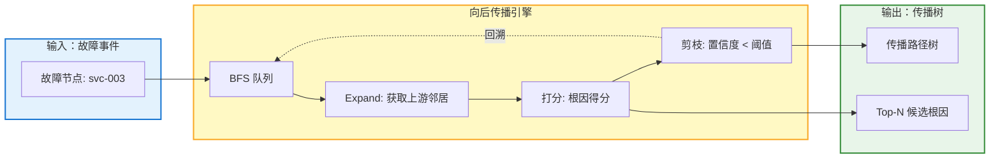
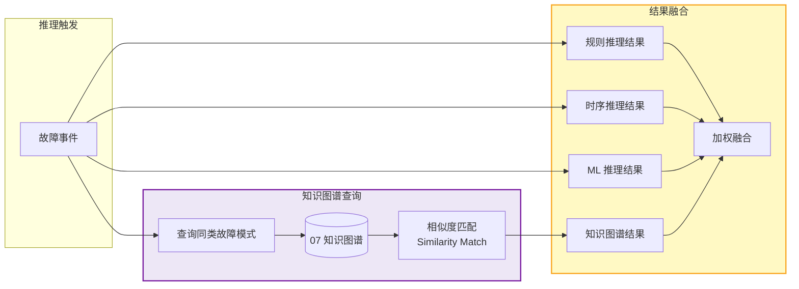
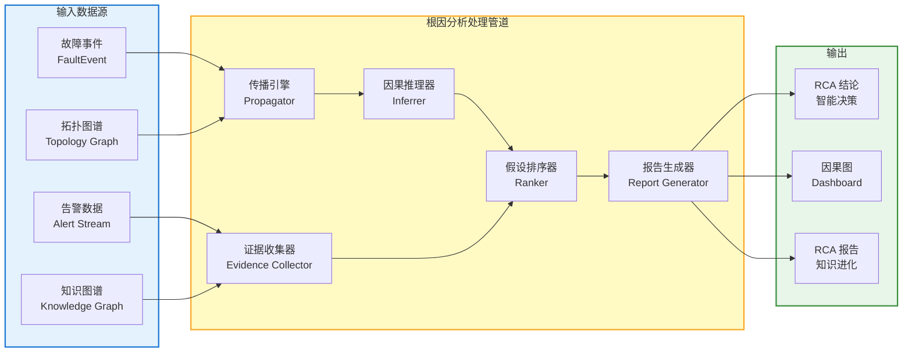
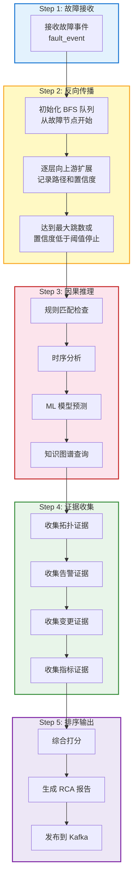
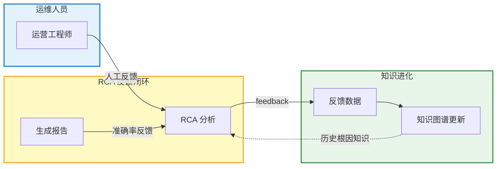

# 模块 07 · 根因分析

> 根因分析是 Observable Ops 的「逆向推理引擎」——通过向后传播故障信号，在拓扑图中定位故障源头节点，输出带置信度的因果图，为智能决策提供 RCA（Root Cause Analysis）结论。

---

## 目录

### 章节导航

- 1. 模块定位与职责
- 2. 根因分析模型
- 3. 核心功能分解
- 4. API 设计规范
- 5. 数据流架构
- 6. 模块协作关系
- 7. 量化指标体系
- 8. 部署架构
- 9. 本章小结

---

## 1. 模块定位与职责

### 1.1 在 4 层架构中的位置

根因分析属于**能力层**核心模块，接收来自故障研判、知识图谱、拓扑建模的数据，输出 RCA 结论到智能决策模块。



### 1.2 核心职责

| 职责 | 描述 | 输出 |
|------|------|------|
| **向后传播定位** | 从故障节点出发，逆拓扑方向搜索可能的根因节点 | 候选根因列表 |
| **因果图构建** | 基于拓扑结构 + 知识图谱构建故障传播因果图 | Causality Graph |
| **根因假设排序** | 综合多维度证据对候选根因打分排序 | Ranked Hypotheses |
| **证据收集增强** | 调用知识图谱补充故障案例、运维文档等证据 | Evidence Package |
| **RCA 报告生成** | 生成结构化根因分析报告，含结论 + 置信度 + 支撑证据 | RCA Report |

### 1.3 核心设计原则



- **逆向传播（Backward Prop）**：从故障现象出发，沿拓扑反向搜索可能根因，避免盲目全图搜索
- **证据驱动（Evidence Driven）**：每个根因假设必须有可验证的证据支撑，无证据不结案
- **多假设验证（Multi-Hypothesis）**：保留 Top-N 候选假设，避免单点判断失误
- **置信度量化（Confidence Scored）**：所有结论带置信度输出，上游决策模块可据此权衡

### 1.4 子模块划分

| 子模块 | 职责 | 技术选型 |
|--------|------|----------|
| Propagator 传播引擎 | 从故障节点逆向遍历拓扑，构建传播路径树 | Python / Neo4j GDS |
| Inferrer 因果推理器 | 基于规则 + ML 模型推断节点间因果关系 | Python / PyTorch / 知识图谱 |
| Ranker 假设排序器 | 综合证据打分，对候选根因排序 | Python / XGBoost |
| EvidenceCollector 证据收集器 | 从知识图谱/运维文档补充证据 | Python / Elasticsearch |
| ReportGenerator 报告生成器 | 生成结构化 RCA 报告 | Python / Jinja2 |

---

## 2. 根因分析模型

### 2.1 因果图模型（Causality Graph）

因果图是根因分析的核心数据结构，表示故障在拓扑中的传播路径与因果关系。

#### 2.1.1 因果图节点

| 字段 | 类型 | 说明 | 示例 |
|------|------|------|------|
| `node_id` | String (UUID) | 因果图节点唯一标识 | `cg-node-20260607-001` |
| `entity_id` | String | 对应拓扑实体 ID（可为空，表示中间推理节点） | `svc-001` |
| `node_type` | Enum | 节点类型：FAULT（故障现象）/ ENTITY（拓扑实体）/ HYPOTHESIS（根因假设） | `HYPOTHESIS` |
| `root_cause_score` | Float [0-1] | 根因得分，综合证据计算得出 | `0.85` |
| `evidence_ids` | List[String] | 支撑该节点的证据 ID 列表 | `["ev-001", "ev-002"]` |
| `properties` | Object | 节点额外属性（异常类型、影响时长等） | `{"alert_count": 5, "duration_min": 12}` |

#### 2.1.2 因果边

| 字段 | 类型 | 说明 | 示例 |
|------|------|------|------|
| `edge_id` | String (UUID) | 因果边唯一标识 | `cg-edge-20260607-001` |
| `from_node` | String | 因果边起点节点 ID | `cg-node-001` |
| `to_node` | String | 因果边终点节点 ID | `cg-node-002` |
| `causality_type` | Enum | 因果类型：DIRECT（直接因果）/ INFERRED（推断因果）/ TEMPORAL（时序因果） | `DIRECT` |
| `confidence` | Float [0-1] | 该因果关系的置信度 | `0.92` |
| `propagation_latency_ms` | Integer | 该传播路径的预期延迟（毫秒） | `5000` |

### 2.2 根因得分模型（Root Cause Score）

根因得分是综合多维度证据计算得出的最终排序依据。



#### 2.2.1 得分维度说明

| 维度 | 计算方式 | 权重（默认） | 说明 |
|------|----------|--------------|------|
| **拓扑距离** | 距离故障节点的反向跳数，归一化到 [0,1] | 0.25 | 越近拓扑优先 |
| **时序先验** | 该节点异常是否先于故障发生 | 0.25 | 时间因果证据 |
| **知识匹配** | 知识图谱中该故障类型的历史根因匹配度 | 0.20 | 经验知识复用 |
| **告警密度** | 该节点告警数量 / 总告警数量 | 0.15 | 异常集中度 |
| **变更关联** | 该节点近期是否有变更（部署/配置/容量） | 0.15 | 变更风险因子 |

### 2.3 传播路径 Schema

| 字段 | 类型 | 说明 |
|------|------|------|
| `path_id` | String (UUID) | 路径唯一标识 |
| `nodes` | List[EntityNode] | 路径经过的拓扑实体节点序列 |
| `edges` | List[TopologyEdge] | 路径经过的拓扑边序列 |
| `total_hops` | Integer | 路径总跳数 |
| `propagation_probability` | Float [0-1] | 该路径实际发生故障传播的概率 |
| `estimated_latency_ms` | Integer | 该路径的预期故障传播延迟 |

---

## 3. 核心功能分解

### 3.1 向后传播（Backward Propagation）

#### 3.1.1 传播算法流程

1. **接收故障事件**：从故障研判模块接收故障告警，包含故障节点 ID、故障类型、发生时间
2. **确定搜索起点**：以故障节点为起点，初始化反向传播队列
3. **拓扑反向遍历**：沿 CALLS/ACCESSES/DEPLOYED_ON 边的反方向向上游搜索
4. **广度优先扩展**：BFS 扩展，每层记录节点、边、到达时间
5. **剪枝策略**：跳数超限（默认 10 跳）、置信度低于阈值时停止
6. **构建传播树**：输出从根因到故障的传播路径树



#### 3.1.2 传播方向与边类型

| 边类型 | 正向含义 | 反向传播方向 | 传播权重 |
|--------|----------|--------------|----------|
| `CALLS` | A 调用 B（B 故障） | A 可能是根因 | 0.9（强因果） |
| `ACCESSES` | A 访问 DB（DB 故障） | A 可能是根因 | 0.85 |
| `DEPLOYED_ON` | Service 部署在 Host（Host 故障） | Host 可能是根因 | 0.95（基础设施故障强影响） |
| `SUBSCRIBES` | A 订阅 Topic（Topic 故障） | A 可能是根因 | 0.7 |
| `NETWORK_TO` | A 到 B 网络连通（A 故障） | B 上游可能是根因 | 0.5（弱因果，需其他证据） |

### 3.2 因果推理（Causal Inference）

#### 3.2.1 推理方法分类

| 方法 | 适用场景 | 输入 | 输出 |
|------|----------|------|------|
| **规则推理** | 已知故障模式库（如 DB 连接池耗尽 → 服务不可用） | 拓扑 + 故障类型 | 因果边（confidence=1.0） |
| **时序推理** | 未知故障模式，但有时间序列异常数据 | 告警时间序列 | 因果边（confidence=0.7-0.9） |
| **ML 推理** | 复杂故障，无明确规则也无时序先验 | 多维度特征向量 | 因果边（confidence=0.5-0.8） |
| **知识图谱推理** | 历史同类故障的根因知识 | 知识图谱 + 故障特征 | 候选根因列表（带相似度） |

#### 3.2.2 知识图谱辅助推理

当本地规则和时序无法得出结论时，系统查询知识图谱获取历史同类故障的根因模式。



### 3.3 假设排序（Hypothesis Ranking）

#### 3.3.1 排序策略

1. **综合打分**：对每个候选根因计算多维度加权得分
2. **多样性保持**：Top-N 结果中避免多个高度相似的假设（相似度 > 0.9 时合并）
3. **置信区间**：输出每个假设的置信区间，而非单点估计
4. **可解释性排序**：同等得分时，优先输出可解释性强的假设（证据充分）

#### 3.3.2 排序结果示例

| 排名 | 候选根因 | 根因得分 | 置信区间 | 主要证据 |
|------|----------|----------|----------|----------|
| 1 | `host-042（物理机故障）` | 0.92 | [0.88, 0.95] | 硬件告警 + 网络不可达 + 部署的 Service 全部故障 |
| 2 | `db-primary（数据库主库）` | 0.78 | [0.70, 0.84] | 连接超时告警 + 访问该 DB 的服务相继异常 |
| 3 | `svc-002（上游服务超时）` | 0.61 | [0.50, 0.70] | 调用链路超时 + 时序早于故障发生 |
| 4 | `kafka-topic-orders（消息堆积）` | 0.43 | [0.30, 0.55] | 消费者 lag 告警 + 时序关联 |

### 3.4 证据收集（Evidence Collection）

#### 3.4.1 证据类型

| 证据类型 | 来源 | 描述 | 可信度 |
|----------|------|------|--------|
| **拓扑证据** | 拓扑建模模块 | 节点在拓扑中的位置、上下游关系 | 高 |
| **告警证据** | 监控告警系统 | 该节点/相关节点的告警历史 | 高 |
| **变更证据** | 变更管理系统 | 近期部署/配置/容量变更记录 | 高 |
| **指标证据** | 数据融合模块 | 异常期间该节点的资源指标 | 高 |
| **日志证据** | 日志系统 | 该节点产生的错误日志/异常日志 | 中 |
| **Trace 证据** | APM 系统 | 调用链中的异常Span | 中 |
| **知识证据** | 知识图谱 | 历史同类故障的根因记录 | 中 |
| **人工标注** | 运维人员 | 人工标记的故障根因 | 参考 |

#### 3.4.2 证据质量评分

| 评分维度 | 说明 | 权重 |
|----------|------|------|
| **及时性** | 证据是否在故障发生前后短时间内采集 | 0.3 |
| **相关性** | 证据与候选根因的逻辑相关性 | 0.3 |
| **可信度** | 证据来源本身的可信度 | 0.4 |

---

## 4. API 设计规范

### 4.1 REST API（同步查询）

| 方法 | 路径 | 描述 | 请求体 | 响应 |
|------|------|------|--------|------|
| POST | `/api/v1/rca/analyze` | 发起根因分析任务 | FaultEvent | RCA Report |
| GET | `/api/v1/rca/report/{report_id}` | 查询 RCA 报告详情 | —— | RCA Report |
| GET | `/api/v1/rca/causality/{incident_id}` | 查询故障的因果图 | —— | Causality Graph |
| GET | `/api/v1/rca/hypotheses/{incident_id}` | 查询候选根因假设列表 | `?top_k=5` | Hypothesis[] |
| GET | `/api/v1/rca/evidence/{node_id}` | 查询节点关联的证据列表 | —— | Evidence[] |
| POST | `/api/v1/rca/feedback` | 提交人工反馈（RCA 准确与否） | Feedback | 200 OK |
| GET | `/api/v1/rca/history` | 查询历史 RCA 记录 | `?start_time=&end_time=` | RCA Report[] |

### 4.2 gRPC API（高性能场景）

| 服务 | 方法 | 适用场景 | 性能要求 |
|------|------|----------|----------|
| `RCAService` | `Analyze(AnalyzeRequest)` | 实时根因分析（故障告警触发） | P99 < 2s |
| `RCAService` | `GetCausalityGraph(GraphRequest)` | 获取因果图（Dashboard 可视化） | P99 < 500ms |
| `RCAService` | `StreamHypothesis(StreamRequest)` | 流式推送根因假设更新 | < 100ms 延迟 |

### 4.3 Kafka 事件（异步 RCA 完成通知）

| Topic | 事件类型 | 发布者 | 订阅者 | 说明 |
|-------|----------|--------|--------|------|
| `rca.report.completed` | RCA 报告完成 | 根因分析模块 | 智能决策/Dashboard | 推送 RCA 结论到下游 |
| `rca.hypothesis.updated` | 假设排序更新 | 根因分析模块 | Dashboard（实时更新） | 新证据到达时刷新排序 |
| `rca.feedback.received` | 人工反馈到达 | Dashboard / 运维人员 | 知识进化模块 | 触发知识更新 |

### 4.4 API 质量指标

| 指标 | SLO 目标 | 告警阈值 | 说明 |
|------|---------|---------|------|
| **P99 延迟** | < 2s | > 5s | RCA 分析完成时间 |
| **准确率** | > 85% | < 75% | Top-1 根因正确率 |
| **可用率** | 99.9% | < 99.5% | 月度可用率 |
| **并发分析数** | 50 并发 | < 20 | 同时进行 RCA 分析的任务数 |

---

## 5. 数据流架构

### 5.1 整体数据流



### 5.2 RCA 分析流程



### 5.3 反馈闭环数据流



---

## 6. 模块协作关系

### 6.1 依赖矩阵

| 模块 | 依赖根因分析的什么 | 依赖类型 | 接口方式 |
|------|-------------------|----------|----------|
| **02 拓扑建模** | 拓扑图谱（节点/边/关系查询）用于反向传播 | 数据依赖 | gRPC 高性能查询 |
| **06 故障研判** | 故障事件输入（触发 RCA） | 数据依赖 | Kafka 事件订阅 |
| **07 知识图谱** | 历史故障案例、运维知识、因果规则 | 数据依赖 | REST 查询 |
| **08 影响分析** | RCA 结论（根因节点输入） | 数据依赖 | Kafka 事件订阅 |
| **09 智能决策** | RCA 报告（核心决策输入） | 数据依赖 | Kafka 事件订阅 |
| **11 知识进化** | RCA 结果 + 人工反馈（学习素材） | 数据依赖 | Kafka 事件订阅 |
| **Dashboard** | 因果图可视化、RCA 报告展示 | 数据依赖 | REST 查询 |

### 6.2 输出接口契约

#### 6.2.1 RCA 报告格式

```json
{
  "report_id": "rca-20260607-001",
  "incident_id": "inc-20260607-042",
  "primary_root_cause": {
    "entity_id": "host-042",
    "entity_name": "物理机 us-east-1c-042",
    "root_cause_score": 0.92,
    "confidence_interval": [0.88, 0.95],
    "causality_type": "DIRECT"
  },
  "hypotheses": [
    { "rank": 1, "entity_id": "host-042", "score": 0.92, "evidence": [...] },
    { "rank": 2, "entity_id": "db-primary", "score": 0.78, "evidence": [...] }
  ],
  "causality_graph": {
    "nodes": [...],
    "edges": [...]
  },
  "generated_at": "2026-06-07T08:15:00Z",
  "analysis_latency_ms": 1850
}
```

#### 6.2.2 因果图格式

```json
{
  "graph_id": "cg-20260607-001",
  "incident_id": "inc-20260607-042",
  "nodes": [
    { "node_id": "cg-n1", "entity_id": "svc-003", "node_type": "FAULT", "root_cause_score": 1.0 },
    { "node_id": "cg-n2", "entity_id": "svc-001", "node_type": "HYPOTHESIS", "root_cause_score": 0.61 },
    { "node_id": "cg-n3", "entity_id": "host-042", "node_type": "HYPOTHESIS", "root_cause_score": 0.92 }
  ],
  "edges": [
    { "from": "cg-n1", "to": "cg-n3", "causality_type": "DIRECT", "confidence": 0.95 }
  ]
}
```

---

## 7. 量化指标体系

### 7.1 准确性指标

| 指标 | 描述 | 基线（当前） | 目标 | 测量方式 |
|------|------|-------------|------|----------|
| **RCA 准确率** | Top-1 根因与实际根因一致的比例 | 72% | > 85% | 人工标注验证 |
| **Top-3 召回率** | 真实根因出现在 Top-3 候选的比例 | 85% | > 95% | 人工标注验证 |
| **MTTD** | Mean Time To Detect（故障发生到根因定位的平均时间） | 15min | < 5min | 系统自动测量 |
| **False Positive Rate** | 错误根因假设占总假设的比例 | 18% | < 10% | 反馈数据统计 |

### 7.2 性能质量指标

| 指标 | 描述 | SLO 目标 | 告警阈值 |
|------|------|---------|---------|
| **分析延迟 P99** | 从接收故障事件到输出 RCA 结论的延迟 | < 2s | > 5s |
| **因果图生成时间** | 生成因果图并可视化的耗时 | < 500ms | > 1s |
| **并发分析能力** | 同时处理的 RCA 分析任务数 | 50 | < 20 |
| **传播深度** | 平均可达传播搜索深度 | 10 跳 | < 5 跳 |

### 7.3 业务价值指标

| 指标 | 描述 | 当前 | 目标 |
|------|------|------|------|
| **平均故障时长缩短** | RCA 准确后智能决策效率提升，故障时长缩短 | 基准 | -30% |
| **人工 RCA 时间节省** | 系统自动 RCA 减少人工排查时间 | 基准 | -60% |
| **知识复用率** | 历史根因知识被复用的次数 | 15% | > 40% |

---

## 8. 部署架构

### 8.1 K8s 部署拓扑

```mermaid
flowchart LR
    subgraph 控制面["控制面"]
        API[API Server]
    end

    subgraph 计算层["计算层"]
        subgraph 服务["RCA 服务 StatefulSet"]
            RCA1[RCA Service x2]
        end
        subgraph 工作器["传播引擎 Worker"]
            WORK1[Propagator x3]
        end
    end

    subgraph 存储层["存储层"]
        NEO[(Neo4j<br/>拓扑查询)]
        KG[(知识图谱<br/>图数据库)]
        RD[(Redis<br/>结果缓存)]
        KF[(Kafka<br/>事件总线)]
    end

    FAULT[06 故障研判] -->|Kafka| RCA1
    RCA1 -->|gRPC| NEO
    RCA1 -->|REST| KG
    WORK1 -->|写入| RD
    RCA1 -->|发布| KF
    KF -->|订阅| 09 智能决策


    style 计算层 fill:#e3f2fd,stroke:#1976d2,stroke-width:2px
    style 存储层 fill:#fff9c4,stroke:#f9a825,stroke-width:2px
    style RCA1 fill:#c8e6c9,stroke:#388e3c,stroke-width:3px
```

### 8.2 资源配置

| 组件 | 副本数 | CPU | 内存 | 存储 | 备注 |
|------|--------|-----|------|------|------|
| **RCA Service** | 2（主备） | 4 核 | 8 GB | —— | StatefulSet，接收分析请求 |
| **Propagator Worker** | 3（并行） | 2 核 | 4 GB | —— | 执行拓扑反向传播计算 |
| **Inferrer Worker** | 2 | 4 核 | 8 GB | —— | ML 模型推理（GPU 支持） |
| **Neo4j** | 1 主 + 2 从 | 8 核 | 32 GB | 200 GB SSD | 拓扑查询 |
| **Redis Cluster** | 3 节点 | 2 核 | 8 GB | —— | RCA 结果缓存 |

### 8.3 高可用设计

- **服务多副本**：RCA Service 部署 2 副本，Kubernetes 自动负载均衡
- **工作器并行**：传播引擎工作器 3 副本，并行处理不同故障事件
- **结果缓存**：RCA 结果缓存 Redis，相同故障模式 5 分钟内直接返回
- **降级策略**：ML 推理超时降级为规则推理，保证分析完成
- **事件持久化**：Kafka 事件持久化，下游消费失败重试

---

## 9. 本章小结

### 9.1 核心要点

| 维度 | 核心要点 | 量化目标 |
|------|----------|----------|
| **定位** | 能力层核心模块，故障研判的后链路，智能决策的前置输入 | —— |
| **模型** | 因果图模型 + 根因得分模型，多维度证据综合打分 | 准确率 > 85% |
| **能力** | 逆向传播 + 因果推理 + 假设排序 + 证据收集 4 大能力 | MTTD < 5min |
| **接口** | REST + gRPC + Kafka，输出 RCA 报告到智能决策 | P99 < 2s |
| **质量** | 准确率 / Top-3 召回率 / MTTD / False Positive 4 类指标 | Top-3 召回 > 95% |

### 9.2 关键成功要素

| 要素 | 优先级 | 实施策略 |
|------|--------|----------|
| **传播算法优化** | P0 | 拓扑查询性能优化，传播引擎并行化 |
| **知识图谱深度集成** | P0 | 历史故障知识复用，提升冷启动场景准确率 |
| **证据收集自动化** | P1 | 打通告警/变更/指标/日志系统，自动化证据采集 |
| **置信度校准** | P1 | 持续用人工反馈校准得分模型，提升可信度 |
| **因果图可视化** | P2 | Dashboard 因果图交互，提升运维人员使用体验 |

### 9.3 与其他模块的边界

| 边界 | 说明 |
|------|------|
| **vs 06 故障研判** | 故障研判负责「检测故障是否发生」，根因分析负责「定位故障根因是谁」，故障研判输出触发根因分析输入 |
| **vs 02 拓扑建模** | 根因分析依赖拓扑建模的图结构做传播，但自己做「因果推理」和「打分排序」 |
| **vs 07 知识图谱** | 知识图谱提供历史根因知识作为证据输入，根因分析综合证据做当前故障的推理判断 |
| **vs 09 智能决策** | 根因分析输出「根因是谁」，智能决策决定「怎么办」，根因分析不产生动作，只给结论 |

**记忆口诀：**

> **逆向传播找根因，拓扑反向 BFS 扩；证据驱动多假设，置信度量化打分；知识图谱来辅助，历史经验不浪费；RCA 报告输出后，智能决策来接力。**

---

> 本章定义了模块 07 根因分析的详细功能设计规范。根因分析向上承接故障研判与知识图谱，向下输出 RCA 结论到智能决策，是 Observable Ops 能力层的核心分析引擎。

*文档版本：V1.0 | 更新日期：2026-06-07*
