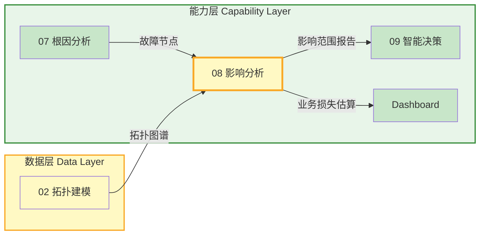
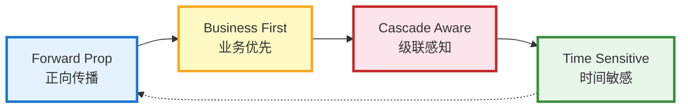
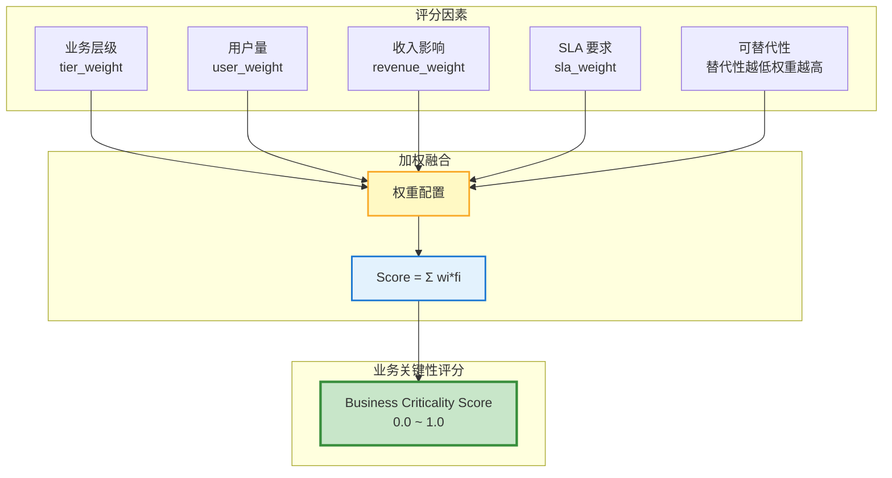
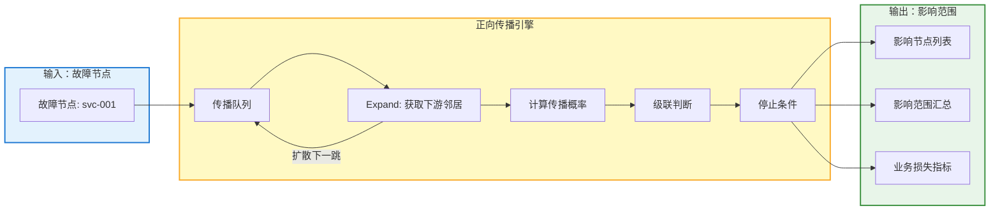
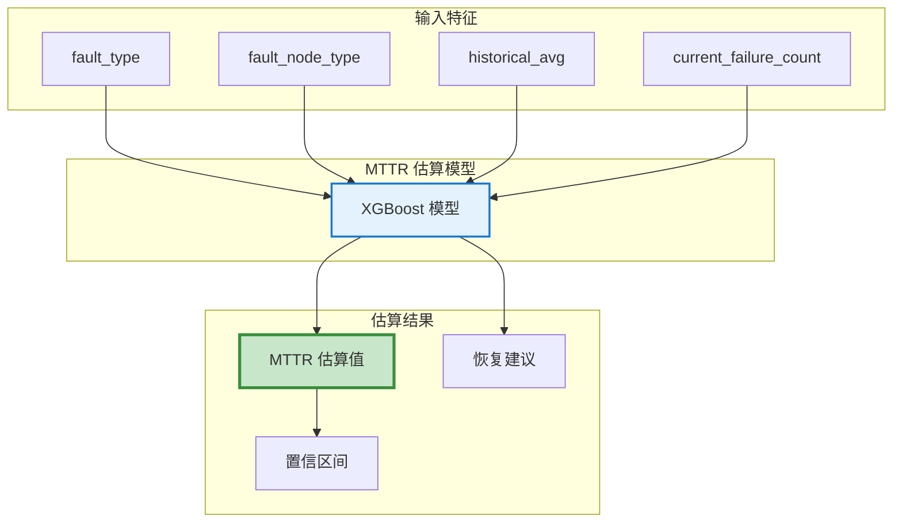
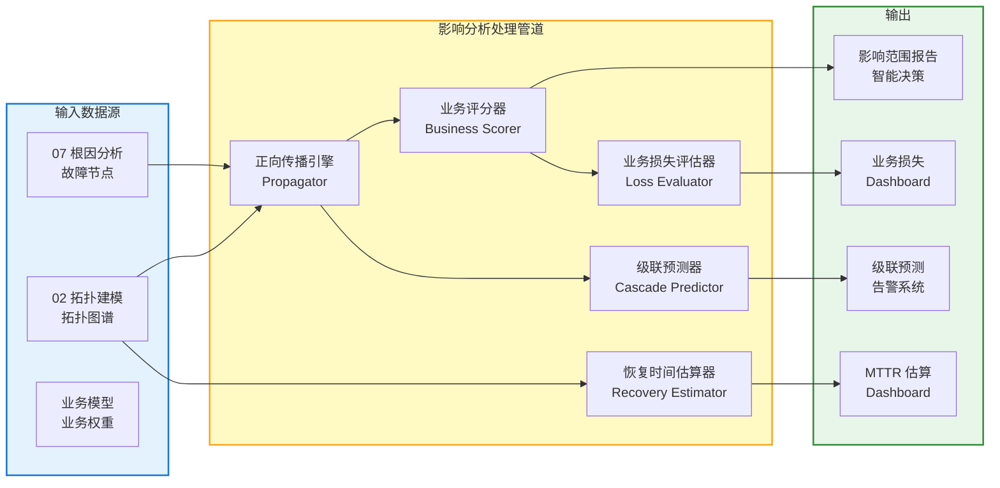
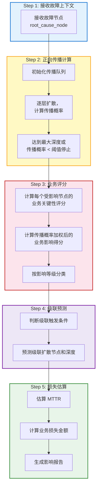
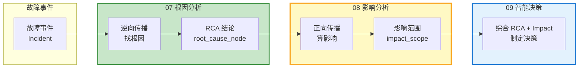

# 模块 08 · 影响分析

> 影响分析是 Observable Ops 的「正向扩散引擎」——从故障节点出发，沿拓扑正向传播，计算故障的下游影响范围、业务损失估算和恢复时间预测，为智能决策提供 Impact 维度输入。

---

## 📑 目录

### 章节导航

- 1. 模块定位与职责
- 2. 影响分析模型
- 3. 核心功能分解
- 4. API 设计规范
- 5. 数据流架构
- 6. 模块协作关系
- 7. 量化指标体系
- 8. 部署架构
- 9. 本章小结

---

## 1. 模块定位与职责

### 1.1 在 4 层架构中的位置

影响分析属于**能力层**核心模块，从根因分析模块接收故障节点信息，结合拓扑建模的图结构，输出影响范围报告到智能决策和 Dashboard。



### 1.2 核心职责

| 职责 | 描述 | 输出 |
|------|------|------|
| **正向传播计算** | 从故障节点出发，沿拓扑正向（调用方向）计算下游影响范围 | 影响节点列表 |
| **业务影响评分** | 根据业务重要性对受影响节点打分（核心业务 vs 非核心） | Business Impact Score |
| **级联故障预测** | 预测故障是否会引发级联扩散，估算扩散速度和范围 | Cascade Forecast |
| **恢复时间估算** | 基于故障类型和影响范围，估算 MTTR（Mean Time To Repair） | MTTR Estimate |
| **业务损失评估** | 将影响范围映射到业务指标（订单量/用户量/收入）损失 | Business Loss Report |

### 1.3 核心设计原则



- **正向传播（Forward Prop）**：从故障节点沿调用链向下游扩散，与根因分析的逆向传播互补
- **业务优先（Business First）**：影响分析以业务损失为导向，而非纯技术节点数
- **级联感知（Cascade Aware）**：预测故障是否会引发二次、三次扩散，提前预警
- **时间敏感（Time Sensitive）**：恢复时间估算必须考虑时间成本，业务损失随时间累积

### 1.4 子模块划分

| 子模块 | 职责 | 技术选型 |
|--------|------|---------|
| **Propagator** 正向传播引擎 | 从故障节点沿 CALLS 边向下游遍历，计算影响范围 | Python / Neo4j GDS |
| **BusinessScorer** 业务评分器 | 根据业务重要性权重，计算业务影响得分 | Python / 加权评分模型 |
| **CascadePredictor** 级联预测器 | 预测故障扩散概率、速度、范围 | Python / PyTorch / 时序模型 |
| **RecoveryEstimator** 恢复时间估算器 | 基于故障类型和历史数据估算 MTTR | Python / XGBoost |
| **LossEvaluator** 业务损失评估器 | 将技术影响映射为业务指标损失 | Python / 业务模型 |

---

## 2. 影响分析模型

### 2.1 影响范围模型（Impact Scope Model）

影响范围模型描述从故障节点出发能够影响到的所有下游节点及其层级关系。

#### 2.1.1 影响节点

| 字段 | 类型 | 说明 | 示例 |
|------|------|------|------|
| `node_id` | String | 受影响的拓扑节点 ID | `svc-004` |
| `node_name` | String | 受影响节点名称 | `order-service` |
| `label` | String | 节点类型标签 | `Service` |
| `impact_level` | Integer [1-5] | 影响层级（1=直接邻居，2=2跳，依此类推） | `2` |
| `impact_score` | Float [0-1] | 影响得分（综合业务重要性和传播概率） | `0.75` |
| `is_critical` | Boolean | 是否为核心业务节点 | `true` |
| `propagation_probability` | Float [0-1] | 该节点实际被影响的概率 | `0.85` |
| `estimated_recovery_time_min` | Integer | 该节点恢复预计所需时间（分钟） | `15` |

#### 2.1.2 影响范围汇总

| 字段 | 类型 | 说明 |
|------|------|------|
| `incident_id` | String | 关联的故障事件 ID |
| `fault_node_id` | String | 故障节点 ID |
| `total_affected` | Integer | 受影响节点总数 |
| `by_label` | Map[String, Integer] | 按标签类型统计受影响节点数 |
| `by_impact_level` | Map[Integer, Integer] | 按层级统计受影响节点数 |
| `critical_count` | Integer | 核心业务节点受影响数量 |
| `max_propagation_depth` | Integer | 最大传播深度（跳数） |

### 2.2 业务关键性评分模型（Business Criticality Score）

业务关键性评分衡量节点对业务的重要性，用于计算业务损失权重。



#### 2.2.1 评分维度说明

| 维度 | 计算方式 | 权重（默认） | 数据来源 |
|------|---------|-------------|---------|
| **业务层级** | P0=1.0, P1=0.8, P2=0.6, P3=0.4, P4=0.2 | 0.30 | CMDB / 业务台账 |
| **用户量** | 日活用户数归一化到 [0,1] | 0.25 | 业务系统埋点 |
| **收入影响** | 每分钟停机损失金额归一化 | 0.25 | 财务系统估算 |
| **SLA 要求** | 99.99%=1.0, 99.9%=0.8, 99%=0.6 | 0.15 | 合同/SLA 文档 |
| **可替代性** | 无替代=1.0, 低替代=0.7, 中替代=0.4, 高替代=0.1 | 0.05 | 架构评审文档 |

### 2.3 恢复时间估算模型（MTTR Estimation Model）

| 字段 | 类型 | 说明 |
|------|------|------|
| `fault_type` | Enum | 故障类型：硬件故障/软件崩溃/网络中断/配置错误/容量不足 |
| `fault_node_type` | Enum | 故障节点类型：Host/Middleware/Service/Database |
| `estimated_mttr_min` | Integer | 预计恢复时间（分钟） |
| `confidence` | Float [0-1] | 估算置信度 |
| `factors` | List[String] | 影响恢复时间的关键因素 |
| `historical_avg_min` | Integer | 同类故障历史平均恢复时间 |

---

## 3. 核心功能分解

### 3.1 正向传播（Forward Propagation）

#### 3.1.1 传播算法流程

1. **接收故障节点**：从根因分析模块接收故障节点 ID 和故障类型
2. **初始化传播队列**：将故障节点作为 Level 0 加入队列
3. **逐层扩散**：沿 CALLS/ACCESSES 边的正向（下游）方向扩散
4. **计算传播概率**：每条边根据边类型计算向下游传播的概率
5. **累计业务影响**：每层扩散时累计业务损失
6. **级联判断**：当某节点影响得分超过阈值时，触发下一层扩散
7. **输出影响范围**：汇总所有受影响节点及其层级



#### 3.1.2 传播方向与边类型

| 边类型 | 传播方向 | 传播概率（默认） | 说明 |
|--------|---------|----------------|------|
| `CALLS` | A → B（A 故障影响 B） | 0.9（强传播） | 服务调用链直接传播 |
| `ACCESSES` | A → DB（A 故障可能导致 DB 负载异常） | 0.7（中等传播） | 数据库连接池耗尽场景 |
| `SUBSCRIBES` | Topic → Consumer（Topic 故障影响消费者） | 0.6 | 消息队列故障传播 |
| `DEPLOYED_ON` | Host → Service（Host 故障影响所有部署的服务） | 0.95（极高传播） | 基础设施故障强影响 |
| `NETWORK_TO` | A → B（A 故障可能导致 B 网络不可达） | 0.3（弱传播） | 网络故障传播 |

### 3.2 业务影响评分（Business Impact Scoring）

#### 3.2.1 评分流程

1. **节点关键性评分**：对每个受影响节点计算业务关键性评分
2. **传播概率加权**：乘以该节点被实际影响的概率
3. **层级衰减**：Level 1 × 1.0，Level 2 × 0.8，Level 3 × 0.6（逐层衰减）
4. **汇总输出**：汇总所有受影响节点的业务影响总分

#### 3.2.2 业务影响分级

| 等级 | 分数范围 | 说明 | 决策优先级 |
|------|---------|------|-----------|
| **P0 - 灾难级** | > 0.9 | 核心业务完全中断，影响收入 > 100万/分钟 | 立即处理，CEO 关注 |
| **P1 - 严重级** | 0.7 - 0.9 | 主要业务受损，影响收入 10-100万/分钟 | 15分钟内处理 |
| **P2 - 较大级** | 0.5 - 0.7 | 部分业务降级，影响用户体验 | 30分钟内处理 |
| **P3 - 一般级** | 0.3 - 0.5 | 非核心功能受影响 | 2小时内处理 |
| **P4 - 轻微级** | < 0.3 | 几乎无业务影响 | 按计划处理 |

### 3.3 级联故障预测（Cascade Failure Prediction）

#### 3.3.1 级联触发条件

| 条件 | 阈值 | 说明 |
|------|------|------|
| **单节点故障率** | > 80% | 节点本身故障概率超过阈值 |
| **依赖度** | > 0.9 | 下游节点对该节点的依赖度超过 90% |
| **容量阈值** | > 95% | 下游节点资源容量使用率超过 95% |
| **时序窗口** | < 5min | 上游故障到下游异常的时序间隔小于 5 分钟 |

#### 3.3.2 级联预测输出

```json
{
  "cascade_risk": "HIGH",
  "predicted_cascade_nodes": ["svc-004", "svc-005", "db-002"],
  "predicted_cascade_depth": 3,
  "estimated_cascade_time_min": 8,
  "confidence": 0.82,
  "recommendation": "建议立即扩容 svc-004 以阻止级联扩散"
}
```

### 3.4 恢复时间估算（Recovery Time Estimation）

#### 3.4.1 估算逻辑



#### 3.4.2 历史数据基准

| 故障类型 | 节点类型 | 历史平均 MTTR | 基准来源 |
|---------|---------|--------------|---------|
| 硬件故障 | Host | 45 分钟 | 过去 6 个月数据 |
| 软件崩溃 | Service | 8 分钟 | 过去 6 个月数据 |
| 网络中断 | NetworkDevice | 20 分钟 | 过去 6 个月数据 |
| 配置错误 | Middleware | 5 分钟 | 过去 6 个月数据 |
| 容量不足 | Database | 15 分钟 | 过去 6 个月数据 |

---

## 4. API 设计规范

### 4.1 REST API（同步查询）

| 方法 | 路径 | 描述 | 请求体 | 响应 |
|------|------|------|--------|------|
| **POST** | `/api/v1/impact/analyze` | 发起影响分析任务 | FaultContext | ImpactReport |
| **GET** | `/api/v1/impact/report/{incident_id}` | 查询影响范围报告 | —— | ImpactReport |
| **GET** | `/api/v1/impact/scope/{node_id}` | 查询节点的影响范围 | `?depth=3&include_critical=true` | ImpactScope |
| **GET** | `/api/v1/impact/cascade/{incident_id}` | 查询级联故障预测 | —— | CascadeForecast |
| **GET** | `/api/v1/impact/mttr/{incident_id}` | 查询 MTTR 估算 | —— | MTTREstimate |
| **GET** | `/api/v1/impact/business-loss/{incident_id}` | 查询业务损失估算 | —— | BusinessLossReport |
| **GET** | `/api/v1/impact/critical-nodes` | 查询所有核心业务节点列表 | —— | CriticalNode[] |

### 4.2 gRPC API（高性能场景）

| 服务 | 方法 | 适用场景 | 性能要求 |
|------|------|---------|---------|
| `ImpactService` | `ComputeImpactScope(ImpactRequest)` | 实时影响范围计算（根因分析触发） | P99 < 500ms |
| `ImpactService` | `PredictCascade(CascadeRequest)` | 级联故障预测 | P99 < 1s |
| `ImpactService` | `StreamImpactUpdate(StreamRequest)` | 流式推送影响范围更新 | < 100ms 延迟 |

### 4.3 Kafka 事件（异步通知）

| Topic | 事件类型 | 发布者 | 订阅者 | 说明 |
|-------|---------|--------|--------|------|
| `impact.report.completed` | 影响分析报告完成 | 影响分析模块 | 智能决策/Dashboard | 推送影响范围到下游 |
| `impact.cascade.alert` | 级联故障预警 | 影响分析模块 | 告警系统/值班人员 | 级联风险超过阈值时发布 |
| `impact.business-loss.updated` | 业务损失更新 | 影响分析模块 | Dashboard（实时更新） | 业务损失随时间累积推送 |

### 4.4 API 质量指标

| 指标 | SLO 目标 | 告警阈值 | 说明 |
|------|---------|---------|------|
| **P99 延迟** | < 500ms | > 1s | 影响范围计算完成时间 |
| **影响范围准确率** | > 90% | < 80% | 预测影响节点与实际受影响节点重合率 |
| **MTTR 估算准确率** | > 85% | < 75% | MTTR 估算值与实际恢复时间偏差 < 20% |
| **可用率** | 99.9% | < 99.5% | 月度可用率 |

---

## 5. 数据流架构

### 5.1 整体数据流



### 5.2 影响分析流程



### 5.3 与根因分析的数据协同



---

## 6. 模块协作关系

### 6.1 依赖矩阵

| 模块 | 依赖影响分析的什么 | 依赖类型 | 接口方式 |
|------|------------------|---------|---------|
| **02 拓扑建模** | 拓扑图谱（节点/边查询）用于正向传播 | 数据依赖 | gRPC 高性能查询 |
| **07 根因分析** | 故障节点输入（触发影响分析） | 数据依赖 | Kafka 事件订阅 |
| **09 智能决策** | 影响范围报告（决策输入之一） | 数据依赖 | Kafka 事件订阅 |
| **Dashboard** | 影响范围可视化、业务损失实时更新 | 数据依赖 | REST 查询 |
| **告警系统** | 级联故障预警（高优先级告警） | 数据依赖 | Kafka 事件订阅 |

### 6.2 输出接口契约

#### 6.2.1 影响范围报告格式

```json
{
  "report_id": "imp-20260607-001",
  "incident_id": "inc-20260607-042",
  "fault_node": {
    "id": "svc-001",
    "name": "payment-service"
  },
  "impact_scope": {
    "total_affected": 23,
    "by_label": {
      "Service": 12,
      "Database": 4,
      "Middleware": 3,
      "Host": 4
    },
    "by_level": {
      "1": 5,
      "2": 8,
      "3": 7,
      "4": 3
    },
    "critical_count": 8,
    "max_depth": 4
  },
  "business_impact_score": 0.78,
  "impact_level": "P1",
  "estimated_mttr_min": 25,
  "business_loss_per_min": 35000,
  "cascade_risk": "MEDIUM",
  "generated_at": "2026-06-07T08:16:00Z"
}
```

#### 6.2.2 级联预测格式

```json
{
  "cascade_risk": "HIGH",
  "predicted_cascade_nodes": [
    { "id": "svc-004", "depth": 2, "probability": 0.88 },
    { "id": "svc-005", "depth": 2, "probability": 0.82 },
    { "id": "db-002", "depth": 3, "probability": 0.75 }
  ],
  "estimated_cascade_time_min": 12,
  "confidence": 0.79,
  "recommendation": "建议立即扩容以阻止级联"
}
```

---

## 7. 量化指标体系

### 7.1 准确性指标

| 指标 | 描述 | 基线（当前） | 目标 | 测量方式 |
|------|------|------------|------|---------|
| **影响范围准确率** | 预测影响节点与实际受影响节点的重合率 | 78% | > 90% | 故障后人工核实 |
| **MTTR 估算准确率** | MTTR 估算值与实际恢复时间偏差 < 20% 的比例 | 75% | > 85% | 历史故障统计 |
| **级联预测准确率** | 级联预测节点实际发生级联的比例 | 65% | > 80% | 历史级联故障统计 |
| **业务损失估算准确率** | 业务损失估算值与实际损失偏差 | 70% | > 85% | 财务核实 |

### 7.2 性能质量指标

| 指标 | 描述 | SLO 目标 | 告警阈值 |
|------|------|---------|---------|
| **P99 延迟** | 影响范围计算完成时间 | < 500ms | > 1s |
| **级联预测延迟** | 级联预测计算时间 | < 1s | > 3s |
| **最大传播深度** | 单次分析可达最大传播深度 | 10 跳 | < 5 跳 |
| **并发分析能力** | 同时处理的影响分析任务数 | 50 | < 20 |

### 7.3 业务价值指标

| 指标 | 描述 | 当前 | 目标 |
|------|------|------|------|
| **故障决策效率提升** | 影响分析辅助决策，减少人工评估时间 | 基准 | +40% |
| **级联故障预警覆盖率** | 级联故障发生前被预警的比例 | 55% | > 80% |
| **业务损失减少** | 快速影响评估减少故障持续时间，节省业务损失 | 基准 | -25% |

---

## 8. 部署架构

### 8.1 K8s 部署拓扑

```mermaid
flowchart LR
    subgraph 控制面["控制面"]
        API[API Server]
    end

    subgraph 计算层["计算层"]
        subgraph 服务["Impact 服务 StatefulSet"]
            IA1[Impact Service x2]
        end
        subgraph 工作器["传播引擎 Worker"]
            WORK1[Propagator x3]
        end
    end

    subgraph 存储层["存储层"]
        NEO[(Neo4j<br/>拓扑查询)]
        RD[(Redis<br/>结果缓存)]
        KF[(Kafka<br/>事件总线)]
    end

    RCA[07 根因分析] -->|Kafka| IA1
    T[02 拓扑建模] -->|gRPC| NEO -->|查询| IA1
    IA1 -->|写入| RD
    IA1 -->|发布| KF
    KF -->|订阅| 09 智能决策

    style 计算层 fill:#e3f2fd,stroke:#1976d2,stroke-width:2px
    style 存储层 fill:#fff9c4,stroke:#f9a825,stroke-width:2px
    style IA1 fill:#c8e6c9,stroke:#388e3c,stroke-width:3px
```

### 8.2 资源配置

| 组件 | 副本数 | CPU | 内存 | 存储 | 备注 |
|------|--------|-----|------|------|------|
| **Impact Service** | 2（主备） | 4 核 | 8 GB | —— | StatefulSet，接收分析请求 |
| **Propagator Worker** | 3（并行） | 2 核 | 4 GB | —— | 执行正向传播计算 |
| **CascadePredictor** | 2 | 4 核 | 8 GB | —— | ML 模型推理（GPU 支持） |
| **Neo4j** | 1 主 + 2 从 | 8 核 | 32 GB | 200 GB SSD | 拓扑查询 |
| **Redis Cluster** | 3 节点 | 2 核 | 8 GB | —— | 影响范围缓存 |

### 8.3 高可用设计

- **服务多副本**：Impact Service 部署 2 副本，Kubernetes 自动负载均衡
- **工作器并行**：Propagator Worker 3 副本，并行处理不同故障
- **结果缓存**：影响范围结果缓存 Redis，5 分钟内相同节点直接返回
- **降级策略**：ML 预测超时降级为规则预测，保证分析完成
- **事件持久化**：Kafka 事件持久化，下游消费失败重试

---

## 9. 本章小结

### 9.1 核心要点

| 维度 | 核心要点 | 量化目标 |
|------|---------|---------|
| **定位** | 能力层核心模块，正向传播从故障到影响范围，业务损失为导向 | —— |
| **模型** | 影响范围模型 + 业务关键性评分 + MTTR 估算，3 大模型支撑 | 影响范围准确率 > 90% |
| **能力** | 正向传播 + 业务评分 + 级联预测 + 恢复估算 + 损失评估 5 大能力 | MTTR 估算准确率 > 85% |
| **接口** | REST + gRPC + Kafka，输出影响报告到智能决策和 Dashboard | P99 < 500ms |
| **质量** | 影响范围准确率 / MTTR 准确率 / 级联预测准确率 / 业务损失准确率 | 级联预警覆盖率 > 80% |

### 9.2 关键成功要素

| 要素 | 优先级 | 实施策略 |
|------|--------|---------|
| **传播算法优化** | P0 | 拓扑查询性能优化，传播引擎并行化，深度扩展 |
| **业务权重数据** | P0 | 打通告警/业务系统，建立业务关键性评分数据 |
| **级联预测模型** | P1 | 收集历史级联故障数据，训练级联预测模型 |
| **MTTR 历史数据** | P1 | 建立故障类型与恢复时间的映射关系 |
| **实时损失计算** | P2 | 业务损失随时间实时更新，推送 Dashboard |

### 9.3 与其他模块的边界

| 边界 | 说明 |
|------|------|
| **vs 07 根因分析** | 根因分析做逆向传播「找根因」，影响分析做正向传播「算影响」，两者互补，共同构成完整故障分析视图 |
| **vs 02 拓扑建模** | 影响分析依赖拓扑建模的图结构做正向传播，但自己做「业务评分」和「损失估算」 |
| **vs 09 智能决策** | 影响分析输出「影响范围和业务损失」，智能决策决定「是否执行动作、执行顺序」，影响分析不决策只评估 |
| **vs Dashboard** | 影响分析提供数据，Dashboard 负责展示和交互，两者通过 REST/Kafka 交互 |

**记忆口诀：**

> **正向传播算影响，业务权重来打分；级联预测早预警，恢复时间心中有数；损失随时间累积，智能决策来接力。**

---

> 本章定义了模块 08 影响分析的详细功能设计规范。影响分析从故障节点出发，计算下游影响范围、业务损失和恢复时间，为智能决策提供 Impact 维度的关键输入。

*文档版本：V1.0 | 更新日期：2026-06-07*