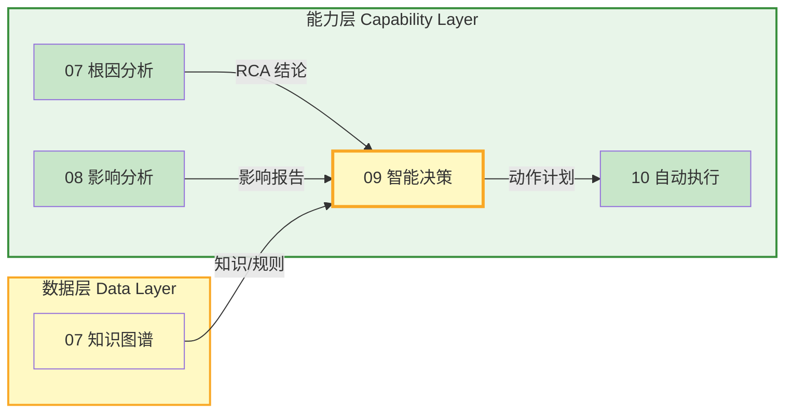
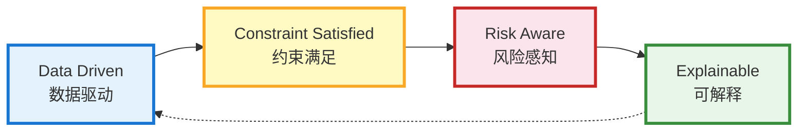
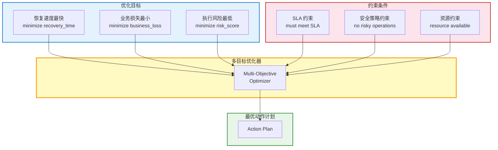
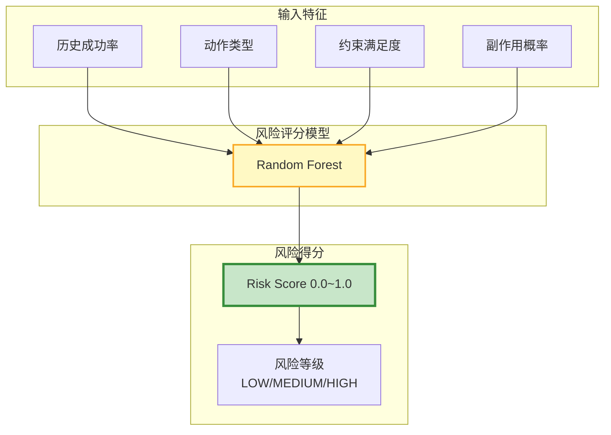
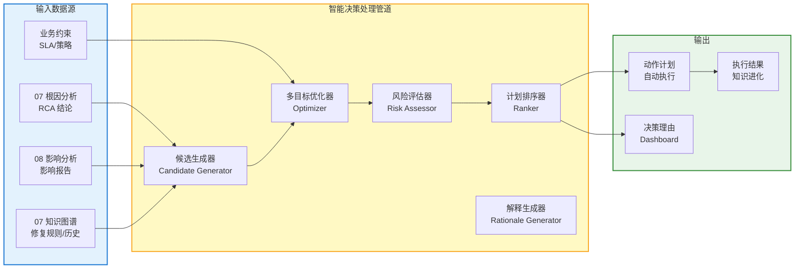
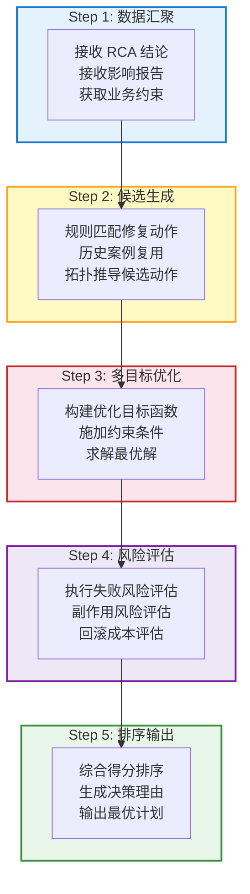
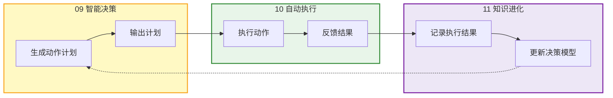

# 模块 09 · 智能决策

> 智能决策是 Observable Ops 的「决策大脑」——综合根因分析（RCA）、影响分析（Impact）和业务约束，生成最优修复动作计划，并传递给自动执行模块执行。

---

## 📑 目录

### 章节导航

- 1. 模块定位与职责
- 2. 决策模型设计
- 3. 核心功能分解
- 4. API 设计规范
- 5. 数据流架构
- 6. 模块协作关系
- 7. 量化指标体系
- 8. 部署架构
- 9. 本章小结

---

## 1. 模块定位与职责

### 1.1 在 4 层架构中的位置

智能决策属于**能力层**核心模块，汇聚根因分析、影响分析、知识图谱的所有分析结论，在业务约束下生成最优修复动作计划，输出到自动执行模块。



### 1.2 核心职责

| 职责 | 描述 | 输出 |
|------|------|------|
| **动作候选生成** | 基于 RCA 结论和知识图谱，生成可能的修复动作候选 | Action Candidate[] |
| **多目标优化** | 在恢复速度、业务损失、风险之间做多目标优化 | Optimized Plan |
| **风险评估** | 评估每个候选动作的风险（执行失败、副作用） | Risk Score |
| **动作计划排序** | 综合收益/风险/成本，对动作计划排序 | Ranked Action Plan |
| **决策解释生成** | 生成可解释的决策理由，供人工审核 | Decision Rationale |

### 1.3 核心设计原则



- **数据驱动（Data Driven）**：所有决策基于 RCA + Impact 的分析数据，不拍脑袋
- **约束满足（Constraint Satisfied）**：必须满足 SLA/业务策略/安全策略等约束条件
- **风险感知（Risk Aware）**：每个动作评估风险，优先选择低风险高收益的动作
- **可解释（Explainable）**：决策过程可追溯、可解释，供人工审核和事后复盘

### 1.4 子模块划分

| 子模块 | 职责 | 技术选型 |
|--------|------|---------|
| **CandidateGenerator** 动作候选生成器 | 基于 RCA 和知识图谱生成修复动作候选 | Python / 规则引擎 |
| **Optimizer** 多目标优化器 | 在约束条件下做多目标优化（恢复速度/业务损失/风险） | Python / OR-Tools / 强化学习 |
| **RiskAssessor** 风险评估器 | 评估候选动作的执行风险和副作用 | Python / ML 模型 |
| **Ranker** 动作计划排序器 | 综合收益/风险/成本排序，输出最优计划 | Python / XGBoost |
| **RationaleGenerator** 决策解释生成器 | 生成可解释的决策理由文档 | Python / 模板引擎 |

---

## 2. 决策模型设计

### 2.1 动作计划模型（Action Plan Schema）

动作计划是智能决策的核心输出，描述具体的修复动作、执行顺序和预期效果。

#### 2.1.1 动作单元

| 字段 | 类型 | 说明 | 示例 |
|------|------|------|------|
| `action_id` | String (UUID) | 动作唯一标识 | `act-20260607-001` |
| `action_type` | Enum | 动作类型：RESTART/SCALE_OUT/SWITCH_TRAFFIC/ROLLBACK/CONFIG_FIX/ISOLATE | `RESTART` |
| `target_node_id` | String | 动作目标节点 ID | `svc-001` |
| `parameters` | Object | 动作参数（如重启次数、扩缩容量） | `{"restart_timeout": 120}` |
| `expected_effect` | String | 预期效果描述 | `服务恢复，延迟降低 80%` |
| `expected_recovery_time_min` | Integer | 执行该动作预计恢复时间 | `5` |
| `risk_score` | Float [0-1] | 风险得分（0=无风险，1=高风险） | `0.15` |
| `prerequisites` | List[String] | 前置条件（如服务已部署、健康检查通过） | `["service_deployed", "health_check_ready"]` |

#### 2.1.2 完整动作计划

| 字段 | 类型 | 说明 |
|------|------|------|
| `plan_id` | String (UUID) | 计划唯一标识 |
| `incident_id` | String | 关联故障事件 ID |
| `priority` | Enum | 计划优先级：P0/P1/P2/P3 |
| `actions` | List[Action] | 动作序列（按执行顺序排列） |
| `total_recovery_time_min` | Integer | 计划执行完毕预计总恢复时间 |
| `total_risk_score` | Float [0-1] | 计划整体风险得分 |
| `expected_impact_reduction` | Float [0-1] | 预计影响范围缩减比例 |
| `approval_required` | Boolean | 是否需要人工审批 |
| `decision_rationale` | String | 决策理由（可解释性） |

### 2.2 决策标准模型（Decision Criteria Model）

决策标准模型定义多目标优化的目标函数和约束条件。



#### 2.2.1 优化目标权重配置

| 目标 | 权重（默认） | 可配置范围 | 说明 |
|------|-------------|-----------|------|
| **恢复速度** | 0.40 | [0.0, 1.0] | 优先快速恢复业务 |
| **业务损失** | 0.35 | [0.0, 1.0] | 最小化业务影响 |
| **执行风险** | 0.25 | [0.0, 1.0] | 避免高风险操作 |

### 2.3 约束模型（Constraint Model）

| 约束类型 | 描述 | 检查逻辑 |
|---------|------|---------|
| **SLA 约束** | 动作执行后必须在 SLA 约定时间内恢复 | 检查 estimated_recovery_time < SLA_deadline |
| **安全约束** | 高风险操作（如 rm -rf /）禁止执行，需人工审批 | 检查 action_type 是否在黑名单中 |
| **资源约束** | 资源不足时不能执行扩容动作 | 检查目标节点有足够 CPU/内存 |
| **业务约束** | 关键业务时段（如双11）禁止重启核心服务 | 检查当前时间是否在禁止窗口 |
| **依赖约束** | 动作执行顺序必须满足依赖关系 | 检查 action.prerequisites 全部满足 |

---

## 3. 核心功能分解

### 3.1 动作候选生成（Action Candidate Generation）

#### 3.1.1 生成策略

1. **规则匹配**：基于故障类型，从知识图谱规则库匹配对应修复动作
2. **历史复用**：查询历史同类故障的修复动作（知识图谱）
3. **拓扑推导**：根据故障节点类型和拓扑位置，推导可能的修复路径
4. **ML 推荐**：基于训练数据，ML 模型推荐最可能成功的动作

#### 3.1.2 动作类型与适用场景

| 动作类型 | 适用故障场景 | 预期效果 | 风险等级 |
|---------|-------------|---------|---------|
| `RESTART` | 进程崩溃、内存泄漏、服务无响应 | 服务恢复正常 | 低风险 |
| `SCALE_OUT` | 容量不足、流量突增、资源耗尽 | 吞吐量提升，延迟降低 | 低风险 |
| `SWITCH_TRAFFIC` | 单节点故障、局部不可用 | 流量切换到健康节点，服务不中断 | 中风险 |
| `ROLLBACK` | 变更引入故障、配置错误 | 回退到上一稳定版本 | 中风险 |
| `CONFIG_FIX` | 配置错误、参数不当 | 配置修正，服务恢复 | 中风险 |
| `ISOLATE` | 故障扩散、异常节点 | 隔离故障节点，防止扩散 | 高风险 |

### 3.2 多目标优化（Multi-Objective Optimization）

#### 3.2.1 优化算法选择

| 场景 | 算法 | 适用条件 | 优化目标 |
|------|------|---------|---------|
| **简单场景** | 加权求和法 | 目标函数线性、约束简单 | min w1*T + w2*L + w3*R |
| **中等复杂** | Pareto 最优解 | 多个冲突目标，需要 Pareto 前沿 | 找到 Pareto 最优解集 |
| **复杂约束** | 约束规划（OR-Tools） | 大量约束条件，组合爆炸 | 满足所有约束的最优解 |
| **大规模** | 强化学习（PPO） | 动作空间大，需长期优化 | 最大化累计奖励 |

#### 3.2.2 优化输入输出

```
// 输入
{
  "rca_conclusion": { "root_cause_node": "host-042", "confidence": 0.92 },
  "impact_report": { "business_impact_score": 0.78, "affected_nodes": 23 },
  "constraints": { "max_recovery_time_min": 15, "sla_tier": "P1" },
  "available_actions": [
    { "type": "RESTART", "target": "svc-001", "recovery_time": 5, "risk": 0.1 },
    { "type": "SCALE_OUT", "target": "svc-001", "recovery_time": 8, "risk": 0.15 }
  ]
}

// 输出
{
  "optimal_plan": {
    "actions": [{ "type": "RESTART", "target": "svc-001", "order": 1 }],
    "total_recovery_time_min": 5,
    "total_risk_score": 0.1
  }
}
```

### 3.3 风险评估（Risk Assessment）

#### 3.3.1 风险维度

| 维度 | 评估内容 | 评估方法 |
|------|---------|---------|
| **执行失败风险** | 动作执行本身可能失败的概率 | 历史成功率统计 + ML 模型预测 |
| **副作用风险** | 执行后可能引发的二次故障 | 拓扑影响分析 + 规则判断 |
| **业务中断风险** | 执行动作是否会导致业务短暂中断 | 动作类型分析 + 业务约束 |
| **回滚成本** | 执行失败后回滚的难度和成本 | 回滚路径分析 |

#### 3.3.2 风险评分计算



### 3.4 动作计划排序（Action Plan Ranking）

#### 3.4.1 排序公式

```
Score = w_recovery * RecoveryScore + w_business * BusinessScore - w_risk * RiskScore

其中：
RecoveryScore = 1 - (actual_recovery_time / max_acceptable_recovery_time)
BusinessScore = impact_reduction_ratio
RiskScore = action_risk_score
```

#### 3.4.2 排序结果示例

| 排名 | 动作计划 | 综合得分 | 恢复时间 | 风险 | 决策理由 |
|------|---------|---------|---------|------|---------|
| 1 | RESTART svc-001 | 0.92 | 5 分钟 | 低 | 根因节点重启，风险低，5分钟恢复 |
| 2 | SCALE_OUT svc-001 → 3 replicas | 0.85 | 8 分钟 | 低 | 扩容可快速提升容量，8分钟完成 |
| 3 | SWITCH_TRAFFIC to standby | 0.72 | 3 分钟 | 中 | 切换快但有流量损失风险 |

---

## 4. API 设计规范

### 4.1 REST API（同步查询）

| 方法 | 路径 | 描述 | 请求体 | 响应 |
|------|------|------|-------|------|
| POST | `/api/v1/decision/decide` | 发起决策请求 | DecisionContext | ActionPlan |
| GET | `/api/v1/decision/plan/{plan_id}` | 查询动作计划详情 | —— | ActionPlan |
| GET | `/api/v1/decision/candidates/{incident_id}` | 查询候选动作列表 | —— | ActionCandidate[] |
| GET | `/api/v1/decision/rationale/{plan_id}` | 查询决策理由 | —— | DecisionRationale |
| POST | `/api/v1/decision/approve/{plan_id}` | 人工审批通过 | ApprovalContext | 200 OK |
| POST | `/api/v1/decision/reject/{plan_id}` | 人工审批拒绝 | RejectionContext | 200 OK |
| PUT | `/api/v1/decision/constraints` | 更新决策约束配置 | ConstraintConfig | 200 OK |

### 4.2 gRPC API（高性能场景）

| 服务 | 方法 | 适用场景 | 性能要求 |
|------|------|---------|---------|
| `DecisionService` | `MakeDecision(DecisionRequest)` | 实时决策（故障告警触发） | P99 < 1s |
| `DecisionService` | `GetOptimalPlan(PlanRequest)` | 获取最优动作计划 | P99 < 500ms |
| `DecisionService` | `StreamDecisionUpdate(StreamRequest)` | 流式推送决策更新 | < 100ms 延迟 |

### 4.3 Kafka 事件（异步通知）

| Topic | 事件类型 | 发布者 | 订阅者 | 说明 |
|-------|---------|-------|-------|------|
| `decision.plan.ready` | 动作计划就绪 | 智能决策模块 | 自动执行/Dashboard | 推送动作计划到自动执行 |
| `decision.approval.required` | 需要人工审批 | 智能决策模块 | 告警系统/值班人员 | 高风险动作需人工确认 |
| `decision.executed.result` | 执行结果反馈 | 自动执行模块 | 智能决策/知识进化 | 执行结果回传，更新决策模型 |

### 4.4 API 质量指标

| 指标 | SLO 目标 | 告警阈值 | 说明 |
|------|---------|---------|------|
| **P99 延迟** | < 1s | > 3s | 决策完成时间 |
| **决策准确率** | > 90% | < 80% | 动作计划执行后故障恢复比例 |
| **动作成功率** | > 95% | < 90% | 动作计划中动作成功执行比例 |
| **可用率** | 99.9% | < 99.5% | 月度可用率 |

---

## 5. 数据流架构

### 5.1 整体数据流



### 5.2 决策流程



### 5.3 决策-执行闭环



---

## 6. 模块协作关系

### 6.1 依赖矩阵

| 模块 | 依赖智能决策的什么 | 依赖类型 | 接口方式 |
|------|-----------------|---------|---------|
| **07 根因分析** | RCA 结论（根因节点、置信度）作为决策输入 | 数据依赖 | Kafka 事件订阅 |
| **08 影响分析** | 影响范围报告（业务损失、影响节点）作为决策输入 | 数据依赖 | Kafka 事件订阅 |
| **07 知识图谱** | 修复规则、历史案例作为动作候选来源 | 数据依赖 | REST 查询 |
| **10 自动执行** | 动作计划输出到自动执行模块执行 | 数据依赖 | Kafka 事件订阅 |
| **Dashboard** | 决策理由和动作计划展示 | 数据依赖 | REST 查询 |

### 6.2 输出接口契约

#### 6.2.1 动作计划格式

```
{
  "plan_id": "plan-20260607-001",
  "incident_id": "inc-20260607-042",
  "priority": "P1",
  "actions": [
    {
      "action_id": "act-001",
      "action_type": "RESTART",
      "target_node_id": "svc-001",
      "parameters": { "restart_timeout": 120, "health_check_interval": 10 },
      "expected_effect": "服务恢复正常，延迟降低 80%",
      "expected_recovery_time_min": 5,
      "risk_score": 0.1,
      "order": 1
    }
  ],
  "total_recovery_time_min": 5,
  "total_risk_score": 0.1,
  "expected_impact_reduction": 0.95,
  "approval_required": false,
  "decision_rationale": "根因节点 svc-001 重启为最优选择，风险低（0.1），5分钟恢复，满足 P1 SLA 要求",
  "generated_at": "2026-06-07T08:17:00Z"
}
```

#### 6.2.2 决策理由格式

```
{
  "rationale_id": "rat-20260607-001",
  "plan_id": "plan-20260607-001",
  "decision_factors": [
    { "factor": "root_cause_confidence", "value": 0.92, "weight": 0.3 },
    { "factor": "business_impact_score", "value": 0.78, "weight": 0.25 },
    { "factor": "action_success_rate", "value": 0.95, "weight": 0.25 },
    { "factor": "recovery_time", "value": "5min", "weight": 0.2 }
  ],
  "alternative_options": [
    { "option": "SCALE_OUT", "rejected_reason": "恢复时间 8min > RESTART 5min" },
    { "option": "SWITCH_TRAFFIC", "rejected_reason": "风险评分 0.35 > 阈值 0.2" }
  ],
  "knowledge_sources": ["kg-rule-042", "incident-history-20250315"]
}
```

---

## 7. 量化指标体系

### 7.1 准确性指标

| 指标 | 描述 | 基线（当前） | 目标 | 测量方式 |
|------|------|------------|------|---------|
| **决策准确率** | 动作计划执行后故障恢复的比例 | 78% | > 90% | 执行结果统计 |
| **动作成功率** | 动作计划中动作成功执行的比例 | 85% | > 95% | 执行日志统计 |
| **恢复时间达标率** | 实际恢复时间不超过估算时间的比例 | 70% | > 85% | 故障记录统计 |
| **决策延迟** | 从接收输入到输出计划的时间 | 2s | < 1s | 系统测量 |

### 7.2 性能质量指标

| 指标 | 描述 | SLO 目标 | 告警阈值 |
|------|------|---------|---------|
| **P99 决策延迟** | 决策完成时间 | < 1s | > 3s |
| **并发决策能力** | 同时处理的决策任务数 | 30 | < 15 |
| **计划生成时间** | 生成动作计划的时间 | < 500ms | > 1s |
| **知识检索延迟** | 从知识图谱检索规则的时间 | < 200ms | > 500ms |

### 7.3 业务价值指标

| 指标 | 描述 | 当前 | 目标 |
|------|------|------|------|
| **自动化决策覆盖率** | 无需人工干预的决策比例 | 60% | > 85% |
| **故障平均恢复时间缩短** | 智能决策辅助减少 MTTR | 基准 | -35% |
| **人工审核通过率** | 智能决策输出计划被人工直接通过的比例 | 75% | > 90% |

---

## 8. 部署架构

### 8.1 K8s 部署拓扑

```mermaid
flowchart LR
    subgraph 控制面["控制面"]
        API[API Server]
    end

    subgraph 计算层["计算层"]
        subgraph 服务["Decision 服务 StatefulSet"]
            DEC1[Decision Service x2]
        end
        subgraph 工作器["优化器 Worker"]
            OPT1[Optimizer Worker x2]
        end
    end

    subgraph 存储层["存储层"]
        KG[(知识图谱<br/>规则/历史)]
        RD[(Redis<br/>决策缓存)]
        KF[(Kafka<br/>事件总线)]
    end

    RCA[07 根因分析] -->|Kafka| DEC1
    IA[08 影响分析] -->|Kafka| DEC1
    KG -->|REST| DEC1
    DEC1 -->|写入| RD
    DEC1 -->|发布| KF
    KF -->|订阅| 10 自动执行

    style 计算层 fill:#e3f2fd,stroke:#1976d2,stroke-width:2px
    style 存储层 fill:#fff9c4,stroke:#f9a825,stroke-width:2px
    style DEC1 fill:#c8e6c9,stroke:#388e3c,stroke-width:3px
```

### 8.2 资源配置

| 组件 | 副本数 | CPU | 内存 | 存储 | 备注 |
|------|-------|-----|------|-----|------|
| **Decision Service** | 2（主备） | 4 核 | 8 GB | —— | StatefulSet，接收决策请求 |
| **Optimizer Worker** | 2（并行） | 4 核 | 8 GB | —— | 执行多目标优化计算 |
| **RiskAssessor** | 2 | 2 核 | 4 GB | —— | ML 模型推理 |
| **Redis Cluster** | 3 节点 | 2 核 | 8 GB | —— | 决策结果缓存 |

### 8.3 高可用设计

- **服务多副本**：Decision Service 部署 2 副本，Kubernetes 自动负载均衡
- **优化器并行**：Optimizer Worker 2 副本，并行处理不同决策
- **决策缓存**：决策结果缓存 Redis，相同故障模式 5 分钟内直接返回
- **降级策略**：ML 优化超时降级为规则优化，保证决策完成
- **人工兜底**：高风险决策自动转人工审核，不完全依赖自动决策

---

## 9. 本章小结

### 9.1 核心要点

| 维度 | 核心要点 | 量化目标 |
|------|---------|---------|
| **定位** | 能力层决策大脑，汇聚 RCA + Impact + 知识，输出最优动作计划 | —— |
| **模型** | 动作计划模型 + 决策标准模型 + 约束模型，支撑多目标优化 | 决策准确率 > 90% |
| **能力** | 候选生成 + 多目标优化 + 风险评估 + 计划排序 + 解释生成 | 动作成功率 > 95% |
| **接口** | REST + gRPC + Kafka，输出动作计划到自动执行 | P99 < 1s |
| **质量** | 决策准确率 / 动作成功率 / 恢复时间达标率 / 决策延迟 | 自动化决策覆盖 > 85% |

### 9.2 关键成功要素

| 要素 | 优先级 | 实施策略 |
|------|-------|---------|
| **知识图谱集成** | P0 | 打通知识图谱，规则覆盖率达到 80%+，支撑候选生成 |
| **优化算法成熟** | P0 | 多目标优化算法调优，支持约束规划求解 |
| **风险评估模型** | P1 | 历史执行数据训练风险评估模型，降低高风险动作误判 |
| **可解释性增强** | P1 | 决策理由自动生成，提升人工审核通过率 |
| **执行结果反馈** | P2 | 打通知动执行结果反馈，形成决策-执行闭环 |

### 9.3 与其他模块的边界

| 边界 | 说明 |
|------|------|
| **vs 07 根因分析** | 根因分析负责「找根因」，智能决策负责「决定怎么办」，根因分析输出是智能决策的关键输入 |
| **vs 08 影响分析** | 影响分析负责「评估影响」，智能决策负责「决定行动」，影响分析输出是智能决策的约束输入 |
| **vs 10 自动执行** | 智能决策负责「制定计划」，自动执行负责「执行计划」，智能决策输出是自动执行的输入 |
| **vs 07 知识图谱** | 知识图谱提供修复规则和历史案例，智能决策使用这些知识生成候选动作 |

**记忆口诀：**

> **RCA 加 Impact，输入决策大脑；候选动作规则生，多目标优化找最优；风险评估来兜底，决策理由要透明；动作计划输出后，自动执行来接力。**

---

> 本章定义了模块 09 智能决策的详细功能设计规范。智能决策作为能力层的决策大脑，综合分析模块结论与业务约束，生成最优修复动作计划，是 Observable Ops 自动化的核心枢纽。

*文档版本：V1.0 | 更新日期：2026-06-07*
