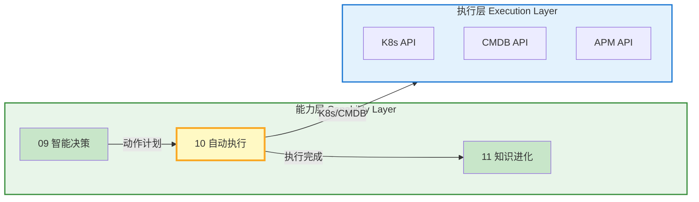
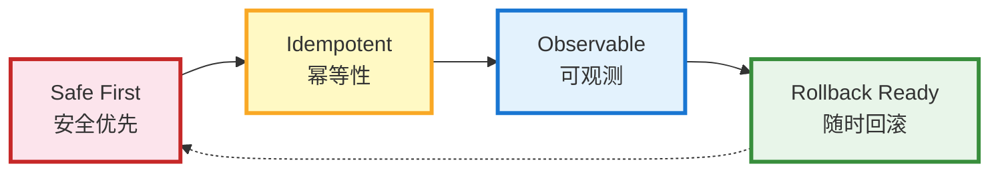
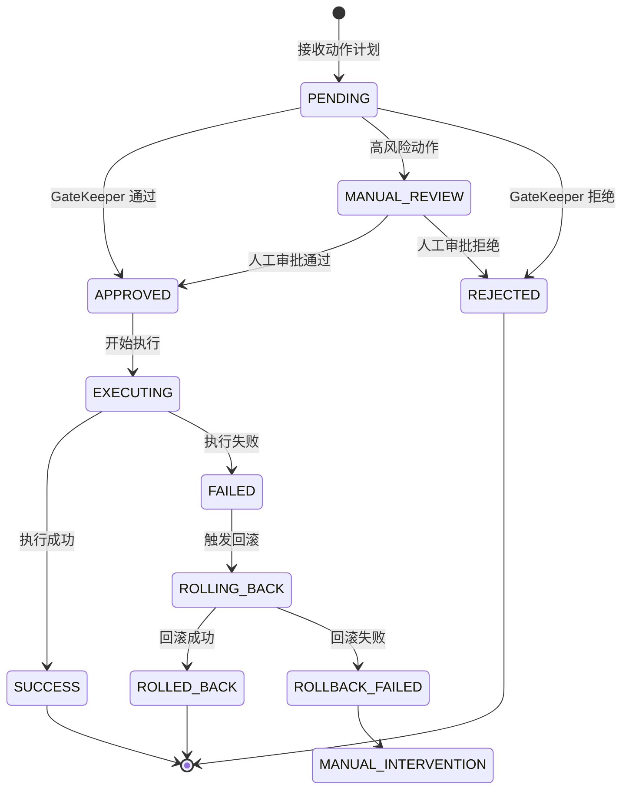
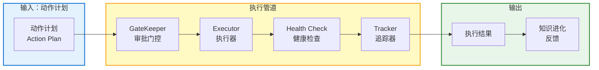
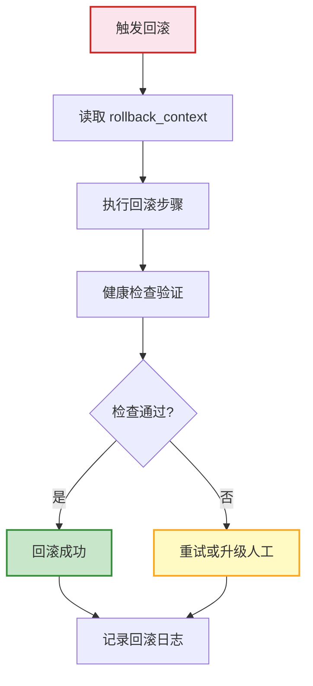
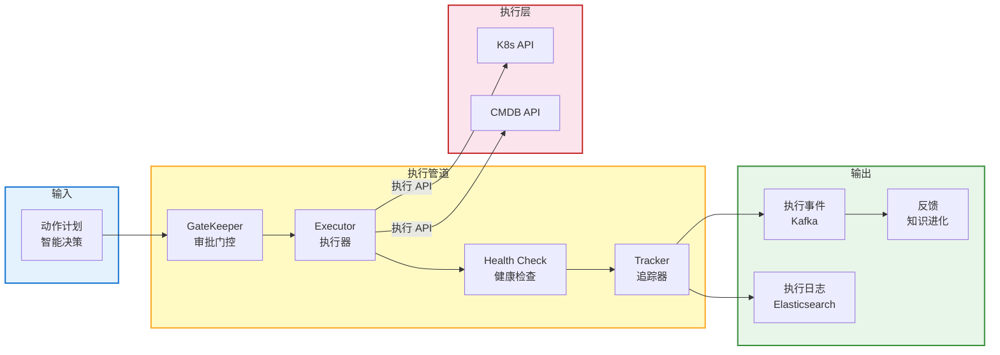
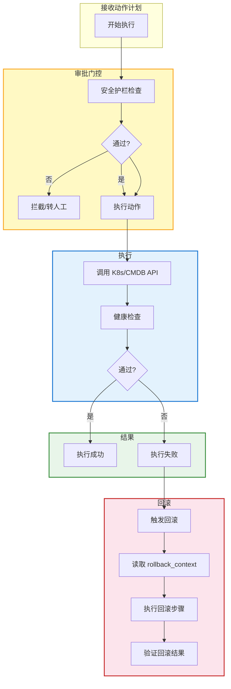
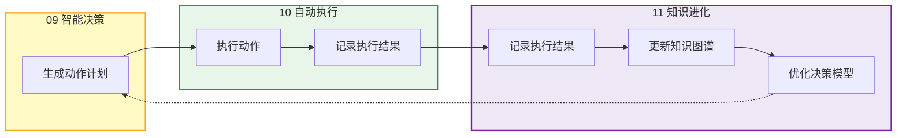

# 模块 10 · 自动执行

> 自动执行是 Observable Ops 的「执行手臂」——接收智能决策输出的动作计划，通过审批门控验证后执行修复动作，提供回滚控制和安全护栏，确保执行过程可靠、可控、可追溯。

---

## 📑 目录

### 章节导航

- [1. 模块定位与职责](#1)
- [2. 自动执行模型](#2)
- [3. 核心功能分解](#3)
- [4. API 设计规范](#4)
- [5. 数据流架构](#5)
- [6. 模块协作关系](#6)
- [7. 量化指标体系](#7)
- [8. 部署架构](#8)
- [9. 本章小结](#9)

---

## 1. 模块定位与职责

### 1.1 在 4 层架构中的位置

自动执行属于**能力层**核心模块，接收智能决策的动作计划，经过审批门控后执行修复动作，并监控执行过程，是 Observable Ops 自动化的最终执行环节。



### 1.2 核心职责

| 职责 | 描述 | 输出 |
|------|------|------|
| **动作执行** | 执行智能决策输出的修复动作（重启/扩容/切换流量等） | 执行结果 |
| **审批门控** | 验证动作计划的合规性和安全性，决定是否自动放行或转人工 | 审批结论 |
| **回滚控制** | 执行失败或异常时自动回滚到执行前状态 | 回滚结果 |
| **执行追踪** | 记录执行过程日志、耗时、状态变更，供事后复盘 | 执行追踪记录 |
| **安全护栏** | 危险操作拦截、黑名单检查、最大影响范围限制 | 护栏拦截事件 |

### 1.3 核心设计原则



- **安全优先（Safe First）**：所有动作必须通过安全护栏检查，高风险动作强制人工审批
- **幂等性（Idempotent）**：动作可重复执行而不产生副作用，支持失败重试
- **可观测（Observable）**：执行过程全程可观测，状态变更实时通知
- **随时回滚（Rollback Ready）**：每个动作执行前保存回滚上下文，失败时快速回滚

### 1.4 子模块划分

| 子模块 | 职责 | 技术选型 |
|--------|------|----------|
| **Executor** 动作执行器 | 对接 K8s/CMDB 等执行层 API，实际执行修复动作 | Python / K8s Client |
| **GateKeeper** 审批门控 | 安全检查、合规验证、审批流程控制 | Python / 规则引擎 |
| **RollbackController** 回滚控制器 | 保存回滚上下文、执行回滚操作、验证回滚结果 | Python / State Machine |
| **ExecutionTracker** 执行追踪器 | 记录执行日志、状态变更、时间线追踪 | Python / Elasticsearch |
| **SafetyGuard** 安全护栏 | 危险操作拦截、黑名单检查、最大影响限制 | Python / 规则引擎 |

---

## 2. 自动执行模型

### 2.1 动作执行模型（Action Execution Model）

动作执行模型描述每个动作的执行上下文、状态和结果。

#### 2.1.1 执行记录

| 字段 | 类型 | 说明 | 示例 |
|------|------|------|------|
| `execution_id` | String (UUID) | 执行记录唯一标识 | `exe-20260607-001` |
| `action_id` | String | 对应的动作 ID | `act-20260607-001` |
| `action_type` | Enum | 动作类型 | `RESTART` |
| `target_node_id` | String | 目标节点 ID | `svc-001` |
| `status` | Enum | 执行状态：PENDING/APPROVED/EXECUTING/SUCCESS/FAILED/ROLLED_BACK | `EXECUTING` |
| `start_time` | Timestamp | 开始执行时间 | `2026-06-07T08:17:30Z` |
| `end_time` | Timestamp | 执行结束时间 | `2026-06-07T08:18:00Z` |
| `result` | Object | 执行结果详情 | `{"message": "Restart successful", "health_check_passed": true}` |
| `rollback_context` | Object | 回滚所需上下文（如重启前的配置快照） | `{"config_snapshot": "...", "replicas_before": 3}` |

#### 2.1.2 执行状态机



### 2.2 审批工作流模型（Approval Workflow Schema）

| 字段 | 类型 | 说明 |
|------|------|------|
| `workflow_id` | String (UUID) | 工作流唯一标识 |
| `plan_id` | String | 关联的动作计划 ID |
| `steps` | List[ApprovalStep] | 审批步骤序列 |
| `current_step` | Integer | 当前审批步骤索引 |
| `status` | Enum | PENDING/APPROVED/REJECTED |
| `timeout_seconds` | Integer | 审批超时时间（超时不通过则拒绝） |

### 2.3 回滚策略模型（Rollback Strategy Schema）

| 字段 | 类型 | 说明 |
|------|------|------|
| `rollback_id` | String (UUID) | 回滚记录唯一标识 |
| `execution_id` | String | 关联的执行记录 ID |
| `rollback_type` | Enum | 回滚类型：CONFIG_RESTORE/REPLICA_RESTORE/TRAFFIC_RESTORE/VERSION_ROLLBACK |
| `rollback_steps` | List[RollbackStep] | 回滚操作步骤 |
| `status` | Enum | PENDING/IN_PROGRESS/SUCCESS/FAILED |
| `trigger_condition` | String | 触发回滚的条件（如执行超时、健康检查失败） |

---

## 3. 核心功能分解

### 3.1 动作执行器（Action Executor）

#### 3.1.1 执行器类型

| 执行器 | 对应动作类型 | 执行 API | 健康检查方式 |
|--------|-------------|----------|-------------|
| **K8s Executor** | RESTART/SCALE_OUT/ISOLATE | K8s API（kubectl/pod management） | K8s readiness/liveness probe |
| **CMDB Executor** | CONFIG_FIX/SWITCH_TRAFFIC | CMDB REST API | HTTP health check / telnet |
| **LoadBalancer Executor** | SWITCH_TRAFFIC | LB API（nginx/HAProxy/云 LB） | TCP port check |
| **Script Executor** | 自定义修复脚本 | SSH 执行远程脚本 | 脚本返回码 + 输出 |

#### 3.1.2 执行流程



### 3.2 审批门控（Approval Gate）

#### 3.2.1 门控检查项

| 检查项 | 描述 | 检查方式 | 失败处理 |
|--------|------|----------|----------|
| **安全护栏** | 检查动作是否在黑名单中（危险操作） | 规则匹配 | 强制人工审批 |
| **权限检查** | 验证执行账号是否有权限操作目标节点 | RBAC 检查 | 拒绝执行 |
| **资源检查** | 检查目标节点资源是否足够执行动作 | 查询监控数据 | 拒绝或降级 |
| **影响范围检查** | 检查动作影响节点数是否超过阈值 | 查询拓扑 | 强制人工审批 |
| **业务窗口检查** | 检查当前是否在禁止操作的业务窗口 | 时间窗口规则 | 延迟执行 |
| **前置条件检查** | 验证动作的 prerequisites 是否满足 | 状态查询 | 等待或跳过 |

#### 3.2.2 审批规则配置

| 风险等级 | 动作类型 | 审批要求 | 自动放行条件 |
|----------|----------|----------|--------------|
| 低风险 | RESTART（非核心服务）、SCALE_OUT | 无需审批，自动执行 | —— |
| 中风险 | RESTART（核心服务）、SWITCH_TRAFFIC | 自动执行，事后通知 | 影响节点 < 5 |
| 高风险 | ISOLATE、ROLLBACK（生产环境）、CONFIG_FIX | 强制人工审批 | —— |

### 3.3 回滚控制器（Rollback Controller）

#### 3.3.1 回滚触发条件

| 触发条件 | 描述 | 处理策略 |
|----------|------|----------|
| **执行超时** | 动作执行超过预设超时时间 | 自动触发回滚 |
| **健康检查失败** | 执行后健康检查持续失败超过阈值 | 自动触发回滚 |
| **执行报错** | 执行 API 返回错误 | 自动触发回滚 |
| **人工触发** | 运维人员手动触发回滚 | 人工触发 |

#### 3.3.2 回滚执行流程



### 3.4 执行追踪器（Execution Tracker）

#### 3.4.1 追踪记录内容

| 记录类型 | 描述 | 记录时机 |
|----------|------|----------|
| **开始记录** | 记录动作开始执行的时间、参数、环境 | 执行开始时 |
| **状态变更记录** | 记录每个状态变更（APPROVED → EXECUTING → SUCCESS） | 状态变更时 |
| **日志记录** | 记录执行过程中的详细日志（stdout/stderr） | 实时 |
| **指标记录** | 记录执行耗时、资源使用、吞吐量变化 | 执行中/完成后 |
| **结果记录** | 记录执行结果（成功/失败）、返回数据、影响范围 | 执行完成时 |

### 3.5 安全护栏（Safety Guard）

#### 3.5.1 护栏规则

| 护栏类型 | 规则描述 | 拦截动作 |
|----------|----------|----------|
| **黑名单拦截** | 禁止执行 rm -rf /、drop database 等危险操作 | 所有匹配黑名单的操作 |
| **最大影响范围** | 单次操作影响节点数不能超过 20 个 | 超过阈值的批量操作 |
| **并发执行限制** | 同一节点同时只能有 1 个执行任务 | 冲突的并发任务 |
| **冷却时间** | 同一动作在同一节点需要间隔 5 分钟才能再次执行 | 冷却期内的重复动作 |
| **执行时间窗口** | 生产环境变更只能在维护窗口（02:00-06:00）执行 | 窗口外的生产变更 |

---

## 4. API 设计规范

### 4.1 REST API（同步查询）

| 方法 | 路径 | 描述 | 请求体 | 响应 |
|------|------|------|--------|------|
| POST | `/api/v1/execution/execute` | 接收并执行动作计划 | ActionPlan | ExecutionResponse |
| GET | `/api/v1/execution/status/{execution_id}` | 查询执行状态 | —— | ExecutionStatus |
| GET | `/api/v1/execution/logs/{execution_id}` | 查询执行日志 | `?tail=100` | LogEntry[] |
| POST | `/api/v1/execution/rollback/{execution_id}` | 触发回滚 | RollbackRequest | RollbackResponse |
| GET | `/api/v1/execution/history` | 查询执行历史 | `?plan_id=&start_time=` | ExecutionRecord[] |
| POST | `/api/v1/execution/approve/{workflow_id}` | 人工审批通过 | ApprovalRequest | 200 OK |
| POST | `/api/v1/execution/reject/{workflow_id}` | 人工审批拒绝 | RejectionRequest | 200 OK |
| PUT | `/api/v1/execution/safety-rules` | 更新安全护栏规则 | SafetyRuleConfig | 200 OK |

### 4.2 gRPC API（高性能场景）

| 服务 | 方法 | 适用场景 | 性能要求 |
|------|------|----------|----------|
| `ExecutionService` | `ExecuteAction(ActionRequest)` | 执行单个动作 | P99 < 30s（取决于动作类型） |
| `ExecutionService` | `GetExecutionStatus(StatusRequest)` | 查询执行状态 | P99 < 100ms |
| `ExecutionService` | `StreamExecutionLog(LogRequest)` | 流式推送执行日志 | < 100ms 延迟 |

### 4.3 Kafka 事件（异步通知）

| Topic | 事件类型 | 发布者 | 订阅者 | 说明 |
|-------|----------|--------|--------|------|
| `execution.started` | 动作开始执行 | 自动执行模块 | Dashboard/知识进化 | 推送执行开始事件 |
| `execution.completed` | 动作执行完成 | 自动执行模块 | 智能决策/知识进化 | 推送执行结果 |
| `execution.failed` | 动作执行失败 | 自动执行模块 | 智能决策/告警系统 | 推送失败原因 |
| `execution.rollback.triggered` | 触发回滚 | 自动执行模块 | Dashboard/告警系统 | 推送回滚事件 |
| `execution.approval.required` | 需要人工审批 | 自动执行模块 | 告警系统/值班人员 | 推送审批请求 |

### 4.4 API 质量指标

| 指标 | SLO 目标 | 告警阈值 | 说明 |
|------|----------|----------|------|
| **执行成功率** | > 95% | < 90% | 动作成功执行的比例 |
| **回滚成功率** | > 98% | < 95% | 回滚操作成功的比例 |
| **审批延迟** | < 30s | > 60s | 人工审批平均延迟 |
| **可用率** | 99.9% | < 99.5% | 月度可用率 |

---

## 5. 数据流架构

### 5.1 整体数据流



### 5.2 执行-回滚流程



### 5.3 执行-知识进化闭环



---

## 6. 模块协作关系

### 6.1 依赖矩阵

| 模块 | 依赖自动执行的什么 | 依赖类型 | 接口方式 |
|------|-------------------|----------|----------|
| **09 智能决策** | 动作计划输出到自动执行模块执行 | 数据依赖 | Kafka 事件订阅 |
| **11 知识进化** | 执行结果反馈到知识进化模块学习 | 数据依赖 | Kafka 事件订阅 |
| **Dashboard** | 执行状态实时展示、执行日志查询 | 数据依赖 | REST 查询 |
| **告警系统** | 执行失败/回滚触发时发送告警 | 数据依赖 | Kafka 事件订阅 |

### 6.2 输出接口契约

#### 6.2.1 执行结果格式

```
{
  "execution_id": "exe-20260607-001",
  "action_id": "act-20260607-001",
  "status": "SUCCESS",
  "start_time": "2026-06-07T08:17:30Z",
  "end_time": "2026-06-07T08:18:00Z",
  "duration_seconds": 30,
  "result": {
    "message": "Service restarted successfully",
    "health_check_passed": true,
    "replicas_after": 3
  },
  "impact": {
    "affected_nodes": ["svc-001"],
    "traffic_impact": "minimal"
  },
  "execution_log_url": "/api/v1/execution/logs/exe-20260607-001"
}
```

#### 6.2.2 回滚结果格式

```
{
  "rollback_id": "rb-20260607-001",
  "execution_id": "exe-20260607-001",
  "status": "SUCCESS",
  "rollback_type": "REPLICA_RESTORE",
  "trigger_condition": "health_check_failed",
  "start_time": "2026-06-07T08:18:30Z",
  "end_time": "2026-06-07T08:19:00Z",
  "result": {
    "message": "Replicas restored to 3",
    "health_check_passed": true
  }
}
```

---

## 7. 量化指标体系

### 7.1 执行质量指标

| 指标 | 描述 | 基线（当前） | 目标 | 测量方式 |
|------|------|-------------|------|----------|
| **执行成功率** | 动作成功执行的比例 | 88% | > 95% | 执行结果统计 |
| **回滚次数** | 需要回滚的执行次数 | 12% | < 5% | 执行记录统计 |
| **回滚成功率** | 回滚操作成功的比例 | 90% | > 98% | 回滚记录统计 |
| **护栏拦截次数** | 安全护栏拦截危险操作的次数 | 统计 | 保持 | 护栏日志统计 |

### 7.2 性能质量指标

| 指标 | 描述 | SLO 目标 | 告警阈值 |
|------|------|----------|----------|
| **平均执行时间** | 动作从开始到完成的平均时间 | < 60s | > 120s |
| **审批延迟** | 人工审批平均延迟时间 | < 30s | > 60s |
| **并发执行能力** | 同时执行的动作数 | 20 | < 10 |
| **日志完整性** | 执行日志记录完整率 | 100% | < 99% |

### 7.3 业务价值指标

| 指标 | 描述 | 当前 | 目标 |
|------|------|------|------|
| **自动化执行覆盖率** | 无需人工干预的执行比例 | 65% | > 85% |
| **执行可靠性提升** | 自动执行减少人工错误的比例 | 基准 | +30% |
| **平均恢复时间缩短** | 自动执行提升故障恢复速度 | 基准 | -40% |

---

## 8. 部署架构

### 8.1 K8s 部署拓扑

```mermaid
flowchart LR
    subgraph 控制面["控制面"]
        API[API Server]
    end

    subgraph 计算层["计算层"]
        subgraph 服务["Execution 服务 StatefulSet"]
            EX1[Execution Service x2]
        end
        subgraph 工作器["Executor Worker"]
            EW1[Executor x3]
        end
    end

    subgraph 存储层["存储层"]
        RD[(Redis<br/>状态缓存)]
        ES[(Elasticsearch<br/>日志存储)]
        KF[(Kafka<br/>事件总线)]
    end

    ID[09 智能决策] -->|Kafka| EX1
    EX1 -->|写入| RD
    EX1 -->|日志| ES
    EX1 -->|事件| KF
    KF -->|订阅| 11 知识进化

    style 计算层 fill:#e3f2fd,stroke:#1976d2,stroke-width:2px
    style 存储层 fill:#fff9c4,stroke:#f9a825,stroke-width:2px
    style EX1 fill:#c8e6c9,stroke:#388e3c,stroke-width:3px
```

### 8.2 资源配置

| 组件 | 副本数 | CPU | 内存 | 存储 | 备注 |
|------|--------|-----|------|------|------|
| **Execution Service** | 2（主备） | 4 核 | 8 GB | —— | StatefulSet，接收执行请求 |
| **Executor Worker** | 3（并行） | 2 核 | 4 GB | —— | 执行实际修复动作 |
| **GateKeeper** | 2 | 2 核 | 4 GB | —— | 审批门控检查 |
| **Redis Cluster** | 3 节点 | 2 核 | 8 GB | —— | 执行状态缓存 |
| **Elasticsearch** | 3 节点 | 4 核 | 16 GB | 500 GB SSD | 执行日志存储 |

### 8.3 高可用设计

- **服务多副本**：Execution Service 部署 2 副本，Kubernetes 自动负载均衡
- **执行器并行**：Executor Worker 3 副本，并行执行不同动作
- **状态持久化**：执行状态存储 Redis，Elasticsearch 存储完整日志
- **幂等执行**：所有动作设计为幂等操作，支持失败重试
- **回滚保障**：每个动作执行前保存回滚上下文，确保可回滚

---

## 9. 本章小结

### 9.1 核心要点

| 维度 | 核心要点 | 量化目标 |
|------|----------|----------|
| **定位** | 能力层执行终端，智能决策的执行手臂，安全可靠的修复执行者 | —— |
| **模型** | 执行记录模型 + 审批工作流模型 + 回滚策略模型，支撑安全执行 | 执行成功率 > 95% |
| **能力** | 动作执行 + 审批门控 + 回滚控制 + 执行追踪 + 安全护栏 5 大能力 | 回滚成功率 > 98% |
| **接口** | REST + gRPC + Kafka，对接 K8s/CMDB 执行，输出执行结果 | 平均执行 < 60s |
| **质量** | 执行成功率 / 回滚成功率 / 审批延迟 / 并发能力 | 自动化执行覆盖 > 85% |

### 9.2 关键成功要素

| 要素 | 优先级 | 实施策略 |
|------|--------|----------|
| **安全护栏完善** | P0 | 完善黑名单规则和影响范围限制，确保执行安全 |
| **幂等性保证** | P0 | 所有动作支持幂等执行，失败可重试不产生副作用 |
| **回滚机制验证** | P1 | 定期演练回滚操作，确保回滚成功率达到目标 |
| **执行日志完整性** | P1 | 确保执行过程全程可追溯，为复盘提供依据 |
| **对接执行层** | P2 | 打通知 K8s/CMDB 等执行层 API，丰富执行器类型 |

### 9.3 与其他模块的边界

| 边界 | 说明 |
|------|------|
| **vs 09 智能决策** | 智能决策负责「制定计划」，自动执行负责「执行计划」，智能决策输出是自动执行的输入，自动执行反馈执行结果给智能决策 |
| **vs 11 知识进化** | 自动执行提供执行结果数据，知识进化学习这些数据优化决策模型，形成闭环 |
| **vs K8s/CMDB 执行层** | 自动执行是执行层的统一抽象，对上承接动作计划，对下调用具体执行层 API |

**记忆口诀：**

> **动作计划接在手，审批门控先过问；安全护栏不放松，幂等执行保平安；健康检查通过后，执行日志记得全；回滚上下文保存好，随时可回退。**

---

> 本章定义了模块 10 自动执行的详细功能设计规范。自动执行作为能力层的执行终端，承接智能决策的动作计划，通过安全护栏和审批门控确保执行可靠，是 Observable Ops 自动化的最终保障。

*文档版本：V1.0 | 更新日期：2026-06-07*