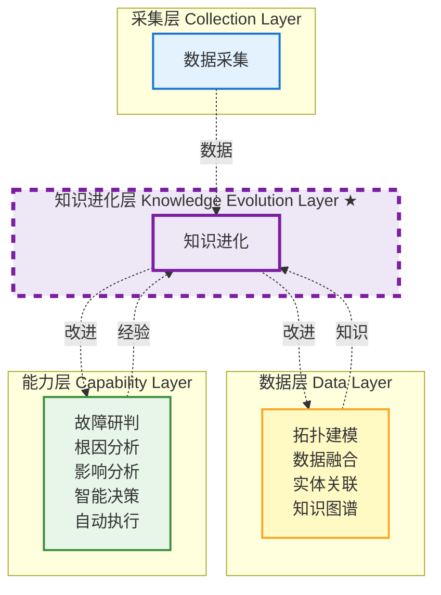
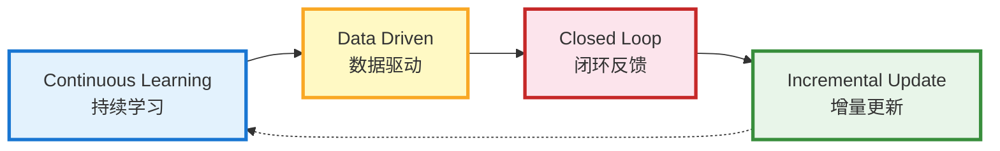
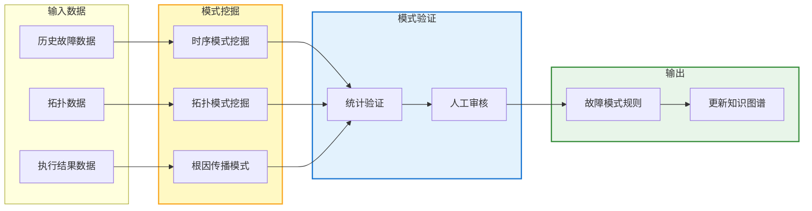
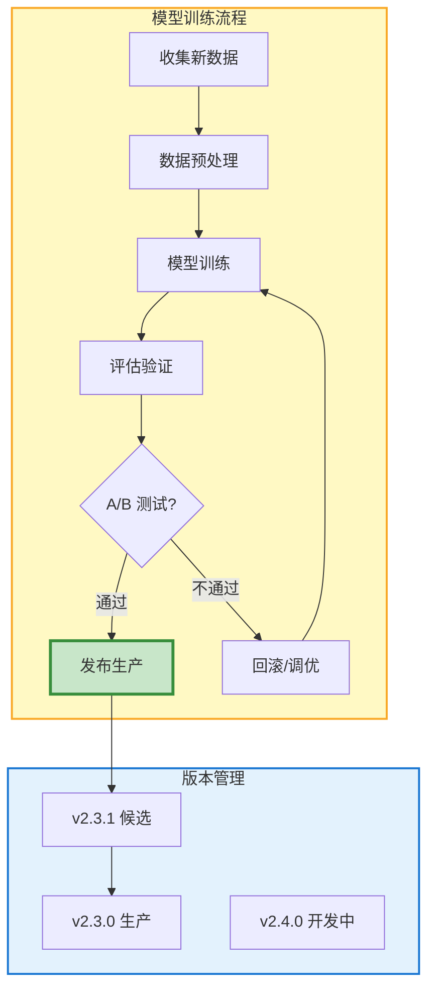
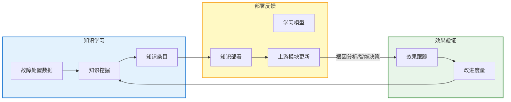
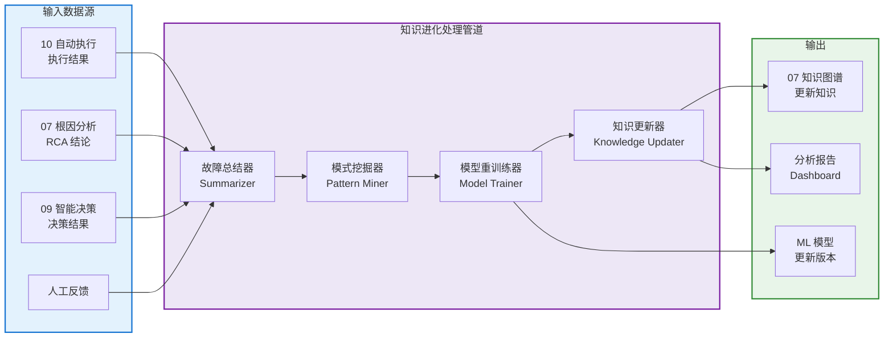
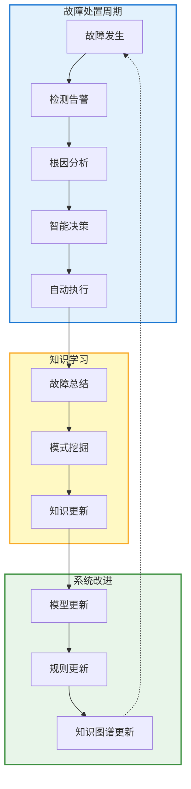
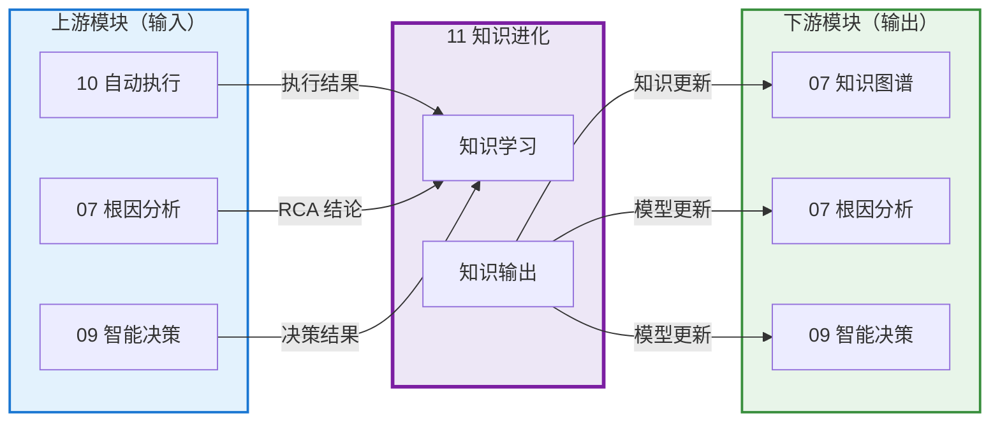

# 模块 11 · 知识进化

> 知识进化是 Observable Ops 的「学习引擎」——跨所有层级运作，从每个故障处置周期中捕获知识，更新知识图谱和改进 ML 模型，闭合反馈循环，使系统越用越聪明。

---

## 📑 目录

### 章节导航

-1. 模块定位与职责
- 2. 知识进化模型
- 3. 核心功能分解
- 4. API 设计规范
- 5. 数据流架构
- 6. 模块协作关系
- 7. 量化指标体系
- 8. 部署架构
- 9. 本章小结

---

## 1. 模块定位与职责

### 1.1 在 4 层架构中的位置

知识进化属于**知识进化层（Knowledge Evolution Layer）**，是跨裁切的横向层，不属于主数据流中的顺序位置，而是与所有层级交互，捕获学习、反馈改进。



### 1.2 核心职责

| 职责 | 描述 | 输出 |
|------|------|------|
| **故障总结生成** | 从故障处置周期中自动提取关键信息，生成结构化故障总结 | Incident Summary |
| **模式挖掘** | 从历史故障数据中挖掘故障模式，更新知识图谱规则 | Fault Pattern |
| **模型重训练** | 收集新数据，定期重训练 ML 模型，提升预测准确率 | Model Version |
| **知识库更新** | 将新学到的知识写入知识图谱，供其他模块查询使用 | Knowledge Entry |
| **反馈闭环** | 将学习成果反哺到上游模块（根因分析/智能决策），形成闭环 | Model Update / Config Update |

### 1.3 核心设计原则



- **持续学习（Continuous Learning）**：每个故障处置周期都是学习机会，不停歇
- **数据驱动（Data Driven）**：所有知识来源于实际数据，而非人工主观输入
- **闭环反馈（Closed Loop）**：学习成果必须反哺到上游模块，形成改进闭环
- **增量更新（Incremental Update）**：知识积累是增量式的，不丢弃历史数据

### 1.4 子模块划分

| 子模块 | 职责 | 技术选型 |
|--------|------|----------|
| **Summarizer** 故障总结器 | 从故障事件中提取关键信息，生成结构化总结 | Python / NLP 模型 |
| **PatternMiner** 模式挖掘器 | 从历史数据中挖掘故障模式和关联规则 | Python / Spark ML |
| **ModelTrainer** 模型重训练器 | 定期重训练 ML 模型，评估性能，发布新版本 | Python / MLflow |
| **KnowledgeUpdater** 知识更新器 | 将新知识写入知识图谱，保持知识新鲜度 | Python / 图数据库 API |
| **FeedbackLoop** 反馈闭环器 | 将学习成果部署到上游模块，验证改进效果 | Python / CI/CD |

---

## 2. 知识进化模型

### 2.1知识条目模型（Knowledge Entry Schema）

知识条目是知识进化的核心输出，表示从故障中提取的结构化知识。

#### 2.1.1 知识条目结构

| 字段 | 类型 | 说明 | 示例 |
|------|------|------|------|
| `entry_id` | String (UUID) | 知识条目唯一标识 | `ke-20260607-001` |
| `knowledge_type` | Enum | 知识类型：FAULT_PATTERN/ROOT_CAUSE/Remediation/Similar_Incident | `FAULT_PATTERN` |
| `incident_id` | String | 来源故障事件 ID | `inc-20260607-042` |
| `fault_type` | String | 故障类型 | `service_crash` |
| `root_cause` | String | 根因描述 | `数据库连接池耗尽` |
| `remediation` | String | 修复方法 | `重启服务并调大连接池` |
| `effectiveness` | Float [0-1] | 修复有效性评分 | `0.95` |
| `confidence` | Float [0-1] | 知识可信度 | `0.88` |
| `linked_nodes` | List[String] | 关联的拓扑节点 ID | `["svc-001", "db-primary"]` |
| `learned_at` | Timestamp | 学习时间 | `2026-06-07T10:00:00Z` |

#### 2.1.2 知识类型说明

| 知识类型 | 描述 | 使用场景 |
|----------|------|----------|
| `FAULT_PATTERN` | 故障模式：某种故障的典型表现和发生规律 | 根因分析推理 |
| `ROOT_CAUSE` | 根因知识：特定故障的常见根因 | 根因分析规则 |
| `REMEDIATION` | 修复知识：特定故障的推荐修复方法 | 智能决策候选生成 |
| `SIMILAR_INCIDENT` | 相似故障：历史上类似的故障案例 | 参考决策 |

### 2.2 学习记录模型（Learning Record Model）

| 字段 | 类型 | 说明 |
|------|------|------|
| `record_id` | String (UUID) | 学习记录唯一标识 |
| `incident_id` | String | 关联故障事件 ID |
| `learning_type` | Enum | 学习类型：AUTO_LEARNED/MANUAL_CORRECTED/HUMAN_ANNOTATED |
| `input_data` | Object | 学习输入数据（故障上下文、执行结果等） |
| `output_knowledge` | Object | 学习输出的知识条目 |
| `model_version_before` | String | 学习前的模型版本 |
| `model_version_after` | String | 学习后的模型版本 |
| `improvement_score` | Float | 学习带来的改进评分 |

### 2.3 模型版本模型（Model Version Schema）

| 字段 | 类型 | 说明 |
|------|------|------|
| `version_id` | String | 模型版本标识（如 v2.3.1） |
| `model_type` | Enum | 模型类型：RCA_MODEL/IMPACT_MODEL/DECISION_MODEL/RISK_MODEL |
| `trained_at` | Timestamp | 训练时间 |
| `training_data_size` | Integer | 训练数据量（样本数） |
| `metrics` | Object | 模型评估指标（准确率/召回率/F1） |
| `is_production` | Boolean | 是否为当前生产版本 |
| `changelog` | String | 版本变更说明 |

---

## 3. 核心功能分解

### 3.1 故障总结生成（Incident Summarization）

#### 3.1.1 总结生成流程

1. **数据收集**：收集故障事件的所有相关数据（RCA 报告、影响范围、执行结果）
2. **信息提取**：从数据中提取关键信息（故障类型、根因、修复方法、耗时）
3. **结构化**：将信息整理为结构化格式
4. **质量审核**：检查总结的完整性和准确性
5. **存储**：写入知识库，关联到原始故障事件

#### 3.1.2 故障总结模板

```json
{
  "summary_id": "sum-20260607-001",
  "incident_id": "inc-20260607-042",
  "fault_type": "服务超时",
  "fault_duration_min": 25,
  "root_cause": "数据库主库连接池耗尽",
  "impact_scope": "12 个服务受影响",
  "remediation": "重启服务并调大连接池参数",
  "remediation_effectiveness": 0.95,
  "key_learnings": [
    "数据库连接池上限需要根据实际负载动态调整",
    "连接泄漏未及时发现导致问题积累"
  ],
  "action_items": [
    "增加连接池监控告警",
    "定期巡检连接池使用率"
  ]
}
```

### 3.2 模式挖掘（Pattern Mining）

#### 3.2.1 挖掘类型

| 模式类型 | 描述 | 挖掘算法 | 应用场景 |
|----------|------|----------|----------|
| **时序模式** | 故障发生的时间规律（如每晚 22:00 流量高峰） | 时序关联规则 | 预测性维护 |
| **拓扑模式** | 特定拓扑结构易发生故障（如单点部署的服务） | 图挖掘算法 | 架构优化建议 |
| **根因传播模式** | 特定根因的典型传播路径 | 序列模式挖掘 | 根因分析推理 |
| **修复效果模式** | 特定修复方法的有效性规律 | 统计归纳 | 智能决策候选排序 |

#### 3.2.2 模式发现流程



### 3.3 模型重训练（Model Retraining）

#### 3.3.1 重训练触发条件

| 触发条件 | 描述 | 优先级 |
|----------|------|--------|
| **定期训练** | 每周/每月自动触发模型重训练 | 常规 |
| **性能衰减告警** | 模型准确率低于阈值时触发 | 告警 |
| **新知识积累** | 新知识条目数超过阈值时触发 | 常规 |
| **人工触发** | 运维人员手动触发重训练 | 手动 |

#### 3.3.2 模型版本管理



### 3.4 知识库更新（Knowledge Base Update）

#### 3.4.1 更新策略

| 更新类型 | 描述 | 更新频率 |
|----------|------|----------|
| **增量更新** | 每次故障处置后自动更新新知识条目 | 实时 |
| **批量更新** | 周期性地将模式挖掘结果批量写入知识图谱 | 每周 |
| **版本同步** | 将新模型版本同步到所有使用该模型的模块 | 按需 |

#### 3.4.2 知识质量控制

| 质量维度 | 检查方式 | 处理策略 |
|----------|----------|----------|
| **完整性** | 检查必填字段是否完整 | 缺失字段时拒绝写入 |
| **一致性** | 检查新知识与已有知识是否冲突 | 冲突时合并或标记待审核 |
| **时效性** | 检查知识是否过期（如已下线的服务） | 过期知识自动归档 |

### 3.5 反馈闭环（Feedback Closure）

#### 3.5.1 闭环流程



#### 3.5.2 闭环效果度量

| 度量指标 | 描述 | 目标 |
|----------|------|------|
| **模型准确率提升** | 模型重训练后准确率相对提升 | > 5% |
| **决策采纳率** | 智能决策输出的计划被人工直接采纳的比例 | > 90% |
| **知识复用率** | 新知识被后续故障处置使用的比例 | > 40% |

---

## 4. API 设计规范

### 4.1 REST API（同步查询）

| 方法 | 路径 | 描述 | 请求体 | 响应 |
|------|------|------|--------|------|
| POST | `/api/v1/knowledge/learn` | 触发知识学习流程 | LearningRequest | LearningResponse |
| GET | `/api/v1/knowledge/entries` | 查询知识条目列表 | `?type=FAULT_PATTERN&limit=20` | KnowledgeEntry[] |
| GET | `/api/v1/knowledge/entry/{entry_id}` | 查询知识条目详情 | —— | KnowledgeEntry |
| GET | `/api/v1/knowledge/patterns` | 查询已挖掘的故障模式 | —— | FaultPattern[] |
| GET | `/api/v1/knowledge/models/versions` | 查询模型版本列表 | `?model_type=RCA_MODEL` | ModelVersion[] |
| POST | `/api/v1/knowledge/models/train` | 触发模型重训练 | TrainRequest | TrainResponse |
| POST | `/api/v1/knowledge/feedback` | 提交人工反馈（纠正知识） | FeedbackRequest | 200 OK |
| GET | `/api/v1/knowledge/summary/{incident_id}` | 查询故障总结 | —— | IncidentSummary |

### 4.2 Kafka 事件（异步事件流）

| Topic | 事件类型 | 发布者 | 订阅者 | 说明 |
|-------|----------|--------|--------|------|
| `knowledge.entry.created` | 新知识条目创建 | 知识进化模块 | 知识图谱/根因分析 | 新知识可用通知 |
| `knowledge.pattern.discovered` | 新故障模式发现 | 知识进化模块 | 知识图谱/Dashboard | 模式挖掘结果通知 |
| `knowledge.model.updated` | 模型版本更新 | 知识进化模块 | 根因分析/智能决策 | 新模型上线通知 |
| `knowledge.feedback.received` | 人工反馈到达 | Dashboard/运维人员 | 知识进化模块 | 触发知识纠正 |
| `execution.completed` | 执行结果反馈 | 自动执行模块 | 知识进化模块 | 触发学习流程 |

### 4.3 API 质量指标

| 指标 | SLO 目标 | 告警阈值 | 说明 |
|------|----------|----------|------|
| **学习延迟** | < 5min | > 10min | 故障处置完成后到知识条目生成的时间 |
| **知识覆盖增长率** | > 2%/月 | < 0.5%/月 | 每月新增知识条目数 |
| **模型更新频率** | 每 2 周 | > 4 周 | 模型重训练周期 |
| **知识质量评分** | > 90% | < 80% | 知识条目通过质量审核的比例 |

---

## 5. 数据流架构

### 5.1 整体数据流



### 5.2 知识进化循环



### 5.3 与其他模块的双向交互



---

## 6. 模块协作关系

### 6.1 依赖矩阵

| 模块 | 与知识进化的关系 | 依赖类型 | 接口方式 |
|------|------------------|----------|----------|
| **10 自动执行** | 提供执行结果数据（输入） | 数据依赖 | Kafka 事件订阅 |
| **07 根因分析** | 提供 RCA 结论（输入）+ 接收模型更新（输出） | 双向依赖 | Kafka 事件订阅 / 模型更新推送 |
| **09 智能决策** | 提供决策结果（输入）+ 接收模型更新（输出） | 双向依赖 | Kafka 事件订阅 / 模型更新推送 |
| **07 知识图谱** | 接收知识更新（输出）+ 提供历史知识查询 | 双向依赖 | REST API / Kafka 事件 |
| **Dashboard** | 展示知识进化报告和知识条目 | 数据依赖 | REST 查询 |

### 6.2 输出接口契约

#### 6.2.1 知识条目更新格式

```json
{
  "entry_id": "ke-20260607-001",
  "knowledge_type": "FAULT_PATTERN",
  "fault_type": "service_crash",
  "pattern": "数据库连接池耗尽 → 服务无响应",
  "confidence": 0.88,
  "linked_nodes": ["svc-001", "db-primary"],
  "remediation": "调大连接池参数 + 重启服务",
  "effectiveness": 0.95,
  "learned_at": "2026-06-07T10:00:00Z",
  "source_incident": "inc-20260607-042"
}
```

#### 6.2.2 模型更新通知格式

```json
{
  "model_type": "RCA_MODEL",
  "old_version": "v2.3.0",
  "new_version": "v2.3.1",
  "improvement_metrics": {
    "accuracy_improvement": 0.05,
    "new_training_samples": 150
  },
  "deployed_at": "2026-06-07T10:30:00Z",
  "affected_modules": ["07 根因分析", "09 智能决策"]
}
```

---

## 7. 量化指标体系

### 7.1 学习效果指标

| 指标 | 描述 | 基线（当前） | 目标 | 测量方式 |
|------|------|--------------|------|----------|
| **知识覆盖率** | 已建模的故障类型占总故障类型的比例 | 60% | > 85% | 故障类型统计 |
| **模型改进率** | 模型重训练后准确率相对提升 | 3% | > 5% | A/B 测试对比 |
| **知识复用率** | 新知识被后续故障处置使用的比例 | 25% | > 40% | 知识查询统计 |
| **学习周期时间** | 从故障处置完成到知识条目生成的时间 | 10min | < 5min | 系统自动测量 |

### 7.2 知识质量指标

| 指标 | 描述 | SLO 目标 | 告警阈值 |
|------|------|----------|----------|
| **知识质量评分** | 知识条目通过质量审核的比例 | > 90% | < 80% |
| **知识冲突率** | 新知识与已有知识冲突的比例 | < 5% | > 10% |
| **知识过期率** | 知识条目过期的比例 | < 10% | > 20% |
| **人工纠正率** | 需要人工纠正的知识条目比例 | < 15% | > 30% |

### 7.3 业务价值指标

| 指标 | 描述 | 当前 | 目标 |
|------|------|------|------|
| **系统智能化提升** | 知识进化带来的整体智能化提升 | 基准 | +20%/年 |
| **故障重复发生率降低** | 相同根因故障重复发生的比例下降 | 基准 | -30% |
| **运维效率提升** | 知识复用减少人工排查时间 | 基准 | +25% |

---

## 8. 部署架构

### 8.1 K8s 部署拓扑

```mermaid
flowchart LR
    subgraph 控制面["控制面"]
        API[API Server]
    end

    subgraph 计算层["计算层"]
        subgraph 服务["Knowledge 服务 StatefulSet"]
            KE1[Knowledge Service x2]
        end
        subgraph 工作器["学习 Worker"]
            LW1[Learner Worker x2]
            LW2[Pattern Miner x1]
        end
    end

    subgraph 存储层["存储层"]
        KG[(知识图谱<br/>图数据库)]
        ML[(MLflow<br/>模型存储)]
        RD[(Redis<br/>缓存)]
        KF[(Kafka<br/>事件总线)]
    end

    EX[10 自动执行] -->|Kafka| KE1
    RCA[07 根因分析] -->|Kafka| KE1
    KE1 -->|写入| KG
    KE1 -->|模型| ML
    ML -->|推送| RCA
    ML -->|推送| 09 智能决策

    style 计算层 fill:#ede7f6,stroke:#7b1fa2,stroke-width:2px
    style 存储层 fill:#fff9c4,stroke:#f9a825,stroke-width:2px
    style KE1 fill:#ede7f6,stroke:#7b1fa2,stroke-width:3px
```

### 8.2 资源配置

| 组件 | 副本数 | CPU | 内存 | 存储 | 备注 |
|------|--------|-----|------|------|------|
| **Knowledge Service** | 2（主备） | 4 核 | 8 GB | —— | StatefulSet，接收学习请求 |
| **Learner Worker** | 2 | 4 核 | 8 GB | —— | 执行模型重训练（GPU 支持） |
| **Pattern Miner** | 1 | 4 核 | 8 GB | —— | 模式挖掘计算 |
| **MLflow** | 1 主 | 4 核 | 16 GB | 100 GB SSD | 模型版本管理 |
| **Redis Cluster** | 3 节点 | 2 核 | 8 GB | —— | 学习结果缓存 |

### 8.3 高可用设计

- **服务多副本**：Knowledge Service 部署 2 副本，Kubernetes 自动负载均衡
- **学习工作器并行**：Learner Worker 2 副本，支持并行模型训练
- **模型版本管理**：MLflow 管理模型版本，支持回滚到历史版本
- **增量学习**：支持增量训练，不需要全量数据重训练
- **知识持久化**：知识图谱持久化存储，不丢失历史知识

---

## 9. 本章小结

### 9.1 核心要点

| 维度 | 核心要点 | 量化目标 |
|------|----------|----------|
| **定位** | 知识进化层，跨所有层级运作，是系统的学习引擎 | —— |
| **模型** | 知识条目模型 + 学习记录模型 + 模型版本模型，支撑知识积累 | 知识覆盖 > 85% |
| **能力** | 故障总结 + 模式挖掘 + 模型重训练 + 知识更新 + 反馈闭环 5 大能力 | 模型改进 > 5% |
| **接口** | REST + Kafka，接收各模块数据，输出知识更新和模型版本 | 学习周期 < 5min |
| **质量** | 知识覆盖率 / 模型改进率 / 知识复用率 / 学习周期 | 知识复用 > 40% |

### 9.2 关键成功要素

| 要素 | 优先级 | 实施策略 |
|------|--------|----------|
| **数据源打通** | P0 | 打通知动执行、根因分析、智能决策的数据流 |
| **知识质量控制** | P0 | 建立知识质量审核机制，确保知识准确可靠 |
| **模型更新机制** | P1 | 建立定期重训练和 A/B 测试机制 |
| **反馈闭环落地** | P1 | 确保学习成果真正反哺到上游模块 |
| **可视化展示** | P2 | Dashboard 展示知识进化效果和知识图谱 |

### 9.3 与其他模块的边界

| 边界 | 说明 |
|------|------|
| **vs 所有能力层模块** | 知识进化不执行具体业务逻辑，而是从所有业务模块中学习经验，再反哺回去，是横向跨层模块 |
| **vs 07 知识图谱** | 知识图谱是知识的存储层，知识进化负责生产（写入）知识，知识图谱负责管理（存储+查询）知识 |
| **vs 10 自动执行** | 自动执行提供执行结果作为学习素材，知识进化不执行动作 |
| **vs Dashboard** | 知识进化提供知识报告数据，Dashboard 负责展示，两者通过 REST 交互 |

**记忆口诀：**

> **知识进化跨全层，故障处置即学习；总结生成结构化，模式挖掘找规律；模型重训能力涨，知识复用更聪明；反馈闭环不停止，系统越用越聪明。**

---

> 本章定义了模块 11 知识进化的详细功能设计规范。知识进化作为知识进化层的核心模块，连接所有能力层模块，捕获学习、反馈改进，是 Observable Ops 持续优化的核心驱动力。

*文档版本：V1.0 | 更新日期：2026-06-07*