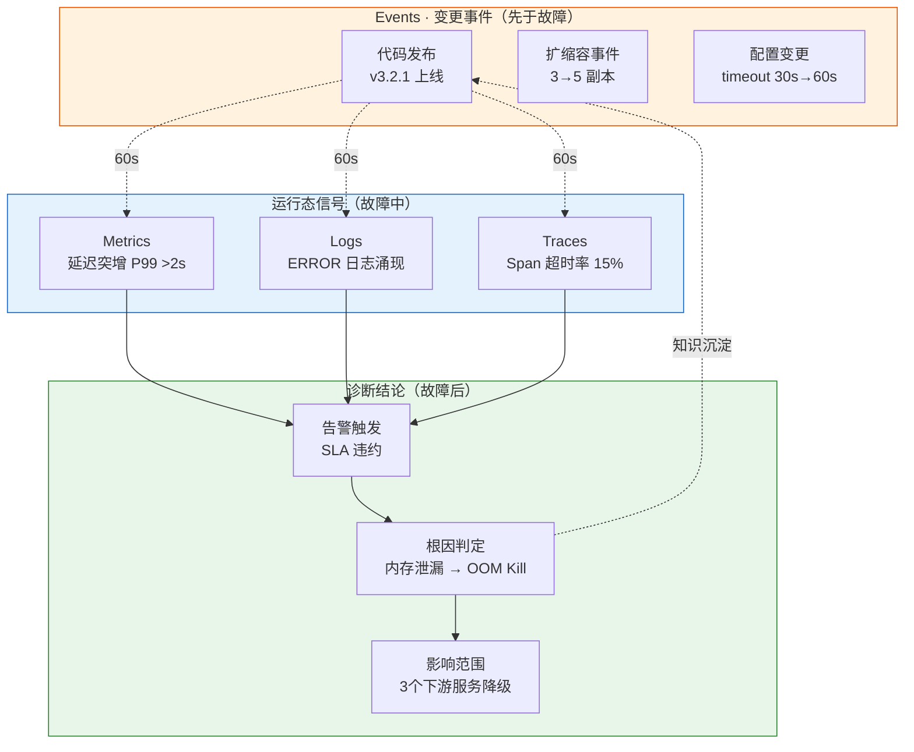
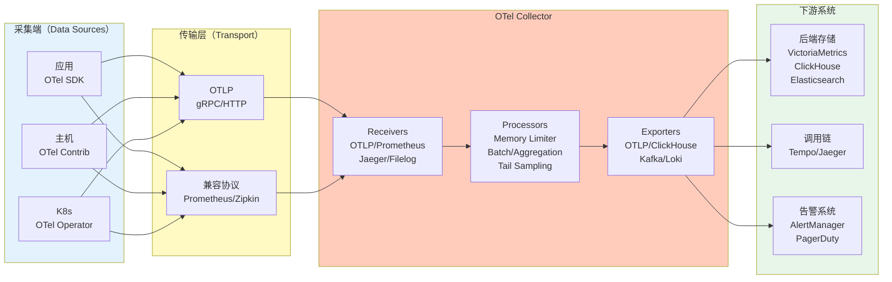
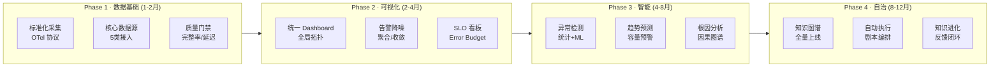

# 3.1 AIOps 基础与可观测性标准

> 本章节为 Observable Ops 提供理论基础：涵盖 AIOps 成熟度模型、可观测性三大支柱（+Events）、OpenTelemetry 规范体系、SRE 黄金指标、数据集成模式与分阶段实施路径。

---

## 1. AIOps 成熟度模型

### 1.1 六级成熟度定义

传统五级模型缺少「完全无监控」的初始状态，本方案补充 L0 构成六级体系：


| 等级 | 特征 | 核心能力 | 与本方案对应 |
|------|------|----------|--------------|
| **L0 缺失级** | 无系统化监控，纯靠用户投诉 | 人工巡检或无监控 | 启动基线 |
| **L1 初始级** | 人工巡检、被动告警 | 阈值告警、基础 Dashboard | 传统监控阶段 |
| **L2 响应级** | 规则自动化、多维度监控 | 事件关联、自动化脚本、CMDB | 数据融合层（统一标准化） |
| **L3 预测级** | ML 模型辅助决策 | 异常检测、趋势预测、容量规划 | 智能感知层（异常检测） |
| **L4 自治级** | 自动根因分析、自主恢复 | 因果推理、故障自愈、变更管理 | 根因分析 + 自动执行 |
| **L5 进化级** | 知识闭环、持续自优化 | 跨系统知识迁移、决策进化 | 知识进化模块 |

### 1.2 成熟度评分卡

每级跃迁前需自评打分（1-5分），任一维度< 3 分则该级未达成：

| 维度 | L1 达标标准 | L2 达标标准 | L3 达标标准 | L4 达标标准 |
|------|-------------|-------------|-------------|-------------|
| **数据覆盖** |核心服务指标70% 覆盖 | 全量服务覆盖 + 日志 60% | 追踪50% + Events 30% | 四类数据 80%+融合 |
| **告警有效率** | 告警触发后有人响应 | 有效告警率 > 40% | 误报率 < 30% | 根因准确率 > 60% |
| **自动化程度** | 纯人工处理 | 规则自动触发脚本 | ML辅助决策 | 自动修复 > 50% |
| **知识沉淀** | 无记录 | 人工记录操作手册 | 结构化案例库 | 知识图谱上线 |
| **MTTD** | > 10 分钟 | < 10 分钟 | < 5 分钟 | < 2 分钟 |

### 1.3 各等级典型失败模式

| 等级 | 最常见失败 | 根本原因 | 规避动作 |
|------|-----------|----------|----------|
| **L1→L2** | Dashboard 建成无人看 | 数据无法指导决策 | 先定义告警，再建 Dashboard |
| **L2→L3** | ML 模型上线后频繁误报 | 数据质量差、标签不足 | 先做数据治理再训模型 |
| **L3→L4** | 根因分析准确率低下 | 拓扑数据缺失、传播路径不明 | 先完善拓扑建模再上 RCA |
| **L4→L5** | 知识积累停滞 | 无反馈闭环机制 | 强制要求每次故障后更新知识 |

### 1.4 成熟度跃迁关键路径

| 跃迁 | 核心动作 | 典型周期 | 核心前置条件 |
|------|----------|----------|--------------|
| **L0 → L1** | 核心指标采集、告警规则配置 | 1-2 月 | 网络可达、CMDB 初始化 |
| **L1 → L2** | 统一数据采集标准化、建设 CMDB、部署集中式 Dashboard | 3-6 月 | 数据孤岛打通 |
| **L2 → L3** | 引入 ML 异常检测、建设时序预测、告警降噪 | 6-12 月 | 数据质量达标（完整率 > 95%）|
| **L3 → L4** | 部署图数据库、构建拓扑依赖、实现根因推理 | 6-12 月 | 拓扑数据完整率 > 90% |
| **L4 → L5** | 知识闭环自动化、跨系统知识迁移、持续学习 | 12-24 月 | 知识积累量 > 1 万条、反馈闭环形成 |

---

## 2. 可观测性三大支柱（+ Events）

### 2.1 支柱定义与采集规范

| 支柱 | 数据形态 | 采集方式 | 存储模型 | 典型工具 | 本方案对应 |
|------|----------|----------|----------|----------|--------------|
| **Metrics 指标** | 数值型时序数据 | Pull (Prometheus) / Push (OTLP) | TSDB | Prometheus / VictoriaMetrics | 数据融合 → 智能感知 |
| **Logs 日志** | 非结构化/半结构化文本 | Agent 采集 (Fluent Bit) | 倒排索引 / 列式存储 | ELK / Loki / ClickHouse | 数据融合 → 故障研判 |
| **Traces 追踪** | 调用链 Span 序列 | SDK 埋点 / eBPF 自动插针 | Trace ID 索引 | Jaeger / Tempo / Zipkin | 数据融合 → 拓扑建模 |
| **Events 事件** | 结构化变更记录 | Webhook / Kafka / K8s Events | 时序 + 事件表 | Kafka / EventBridge | 数据融合 → 智能感知 |

> **Events 作为第四支柱的必要性**：传统三大支柱描述「系统当前状态」，Events 描述「状态为何发生变化」——代码发布、扩缩容、配置变更、开关切换是故障的**前置信号**，而非故障本身。结合 Events 与三大支柱做时序关联分析，是将告警响应从「事后」提前至「事中」的关键。

### 2.2 各支柱数据量估算

生产环境数据量估算公式（单集群，月均增速供参考）：

| 支柱 | 估算公式 | 1000 Pod集群示例 | 存储周期建议 |
|------|----------|-------------------|--------------|
| **Metrics** | `节点数 × 30指标 × 10s × 2592000秒` | ~50GB/月 | 热存 30d /冷存 1年 |
| **Logs** | `Pod数 × 日志量/Pod/s × 86400秒 × 30天` | ~500GB/月（压缩后）| 30d 全量 / 90d索引 |
| **Traces** | `QPS × 平均Span数 × Span大小 × 30天` | ~200GB/月 | 7d 全量 / 30d 采样 |
| **Events** | `变更次数/天 × 事件大小 × 30天` | ~1GB/月 | 90d 全量 |

> **基数管理（Cardinality）失控是 Metrics 存储的头号杀手**：高基数标签组合（instance_id、pod_name、request_id 同时作为标签）可使存储膨胀100 倍。原则：`high_cardinality_label → 作为 attribute，不作为 metric label`。

### 2.3 支柱间的关联关系



**时序关联的核心价值**：故障发生前 60 秒内的变更事件（E1/E2/E3）往往是最直接的诱因。通过 Events 与 Metrics/Logs/Traces 的时间对齐，可将根因定位耗时从平均 30 分钟压缩至 5 分钟。

### 2.4 数据流映射矩阵

| 数据流 | 采集协议 | 采集层组件 | 处理层（数据融合）| 消费层 |
|--------|----------|-----------|------------------|--------|
| **Metrics** | OTLP / Remote Write / Scrape | OTel Collector / Prometheus | 时序归一化（PromQL → 统一模型）| 智能感知（异常检测）|
| **Logs** | OTLP / Fluent Bit / Filebeat | OTel Collector Logs Receiver | 日志结构化（解析 → 事件化）| 故障研判（关键字/模式分析）|
| **Traces** | OTLP / Jaeger gRPC / Zipkin | OTel Collector Traces Receiver | Span 聚合 → 拓扑建模 | 认知网络（依赖图谱）|
| **Events** | Webhook / K8s Event / Kafka | Event Bridge / 自研 Adapter | 事件归一化（变更类型 + 实体关联）| 智能感知（变更关联告警）|

---

## 3. OpenTelemetry 规范

### 3.1 规范体系全景

OpenTelemetry（OTel）由 CNCF 托管，是可观测性领域事实上的标准协议。本方案采用 OTel 作为统一采集层协议：



### 3.2 Collector Pipeline 配置模板

OTel Collector 通过 Pipeline（receivers → processors → exporters）组装数据流。以下是生产级配置模板：

```yaml
# otel-collector-config.yaml（精简示例）
receivers:
  otlp:
    protocols:
      grpc:
        endpoint: 0.0.0.0:4317
      http:
        endpoint: 0.0.0.0:4318

  prometheus:
    config:
      scrape_configs:
        - job_name: "k8s-pods"
          kubernetes_sd_configs:
            - role: pod

  filelog:
    include: ["/var/log/pods/*.log"]
    start_at: end

processors:
  #内存限制，防止 OOM
  memory_limiter:
    check_interval: 5s
    limit_mib: 1000
    spike_limit_mib: 200

  # 批量聚合，减少下游压力
  batch:
    timeout: 5s
    send_batch_size: 1024

  # 尾部采样（Tail Sampling）：先缓存后按策略采样
  tail_sampling:
    decision_wait: 10s
    policies:
      - name: errors-policy
        type: status_code
        status_code: {status_codes: [ERROR]}
      - name: slow-traces-policy
        type: latency
        latency: {threshold_ms: 1000}
      - name: probabilistic-policy
        type: probabilistic
        probabilistic: {sampling_percentage: 10}

exporters:
  otlp:
    endpoint: "victoriametrics:9428"
    tls:
      insecure: false

  kafka:
    brokers: ["kafka:9092"]
    topic: "otel-traces"
    protocol: otlp_json

service:
  pipelines:
    traces:
      receivers: [otlp, jaeger]
      processors: [memory_limiter, batch, tail_sampling]
      exporters: [otlp, kafka]
    metrics:
      receivers: [otlp, prometheus]
      processors: [memory_limiter, batch]
      exporters: [otlp]
    logs:
      receivers: [filelog]
      processors: [memory_limiter, batch]
      exporters: [kafka]
```

### 3.3 OTel 指标类型详解

OTel 定义了四种指标类型，理解其语义是正确使用的基础：

| 类型 | 语义 | 适用场景 | 示例 | 可聚合方式 |
|------|------|----------|------|-----------|
| **Counter** | 累计递增计数器 | 请求总数、错误总数 | `http_requests_total = 1.2M` | 求和（Sum）|
| **Histogram** | 分布统计（buckets）| 延迟、体积 | `http_request_duration_ms P99=245` | 分位数（Percentile）|
| **Gauge** | 瞬时值 | CPU、内存、连接数 | `memory_usage_bytes = 4.2GB` | 平均值（Mean）|
| **UpDownCounter** | 双向累计 | 活跃连接数、队列深度 | `active_connections = 127` | 快照值 |

> **常见错误**：将 `http_request_duration_seconds`（Histogram 类型）用 `Sum()` 聚合会产生无意义的「总延迟」数值。正确做法是取 `Histogram` 的 `Avg()` 或直接使用 `Histogram` 的 bucket 计算百分位数。

### 3.4 数据模型映射

| OTLP 数据类型 | 本方案数据模型 | 关键映射规则 |
|---------------|----------------|--------------|
| `ResourceMetrics` | 实体指标（服务/主机/容器）| `resource.attributes.service.name` → 服务实体 |
| `ScopeMetrics` | 服务级指标 | 按 Scope 隔离，同一服务多实例合并 |
| `Traces` | 调用链（拓扑建模）| Span `parent_id` 构建调用树，`span.name` 构建接口关系 |
| `LogRecords` | 结构化日志 | `severity_text` → 日志级别，`body` → 消息体 |

### 3.5 非 OTel 组件适配策略

| 场景 | 适配方案 | 数据损失 | 实施成本 | 优先级 |
|------|----------|----------|----------|--------|
| **Prometheus 已有部署** | Collector 接收 Prometheus Remote Write，转 OTLP | 无 | 低 | P0 |
| **ELK 日志体系已有** | Filebeat → Kafka → Collector Logs Receiver | 无 | 低 | P0 |
| **SkyWalking APM** | Collector 带 SkyWalking Receiver 插件 | Trace 部分属性丢失 | 中 | P1 |
| **Datadog APM** | Agent 侧开启 OTLP Export，Datadog 作为副输出 | 无 | 低 | P1 |
| **自研监控系统** | 开发自定义 Exporter 或直推 Collector | 取决于实现 | 中 | P2 |
| **老旧设备 SNMP** | SNMP Exporter → Prometheus → Collector | 仅指标，无日志/追踪 | 高 | P3 |

---

## 4. SRE 黄金指标与 SLO 定义

### 4.1 黄金指标体系（Google SRE）

SRE 体系以四个黄金指标衡量服务健康度，适用于请求驱动型服务：

| 指标 | 缩写 | 定义 | 测量方式 | 本方案对应模块 |
|------|------|------|----------|--------------|
| **延迟** | Latency | 请求处理耗时分布 | Histogram P50/P95/P99 | 智能感知 → 异常检测 |
| **流量** | Traffic | 服务 QPS/RPM | Counter 增量 | 智能感知 → 趋势监控 |
| **错误** | Errors | 失败请求率（5xx / 业务异常）| Counter 比值 | 故障研判 → 错误率告警 |
| **饱和度** | Saturation | 资源利用率（CPU/内存/连接数）| Gauge 百分比 | 影响分析 → 容量评估 |

### 4.2 USE 方法（资源导向）

对于基础设施类资源（磁盘、网络、队列），黄金指标不适用，应使用 USE 方法：

| 类型 | 指标 | 公式 | 告警阈值建议 |
|------|------|------|-------------|
| **错误率** | 利用率 = `时间忙碌/总时间` | > 80% 持续5 分钟 | 容量不足 |
| **饱和度** | 饱和度 = `队列深度/最大队列` | > 60% | 即将过载 |
| **错误** | 错误 = `失败操作/总操作` | > 0.1% | 硬件/网络故障 |

### 4.3 SLO / SLI / SLA 定义模板


**SLO 定义示例（API 服务）**：

| 项目 | 定义 | 说明 |
|------|------|------|
| **SLI** | 可用 API 请求占比 | `successful_requests / total_requests` |
| **SLO** | 月度可用性 > 99.9%（月均宕机 ≤ 44 分钟）| 内部目标，比 SLA严格 |
| **SLA** | 月度可用性 > 99.5%（合同约定）| 对客承诺，比 SLO 宽松 |
| **Error Budget** | 月度容错预算 = 1 - SLO = 0.1% | 当 Error Budget 消耗 > 50%，进入风险状态 |

**Error Budget 告警策略**：

| Error Budget 消耗 | 状态 | 行动 |
|------------------|------|------|
| 0-50% | 🟢 健康 | 正常迭代 |
| 50-100% | 🟡 风险 | 暂停非关键变更，优先稳定性 |
| >100% | 🔴 违约 | 所有变更暂停，触发 Incident |

### 4.4 多服务 SLO 层级

大型系统中 SLO 呈树状依赖，根服务 SLO 依赖下游服务 SLO 的叠加：

```mermaid
flowchart TB
    ROOT[主站 API<br/>SLO: 99.9%] --> DEP1[用户服务<br/>SLO: 99.95%]
    ROOT --> DEP2[订单服务<br/>SLO: 99.9%]
    ROOT --> DEP3[支付服务<br/>SLO: 99.99%]

    DEP1 --> DB1[(用户库<br/>SLO: 99.99%)]
    DEP2 --> DB2[(订单库<br/>SLO: 99.95%]
    DEP3 --> DB3[(支付库<br/>SLO: 99.999%]

    style ROOT fill:#e1bee7
    style DEP1 fill:#bbdefb
    style DEP2 fill:#bbdefb
    style DEP3 fill:#ffccbc
    style DB1 fill:#c8e6c9
    style DB2 fill:#c8e6c9
    style DB3 fill:#f8d7da
```

> **SLO 预算叠加原则**：上游 SLO 必然严格于或等于下游 SLO。若支付服务 SLO（99.99%）比订单服务（99.9%）更严格，系统设计应保证支付库优先。

---

## 5. 运维数据集成模式

### 5.1 Push vs Pull 对比与选型

| 维度 | Pull 模式 | Push 模式 | 适用场景 |
|------|----------|----------|----------|
| **典型协议** | Prometheus HTTP Scrape | OTLP gRPC / StatsD / Kafka | — |
| **采集控制** | 消费端控制节奏 | 生产者主动推送 | — |
| **扩展性** | 易水平扩展（增加 scrape target）| 生产者压力可控 | — |
| **实时性** | 取决于 scrape interval（默认 15s）| 可达亚秒级 | — |
| **盲区** | 新服务未注册前无法采集 | 无盲区（自动上报）| — |
| **本方案策略** | Prometheus 系列指标（已知服务）| OTLP / Kafka（动态/临时任务）| 混合策略 |

**混合策略配置原则**：
- **已知、长期运行的服务** → Pull（Prometheus Scrape），稳定可控
- **短期 Job、Serverless、Sidecar** → Push（OTLP），避免盲区
- **事件类数据（Events）** → Push via Kafka，保证不丢消息

### 5.2 实时 vs 批量处理矩阵

| 维度 | 实时流处理 | 微批次处理 | 定时批量处理 |
|------|-----------|-----------|-------------|
| **延迟** | < 1s | 1-60s | 分钟 ~ 小时级 |
| **典型工具** | Kafka + Flink / Kafka Streams | Spark Structured Streaming | Airflow / DolphinScheduler |
| **适用场景** | 故障检测、实时告警、即时响应 | 聚合分析、趋势计算、中等延迟需求 | 报表生成、容量规划、知识积累 |
| **本方案消费层** | 数据融合（实时流）| 智能感知聚合 | 知识进化历史积累 |

### 5.3 数据一致性模型选择

| 级别 | 保证 | 实现方式 | 适用场景 | 本方案应用 |
|------|------|----------|----------|------------|
| **At-least-once** | 不丢，可能重复 | Kafka ACK=all + 消费位点记录 | 指标采集（重复可去重）| Metrics 数据流 |
| **At-most-once** | 不重复，可能丢 | 无 ACK 的 UDP / Raw TCP | 日志采样、监控代理本地缓存 | 日志采样降级 |
| **Exactly-once** | 不丢不重 | Flink Checkpoint + Kafka 事务 | 资金相关、计费指标（极少数）| 计费指标（极少数）|

### 5.4 采集延迟预算

每类数据有其最低可接受的延迟上限，超出则失去故障检测价值：

| 数据类型 | 延迟上限 | 超标后果 | 推荐采集间隔 |
|----------|----------|----------|-------------|
| **业务关键指标（QPS/ErrorRate）** | 10s | 故障发现延迟 > 10s | 10s |
| **基础设施指标（CPU/内存）** | 30s | 容量问题发现滞后 | 15s |
| **日志（ERROR/FATAL）** | 30s | 关键日志丢失 | 5s |
| **调用链 Trace** | 60s | Trace 片段化 | 持续（采样率10-100%）|
| **变更事件** | 10s | 无法做变更关联分析 | 事件驱动推送 |

### 5.5 多云/混合云数据集成

| 场景 | 挑战 | 推荐方案 | 实施注意点 |
|------|------|----------|------------|
| **公有云 + 本地 IDC** | 网络隔离、延迟高 | 本地部署 Collector Aggregate，压缩后跨网同步 | 带宽估算：指标< 10Mbps/集群 |
| **多区域 K8s 集群** | 集群间网络不通 | 每集群独立采集，Global View 聚合 Dashboard | 统一 metric label（region/cluster）|
| **边缘节点** | 资源受限、断网 | 本地缓冲（Bounded Queue）+ 断网续传 | 边缘 OTel Collector 内存限制 256MB |
| **跨云数据库** | 监控协议不统一 | 统一到 OTel Collector，通过 OTLP 转发 | DB Exporter 需单独部署 |

---

## 6. 可观测性实施路径

### 6.1 分阶段建设路线



### 6.2 各阶段交付物与验收标准

| 阶段 | 核心交付 | 验收标准 | 依赖前置 |
|------|----------|----------|----------|
| **P1 数据基础** | 统一采集 Agent、数据源接入清单、质量报告 | 5 类核心数据源接入，完整率 > 95%，延迟 < 30s | CMDB 初始化、网络可达 |
| **P2 可视化** | 全局拓扑图、告警聚合 Dashboard、SLO 看板 | MTTD 降低 50%，告警量降低 60%，SLO Error Budget 可视化 | P1 数据可用 |
| **P3 智能** | 异常检测模型、趋势预测、根因推荐 | 根因 Hit Rate@3 > 70%，误报率 < 30%，容量预警提前 7 天 | P2 告警数据积累 ≥ 3 个月 |
| **P4 自治** | 知识图谱、自动修复剧本、知识闭环 | 自动化率 > 60%，MTTR 降低 70%，知识增长率 > 10%/月 | P3 根因分析模型 + 运营团队确认 |

### 6.3 各阶段常见失败模式

| 阶段 | 高频失败 | 根本原因 | 规避方案 |
|------|---------|----------|----------|
| **P1 数据基础** | 数据源接入后无人维护 | 无数据Owner，数据质量无人负责 | 接入即分配 Owner，建立 SLA 契约 |
| **P2 可视化** | Dashboard 建好没人看 | 指标与业务脱节，不知道看了能干什么 | 先定义告警，再建 Dashboard；每块图配「发现什么才看」说明 |
| **P3 智能** | ML 模型上线后频繁误报 | 训练数据标签不准、分布与生产差异大 | 至少3 个月真实告警标签数据再训练，上线后保留人工审核通道 |
| **P4 自治** | 自动执行剧本不执行 | 边界条件未覆盖，环境差异导致脚本失败 | 剧本灰度验证（先单实例→先非核心服务→全量），保留人工终止开关 |

### 6.4 首批推荐接入的数据源

| 优先级 | 数据源 | 接入难度 | 业务价值 | 接入方式 | 数据量/天 |
|--------|--------|----------|----------|----------|----------|
| **P0** | K8s API (Pod/Service/Node/Event) | 低 | 高（核心基础设施） | K8s Watch API | ~500MB |
| **P0** | Prometheus 指标 | 低 | 高（已有指标体系） | Remote Write / Scrape | ~50GB |
| **P0** | 应用日志 (stdout/stderr) | 低 | 高（故障定位入口） | Fluent Bit DaemonSet | ~500GB |
| **P1** | CMDB | 中 | 高（实体统一锚点） | REST API 同步 | ~10MB |
| **P1** | APM Trace (OTLP) | 中 | 高（调用链依赖） | OTel SDK / Agent | ~200GB |
| **P2** | 发布系统 Webhook | 中 | 中（变更事件关联） | Webhook → Kafka | ~1GB |
| **P2** | 告警系统 (AlertManager) | 低 | 中（告警治理） | Webhook → Kafka | ~100MB |
| **P3** | DNS / 网络设备 | 高 | 低（补齐拓扑盲区） | SNMP Exporter | ~10MB |

### 6.5 实施就绪度评估表

进入每个 Phase 前，团队应完成以下就绪度检查：

| 检查项 | P1 就绪标准 | P2 就绪标准 | P3 就绪标准 | P4 就绪标准 |
|--------|------------|------------|-------------|-------------|
| **数据完整率** | > 85% | > 95% | > 95% | > 90% |
| **数据延迟达标率** | > 90% | > 95% | > 95% | > 90% |
| **团队 OTel 认知** | 核心工程师培训完成 | — | — | — |
| **CMDB 数据质量** | 核心服务100% 覆盖 | 全部服务 100% |全部服务100% | 全部服务 100% |
| **告警数据积累** | — | ≥ 1 个月 | ≥ 3 个月 | ≥ 3 个月 |
| **根因案例积累** | — | — | ≥ 50 条 | ≥ 100 条 |
| **执行脚本验证** | — | — | — | ≥ 20 个场景验证 |

---

## 7. 关键术语表

| 术语 | 英文 | 定义 | 对应模块 |
|------|------|------|----------|
| **可观测性** | Observability | 通过外部输出推断系统内部状态的能力，1960年代控制理论引入 | 全局 |
| **遥测数据** | Telemetry | 自动采集传输的运维数据（指标/日志/追踪/事件） | 数据融合 |
| **告警风暴** | Alert Storm | 短时间内大量告警同时触发，互相淹没真正故障 | 智能感知 |
| **告警降噪** | Alert Deduplication | 合并重复、关联衍生告警，降低告警疲劳 | 智能感知 |
| **根因分析** | RCA（Root Cause Analysis）| 从故障现象出发，通过因果链路定位根本原因 | 根因分析 |
| **影响分析** | Blast Radius | 评估故障对上下游服务的影响范围 | 影响分析 |
| **因果推断** | Causal Inference | 从观测数据推断变量间的因果关系（区别于相关分析）| 根因分析/认知网络 |
| **知识图谱** | Knowledge Graph | 实体-关系-事件结构存储运维知识，支持推理查询 | 认知网络 |
| **故障自愈** | Auto-Healing | 自动检测并执行预定义恢复动作 | 自动执行 |
| **MTTD** | Mean Time to Detect | 平均故障发现时间 | 智能感知 |
| **MTTR** | Mean Time to Recover | 平均故障恢复时间 | 自动执行 |
| **SLO/SLI/SLA** | Service Level Objective/Indicator/Agreement | 服务等级目标/指标/协议 | 产品概述 |
| **Error Budget** | Error Budget | SLO 容错预算，衡量剩余「故障空间」 | SRE 黄金指标 |
| **基数** | Cardinality | Metrics 标签组合数，高基数是存储膨胀主因 | 数据融合 |
| **尾部采样** | Tail Sampling | 先缓存全部 Trace 后按策略采样（错误/慢请求优先）| 数据融合 |
| **OpenTelemetry** | OTel | CNCF 可观测性标准，统一样式/协议/SDK | 数据融合 |

---

## 8. 本章思考

> 以下问题供团队讨论，加深对 AIOps 基础体系的理解。

**基础问题：**

1. 可观测性三大支柱（指标/日志/追踪）分别解决什么类型的运维问题？在实际场景中，有哪个问题单靠某一种数据无法定位，必须依赖其他支柱？

2. OpenTelemetry 的 Semantic Conventions 在本方案中如何映射到实体建模？如果某个自定义中间件的 Resource 属性不符合 OTel 规范（如缺少 `service.name`），会导致什么问题？如何处理？

3. AIOps 成熟度 L2 → L3 的跃迁中，最大的技术障碍是什么？是 ML 模型本身，还是数据质量问题？如果数据质量不足就上 ML 模型，会产生什么具体的负面后果？

**进阶问题：**

4. Push vs Pull 两种采集模式各有优劣。在一个 500 节点、混合云架构的集群中，应该如何设计采集策略来兼顾实时性和可靠性？Serverless Job 和长期运行的 Service 是否应该使用不同策略？

5. SLO Error Budget 是 SRE 体系的核心概念。如果某个核心服务的 Error Budget 消耗速度异常快（例如15 天内消耗了 80% 的月度预算），团队应该如何响应？是否应该立即冻结所有变更？

6. Phase 2（可视化）和 Phase 3（智能）能否并行推进？如果可以，需要满足哪些前置条件？如果并行推进，可能带来哪些风险？

**反模式自查：**

- ❌ **三大支柱孤立建设**：指标/日志/追踪各自独立工具链 → 数据孤岛，无法关联分析
- ❌ **跳过标准化直接 AI**：原始数据直接喂给 ML 模型 → 特征不一致，模型频繁失效
- ❌ **成熟度跳跃**：L1 直接跳到 L4 → 数据基础不牢，根因分析无法落地
- ❌ **OTel 全盘接入**：所有数据强制通过 OTel Collector → 现有工具链改造过大，成本收益失衡
- ❌ **过度追求实时**：所有数据都要求秒级延迟 → 存储和计算成本激增，大部分数据不需要实时
- ❌ **高基数标签失控**：将 `request_id`、`trace_id` 作为 metric label → 存储爆炸，查询性能劣化
