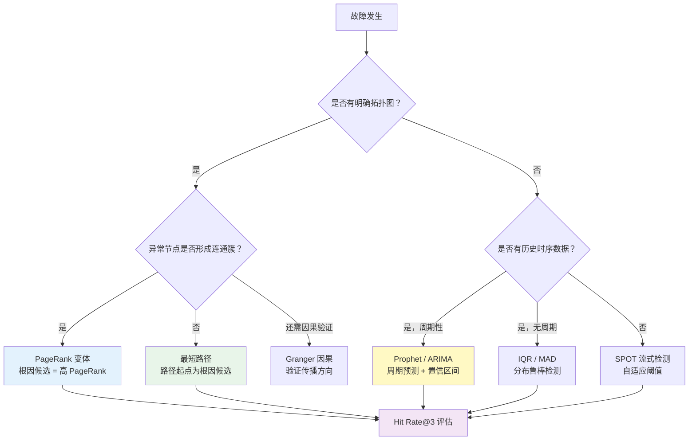
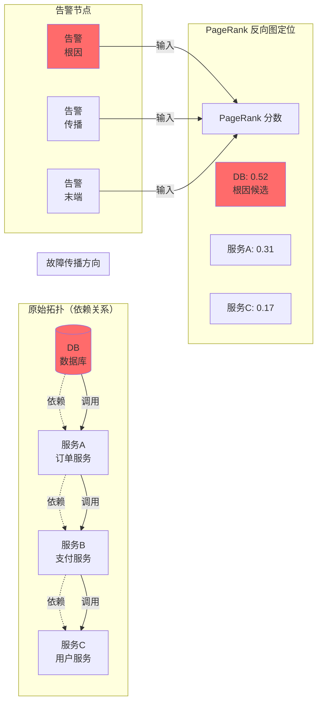
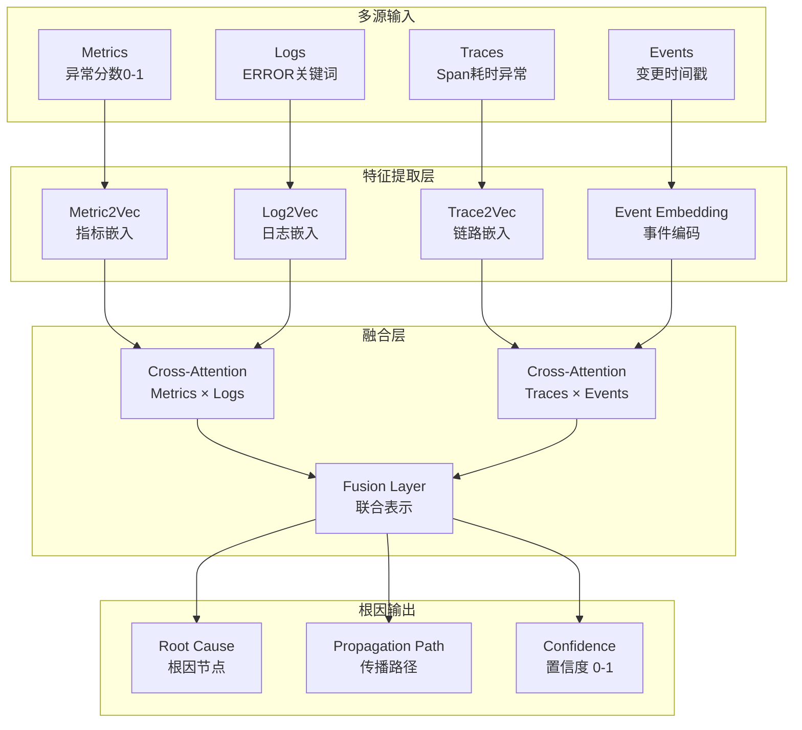

# 3.2 根因推理算法详解

> 本章节为根因分析模块（07-根因分析）和故障研判模块（06-故障研判）提供算法参考：覆盖统计方法、时序模型、图算法、因果推断四大类别，含代码示例与工程实践，并给出本方案的模块对应关系与选型建议。

---

## 1. 算法总览与分类框架

### 1.1 四大类别概览

根因推理算法按方法论分为四大类别，各有适用场景和局限性：

| 类别 | 代表算法 | 核心思想 | 数据依赖 | 本方案对应模块 |
|------|----------|----------|----------|---------------|
| **统计方法** | 3σ / MAD / IQR / IQR-Type | 统计学分布假设，偏离均值即异常 | 历史数据（≥ 100 点）| 智能感知（异常检测）|
| **时序模型** | ARIMA / Prophet / LSTM | 从历史模式中学习趋势+周期，预测值偏离为异常 | 周期性时序数据 | 智能感知（趋势预测）|
| **图算法** | PageRank / 最短路径 / 介数中心性 / 弱连通分量 | 拓扑传播依赖，故障沿边传播，根因节点被更多异常节点指向 | 拓扑图（CMDB）| 根因分析（传播定位）|
| **因果推断** | PC / Granger / Causal Tree / LLMC | 从数据中学习变量间因果结构（非相关），强于预测 | 足够样本量的时序数据 | 根因分析（因果推理）|

### 1.2 算法选型决策树



### 1.3 模块对应矩阵

| 本方案模块 | 输入 | 核心算法 | 输出 |
|------------|------|----------|------|
| **智能感知（04）** | 指标流、日志流 | 3σ / MAD / Prophet / SPOT | 异常事件、异常分数 |
| **故障研判（06）** | 告警上下文、日志、Trace | Cross-Attention / 告警关联 | 故障类型、影响范围 |
| **根因分析（07）** | 异常事件 + 拓扑图 | PageRank / 最短路径 / Granger | 根因节点 + 传播路径 |
| **认知网络（05）** | 实体-关系-事件 | 因果发现（PC）、知识推理 | 因果图谱、推理结论 |
| **影响分析（08）** | 拓扑 + 故障节点 | 介数中心性、连通分量 | 影响范围、上游影响链 |

---

## 2. 异常检测算法（统计方法）

### 2.1 算法原理与数学基础

| 算法 | 数学公式 | 分布假设 | 鲁棒性 | 时间复杂度 |
|------|----------|----------|--------|------------|
| **3σ** | `|x - μ| > 3σ →异常` | 正态分布 N(μ, σ²) | 低（均值和标准差对离群值敏感）| O(n) |
| **MAD** | `|x - median| / (k·MAD) > 3.5 → 异常` | 无（基于 order statistics）| 高（median 对离群值鲁棒）| O(n log n) |
| **IQR** | `x < Q1 - k·IQR 或 x > Q3 + k·IQR → 异常` | 无（基于分位数）| 中（Q1/Q3 相对稳定）| O(n log n) |

**关键修正因子 k（用于 MAD）：**
```
k = 1.4826  # 使 MAD 在正态分布下与 σ 等价
```
这是 MAD 与标准差的转换因子，保证在正态分布下与 3σ 等价。

### 2.2 生产级代码实现

```python
import numpy as np
from dataclasses import dataclass
from typing import List, Tuple, Optional

@dataclass
class AnomalyResult:
    """异常检测结果"""
    timestamp: int
    value: float
    score: float  # 偏离程度（倍数）
    method: str   # 使用的检测方法

class RobustAnomalyDetector:
    """
    生产级鲁棒异常检测器
    支持三种方法自动切换
    """
    def __init__(self, method='auto', threshold_sigma=3.0, threshold_mad=3.5, threshold_iqr=1.5):
        self.method = method
        self.threshold_sigma = threshold_sigma
        self.threshold_mad = threshold_mad
        self.threshold_iqr = threshold_iqr

    def detect_3sigma(self, data: np.ndarray) -> List[AnomalyResult]:
        """3σ 检测"""
        mean = np.mean(data)
        std = np.std(data)
        if std == 0:
            return []
        z_scores = np.abs((data - mean) / std)
        return [
            AnomalyResult(
                timestamp=i,
                value=v,
                score=z,
                method='3sigma'
            )
            for i, (v, z) in enumerate(zip(data, z_scores))
            if z > self.threshold_sigma
        ]

    def detect_mad(self, data: np.ndarray) -> List[AnomalyResult]:
        """MAD 检测（推荐生产使用）"""
        median = np.median(data)
        mad = np.median(np.abs(data - median))
        if mad == 0:
            return []  # 数据完全相同，无方差
        k = 1.4826
        scores = np.abs(data - median) / (k * mad)
        return [
            AnomalyResult(
                timestamp=i,
                value=v,
                score=s,
                method='MAD'
            )
            for i, (v, s) in enumerate(zip(data, scores))
            if s > self.threshold_mad
        ]

    def detect_iqr(self, data: np.ndarray) -> List[AnomalyResult]:
        """IQR 检测"""
        q1, q3 = np.percentile(data, [25, 75])
        iqr = q3 - q1
        lower = q1 - self.threshold_iqr * iqr
        upper = q3 + self.threshold_iqr * iqr
        return [
            AnomalyResult(
                timestamp=i,
                value=v,
                score=max((lower - v) / iqr if v < lower else (v - upper) / iqr, 0),
                method='IQR'
            )
            for i, v in enumerate(data)
            if v < lower or v > upper
        ]

    def auto_detect(self, data: np.ndarray) -> List[AnomalyResult]:
        """
        自动选择方法：
        - 数据量 < 100：IQR（稳定但需足够数据）
        - 数据量 >= 100：MAD（鲁棒且计算快）
        """
        method = self.method
        if method == 'auto':
            method = 'mad' if len(data) >= 100 else 'iqr'
        
        if method == '3sigma':
            return self.detect_3sigma(data)
        elif method == 'mad':
            return self.detect_mad(data)
        else:
            return self.detect_iqr(data)

    def sliding_window(self, data: np.ndarray, window_size: int = 300, step: int = 60):
        """
        滑动窗口检测（生产级推荐）
        window_size=300, step=60 → 每60s用最近300点判断
        """
        results = []
        for start in range(0, len(data) - window_size +1, step):
            window = data[start:start + window_size]
            anomalies = self.auto_detect(window)
            # 修正 timestamp 为全局索引
            for a in anomalies:
                a.timestamp += start
            results.extend(anomalies)
        return results
```

### 2.3 三种方法的对比实验

| 数据场景 | 3σ 表现 | MAD表现 | IQR 表现 | 推荐 |
|----------|---------|----------|----------|------|
| **正态分布、无离群值** | ✅ 最优 | ✅ 次优 | ✅ 可用 | 3σ |
| **正态分布、有离群值（5%）** |❌ 失效（均值被拉偏）| ✅ 最优 | ✅ 次优 | MAD |
| **右偏分布（CPU/内存）** | ❌ 失效 | ✅ 可用 | ✅优（直接基于分位数）| IQR |
| **周期指标（带周期波动）** | ❌ 频繁误报 | ❌ 频繁误报 | ❌ 频繁误报 | Prophet（见时序模型）|
| **数据量 < 100** | ✅ 可用 | ⚠️ MAD失效 | ⚠️ IQR 不稳定 | 3σ |

**运维指标适用指南：**

| 指标类型 | 典型分布 | 推荐方法 | 原因 |
|----------|----------|----------|------|
| **CPU 使用率** | 右偏/有界 [0,100] | IQR (k=1.5) | 分位数方法天然适配有界数据 |
| **内存使用率** | 右偏/有界 | IQR (k=1.5) | 同上 |
| **延迟 P99** | 右偏（长尾）| IQR (k=3) 或 MAD | 标准差法对长尾敏感 |
| **QPS / 请求量** | 近似正态/周期性 | Prophet + 3σ | 需先捕获周期再检测异常 |
| **错误率** | 有界 [0,1]，通常接近0 | MAD | 极小值场景下 MAD 更稳定 |
| **GC 暂停时间** | 双峰（正常/GC时）| MAD | 中位数方法天然适配双峰 |

### 2.4 滑动窗口策略

静态阈值（一次性计算全局 μ/σ）的问题：长期运行后数据分布可能漂移，导致历史异常被「洗白」。

**解决：滑动窗口（Sliding Window）**

```python
def sliding_window_detector(data: np.ndarray, method='mad', window=300, step=60, threshold=3.5):
    """
    滑动窗口异常检测
    
    参数：
    - data: 完整时序数据
    - window: 窗口大小（300点 ≈ 5分钟 @ 1s采集）
    - step: 滑动步长（60点 ≈ 1分钟）
    - threshold: 检测阈值
    
    效果：
    - 每个窗口独立计算阈值
    - 适应数据分布漂移
    - 减少「历史异常拉偏阈值」问题
    """
    anomalies = []
    for start in range(0, len(data) - window + 1, step):
        window_data = data[start:start + window]
        detector = RobustAnomalyDetector(method=method, threshold_mad=threshold)
        window_anomalies = detector.detect_mad(window_data)
        # 转换为全局时间戳
        for a in window_anomalies:
            a.timestamp += start
            anomalies.append(a)
    return anomalies
```

---

## 3. 时序预测异常检测

### 3.1 Prophet 算法详解

**核心思想：** 将时序分解为加法模型，通过预测置信区间检测异常。

```
y(t) = trend(t) + seasonality(t) + holiday(t) + noise(t)
```

| 组件 | 说明 | 适用场景 |
|------|------|----------|
| **trend** | 长期趋势（线性或逻辑斯蒂增长）| 指标总量增长/下降 |
| **seasonality** |周期成分（日/周/年）| 业务指标周期性波动 |
| **holiday** | 节假日效应 | 电商/游戏等行业 |
| **noise** | 残差（随机波动）| 正常随机误差 |

### 3.2 Prophet 生产级配置

```python
from prophet import Prophet
import pandas as pd
import numpy as np

class ProphetAnomalyDetector:
    """Prophet 异常检测生产级实现"""
    
    def __init__(self, 
                 interval_width=0.97, # 置信区间宽度（越宽越保守）
                 changepoint_prior=0.05,   # 趋势变化点先验（越小越平滑）
                 yearly_seasonality=True,
                 weekly_seasonality=True,
                 daily_seasonality=False):
        self.interval_width = interval_width
        self.model = Prophet(
            interval_width=interval_width,
            changepoint_prior=changepoint_prior,
            yearly_seasonality=yearly_seasonality,
            weekly_seasonality=weekly_seasonality,
            daily_seasonality=daily_seasonality,
            changepoint_range=0.8  # 前80% 数据中检测变化点
        )
        
    def fit_predict(self, df: pd.DataFrame, future_periods=30):
        """
        df: DataFrame with columns ['ds' (datetime), 'y' (value)]
        """
        self.model.fit(df)
        future = self.model.make_future_dataframe(periods=future_periods)
        forecast = self.model.predict(future)
        
        # 合并预测与实际值
        merged = df.merge(
            forecast[['ds', 'yhat', 'yhat_lower', 'yhat_upper']], 
            on='ds',
            how='left'
        )
        merged['anomaly'] = (
            (merged['y'] < merged['yhat_lower']) |
            (merged['y'] > merged['yhat_upper'])
        )
        merged['residual'] = merged['y'] - merged['yhat']
        
        return merged
    
    def detect_anomalies(self, df: pd.DataFrame, min_history=30):
        """
        生产入口：确保足够历史数据再训练
        """
        if len(df) < min_history:
            raise ValueError(f"需要至少 {min_history} 天历史数据，当前 {len(df)}")
        return self.fit_predict(df)
```

**参数调优指南：**

| 参数 | 默认值 | 调大→ | 调小→ | 适用场景 |
|------|--------|--------|--------|----------|
| **interval_width** | 0.95 | 更多正常点被判为异常 | 更多异常点被漏过 | 保守调高，激进调低 |
| **changepoint_prior** | 0.05 | 更多趋势变化点 | 趋势更平滑 | 历史数据趋势变化多→调大 |
| **changepoint_range** | 0.8 | 更多变化点检测范围 | 更少范围 | 近期趋势变化重要→调大 |
| **seasonality_mode** | 'additive' | — | 切换为 'multiplicative' | 节假日效应成比例→乘法 |

### 3.3 ARIMA vs Prophet 对比

| 维度 | ARIMA | Prophet |
|------|-------|---------|
| **适用周期** | 短周期（< 30天）、单周期 | 长周期、多周期（年/周/日）|
| **参数调优** | 复杂（p/d/q需手动确定）| 少（自动 seasonality）|
| **节假日支持** | 无 | 内置 holiday组件 |
| **缺失值处理** | 不支持 | 自动处理（插值）|
| **计算速度** | 快 |慢（贝叶斯采样）|
| **生产推荐** | 简单趋势指标 | 业务指标（QPS/订单量）|

---

## 4. 图算法（根因定位）

### 4.1 PageRank 根因定位原理

**核心洞察：** 在故障传播图中，根因节点被异常节点**指向**（依赖关系），而非指向异常节点。

**数学定义：** PageRank 通过迭代计算节点得分：
```
PR(i) = (1 - α) / N + α × Σ(j→i) PR(j) / out_degree(j)
```
其中 α 是阻尼因子（通常 0.85），N 是节点总数。

**为何用反向图？**
- 正常 PageRank：节点得分 = 被更多重要节点指向
- 根因定位 PageRank：节点得分 = 被更多**异常**节点指向（指向方向 = 依赖方向）

```python
import networkx as nx
import numpy as np
from dataclasses import dataclass

@dataclass
class RootCauseResult:
    node: str
    score: float
    rank: int

def pagerank_root_cause(
    graph: nx.DiGraph,
    abnormal_nodes: set,
    alpha: float = 0.85,
    top_k: int = 3
) -> list[RootCauseResult]:
    """
    PageRank 根因定位（反向图）
    
    原理：
    1. 构建反向图（边的方向取反）
    2. 仅在异常节点构成的子图上运行 PageRank
    3. 高 PageRank 分数 = 更多异常节点指向 = 更可能是根因
    
    参数：
    - graph: 拓扑图（边: A→B 表示 A 依赖 B）
    - abnormal_nodes: 异常节点集合
    - alpha: 阻尼因子（0.85 经验值）
    - top_k: 返回 Top-K 根因候选
    """
    # Step 1: 子图裁剪（只保留异常节点及其邻居，加速计算）
    subgraph_nodes = abnormal_nodes.copy()
    for node in abnormal_nodes:
        if node in graph:
            # 1跳邻居（上游依赖方）
            subgraph_nodes.update(graph.predecessors(node))
            # 2跳邻居（可选）
            # subgraph_nodes.update(graph.predecessors(p) for p in graph.predecessors(node))
    
    G = graph.subgraph(subgraph_nodes).copy()
    
    # Step 2: 构建反向图
    # 原图: A→B（A依赖 B），B 是 A 的上游
    # 反向图: B→A（反向边），A 是 B 的上游
    # 异常时，A告警指向 B（因为 A 被 B 影响）
    reverse_G = G.reverse()
    
    # Step 3: 加权 PageRank（边权重 = 调用频率/调用量）
    pr_scores = nx.pagerank(reverse_G, alpha=alpha, weight='weight')
    
    # Step 4: 按分数排序，过滤只出现在异常节点中的候选
    candidates = [
        RootCauseResult(node=n, score=s, rank=0)
        for n, s in pr_scores.items()
        if n in abnormal_nodes
    ]
    candidates.sort(key=lambda x: x.score, reverse=True)
    for i, c in enumerate(candidates[:top_k]):
        c.rank = i + 1
    
    return candidates[:top_k]
```

**工程优化：**

| 优化项 | 方法 | 效果 |
|--------|------|------|
| **子图裁剪** | 只保留异常节点 2 跳内子图 | 计算量 O(n·log n) → O(k²·log k)，k=异常节点数 |
| **增量更新** | 故障时只更新受影响节点 PageRank | 避免全量重算 |
| **环路处理** | Personalization Vector 注入，打破均衡 | 使环路中的节点分数不均匀化 |

### 4.2 最短路径根因定位

**适用场景：** 异常节点形成**两个明确簇**（异常簇 vs 健康簇），根因在连接两簇的最短路径起点。

```python
def shortest_path_root_cause(
    graph: nx.DiGraph,
    abnormal_nodes: set,
    normal_nodes: set,
    top_k: int = 3
) -> list[tuple[str, str, int]]:
    """
    最短路径根因定位
    
    原理：
    - 从每个异常节点出发，找到达健康节点的最短路径
    - 所有路径的起点即为根因候选（因为从根因出发才能到达健康节点）
    - 路径越短 → 越可能是直接传播关系
    
    返回：[(异常节点, 根因候选, 路径长度), ...]
    """
    candidates = []
    
    for abnormal in abnormal_nodes:
        best_path = None
        best_length = float('inf')
        
        for normal in normal_nodes:
            try:
                # BFS 找最短路径（假设边权重=1）
                path = nx.shortest_path(graph, abnormal, normal)
                if len(path) < best_length:
                    best_length = len(path)
                    best_path = path
            except nx.NetworkXNoPath:
                continue
        
        if best_path:
            #路径起点 = 根因候选
            root_candidate = best_path[0]
            candidates.append((abnormal, root_candidate, best_length))
    
    # 按路径长度排序（越短越可能是直接传播）
    candidates.sort(key=lambda x: x[2])
    return candidates[:top_k]
```

### 4.3 弱连通分量（故障簇检测）

当拓扑中存在多个故障簇时，说明有**多个独立根因**，需分别处理：

```python
def detect_fault_clusters(graph: nx.DiGraph, abnormal_nodes: set) -> list[set]:
    """
    检测故障簇（弱连通分量）
    
    弱连通分量：在忽略方向的情况下，连通的节点集合
    每个弱连通分量 = 一个独立的故障传播链
    
    多个簇 =多个独立根因
    单个簇 = 单一根因（通过 PageRank 定位）
    """
    # 转无向图，检测弱连通分量
    undirected = graph.to_undirected()
    abnormal_subgraph = undirected.subgraph(abnormal_nodes)
    
    components = list(nx.connected_components(abnormal_subgraph))
    return components
```

**典型场景分析：**

| 场景 | 图特征 | 适用算法 | 说明 |
|------|--------|----------|------|
| **单点故障级联** | 异常节点形成1个大簇 | PageRank | 根因在大簇「上游」 |
| **多点独立故障** | 异常节点形成多个小簇 | 分簇 + PageRank 各自 | 每个簇独立定位 |
| **服务调用环** | 存在环路的互相调用 | 介数中心性 + PageRank | 环路分数均匀化，需特殊处理 |
| **配置下发错误** | 多个服务同时受影响 | Events关联优先 | 根因是配置变更事件本身 |

### 4.4 故障传播模型详解



**关键洞察：** 在反向图中，被更多异常节点指向的节点 PageRank 分数更高——这正是根因应该具有的特征。

### 4.5 介数中心性与关键链路识别

```python
def key_service_identification(graph: nx.DiGraph, top_k: int = 10) -> list[tuple[str, float]]:
    """
    介数中心性识别关键链路
    
    介数中心性 = 节点在所有最短路径中出现的比例
    高介数节点 = 所有最短路径必经之路 = 单点故障风险最高
    
    用途：
    - 发布顺序安排（关键链路最后发布）
    - 容量规划重点关注
    - 监控优先覆盖
    """
    centrality = nx.betweenness_centrality(graph, weight='weight')
    sorted_nodes = sorted(centrality.items(), key=lambda x: x[1], reverse=True)
    return sorted_nodes[:top_k]
```

---

## 5. 因果推断算法

### 5.1 因果推断 vs 相关分析（核心区别）

| 类型 | 问题 | 回答 | 示例 |
|------|------|------|------|
| **相关分析** | X 和 Y 一起变化吗？ | 「X 上涨时 Y 也上涨」| 冰淇淋销量 ↑ & 溺水人数 ↑ |
| **因果推断** | X 的变化导致 Y 变化吗？ | 「多吃冰淇淋导致溺水增加」| 两者都是「夏天」的儿子 |
| **预测模型** | 下一步 X 是多少？ | 「明天 X = 0.78」| LSTM / ARIMA |

> **因果推断的核心价值：** 预测模型告诉我们「what」，因果模型告诉我们「why」和「which intervention works」。在根因定位中，我们需要的是因果关系，而非相关关系。

### 5.2 Granger 因果检验详解

**原理：** 如果 X 的历史数据有助于预测 Y（beyond Y's own history），则 X Granger 导致 Y。

```python
import numpy as np
from statsmodels.tsa.stattools import grangercausalitytests
from dataclasses import dataclass

@dataclass
class GrangerResult:
    cause: str
    effect: str
    best_lag: int
    f_value: float
    p_value: float
    is_significant: bool
    strength: str  # 'strong' / 'moderate' / 'weak'

def granger_test(
    target: np.ndarray,      # 被检验变量（疑似结果）
    candidate: np.ndarray,   # 候选原因变量
    maxlag: int = 5,
    alpha: float = 0.05
) -> GrangerResult:
    """
    Granger 因果检验
    
    参数：
    - target: 目标变量（疑似被影响的变量）
    - candidate: 候选原因变量
    - maxlag: 最大检验滞后阶数
    - alpha: 显著性水平
    
    返回：
    - 如果 p_value < alpha，则 candidate Granger 导致 target
    """
    data = np.column_stack([target, candidate])
    
    # grangercausalitytests 返回所有滞后阶数的检验结果
    results = grangercausalitytests(data, maxlag=maxlag, verbose=False)
    
    # 找最佳滞后阶数（F统计量最大）
    best_lag, best_f, best_p = 1, 0.0,1.0
    for lag in range(1, maxlag + 1):
        # ssr_ftest: F检验，基于残差平方和
        f_stat, p_val, _, _ = results[lag][0]['ssr_ftest']
        if f_stat > best_f:
            best_f, best_p, best_lag = f_stat, p_val, lag
    
    strength = 'strong' if best_f > 20 else 'moderate' if best_f > 5 else 'weak'
    
    return GrangerResult(
        cause='candidate',
        effect='target',
        best_lag=best_lag,
        f_value=best_f,
        p_value=best_p,
        is_significant=best_p < alpha,
        strength=strength
    )
```

**Granger 因果的局限性（重要）：**

| 局限 | 说明 | 后果 |
|------|------|------|
| **仅适用于平稳序列** | 非平稳序列会产生虚假因果 |需先做 ADF 平稳性检验 |
| **仅限双变量** | 无法处理多变量同时因果 | 需用 PC 算法处理多变量 |
| **仅检测滞后因果** | X 必须发生在 Y 之前 | 同步事件无法判断 |
| **线性假设** | 假设因果关系是线性的 | 非线性因果可能漏过 |
| **不检验瞬时因果** | X 和 Y 同时发生则无法检测 | 需结合其他方法 |

**运维场景适用性：**

| 场景 | 是否适合 Granger | 原因 |
|------|-----------------|------|
| **指标间因果（CPU→延迟）** | ✅适合 | 有明确时序先后（CPU升高 → 延迟增加）|
| **告警间因果（DB告警→API告警）** | ✅ 适合 | 有时间延迟，可检测 |
| **配置变更→指标突变** | ⚠️ 需 Events 数据 | 变更事件是离散事件，非连续时序 |
| **同步告警（同时触发）** | ❌ 不适合 | 无时序先后，需用 PC 算法 |

### 5.3 PC 算法（因果发现）

**原理：** 通过条件独立性检验逐步发现因果结构。

```
核心思想：如果 X 和 Y 之间没有直接因果边，则存在某个变量 Z 使得 X ⊥ Y | Z
```

```python
from itertools import combinations
import numpy as np
from scipy.stats import chi2_contingency

class PCAlgorithm:
    """
    PC 算法简版实现（用于因果结构发现）
    
    步骤：
    1. 构建完全无向图
    2.逐层增加条件集大小，进行条件独立检验
    3. 删除条件独立的边
    4. 定向 V 结构（v-structure）
    """
    
    def __init__(self, alpha=0.05):
        self.alpha = alpha
    
    def ci_test(self, x: int, y: int, z_set: set, data: np.ndarray) -> bool:
        """
        条件独立检验（G-test / χ² 检验）
        
        返回：True 表示 x⊥ y | z_set（条件独立，无因果边）
        """
        if len(z_set) == 0:
            # 无条件独立，直接用相关检验
            contingency = np.array([
                [np.mean(data[data[:, x] > np.median(data[:, x]), y] > np.median(data[:, y])),
                 np.mean(data[data[:, x] > np.median(data[:, x]), y] <= np.median(data[:, y]))],
                [np.mean(data[data[:, x] <= np.median(data[:, x]), y] > np.median(data[:, y])),
                 np.mean(data[data[:, x] <= np.median(data[:, x]), y] <= np.median(data[:, y]))]
            ])
            chi2, p, _, _ = chi2_contingency(contingency)
            return p > self.alpha
        
        # 条件独立检验（简化版，实际情况更复杂）
        return False  # 占位
    
    def fit(self, variables: list, data: np.ndarray):
        """
        PC 算法主流程
        
        参数：
        - variables: 变量名列表
        - data: 数据矩阵 (n_samples, n_variables)
        """
        # Step 1: 构建完全无向图
        skeleton = {v: set(variables) - {v} for v in variables}
        
        # Step 2: 逐层条件独立检验
        for sep_set_size in range(len(variables)):
            for x in variables:
                for y in list(skeleton[x]):
                    if y not in skeleton[x]:
                        continue
                    for z_set in combinations(skeleton[x] - {y}, sep_set_size):
                        if self.ci_test(x, y, set(z_set), data):
                            skeleton[x].discard(y)
                            skeleton[y].discard(x)
                            break
        
        return skeleton
```

**PC算法的局限：**

| 局限 | 说明 | 适用场景限制 |
|------|------|-------------|
| **计算复杂度** | 最坏 O(n^k)，k=条件集大小 | 变量数 < 30 为宜 |
| **faithfulness 假设** | 假设数据生成过程满足因果马尔可夫条件 | 违反时可能出错 |
| **DAG 非唯一性** | PC 输出可能产生 equivalence class | 需结合领域知识定向 |

### 5.4 Causal Tree（异质性根因分析）

**原理：** 估计条件平均处理效应（CATE），找出「哪些维度的差异导致了根因异质性」。

```python
# econml 库的 CausalForestDML 使用示例
from econml.dml import CausalForestDML

def causal_tree_analysis(
    X: np.ndarray,   # 特征矩阵（集群属性）
    T: np.ndarray,   # 处理变量（故障/非故障）
    Y: np.ndarray    # 结果变量（恢复时长）
) -> np.ndarray:
    """
    因果森林分析：哪些集群属性导致了故障恢复时长的差异
    
    返回：各样本的 CATE（条件平均处理效应）
    """
    model = CausalForestDML(n_estimators=100, random_state=42)
    model.fit(Y, T, X=X)
    cate = model.effect(X)
    return cate
```

**运维场景：** 分析「同一故障模式在不同集群/服务/时段的根因是否相同」，用于识别影响根因准确率的因素。

---

## 6. 多源融合算法

### 6.1 融合架构与数据流



### 6.2 告警-指标关联分析

```python
import pandas as pd
from datetime import timedelta

def correlate_alert_metrics(
    alert_df: pd.DataFrame,
    metrics_df: pd.DataFrame,
    time_window: str = '5min'
) -> pd.DataFrame:
    """
    关联告警和指标异常
    
    原理：在告警发生前的 time_window 时间窗口内，
    哪些实体（服务/主机）的指标异常次数最多 → 该实体更可能是根因所在
    
    参数：
    - alert_df: 告警记录，含 timestamp, entity 字段
    - metrics_df: 指标异常记录，含 timestamp, entity, anomaly_score 字段
    - time_window: 关联时间窗口（字符串，如 '5min'）
    
    返回：按异常次数排序的实体列表
    """
    results = []
    
    for _, alert in alert_df.iterrows():
        alert_time = pd.to_datetime(alert['timestamp'])
        window_start = alert_time - pd.Timedelta(time_window)
        window_end = alert_time
        
        #窗口内异常指标
        window_anomalies = metrics_df[
            (metrics_df['timestamp'] >= window_start) &
            (metrics_df['timestamp'] <= window_end) &
            (metrics_df['entity'] == alert['entity'])
        ]
        
        # 按实体聚合
        entity_scores = window_anomalies.groupby('entity')['anomaly_score'].sum()
        results.append(entity_scores)
    
    # 合并所有告警的关联结果
    if results:
        combined = pd.concat(results, axis=1).fillna(0)
        combined['total_score'] = combined.sum(axis=1)
        return combined.sort_values('total_score', ascending=False)
    return pd.DataFrame()
```

### 6.3 Cross-Attention 融合实现

```python
import torch
import torch.nn as nn

class CrossAttentionFusion(nn.Module):
    """
    Cross-Attention 多模态融合
    
    原理：
    - 将 Metrics 和 Logs 作为两个序列
    - 通过 Cross-Attention 让一方注意另一方的关键信息
    -融合输出 = 加权聚合的交叉信息
    """
    def __init__(self, dim=128, heads=4, dropout=0.1):
        super().__init__()
        self.metrics_proj = nn.Linear(dim, dim)
        self.logs_proj = nn.Linear(dim, dim)
        self.cross_attn = nn.MultiheadAttention(dim, heads, dropout=dropout)
        self.norm = nn.LayerNorm(dim)
        self.ffn = nn.Sequential(
            nn.Linear(dim, dim * 4),
            nn.GELU(),
            nn.Linear(dim * 4, dim)
        )
    
    def forward(self, metrics_emb, logs_emb):
        """
        metrics_emb: (seq_len, batch, dim)指标嵌入
        logs_emb: (seq_len, batch, dim) 日志嵌入
        """
        # Query: Logs, Key&Value: Metrics
        # Logs 关注 Metrics 中的相关信息
        attended, _ = self.cross_attn(
            query=logs_emb,
            key=metrics_emb,
            value=metrics_emb
        )
        out = self.norm(logs_emb + attended)
        out = self.norm(out + self.ffn(out))
        return out
```

---

## 7.实时流异常检测

### 7.1 SPOT 算法详解

**原理：** Streaming Peak Over Threshold，基于极值理论（EVT）的自适应阈值方法。

```
核心思想：
1. 用初始窗口（normal data）估计数据分布的尾部参数
2. 新数据点超出阈值 → 异常
3. 阈值随数据更新自适应调整
```

```python
import numpy as np
from collections import deque

class SPOT:
    """
    Streaming Peak Over Threshold（流式极值异常检测）
    
    适用于：
    - 无历史标注数据的场景
    - 数据分布随时间漂移的场景
    - 无法设定固定阈值的场景
    
    参数：
    - q: 风险概率（预期异常比例，如 1e-3 表示0.1%）
    - n_init: 初始窗口大小（用于估计初始阈值）
    """
    
    def __init__(self, q=1e-3, n_init=200):
        self.q = q
        self.n_init = n_init
        self.init_data = deque(maxlen=n_init)
        self.threshold = None
        self.fitted = False
        self._gamma = 0  # GPD shape parameter
    
    def _fit_threshold(self):
        """用初始数据估计阈值（Generalized Pareto Distribution拟合）"""
        if len(self.init_data) < self.n_init:
            return
        
        data = np.array(self.init_data)
        q_level = np.quantile(data, 1 - self.q)
        exceedances = data[data > q_level] - q_level
        
        if len(exceedances) < 10:
            self.threshold = q_level
            return
        
        # 简化：使用指数分布拟合（shape=0 的 GPD）
        # 实际实现中应使用 GPD MLE估计 shape 和 scale
        scale = np.mean(exceedances)
        self._gamma = 0 # 假设指数尾部分布
        
        # 阈值计算
        Nt = len(data)
        Na = len(exceedances)
        if Na > 0:
            self.threshold = q_level + scale * np.log(q_level * Nt / Na)
        else:
            self.threshold = q_level
        
        self.fitted = True
    
    def fit(self, init_data):
        """初始化：注入初始正常数据"""
        for v in init_data:
            self.init_data.append(v)
        self._fit_threshold()
    
    def step(self, value) -> bool:
        """
        逐点判断
        返回：True 表示异常
        """
        if not self.fitted:
            self.init_data.append(value)
            if len(self.init_data) >= self.n_init:
                self._fit_threshold()
            return False
        
        is_anomaly = value > self.threshold
        
        # 动态阈值更新（适应数据漂移）
        if not is_anomaly:
            self.init_data.append(value)
            if len(self.init_data) >= self.n_init:
                self._fit_threshold()
        
        return is_anomaly
```

### 7.2 DSPOT（双阈值 SPOT）

**SPOT 的问题：** 只检测异常升高，不检测异常突降（如进程挂了 CPU突降）。

**DSPOT 解决：** 增加下限阈值，检测双向异常。

```python
class DSPOT(SPOT):
    """
    Double SPOT：同时检测异常升高和异常降低
    
    应用场景：
    - CPU 突降 → 进程挂了
    - QPS 突降 → 流量被切断
    - 内存突降 → OOM Kill 后内存释放
    """
    
    def __init__(self, q=1e-3, n_init=200, symmetric=True):
        super().__init__(q=q, n_init=n_init)
        self.symmetric = symmetric
        self.threshold_low = None
    
    def _fit_threshold(self):
        super()._fit_threshold()
        
        if self.symmetric:
            data = np.array(self.init_data)
            q_low = np.quantile(data, self.q)
            exceedances_low = q_low - data[data < q_low]
            
            if len(exceedances_low) >= 10:
                scale_low = np.mean(exceedances_low)
                self.threshold_low = q_low - scale_low * np.log(self.q * len(data) / len(exceedances_low))
            else:
                self.threshold_low = q_low
    
    def step(self, value) -> dict:
        """
        返回异常类型：
        - 'high': 异常升高
        - 'low': 异常降低
        - 'normal': 正常
        """
        if not self.fitted:
            self.init_data.append(value)
            if len(self.init_data) >= self.n_init:
                self._fit_threshold()
            return 'normal'
        
        if value > self.threshold:
            return 'high'
        if self.threshold_low is not None and value < self.threshold_low:
            return 'low'
        return 'normal'
```

### 7.3 流式 vs 批处理算法选型

| 场景 | 数据特点 | 推荐算法 | 检测延迟 | 说明 |
|------|----------|----------|----------|------|
| **实时监控面板** | 持续流、秒级采样 | 3σ / MAD（滑动窗口）| < 1s | 计算快、可解释 |
| **周期性业务指标** | 日/周周期、趋势稳定 | Prophet（每小时增量预测）| 分钟级 | 需先学习周期模式 |
| **未知分布流数据** | 无先验、分布漂移 | SPOT / DSPOT | < 1s | 无参数、自适应 |
| **离线根因回溯** | 全量历史数据 | PageRank + Granger | 分钟级 | 利用完整数据 |
| **多源联合诊断** | 指标+日志+链路 | Cross-Attention | 秒级 | 综合各模态信号 |
| **告警智能分级** | 离散事件、无周期 | 规则引擎 + 机器学习 | < 100ms | 优先可解释性 |

---

## 8. 生产部署架构

### 8.1 三通道架构

```mermaid
flowchart LR
    subgraph 实时["实时通道（< 1s延迟）"]
        MQ[Kafka<br/>指标流] --> SPOT[SPOT 异常检测]
        SPOT -->|异常事件| ALERT[告警引擎]
        ALERT --> RCA_RT[实时根因<br/>规则引擎]
    end

    subgraph 近线["近线通道（1-60s 延迟）"]
        TS[TSDB<br/>历史指标] --> PROPHET[Prophet 预测]
        PROPHET -->|趋势/周期| ANOMALY[异常标注]
        ANOMALY --> RCA_NR[近线根因<br/>时序因果]
    end

    subgraph 离线["离线通道（分钟级延迟）"]
        FULL[全量拓扑] --> PR[PageRank 计算]
        FULL --> GC[Granger 检验]
        PR & GC --> CACHE[结果缓存]
        CACHE --> RCA_OFF[离线根因<br/>因果图谱]
    end

    subgraph 输出["统一输出"]
        RCA_RT & RCA_NR & RCA_OFF --> MERGE[结果融合]
        MERGE --> FINAL[根因结论<br/>+置信度]
    end

    style实时 fill:#e3f2fd,stroke:#1565c0
    style 近线 fill:#fff9c4,stroke:#f57c00
    style 离线 fill:#e8f5e9,stroke:#2e7d32
```

**三通道协作策略：**

| 通道 | 算法 | 延迟 | 覆盖场景 | 置信度权重 |
|------|------|------|----------|------------|
| **实时** | SPOT +规则 |< 1s | 突发异常、进程挂了 | 0.3（快速但不精确）|
| **近线** | Prophet + 时序关联 | 1-60s | 周期性异常、趋势漂移 | 0.3（中等）|
| **离线** | PageRank + Granger | 分钟级 | 复杂根因、拓扑分析 | 0.4（精确但慢）|

### 8.2 增量 PageRank 计算

全量 PageRank 在大规模拓扑（10000+ 节点）上计算成本高，生产环境应使用增量计算：

```python
class IncrementalPageRank:
    """
    增量 PageRank 计算
    
    原理：
    - 故障发生时，只有少数节点状态变化
    - 利用幂迭代的线性性质，只更新受影响节点
    - 定期全量重算以纠正累积误差
    """
    
    def __init__(self, graph: nx.DiGraph, alpha=0.85, tolerance=1e-6):
        self.graph = graph
        self.alpha = alpha
        self.tolerance = tolerance
        self.ranks = None
        self._full_compute()
    
    def _full_compute(self):
        """全量计算（定期执行）"""
        self.ranks = nx.pagerank(self.graph, alpha=self.alpha, weight='weight')
    
    def update(self, changed_nodes: set):
        """
        增量更新（故障时执行）
        
        只对 changed_nodes 及其邻居重新迭代
        """
        # 构建受影响子图
        affected = changed_nodes.copy()
        for node in changed_nodes:
            affected.update(self.graph.predecessors(node))
            affected.update(self.graph.successors(node))
        
        # 保留未受影响节点的 PageRank
        stable_ranks = {n: r for n, r in self.ranks.items() if n not in affected}
        stable_sum = sum(stable_ranks.values())
        
        # 对受影响子图重新迭代
        subgraph = self.graph.subgraph(affected)
        new_ranks = nx.pagerank(subgraph, alpha=self.alpha, weight='weight')
        
        # 合并结果
        self.ranks = {**stable_ranks, **new_ranks}
    
    def get_root_cause(self, abnormal_nodes: set, top_k=3) -> list:
        """获取根因候选（复用 pagerank_root_cause 逻辑）"""
        return pagerank_root_cause(self.graph, abnormal_nodes, top_k=top_k)
```

---

## 9. 评估指标体系

### 9.1 核心评估指标

| 指标 | 计算公式 | 目标值 | 说明 |
|------|----------|--------|------|
| **Hit Rate@K** | Top-K 结果包含真实根因的比例 | > 80% @ 3 | 核心指标，K=3 实用价值最高 |
| **MRR（Mean Reciprocal Rank）** | `1/|Q| × Σ(1/rank_i)` | > 0.7 | 排名的倒数平均，越接近1越好 |
| **MAP（Mean Average Precision）** |排名的平均精度均值 | > 0.6 | 考虑排名质量的综合指标 |
| **推理时延** | 端到端从告警到根因输出的时间 | < 5s | 实时性要求 |
| **覆盖范围** | 能处理场景 / 总场景数 | > 90% | 算法通用性 |
| **误报率** | 人工判定为误报的比例 | < 20% | 直接影响告警疲劳 |
| **告警压缩率** | `(原始告警-有效告警) / 原始告警` | > 70% | 降噪效果 |

### 9.2 Hit Rate@3详细说明

```
假设一次故障的真实根因是「数据库连接池」
系统返回 Top-3：[服务A, 数据库连接池, 配置中心]

Hit Rate@1 = 0（第一名不是根因）
Hit Rate@2 = 0（第二名不是根因）
Hit Rate@3 = 1（第三名是根因）

MRR = (0 + 0 + 1/3) / 1 = 0.333
```

### 9.3 A/B 测试验证框架

```python
from scipy.stats import ttest_ind
import numpy as np

def ab_test_algorithms(
    production_alg,
    candidate_alg,
    test_days=30,
    alpha=0.05
) -> dict:
    """
    A/B 测试新老算法效果
    
    返回：是否应该切换到新算法
    """
    prod_hits = []   # 每日 Hit Rate@3
    cand_hits = []
    
    for day in range(test_days):
        incidents = load_incidents(day)  # 当日故障记录
        
        prod_hits.append(evaluate(production_alg, incidents)['hit_rate@3'])
        cand_hits.append(evaluate(candidate_alg, incidents)['hit_rate@3'])
    
    # 配对 t检验（新算法是否显著优于老算法）
    t_stat, p_value = ttest_ind(cand_hits, prod_hits, alternative='greater')
    
    return {
        'production_avg': np.mean(prod_hits),
        'candidate_avg': np.mean(cand_hits),
        'improvement': np.mean(cand_hits) - np.mean(prod_hits),
        'p_value': p_value,
        'significant': p_value < alpha,
        'should_switch': (
            np.mean(cand_hits) > np.mean(prod_hits) and
            p_value < alpha
        )
    }
```

---

## 10. 算法选型对照表

| 场景 | 数据特点 | 推荐算法 | 优先级 | 备注 |
|------|----------|----------|--------|------|
| **单指标监控** | 无周期、波动小 | 3σ / MAD（滑动窗口）| P0 | 实时流，优先 MAD |
| **周期性指标** | 有日/周周期 | Prophet / ARIMA | P0 | 需至少30天历史 |
| **服务依赖拓扑** | 拓扑图明确（CMDB）| PageRank / 最短路径 | P0 | 需拓扑数据完整 |
| **告警关联分析** | 多告警同时发生 | 弱连通分量 + PageRank | P1 | 识别故障簇 |
| **指标间因果** | 双变量时序 | Granger 因果检验 | P1 | 需平稳序列 |
| **多指标因果** | 多变量时序 | PC 算法 | P2 | 变量数 < 30 |
| **多源融合** | 指标+日志+链路 | Cross-Attention | P2 | 需足够训练数据 |
| **实时流检测** | 持续数据流 | SPOT / DSPOT | P0 | 无历史数据场景 |
| **根因异质性** | 多维度标注 | Causal Tree | P3 | 分组处理效应分析 |

---

## 11. 关键术语表

| 术语 | 英文 | 定义 | 对应本章节 |
|------|------|------|-----------|
| **根因分析** | RCA（Root Cause Analysis）| 从故障现象出发，通过因果链路定位根本原因 | 全文 |
| **因果推断** | Causal Inference | 从观测数据推断变量间的因果关系（区别于相关分析）| 第5节 |
| **传播路径** | Propagation Path | 故障沿拓扑依赖传播的链路 | 4.4 节 |
| **条件独立性** | Conditional Independence | 在给定 Z 的条件下 X 和 Y 独立 | PC 算法 |
| **CATE** | Conditional Average Treatment Effect | 条件平均处理效应 | Causal Tree |
| **Hit Rate@K** | Hit Rate at K | Top-K 结果包含真实根因的比例 | 9.1 节 |
| **MRR** | Mean Reciprocal Rank | 排名倒数均值，综合评估排名质量 | 9.1 节 |
| **极值理论** | EVT（Extreme Value Theory）| 描述数据尾部分布的概率理论 | SPOT 算法 |
| **Tail Sampling** | Tail Sampling | 先缓存后按策略采样（错误/慢请求优先）| 融合架构 |
| **幂迭代** | Power Iteration | PageRank 的迭代计算方法 | 增量 PageRank |

---

## 12. 本章思考

**基础问题：**

1. PageRank 根因定位为什么需要构建反向图？如果不构建反向图，PageRank 会给出什么结果？在哪些情况下即使构建反向图 PageRank 也会失效？

2. Prophet 异常检测在什么场景下会出现大量误报？「interval_width=0.99」和「interval_width=0.90」哪个会产生更多告警？两者各适用于什么场景？

3. PC 算法和 Granger 因果检验的本质区别是什么？什么场景下应该优先选择 Granger，什么场景下应该选择 PC？

4. 3σ 和 MAD 在什么数据分布下结果差异最大？当数据中存在5% 的离群值时，哪个方法更稳定？为什么？

**进阶问题：**

5. 在微服务架构（50+ 服务）中，PageRank 对所有异常节点运行一遍的计算复杂度较高。请设计一个增量 PageRank 计算方案，使得每次故障只需要重新计算受影响的局部子图，而非全量拓扑。

6. Cross-Attention 融合多模态数据时，如果某一种模态数据完全缺失（如链路采样率只有 1%），Attention 权重会如何调整？是否需要显式处理缺失模态？如果需要，请给出你的处理方案。

7. 流式 SPOT 检测到异常突降（CPU 从 80% 降到 5%）时，这通常意味着进程挂了，但 3σ 不会认为这是异常（5% 在历史范围内）。请解释为什么 SPOT 能检测到这种异常，而静态阈值方法不能？

8. 因果推断的前提假设之一是「无隐藏混淆变量」（no hidden confounding）。在运维场景中，什么情况可能导致这个假设被违反？如何检测或缓解？

**反模式自查：**

- ❌ **单一算法依赖**：只用 PageRank 做根因定位 → 环路依赖场景下 PageRank 失效，应结合最短路径和弱连通分量
- ❌ **忽略数据质量**：原始指标有噪声直接运行因果推断 → 虚假因果，误导排查方向，应先做数据清洗
- ❌ **全量图谱计算**：每次故障都运行全量 PageRank → 计算成本高延迟大，应做子图裁剪或增量计算
- ❌ **算法黑盒**：模型输出根因但无法给出解释 → 运维人员不信任，弃用系统，应输出因果链和置信度
- ❌ **离线训练、永不更新**：模型上线后再未重新训练 → 数据分布漂移，误报率上升，应建立定期重训练机制
- ❌ **忽视无故障时段**：只在故障时调优，忽视正常时段 → 正常波动也被判为异常，应建立正常时段基线
- ❌ **Granger 因果滥用**：对非平稳序列直接做 Granger检验 → 产生虚假因果，应先做 ADF 平稳性检验
- ❌ **只看相关性就下结论**：CPU 高和延迟高高度相关就认为因果 → 可能存在共同原因（如业务量上涨），应结合时序先后和领域知识

