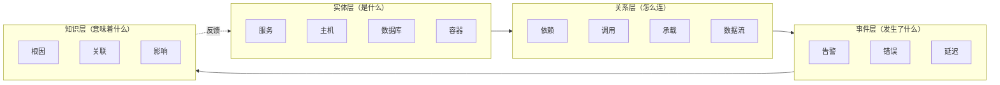
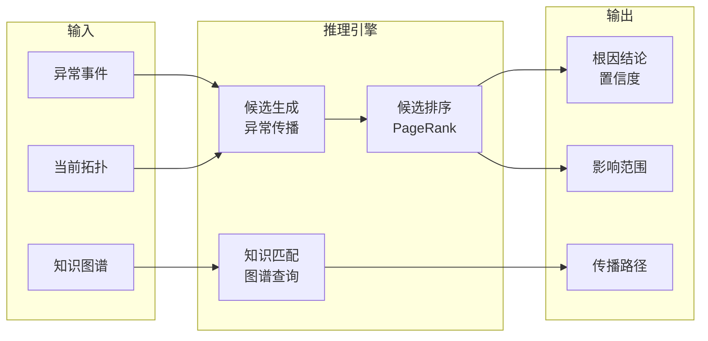
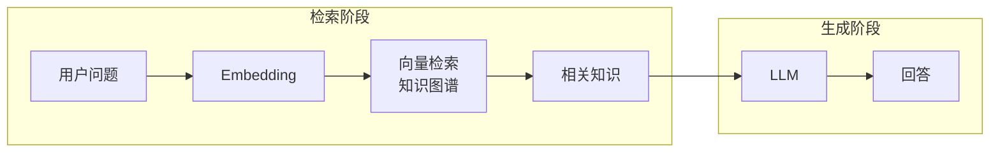
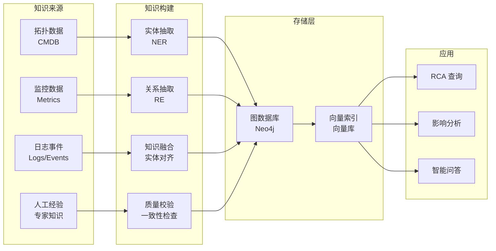
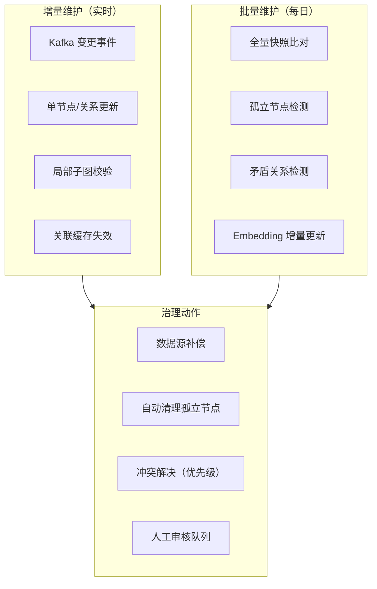

# 3.3 知识图谱技术详解

> 本章节为认知网络模块（05-认知网络）提供技术参考，涵盖知识表示、图谱构建、知识嵌入、图推理、质量评估与实战示例。

---

## 1. 知识图谱概述

### 1.1 本方案 4 层模型

认知网络模块采用实体-关系-事件-知识 4 层结构：



### 1.2 知识图谱 vs 传统数据库

| 维度 | 关系型数据库 | 知识图谱 |
|------|-------------|----------|
| **表示方式** | 表 + 行 + 列 | 实体 + 关系 + 属性 |
| **查询方式** | SQL (JOIN) | 图遍历 / Cypher |
| **关联查询** | 多表 JOIN，N 表复杂度 O(N!) | 图遍历，复杂度 O(depth·degree) |
| **Schema 灵活性** | 固定 Schema，变更需 Migration | Schema-less，可动态扩展 |
| **推理能力** | 无 | 支持路径推理、传递闭包 |
| **适用场景** | 结构化交易数据 | 拓扑/依赖/因果关系 |

---

## 2. 知识表示

### 2.1 三元组模型

知识图谱最基础的表示方式：**head → relation → tail**

```python
# 三元组示例
triplets = [
    ("订单服务", "调用", "数据库"),
    ("订单服务", "依赖", "缓存服务"),
    ("缓存服务", "部署在", "K8s-Pod-01"),
    ("数据库", "关联告警", "DB-连接数告警"),
    ("DB-连接数告警", "可能导致", "服务响应超时"),
]
```

### 2.2 本体建模

| 实体类型 | 属性 | 关系 |
|----------|------|------|
| **服务 (Service)** | 名称/SLA/重要性/负责人 | 依赖/调用/数据流 |
| **主机 (Host)** | IP/CPU/内存/操作系统 | 承载/部署 |
| **容器 (Container)** | 镜像/状态/资源限制 | 属于/依赖 |
| **数据库 (Database)** | 类型/版本/连接数/容量 | 存储/查询 |
| **告警 (Alert)** | 类型/级别/时间/状态 | 属于/触发/关联 |

### 2.3 时序知识表示

运维场景中拓扑关系随时间变化，需要引入时间维度：

```python
# 时序三元组：(head, relation, tail, valid_from, valid_to)
temporal_triplets = [
    ("order-svc:v2.1", "calls", "order-db:3306", "2026-01-01", "2026-03-15"),
    ("order-svc:v2.2", "calls", "order-db:5432", "2026-03-15", None),  # None = 当前有效
]
```

| 时序表示方式 | 存储方案 | 查询复杂度 | 适用场景 |
|-------------|----------|-----------|----------|
| 属性标记（valid_from/to） | Neo4j 节点属性 | 低 | 低频变更 |
| 事件表（变更日志） | TimescaleDB | 中 | 高频变更 |
| 快照版本 | 图数据库 + 时序库 | 高 | 审计回滚 |

---

## 3. 图数据库选型

| 数据库 | 优势 | 局限 | 适用场景 | 本方案参考 |
|--------|------|------|----------|------------|
| **Neo4j** | 生态成熟、Cypher 查询强大、GDS 算法库 | 单机写入瓶颈 | 中小规模、交互查询 | **生产选型** |
| **NebulaGraph** | 分布式扩展、高写入吞吐 | 查询延迟略高、工具链较新 | 大规模云原生环境 | 可考虑 |
| **ArangoDB** | Multi-model（图+文档+KV） | 图查询能力弱于 Neo4j | 混合数据场景 | 备选 |
| **Amazon Neptune** | 云托管、集成 AWS IAM | 锁定 AWS、成本高 | 云上环境 | 云原生部署 |

### 选型决策树

```
节点数 < 50万 ──→ Neo4j（推荐）
节点数 > 50万 ──→ 查询延迟 P99 < 200ms 必要？──→ 是 → NebulaGraph
                                       └→ 否 → Neo4j + 分片
多模型需求（图+文档）──→ ArangoDB
已有 AWS 生态 ──→ Neptune
```

---

## 4. 知识嵌入（图向量）

### 4.1 嵌入目的

将图结构转化为向量，支撑相似度检索和推理任务。

### 4.2 主流方法

| 方法 | 核心思想 | 适用场景 | 复杂度 |
|------|----------|----------|--------|
| **DeepWalk** | 随机游走 + Word2Vec | 社区发现、节点分类 | O(n·w·l) |
| **Node2Vec** | 平衡 BFS/DFS 随机游走 | 同质性 + 结构等价性 | O(n·w·l) |
| **GCN** | 图卷积聚合邻居信息 | 节点分类、链接预测 | O(n·d²) |
| **GAT** | Attention 加权聚合邻居 | 多关系异构图 | O(n·d²·k) |
| **TransE** | h + r ≈ t 向量平移 | 知识图谱链接预测 | O(n·d) |
| **TransR** | 实体和关系在不同空间 | 复杂关系建模 | O(n·d²) |

> 复杂度符号：n=节点数, w=随机游走次数, l=游走长度, d=嵌入维度, k=Attention head 数

### 4.3 Node2Vec 示例

```python
from node2vec import Node2Vec

def embed_graph(graph, dimensions=128, walk_length=30, num_walks=10):
    """Node2Vec 图嵌入"""
    node2vec = Node2Vec(graph, dimensions=dimensions,
                        walk_length=walk_length, num_walks=num_walks)
    model = node2vec.fit(window=10, min_count=1, batch_words=4)
    return model  # model.wv['节点名'] → 向量
```

### 4.4 GCN 示例

```python
import torch
import torch.nn.functional as F
from torch_geometric.nn import GCNConv

class SimpleGCN(torch.nn.Module):
    def __init__(self, num_features, hidden_dim, num_classes):
        super().__init__()
        self.conv1 = GCNConv(num_features, hidden_dim)
        self.conv2 = GCNConv(hidden_dim, hidden_dim)
        self.classifier = torch.nn.Linear(hidden_dim, num_classes)

    def forward(self, x, edge_index):
        x = F.relu(self.conv1(x, edge_index))
        x = F.relu(self.conv2(x, edge_index))
        return self.classifier(x)
```

### 4.5 嵌入更新策略

| 策略 | 周期 | 适用场景 | 实现方式 |
|------|------|----------|----------|
| **全量重训练** | 每周/月 | 图结构稳定 | 离线 Batch |
| **增量更新** | 每次变更 | 图结构频繁变动 | Node2Vec Online Learning |
| **流式更新** | 实时 | 动态图场景 | GCN with Temporal Edge |
| **懒更新** | 查询时 | 冷门节点 | 触发式重计算 |

---

## 5. 图推理引擎

### 5.1 推理能力矩阵

| 推理类型 | 方法 | 输入 | 输出 | 准确率目标 |
|----------|------|------|------|------------|
| **根因推理** | 因果图 + 知识匹配 | 异常事件 + 拓扑 | 根因节点 | > 80% |
| **影响分析** | 依赖图遍历 | 故障节点 | 受影响节点 | > 90% |
| **路径发现** | 最短路径算法 | 起点 + 终点 | 调用路径 | > 95% |
| **异常检测** | 图异常检测 (Radar) | 指标图 | 异常子图 | > 85% |
| **关系挖掘** | 图嵌入 + 聚类 | 历史数据 | 隐含关系 | > 85% |
| **时序推断** | 时序图传播 | 变更事件 | 变更影响链 | > 80% |

### 5.2 推理执行流程



### 5.3 运维图谱 Cypher 查询示例

```cypher
// 查询影响范围：找出 A 服务故障会影响哪些下游
MATCH (a:Service {name: 'order-svc'})-[:calls*1..3]->(affected)
RETURN affected.name, affected.type

// 查询根因候选：找出所有告警节点中 PageRank 最高的
MATCH (a:Alert {status: 'firing'})
WITH a
MATCH path = (a)-[:correlates*1..3]->(root)
WHERE root:Service OR root:Host
RETURN root.name, count(path) AS evidence
ORDER BY evidence DESC LIMIT 5

// 查询历史同类故障的修复方案
MATCH (incident:Incident {pattern: $fault_pattern})
MATCH (incident)-[:resolved_by]->(action:Action)
RETURN action.description, action.success_rate
ORDER BY action.success_rate DESC
```

---

## 6. RAG 在认知网络中的应用

### 6.1 RAG 架构



### 6.2 GraphRAG 模式

运维场景中，纯向量检索可能丢失图结构信息。GraphRAG 在检索时同时返回子图：

```python
def graph_rag_query(query, neo4j_driver, embedding_model, llm):
    """GraphRAG：检索节点 + 扩展子图"""
    # 1. 向量检索找到相关节点
    query_vec = embedding_model.embed(query)
    nodes = neo4j_driver.run("""
        CALL db.index.vector.queryNodes('entity_embeddings', 5, $vec)
        YIELD node, score
        RETURN node.name, node.description, node.type, score
    """, vec=query_vec)

    # 2. 扩展子图：获取 2 跳邻居
    subgraph = neo4j_driver.run("""
        MATCH (n)-[r*1..2]-(neighbor)
        WHERE n.name IN $node_names
        RETURN n.name, type(r), neighbor.name
    """, node_names=[n['name'] for n in nodes])

    # 3. 构建上下文送给 LLM
    context = format_subgraph(subgraph)
    return llm.generate(f"根据运维知识图谱上下文：\n{context}\n回答问题：{query}")
```

### 6.3 时效性保障

RAG 的知识陈旧问题通过**事件驱动刷新 + 热冷分离**解决：

| 策略 | 说明 | 实现 |
|------|------|------|
| **变更事件驱动** | CMDB/发布系统变更时主动刷新向量 | Kafka 事件 → 增量 Embedding |
| **热冷分离** | 热数据实时更新，冷数据定时批量 | Hot Index (Redis) + Cold Index (ES) |
| **版本标记** | 每次 Embedding 带版本号，过期降权 | metadata filter |
| **混合检索** | 向量检索 + 关键词检索兜底 | BM25 + Vector Search |

---

## 7. 知识图谱构建流程



---

## 8. 知识图谱质量评估与维护

### 8.1 质量评估维度

| 维度 | 指标 | 计算方式 | 目标 |
|------|------|----------|------|
| **完整性** | 实体覆盖率 | 图谱实体数 / CMDB 实体数 | > 95% |
| **正确性** | 关系准确率 | 正确关系 / 抽样关系数 | > 97% |
| **时效性** | 数据滞后时间 | 数据变更到图谱更新的延迟 | < 5min |
| **一致性** | 无矛盾三元组 | 无冲突三元组 / 总三元组 | > 99% |
| **连通率** | 孤立节点比例 | 无关联边节点 / 总节点 | < 2% |

### 8.2 维护策略



### 8.3 实体对齐维护

| 对齐方式 | 触发条件 | 处理策略 | 置信度阈值 |
|----------|----------|----------|-----------|
| **精确匹配** | IP+Port / CMDB ID | 自动对齐 | 1.0 |
| **规则匹配** | 服务名 + 集群名 | 自动对齐 | 0.9 |
| **模糊匹配** | 标签相似度 > 0.8 | 自动对齐 + 标记 | 0.8 |
| **人工确认** | 新实体无任何匹配 | 推送到审核队列 | < 0.5 |

---

## 9. 运维知识图谱实战示例

### 9.1 场景：MySQL 慢查询导致服务超时

**知识图谱中的推理路径：**

```cypher
// Step 1: 找到告警实体
MATCH (a:Alert {id: "alert-20260609-001"})
// Step 2: 沿关联边找到影响的实体
MATCH (a)-[:triggers]->(svc:Service)
// Step 3: 从服务沿调用链向上游回溯
MATCH (svc)<-[:calls]-(upstream:Service)
// Step 4: 查找历史同类故障的修复方案
OPTIONAL MATCH (svc)-[:has_incident]->(inc:Incident)
    WHERE inc.pattern = 'slow_query'
OPTIONAL MATCH (inc)-[:resolved_by]->(fix:Action)
RETURN svc.name AS affected_service,
       collect(DISTINCT upstream.name) AS upstreams,
       collect(DISTINCT fix.description) AS past_fixes
```

**推理结论：** `slow-query` → `MySQL` → `order-svc` 超时 → `payment-svc` 和 `user-svc` 受影响 → 历史修复方案：`添加索引`（成功率 95%）。

### 9.2 场景：知识图谱辅助变更风险评估

```cypher
// 评估升级 redis 到 v7.0 的影响范围
MATCH (svc:Service)-[:calls]->(redis:Middleware {name: 'redis-cluster'})
OPTIONAL MATCH (redis)-[:depends_on]->(infra:Infrastructure)
RETURN svc.name AS affected_services,
       redis.version AS current_version,
       collect(infra.name) AS dependencies
```

**输出：** 5 个调用 redis 的服务 · 3 个依赖的基础设施 · 影响评估：中等风险。

### 9.3 场景：社区发现辅助服务分组

```cypher
// 使用 Louvain 算法发现服务社区
CALL gds.louvain.stream('service-graph')
YIELD nodeId, communityId
RETURN gds.util.asNode(nodeId).name AS service,
       communityId
ORDER BY communityId
```

**输出：** 将 25 个服务划分为 4 个社区，对应业务域：交易、支付、用户、基础。


