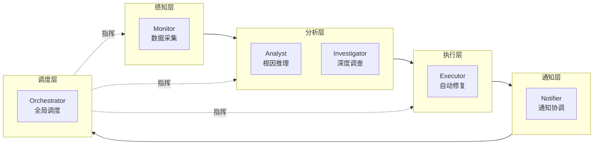
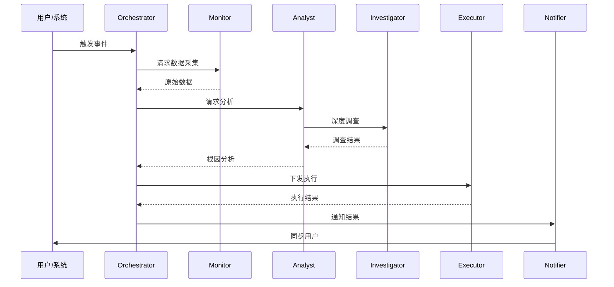
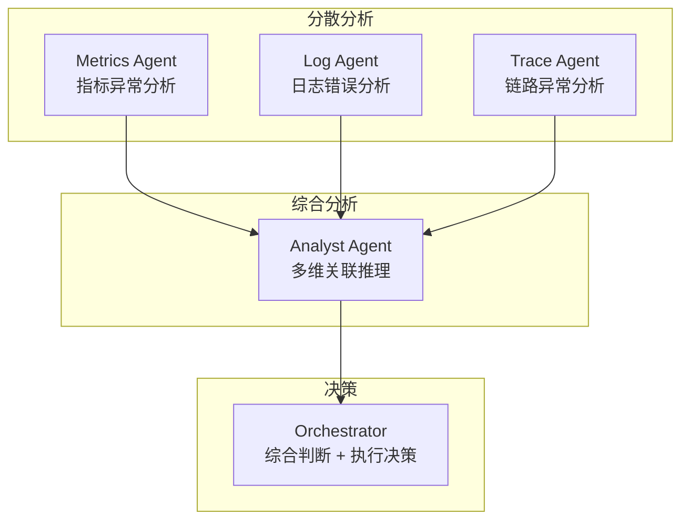
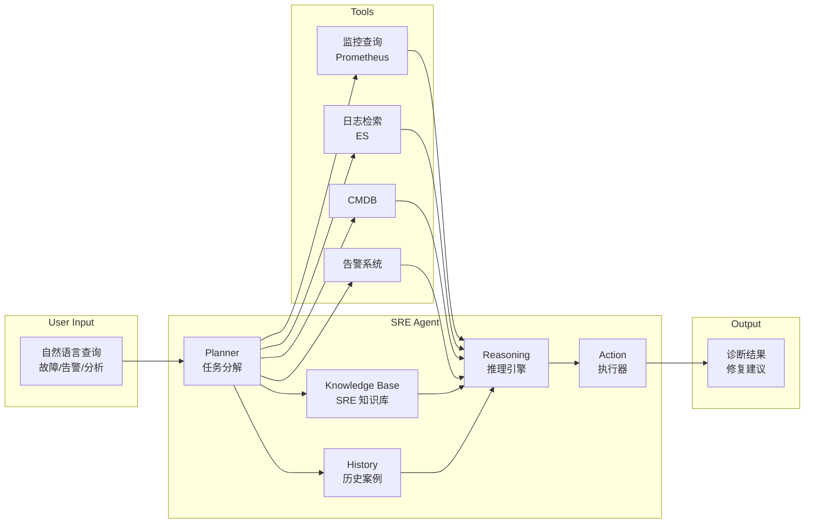
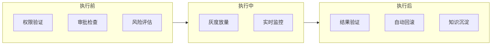

# 3.4 SRE Agent 与智能运维 Agent 架构

> 本章节为 Agent 协作体系和智能决策模块提供技术参考，详解 SRE Agent 架构、多 Agent 协作模式、LLM 工具调用范式，与本方案 6 类 Agent 的映射关系。

---

## 1. SRE Agent 概述

### 1.1 什么是 SRE Agent

SRE Agent 是将 LLM 应用于 Site Reliability Engineering 场景的智能体系统，能够自主完成故障发现→根因定位→修复决策→执行反馈的完整闭环。

### 1.2 SRE Agent vs 传统 AIOps

| 维度 | 传统 AIOps | SRE Agent |
|------|-------------|-----------|
| **核心引擎** | ML 模型（XGBoost/LSTM） | LLM（GPT-4/Claude/LLaMA） |
| **知识表示** | 特征工程 + 知识图谱 | 语义嵌入 + Prompt |
| **交互方式** | API / Dashboard | 对话式 / 自然语言 |
| **推理能力** | 统计关联 / 模式匹配 | 因果推断 / 跨域推理 |
| **适应新场景** | 需重新训练 | 零样本 / 少样本 |
| **可解释性** | SHAP 等模型解释 | 推理过程可追溯 |

---

## 2. 本方案 6 类 Agent 详解

### 2.1 Agent 类型总览

| Agent | 层级 | 职责 | 核心工具 |
|------|------|------|----------|
| **Orchestrator** | 调度层 | 全局调度与决策 | 任务调度器、决策引擎 |
| **Monitor Agent** | 感知层 | 数据采集与异常检测 | 指标查询、日志检索、告警订阅 |
| **Analyst Agent** | 分析层 | 根因分析与知识推理 | KG 查询、因果推理、向量检索 |
| **Investigator Agent** | 分析层 | 深度调查与取证 | 链路追踪、日志挖掘、Trace 分析 |
| **Executor Agent** | 执行层 | 自动修复与操作执行 | 脚本执行、API 调用、K8s 操作 |
| **Notifier Agent** | 通知层 | 通知与协调 | 邮件、企业微信、审批流 |

### 2.2 Agent 分层架构



### 2.3 协作时序



### 2.4 Agent 通信协议

Agent 之间通过统一消息格式通信，确保可追溯和可审计：

```python
# Agent 消息协议
class AgentMessage:
    def __init__(self, msg_id, sender, receiver, msg_type, payload, trace_id):
        self.msg_id = msg_id        # 全局唯一消息 ID
        self.sender = sender        # 发送 Agent 名
        self.receiver = receiver    # 接收 Agent 名
        self.msg_type = msg_type    # request / response / event / error
        self.payload = payload      # 消息体（JSON）
        self.trace_id = trace_id    # 全局 Trace ID（关联故障）
        self.timestamp = now()

# 消息类型定义
MSG_TYPES = {
    "query":       "请求数据/分析",
    "result":      "返回结果",
    "command":     "下发执行指令",
    "status":      "状态同步",
    "error":       "错误上报",
    "escalate":    "升级（Agent 无法处理）",
}
```

### 2.5 Agent 状态管理

| 状态 | 说明 | 超时处理 |
|------|------|----------|
| **idle** | 空闲，等待任务 | — |
| **busy** | 正在执行任务 | 30s 无响应 → 超时重试 |
| **blocked** | 等待上下游 Agent 结果 | 60s 无响应 → 超时升级 |
| **error** | 执行出错 | 上报 Orchestrator |
| **escalated** | 已升级给人工 | 等待人工确认 |

---

## 3. 多 Agent 协作模式

### 3.1 三种协作模型

| 模式 | 说明 | 适用场景 | 复杂度 |
|------|------|----------|--------|
| **串行管道** | A→B→C 顺序执行 | 固定流程（告警→分析→执行） | 低 |
| **并行扇出** | A 同时调用 B、C、D | 多源数据采集 | 中 |
| **层级收敛** | 多个下层 Agent 结果汇总到上层 | 多维度分析→综合判断 | 高 |

### 3.2 层级收敛模式详解



### 3.3 Agent 间知识共享

| 共享方式 | 存储 | 更新策略 | 适用场景 |
|----------|------|----------|----------|
| **共享上下文** | Redis（TTL 30min） | 故障期间共享 | 同一故障的实时协作 |
| **知识图谱** | Neo4j | 持久化 | 长期知识积累 |
| **案例库** | ES / 向量库 | 故障复盘后写入 | 历史故障模式匹配 |
| **会话记忆** | Agent 本地内存 | 当前会话 | 多轮交互上下文 |

---

## 4. SREAgent（北大）架构解析

**论文：** SREAgent: Large Language Model Agents for Site Reliability Engineering (2024)

### 4.1 核心架构



### 4.2 核心 Prompt 示例

```python
ANALYSIS_PROMPT = """
你是一个 SRE 专家。根据以下信息分析故障：

## 当前告警
{alert_info}

## 指标数据
{metrics}

## 日志摘要
{logs}

## 调用链
{traces}

请分析：
1. 可能的原因（Top 3）
2. 影响范围
3. 建议的修复步骤
4. 需要通知的人员

请用结构化格式输出。
"""
```

---

## 5. LLM 工具调用范式

### 5.1 ReAct 范式

**思想：** 推理（Reasoning）+ 行动（Action）交替进行。

```python
def react_agent(query, tools, max_steps=5):
    """ReAct Agent 简版"""
    thought = llm(f"思考：{query}")
    for step in range(max_steps):
        action = llm(f"{thought}\n选择工具：{list(tools.keys())}")
        result = tools[action['name']](**action['params'])
        thought = llm(f"思考：{thought}\n行动结果：{result}")
        if is_final_answer(thought):
            return extract_answer(thought)
    return "无法完成"
```

### 5.2 工具注册与调用

```python
# 工具定义
TOOLS = {
    "query_metrics": {
        "description": "查询 Prometheus 指标",
        "params": ["query", "time_range"],
        "returns": "指标数据列表"
    },
    "search_logs": {
        "description": "检索日志",
        "params": ["query", "time_range"],
        "returns": "日志列表"
    },
    "kg_query": {
        "description": "查询知识图谱",
        "params": ["entity", "relation"],
        "returns": "关联实体列表"
    },
    "execute_script": {
        "description": "执行修复脚本",
        "params": ["script_id", "target"],
        "returns": "执行结果"
    }
}
```

### 5.3 工具调用验证与重试

```python
def tool_call_with_retry(tool_name, params, max_retries=2):
    """带验证和重试的工具调用"""
    for attempt in range(max_retries + 1):
        try:
            result = TOOLS[tool_name]['handler'](**params)
            # 验证结果格式
            if validate_result(tool_name, result):
                return result
            else:
                raise ValueError(f"结果格式异常: {result}")
        except Exception as e:
            if attempt == max_retries:
                return {"error": str(e), "retry_exhausted": True}
            params = auto_fix_params(tool_name, params, str(e))
    return {"error": "unreachable"}
```

### 5.4 模型路由策略

| 任务类型 | 推荐模型 | 原因 |
|----------|----------|------|
| 简单告警确认 | 小模型（7B） | 延迟低、成本低 |
| 指标趋势分析 | 小模型 + 规则 | 不需要复杂推理 |
| 根因推理 | 大模型（70B+） | 需要跨工具推理 |
| 修复决策 | 大模型 + 人工审批 | 高风险，需可解释 |
| 报告生成 | 大模型 | 结构化输出 |

---

## 6. Agent 评估体系

### 6.1 评估维度

| 维度 | 指标 | 目标 | 测量方式 |
|------|------|------|----------|
| **准确率** | Root Cause Hit Rate@3 | > 80% | 人工标注验证 |
| **覆盖率** | 可处理的故障场景比例 | > 90% | 历史故障回测 |
| **效率** | 端到端诊断延迟 | < 5min | 系统计时 |
| **安全性** | 误操作率 | < 0.1% | 执行日志审计 |
| **用户满意度** | 运维人员采纳率 | > 70% | 问卷调查 |
| **成本** | 单次故障诊断 LLM 成本 | < ¥5 | Token 计数 |

### 6.2 退化检测

Agent 上线后需持续监控效果退化：

| 退化信号 | 可能原因 | 检测方式 | 恢复动作 |
|----------|----------|----------|----------|
| 根因准确率下降 > 5% | 数据分布漂移 | 周度回测 | 模型重训练 |
| 工具调用失败率上升 | 上游 API 变更 | 实时监控 | 工具定义更新 |
| 用户采纳率下降 | 结果质量下降 | 月度问卷 | Prompt 优化 |
| 诊断延迟增加 | 模型推理变慢 | 性能监控 | 模型路由调整 |

---

## 7. 自动化响应安全机制

### 7.1 五层安全护栏



### 7.2 响应策略分级

| 策略 | 触发条件 | 审批要求 | 风险等级 |
|------|----------|----------|----------|
| 自动恢复 | 已知错误 + 低风险 | 无 | 低 |
| 限流降级 | 流量异常 + 已知原因 | 自动审批 | 低 |
| 弹性伸缩 | 资源不足 + 低风险 | 自动审批 | 中 |
| 人工介入 | 未知错误 + 高不确定性 | 必须审批 | 高 |
| 紧急止损 | 重大故障 + 业务中断 | 快速审批 | 极高 |

---

## 8. 落地关键挑战

| 挑战 | 描述 | 应对策略 |
|------|------|----------|
| **幻觉** | LLM 生成错误故障原因 | 工具调用验证 + 置信度过滤 |
| **时效性** | 运维知识快速变化 | RAG + 实时知识库更新 |
| **安全风险** | 自动化执行可能造成事故 | 审批机制 + 灰度执行 + 回滚 |
| **延迟** | LLM 推理耗时 | 流式输出 + 缓存 + 模型路由 |
| **成本** | 大模型调用成本高 | 小模型处理简单场景，大模型处理复杂推理 |
| **评估** | Agent 效果难以量化 | 6 维评估体系 + 周度退化检测 |

