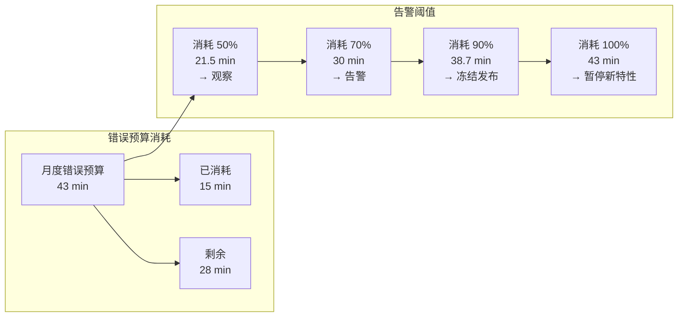
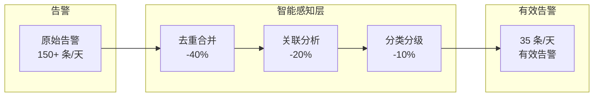

# 3.5 评估框架与落地检查清单

> 本章节为方案评估和落地提供量化框架，覆盖 SLO/SLI 设计、效果评估指标、ROI 计算器、错误预算管理、风险评估矩阵以及各模块落地检查清单。

---

## 1. SLO/SLI 设计

### 1.1 核心概念

| 概念 | 定义 | 示例 |
|------|------|------|
| **SLI**（服务等级指标） | 实际测量的服务质量 | 请求延迟、可用率、错误率 |
| **SLO**（服务等级目标） | 目标服务质量 | P99 < 200ms、可用率 > 99.9% |
| **SLA**（服务等级协议） | 与客户的书面协议 | 99.95% 可用率 + 赔偿条款 |
| **错误预算** | 允许的故障时间 | 99.9% SLO → 每月 43min 错误预算 |

### 1.2 本方案 SLO 目标

| 阶段 | 指标 | 目标值 | 当前行业水平 |
|------|------|--------|--------------|
| **1分钟发现** | MTTD | < 1 分钟 | 5 分钟 |
| **5分钟定位** | MTTR | < 5 分钟 | 30 分钟 |
| **10分钟恢复** | 平均恢复时间 | < 10 分钟 | 2 小时 |
| **告警准确率** | Precision | > 80% | 30% |
| **根因准确率** | Hit Rate@3 | > 80% | 50% |
| **自动化率** | 自动修复占比 | > 80% | 20% |

### 1.3 SLI 采集规范

```python
def calculate_availability(window='30d'):
    """可用率 SLI"""
    good_events = query("""
        SELECT count(*) FROM events
        WHERE status='resolved'
        AND duration < 5min
        AND timestamp > now() - {window}
    """)
    total_events = query("""
        SELECT count(*) FROM events
        WHERE timestamp > now() - {window}
    """)
    return good_events / total_events if total_events > 0 else 1.0

def calculate_latency_p99(window='1h'):
    """延迟 SLI (P99)"""
    latencies = query("""
        SELECT latency_ms FROM request_metrics
        WHERE timestamp > now() - {window}
        ORDER BY latency_ms
    """)
    return np.percentile(latencies, 99)
```

---

## 2. 错误预算管理

### 2.1 错误预算消耗与告警



| 消耗比例 | 状态 | 团队动作 |
|----------|------|----------|
| < 50% | 🟢 健康 | 正常迭代 |
| 50% - 70% | 🟡 关注 | 排查近期故障根因 |
| 70% - 90% | 🟠 告警 | 组建专项改进小组 |
| 90% - 100% | 🔴 严重 | 暂停新功能发布，集中改进 |
| > 100% | ⚫ 预算耗尽 | SLO 未达标，需调整目标或投入 |

### 2.2 多层级 SLO

| 层级 | SLO 目标 | 错误预算/月 | 告警阈值 |
|------|----------|-------------|----------|
| **Tier 0**（核心交易） | 99.99% | 4.3 min | 消耗 30% 告警 |
| **Tier 1**（重要业务） | 99.95% | 21.5 min | 消耗 50% 告警 |
| **Tier 2**（基础服务） | 99.9% | 43 min | 消耗 70% 告警 |
| **Tier 3**（工具/辅助） | 99.5% | 3.6 h | 消耗 80% 告警 |

---

## 3. 效果评估指标体系

### 3.1 五大评估维度

| 维度 | 核心指标 | 目标 | 度量方式 |
|------|----------|------|----------|
| **速度** | MTTD / MTTR | 1-5-10 | 每次故障记录 |
| **智能** | 根因准确率 / 知识覆盖率 | > 80% | 人工复核 |
| **效率** | 自动化率 / 告警压缩率 | > 80% / > 70% | 系统统计 |
| **质量** | 误报率 / 漏报率 | < 20% / < 5% | 告警确认记录 |
| **进化** | 模型迭代周期 / 知识增长率 | < 7d / > 10%/月 | 系统统计 |

### 3.2 告警质量评估



**评估公式：**
- 告警压缩率 = (原始告警 - 有效告警) / 原始告警 × 100%
- 误报率 = 人工判定为误报 / 有效告警 × 100%
- 漏报率 = 未检测到的故障 / 实际发生的故障 × 100%

---

## 4. ROI 计算器

### 4.1 收益计算

| 收益项 | 计算方式 | 年化收益（示例） |
|--------|----------|------------------|
| 故障损失减少 | (原 MTTR - 新 MTTR) × 故障次数 × 故障成本/分钟 | 960 万/年 |
| 人力成本节约 | 减少的告警处理工时 × 人力成本 | 360 万/年 |
| 自动化效率 | 自动化节省的工时 × 成本 | 200 万/年 |
| **总收益** | — | **1520 万/年** |

### 4.2 投入计算

| 投入项 | 一次性 | 持续（年） |
|--------|--------|------------|
| 平台建设 | 200 万 | — |
| 集成对接 | 50 万 | — |
| 培训 | 10 万 | 5 万/年 |
| 运维人力 | — | 100 万/年 |
| **总投入** | 260 万 | 105 万/年 |

### 4.3 ROI 计算

```
年化 ROI = (年化总收益 - 年持续投入) / 总一次性投入 × 100%
         = (1520 - 105) / 260 × 100%
         = 544%
投资回收期 = 总一次性投入 / (月均收益 - 月均持续投入)
           = 260 / ((1520/12) - (105/12))
           ≈ 2.2 个月
```

---

## 5. 风险评估矩阵

### 5.1 风险评估标准

| 风险等级 | 描述 | 发生概率 | 影响程度 | 处理策略 |
|----------|------|----------|----------|----------|
| **L1 低** | 不影响核心指标 | < 10% | 单节点 | 记录，定期优化 |
| **L2 中** | 部分业务受损 | 10-30% | 多实例 | 自动恢复 + 通知 |
| **L3 高** | 核心功能受损 | 30-50% | 集群级 | 自动切换 + 人工介入 |
| **L4 严重** | 大规模不可用 | > 50% | 多集群 | 立即止损 + 最高优先级 |

### 5.2 典型场景风险评估

| 场景 | 风险等级 | 概率 | 影响 | 应对 |
|------|----------|------|------|------|
| 单 Pod OOM | L1 | 高 | 低 | K8s 自动重启 |
| 单 DB 慢查询 | L2 | 中 | 中 | 熔断限流 + 通知 DBA |
| 核心服务扩缩容异常 | L3 | 低 | 高 | 预案执行 + 审批 |
| 多 AZ 网络故障 | L4 | 极低 | 极高 | 自动切流 + 故障升级 |
| 配置中心宕机 | L3 | 低 | 高 | 本地缓存 + 人工恢复 |

---

## 6. 落地优先级矩阵

### 6.1 优先级判定

| 优先级 | 业务价值 | 实施难度 | 典型模块 |
|--------|----------|----------|----------|
| **P0** | 高 | 低 | 数据融合（已有基础设施） |
| **P1** | 高 | 中 | 智能感知、拓扑建模 |
| **P2** | 中 | 中 | 根因分析、影响分析 |
| **P3** | 中 | 高 | 认知网络、知识进化 |
| **P4** | 低 | 高 | 自动执行（需完善审批机制） |

### 6.2 分阶段落地路径

```
第 1 月（P0）：数据采集标准化 → 统一 Dashboard
第 2-3 月（P1）：异常检测上线 → 告警降噪
第 4-6 月（P2）：根因分析 → 影响分析
第 7-9 月（P3）：知识图谱构建 → 认知网络
第 10-12 月（P4）：自动执行 → 知识进化闭环
```

---

## 7. 持续评估机制

### 7.1 评估节奏

| 周期 | 评估内容 | 负责人 | 输出 |
|------|----------|--------|------|
| **每日** | 核心 SLI 自动检查 | 系统 | 日报 |
| **每周** | 告警质量 + 误报漏报分析 | SRE 团队 | 周报 |
| **每月** | 错误预算消耗 + ROl 跟踪 | 技术负责人 | 月报 |
| **每季** | 根因准确率回测 + 模型退化检测 | 算法团队 | 季度报告 |
| **每年** | 整体 ROl 复盘 + 下一年规划 | 管理层 | 年度报告 |

### 7.2 效果看板设计

```
┌─────────────────────────────────────────────┐
│  SRE Dashboard                                │
├──────────┬──────────┬──────────┬──────────────┤
│ MTTD     │ MTTR     │ 告警压缩率 │ 自动化率     │
│ 45s 🟢   │ 3.2min 🟢│ 72% 🟢   │ 65% 🟡      │
│ 目标 <1min│ 目标 <5min│ 目标 >70%│ 目标 >80%    │
├──────────┴──────────┴──────────┴──────────────┤
│ 错误预算消耗：Tier0 12% 🟢 / Tier1 38% 🟡    │
│ 根因准确率 Hit Rate@3：76% 🟡（下降趋势）     │
│ ROI 跟踪：累计收益 380 万，投入 150 万        │
└─────────────────────────────────────────────┘
```

---

## 8. 落地检查清单

### 8.1 Phase 1 — 数据采集（对应模块：数据融合）

- [ ] 指标数据接入（Prometheus / OpenTelemetry）
- [ ] 日志数据接入（ELK / Loki）
- [ ] 调用链数据接入（Jaeger / Tempo）
- [ ] 事件数据接入（变更事件 + 告警事件）
- [ ] 数据标准化（统一 schema）
- [ ] 数据质量监控（完整率 > 99%）

### 8.2 Phase 2 — 感知层（对应模块：智能感知）

- [ ] 异常检测算法部署（统计 / ML）
- [ ] 告警规则配置
- [ ] 告警去重合并逻辑
- [ ] 告警分类分级
- [ ] 告警路由配置
- [ ] 感知延迟 < 1s

### 8.3 Phase 3 — 认知层（对应模块：认知网络）

- [ ] CMDB 接入（拓扑数据）
- [ ] 知识图谱构建（实体 + 关系）
- [ ] 图数据库部署（Neo4j）
- [ ] 向量索引配置（RAG）
- [ ] 推理引擎验证
- [ ] 知识覆盖率 > 80%

### 8.4 Phase 4 — 分析层（对应模块：根因分析 + 影响分析）

- [ ] 拓扑关系导入
- [ ] PageRank / 最短路径算法部署
- [ ] 因果推断算法（如需要）
- [ ] 根因准确率验证（Hit Rate@3 > 80%）
- [ ] 影响范围计算
- [ ] MRR > 0.7

### 8.5 Phase 5 — 决策与执行（对应模块：智能决策 + 自动执行）

- [ ] 决策引擎配置
- [ ] 执行剧本编写
- [ ] 审批工作流配置
- [ ] 灰度执行配置
- [ ] 自动回滚验证
- [ ] 自动化率 > 80%

### 8.6 Phase 6 — 知识进化（对应模块：知识进化）

- [ ] 故障案例自动沉淀
- [ ] 知识图谱更新机制
- [ ] ML 模型迭代机制
- [ ] 知识质量审核
- [ ] 进化周期 < 24h

---

## 9. 效果验证方法

### 9.1 验证实验设计

| 实验类型 | 方法 | 适用场景 |
|----------|------|----------|
| **A/B 测试** | 新旧系统对比 | 告警准确率、MTTR |
| **Chaos 测试** | 注入故障验证检测 | 根因定位准确性 |
| **回滚测试** | 执行后回滚验证 | 自动执行安全性 |
| **长稳测试** | 长期运行观测 | 系统稳定性 |
| **压力测试** | 模拟极端流量 | 容量规划验证 |

### 9.2 关键阈值告警

| 指标 | 阈值 | 动作 |
|------|------|------|
| MTTD | > 3 分钟 | 告警：检测延迟 |
| MTTR | > 10 分钟 | 告警：恢复超时 |
| 根因准确率 | < 70% | 告警：模型退化 |
| 自动化成功率 | < 90% | 告警：执行异常 |
| 错误预算消耗 | > 70% | 告警：预算紧张 |

